# 微服务 · 注册中心与服务发现

> ZK / Eureka / Nacos / etcd / Consul 对比 / 心跳机制 / 健康检查 / 客户端发现 vs 服务端发现 / CAP 取舍

## 〇、多概念对比：5 大注册中心（D 模板）

### 一句话定位

| 注册中心 | 一句话定位 |
| --- | --- |
| **ZooKeeper** | **CP 老牌**（ZAB 协议），强一致 + 临时节点 + Watch，**Hadoop 生态原生**，性能中等 |
| **Eureka** | **Netflix 出品的 AP**，自我保护机制，简单但**已停止主要开发**（2.x 闭源）|
| **Nacos** | **阿里出品的 AP/CP 双模式**，配置中心 + 注册中心**二合一**，国内主流 |
| **etcd** | **CP（Raft）**，K8s 生态原生，**v3 性能优秀**，云原生标配 |
| **Consul** | **CP（Raft）+ 健康检查丰富**，HashiCorp 出品，多数据中心原生支持 |

### 多维度对比（16 维度，必背）

| 维度 | ZooKeeper | Eureka | Nacos | etcd | Consul |
| --- | --- | --- | --- | --- | --- |
| **出品方** | Apache（Yahoo）| Netflix（停止主开发）| 阿里 | CoreOS → CNCF | HashiCorp |
| **CAP** | **CP** | **AP** | **AP / CP 可切换** | **CP** | **CP** |
| **共识协议** | ZAB（类 Paxos）| 无（节点 P2P 同步）| Raft（CP 时）/ Distro（AP 时）| Raft | Raft |
| **健康检查** | 临时节点（Session）| Client 心跳（30s）| 心跳 + TCP/HTTP/MySQL 主动探测 | Lease 续约 | **多种**（TCP/HTTP/gRPC/脚本）|
| **数据模型** | 树形节点 | 服务 + 实例 | 服务 + 实例 + 配置 | KV（v3）| KV + 服务目录 |
| **配置中心** | 弱（节点存储）| ❌ | ✅ **二合一** | 弱（KV 存储）| ✅ |
| **多数据中心** | 弱 | 弱 | ✅ | 弱 | ✅ **原生支持** |
| **性能（写）** | ~万级 QPS | 高（弱一致）| **5w+ QPS**（AP 模式）| **1-2w QPS** | 1w QPS |
| **性能（读）** | 5w+ | 高 | 高 | 10w+ | 高 |
| **客户端 Go 支持** | go-zookeeper（弱）| 无好的 Go 客户端 | nacos-sdk-go | clientv3（**官方推荐**）| consul/api |
| **特色功能** | Watch + 临时顺序节点 | 自我保护模式 | 配置 + 注册 + DNS + 服务治理 | gRPC API + Lease + Watch | 多 DC + ACL + 健康检查 |
| **K8s 集成** | 弱（外挂）| 弱 | 中 | ✅ **原生（K8s 自用）** | 弱 |
| **国内活跃度** | 中（老牌）| 低（停更）| **极高**（Spring Cloud Alibaba）| 高（云原生）| 中 |
| **代表用户** | Hadoop / Kafka（早期）| Netflix / Spring Cloud（早期）| 阿里 / 滴滴 / 美团 | K8s / TiDB / CoreOS | HashiCorp 生态 |
| **典型部署** | 3/5 节点 | 集群 P2P | 3 节点 | 3/5 节点 | 3/5 节点 |
| **学习曲线** | 中 | 低 | 低 | 中 | 中 |

### 协作时序对比（服务注册 → 发现 → 调用）

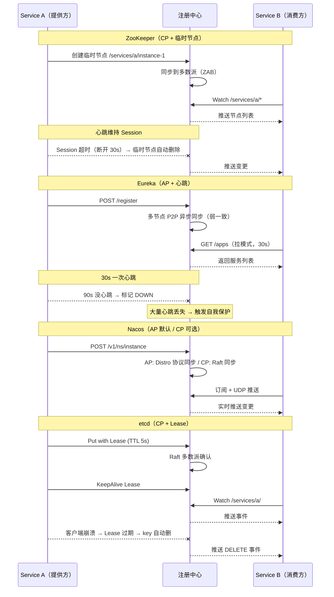

### 缺一不可分析

| 假设 | 后果 |
| --- | --- |
| **没 ZooKeeper** | 大数据生态（Kafka 旧版 / HBase / Hadoop）失去元数据协调 |
| **没 Eureka** | Spring Cloud 早期生态没注册中心（现在已被 Nacos 替代）|
| **没 Nacos** | 国内 Spring Cloud Alibaba 失去**配置 + 注册一体化**最佳方案 |
| **没 etcd** | K8s / TiDB / CoreOS 失去**云原生协调存储**事实标准 |
| **没 Consul** | 多数据中心 + ACL 严格场景失去最佳实践 |

### CAP 选择深度对比

```
CP 注册中心（ZK / etcd / Consul）:
  特征: 写多数派同步 / 分区时少数派不可用 / 数据强一致
  优势: 服务列表准确 / 配置中心场景适合
  劣势: 性能受 Raft 限制 / 分区时部分服务不可见

AP 注册中心（Eureka / Nacos AP）:
  特征: 节点异步同步 / 任一节点都可读写 / 分区时可用
  优势: 高可用（注册中心挂不影响调用）/ 写性能高
  劣势: 数据可能不一致 / 配置中心不适合

业内共识:
  服务注册 → AP（短暂不一致 OK）
  配置中心 → CP（不能容忍不一致）
  → Nacos 双模式是最佳实践
```

### Eureka 自我保护机制（独有特色）

```
触发条件:
  上一分钟心跳数 < 期望的 85% → 触发自我保护

行为:
  不再剔除"看起来已下线"的节点
  → 防止网络抖动导致大面积误剔除

权衡:
  ✓ 网络分区时不误剔除好节点
  ✗ 真正下线的节点也不会被剔除 → 调用可能失败

业内评价:
  自我保护"保护过度"，实际生产体验一般
  → Nacos / etcd 没有这个机制（用更准的健康检查）
```

### 怎么选（决策树）

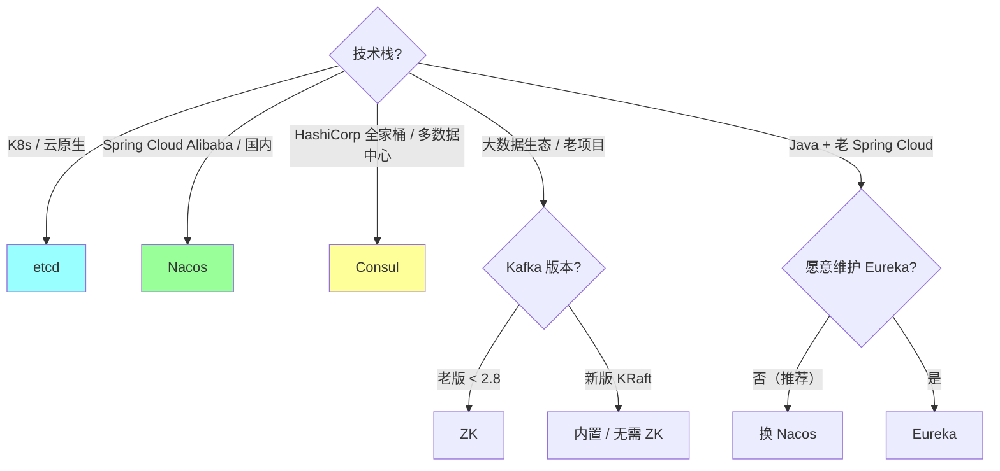

**实战推荐**：

| 场景 | 推荐 | 备注 |
| --- | --- | --- |
| K8s 微服务 | **etcd**（K8s 自用）| 用 K8s API 就够 |
| Spring Cloud Alibaba | **Nacos** | 国内最活跃 |
| 多数据中心 + ACL | **Consul** | 原生 DC 支持 |
| 老 Kafka / HBase | **ZooKeeper** | 历史包袱 |
| 新 Kafka 2.8+ | **KRaft 内置** | 无需 ZK |
| 老 Spring Cloud | **建议迁移到 Nacos** | Eureka 停更 |

### 反模式

```
❌ 服务注册用 ZK 但以为是 AP → 网络抖动导致服务列表大面积下线
❌ 用 Eureka 做配置中心 → 弱一致导致配置不同步
❌ etcd 集群部署 < 3 节点 → 任一挂掉 = 集群挂
❌ Nacos 单机部署用于生产 → 单点故障
❌ 心跳间隔太长（≥ 30s）→ 服务下线感知慢
❌ 心跳间隔太短（< 5s）→ 注册中心压力大
```

### 一句话总结（D 模板专属）

> 5 大注册中心的核心是 **"CAP 选择 + 生态绑定"**：
> **CP 阵营**（ZK / etcd / Consul）强一致适合配置 + 元数据，**AP 阵营**（Eureka / Nacos）高可用适合服务注册。
> **Nacos 双模式**（AP/CP 可切换）是国内最佳实践，**etcd 是云原生标配**（K8s 自用），**Consul 多 DC 原生**。
> **缺一不可**：ZK 大数据、etcd 云原生、Nacos 国内 SCA、Consul 多 DC、Eureka 已成历史。
> **业内现状**：80% 国内 Java 用 Nacos，云原生 / Go 服务用 etcd，多数据中心选 Consul。

---

## 一、为什么需要注册中心

### 1.1 没有注册中心的世界

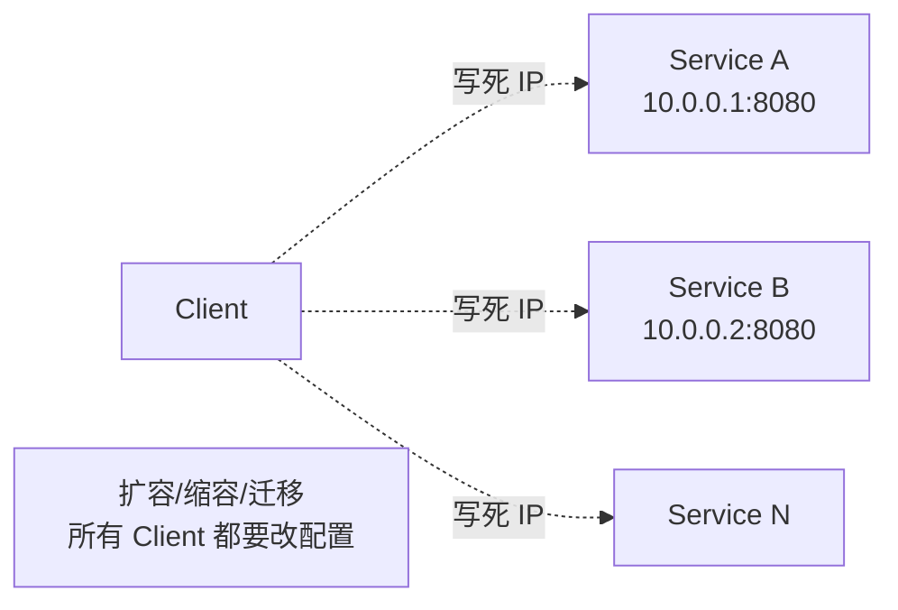

**痛点**：
- 服务实例动态变化（K8s pod 随时起停）
- 配置维护爆炸（N 个客户端 × M 个服务）
- 无法做负载均衡 / 故障转移

### 1.2 有注册中心

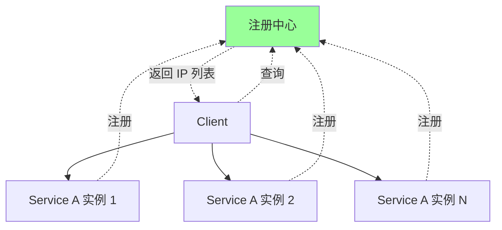

**核心能力**：
1. **服务注册**：服务实例上线/下线时通知
2. **服务发现**：客户端查询可用实例列表
3. **健康检查**：剔除故障实例
4. **元数据**：版本、权重、标签等

## 二、服务发现的两种模式

### 2.1 客户端发现（Client-Side Discovery）

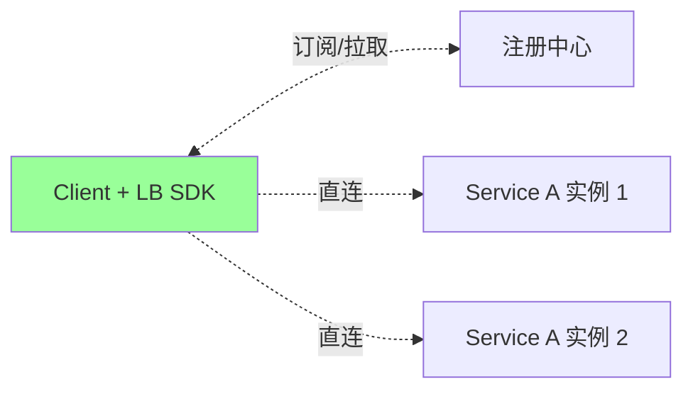

**流程**：
1. 客户端从注册中心拉取实例列表（缓存本地）
2. 客户端用 LB 算法（轮询/随机/P2C）选一个实例
3. 客户端直连实例

**代表**：Dubbo / Kitex / gRPC 自带 LB / go-zero

**优点**：
- 无中间节点，性能高
- 客户端可定制 LB 策略
- 注册中心挂了，缓存还能用一段时间

**缺点**：
- 客户端 SDK 复杂
- 多语言异构需要每语言一份 SDK

### 2.2 服务端发现（Server-Side Discovery）

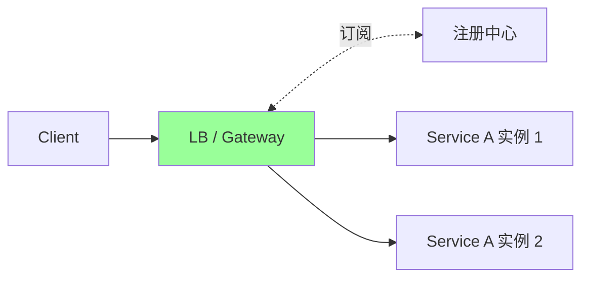

**流程**：
1. LB（Nginx/网关/K8s Service）从注册中心拉实例
2. 客户端只调 LB
3. LB 转发请求

**代表**：K8s Service + kube-dns / AWS ALB / Nginx + Consul-Template

**优点**：
- 客户端简单（只调一个 URL）
- 多语言无差别

**缺点**：
- 多一跳网络
- LB 是单点（要做高可用）

### 2.3 实战选择

| 场景 | 推荐 |
| --- | --- |
| Go/Java 微服务（同语言） | **客户端发现** |
| 多语言异构 | 服务端发现（K8s） |
| HTTP API | 服务端（K8s Service） |
| RPC（gRPC/Thrift） | 客户端 |

## 三、五大注册中心对比

### 3.1 对比一览

| | ZooKeeper | Eureka | Nacos | etcd | Consul |
| --- | --- | --- | --- | --- | --- |
| **CAP** | CP | AP | AP/CP 可切 | CP | CP（默认）/AP |
| **协议** | ZAB | HTTP REST | HTTP/gRPC | Raft + gRPC | Raft + HTTP |
| **健康检查** | TCP 心跳 | 客户端心跳 | 多种 | TTL/lease | 多种（HTTP/TCP/Script） |
| **多 DC** | 不支持 | 支持 | 支持 | 不友好 | 原生支持 |
| **配置中心** | ❌ | ❌ | ✅ | ✅ | ✅ |
| **K8s 友好** | 一般 | 一般 | 一般 | ✅ 原生 | 一般 |
| **语言** | Java | Java | Java/Go | Go | Go |
| **代表用户** | 老牌 Dubbo | Netflix | 阿里 | K8s/etcd-io | HashiCorp |
| **维护状态** | 活跃 | 已停更 | 活跃 | 活跃 | 活跃 |

### 3.2 ZooKeeper（CP 阵营）

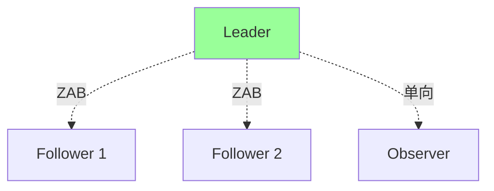

**特点**：
- 强一致（CP）：写入要超过半数节点确认
- ZAB 协议（类 Paxos）
- 节点挂超过半数 → **不可用**（牺牲 A）
- 监听机制（Watch）

**适合**：强一致需求（分布式锁、配置）

**痛点**：
- Leader 选举期间不可用（30s+）
- 性能有限（写依赖共识）
- 大规模集群有压力

**典型用户**：早期 Dubbo（很多公司在替换为 Nacos）

### 3.3 Eureka（AP 阵营，已停更）

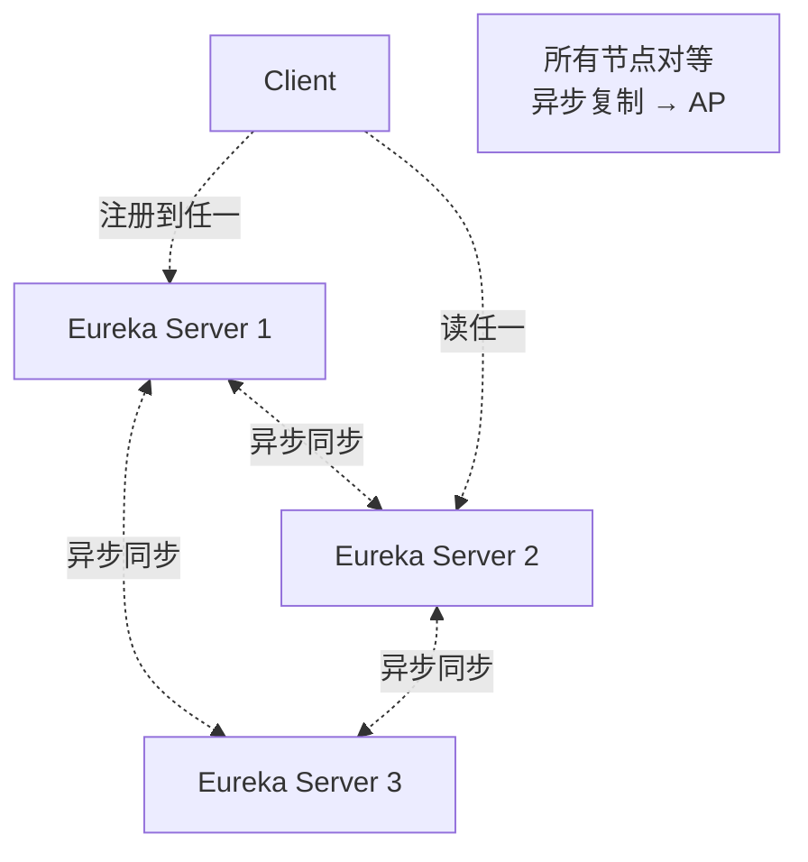

**特点**：
- AP 阵营：可用性优先
- 节点对等（任一节点都可读写）
- 自我保护机制（防误删）
- 客户端缓存

**适合**：互联网业务，宁可短暂不一致也要可用。

**问题**：
- Netflix 已停更（2018 年）
- Spring Cloud 改推 Consul / Nacos
- 自我保护可能误判

### 3.4 Nacos（AP/CP 都行）

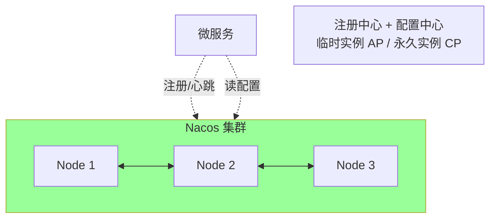

**特点**：
- 注册 + 配置一体（详见 [03-config-center.md](03-config-center.md)）
- AP（临时实例，默认）+ CP（永久实例）可选
- 阿里开源，国内最流行
- 多数据中心
- Spring Cloud Alibaba 主推

**实战**：
- 微服务实例 → 临时 AP（高可用）
- 数据库/MQ 等基础设施 → 永久 CP（强一致）

### 3.5 etcd（K8s 标配）

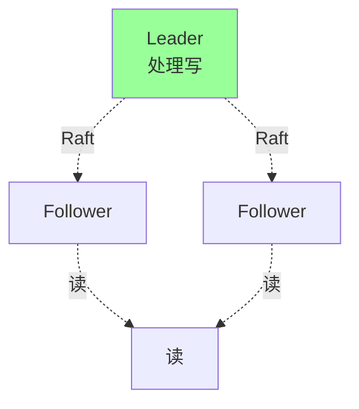

**特点**：
- Raft 协议（强一致 CP）
- gRPC 接口（go-friendly）
- 高性能（10K+ QPS）
- K8s 内部用（自带高可用）
- TTL/Lease 机制
- 监听（Watch）

**适合**：
- K8s 生态
- 强一致 + 高性能
- 服务注册（K8s Service 就是基于 etcd）

**痛点**：
- 写操作性能受 Raft 限制
- 大集群（万级 key）需要调优
- 多 DC 不友好

### 3.6 Consul

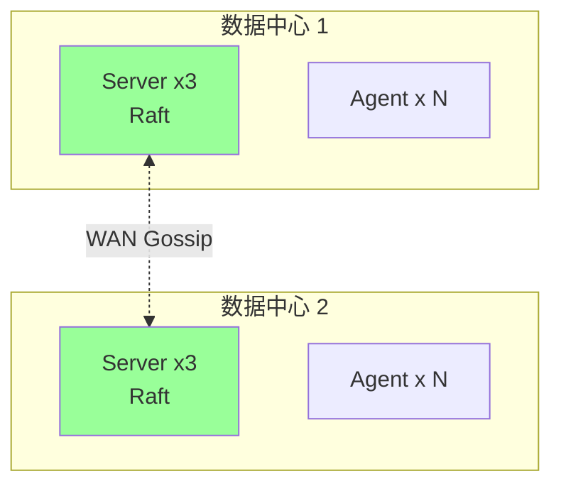

**特点**：
- HashiCorp 出品，云原生方案
- Raft 协议（CP，可调 AP）
- **多数据中心原生**支持（WAN Gossip）
- 健康检查丰富（HTTP/TCP/Script/Docker）
- 内置 KV 存储（可做配置）
- DNS 接口（无需 SDK）

**适合**：
- 多机房 / 多云
- 与 HashiCorp 生态（Vault / Nomad / Terraform）

### 3.7 选型建议

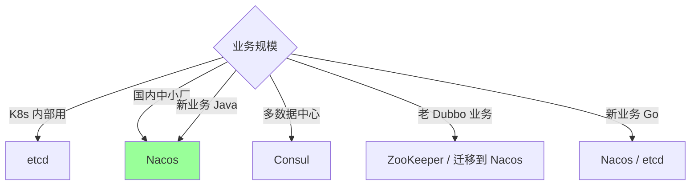

**经验**：
- **K8s 已成主流** → 用 K8s Service + DNS 即可，不用单独注册中心
- **国内 Java** → Nacos
- **多机房 / 全球** → Consul
- **老 Dubbo 仓库** → 慢慢迁 Nacos

## 四、心跳与健康检查

### 4.1 两种检测模式

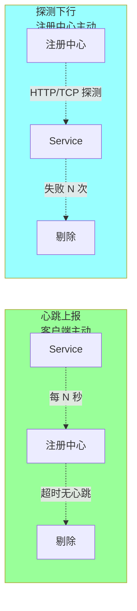

| | 心跳 | 探测 |
| --- | --- | --- |
| 主动方 | Client | 注册中心 |
| 网络方向 | 上行 | 下行 |
| 服务负担 | 低（自报） | 中（要响应） |
| 准确性 | 中（GC pause 误报） | 高（真实可达） |
| 代表 | Eureka / Nacos | Consul |

**实战**：很多注册中心**两种结合用**（Nacos / Consul）。

### 4.2 心跳的关键参数

```
心跳间隔: 5s（默认 Nacos）
失活阈值: 3 次未收到 = 不健康
摘除阈值: 30s 未收到 = 摘除
保护机制: 集群级失活 > 80% → 自我保护，不摘除
```

**经验**：
- 间隔太短 → 注册中心压力大
- 间隔太长 → 故障感知慢
- 5-10s 是常见值

### 4.3 自我保护机制

```
场景: 网络抖动 → 大量服务"失联" → 全部摘除 → 雪崩

Eureka/Nacos 的保护:
  集群层失活实例 > 总数 N% → 进入保护模式
  → 不摘除任何实例 (宁可调到死实例，也不让所有实例都没有)
  → 等待网络恢复
```

**取舍**：保护避免雪崩，但可能调到死实例（客户端要有重试 + 熔断）。

### 4.4 K8s 的健康检查

K8s 用 **liveness / readiness probe**：

```yaml
livenessProbe:    # 死了重启
  httpGet: { path: /healthz, port: 8080 }
  periodSeconds: 10
  failureThreshold: 3

readinessProbe:   # 没准备好不接流量
  httpGet: { path: /ready, port: 8080 }
  periodSeconds: 5
  failureThreshold: 2
```

**两个 probe 的区别**：
- liveness：失败 → 重启 pod
- readiness：失败 → 从 Service 摘除（不重启）

**最佳实践**：
- liveness 检查最基础（进程能响应）
- readiness 检查所有依赖（DB / Redis / 下游服务）

## 五、注册中心的 CAP 取舍

### 5.1 P 一定有

P（Partition Tolerance）= 网络分区容错。**分布式系统必须有 P**，否则就是单机。

### 5.2 选 C 还是 A

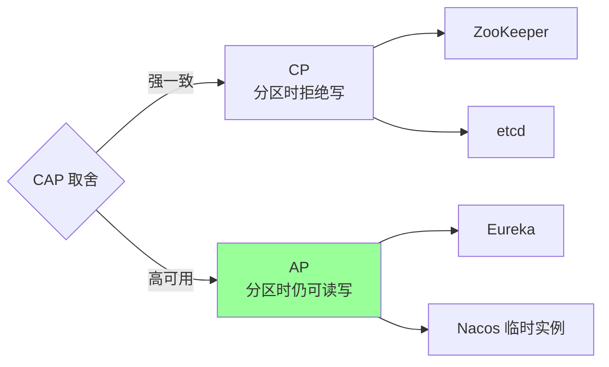

### 5.3 服务发现到底要 CP 还是 AP？

**Robert Vitek（Eureka 作者）观点**：服务发现必须 AP。

**理由**：
- 短暂不一致 OK（客户端缓存 + 重试 + 熔断兜底）
- 不可用 = 整个系统不可用
- 微服务场景，**可用性 > 一致性**

**主流共识**：
- 服务发现 → AP（Eureka / Nacos 临时实例）
- 配置中心 → CP（强一致更重要）

### 5.4 客户端缓存兜底

无论 CP 还是 AP，客户端都要做本地缓存：

```go
// 客户端缓存
type Cache struct {
    instances map[string][]Instance
    lastSync  time.Time
}

// 注册中心挂了 → 用缓存
func (c *Cache) Get(svc string) []Instance {
    if time.Since(c.lastSync) > 30*time.Second {
        // 尝试拉新
        if newList, err := registry.Pull(svc); err == nil {
            c.instances[svc] = newList
            c.lastSync = time.Now()
        }
        // 失败也用旧缓存（**降级**）
    }
    return c.instances[svc]
}
```

**关键**：注册中心挂了，业务**降级运行**，不是直接挂。

## 六、ddd_order_example 接入注册中心

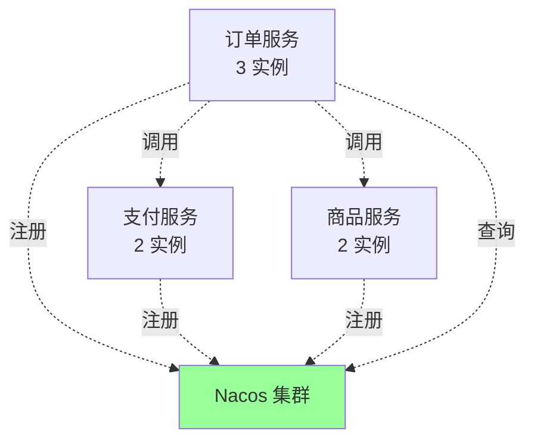

### 6.1 Go 客户端示例（Nacos SDK）

```go
import (
    "github.com/nacos-group/nacos-sdk-go/v2/clients"
    "github.com/nacos-group/nacos-sdk-go/v2/common/constant"
    "github.com/nacos-group/nacos-sdk-go/v2/vo"
)

// 注册
func registerOrderService() {
    sc := []constant.ServerConfig{
        *constant.NewServerConfig("nacos.example.com", 8848),
    }
    cc := constant.ClientConfig{NamespaceId: "prod", LogDir: "/tmp/nacos/log"}
    client, _ := clients.NewNamingClient(vo.NacosClientParam{
        ClientConfig: &cc, ServerConfigs: sc,
    })

    client.RegisterInstance(vo.RegisterInstanceParam{
        ServiceName: "order-service",
        Ip:          "10.0.0.1",
        Port:        8080,
        Weight:      10,
        Enable:      true,
        Healthy:     true,
        Ephemeral:   true,  // 临时实例（AP）
        Metadata:    map[string]string{"version": "v1.2"},
    })
}

// 发现
func discoverPaymentService() string {
    instances, _ := client.SelectOneHealthyInstance(vo.SelectOneHealthInstanceParam{
        ServiceName: "payment-service",
    })
    return fmt.Sprintf("%s:%d", instances.Ip, instances.Port)
}
```

### 6.2 优雅下线

```go
// 应用关闭时主动反注册
func gracefulShutdown() {
    // 1. 通知注册中心：我要下线
    client.DeregisterInstance(vo.DeregisterInstanceParam{
        ServiceName: "order-service",
        Ip:          "10.0.0.1",
        Port:        8080,
    })

    // 2. 等待客户端缓存过期（5-30s）
    time.Sleep(15 * time.Second)

    // 3. 处理在途请求
    server.Shutdown(ctx)

    // 4. 真正退出
}
```

**关键**：
- 主动反注册（避免等心跳超时）
- 等缓存过期（避免新流量）
- 处理在途请求（优雅）

## 七、典型坑

### 坑 1：注册中心挂了全站挂

```
注册中心故障 → 客户端没有兜底 → 服务调不到 → 雪崩
```

**修复**：客户端**必须缓存** + 容忍注册中心挂一段时间。

### 坑 2：心跳间隔配错

```
心跳 1s → 注册中心压力爆
心跳 60s → 故障感知 1 分钟才能切
```

**修复**：5-10s 是平衡点。

### 坑 3：CP 注册中心选举期间挂了

```
ZK Leader 挂 → 选举 30s+ → 服务发现停摆
```

**修复**：用 AP 注册中心 / 加客户端缓存。

### 坑 4：实例下线没主动反注册

```
应用 kill → 等心跳超时（30s）→ 流量打到死实例
```

**修复**：优雅下线（主动反注册 + sleep + Shutdown）。

### 坑 5：自我保护误判

```
正常网络抖动 → 进入保护模式 → 死实例不摘除 → 用户失败
```

**修复**：监控保护状态 + 调整阈值 + 客户端熔断兜底。

### 坑 6：多语言客户端不一致

```
Java 用 Spring Cloud Nacos，Go 用 nacos-sdk-go
两者实例发现行为有差异 → 排查困难
```

**修复**：写好 SDK 封装 + 统一规范测试。

### 坑 7：K8s + 注册中心双注册

```
K8s 给 Service 一份服务发现，应用又自注册到 Nacos
两套发现，路由不一致
```

**修复**：选一种。K8s 内部用 Service；跨集群/混合云用 Nacos。

## 八、面试高频题

**Q1：注册中心解决什么问题？**

服务实例动态注册 + 客户端动态发现 + 健康检查 + 元数据管理。

替代写死 IP 的方式，让微服务实例的扩缩容/迁移对调用方透明。

**Q2：客户端发现 vs 服务端发现？**

| | 客户端 | 服务端 |
| --- | --- | --- |
| LB | 客户端做 | 中间 LB 做 |
| 性能 | 直连快 | 多一跳 |
| SDK | 复杂 | 简单 |
| 适合 | RPC 同语言 | HTTP / 多语言 |

**Q3：ZK / Eureka / Nacos / etcd / Consul 怎么选？**

- K8s 内部 → etcd（自带）
- 国内 Java → Nacos
- 多机房 → Consul
- 老 Dubbo → ZK，建议迁 Nacos
- Eureka 已停更，新项目别选

**Q4：服务发现 CP 还是 AP？**

**AP**。理由：
- 短暂不一致可接受
- 不可用 = 整个系统挂
- 微服务可用性 > 一致性

主流：Eureka / Nacos 临时实例。

**Q5：心跳间隔怎么设置？**

5-10 秒是平衡点：
- 太短 → 注册中心压力大
- 太长 → 故障感知慢

**Q6：注册中心挂了怎么办？**

**客户端缓存兜底**。即使注册中心完全挂，客户端用缓存的实例列表继续工作（直到缓存过期）。

加重试 + 熔断 → 死实例自动跳过。

**Q7：自我保护机制是什么？**

集群层失活实例超阈值（如 80%）→ 进入保护模式 → 不摘除任何实例。

避免网络抖动导致的雪崩，**宁可调到死实例，也不让全网失联**。

**Q8：优雅下线怎么做？**

1. 主动反注册到注册中心
2. sleep 一段（等客户端缓存过期）
3. 停止接受新请求
4. 等在途请求处理完
5. 退出

**Q9：K8s Service 和注册中心是什么关系？**

K8s Service 本身就是服务发现：
- kube-dns / CoreDNS 提供 DNS
- iptables / IPVS 做 LB
- 内部 etcd 存元数据

K8s 内部不需要单独注册中心。**跨集群 / 混合云**才需要 Nacos / Consul。

**Q10：服务注册的元数据有什么用？**

- 版本（v1 / v2 灰度）
- 权重（新机器小权重）
- 标签（机房 / 区域）
- 状态（健康 / 警告）

LB 算法可以基于元数据做精细调度。

## 九、面试加分点

- 注册中心 = **服务注册 + 发现 + 健康检查 + 元数据**
- **客户端发现是 RPC 主流**（Dubbo/Kitex），服务端发现是 HTTP 主流（K8s Service）
- **服务发现要 AP**，配置中心要 CP（混合用 Nacos）
- **心跳 + 主动探测**结合，单一不够准
- **客户端缓存**是注册中心挂的兜底
- **自我保护**避免雪崩，但要监控
- **K8s 自带服务发现**（etcd + Service），内部不需要再装
- **优雅下线**要主动反注册 + 等缓存过期
- **多语言异构**用统一 SDK 或服务端发现
- 国内 Java 微服务事实标准：**Spring Cloud Alibaba + Nacos**
- Go 微服务：**Nacos / etcd / Kitex 自带 + Polaris**
- Eureka 已停更，新项目避坑
