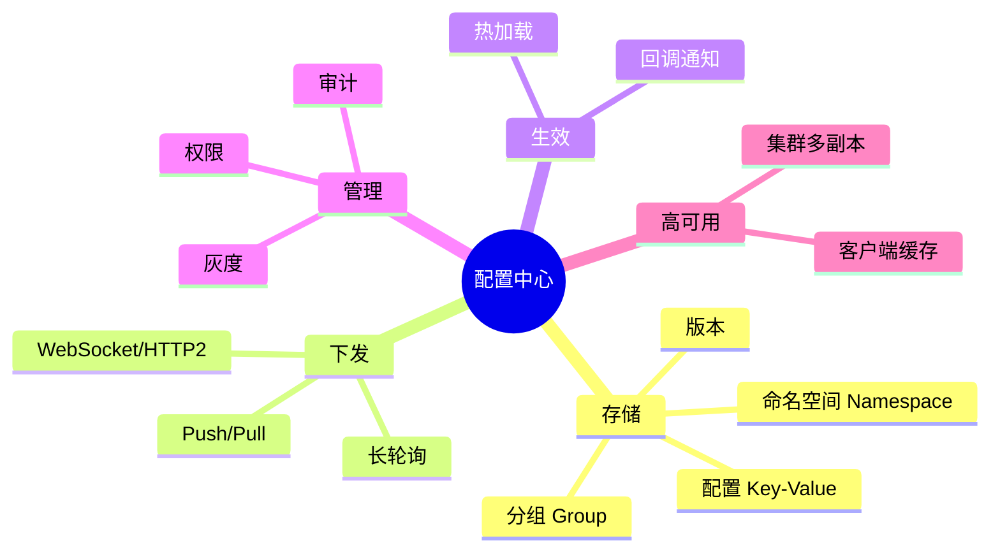
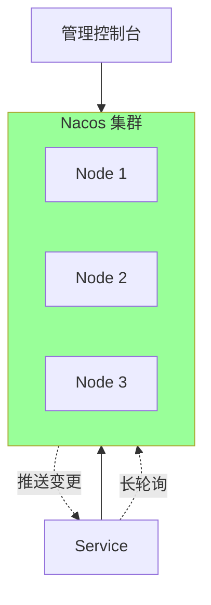
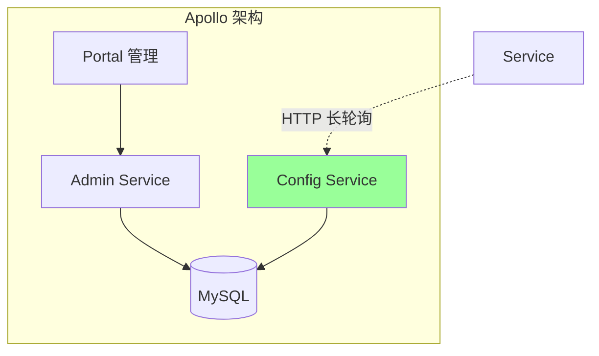
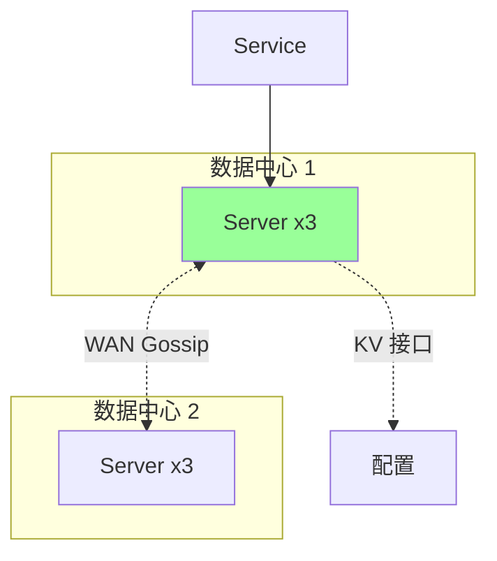
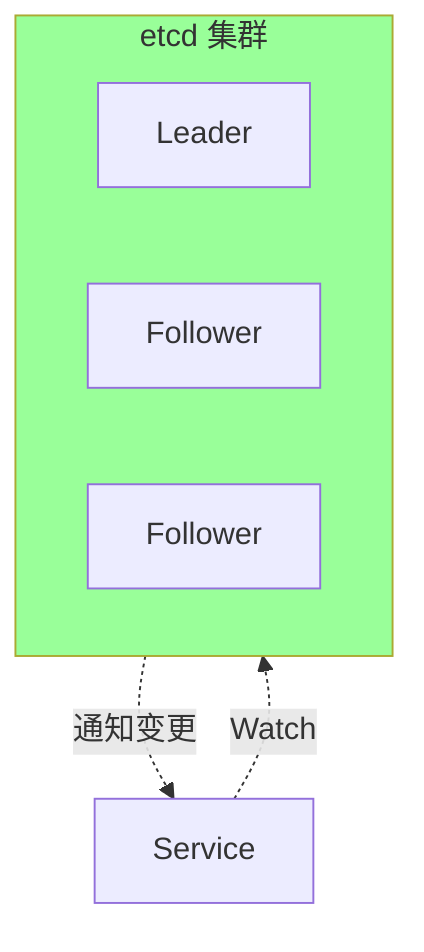
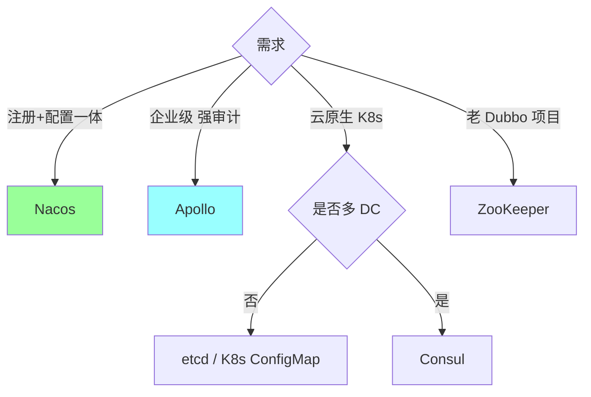
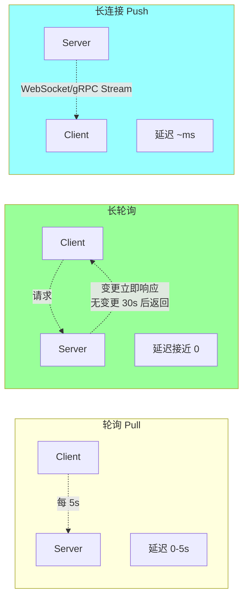
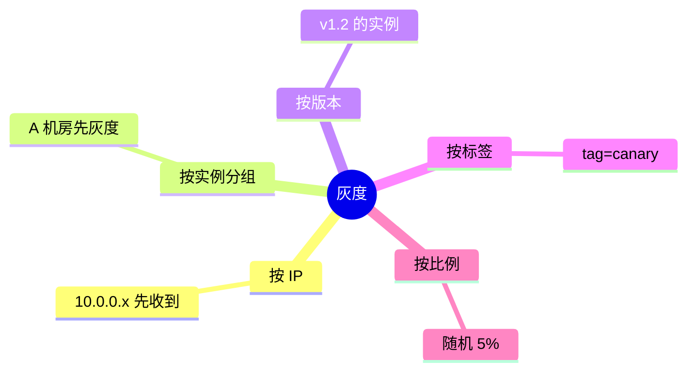

# 微服务 · 配置中心

> 为什么需要配置中心 / Nacos / Apollo / Consul / etcd / 动态推送 / 灰度配置 / 配置加密 / 热加载

## 一、为什么需要配置中心

### 1.1 配置演进


### 1.2 配置中心的价值

```
✅ 集中管理（N 个服务的配置统一管）
✅ 动态推送（改了不用重启）
✅ 环境隔离（dev/staging/prod）
✅ 版本管理（配置回滚）
✅ 权限管理（谁能改）
✅ 审计追溯（谁改了什么）
✅ 灰度发布（配置灰度给部分实例）
```

### 1.3 没有配置中心的痛

```
□ DB 密码改了 → 改 N 个服务的配置 → 重启 N 个服务
□ 限流阈值调整 → 发版才能生效
□ 功能开关 → 改代码 + 发版
□ 不同环境配置难管理（手动改 yaml）
□ 配置改错没 audit
□ 秘钥明文
```

## 二、配置中心的核心能力



## 三、主流配置中心对比

### 3.1 对比一览

| | Nacos | Apollo | Consul | etcd | ZooKeeper |
| --- | --- | --- | --- | --- | --- |
| **定位** | 注册+配置 | 纯配置 | 注册+配置+服务网格 | KV 存储 | KV+协调 |
| **下发** | HTTP 长轮询 | HTTP 长轮询 | HTTP long poll | Watch（gRPC） | Watch（ZAB） |
| **灰度** | 有 | **强（按 IP/群组/标签）** | 有 | 无 | 无 |
| **界面** | 有 | **强** | 有 | 弱（需工具） | 无（需工具） |
| **多环境** | Namespace | Cluster+Namespace | Key prefix | Key prefix | Path |
| **权限** | 有 | **强（细粒度）** | 有 | RBAC | ACL |
| **审计** | 有 | **强（完整 history）** | 有 | 有 | 无 |
| **配置格式** | 任意 | **结构化（Properties/YAML/JSON）** | 任意 | 任意 | 任意 |
| **推送延迟** | 毫秒级 | 秒级 | 毫秒级 | 毫秒级 | 毫秒级 |
| **开源方** | 阿里 | 携程 | HashiCorp | etcd-io | Apache |

### 3.2 Nacos（注册+配置一体）



**特点**：
- 注册 + 配置一体（简化运维）
- 长轮询推送（30s 一次，变更立即返回）
- 多环境用 Namespace 隔离
- 国内最流行

**简单但功能够用**，中小项目优选。

### 3.3 Apollo（携程，企业级）



**强项**：
- **灰度发布**最强（按 IP / 机器 / 群组 / 标签）
- 审计完整（谁改了什么，什么时间）
- 权限细粒度（部门/项目级）
- 多集群（每环境独立 Portal）
- 配置格式化（Properties / YAML / JSON）

**适合**：
- 大厂（多团队、需权限审计）
- 金融、强合规要求
- 老牌 Java 项目

### 3.4 Consul（多数据中心）



**特点**：
- KV 存储做配置（简单粗暴）
- 原生多数据中心
- 与 Nomad / Vault / Terraform 生态打通

**适合**：HashiCorp 生态 + 多机房。

### 3.5 etcd（K8s 标配）



**特点**：
- 高性能 KV
- Raft 一致性
- gRPC Watch
- K8s 就是靠它存配置

**适合**：云原生场景、Go 技术栈。

**痛点**：无管理界面（要自建）。

### 3.6 ZooKeeper

老牌 CP 协调服务。
- 树形 Path 节点（类似文件系统）
- Watch 机制
- 性能一般，界面需要第三方工具

**现状**：很多老 Dubbo 业务在用，新项目不推荐。

### 3.7 选型建议



**中小公司起步**：Nacos（简单 + 一体化）
**大厂 / 强审计**：Apollo
**K8s 原生**：ConfigMap + 外挂敏感配置（Vault）

## 四、动态配置推送

### 4.1 两种机制



| | 轮询 | 长轮询 | 长连接 |
| --- | --- | --- | --- |
| 延迟 | 高 | 低 | 极低 |
| 服务端连接 | 低 | 中 | 高 |
| 实现 | 简单 | 中 | 复杂 |
| 代表 | 早期 | Nacos/Apollo | etcd Watch/gRPC |

**长轮询**是配置中心主流（简单 + 实时）。

### 4.2 长轮询原理

```go
// 客户端
for {
    // 每次请求带当前 MD5
    resp := httpGet("/config?key=app.yaml&md5=" + currentMD5,
                    timeout=30s)
    if resp.Status == 200 && resp.Body != "" {
        // 配置变更了
        applyConfig(resp.Body)
        currentMD5 = hash(resp.Body)
    }
    // 状态 200 空 / 状态 304 → 没变化，立即再起一轮
}

// 服务端
func handleConfig(key, md5) {
    // 注册一个等待
    waiter := register(key, md5)

    // 挂住最多 30s
    select {
    case <-waiter.Updated:
        return config.Content
    case <-time.After(30s):
        return 304 // 没变化
    }
}
```

**优点**：
- 客户端几乎没请求（大部分 30s 挂住）
- 服务端变更立即推送

### 4.3 Nacos 长轮询实际配置

```
默认轮询周期: 30s
MD5 检查粒度: Key 级别
推送延迟: < 1s（变更 → 客户端收到）
```

## 五、配置热加载

### 5.1 简单的热加载

```go
// 监听器模式
type ConfigManager struct {
    cfg   atomic.Value // 当前配置
    notif chan struct{}
}

func (m *ConfigManager) Reload(newCfg *Config) {
    m.cfg.Store(newCfg)
    close(m.notif)  // 通知监听者
}

func (m *ConfigManager) Get() *Config {
    return m.cfg.Load().(*Config)
}

// 客户端 SDK 回调
nacos.OnChange("app.yaml", func(content string) {
    newCfg := parseYAML(content)
    configMgr.Reload(newCfg)
})
```

### 5.2 带监听器的热加载

```go
// 组件监听配置
type RateLimiter struct {
    qps atomic.Int64
}

func init() {
    // 首次读取
    rl.qps.Store(cfg.Int("rate_limit.qps"))

    // 监听变更
    cfg.OnChange("rate_limit.qps", func(v int64) {
        rl.qps.Store(v)
        log.Info("rate limit reloaded:", v)
    })
}

func (rl *RateLimiter) Allow() bool {
    qps := rl.qps.Load()
    // ...用 qps 判断
}
```

### 5.3 哪些可以热加载 / 哪些不行

```
✅ 可热加载:
  - 限流阈值
  - 功能开关
  - 超时时间
  - 日志级别
  - 业务参数（折扣率、重试次数）

❌ 不可热加载（需重启）:
  - DB 连接信息（连接池已建立）
  - 端口监听
  - 启动时注入的参数
  - 某些缓存已初始化的依赖
```

**实战**：区分运行时参数（可热）和启动时参数（不可热），明确在文档。

## 六、灰度配置

### 6.1 为什么需要

```
改限流阈值 → 发全网 → 配置错 → 全站挂
→ 先灰度 1% → 观察 10 分钟 → 扩大 → 全量
```

### 6.2 灰度维度



### 6.3 Apollo 灰度示例

```
创建灰度分支:
  主配置: rate_limit.qps = 1000
  灰度: rate_limit.qps = 500
  灰度对象: IP in [10.0.0.1, 10.0.0.2]

发布灰度:
  10.0.0.1/10.0.0.2 收到 500
  其他实例仍是 1000

观察无问题 → 合并到主配置 → 全量发布
```

### 6.4 Nacos 灰度（beta 发布）

```
发布配置时选"Beta"
填入灰度 IP 列表
只有这些 IP 收到新配置

观察无问题 → 点"Release all"→ 全量
```

### 6.5 灰度失败怎么办

```
灰度发现问题:
  1. 立即回滚灰度（不影响全量）
  2. 修正配置
  3. 重新灰度
```

**关键**：**灰度不影响存量**，失败就回滚。

## 七、配置加密

### 7.1 敏感配置的问题

```
配置中心明文存:
  mysql.password = RootPassword123

风险:
  - 数据库泄漏
  - 管理员误操作
  - 日志打印带密码
  - 审计看到明文
```

### 7.2 加密方案

**方案 1：配置项加密**
```yaml
# 存入加密值
mysql.password: ENC(AQICAHj...)

# SDK 自动解密
decryptedPass := cfg.GetString("mysql.password")  // 返回明文
```

工具：Jasypt（Java）/ 自实现（Go）。

**方案 2：Vault 敏感配置**
```
Nacos/Apollo 存普通配置
HashiCorp Vault 存密码/密钥
应用启动时先去 Vault 拿密码
```

**方案 3：K8s Secret**
```yaml
apiVersion: v1
kind: Secret
metadata:
  name: db-secret
data:
  password: Um9vdFBhc3N3b3JkMTIz  # base64
```

**对比**：

| | 配置项加密 | Vault | K8s Secret |
| --- | --- | --- | --- |
| 难度 | 低 | 中 | 低 |
| 安全性 | 中 | 高 | 中 |
| 适合 | 小规模 | 金融级 | K8s 环境 |

### 7.3 密钥管理

```
最弱: 硬编码到代码
弱: 环境变量
中: K8s Secret + RBAC
强: Vault / AWS KMS / 阿里云 KMS
最强: HSM 硬件加密
```

敏感密钥**绝不**放配置中心明文 / Git 仓库。

## 八、ddd_order_example 接入配置中心

```go
// 使用 Nacos 配置中心
import "github.com/nacos-group/nacos-sdk-go/v2/clients"

type AppConfig struct {
    MySQL  MySQLConfig  `yaml:"mysql"`
    Redis  RedisConfig  `yaml:"redis"`
    Kafka  KafkaConfig  `yaml:"kafka"`
    RateLimit int       `yaml:"rate_limit"`
}

var cfg atomic.Value

func InitConfig() error {
    client := nacos.NewConfigClient(...)

    // 首次加载
    content, err := client.GetConfig(vo.ConfigParam{
        DataId: "order-service.yaml",
        Group:  "DEFAULT_GROUP",
    })
    if err != nil { return err }

    initial := parseYAML(content)
    cfg.Store(initial)

    // 监听变更
    client.ListenConfig(vo.ConfigParam{
        DataId: "order-service.yaml",
        Group:  "DEFAULT_GROUP",
        OnChange: func(namespace, group, dataId, data string) {
            newCfg := parseYAML(data)
            cfg.Store(newCfg)
            log.Info("config reloaded")

            // 通知业务组件
            notifyReload(newCfg)
        },
    })

    return nil
}

func GetConfig() *AppConfig {
    return cfg.Load().(*AppConfig)
}
```

**组件响应变更**：
```go
func (rl *RateLimiter) reload(newCfg *AppConfig) {
    rl.qps.Store(int64(newCfg.RateLimit))
    log.Info("rate limit updated:", newCfg.RateLimit)
}
```

## 九、典型坑

### 坑 1：重启才生效

```
用环境变量 + 启动加载 → 改配置必须重启
```

**修复**：用配置中心 + 监听变更 + 热加载。

### 坑 2：配置格式错误全挂

```
改了 YAML 少个空格 → 下发到所有服务 → 解析失败 → 全挂
```

**修复**：
- 配置中心加 schema 校验
- 发布前自动解析验证
- 灰度发布（错了只影响 1%）

### 坑 3：客户端没有缓存

```
配置中心挂 → 重启应用 → 拿不到配置 → 启动失败
```

**修复**：
- 客户端本地缓存文件
- 启动时优先 Nacos，失败用缓存
- 降级默认值

### 坑 4：敏感配置明文

```
DB 密码明文存 Apollo → 数据库被扫描
```

**修复**：加密 / Vault / K8s Secret。

### 坑 5：热加载丢状态

```
应用有内存状态，reload 时被重置
```

**修复**：区分热加载（参数）vs 冷启动（连接）。

### 坑 6：灰度没做就全量

```
改限流阈值 1000 → 10 → 全量立即生效 → 大量 429
```

**修复**：灰度 1% → 观察 → 扩大 → 全量。

### 坑 7：多环境配置混乱

```
测试环境改配置不小心发到生产
```

**修复**：Namespace 隔离 + 操作权限控制 + 二次确认。

## 十、面试高频题

**Q1：配置中心解决什么问题？**

- 集中管理
- 动态推送
- 环境隔离
- 版本/审计
- 灰度发布
- 秘钥管理

替代写死 yaml + 环境变量的方式。

**Q2：Nacos vs Apollo 怎么选？**

| | Nacos | Apollo |
| --- | --- | --- |
| 定位 | 注册+配置 | 纯配置 |
| 灰度 | 有 | 更强（IP/群组/标签） |
| 审计 | 有 | 更强 |
| 简单 | 简单 | 复杂 |
| 适合 | 中小项目 | 大厂 / 金融 |

**Q3：配置怎么动态下发？**

长轮询（Nacos/Apollo 主流）：
- 客户端发请求带当前 MD5
- 服务端挂住（最多 30s）
- 变更立即响应，无变更超时返回

延迟 < 1s，服务端连接数可控。

**Q4：哪些配置能热加载？**

**可热加载**：限流阈值、开关、超时、日志级别、业务参数。

**不可（需重启）**：DB 连接池、端口、启动时注入。

区分**运行时参数**和**启动时参数**。

**Q5：灰度配置怎么做？**

按 IP / 机器 / 版本 / 标签 / 比例灰度。

流程：创建灰度 → 指定对象 → 发布 → 观察 → 扩大 → 全量。

Apollo 原生支持，Nacos 有 Beta 发布。

**Q6：敏感配置怎么存？**

不要明文：
- 配置项加密（Jasypt）
- Vault 专门存
- K8s Secret

**绝不**放 Git / 配置中心明文。

**Q7：配置中心挂了怎么办？**

客户端本地缓存文件 → 启动失败时用缓存 → 业务降级。

**不能让配置中心挂连带业务挂**。

**Q8：怎么保证配置变更不出错？**

- Schema 校验
- 发布前预览
- 灰度发布
- 审批流
- 审计
- 回滚能力

**Q9：配置中心的 CAP？**

建议 **CP**（强一致）：
- 配置应全网一致
- 短时间不可用可接受（仍用缓存）

Nacos 默认 AP，可切 CP（永久配置）。

**Q10：K8s ConfigMap 能替代配置中心吗？**

**部分能**：
- 静态配置 → ConfigMap 够
- 动态推送 → 要重启 pod
- 审计 / 灰度 / 权限 → 弱

大规模微服务还是用专业配置中心。

## 十一、面试加分点

- 配置中心 = **集中管理 + 动态推送 + 灰度 + 审计 + 加密**
- **长轮询**是动态下发的主流（Nacos/Apollo）
- **Nacos 注册+配置一体**，简单适合中小
- **Apollo 企业级**（灰度/审计最强）
- **热加载区分**运行时参数 vs 启动时参数
- **敏感配置用 Vault / K8s Secret**，不明文存
- **灰度配置**按 IP/分组/比例
- **客户端必须本地缓存**，容忍配置中心挂
- K8s ConfigMap + 配置中心组合用（静态 + 动态）
- 配置中心建议 **CP**，保证一致性
- **Schema 校验 + 灰度 + 审批 + 回滚** 是配置安全的四板斧
