# 微服务 · API 网关

> 网关定位 / 路由 / 鉴权 / 限流 / 协议转换 / Kong / APISIX / Spring Cloud Gateway / BFF / 大厂方案

## 一、为什么需要网关

### 1.1 没有网关的世界

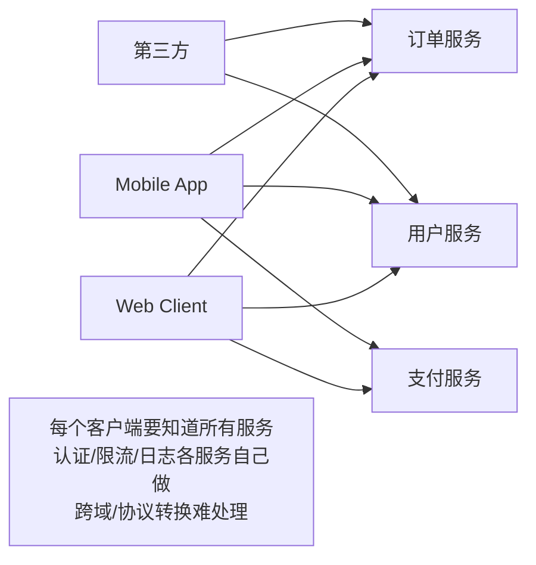

**痛点**：
- 客户端要知道所有微服务地址
- 鉴权/限流/日志/监控每个服务重复实现
- 服务接口变化客户端跟着改
- 跨域 / 协议转换 / API 版本管理乱

### 1.2 有网关

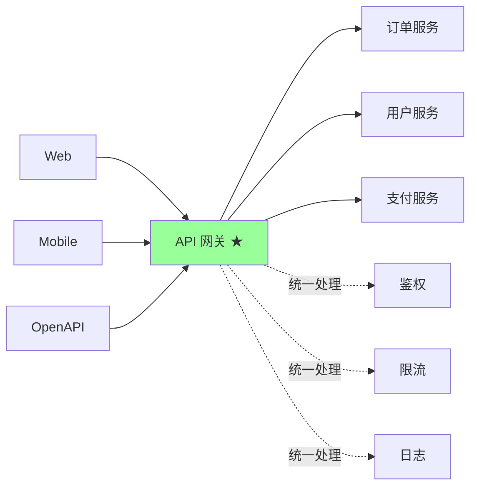

**核心收益**：
- 客户端只调一个入口
- 横切关注点（鉴权/限流/监控）统一处理
- 后端服务可独立演化
- 协议转换（外 HTTP / 内 gRPC）

## 二、网关的核心职责

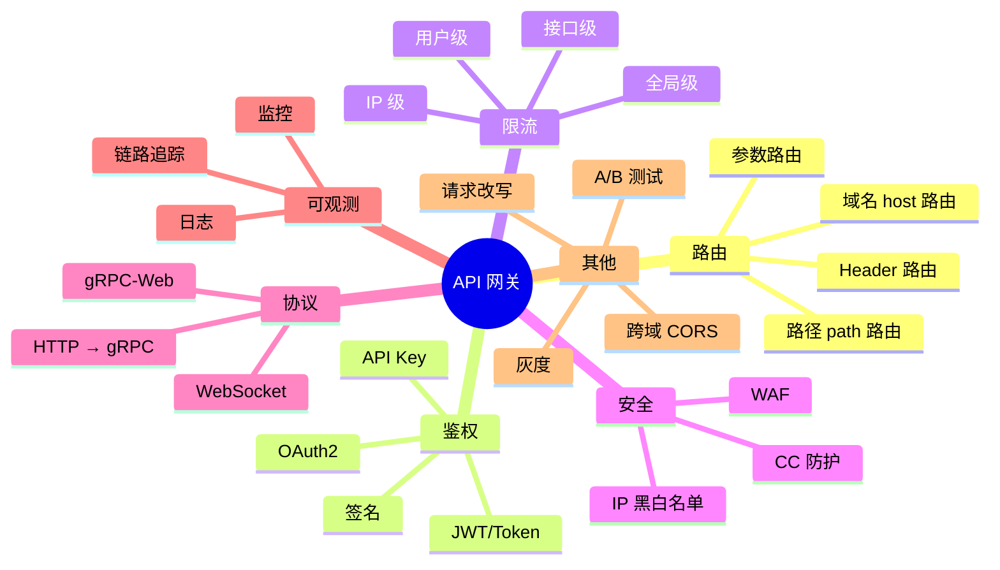

## 三、网关分类

### 3.1 按位置分

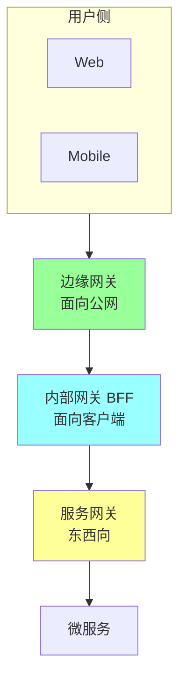

| 网关 | 位置 | 职责 |
| --- | --- | --- |
| **边缘网关** | 公网入口 | 安全 / 鉴权 / DDoS / WAF |
| **BFF**（Backend for Frontend） | 客户端入口 | 聚合 / 适配 / 协议转换 |
| **服务网关** | 内网 | RPC 治理 |

实战可能合并（小规模）或全分离（大厂）。

### 3.2 BFF 模式

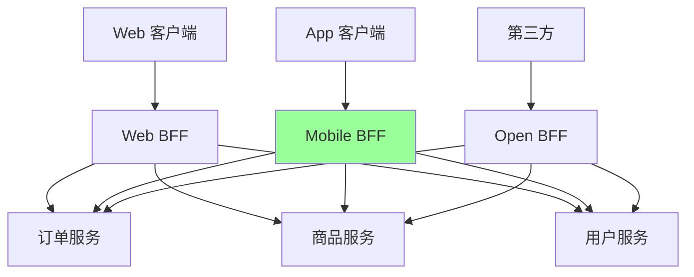

**核心思想**：每种客户端有自己的 BFF，按客户端需求聚合后端服务。

**典型场景**：
- Web BFF：返回完整数据
- Mobile BFF：精简数据（节省流量）
- Open BFF：开放协议（限速 / 审计）

## 四、主流网关对比

### 4.1 全局对比

| | Nginx | Kong | APISIX | Spring Cloud Gateway | Envoy | Higress |
| --- | --- | --- | --- | --- | --- | --- |
| **底层** | C | OpenResty (Nginx + Lua) | OpenResty (Nginx + Lua) + etcd | Java Reactor | C++ | Envoy + 阿里增强 |
| **性能** | 极高 | 高 | 极高 | 中 | 极高 | 高 |
| **动态配置** | 弱（reload） | API 实时 | 实时 | API | xDS | xDS |
| **插件生态** | 弱 | 强 | 强 | 中 | 强 | 强 |
| **社区** | 老牌 | 活跃 | 活跃（国内强） | 活跃 | 活跃 | 阿里 |
| **适合** | 简单反代 | 通用 | 国内 / 云原生 | Java/Spring 生态 | Service Mesh | 阿里云生态 |
| **配置存储** | 文件 | DB 或 DBless | etcd | Java 配置 | xDS API | xDS / Nacos |

### 4.2 Nginx

```nginx
# 简单路由
upstream order_backend {
    server 10.0.0.1:8080;
    server 10.0.0.2:8080;
}

server {
    listen 80;
    location /api/orders {
        proxy_pass http://order_backend;
    }
}
```

**特点**：
- 老牌，性能极佳
- 配置文件 + reload（不够动态）
- 插件需 Lua（OpenResty）

**适合**：简单反代 + 静态路由。

### 4.3 Kong

```
基于 OpenResty (Nginx + Lua)
插件生态丰富（认证/限流/缓存/转换/可观测）
社区版 + 企业版
配置走 Postgres 或 Cassandra
```

**强项**：
- 插件最丰富
- 企业版功能强（开发者门户、审计）
- 支持 declarative config（DBless）

**痛点**：
- DB 依赖（社区版 DBless 减负）
- 配置同步秒级

### 4.4 APISIX（国内主流）

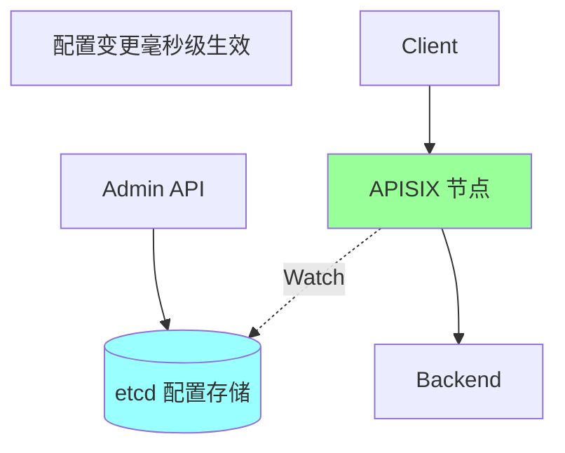

**特点**：
- OpenResty + etcd（配置毫秒级生效）
- 高性能（国内压测对比 Kong 快 2-5 倍）
- 插件生态丰富
- 国内活跃（社区 + Apache 顶级项目）
- gRPC Proxy 原生支持

**适合**：
- 国内云原生
- 高性能 + 动态配置
- gRPC 场景

### 4.5 Spring Cloud Gateway

```java
@Bean
public RouteLocator routes(RouteLocatorBuilder builder) {
    return builder.routes()
        .route("order_route", r -> r
            .path("/api/orders/**")
            .filters(f -> f.stripPrefix(2).addRequestHeader("X-Service", "order"))
            .uri("lb://order-service"))
        .build();
}
```

**特点**：
- Java + Reactor（响应式）
- 与 Spring Cloud 生态深度集成
- 配置代码或 YAML
- 性能不如 OpenResty 系（Java 开销）

**适合**：纯 Java + Spring Cloud 项目。

### 4.6 Envoy（Service Mesh 标配）

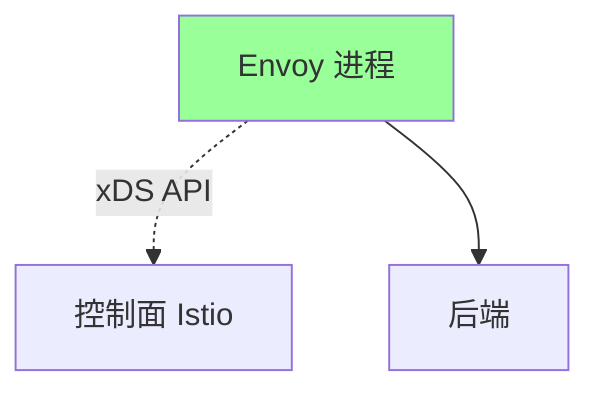

**特点**：
- C++ 实现，性能极佳
- 动态配置（xDS API）
- 是 Istio 的数据面
- 复杂（学习曲线陡）

**适合**：Service Mesh / 大规模微服务。

详见 [06-service-mesh.md](06-service-mesh.md)。

### 4.7 Higress

阿里基于 Envoy + 自研，适合阿里云生态。

### 4.8 选型建议

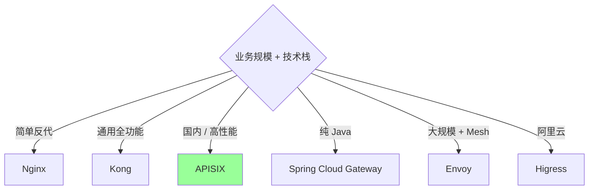

**实战推荐**：
- 中小项目：Kong / APISIX
- 国内大流量：APISIX
- Service Mesh：Envoy
- Java 单生态：Spring Cloud Gateway

## 五、关键能力详解

### 5.1 路由规则

```yaml
# APISIX 路由示例
routes:
  - uri: /api/orders/*
    methods: [GET, POST]
    upstream: order-service
    plugins:
      jwt-auth: {}
      limit-req:
        rate: 100
  - uri: /api/products/*
    upstream: product-service
```

**路由维度**：
- Path：`/api/orders/*`
- Method：GET/POST
- Host：`api.example.com`
- Header：`X-Version: v2`
- Query：`?ver=2`

**优先级**：精确 > 前缀 > 通配。

### 5.2 鉴权

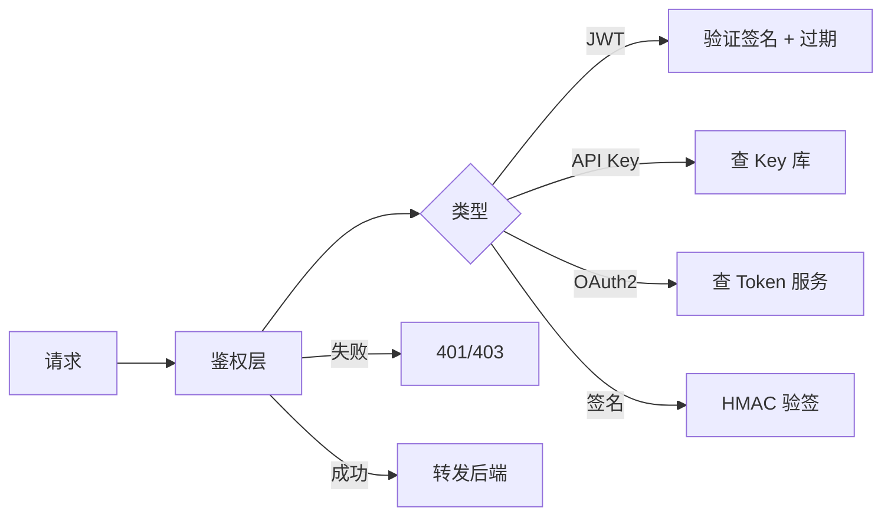

**JWT 鉴权示例**：
```go
// 网关解析 JWT
token := req.Header.Get("Authorization")[7:]  // "Bearer xxx"
claims, err := jwt.Parse(token, secret)
if err != nil { return 401 }

// 把用户信息加到 header 转给后端
req.Header.Set("X-User-ID", claims.UserID)
req.Header.Set("X-User-Role", claims.Role)
```

**优势**：后端服务**只信任网关传来的 header**，不重复鉴权。

### 5.3 限流

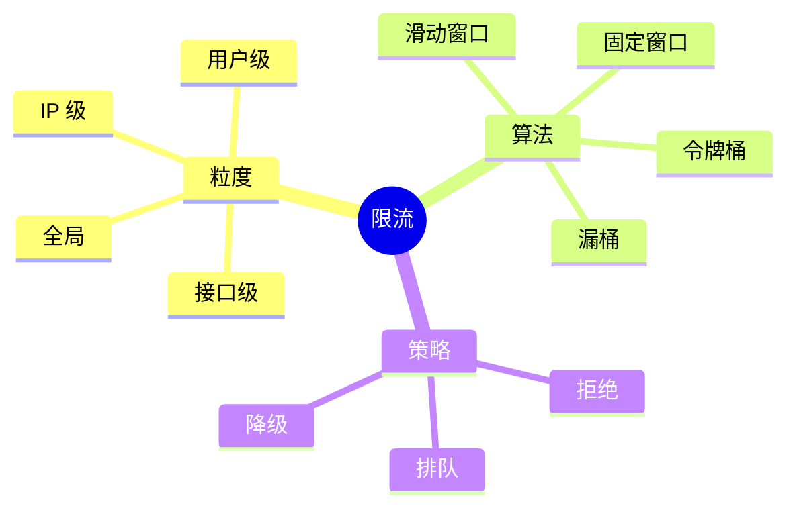

详见 [06-distributed/06-rate-limit-circuit.md](../06-distributed/06-rate-limit-circuit.md)。

**网关限流示例**（APISIX）：
```yaml
plugins:
  limit-count:
    count: 100      # 100 次
    time_window: 60 # 60 秒
    key: remote_addr
    rejected_code: 429
```

### 5.4 协议转换

```
客户端: HTTP/JSON → 网关 → gRPC/Protobuf → 后端

或: HTTP/1.1 → 网关 → HTTP/2 → 后端
或: WebSocket → 网关 → 后端 RPC
```

APISIX / Envoy 都支持 gRPC-Web → gRPC 转换（前端可直接调 gRPC 服务）。

### 5.5 灰度发布

```yaml
# 5% 流量到新版本
routes:
  - uri: /api/orders/*
    upstream:
      type: roundrobin
      nodes:
        order-v1:9 # 90%
        order-v2:1 # 10%
```

或按用户 ID / Header / Cookie 灰度。

### 5.6 熔断/重试

```yaml
plugins:
  api-breaker:
    break_response_code: 502
    max_breaker_sec: 30
    unhealthy:
      http_statuses: [500, 503]
      failures: 3
  retry:
    retries: 3
    retry_on: [5xx, gateway-error]
```

详见 [06-distributed/06-rate-limit-circuit.md](../06-distributed/06-rate-limit-circuit.md)。

### 5.7 跨域 (CORS)

```yaml
plugins:
  cors:
    allow_origins: "https://example.com"
    allow_methods: "GET,POST"
    allow_headers: "Authorization,Content-Type"
```

把 CORS 处理放网关，后端服务无感。

## 六、性能优化

### 6.1 连接复用

```
网关 → 后端: 长连接 + 连接池
keepalive_pool: 320  # 每 worker 池子大小
keepalive_timeout: 60s
```

### 6.2 缓存

```yaml
plugins:
  proxy-cache:
    cache_strategy: memory
    cache_zone: default
    cache_ttl: 300
```

幂等 GET 接口在网关缓存，减少后端调用。

### 6.3 压缩

```yaml
plugins:
  gzip:
    types: ['application/json']
    min_length: 1000
```

### 6.4 异步日志

```
同步写日志 → 阻塞请求
异步刷盘 + 批量 → 不影响延迟
```

## 七、网关高可用

### 7.1 多实例 + LB

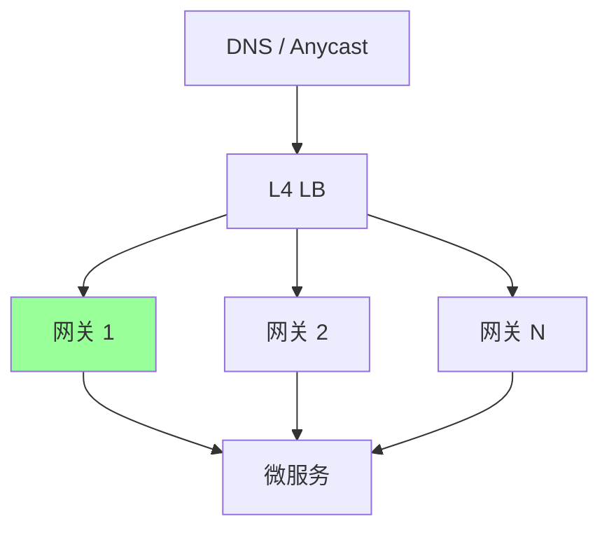

### 7.2 配置一致性

```
APISIX/Kong: 多节点共享 etcd / DB
配置变更 → 所有节点秒级同步
```

### 7.3 故障隔离

```
某网关节点故障 → LB 健康检查摘除
配置错误 → 仅影响该节点（如配置回滚）
```

## 八、ddd_order_example 接入网关

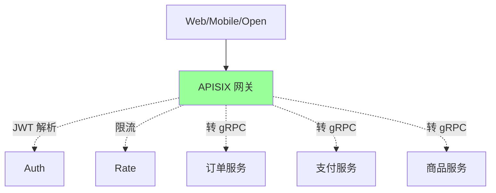

### 8.1 路由规则

```yaml
routes:
  - uri: /api/v1/orders/*
    upstream: order-service
    plugins:
      jwt-auth: {}
      limit-req:
        rate: 100
        key_type: var
        key: remote_addr
      proxy-rewrite:
        headers:
          X-Service: order

  - uri: /api/v1/products/*
    upstream: product-service
    plugins:
      jwt-auth: {}
      proxy-cache:
        cache_ttl: 60     # 商品详情缓存 60s

  - uri: /api/v1/payments/*
    upstream: payment-service
    plugins:
      jwt-auth: {}
      limit-req:
        rate: 50
      api-breaker:
        unhealthy:
          http_statuses: [500, 503]
          failures: 3
```

### 8.2 后端服务无需重复鉴权

```go
// order_handler.go
func (h *OrderHandler) CreateOrder(w http.ResponseWriter, r *http.Request) {
    // 网关已鉴权，直接拿 header
    userID := r.Header.Get("X-User-ID")
    role := r.Header.Get("X-User-Role")

    // 业务逻辑...
    h.orderService.CreateOrder(r.Context(), userID, ...)
}
```

## 九、典型坑

### 坑 1：网关单点

```
单网关挂 → 全站不可达
```

**修复**：多实例 + LB + DNS 兜底。

### 坑 2：网关性能瓶颈

```
所有流量过网关 → 网关 CPU 100% → 全站慢
```

**修复**：
- 选高性能（APISIX/Envoy）
- 横向扩容
- 减少不必要插件

### 坑 3：鉴权信息透传不规范

```
网关传 X-User-ID, 后端不验证
攻击者绕过网关直连后端 → 伪造 X-User-ID
```

**修复**：
- 后端服务**不能公网可达**（VPC 内网）
- 网关到后端**双向 TLS（mTLS）**
- header 加签名

### 坑 4：路由规则冲突

```
/api/* 和 /api/orders/* 都匹配，优先级搞错
```

**修复**：精确 > 前缀，配置审核。

### 坑 5：灰度规则忘了清理

```
灰度时配 5% v2，灰度完了忘了改成 100% v2
```

**修复**：流程 + 自动检查灰度配置时长。

### 坑 6：限流粒度太粗

```
限流按全局 → 大客户用完小客户没用
```

**修复**：分用户/接口/IP 多维度。

### 坑 7：插件越加越慢

```
开了 20 个插件 → 每请求过 20 层处理 → 慢
```

**修复**：精简插件 + 性能压测对比。

## 十、面试高频题

**Q1：API 网关解决什么问题？**

- 统一入口（路由）
- 横切关注点统一（鉴权/限流/日志）
- 协议转换（HTTP ↔ gRPC）
- 安全防护（WAF/DDoS）
- 客户端简化

**Q2：BFF 模式是什么？**

每种客户端（Web/Mobile/Open）有专属网关，聚合后端服务，按客户端需求做适配。

避免一个网关应付所有客户端的妥协。

**Q3：Kong / APISIX / Envoy / Spring Cloud Gateway 怎么选？**

- 简单：Nginx
- 通用：Kong / APISIX
- 国内 / 高性能：APISIX
- Java：SCGW
- Mesh：Envoy

**Q4：APISIX 比 Kong 快在哪？**

- 配置走 etcd（实时下发，不依赖 DB）
- 路由匹配优化（基数树）
- 实测 QPS 高 2-5 倍

**Q5：网关怎么做鉴权？**

JWT 主流：
- 网关验签 + 过期检查
- 解析后用户信息塞 header
- 后端服务从 header 取，不重复验

**Q6：网关限流怎么设计？**

多维度：
- 全局（保护后端）
- 接口级（不同接口不同阈值）
- 用户级（防单用户刷）
- IP 级（防爬虫）

算法：令牌桶 / 漏桶 / 滑窗。

**Q7：网关怎么保证高可用？**

- 多实例 + LB
- 配置共享（etcd）
- 健康检查
- 灰度发布

**Q8：HTTP → gRPC 协议转换怎么做？**

APISIX/Envoy 原生支持：
- 客户端发 HTTP/JSON
- 网关按 IDL 转 gRPC/Protobuf
- 后端 gRPC 服务

允许前端直调 gRPC 服务（gRPC-Web）。

**Q9：网关后端服务怎么防绕过？**

- 后端只在 VPC 内网（不公网可达）
- 网关到后端 mTLS
- header 加签名
- 限制后端只接受网关 IP

**Q10：网关 vs 反向代理有什么区别？**

| | 反向代理 | API 网关 |
| --- | --- | --- |
| 职责 | 转发 | 转发 + 治理 |
| 鉴权 | 一般无 | 内置 |
| 限流 | 简单 | 多维 |
| 协议转换 | 弱 | 强 |
| 适合 | 简单反代 | 微服务入口 |

API 网关 = **加强版反向代理 + 微服务治理**。

## 十一、面试加分点

- 网关 = **路由 + 横切关注点 + 协议转换 + 安全**
- **BFF 模式**适合多客户端聚合
- **APISIX 国内主流**（高性能 + 动态配置 + Apache 顶级）
- **Envoy 是 Mesh 标配**，xDS 配置 API
- **配置走 etcd 实时下发**比传统 reload 快几个数量级
- **JWT + Header 透传**减少后端重复鉴权
- **多维限流**（全局 / 接口 / 用户 / IP）
- 网关到后端 **VPC 内网 + mTLS**，防绕过
- **协议转换**让前端直调 gRPC（HTTP → gRPC）
- 网关挂 = 全站挂，**高可用** + 灰度配置 是必修
- **插件精简** + 性能压测，避免插件过多拖慢
- 大厂方案：阿里 Higress / 字节 Hertz Gateway / B 站自研网关
