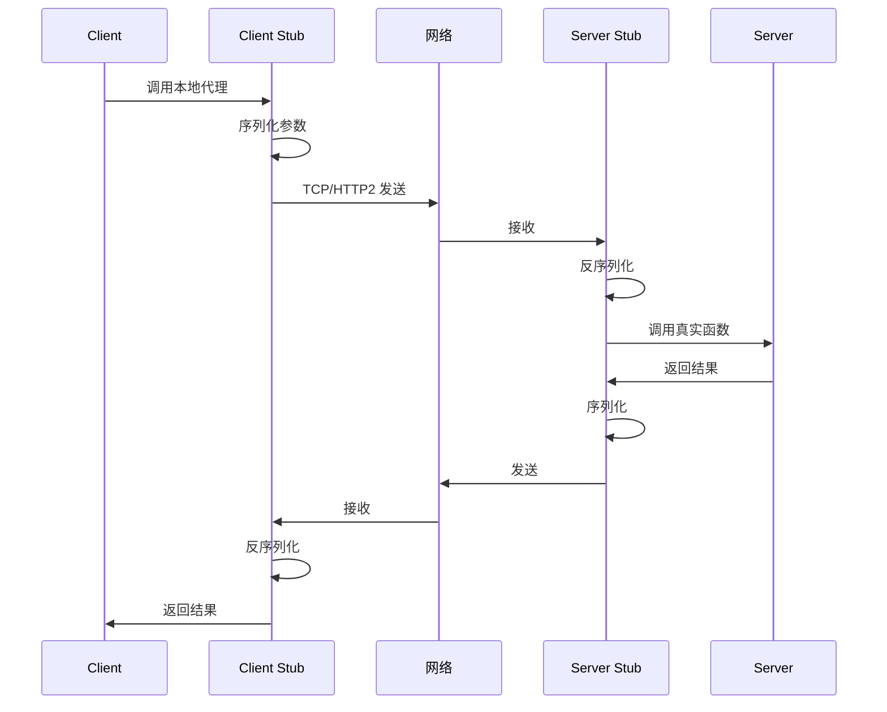
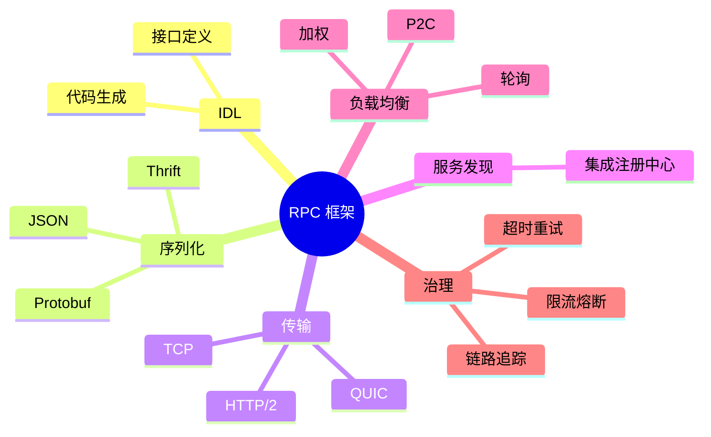
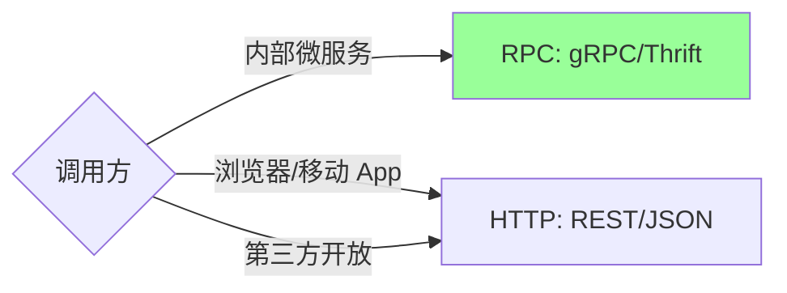
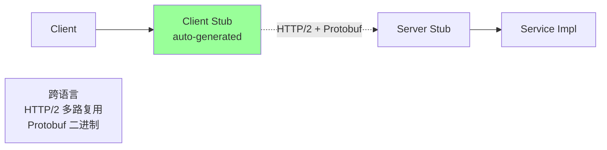
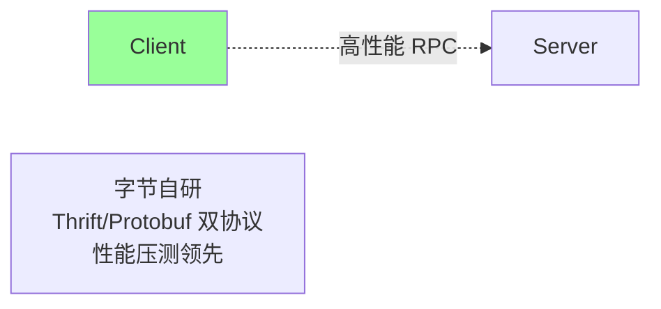
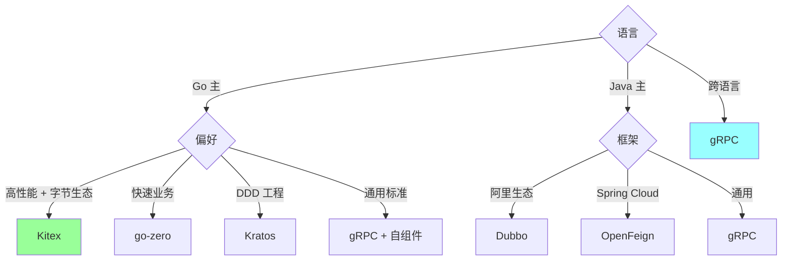
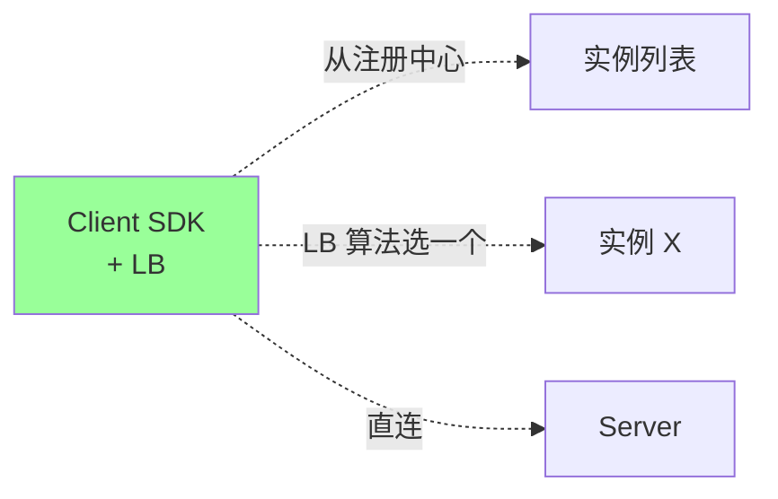

# 微服务 · RPC 框架

> RPC 原理 / IDL / 序列化协议 / gRPC / Thrift / Dubbo / Kitex / 负载均衡 / 大厂选型

> Go 生态细节见 01-go-language/07-ecosystem，本篇聚焦**框架对比和实战决策**

## 一、RPC 是什么

### 1.1 定义

> **RPC (Remote Procedure Call)** = 像调本地函数一样调远程服务

```go
// 看起来像本地调用
result, err := userService.GetUser(ctx, &GetUserReq{ID: 123})

// 实际背后:
// 1. 序列化参数
// 2. 网络发送
// 3. 服务端反序列化
// 4. 执行函数
// 5. 序列化响应
// 6. 网络返回
// 7. 客户端反序列化
```

### 1.2 RPC 整体流程



### 1.3 RPC 的核心组件



## 二、RPC vs HTTP API

### 2.1 对比

| | RPC | HTTP API（REST） |
| --- | --- | --- |
| 协议 | 二进制（gRPC HTTP/2） | HTTP/1.1 文本 |
| 性能 | 高（5-10x） | 中 |
| 序列化 | Protobuf/Thrift | JSON |
| IDL | 必有 | OpenAPI（可选） |
| 浏览器友好 | 否（gRPC-Web 例外） | 是 |
| 跨语言 | 是（IDL 生成） | 是 |
| 适合 | 内部微服务 | 对外 API |

### 2.2 选择



**实战**：对外 HTTP，对内 RPC，网关做协议转换。

## 三、IDL（接口定义语言）

### 3.1 为什么需要 IDL

```
没 IDL:
  Client 写法: req.UserID = "123"
  Server 写法: req.User_ID = 123
  → 联调爆炸

有 IDL:
  统一定义 → 各语言生成 → 强类型 → 不会出错
```

### 3.2 Protobuf 示例

```protobuf
syntax = "proto3";
package order.v1;

service OrderService {
  rpc CreateOrder (CreateOrderRequest) returns (CreateOrderResponse);
  rpc GetOrder (GetOrderRequest) returns (GetOrderResponse);
  rpc StreamOrders (StreamOrdersRequest) returns (stream Order);
}

message CreateOrderRequest {
  string customer_id = 1;
  repeated OrderItem items = 2;
}

message OrderItem {
  string product_id = 1;
  int64 quantity = 2;
  int64 unit_price = 3;
}

message CreateOrderResponse {
  string order_id = 1;
}
```

代码生成：
```bash
protoc --go_out=. --go-grpc_out=. order.proto
```

### 3.3 Thrift 示例

```thrift
namespace go order

service OrderService {
  CreateOrderResponse createOrder(1: CreateOrderRequest req)
  GetOrderResponse getOrder(1: GetOrderRequest req)
}

struct CreateOrderRequest {
  1: required string customerID,
  2: required list<OrderItem> items,
}
```

### 3.4 IDL 设计原则

```
□ 字段编号一旦分配不要改/删
□ 删字段保留编号 reserved 1
□ 加字段用新编号
□ 不要重复使用编号（兼容性灾难）
□ 用 enum 替代 magic number
□ 时间用 timestamp/int64，不用字符串
□ 金额用 int64 分（避免浮点）
□ 包名加版本（v1/v2）
□ 一个 proto 文件一个服务（不要塞太多）
```

### 3.5 兼容性

| | 向前兼容（老 client 调新 server） | 向后兼容（新 client 调老 server） |
| --- | --- | --- |
| 加字段 | ✅（默认值） | ✅（忽略） |
| 删字段 | ❌（旧字段丢） | ✅ |
| 改类型 | ❌ | ❌ |
| 改编号 | ❌ | ❌ |

**铁律**：**只加不删不改**。

## 四、序列化协议对比

### 4.1 主流序列化

| | JSON | XML | Protobuf | Thrift | MessagePack | FlatBuffers |
| --- | --- | --- | --- | --- | --- | --- |
| 大小 | 大 | 巨大 | 小 | 小 | 中 | 中 |
| 速度 | 慢 | 极慢 | 快 | 快 | 中 | 极快（零拷贝） |
| 可读 | ✅ | ✅ | ❌ | ❌ | ❌ | ❌ |
| 跨语言 | ✅ | ✅ | ✅ | ✅ | ✅ | ✅ |
| Schema | 无 | XSD | 强 | 强 | 无 | 强 |
| 适合 | 对外 API | 老系统 | 通用 RPC | Facebook/字节 | 内部缓存 | 极致性能 |

### 4.2 性能对比（参考）

```
序列化 1KB 对象（次/秒）:
  JSON:        ~200K
  Protobuf:    ~1M
  Thrift:      ~1M
  MessagePack: ~600K
  FlatBuffers: ~5M+ (零拷贝)

序列化大小（同一对象）:
  JSON:        100%
  XML:         150%
  Protobuf:    20-30%
  Thrift:      20-30%
```

### 4.3 选择

```
对外 API → JSON（兼容好）
内部 RPC → Protobuf / Thrift
极致性能 → FlatBuffers / Cap'n Proto
轻量内部 → MessagePack
```

## 五、主流 RPC 框架

### 5.1 全局对比

| | gRPC | Thrift | Dubbo | Kitex | go-zero | Kratos |
| --- | --- | --- | --- | --- | --- | --- |
| **厂商** | Google | Facebook | 阿里 | 字节 | 好未来 | B 站 |
| **语言** | 多语言 | 多语言 | Java 主 | Go 主 | Go | Go |
| **传输** | HTTP/2 | TCP | TCP | TCP | gRPC/HTTP | gRPC/HTTP |
| **IDL** | Protobuf | Thrift | Java/IDL | Thrift/Protobuf | Protobuf | Protobuf |
| **流式** | ✅ | ✅ | ❌ | ✅ | ✅ | ✅ |
| **生态** | 通用 | 大厂内部 | Java 生态 | 字节生态 | 全套 | DDD 风格 |
| **性能** | 高 | 极高 | 高 | 极高 | 高 | 高 |

### 5.2 gRPC



**特点**：
- Google 出品，跨语言（10+）
- HTTP/2（多路复用 + 头部压缩）
- Protobuf（IDL + 序列化）
- 流式（单/双向 streaming）
- 拦截器机制
- 生态完善（grpc-gateway / grpc-web）

**Go 实现示例**：
```go
// 服务端
type orderServer struct {
    pb.UnimplementedOrderServiceServer
}

func (s *orderServer) CreateOrder(ctx context.Context, req *pb.CreateOrderRequest) (*pb.CreateOrderResponse, error) {
    // 业务逻辑
    return &pb.CreateOrderResponse{OrderId: "..."}, nil
}

func main() {
    lis, _ := net.Listen("tcp", ":8080")
    s := grpc.NewServer()
    pb.RegisterOrderServiceServer(s, &orderServer{})
    s.Serve(lis)
}

// 客户端
conn, _ := grpc.Dial("order:8080", grpc.WithInsecure())
client := pb.NewOrderServiceClient(conn)
resp, _ := client.CreateOrder(ctx, &pb.CreateOrderRequest{...})
```

**适合**：
- 跨语言团队（Java/Go/Python 混）
- 标准化场景
- 浏览器调用（gRPC-Web）

### 5.3 Thrift

**特点**：
- Facebook 出品
- 自有协议（TBinary / TCompact / TJSON）
- 支持多种传输（TCP / HTTP / Framed）
- 性能比 gRPC 略高（自有协议轻量）
- 生态不如 gRPC（很多语言 SDK 老）

**适合**：
- 字节系（Kitex 用 Thrift）
- 老牌大厂内部

### 5.4 Dubbo

**特点**：
- 阿里 Java RPC 老牌
- 基于 Netty + 自有协议
- Spring 集成深
- 与 Nacos 配合（注册 + 配置）
- Dubbo3 支持 Triple 协议（兼容 gRPC）

**适合**：Java + 阿里系生态。

### 5.5 Kitex（字节系）



**特点**：
- 字节开源，Go 生态
- 性能极高（字节内部万亿级 RPC）
- 默认 Thrift，也支持 Protobuf
- 多协议（gRPC / Thrift / Mux）
- 与 Hertz（HTTP）配套

**Kitex 示例**：
```go
// 服务端（基于 IDL 生成）
type OrderServiceImpl struct{}

func (s *OrderServiceImpl) CreateOrder(ctx context.Context, req *order.CreateOrderRequest) (*order.CreateOrderResponse, error) {
    // 业务逻辑
}

func main() {
    svr := orderservice.NewServer(new(OrderServiceImpl))
    svr.Run()
}
```

**适合**：
- Go 微服务
- 高性能要求
- 字节系或参考字节模式

### 5.6 go-zero

**特点**：
- 全套微服务框架（API + RPC + 缓存 + 任务）
- 强代码生成（goctl）
- 内置常用治理（限流熔断重试）
- 适合快速业务开发

**适合**：中小项目快速起步。

### 5.7 Kratos

**特点**：
- B 站开源，DDD 风格
- Wire 依赖注入
- 内置 OpenTelemetry
- HTTP/gRPC 双协议

**适合**：DDD 项目、追求工程规范。

### 5.8 框架选型决策树



## 六、负载均衡（客户端 LB）

### 6.1 RPC 客户端 LB



### 6.2 算法对比

| 算法 | 说明 | 适合 |
| --- | --- | --- |
| 轮询 | 依次选 | 实例同质 |
| 加权轮询 | 按权重 | 异构机器 |
| 随机 | 随机选 | 简单 |
| 加权随机 | 按权重随机 | 通用 |
| **最少连接** | 选活跃连接最少 | 长连接 |
| **P2C** | 随机两个选少的 | 现代主流 |
| **一致性 Hash** | 同 key 同实例 | 缓存 / 状态依赖 |

### 6.3 P2C（Power of Two Choices）

```go
func (lb *P2C) Pick(instances []Instance) Instance {
    if len(instances) == 1 {
        return instances[0]
    }
    // 随机两个
    i, j := rand.Intn(len(instances)), rand.Intn(len(instances))
    if i == j { j = (i + 1) % len(instances) }

    a, b := instances[i], instances[j]
    // 选指标更好的（连接数 / 延迟 / 错误率）
    if scoreOf(a) < scoreOf(b) {
        return a
    }
    return b
}
```

**优势**：
- 比"最少连接"快（不用全局排序）
- 比随机准（避免全局热点）
- 字节 Kitex / B 站 Kratos / go-zero 默认

## 七、可靠性机制

### 7.1 超时

```go
// 客户端超时
ctx, cancel := context.WithTimeout(context.Background(), 200*time.Millisecond)
defer cancel()
resp, err := client.CreateOrder(ctx, req)
```

**铁律**：
- **所有 RPC 调用必须有超时**
- 超时按链路递减（A→B→C，B 的超时小于 A）
- 默认值不要太大（< 5s）

### 7.2 重试

```go
// 幂等接口才能重试
opts := grpc.WithRetry(...)
resp, err := client.GetOrder(ctx, req, opts)  // 幂等读

// 非幂等慎重
client.CreateOrder(ctx, req)  // 重试可能创建多个订单！
```

**重试三原则**：
- **幂等才重试**
- **退避**（避免打爆下游）
- **次数限制**（3 次够用）

### 7.3 熔断

详见 06-distributed/06。

```go
// Kitex 熔断
opt := client.WithCircuitBreaker(circuitbreak.NewCBSuite(...))
client.CreateOrder(ctx, req, opt)
```

### 7.4 限流

详见 06-distributed/06。

```go
// Kitex 限流
svr := orderservice.NewServer(impl, server.WithLimit(&limit.Option{
    MaxConnections: 1000,
    MaxQPS:         5000,
}))
```

## 八、流式 RPC

### 8.1 四种模式


### 8.2 典型场景

```
Unary: 普通 RPC 调用
Server Stream: 实时推送（股票行情、聊天历史）
Client Stream: 上传大文件分片
Bidirectional: 双向聊天、多人协作
```

### 8.3 流式示例（gRPC）

```protobuf
service OrderService {
  rpc StreamOrders(StreamOrdersRequest) returns (stream Order);
}
```

```go
// 服务端
func (s *server) StreamOrders(req *pb.StreamOrdersRequest, stream pb.OrderService_StreamOrdersServer) error {
    for _, o := range orders {
        if err := stream.Send(o); err != nil {
            return err
        }
    }
    return nil
}

// 客户端
stream, _ := client.StreamOrders(ctx, req)
for {
    order, err := stream.Recv()
    if err == io.EOF { break }
    process(order)
}
```

## 九、ddd_order_example RPC 化

```protobuf
// proto/order/v1/order.proto
syntax = "proto3";
package order.v1;

service OrderService {
  rpc CreateOrder (CreateOrderRequest) returns (CreateOrderResponse);
  rpc GetOrder (GetOrderRequest) returns (GetOrderResponse);
  rpc CancelOrder (CancelOrderRequest) returns (CancelOrderResponse);
  rpc PayOrder (PayOrderRequest) returns (PayOrderResponse);
}

message CreateOrderRequest {
  string customer_id = 1;
  repeated OrderItem items = 2;
}

message OrderItem {
  string product_id = 1;
  int64 quantity = 2;
  int64 unit_price_cents = 3;  // 内部 int64 分
}

message CreateOrderResponse {
  string order_id = 1;
}

// ... 其他消息定义
```

```go
// internal/interface/grpc/order_grpc.go
type OrderGRPCServer struct {
    pb.UnimplementedOrderServiceServer
    orderService *application.OrderService
}

func (s *OrderGRPCServer) CreateOrder(ctx context.Context, req *pb.CreateOrderRequest) (*pb.CreateOrderResponse, error) {
    // gRPC DTO → 领域 DTO
    items := make([]*domain_order_core.OrderItemDO, len(req.Items))
    for i, item := range req.Items {
        items[i] = &domain_order_core.OrderItemDO{
            ProductID: item.ProductId,
            Quantity:  item.Quantity,
            UnitPrice: item.UnitPriceCents,
        }
    }

    orderID, err := s.orderService.CreateOrder(ctx, req.CustomerId, items)
    if err != nil {
        return nil, status.Errorf(codes.Internal, "create order failed: %v", err)
    }

    return &pb.CreateOrderResponse{OrderId: orderID}, nil
}
```

## 十、典型坑

### 坑 1：RPC 没设超时

```
默认无超时 → 下游卡死 → 调用方一直等 → 资源耗尽 → 雪崩
```

**修复**：所有 RPC 必须 ctx.WithTimeout。

### 坑 2：非幂等接口重试

```
CreateOrder 设置自动重试 → 下游处理慢但成功 → 客户端重试 → 多个订单
```

**修复**：区分幂等接口，写接口加幂等键。

### 坑 3：序列化版本不兼容

```
Server 升级了 proto，Client 没升 → 解析失败
```

**修复**：proto 严格只加不删；客户端容错未知字段。

### 坑 4：连接没复用

```
每次调用新 grpc.Dial → 连接耗尽
```

**修复**：长连接池，conn 全局共享。

### 坑 5：Context 没透传

```
A→B→C 调用，B 没把 ctx 传给 C → 链路追踪丢失 / 超时不级联
```

**修复**：所有 RPC 必须接 ctx 并透传。

### 坑 6：错误处理不规范

```
直接 return errors.New("...") → 客户端拿不到结构化错误
```

**修复**：用 status.Error(codes.X, msg) + ErrorDetail。

### 坑 7：消息体过大

```
单次 RPC 传 100MB → 内存爆 / 超时
```

**修复**：流式分片 / 分页 / 限制 max_message_size。

## 十一、面试高频题

**Q1：RPC vs HTTP 区别？**

| | RPC | HTTP |
| --- | --- | --- |
| 协议 | 二进制 | 文本 |
| 性能 | 高 | 中 |
| IDL | 必有 | 可选 |
| 适合 | 内部 | 对外 |

内部 RPC + 对外 HTTP 是常见组合。

**Q2：gRPC 比 HTTP/JSON 快多少？**

5-10 倍。原因：
- HTTP/2 多路复用
- Protobuf 二进制
- 头部压缩
- 长连接

**Q3：gRPC vs Thrift？**

| | gRPC | Thrift |
| --- | --- | --- |
| 厂商 | Google | Facebook |
| 协议 | HTTP/2 | TCP |
| IDL | proto | thrift |
| 流式 | ✅ | ✅ |
| 生态 | 通用 | 大厂内部 |

字节用 Thrift，业界更多用 gRPC。

**Q4：Kitex 为什么快？**

- 自研 Netpoll（替代 net）
- Thrift 序列化优化
- 无锁队列
- 字节内部万亿调用打磨

**Q5：怎么设计 Protobuf 兼容性？**

- 字段编号一旦分配不改
- 删字段保留 reserved
- 加字段用新编号
- 不重用编号
- 加版本（v1/v2）

只加不删不改。

**Q6：Protobuf vs JSON 性能差异？**

序列化：5-10x
体积：3-5x
原因：二进制 + 强 Schema + 变长编码

**Q7：客户端 LB 算法选哪个？**

- 实例同质：轮询
- 异构：加权
- **现代主流：P2C**（随机两个选少的）
- 状态依赖：一致性 Hash

**Q8：RPC 怎么超时？**

- 客户端 ctx.WithTimeout
- 服务端读 ctx.Done() 提前返回
- 链路递减：A 5s → B 4s → C 3s

**Q9：流式 RPC 适合什么？**

- 实时推送（行情）
- 大文件传输
- 双向交互（聊天）
- 长连接订阅

普通 CRUD 用 Unary。

**Q10：RPC 错误怎么传递？**

gRPC 用 `status.Error(code, msg)` + ErrorDetail：
- code: 标准错误码（NotFound / Unavailable）
- msg: 人类可读
- detail: 业务错误结构

客户端用 `status.FromError(err)` 解析。

## 十二、面试加分点

- RPC = **像本地一样调远程**，背后是序列化 + 传输 + 反序列化
- **IDL 是 RPC 的灵魂**（强类型 + 代码生成 + 跨语言）
- **Protobuf 兼容性铁律**：只加不删不改
- **gRPC + HTTP/2** 是通用标准，**Thrift + TCP** 是性能巅峰
- **Kitex 字节内部万亿级**，性能对标 Thrift
- **客户端 LB（P2C）** 是现代微服务主流
- **超时 + 重试 + 熔断** 三件套必备
- **重试只能幂等接口**，写接口加幂等键
- **流式 RPC** 适合实时推送 / 大文件 / 双向交互
- **错误用 status + code**，不要直接 errors.New
- 大厂方案：阿里 Dubbo、字节 Kitex、B 站 Kratos、好未来 go-zero
- **对外 HTTP / 对内 RPC**，网关做协议转换
