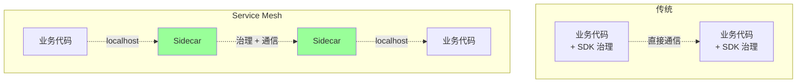
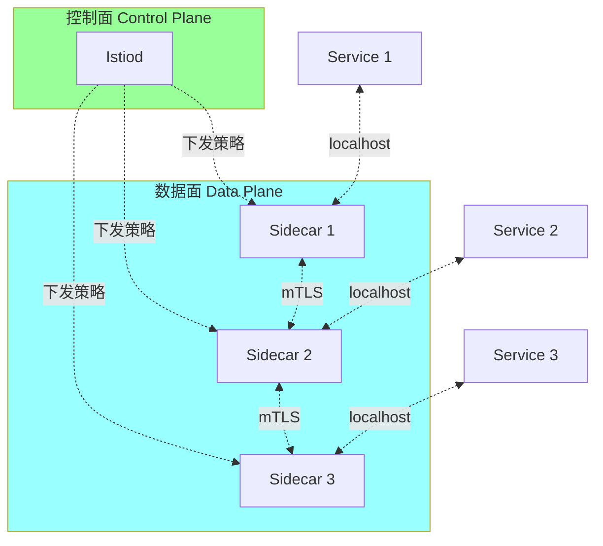
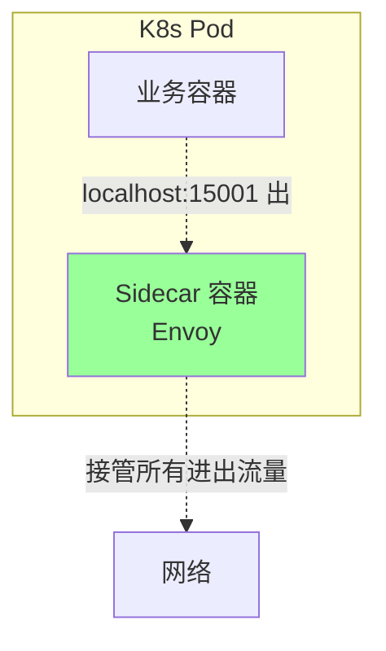
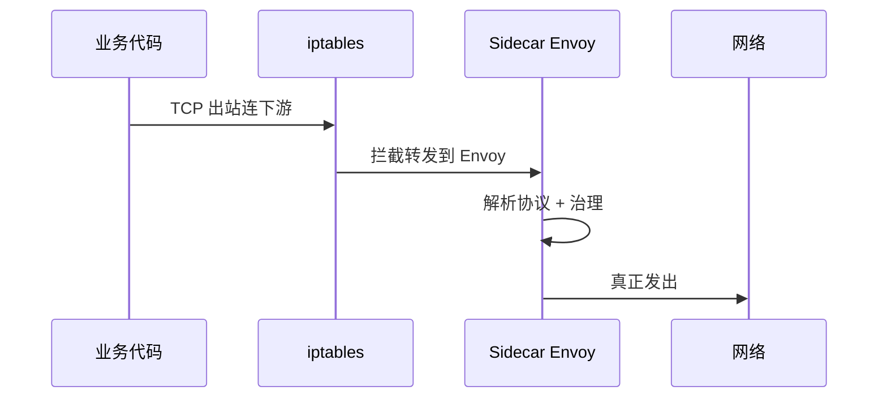
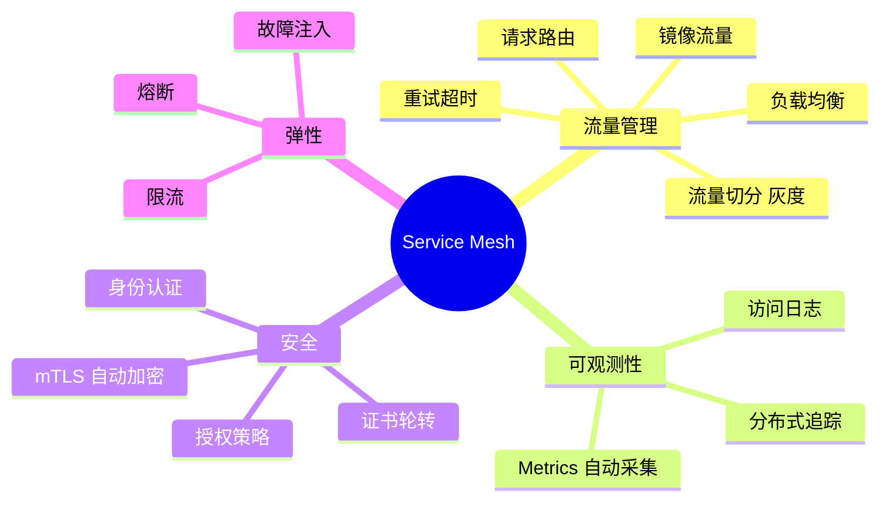
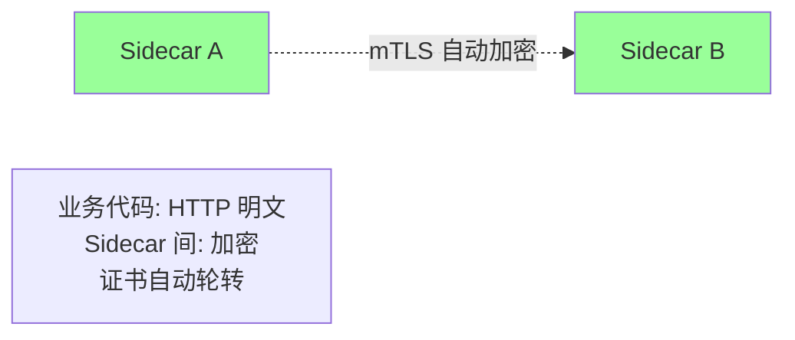
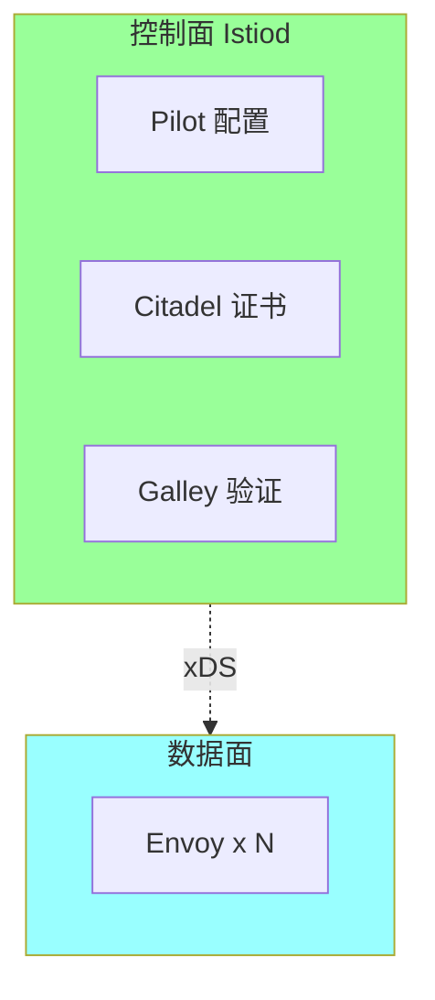
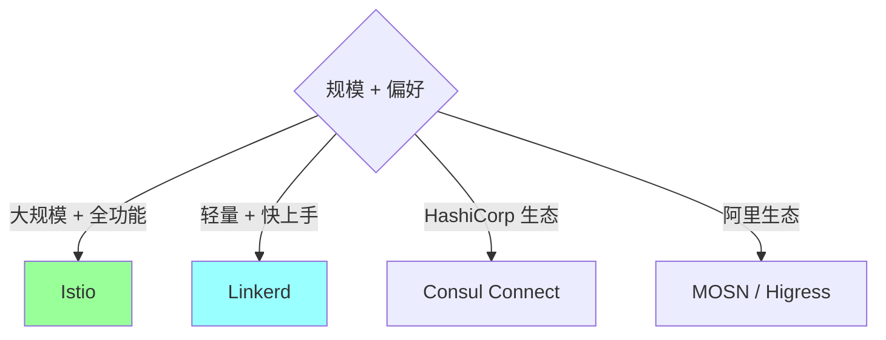
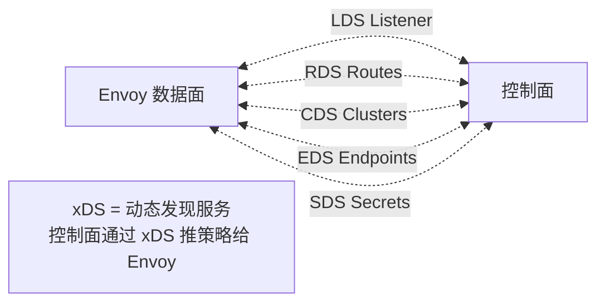
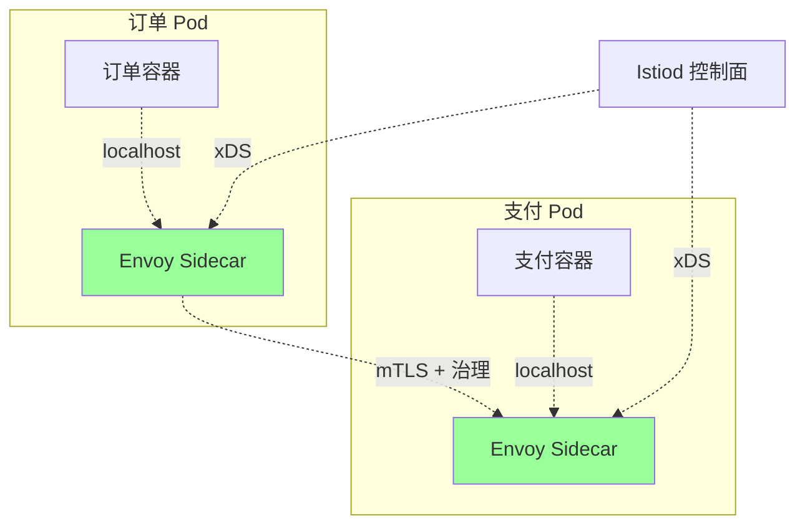

# 微服务 · Service Mesh

> Sidecar / 数据面 + 控制面 / Istio / Envoy / Linkerd / 性能开销 / 大厂自研 Mesh

> 架构演进背景见 08-architecture/01；本篇聚焦**Mesh 是什么 + 怎么用 + 真实代价**

## 一、Service Mesh 是什么

### 1.1 定义

> **Service Mesh = 把服务间通信和治理（限流、熔断、追踪、加密）从业务代码下沉到 Sidecar 代理，业务无感**



### 1.2 解决什么问题

```
传统 SDK 治理痛点:
  ❌ 多语言要写 N 套 SDK
  ❌ SDK 升级要业务跟着升
  ❌ 治理策略和业务代码耦合
  ❌ 复杂度堆在业务代码

Mesh 解决:
  ✅ 治理下沉到 Sidecar
  ✅ 多语言无差别
  ✅ 治理策略集中下发
  ✅ 业务代码极简
```

### 1.3 数据面 + 控制面



| | 控制面 | 数据面 |
| --- | --- | --- |
| 职责 | 配置下发 / 服务发现 / 策略管理 | 实际转发流量 |
| 性能要求 | 中（配置变更非实时） | 极高（每请求都过） |
| 代表 | Istiod / Linkerd Control | Envoy / Linkerd Proxy |

## 二、Sidecar 模式

### 2.1 Sidecar 架构



**核心**：
- 业务和 Sidecar 在**同一 Pod**（共享网络命名空间）
- 业务通过 `localhost` 连 Sidecar
- iptables / eBPF 透明拦截流量
- 业务**完全无感**

### 2.2 流量拦截



### 2.3 业务代码无变化

```go
// 业务代码：和直接调远程一样
client := pb.NewOrderClient(conn)  // conn 实际连 localhost Envoy
resp, err := client.CreateOrder(ctx, req)

// 限流/熔断/追踪/mTLS 都在 Envoy 做，业务无感
```

## 三、Mesh 提供的能力



### 3.1 mTLS（双向 TLS）



**收益**：
- 业务代码无需关心证书
- 自动证书轮转
- 全链路加密

### 3.2 流量切分（灰度）

```yaml
# Istio VirtualService
apiVersion: networking.istio.io/v1beta1
kind: VirtualService
metadata:
  name: order
spec:
  http:
  - route:
    - destination:
        host: order
        subset: v1
      weight: 90
    - destination:
        host: order
        subset: v2
      weight: 10
```

**业务无感**，配置层面调流量比例。

### 3.3 故障注入（混沌测试）

```yaml
http:
- fault:
    delay:
      percent: 10        # 10% 请求延迟 5s
      fixedDelay: 5s
    abort:
      percent: 5         # 5% 请求 500
      httpStatus: 500
  route:
  - destination:
      host: order
```

**测试系统在故障下的表现**，无需改代码。

### 3.4 自动可观测

```
不改业务代码:
  ✅ 自动 Metrics（QPS / 错误率 / 延迟分布）
  ✅ 自动追踪（生成 trace_id 透传）
  ✅ 自动访问日志
```

## 四、主流 Mesh 产品

### 4.1 Istio



**特点**：
- Google 主导
- 控制面：Istiod（合并了 Pilot/Citadel/Galley）
- 数据面：Envoy
- 功能最全（流量 / 安全 / 观测一应俱全）
- K8s 深度集成

**痛点**：
- 复杂（学习曲线陡）
- 资源开销大（每 Pod 多一个 Envoy）
- 升级成本高

### 4.2 Linkerd

**特点**：
- CNCF 项目
- 数据面：自研 Linkerd2-proxy（Rust）
- 比 Istio 轻量
- 上手简单
- 性能好（Rust）

**痛点**：功能少于 Istio（没那么"全家桶"）。

### 4.3 Consul Connect

**特点**：
- HashiCorp 出品
- 集成 Consul（注册中心 + Mesh）
- 多平台（不止 K8s）

### 4.4 Kuma

**特点**：
- Kong 出品
- 简单易用
- 跨平台

### 4.5 国内方案

| | 厂商 | 特点 |
| --- | --- | --- |
| **Dubbo Mesh** | 阿里 | 兼容 Dubbo |
| **MOSN** | 蚂蚁 | Go 实现 Sidecar |
| **OCTO Mesh** | 美团 | 基于 Envoy 改造 |
| **Aeraki** | 腾讯 | Istio + Aeraki |
| **Higress** | 阿里 | Envoy + 阿里增强 |

### 4.6 选型建议



**实战**：
- 中小公司：**不上 Mesh**（用 SDK 治理够用）
- 大公司：Istio（成熟）/ 自研（字节、美团）

## 五、Envoy 数据面

### 5.1 Envoy 是什么

```
- C++ 实现的高性能代理
- 支持 HTTP/1.1 / HTTP/2 / gRPC / TCP
- 动态配置（xDS API）
- 丰富的扩展（Filter Chain）
- Lyft 出品，CNCF 项目
- Istio / 阿里 Higress / AWS App Mesh 都用
```

### 5.2 xDS 协议



| | 内容 |
| --- | --- |
| LDS | 监听器（端口/协议） |
| RDS | 路由规则 |
| CDS | 上游集群 |
| EDS | 集群内实例 |
| SDS | 证书 |

xDS 已成行业标准，越来越多 Mesh 用 Envoy + xDS。

### 5.3 Envoy 性能

```
单节点 QPS: 10万+
延迟开销: 1-5ms
内存占用: 50-200MB
CPU: 1-2 核

业界标杆，性能 OK 但不轻量
```

## 六、Mesh 的真实代价

### 6.1 资源开销

```
每 Pod 多一个 Envoy:
  CPU: 0.1-0.5 核
  内存: 50-200MB

集群 1000 个 Pod → 100-500 核 / 50-200GB 额外开销

→ 资源成本上升 20-50%
```

### 6.2 延迟开销

```
每跳多 1-5ms (Envoy 处理 + 拦截)

A→B→C→D 4 跳:
  传统: 累计 RTT
  Mesh: 累计 RTT + 4-20ms

→ 对极致低延迟（<10ms）业务影响大
```

### 6.3 复杂度

```
学习成本:
  Istio: 几个月
  Linkerd: 几周

排查链路变长:
  问题: 业务 / Envoy / 控制面 / iptables 都可能
  调试: 看 Envoy 日志、xDS 配置、Pilot 状态

升级:
  数据面 Envoy 滚动更新
  控制面 Istio 升级
  兼容性矩阵复杂
```

### 6.4 何时该上

```
✅ 适合上 Mesh:
  - 微服务 > 几百
  - 多语言异构（Java/Go/Python/Node）
  - 有专门基础架构团队
  - 已经在 K8s 上

❌ 不适合上:
  - 服务 < 50
  - 单语言（SDK 够用）
  - 团队 < 100 人
  - 未上 K8s
  - 极致低延迟业务
```

## 七、SDK vs Mesh 对比

| | SDK 治理 | Mesh 治理 |
| --- | --- | --- |
| 治理位置 | 业务进程内 | Sidecar |
| 多语言 | 每语言一份 SDK | 透明 |
| 升级 | 业务跟升 | Sidecar 滚动升 |
| 资源开销 | 几乎无额外 | 每 Pod 多一份 |
| 延迟 | 极低 | +1-5ms |
| 复杂度 | 中（SDK 集成） | 高（Mesh 平台） |
| 治理粒度 | 代码级灵活 | 配置级 |
| 适合 | 单语言 / 小规模 | 多语言 / 大规模 |

**实战**：
- 字节早期 Kitex SDK，万亿级 RPC
- 后来逐步迁 OCTO Mesh / 自研 Mesh
- 关键服务可能保留 SDK（极致延迟）

## 八、ddd_order_example 接入 Mesh 思路

### 8.1 改造前

```mermaid
flowchart LR
    Order[订单服务<br/>+ Kitex SDK<br/>(限流/熔断/追踪)]
    Order -.直接.-> Pay[支付服务]
    Order -.直接.-> Product[商品服务]
```

### 8.2 改造后（Istio）



### 8.3 业务代码变化

```go
// 之前：Kitex SDK 自带治理
client := orderservice.NewClient("destService",
    client.WithRetryPolicy(...),
    client.WithCircuitBreaker(...),
    client.WithTracingMiddleware(...))

// 之后：纯调用，治理在 Envoy
client := orderservice.NewClient("destService")
client.CreateOrder(ctx, req)
```

### 8.4 治理配置（Istio）

```yaml
# 限流
apiVersion: networking.istio.io/v1beta1
kind: EnvoyFilter
spec:
  configPatches:
  - applyTo: HTTP_FILTER
    patch:
      value:
        name: envoy.filters.http.local_ratelimit
        # ... 限流配置

# 重试
apiVersion: networking.istio.io/v1beta1
kind: VirtualService
spec:
  http:
  - retries:
      attempts: 3
      perTryTimeout: 2s
    timeout: 10s
```

### 8.5 何时该改造

`ddd_order_example` 当前状态：
- 单体 → 不需要 Mesh
- 拆 3-5 个服务 → SDK 治理就够
- 拆到 100+ 服务 + 多语言 → 考虑 Mesh

## 九、典型坑

### 坑 1：上 Mesh 太早

```
团队 20 人，10 个服务，强行上 Istio
→ 学习成本拖慢业务
→ Sidecar 资源吃掉 30%
→ 排查链路变 3 倍长
```

**修复**：先用 SDK 治理，规模到了再上。

### 坑 2：忽略性能开销

```
Envoy 一跳 +5ms，4 跳链路 +20ms
对低延迟业务（IM / 游戏）灾难
```

**修复**：评估延迟敏感度，部分服务 bypass。

### 坑 3：控制面单点

```
Istiod 挂了 → 配置不能下发
新服务启动失败
```

**修复**：控制面高可用 + 数据面降级（用上次配置）。

### 坑 4：xDS 配置错误全网炸

```
改了 VirtualService → 路由错 → 全网 502
```

**修复**：灰度配置 + 自动回滚 + dry-run 验证。

### 坑 5：iptables 规则冲突

```
业务用了 iptables → 和 Envoy 拦截冲突
```

**修复**：改用 eBPF（Cilium）/ 谨慎使用 init container。

### 坑 6：mTLS 证书过期

```
节点时间不同步 → 证书验证失败 → 全部断连
```

**修复**：NTP 同步 + 监控证书状态。

### 坑 7：Sidecar 注入失败

```
某些 Pod 没注入 Sidecar → 治理失效
```

**修复**：admission webhook 强制注入 + 检查工具。

## 十、面试高频题

**Q1：Service Mesh 解决什么问题？**

把服务治理（限流/熔断/追踪/mTLS）从业务代码下沉到 Sidecar 代理：
- 多语言无差别
- 业务代码极简
- 治理策略集中下发
- SDK 升级解耦

**Q2：Sidecar 模式怎么工作？**

- 业务和 Sidecar 在同一 Pod（共享网络）
- 业务通过 localhost 连 Sidecar
- iptables / eBPF 透明拦截流量
- Sidecar 处理治理 + 转发

业务代码完全无感。

**Q3：数据面 vs 控制面？**

- 数据面：Sidecar 代理（Envoy / Linkerd-proxy），处理实际流量
- 控制面：Istiod / Linkerd Control，下发配置 + 服务发现

**Q4：Istio vs Linkerd？**

| | Istio | Linkerd |
| --- | --- | --- |
| 厂商 | Google | CNCF |
| 数据面 | Envoy (C++) | Linkerd2-proxy (Rust) |
| 功能 | 全 | 精简 |
| 复杂度 | 高 | 中 |
| 资源 | 高 | 低 |

**Q5：xDS 是什么？**

Envoy 的动态配置 API：
- LDS（监听器）/ RDS（路由）/ CDS（集群）/ EDS（端点）/ SDS（证书）

控制面通过 xDS 推策略给数据面，已成 Mesh 行业标准。

**Q6：Mesh 的真实代价？**

- 每 Pod 多 Sidecar（CPU/内存 +10-30%）
- 每跳延迟 +1-5ms
- 学习成本高（几个月）
- 排查链路长

**Q7：什么时候该上 Mesh？**

- 微服务 > 几百
- 多语言异构
- 有基础架构团队
- 已上 K8s

中小项目用 SDK 治理就够。

**Q8：Mesh 比 SDK 治理强在哪？**

- 多语言透明
- 治理策略集中
- SDK 升级解耦
- mTLS 自动
- 配置粒度更精细

**Q9：业务代码用 Mesh 后还要改吗？**

理论不用，业务调用照常。

实际可能微调：
- 移除 SDK 中的治理代码
- 适配新的 trace header 名称

**Q10：大厂自研 Mesh 的原因？**

- Istio 功能太重（自研裁剪）
- Envoy C++ 不够（自研 Go MOSN）
- 与已有体系融合（OCTO 兼容老协议）
- 极致性能优化

字节、美团、阿里都有自研。

## 十一、面试加分点

- Mesh = **治理下沉到 Sidecar**，业务代码极简
- **数据面 + 控制面**分离，xDS 是协议标准
- Sidecar 用 **iptables / eBPF** 透明拦截
- **Istio + Envoy** 是 Mesh 事实标准
- **Linkerd2-proxy 用 Rust**，比 Envoy 轻量
- **SDK vs Mesh** 不是 either-or，**可以混用**
- Mesh 真实代价：**资源 +20-50%**、**延迟 +1-5ms/跳**、**复杂度大幅上升**
- 中小项目**不要上 Mesh**，杀鸡用牛刀
- 大厂**自研 Mesh**（MOSN / OCTO / 字节），裁剪 Istio
- 极致低延迟服务可以 **bypass Sidecar**
- **xDS 越来越通用**，跨 Mesh 产品可移植
- Mesh 是微服务规模化后的**自然演进**，不是必须
