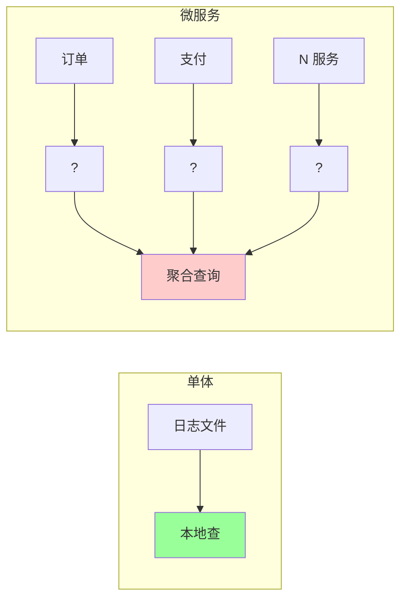
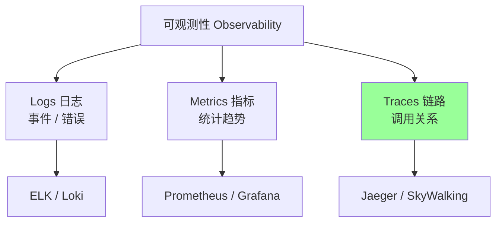
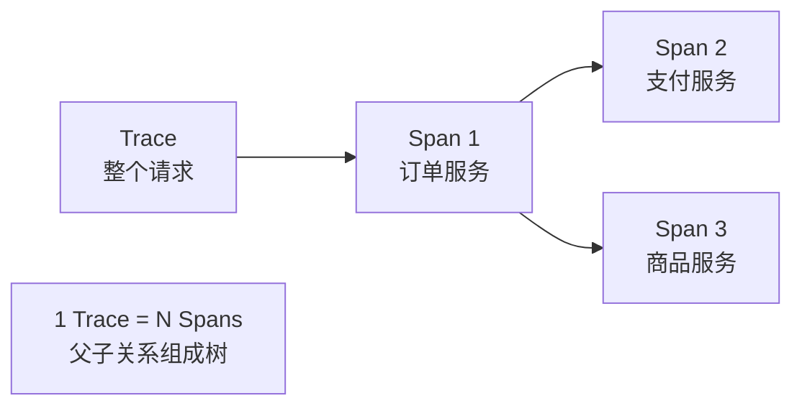
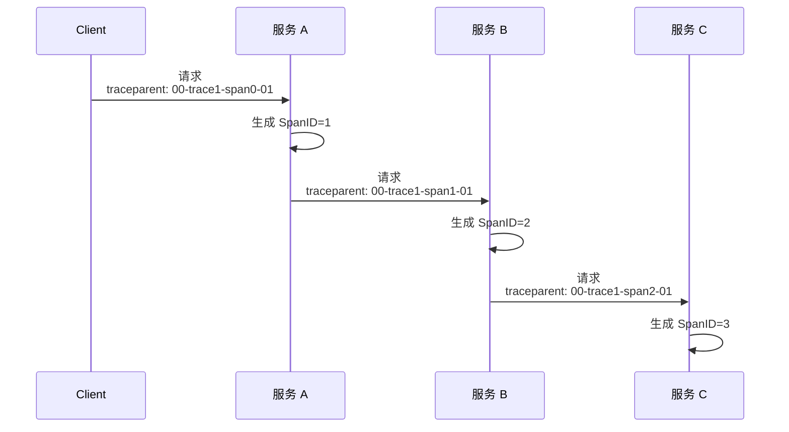
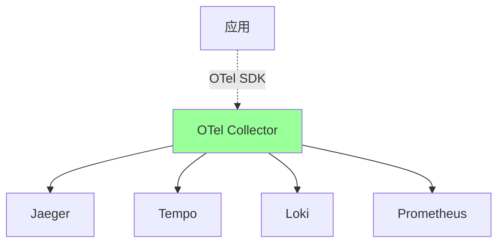
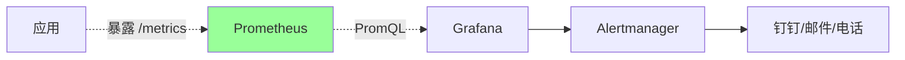
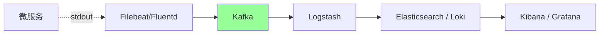
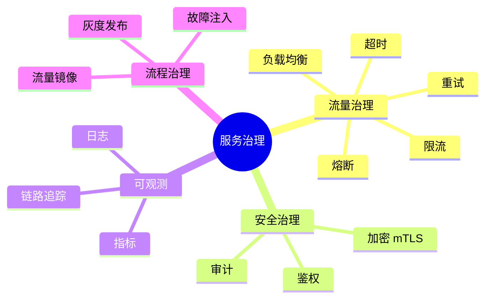
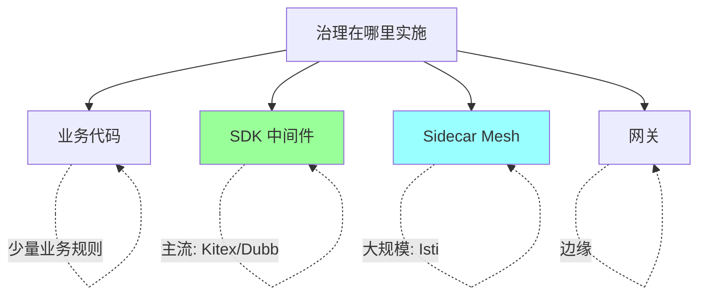
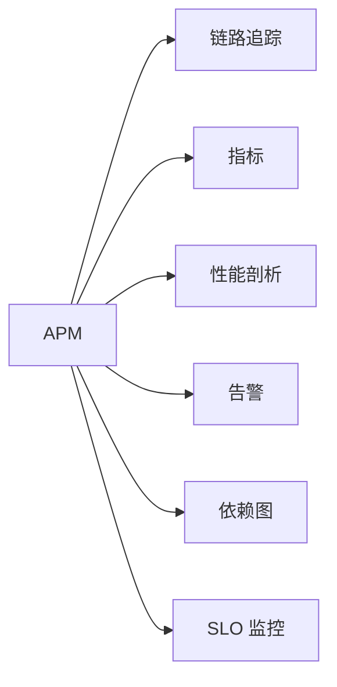

# 微服务 · 观测与治理

> 链路追踪 / OpenTelemetry / 日志聚合 / 指标监控 / 服务治理整合（限流熔断重试超时）/ 大厂方案

> 限流熔断细节见 06-distributed/06；本篇聚焦**微服务观测 + 治理的整合落地**

## 一、微服务的观测难点

### 1.1 单体 vs 微服务



**痛点**：
- 一次请求经过 N 个服务，每个服务一份日志
- 跨服务关联难（怎么找到同一次请求的所有日志）
- 性能问题难定位（哪个服务慢）
- 错误传播路径不清楚

## 二、可观测性三支柱



| | Logs | Metrics | Traces |
| --- | --- | --- | --- |
| 用途 | 查单个事件 | 看统计趋势 | 看调用关系 |
| 数据 | 文本流 | 时序数值 | 树状链 |
| 存储 | 大量 | 适中 | 大量 |
| 查询 | grep / 全文 | PromQL | 按 trace_id |

**三者互补**：监控发现异常 → 链路定位服务 → 日志查具体错误。

## 三、链路追踪

### 3.1 核心概念



| 概念 | 含义 |
| --- | --- |
| **TraceID** | 整个请求的唯一 ID |
| **SpanID** | 单次调用的 ID |
| **ParentSpanID** | 上游 SpanID（构建树） |
| **Span** | 一段操作（一次 RPC / DB 调用） |

### 3.2 一次完整链路示例

```
请求: POST /orders
  TraceID: abc123

订单服务 (Span 1)
  SpanID: 001, Parent: nil
  操作: HTTP /orders
  耗时: 200ms
  ├─ DB 查询 (Span 2)
  │   SpanID: 002, Parent: 001
  │   耗时: 10ms
  ├─ 调商品服务 (Span 3)
  │   SpanID: 003, Parent: 001
  │   ├─ DB (Span 4)
  │   │   SpanID: 004, Parent: 003
  │   │   耗时: 5ms
  ├─ 调支付服务 (Span 5)
  │   SpanID: 005, Parent: 001
  │   耗时: 100ms
```

### 3.3 上下文传播



**关键**：trace_id + parent_span_id 通过 HTTP header / RPC metadata 透传。

### 3.4 Header 标准

W3C Trace Context（OpenTelemetry 推）：
```
traceparent: 00-{trace_id}-{span_id}-{flags}
tracestate: key1=val1,key2=val2
```

旧标准（B3 / Zipkin）：
```
X-B3-TraceId: ...
X-B3-SpanId: ...
X-B3-ParentSpanId: ...
```

### 3.5 采样

```
全量采集 → 数据爆炸
1/100 采样 → 平均 99% 请求没追踪

策略:
  ✅ 头采样（一开始决定）
  ✅ 尾采样（看完整请求再决定，留有问题的）
  ✅ 业务关键路径全采（订单 / 支付）
  ✅ 错误请求全采（自动）
```

### 3.6 主流追踪工具

| | Jaeger | Zipkin | SkyWalking | Tempo |
| --- | --- | --- | --- | --- |
| **厂商** | Uber/CNCF | Twitter | 华为/Apache | Grafana |
| **协议** | OpenTelemetry/Jaeger | Zipkin | OpenTelemetry/SkyWalking | OpenTelemetry |
| **存储** | Cassandra/ES/Badger | Cassandra/ES | ES/H2/MySQL | S3/GCS（便宜） |
| **UI** | 简洁 | 简单 | 强大（含 APM） | 集成 Grafana |
| **采样** | 头/尾采样 | 头采样 | 灵活 | 头/尾 |
| **代表用户** | Uber/字节 | 老牌 | 国内主流 | 云原生 |

### 3.7 Jaeger 示例

```go
import (
    "go.opentelemetry.io/otel"
    "go.opentelemetry.io/otel/exporters/jaeger"
)

func InitTracer() {
    exporter, _ := jaeger.New(jaeger.WithCollectorEndpoint(...))
    tp := tracesdk.NewTracerProvider(
        tracesdk.WithBatcher(exporter),
        tracesdk.WithSampler(tracesdk.TraceIDRatioBased(0.1)),  // 10% 采样
    )
    otel.SetTracerProvider(tp)
}

// 业务代码
func (s *OrderService) CreateOrder(ctx context.Context, ...) {
    tracer := otel.Tracer("order-service")
    ctx, span := tracer.Start(ctx, "CreateOrder")
    defer span.End()

    span.SetAttributes(attribute.String("user_id", userID))

    // 调用下游会自动透传
    s.paymentClient.CreatePayment(ctx, ...)
}
```

## 四、OpenTelemetry（OTel）

### 4.1 OTel 是什么

> **可观测性的开放标准**：统一 logs/metrics/traces 的数据模型 + API + SDK + Collector



### 4.2 优势

```
✅ 统一标准（替换碎片化）
✅ 多语言 SDK（Go/Java/Python/Node...）
✅ Collector 解耦后端（换后端不改代码）
✅ 自动 instrumentation（自动埋点）
✅ CNCF 顶级项目（已成事实标准）
```

### 4.3 OTel Collector

```yaml
# otel-collector.yaml
receivers:
  otlp:
    protocols:
      grpc:
      http:

processors:
  batch:
  attributes:
    actions:
      - key: env
        value: prod
        action: insert

exporters:
  jaeger:
    endpoint: jaeger:14250
  prometheus:
    endpoint: ":9090"
  loki:
    endpoint: http://loki:3100
```

Collector 做：
- 接收数据（OTLP / Jaeger / Zipkin / Prometheus）
- 处理（批量 / 采样 / 添加属性）
- 导出（多个后端）

### 4.4 自动埋点

```go
// 自动 instrumentation - HTTP
http.Handle("/", otelhttp.NewHandler(myHandler, "my-handler"))

// 自动 instrumentation - DB
db, _ := otelsql.Open("mysql", dsn)

// 自动 instrumentation - gRPC
conn, _ := grpc.Dial(addr,
    grpc.WithUnaryInterceptor(otelgrpc.UnaryClientInterceptor()),
)
```

业务无侵入，自动生成 trace。

## 五、指标监控

### 5.1 Prometheus + Grafana 标配



### 5.2 四大黄金信号（Google SRE）

| 信号 | 监控什么 |
| --- | --- |
| **Latency** | 延迟（P50/P95/P99） |
| **Traffic** | 流量（QPS） |
| **Errors** | 错误率 |
| **Saturation** | 饱和度（资源使用率） |

### 5.3 RED 方法（面向服务）

| | 含义 |
| --- | --- |
| **Rate** | 请求速率 |
| **Errors** | 错误率 |
| **Duration** | 延迟 |

### 5.4 USE 方法（面向资源）

| | 含义 |
| --- | --- |
| **Utilization** | 利用率 |
| **Saturation** | 饱和度 |
| **Errors** | 错误数 |

### 5.5 Prometheus 示例

```go
import "github.com/prometheus/client_golang/prometheus"

var (
    requestsTotal = prometheus.NewCounterVec(
        prometheus.CounterOpts{Name: "http_requests_total"},
        []string{"method", "path", "status"},
    )
    requestDuration = prometheus.NewHistogramVec(
        prometheus.HistogramOpts{
            Name:    "http_request_duration_seconds",
            Buckets: []float64{0.001, 0.01, 0.1, 1, 10},
        },
        []string{"method", "path"},
    )
)

func init() {
    prometheus.MustRegister(requestsTotal, requestDuration)
}

// 中间件
func MetricsMiddleware(next http.Handler) http.Handler {
    return http.HandlerFunc(func(w http.ResponseWriter, r *http.Request) {
        start := time.Now()
        wrapped := wrapResponseWriter(w)
        next.ServeHTTP(wrapped, r)

        requestsTotal.WithLabelValues(r.Method, r.URL.Path,
            strconv.Itoa(wrapped.status)).Inc()
        requestDuration.WithLabelValues(r.Method, r.URL.Path).
            Observe(time.Since(start).Seconds())
    })
}
```

### 5.6 PromQL 示例

```promql
# QPS
rate(http_requests_total[1m])

# 错误率
sum(rate(http_requests_total{status=~"5.."}[1m]))
/
sum(rate(http_requests_total[1m]))

# P99 延迟
histogram_quantile(0.99,
  rate(http_request_duration_seconds_bucket[1m]))

# 服务饱和度
node_cpu_usage / node_cpu_total
```

## 六、日志聚合

### 6.1 日志架构



### 6.2 ELK / EFK / Loki 对比

| | ELK | EFK | Loki |
| --- | --- | --- | --- |
| **采集** | Filebeat | Fluentd/Fluent Bit | Promtail |
| **存储** | Elasticsearch | Elasticsearch | Loki（按 label） |
| **UI** | Kibana | Kibana | Grafana |
| **成本** | 高（全文索引） | 高 | 低（不全文索引） |
| **查询** | DSL（Lucene） | DSL | LogQL（类 PromQL） |
| **适合** | 复杂查询 | K8s | 云原生轻量 |

**Loki 的杀手锏**：只索引 label，日志内容压缩存对象存储 → **存储成本低 10 倍**。

### 6.3 日志规范

```go
// ❌ 反例：纯文本无结构
log.Println("user logged in:", userID)

// ✅ 正例：结构化日志（JSON）
logger.Info("user logged in",
    zap.String("user_id", userID),
    zap.String("trace_id", traceID),
    zap.Time("login_at", time.Now()),
)

// 输出:
// {"level":"info","msg":"user logged in","user_id":"123","trace_id":"abc"}
```

**最佳实践**：
- JSON 格式（机器可解析）
- 必带 trace_id / span_id（关联链路）
- 必带 service / env
- 错误用 `zap.Error(err)`
- 日志写 stdout（K8s / Docker 收集）
- 别写文件（容器易丢）

### 6.4 日志级别

```
DEBUG: 开发调试，生产关闭
INFO:  关键业务事件（订单创建、登录）
WARN:  可恢复异常（重试中）
ERROR: 错误（业务/系统）
FATAL: 严重错误，进程退出

→ 生产开 INFO+，避免 DEBUG 噪音
```

## 七、服务治理整合

### 7.1 治理能力总览



### 7.2 实施位置



### 7.3 SDK 治理实战（Kitex）

```go
import (
    "github.com/cloudwego/kitex/client"
    "github.com/cloudwego/kitex/pkg/circuitbreak"
    "github.com/cloudwego/kitex/pkg/retry"
)

// 创建带治理的客户端
cli, _ := orderservice.NewClient("order",
    client.WithCircuitBreaker(cbSuite),
    client.WithRetryPolicy(retry.BuildFailurePolicy(...)),
    client.WithRPCTimeout(200 * time.Millisecond),
    client.WithMiddleware(tracingMW),
    client.WithMiddleware(metricsMW),
)
```

### 7.4 治理参数最佳实践

```
超时:
  □ 所有 RPC 必有超时（< 5s）
  □ 链路递减（A 5s → B 4s → C 3s）

重试:
  □ 只重试幂等接口（GET / 带幂等键）
  □ 退避（exponential backoff）
  □ 最多 3 次

熔断:
  □ 错误率 50% + 总请求 > 20 → Open
  □ 30s 冷却 → Half-Open
  □ 单实例熔断 vs 整服务熔断

限流:
  □ 多维度（用户/IP/接口）
  □ 网关粗限 + 应用细限
  □ 优先令牌桶
```

## 八、APM（应用性能管理）

### 8.1 APM 整合



APM 把多种观测整合在一个平台，给运维一站式视图。

### 8.2 主流 APM 产品

| | SkyWalking | Pinpoint | Datadog | New Relic | 自研 |
| --- | --- | --- | --- | --- | --- |
| **开源** | ✅ | ✅ | ❌ | ❌ | - |
| **国内强** | ✅ | - | ✅ | - | 大厂普遍 |
| **特点** | 全栈 | 全自动埋点 | 商业 SaaS | 商业 | 内部定制 |

### 8.3 大厂自研 APM

| | 厂商 | 名字 |
| --- | --- | --- |
| 阿里 | Eagle Eye / ARMS | 链路追踪 + APM |
| 字节 | TraceLog / OCTO Trace | 万亿级链路 |
| 美团 | Mafka / OCTO | 全链路追踪 |
| 腾讯 | TAPM | 应用性能监控 |
| B 站 | 自研 | 整合 Kratos |

## 九、SLO 与告警

### 9.1 SLO 监控

```yaml
# 订单服务 SLO
slo:
  availability: 99.9%      # 月不可用 < 43 分钟
  p99_latency: 200ms
  error_rate: < 0.1%

error_budget:
  monthly: 43 minutes
```

### 9.2 告警分级

| 级别 | 响应 | 示例 |
| --- | --- | --- |
| P0 致命 | 5 分钟内电话 | 核心服务全挂 |
| P1 严重 | 30 分钟短信 | 错误率 > 5% |
| P2 一般 | 工作时间 | 慢查询、磁盘 80% |
| P3 通知 | 日报 | 配置变更 |

详见 08-architecture/02-high-availability。

### 9.3 告警最佳实践

```
□ 告警要可操作（没法处理的别告警）
□ 同一故障合并（不要发 100 条）
□ 高级告警自动升级
□ 静默期（变更窗口）
□ 告警注释（怎么处理）
□ 误报率 < 5%
```

## 十、ddd_order_example 接入观测

### 10.1 完整观测栈

```yaml
# 接入清单
追踪: OpenTelemetry SDK + Jaeger
指标: Prometheus + Grafana
日志: Zap (JSON) + Loki + Grafana
告警: Alertmanager + 钉钉
APM: SkyWalking 或自研整合
```

### 10.2 中间件示例

```go
// HTTP 中间件统一注入观测
func ObservabilityMiddleware(next http.Handler) http.Handler {
    return http.HandlerFunc(func(w http.ResponseWriter, r *http.Request) {
        // 1. 提取 trace context
        ctx := otel.GetTextMapPropagator().Extract(r.Context(),
            propagation.HeaderCarrier(r.Header))

        // 2. 创建 span
        ctx, span := tracer.Start(ctx, r.URL.Path)
        defer span.End()
        traceID := span.SpanContext().TraceID().String()

        // 3. 日志加 trace_id
        ctx = logger.WithContext(ctx, zap.String("trace_id", traceID))

        // 4. metrics
        start := time.Now()
        wrapped := wrapResponseWriter(w)
        next.ServeHTTP(wrapped, r.WithContext(ctx))

        requestDuration.WithLabelValues(r.Method, r.URL.Path).
            Observe(time.Since(start).Seconds())
    })
}
```

### 10.3 跨服务透传

```go
// gRPC 客户端拦截器
conn, _ := grpc.Dial(addr,
    grpc.WithUnaryInterceptor(
        otelgrpc.UnaryClientInterceptor(),  // 自动注入 trace context
    ),
)

// gRPC 服务端拦截器
grpc.NewServer(
    grpc.UnaryInterceptor(
        otelgrpc.UnaryServerInterceptor(),  // 自动提取 trace context
    ),
)
```

### 10.4 关键监控大盘

```
订单服务:
  □ QPS / 错误率 / P99
  □ 各接口延迟分布
  □ 调用下游成功率（支付/商品）
  □ DB 慢查询
  □ Redis 命中率
  □ JVM/Go 内存 GC

业务大盘:
  □ 订单创建数（实时）
  □ 各状态订单分布
  □ 转化漏斗
  □ 异常订单
```

## 十一、典型坑

### 坑 1：trace_id 没透传

```
A→B 没传 trace_id → 链路断了 → 排查发现两段
```

**修复**：用 OTel SDK 自动透传 + 中间件强制。

### 坑 2：日志没加 trace_id

```
日志 grep error → 找到错误 → 但无法关联其他日志
```

**修复**：所有日志自动带 trace_id。

### 坑 3：采样率太低

```
1% 采样 → 偶发 bug 找不到
```

**修复**：错误请求 100% 采样 + 关键路径全采。

### 坑 4：监控指标爆炸

```
Prometheus label 维度过多 → 时序数据 1 亿+ → 查询慢/OOM
```

**修复**：限制 label 基数（IP / 用户 ID 不要做 label）。

### 坑 5：日志写文件

```
容器写日志文件 → 容器重启日志丢
```

**修复**：写 stdout，由 Docker / K8s 收集。

### 坑 6：告警风暴

```
故障期间 1000 条告警 → 真问题被淹没
```

**修复**：告警聚合 + 分级 + 静默。

### 坑 7：SDK 治理 + Mesh 治理冲突

```
SDK 限流 + Mesh 也限流 → 双重限流，业务挂
```

**修复**：选一个层做治理。

## 十二、面试高频题

**Q1：可观测性三支柱？**

Logs / Metrics / Traces。

互补：监控发现异常 → 链路定位服务 → 日志查具体错误。

**Q2：链路追踪原理？**

- 每请求生成 trace_id
- 每次调用生成 span_id（带 parent_span_id）
- trace_id + span_id 通过 header 透传
- 后端聚合所有 span 形成树

**Q3：OpenTelemetry 是什么？**

可观测性开放标准：统一 logs/metrics/traces 的数据模型 + API + SDK + Collector。

CNCF 顶级项目，行业事实标准。

**Q4：Jaeger / SkyWalking / Zipkin 怎么选？**

- 通用 + 云原生：**Jaeger**
- 国内 + APM 一体：**SkyWalking**
- 老牌简单：Zipkin
- 云原生轻量：Tempo

**Q5：四大黄金信号？**

Latency / Traffic / Errors / Saturation。

Google SRE 方法论，覆盖核心维度。

**Q6：Prometheus 适合什么？不适合什么？**

适合：时序指标、统计监控、分布式系统。

不适合：日志（用 Loki）、链路（用 Jaeger）、长期存储（默认 15 天）。

**Q7：日志怎么规范？**

- JSON 结构化
- 必带 trace_id / service / env
- 写 stdout
- 区分 INFO / WARN / ERROR
- 错误带堆栈

**Q8：ELK vs Loki？**

| | ELK | Loki |
| --- | --- | --- |
| 索引 | 全文 | 仅 label |
| 成本 | 高 | 低 10x |
| 查询 | 强 | 较弱 |
| 适合 | 复杂查询 | 云原生 |

**Q9：服务治理在哪一层做？**

- 业务代码：少量业务规则
- SDK：主流（Kitex/Dubbo）
- Sidecar：大规模（Istio）
- 网关：边缘

实战常 SDK + 网关组合。

**Q10：怎么定位"系统慢了"？**

```
1. Metrics 看 P99 / 错误率（哪个服务）
2. Trace 看慢请求链路（哪个调用慢）
3. 日志看错误详情
4. Profile 看 CPU/内存
```

**Trace + Metrics + Logs 联动**是关键。

## 十三、面试加分点

- 可观测性 = **Logs + Metrics + Traces**，三者互补
- **OpenTelemetry 已成行业标准**，新项目首选
- **trace_id 必须全链路透传**（HTTP header + RPC metadata）
- **日志带 trace_id** 才能关联链路
- **采样**：错误 100% + 关键路径全采 + 其他 1-10%
- **四大黄金信号 / RED / USE** 是监控方法论
- **Prometheus + Grafana** 是指标监控事实标准
- **Loki 比 ELK 便宜 10x**（不全文索引）
- **结构化 JSON 日志**写 stdout，机器可解析
- **告警可操作 + 分级 + 聚合** 防告警疲劳
- 治理选一层做（**SDK 或 Mesh**），不要重复
- 大厂 APM 多自研：阿里 Eagle Eye / 字节 OCTO / 美团 Mafka
