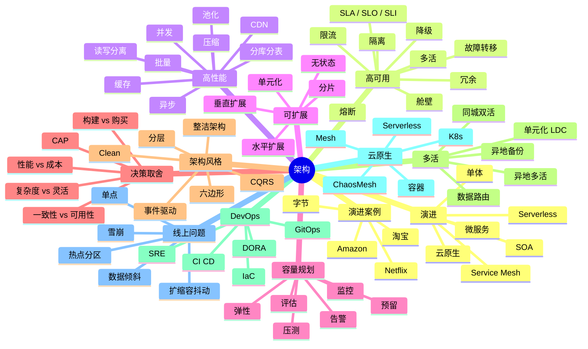
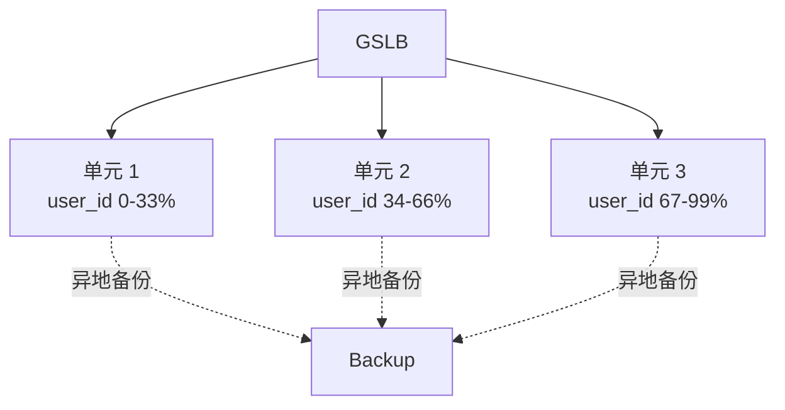
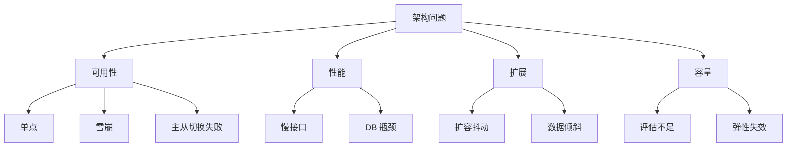
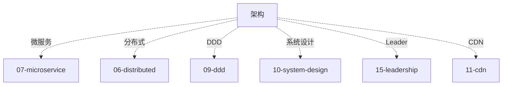

# 架构知识地图

> 架构是**资深 / 技术专家面试的灵魂**。从单体演进、高可用、高性能、可扩展到容量规划、决策取舍，全是取舍的艺术。
>
> 这份地图是 08-architecture 目录的总览：知识树 / 题型分类 / 学习路径 / 系统设计 / 决策框架 / 答题方式

---

## 一、整体知识树



---

## 二、后端视角的架构

| 架构能力 | 后端解决的问题 |
| --- | --- |
| 高可用 | 99.99% / 99.999% 可用性 |
| 高性能 | ms 级响应 + 万级 QPS |
| 可扩展 | 弹性扩缩容 / 业务增长无压力 |
| 容量规划 | 大促前扩容 / 平时省钱 |
| 多活 | 单 AZ 挂不影响用户 |
| 单元化 | 按用户 ID 路由 / 故障隔离 |
| 降级 | 核心保证 / 非核心可关 |
| 熔断 | 防止级联失败 |
| 限流 | 保护系统 / 公平分配 |
| 缓存 | 减 DB 压力 5-10x |
| 异步化 | 解耦 + 削峰 |
| 读写分离 | 扩展读容量 |

---

## 三、能力分层（资深 Go 后端）

```text
L1 演进
  单体/SOA/微服务/Mesh/Serverless 演进历史

L2 高可用
  冗余 / 故障转移 / 限流 / 熔断 / 降级 / 多活

L3 高性能
  缓存 / 异步 / 分库分表 / 读写分离 / CDN

L4 可扩展
  水平/垂直 / 分片 / 无状态 / 单元化

L5 容量规划
  压测 / 评估 / 弹性 / 监控告警

L6 决策取舍
  CAP / 性能 vs 成本 / 构建 vs 购买

L7 架构风格
  分层 / 事件驱动 / CQRS / 六边形 / 整洁

L8 系统设计
  秒杀 / 大促 / 多活 / 单元化 实战方案
```


---

## 四、题型分类

### 4.1 基础题（P5）

```
□ 单体 vs 微服务
□ SLA / SLO / SLI 区别
□ 限流熔断降级区别
□ 高可用基本思路
```

对应：[01](01-evolution.md) / [02](02-high-availability.md)

### 4.2 中级题（P6）

```
□ 高可用 5 大手段
□ 高性能 6 大手段
□ 水平 vs 垂直扩展
□ 分库分表策略
□ 多活方案对比
□ 容量规划流程
```

对应：[02](02-high-availability.md) / [03](03-high-performance.md) / [04](04-scalability.md) / [05](05-capacity-planning.md)

### 4.3 资深题（P7+）

```
□ 单元化架构设计（蚂蚁 LDC）
□ 异地多活数据同步
□ 错误预算（Error Budget）
□ 大促容量评估完整流程
□ 架构决策 ADR
□ 构建 vs 购买决策
□ Cell-based 架构（AWS）
□ 混沌工程实施
```

对应：[02](02-high-availability.md) / [04](04-scalability.md) / [05](05-capacity-planning.md) / [06](06-decision-tradeoff.md)

### 4.4 综合系统设计（P7-P8）

```
□ 设计秒杀/大促架构
□ 设计多活架构
□ 设计数据平台
□ 容量规划方案
□ 单体改微服务
□ 从 1w 到 100w QPS 演进
```

对应：全部 + [../10-system-design/16](../10-system-design/16-high-concurrency-scenarios.md)

### 4.5 线上排查题

```
□ SLA 掉线怎么办？
□ 扩容后性能反而下降
□ 大促容量不足应急
□ 多活切流失败
□ 数据倾斜
```

对应：[02](02-high-availability.md) + [../13-engineering/00-troubleshooting-runbook](../13-engineering/00-troubleshooting-runbook.md)

---

## 五、目录文件全览

| # | 文件 | 重点 |
| --- | --- | --- |
| 01 | [演进](01-evolution.md) | 单体 → SOA → 微服务 → Mesh → Serverless |
| 02 | [高可用](02-high-availability.md) | 冗余 / 故障转移 / 限流 / 熔断 / 降级 / 多活 |
| 03 | [高性能](03-high-performance.md) | 缓存 / 异步 / 分库分表 / 读写分离 / CDN |
| 04 | [可扩展](04-scalability.md) | 水平 / 垂直 / 分片 / 无状态 / 单元化 |
| 05 | [容量规划](05-capacity-planning.md) | 评估 / 压测 / 弹性 / 监控 |
| 06 | [决策取舍](06-decision-tradeoff.md) | CAP / ADR / 构建 vs 购买 |

---

## 六、在系统设计中的角色

### 6.1 单元化架构（LDC）



### 6.2 多活三种方案

```
同城双活：延迟低，容灾 AZ 级
异地多活：延迟高，容灾 Region 级
单元化：业务单元独立 + 异地备份
```

### 6.3 容量规划 T-90 → T+7

```
T-90: 评估
T-60: 改造
T-30: 扩容
T-14: 压测
T-7:  预案
T-1:  演练
T:    值守
T+7:  复盘 + 缩容
```

---

## 七、线上问题分类地图



---

## 八、学习路径推荐

### 8.1 入门 → 资深（6 周）

```
Week 1: 演进
  01 evolution

Week 2: 高可用
  02 HA + 多活

Week 3: 高性能
  03 performance + 缓存/异步

Week 4: 可扩展
  04 scalability + 单元化

Week 5: 容量 + 决策
  05 capacity + 06 tradeoff

Week 6: 综合实战
  ../10-system-design
```

---

## 九、答题模板

### 9.1 高可用题（"怎么保 99.99%"）

```
4 层:
1. 冗余（集群 + 主从 + 多活）
2. 故障转移（健康检查 + 自动切换）
3. 流量治理（限流 + 熔断 + 降级 + 隔离）
4. 运维保障（监控告警 + SRE + 混沌工程）
```

### 9.2 高性能题（"如何从 1k 到 100w QPS"）

```
演进 4 步:
1. 1k QPS: 单体 + 缓存
2. 1w QPS: 读写分离 + Redis
3. 10w QPS: 分库分表 + MQ 异步
4. 100w QPS: 多活 + 单元化 + CDN
```

### 9.3 决策题（"构建 vs 购买"）

```
3 步:
1. 核心竞争力 → 自研
2. 通用能力 → 买
3. 评估: 成本 / 时间 / 团队能力 / 锁定风险
```

---

## 十、面试表达

```text
架构 8 层：
- L1 演进（单体到 Mesh）
- L2 高可用（冗余 + 治理）
- L3 高性能（缓存 + 异步 + 分片）
- L4 可扩展（水平 / 单元化）
- L5 容量（压测 + 弹性）
- L6 决策（ADR / 取舍）
- L7 风格（CQRS / 六边形）
- L8 系统设计

架构没有对错，只有合适。
回答优先讲"取舍"，不讲"银弹"。
```

---

## 十一、常见误区

### 误区 1：微服务一定比单体好

错。规模匹配最重要。小团队单体够用。

### 误区 2：99.999% 可用性可以追求

极难。互联网产品 99.9% / 99.99% 已足够。**99.999%** 成本指数级。

### 误区 3：多活可以完全异步

部分错。**强一致业务需要同步**，最终一致可异步。

### 误区 4：容量规划靠拍脑袋

错。必须**历史数据 + 压测 + 监控**三结合。

### 误区 5：决策靠技术先进

错。**业务驱动 + 团队能力 + 成本**三重考虑。

---

## 十二、与其他模块的关系



---

## 十三、面试加分点

- **从 1k → 100w QPS 演进路径**
- **Cell-based** 架构（AWS 最佳实践）
- **错误预算**（Error Budget）
- **ADR**（架构决策记录）
- **构建 vs 购买** 决策框架
- **SLA / SLO / SLI** 区别 + 设定
- **单元化架构**（蚂蚁 LDC）
- **混沌工程**（Netflix Chaos Monkey）
- **容量规划 T-90 → T+7** 完整流程
- **压测实战**（影子表 / 全链路）
- **降级预案 + 一键开关**
- **4 大黄金信号**（SRE）
- **DORA 4 key metrics**

---

## 十四、推荐阅读路径

```
入门:
  □ 《架构整洁之道》
  □ 08-architecture/01-03

进阶:
  □ 《Designing Data-Intensive Applications》
  □ 《SRE Google 运维解密》
  □ 08-architecture/04-06

资深:
  □ AWS Well-Architected
  □ Netflix / Amazon 架构演进博客
  □ Martin Fowler 博客
```

---

## 十五、与 99-meta 的关联

```
跨主题索引: 99-meta/01-cross-topic-index.md
综合实战:   10-system-design/16-high-concurrency-scenarios.md
```
