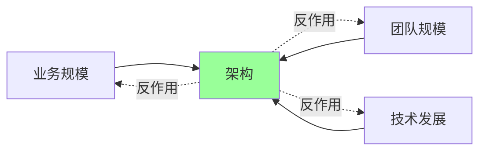
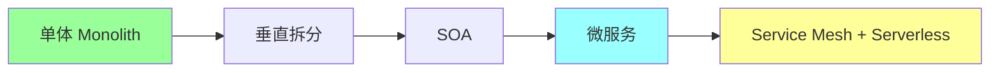
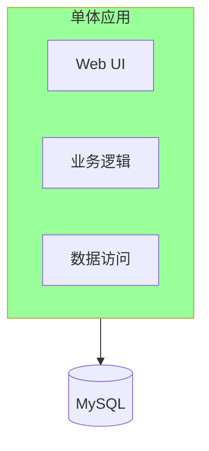
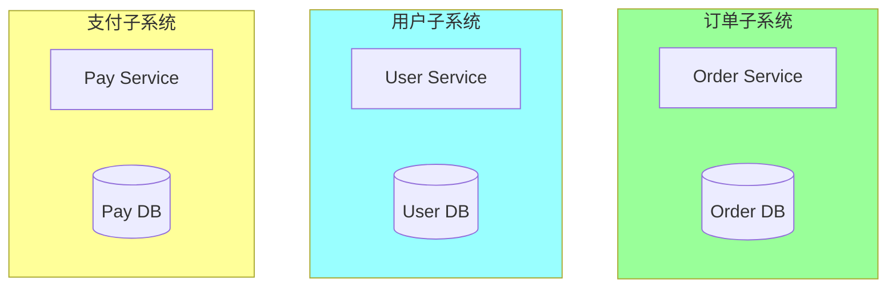
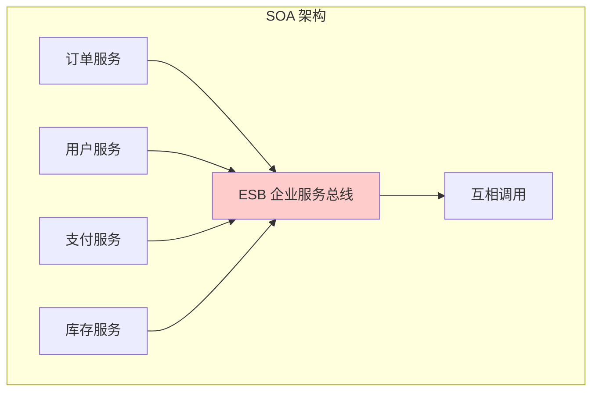
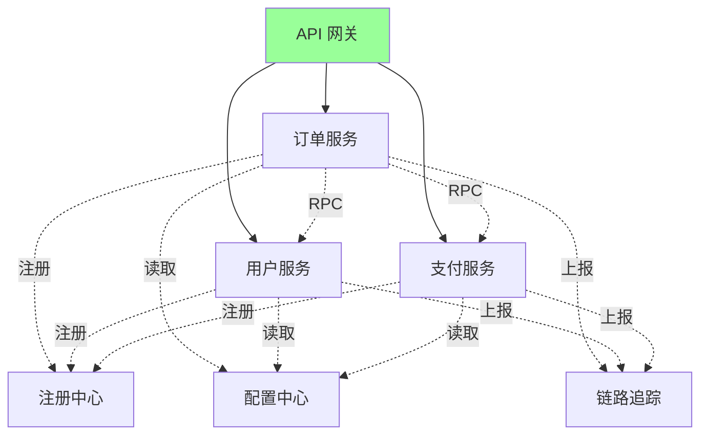
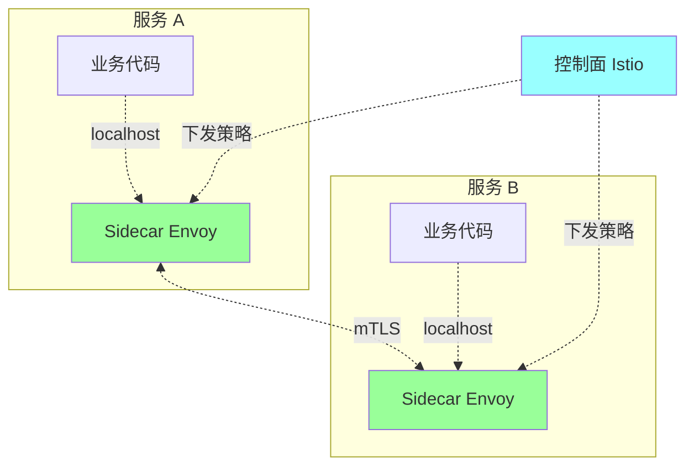
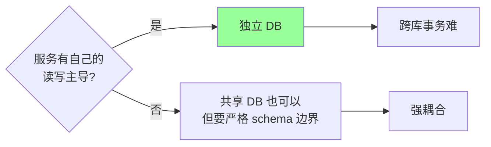
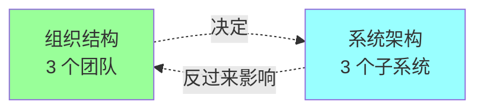
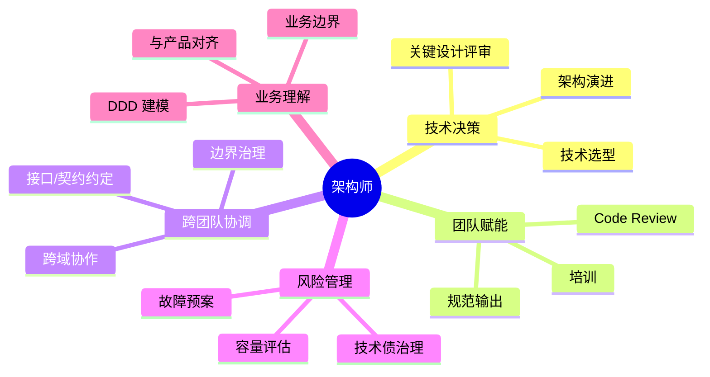

# 架构 · 演进与方法论

> 单体 / SOA / 微服务 / Serverless / Service Mesh / 何时拆分 / 康威定律 / 架构师角色

> 不重复 DDD 战略 / 微服务组件细节，聚焦"从哪里到哪里、为什么、什么时候"

## 一、为什么要懂架构演进

架构不是一开始就定型的，是**业务规模 + 团队规模 + 技术发展**三者推动的演进结果。



**核心原则**：
- 不为了用新技术而拆
- 不为了显得"现代"而搞微服务
- **当前架构能撑得住业务和团队规模，就是好架构**

## 二、架构演进路径

### 2.1 五个阶段



| 阶段 | 时机 | 团队规模 |
| --- | --- | --- |
| 单体 | 0 → 100 万 DAU | < 20 人 |
| 垂直拆分 | 模块边界清晰，部署独立 | 20-50 人 |
| SOA | 服务化复用 + ESB | 50-200 人 |
| 微服务 | 业务复杂、独立演化 | 100+ 人多团队 |
| Service Mesh / Serverless | 微服务规模化、运维复杂 | 大厂 / 几百人 |

**关键**：阶段不是越后越好，是和**当前规模相匹配**的最优。

### 2.2 单体阶段



**特征**：一个进程、一份代码、一个数据库。

**优点**：
- 开发快（IDE 跳转、调试简单）
- 部署简单（一个 jar/binary）
- 性能好（进程内调用 ns 级）
- 事务好做（单库事务）

**缺点**：
- 代码膨胀难维护
- 团队大了协作困难（所有人改一个仓库）
- 部署风险高（小改动也得全量发）
- 技术栈难升级

**什么时候应该保持单体**：
- 业务还没验证（PMF 之前）
- 团队 < 20 人
- DAU < 100 万
- 没有跨团队协作压力

**Shopify 的反例启示**：电商巨头至今**核心是单体 Ruby on Rails**，证明单体能撑超大规模。

### 2.3 垂直拆分（模块化单体）



**特征**：按业务垂直切分多个独立应用 + 各自数据库。

**何时进入**：
- 单体编译/启动慢（> 1 分钟）
- 部署冲突频繁
- 需要独立扩缩容

**Modular Monolith 现代变种**：单进程内严格按模块组织，模块间用接口通信，**不允许跨模块查表**。这是大厂常见过渡形态。

### 2.4 SOA（面向服务架构）



**特征**：服务注册到 ESB（企业服务总线），所有服务间通信经过 ESB。

**优点**：复用、解耦、协议标准化（SOAP/WSDL）。

**缺点**：
- ESB 中心化 → 性能瓶颈
- 协议笨重（SOAP/XML）
- 部署/运维复杂

**现状**：传统行业（银行、电信）仍在用，互联网基本被微服务取代。

### 2.5 微服务



**特征**：
- 独立进程 + 独立数据库
- 轻量级通信（HTTP / gRPC）
- 去中心化（注册中心 + 客户端发现）
- 独立部署 / 独立技术栈
- 围绕业务能力组织

**与 SOA 区别**：
| | SOA | 微服务 |
| --- | --- | --- |
| 通信 | ESB 中心化 | 点对点（注册中心） |
| 协议 | SOAP / XML | HTTP / gRPC |
| 数据 | 共享 DB 常见 | 一服务一库 |
| 治理 | 集中 | 分布式 |
| 粒度 | 粗 | 细 |

**何时进入微服务**：
- 团队 100+ 人
- 业务模块需要独立演化（不同迭代节奏）
- 性能/容量需独立伸缩
- 已经有 DDD 划清楚边界（详见 [09-ddd/](../09-ddd/)）

**何时不该上**：
- 团队 < 50 人（运维成本压垮）
- 业务边界没想清楚
- 没有自动化基础设施（CI/CD / 监控 / 链路）

### 2.6 Service Mesh



**特征**：把服务治理（限流、熔断、追踪、加密）从业务代码下沉到 **Sidecar 代理**（Envoy）。

**优点**：
- 业务代码极简（治理透明）
- 多语言无差别（Java/Go/Python 都用同一 Sidecar）
- 治理策略集中下发

**缺点**：
- 资源开销大（每服务多一个 Sidecar 进程）
- 调试链路变长
- 学习曲线陡（Istio）

**何时上**：
- 微服务规模 > 几百
- 多语言异构团队
- 有专门的基础架构团队

**国内大厂现状**：字节、阿里、美团都有自研 Mesh；中小公司直接用 Istio 较少（重）。

### 2.7 Serverless / FaaS


**特征**：按调用付费、自动伸缩到 0、无需管理服务器。

**典型场景**：
- 图片处理（上传触发）
- 定时任务
- IoT 事件
- 流量极不均匀的服务

**不适合**：
- 长连接（WebSocket / 推送）
- 高频低延迟（冷启动 100-500ms）
- 状态依赖

**业界现状**：边缘场景常用（CloudFlare Workers / AWS Lambda），核心业务很少全栈 Serverless。

## 三、关键决策点

### 3.1 何时拆分

**拆分信号清单**：
```
✅ 团队人数 > 20 个开发同时改一个仓库
✅ 编译/启动 > 1 分钟，影响开发效率
✅ 一个改动牵连全量发布，部署频率 < 1 次/周
✅ 不同模块需要不同技术栈（如 ML / 实时处理）
✅ 有模块需要独立扩缩容（如秒杀 vs 后台管理）
✅ 业务边界已经清晰（DDD 战略设计完成）
```

**反信号**：
```
❌ "想用微服务架构师好看"
❌ "听说大厂都用"
❌ 业务还没跑出来
❌ 没有 CI/CD、监控、链路基建
```

### 3.2 拆多细

**Goldilocks 原则**：不大不小刚刚好。

| 粒度 | 问题 |
| --- | --- |
| 太粗（大单体） | 部署慢、协作冲突 |
| 适中（按 BC 拆） | ✅ |
| 太细（每接口一服务） | 跨服务调用爆炸、运维灾难 |

**经验法则**：
- 一个服务 = 一个 BC（限界上下文）
- 服务数 ≈ 团队数 × 2-3（康威定律）
- 跨服务调用层级 < 3 层（深了排查难）

### 3.3 数据库要不要拆



**严格派**：服务必须独立数据库。
**务实派**：共享 DB 但按 schema 严格隔离，适合中等规模。

跨库事务用 **Saga / 事件最终一致**（详见 [06-distributed/03-transaction.md](../06-distributed/03-transaction.md)）。

## 四、康威定律

### 4.1 原文

> "Any organization that designs a system will produce a design whose structure is a copy of the organization's communication structure."
> — Melvin Conway, 1968

**白话**：**系统架构反映组织结构**。



### 4.2 例子

- 4 人小团队 → 单体（强行拆只会跨人沟通成本爆炸）
- 3 个团队（订单/支付/物流） → 自然形成 3 个服务
- 组织变 → 架构跟着变（合并团队 → 服务合并）

### 4.3 反向应用：逆康威

> 想要某种架构 → **先调整组织**

阿里、字节做大型架构改造前，**先重组团队**，再让架构自然演化。

## 五、架构师的角色

### 5.1 架构师做什么



### 5.2 架构师**不**做什么

- ❌ 自己写所有核心代码（应该是赋能团队）
- ❌ 只画 PPT 不落地
- ❌ 决策不解释（要让团队理解为什么）
- ❌ 追新技术
- ❌ 把架构画得"完美"但团队跑不起来

### 5.3 架构师的产出物

| 产出 | 用途 |
| --- | --- |
| **架构图**（C4 模型 / 4+1 视图） | 沟通 |
| **ADR 决策记录** | 决策可追溯（详见 [06-decision-tradeoff.md](06-decision-tradeoff.md)） |
| **接口规范** / RFC | 跨团队对齐 |
| **技术雷达** | 选型指引 |
| **故障复盘** | 沉淀经验 |
| **架构演进路线图** | 长期规划 |

## 六、大厂架构演进案例

### 6.1 阿里：单体 → 服务化 → 中台 → 微服务化

```
2003 淘宝 PHP 单体
2007 转 Java，All-in-One 单体（Denali）
2008 拆分（HSF + ESB） SOA 起步
2010 服务化全面铺开（HSF + Notify）
2015 中台战略（用户/商品/交易/营销 中台）
2020+ 云原生 + 微服务 + Sidecar Mesh
```

**关键启示**：阿里花了 **10 多年**才走完这条路，不是一蹴而就。

### 6.2 美团：单体 → 多服务 → 微服务

```
2010 团购单体
2012 业务扩张，拆出多个独立服务
2014 服务化平台（OCTO）
2018 微服务深度（链路追踪 / 服务网格预研）
2020+ Service Mesh（OCTO Mesh）
```

### 6.3 字节：从一开始就是微服务

```
2012 头条 = 微服务起步
2016 抖音爆发，自研 Kitex/Hertz
2020 全公司服务化（万级微服务）
2022+ 大规模 Service Mesh
```

字节是**少有的从零起就用微服务**的公司，但代价是早期开发慢。

### 6.4 Netflix：微服务先驱

```
2008 单体 → 大规模故障 → 痛下决心重构
2009-2014 全面拆微服务（数百个服务）
开源 Eureka/Hystrix/Ribbon → 整个微服务生态
2016+ 内部转向 gRPC + Service Mesh
```

### 6.5 Shopify：单体派代表

```
2004 创立至今 ≈ 20 年
核心 Ruby on Rails **单体**
全球电商前 5
证明: **正确组织的单体能撑超大规模**
```

**Shopify Modular Monolith**：单进程严格按业务模块组织，包内私有。

### 6.6 启示

```
□ 没有"正确"的架构，只有适合当前阶段的
□ 演进不可跨步，单体 → 微服务中间通常要经过 2-3 年磨合
□ 组织决定架构（康威定律），不要忽视团队结构
□ 大厂都走过弯路，不要照搬终态
□ 维持单体也是一种正当选择（Shopify 证明）
```

## 七、典型反模式

### 反模式 1：分布式单体

```
拆了微服务，但服务间强耦合：
- 必须按某个固定顺序部署
- 改一个服务要同步改 3 个
- 跨服务事务硬塞
```

**修复**：补 DDD 战略设计 + 重新划界。

### 反模式 2：云原生焦虑症

```
小公司直接上 K8s + Istio + Kafka + Elasticsearch + ...
团队 5 个人维护 100 个组件 → 全员运维
```

**修复**：阶段匹配，从 docker-compose 开始也行。

### 反模式 3：架构图过度

```
画 50 页架构 PPT，没人看懂也没人能落地
```

**修复**：用 C4 模型（Context / Container / Component / Code），分层简洁。

### 反模式 4：忽略组织维度

```
强推微服务，但团队还按职能划分（前端/后端/DBA）
→ 每个服务都要 3 个团队配合 → 协作灾难
```

**修复**：组织调整在前，架构调整在后。

### 反模式 5：过度抽象

```
为了"通用性"封装出 5 层框架
→ 90% 的需求要绕开框架
```

**修复**：YAGNI 原则，等需求出现再抽象。

### 反模式 6：技术债视而不见

```
"先上线再说"，债务越滚越大
最后大重构 → 业务停摆 6 个月
```

**修复**：每个 sprint 留 20% 还债。

## 八、面试高频题

**Q1：为什么要做微服务？什么时候不该上？**

**该上**：团队 100+ 人、业务复杂需独立演化、有 DDD 边界、有自动化基建。

**不该上**：团队 < 50 人、业务边界没想清楚、没 CI/CD/监控、追求"现代感"。

加分：举 Shopify 单体撑超大规模的例子，证明微服务不是必须。

**Q2：微服务和 SOA 区别？**

| | SOA | 微服务 |
| --- | --- | --- |
| 通信 | ESB 中心化 | 点对点（注册中心） |
| 协议 | SOAP/XML | HTTP/gRPC |
| 数据 | 常共享 | 一服务一库 |
| 治理 | 集中 | 分布式 |

本质：微服务 = "**SOA 去 ESB + 细粒度 + 独立 DB + DevOps**"。

**Q3：康威定律是什么？怎么应用？**

"系统架构反映组织结构"。

应用：
- 想拆服务先拆团队
- 服务数 ≈ 团队数 × 2-3
- 大型重构前先重组

**Q4：单体 → 微服务怎么演进？**

```
1. 先做模块化单体（边界清晰）
2. 用 DDD 战略划清 BC
3. 按 BC 抽出独立服务（先抽边缘的）
4. 数据库逐步分离
5. 最后核心服务拆分
6. 全程灰度 + 双跑
```

绝不一次性大爆炸式拆。

**Q5：Service Mesh 解决什么？什么时候上？**

把服务治理（限流/熔断/追踪/加密）下沉到 Sidecar，业务无感。

**该上**：微服务 > 几百、多语言异构、有专门基建团队。

**不该上**：服务少、团队小（资源开销大）。

**Q6：Serverless 适合什么场景？**

- 流量极不均匀（图片处理 / 报表）
- 事件驱动（IoT / 上传触发）
- 边缘逻辑（详见 [11-cdn/06-edge-computing.md](../11-cdn/06-edge-computing.md)）

**不适合**：长连接、高频低延迟、复杂状态。

**Q7：架构师做什么？**

技术决策 + 团队赋能 + 跨团队协调 + 风险管理 + 业务理解。

不做：写所有代码、画 PPT 不落地、追新技术、把架构画完美但跑不起来。

**Q8：怎么判断架构是不是"过度设计"？**

- 90% 需求绕开框架
- 团队抱怨"怎么这么麻烦"
- 文档比代码长 5 倍
- 改个字段要改 5 个地方

简化原则：YAGNI，等需求出现再抽象。

**Q9：分布式单体是什么？怎么避免？**

形似微服务但实质单体：服务必须按固定顺序部署、改一个连改多个、跨服务硬事务。

避免：DDD 战略设计 + 严格边界 + 集成事件 + 防腐层。

**Q10：你怎么看一开始就上微服务？**

看团队规模 + 业务复杂度。

字节从零微服务付出了早期开发慢的代价；但因为业务复杂度高，长期收益大于短期成本。

中小公司一般建议**模块化单体起步 → 业务验证 → 渐进拆分**。

## 九、面试加分点

- 强调 **架构演进受业务 + 团队 + 技术三维度推动**
- **没有"最好"的架构**，只有阶段匹配的
- **康威定律**：组织结构决定架构，重大重构先调团队
- **逆康威**：想要某种架构先调组织
- 单体 → 微服务**至少 2-3 年磨合**，不要大爆炸式拆
- **Modular Monolith** 是单体 → 微服务的黄金过渡形态
- **Shopify 单体** 证明正确组织的单体能撑超大规模
- **Service Mesh** 解决治理下沉，但不适合所有规模
- **Serverless** 适合事件驱动 + 流量不均，不适合核心交易
- **架构师不写所有代码**，是赋能 + 决策 + 协调
- **分布式单体** 是微服务最大坑，根因在边界没想清楚
- 大厂演进路径：阿里 / 美团 / 字节 / Netflix / Shopify 都各有路线
