# 架构 · 高可用

> SLA 等级 / 同城双活 / 异地多活 / 降级兜底 / 故障转移 / 灰度发布 / 混沌工程

> 不重复限流熔断细节（见 06-distributed/06），聚焦**高可用的整体方案与工程实践**

## 〇、核心提炼（5 段式）

### 核心机制（4 条必背）

1. **冗余（Redundancy）** - 任何单点都不可信，多副本 + 自动故障转移（主从 / 多活 / 多机房）
2. **隔离（Isolation）** - 故障隔离（舱壁 / 单元化）+ 资源隔离（线程池 / 进程 / 容器），**防雪崩**
3. **降级 + 限流 + 熔断** - 三件套保证核心可用：非核心降级 / 入口限流 / 依赖熔断
4. **可观测 + 演练** - 监控告警（4 大黄金信号）+ 混沌工程 + 故障演练，**没演练过的预案 = 不存在**

### 核心本质（必懂）

> 高可用的本质是 **"接受失败不可避免，用工程方法降低 MTBF 提高 MTTR"**：
>
> - **不存在 100% 可用**：99.999%（年 5 分钟）已经是极致
> - **冗余是基础**：硬件、软件、网络、数据中心都必须有冗余
> - **隔离是关键**：让故障"局部化"，不传染（一个慢服务不能拖垮全局）
> - **演练比方案重要**：纸上预案永远不可靠
>
> **关键公式**：
> ```
> 可用性 = MTBF / (MTBF + MTTR)
> MTBF: 平均故障间隔（越长越好）
> MTTR: 平均修复时间（越短越好）
> → 同时优化 MTBF 和 MTTR
> ```
>
> **CAP 视角**：
> - 高可用 = AP 选择（牺牲一致性保可用）
> - 同城双活 = CP-leaning AP
> - 异地多活 = 强 AP（不同地域可独立服务）
>
> **错误预算（Error Budget）**：
> - SLO 99.9% → 一年允许 8.76 小时不可用
> - 用完了 → 停止上新功能，先稳定性
> - 没用完 → 可以激进迭代

### 完整流程（面试必背）

```
高可用 4 层防线（从外到内）:

L1 流量层（接入层）:
  - DNS 智能解析（多 IP / 多 Region）
  - CDN 抗 DDoS
  - WAF + 风控
  - 入口限流（QPS / 并发 / 用户）

L2 应用层:
  - 多实例集群（K8s pod）
  - 服务发现 + LB（无状态）
  - 熔断（Hystrix / gobreaker）
  - 降级开关（配置中心）
  - 灰度发布（Canary / Ring）

L3 数据层:
  - 主从复制（MySQL / Redis）
  - 副本同步（Kafka RF=3）
  - 分库分表（水平扩展）
  - 缓存多级（本地 + Redis）

L4 基础设施层:
  - 多机房 / 多 Region
  - 网络冗余（专线 + 备份）
  - 电力 / 制冷冗余
  - 监控 + 告警 + Runbook

容灾演进（6 级，国标 GB/T 20988）:

Level 1: 基本支持
  本地备份 / 介质异地保存

Level 2: 备用场地
  数据手动恢复

Level 3: 电子传输 + 部分设备
  数据准备份 + 部分恢复设备

Level 4: 电子传输 + 完整设备
  完整异地热备

Level 5: 实时数据传输 + 完整设备
  RPO 接近 0

Level 6: 数据零丢失 + 远程集群（最高）
  RPO = 0, RTO 接近 0
  → 同城双活 / 异地多活

业内常见: Level 5-6
  RPO < 1 分钟（数据丢失窗口）
  RTO < 5 分钟（恢复时间目标）
```

### 4 条核心机制 - 逐点讲透

#### 1. 冗余（多层多维）

```
硬件层冗余:
  - 多电源 / 多网卡 / RAID
  - 多机柜 / 多机房

软件层冗余:
  - 应用多实例（>= 3，跨可用区）
  - DB 主从 + 自动切换
  - Redis Cluster 主从
  - Kafka RF=3

数据层冗余:
  - 同城双副本（强一致）
  - 异地异步副本（最终一致）
  - 离线备份（防误删 / 勒索病毒）

冗余的代价:
  成本: 至少 2-3x
  复杂度: 故障切换流程 / 数据同步
  → 不是所有业务都需要最高冗余
```

#### 2. 隔离（故障局部化）

```
线程池隔离（同进程内）:
  不同业务用不同线程池
  一个业务慢不拖累其他
  例: Hystrix bulkhead pattern

进程隔离:
  关键服务独立进程 / 容器
  内存隔离 / CPU 隔离（cgroup）

服务隔离:
  - 微服务拆分（业务垂直拆）
  - 核心服务独立部署（订单 vs 推荐）
  - 数据库独立（订单库 vs 商品库）

机房隔离:
  - 同城多机房（双活）
  - 异地多机房（多活）
  - 单机房故障不影响整体

单元化（蚂蚁 LDC）:
  按用户分片
  user_id 0-33% → 单元 A
  user_id 34-66% → 单元 B
  user_id 67-99% → 单元 C
  → 每个单元独立闭环（业务 + DB）
  → 单元故障只影响该用户群
```

#### 3. 降级 + 限流 + 熔断（流量治理）

```
降级（核心保 + 非核心放弃）:
  L1: 关闭推荐 / 评论 / 个性化（非核心）
  L2: 商品详情走兜底缓存（不实时）
  L3: 只 VIP / 关键用户可用
  L4: 完全降级（默认页面 / 不可用提示）

  降级开关:
  - 配置中心实时推送（秒级生效）
  - 一键开关
  - 战时演练验证

限流（保护下游）:
  - 网关层: 整体限流（10w QPS）
  - 应用层: 用户级 / IP 级
  - 算法: 令牌桶 / 漏桶 / 滑动窗口
  - 分布式限流: Redis Lua

熔断（防级联失败）:
  状态机: Closed → Open → Half-Open → Closed
  - 错误率超阈值 → Open（拒绝所有请求）
  - 超时后 Half-Open（探测）
  - 探测成功 → Closed

  实现: Hystrix / Sentinel / gobreaker

三者关系:
  限流: "入口流量太大，拒绝部分"
  熔断: "下游不行了，我先停"
  降级: "整个功能不可用，给替代"
```

#### 4. 可观测 + 演练（运维基石）

```
4 大黄金信号（Google SRE）:
  1. Latency: 延迟（P50/P90/P99）
  2. Traffic: 流量（QPS / 带宽）
  3. Errors: 错误率 / 错误数
  4. Saturation: 饱和度（CPU / 内存 / 连接数）

监控三件套:
  Metrics: Prometheus + Grafana
  Logs: ELK / Loki
  Traces: Jaeger + OpenTelemetry

告警分级:
  P0: 核心业务挂（10w+ 用户影响）→ 立即电话
  P1: 部分功能挂 → 短信
  P2: 性能下降 → 钉钉
  P3: 小问题 → 日报

混沌工程（Netflix Chaos Monkey）:
  生产 / 准生产环境随机注入故障:
  - 杀实例 / 网络分区 / 磁盘满 / CPU 打满
  - 验证系统韧性
  - 工具: Chaos Mesh / Litmus / Gremlin

故障演练（季度 / 月度）:
  - 单 Region 故障切流
  - 单 DB 主挂切换
  - 单服务雪崩
  - 全链路压测 + 故障注入

为什么必须演练:
  纸上预案永远不可靠
  演练发现的 50% bug 在生产前修复
  团队"肌肉记忆"提升 MTTR
```

### 一句话总结

> 高可用的核心是：**冗余（去单点）+ 隔离（防雪崩）+ 降级限流熔断（流量治理）+ 可观测演练（运维基石）**，
> 本质是**接受失败不可避免，用工程方法降低 MTBF + 提高 MTTR**：100% 可用不存在。
> **公式**：可用性 = MTBF / (MTBF + MTTR)，**演练比方案重要**（没演练过的预案 = 不存在）。
> **CAP**：高可用是 AP 选择（牺牲一致性保可用），强一致用 etcd / ZK。
> **错误预算**机制让稳定性和迭代速度平衡（SLO 用完了 → 停新功能先稳定）。

---

## 一、高可用的目标与度量

### 1.1 可用性定义

> **Availability = Uptime / (Uptime + Downtime)**

### 1.2 9 的含义

| 可用性 | 年不可用时间 | 月不可用 | 典型业务 |
| --- | --- | --- | --- |
| 99%（2 个 9） | 3.65 天 | 7.3 小时 | 内部系统 |
| 99.9%（3 个 9） | 8.76 小时 | 43 分钟 | 普通网站 |
| 99.99%（4 个 9） | 52.6 分钟 | 4.3 分钟 | 主流业务 |
| 99.999%（5 个 9） | 5.26 分钟 | 26 秒 | 核心交易 |
| 99.9999%（6 个 9） | 31.5 秒 | 2.6 秒 | 金融/电信 |

**关键**：每多一个 9，成本指数级增加。**不要无脑追 5 个 9**。

### 1.3 SLA / SLO / SLI

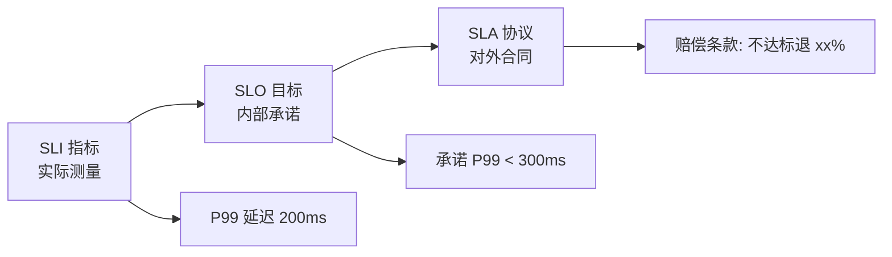

- **SLI (Indicator)**：实测数据（延迟、错误率、吞吐）
- **SLO (Objective)**：团队内部目标（P99 < 300ms、99.9% 成功率）
- **SLA (Agreement)**：写进合同对客户承诺，不达标赔钱

### 1.4 Error Budget（错误预算）

```
目标 99.9% → 每月允许 43 分钟不可用
实际 99.95% → 剩余错误预算 21 分钟
预算没用完 → 可以激进发版
预算用完了 → 冻结发版，专注稳定
```

**SRE 核心理念**：不追求绝对零故障，用错误预算平衡**稳定 vs 创新**。

## 二、高可用的四层防线

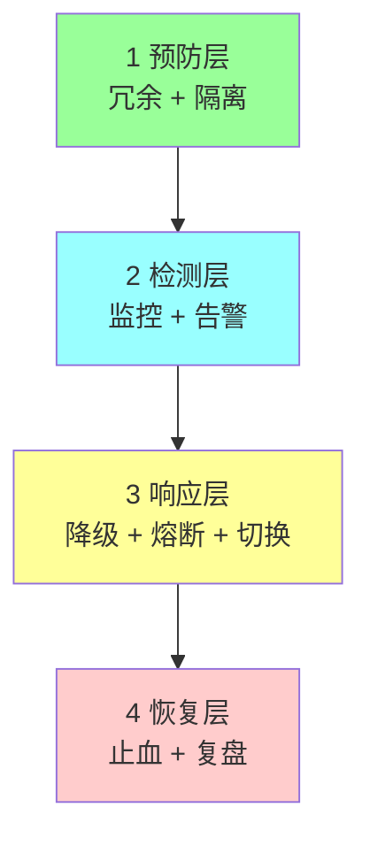

## 三、冗余与容灾架构

### 3.1 容灾等级（国标 GB/T 20988）

| 等级 | RTO | RPO | 方案 |
| --- | --- | --- | --- |
| 1 级 | 天 | 天 | 冷备份 |
| 2 级 | 天 | 小时 | 温备份 |
| 3 级 | 小时 | 分钟 | 主备容灾 |
| 4 级 | 分钟 | 秒 | 双活 |
| 5 级 | 秒 | 0 | 多活 |
| 6 级 | 0 | 0 | 零故障（金融核心） |

- **RTO**（Recovery Time Objective）：故障到恢复的时间
- **RPO**（Recovery Point Objective）：能容忍丢失的数据时长

### 3.2 同机房高可用

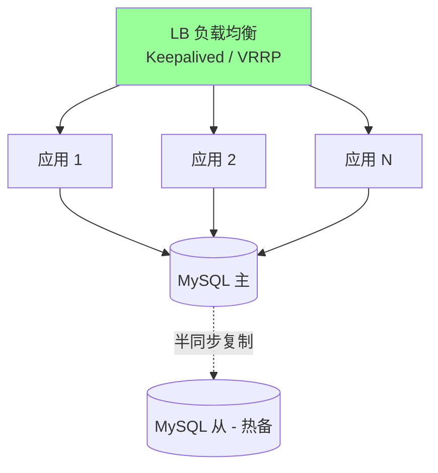

**关键点**：
- LB 主备（Keepalived 心跳切换）
- 应用多实例 + 无状态
- DB 主从（半同步复制）

**能扛**：单机故障、网络抖动、单服务 OOM。

**不能扛**：整个机房故障（电力/网络/天灾）。

### 3.3 同城双活

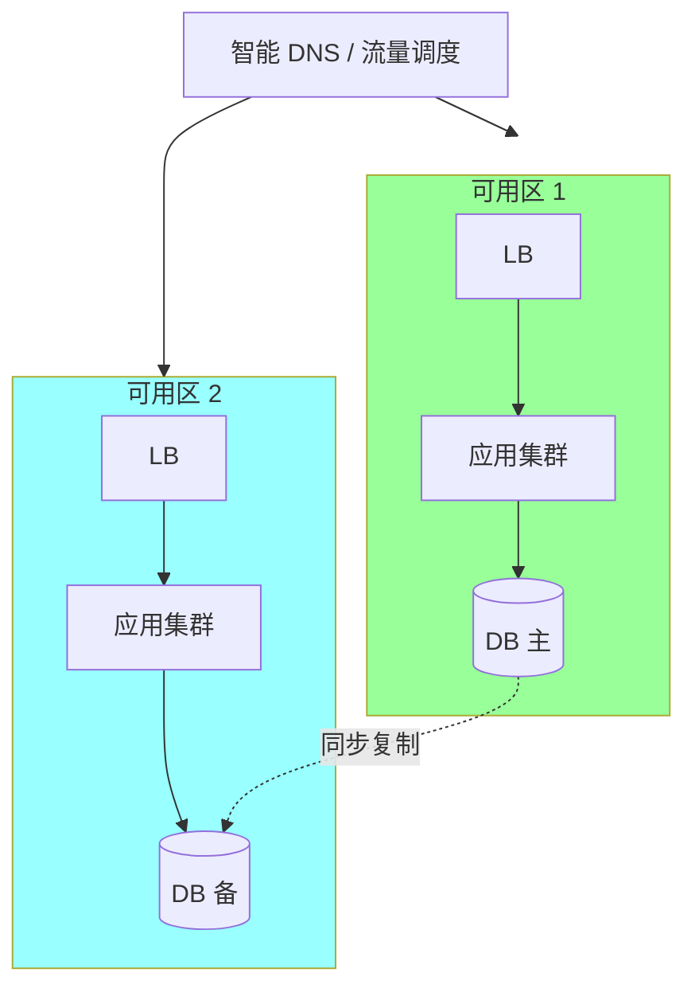

**特征**：
- 两个机房物理距离 ≤ 100 km（延迟 < 5ms）
- 共享同一套底层存储 / 跨机房同步复制
- 流量可在两机房间灵活切换

**能扛**：单机房完全故障（2015 年杭州阿里云机房光缆被挖断级别的事件）。

**限制**：跨城依然会挂（如上海台风 + 杭州电力双故障）。

### 3.4 异地多活

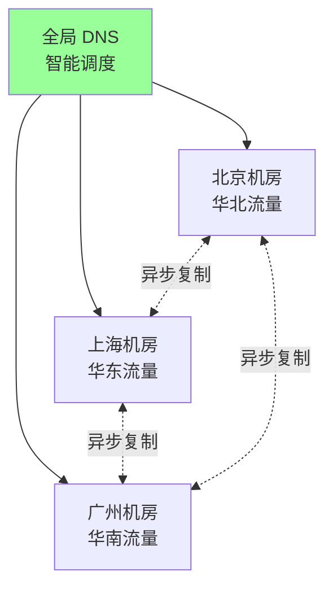

**三大挑战**：

**挑战 1：数据一致性**
- 跨地域同步复制延迟大（北京-广州 ≈ 50ms）
- 用**单元化**：用户流量固定到某个机房（避免跨机房写）

**挑战 2：全局一致性**
- 订单号、库存要全局唯一 → 雪花算法 + 号段预分配
- 强一致业务（金融）只能在主 DC 处理，其他 DC 只读

**挑战 3：切换复杂度**
- 流量切换要预热
- 切回时数据 reconcile（对账）

### 3.5 单元化架构（异地多活的关键）

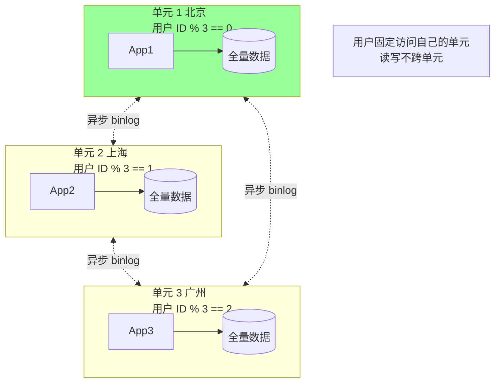

**核心思想**：
- 按**分片键**（如 userID）切分流量
- 每个单元持有全量数据（通过异步复制）
- 用户固定到一个单元，读写不跨单元
- 单元故障 → 流量调度到其他单元

**代表**：阿里异地多活（蚂蚁 LDC 单元化）、饿了么、美团。

### 3.6 三种方案对比

| 方案 | RTO | RPO | 成本 | 复杂度 |
| --- | --- | --- | --- | --- |
| 同机房高可用 | 秒 | 秒 | 低 | 低 |
| 同城双活 | 秒 | 0-秒 | 中 | 中 |
| 异地多活 | 秒 | 秒-分钟 | 高 | 高 |

**选型**：
- DAU < 1000 万 → 同机房 + 主备
- DAU 1000 万-1 亿 → 同城双活
- DAU > 1 亿 或金融核心 → 异地多活

## 四、监控与告警

### 4.1 监控四大黄金信号（Google SRE）

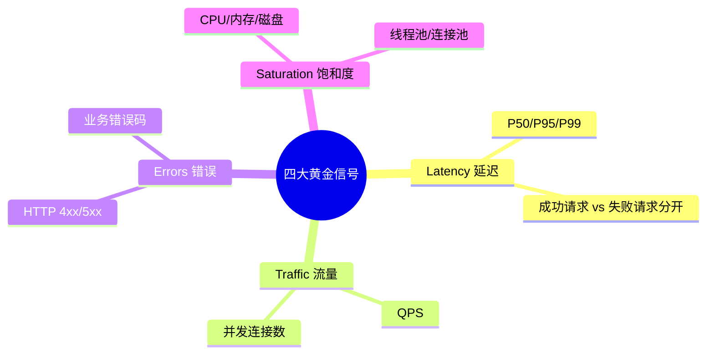

### 4.2 USE 方法（面向资源）

- **U**tilization：资源利用率
- **S**aturation：资源饱和度
- **E**rrors：错误数

适合看基础设施（服务器、DB、MQ）。

### 4.3 RED 方法（面向服务）

- **R**ate：请求速率
- **E**rrors：错误率
- **D**uration：延迟

适合看微服务。

### 4.4 告警分级

| 级别 | 响应 | 示例 |
| --- | --- | --- |
| P0 致命 | 5 分钟内响应，电话轰炸 | 核心服务全挂、DB 全挂 |
| P1 严重 | 30 分钟响应，短信 | 单 AZ 故障、错误率 > 10% |
| P2 一般 | 工作时间处理 | 慢查询、磁盘 80% |
| P3 通知 | 日报汇总 | 配置变更、证书过期 |

**核心原则**：
- 告警要**能操作**（没法处理的告警只会麻木）
- 告警要**聚合**（同一故障不要发 100 条）
- 高级告警要**升级**（10 分钟无响应 → 上级）

### 4.5 可观测性三支柱

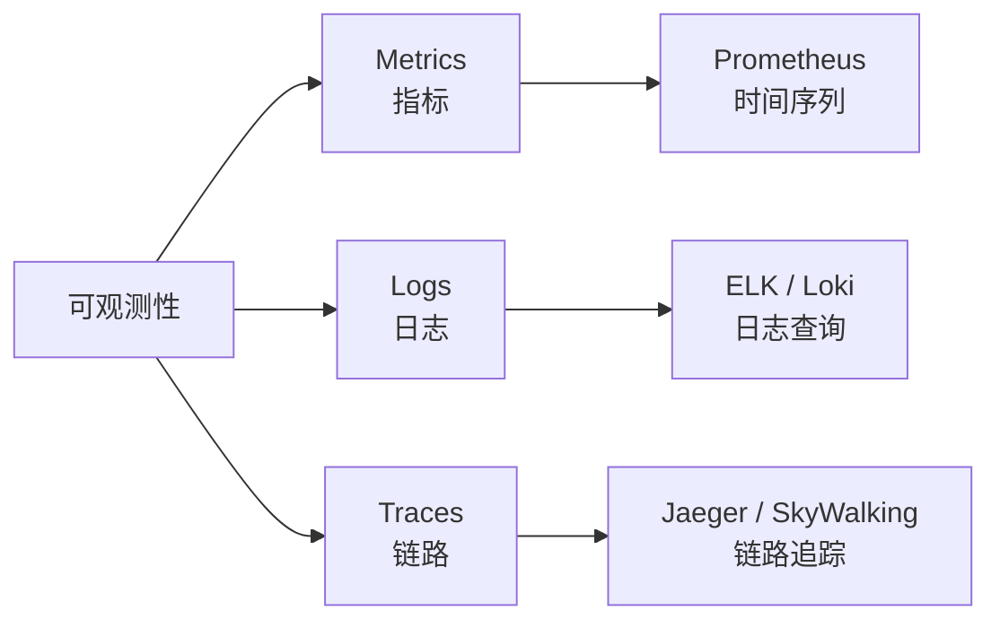

| | Metrics | Logs | Traces |
| --- | --- | --- | --- |
| 用途 | 统计趋势 | 查单个问题 | 调用链路 |
| 存储 | 时序库 | 全文索引 | 链路库 |
| 成本 | 低 | 高 | 中 |
| 实例 | Prometheus | Loki/ELK | Jaeger |

现代标准：OpenTelemetry（OTel）统一三者。

## 五、降级

### 5.1 降级的三层

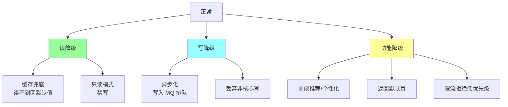

### 5.2 降级典型案例

**场景 1：推荐服务故障**
```
正常: 个性化推荐（ML 服务）
降级: 热门榜 (Redis 预计算)
兜底: 静态默认列表
```

**场景 2：评论服务故障**
```
正常: 实时评论
降级: 只显示"评论加载中"，不阻塞主流程
```

**场景 3：DB 从库故障**
```
正常: 读从库
降级: 读主库（降级会增加主库压力，要配合限流）
```

**场景 4：支付服务故障**
```
正常: 实时支付
降级: 排队 + 异步通知（告知用户稍后到账）
```

**场景 5：双 11 订单高峰**
```
正常: 全功能
降级: 关闭退款、关闭订单详情查询、关闭营销计算
```

### 5.3 降级的关键

**预案化**：
- 每个核心功能有**书面降级预案**
- 一键触发（不能临时写代码）
- 定期演练

**分级触发**：
```
Level 1: 错误率 > 5% → 自动降级非核心
Level 2: 错误率 > 20% → 手动确认降级
Level 3: 全挂 → 最小功能保命
```

**降级开关**：
- 配置中心（Apollo / Nacos）动态推送
- 业务代码用 FeatureFlag 判断
- 降级状态可监控

### 5.4 代码示例

```go
func GetRecommendations(userID string) []Item {
    if featureFlag.IsDegraded("recommend") {
        return getHotItems()  // 降级到热门榜
    }

    ctx, cancel := context.WithTimeout(context.Background(), 200*time.Millisecond)
    defer cancel()

    items, err := recommendService.Get(ctx, userID)
    if err != nil || ctx.Err() != nil {
        metrics.DegradeCounter.Inc()
        return getHotItems()  // 失败也降级
    }
    return items
}
```

## 六、熔断

### 6.1 熔断器状态机

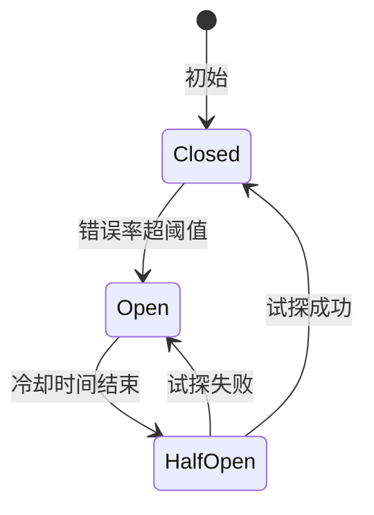

| 状态 | 行为 |
| --- | --- |
| Closed 关闭 | 正常放行 + 统计错误率 |
| Open 开启 | 直接返回失败，不调下游 |
| HalfOpen 半开 | 放少量请求试探 |

### 6.2 熔断 vs 降级

| | 熔断 | 降级 |
| --- | --- | --- |
| 对象 | 下游依赖 | 自身功能 |
| 触发 | 下游异常 | 主动或被动 |
| 行为 | 不调下游 | 返回兜底 |
| 关系 | **熔断后通常触发降级** | |

### 6.3 典型实现

- **Hystrix**（Netflix，已停更）
- **Sentinel**（阿里）
- **resilience4j**（Java）
- **gobreaker**（Go）
- **Service Mesh Sidecar** 内置

详见 [06-distributed/06-rate-limit-circuit.md](../06-distributed/06-rate-limit-circuit.md)。

## 七、故障转移（Failover）

### 7.1 分类

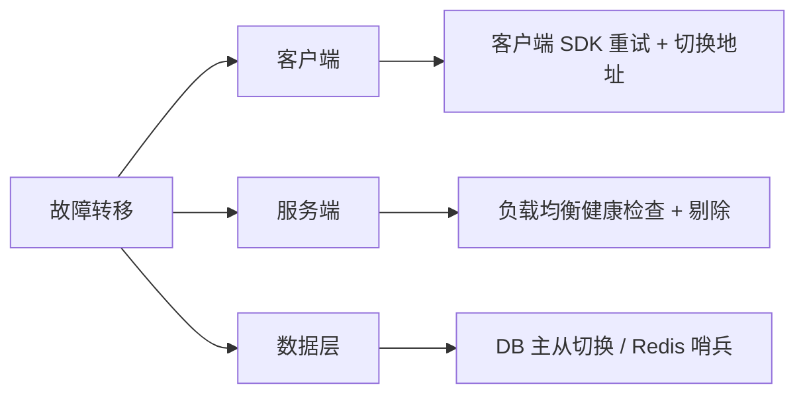

### 7.2 DB 主从切换

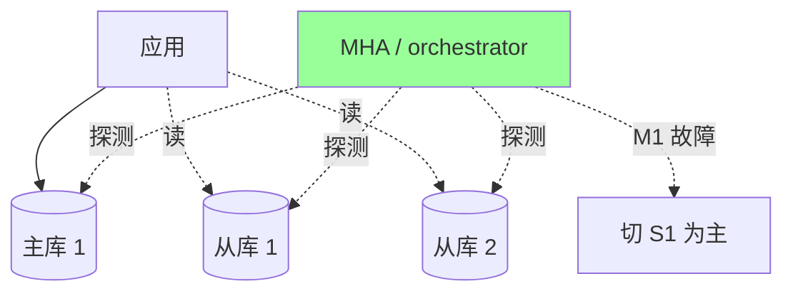

**工具**：
- MHA（MySQL HA）：经典方案
- orchestrator（GitHub）：可视化强
- MySQL Group Replication：原生 HA

**关键**：
- 主库故障检测（单点确认 → 多点确认）
- 自动切换（秒级）或人工确认（稳但慢）
- 业务层感知切换（连接池 reload）

### 7.3 服务故障转移

```go
// 客户端多节点重试
func callWithFailover(addrs []string, req Request) (Response, error) {
    for _, addr := range addrs {
        resp, err := doCall(addr, req)
        if err == nil {
            return resp, nil
        }
        if !isRetryable(err) {
            return nil, err  // 业务错误不重试
        }
    }
    return nil, errors.New("all nodes failed")
}
```

**要点**：
- 区分**可重试错误**（网络超时、5xx）和**不可重试错误**（业务错误、4xx）
- 退避重试（避免打爆下游）
- 重试次数限制（3 次够用）

## 八、灰度发布

### 8.1 为什么要灰度

```
直接全量上线 → 有 bug → 全量用户受影响
灰度 → 1% → 10% → 50% → 100% → 任何阶段发现问题立即回滚
```

### 8.2 灰度维度

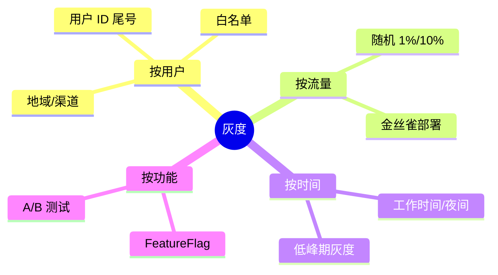

### 8.3 金丝雀发布

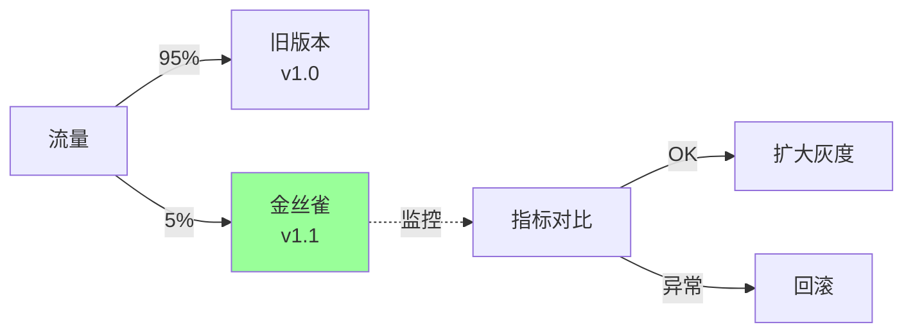

**关键**：
- 金丝雀独立监控（对比新旧指标）
- 自动判定（错误率/延迟超阈值自动回滚）
- 灰度比例递增（1% → 5% → 20% → 50% → 100%）

### 8.4 蓝绿部署

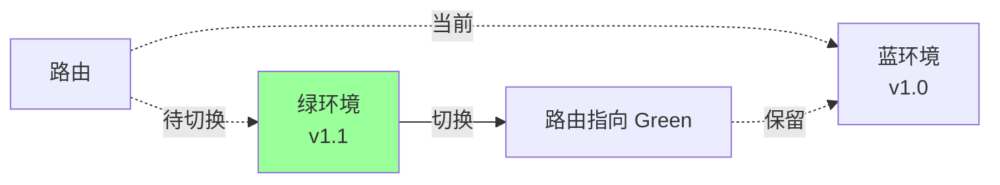

**特点**：
- 两套完整环境
- 瞬间切换
- 出问题秒回滚

**代价**：资源双份。

### 8.5 滚动更新

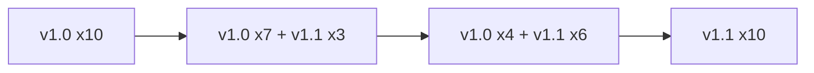

逐批替换。**K8s 默认策略**。

### 8.6 三种对比

| | 金丝雀 | 蓝绿 | 滚动 |
| --- | --- | --- | --- |
| 资源 | 少量额外 | 双份 | 正常 |
| 切换速度 | 渐进 | 瞬间 | 渐进 |
| 回滚速度 | 秒 | 秒 | 分钟 |
| 适合 | 风险评估 | 零停机 | 常规 |

## 九、混沌工程

### 9.1 什么是混沌工程

> **主动注入故障，验证系统的韧性**

Netflix 的 Chaos Monkey 起源：随机杀死生产环境实例，强制团队把系统做 HA。

### 9.2 故障注入类型

```
□ 实例故障：随机杀 pod / 进程
□ 网络故障：延迟 / 丢包 / 分区
□ 资源故障：CPU / 内存 / 磁盘满
□ 依赖故障：DB/Redis/MQ 挂
□ 依赖延迟：下游变慢
□ 时钟漂移
□ 证书过期
□ DNS 污染
```

### 9.3 执行流程


### 9.4 工具

- **Chaos Monkey**（Netflix）
- **ChaosBlade**（阿里）
- **Chaos Mesh**（PingCAP）
- **Gremlin**（商业）

### 9.5 组织上的要点

- 从**预发/生产部分流量**开始（不要一开始打生产主链路）
- 必须有**快速止血开关**
- 定期例行化（月/季度演练）
- 变成**文化**（不是个人英雄主义）

## 十、真实项目视角

以 `ddd_order_example` 扩展到生产级的高可用清单：

```
应用层:
  □ 订单服务多实例部署（至少 3 个）
  □ 无状态化（session/登录态放 Redis）
  □ 启动/停止有健康检查
  □ 优雅关闭（处理完在途请求再退）

数据层:
  □ MySQL 主从 + 半同步复制
  □ Redis 哨兵 / Cluster
  □ 定期备份 + 恢复演练

流量层:
  □ Nginx / LB 主备
  □ 按用户 ID 分流（多活时）
  □ 限流（单用户/总体）

保护层:
  □ 熔断（商品服务 / 支付服务）
  □ 降级（商品详情走缓存、推荐返回热门）
  □ 超时（所有外部调用必设）
  □ 重试（区分幂等）

监控层:
  □ 四大黄金信号
  □ 核心链路链路追踪
  □ 告警分级 P0-P3
  □ 大盘 + SLO 可视化

发布层:
  □ 灰度发布（按用户 ID 尾号）
  □ 自动化回滚
  □ 蓝绿备选
```

## 十一、大厂高可用案例

### 11.1 阿里双 11

```
- 单元化架构（LDC）
- 限流降级（Sentinel）
- 全链路压测（每年准备 3 个月）
- Tair / MySQL 双写容灾
- 多活切换演练
```

### 11.2 美团外卖

```
- 同城双活 + 异地多活
- 订单单元化（按骑手/用户/商家分单元）
- 降级预案 100+ 条
- 节假日压测
```

### 11.3 字节抖音

```
- 全球多活
- 自研 RPC + Mesh
- 自动弹性扩缩容
- 秒级监控 + 分钟级告警
```

### 11.4 微信支付

```
- 金融级 5 个 9
- 三地五中心
- 数据强一致（Paxos）
- 实时对账
```

## 十二、典型反模式

### 反模式 1：告警疲劳

每天几百条告警，大家麻木 → 真问题被淹没。

**修复**：减少告警数量 + 提高精准度 + 分级。

### 反模式 2：降级只在会议上存在

预案文档写了，没演练过，真故障时发现开关失效。

**修复**：月度演练 + 自动化验证。

### 反模式 3：过度重试放大故障

下游慢 → 上游重试 → 打垮下游 → 更慢 → 更多重试（雪崩）。

**修复**：熔断 + 限流 + 指数退避。

### 反模式 4：单体追求 5 个 9

没分布式架构强行追高可用 → 运维挂到凌晨。

**修复**：匹配业务实际需求，不要"为数字而数字"。

### 反模式 5：HA 却没演练

主备切换一年没试过 → 真出事发现备库数据缺失。

**修复**：定期 failover 演练（月度）。

### 反模式 6：忽略慢故障

服务"没挂"但变慢 10 倍 → 没触发告警 → 用户感知差。

**修复**：监控 P99 延迟，延迟异常也告警。

### 反模式 7：不区分核心/非核心

所有服务都追求 5 个 9 → 成本爆炸。

**修复**：核心链路高可用，辅助服务 3 个 9 够用。

## 十三、面试高频题

**Q1：4 个 9 意味着什么？怎么做到？**

年不可用 52 分钟。做到需要：
- 同城双活（机房故障可切）
- DB 主从 + 自动切换
- 限流熔断降级
- 监控告警分级
- 定期故障演练

**Q2：SLA / SLO / SLI 区别？**

- SLI：实际测量值
- SLO：内部目标（留余量）
- SLA：对外合同（更保守）

Error Budget = 1 - SLO，用来平衡稳定 vs 迭代速度。

**Q3：同城双活 vs 异地多活？**

| | 同城双活 | 异地多活 |
| --- | --- | --- |
| 距离 | < 100km | 跨城/跨国 |
| 延迟 | < 5ms | 20-100ms |
| 数据 | 同步复制 | 异步复制 |
| 难点 | 中 | 高 |

异地多活的关键是**单元化**（用户流量固定单元）。

**Q4：降级和熔断的区别？**

- **熔断**：下游异常时不调它
- **降级**：自身的功能开关（返回兜底）

熔断后通常配合降级。

**Q5：怎么设计降级预案？**

- 每个核心功能写书面预案
- 分 L1/L2/L3 三级
- 一键开关（配置中心）
- 定期演练
- 自动化触发（错误率超阈值）

**Q6：灰度发布怎么做？**

- 金丝雀 1% → 10% → 50% → 100%
- 按用户/地域/流量分
- 独立监控新版本指标
- 自动回滚条件

**Q7：监控四大黄金信号？**

Latency / Traffic / Errors / Saturation。

Google SRE 方法论，覆盖服务最核心维度。

**Q8：混沌工程做什么？**

主动注入故障验证系统韧性：
- 杀 pod / 断网 / 加延迟
- 从小范围 → 生产局部
- 必须有止血开关
- 定期演练文化

**Q9：DB 主从切换的难点？**

- 主库故障检测准确性（防误判）
- 切换期间数据一致性
- 未同步事务处理
- 业务层连接池切换

**Q10：系统挂了怎么快速定位？**

**SLA 流程**：
```
1. 止血（先恢复，不查因）
2. 看四大黄金信号定位层
3. 看链路追踪看调用链
4. 看日志看错误栈
5. 复盘（5 Whys）
6. 改进措施
```

## 十四、面试加分点

- **SLA/SLO/SLI + Error Budget** 是 SRE 核心方法论
- **4 层防线**：预防 → 检测 → 响应 → 恢复
- 容灾从**同机房 → 同城双活 → 异地多活**阶梯演进
- **异地多活的关键是单元化**（避免跨地域写）
- **四大黄金信号 / USE / RED** 是监控方法论
- **降级 ≠ 熔断**，降级是自身，熔断是下游
- 降级必须**预案化 + 演练化**，不是会议文档
- **灰度 + 自动回滚** 是发布安全网
- **混沌工程** 主动找故障是成熟团队标志
- **告警疲劳** 是高可用团队大敌，精简 + 分级 + 可操作
- 核心服务 5 个 9，辅助服务 3 个 9 **匹配实际**，不要一刀切
- 真实高可用是**架构 + 运维 + 组织** 三位一体
