# 架构 · 高性能

> 缓存 / 异步 / 批量 / 池化 / 无锁 / 数据局部性 / 读写分离 / 全链路优化

> 不重复 Redis/MySQL 具体细节，聚焦**高性能架构的方法论与决策**

## 一、性能的整体视角

### 1.1 性能金字塔

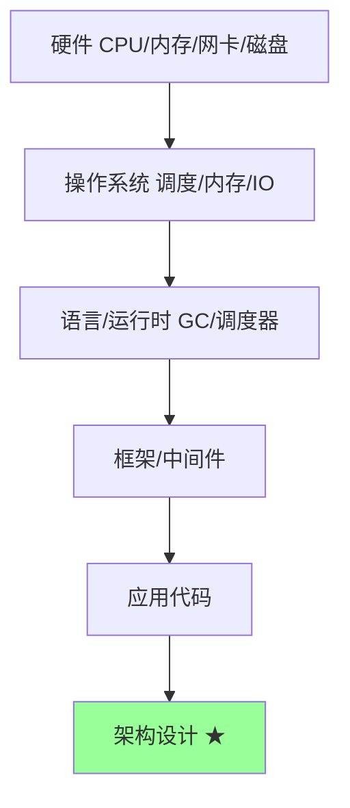

**关键认知**：
- 99% 的性能问题在**应用 + 架构**层
- 单纯压硬件回报递减
- 架构决定上限，代码决定下限

### 1.2 性能指标

| 指标 | 含义 | 目标 |
| --- | --- | --- |
| **延迟** | 单次请求时间 | P99 < 200ms |
| **吞吐** | 单位时间处理量 | QPS / TPS |
| **并发** | 同时处理数 | 几千-几万 |
| **资源** | CPU / 内存 / IO 使用率 | < 70% |

**Little's Law**：`并发 = 吞吐 × 延迟`

例：10000 QPS × 100ms = 1000 并发请求在系统里。

### 1.3 P99 比平均值重要

```
平均: 50ms（看起来不错）
P50: 30ms
P99: 500ms（1% 用户体验差）
P999: 2000ms

→ 平均会骗人，P99/P999 才是真实体验
```

## 二、缓存：性能优化第一武器

### 2.1 缓存的本质

> **用空间换时间，用就近替代远端**

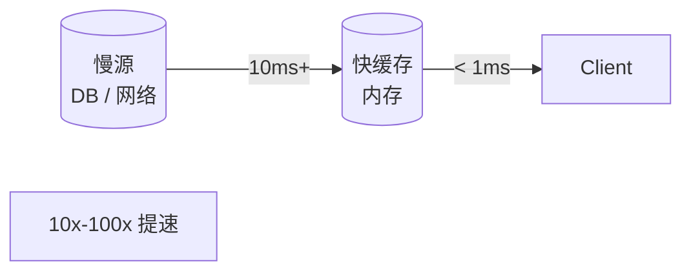

### 2.2 缓存层级

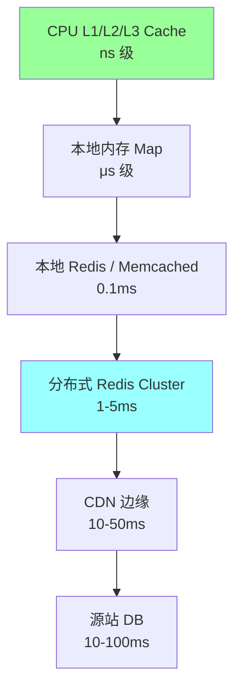

**多级缓存架构**：本地 → 分布式 → CDN → 源站。

### 2.3 缓存模式

| 模式 | 流程 | 适合 |
| --- | --- | --- |
| **Cache-Aside** | 应用先查缓存，miss 查 DB 写回 | 通用 |
| **Read-Through** | 缓存层负责查 DB | 简单业务 |
| **Write-Through** | 写入立即同步到 DB | 强一致 |
| **Write-Behind** | 写缓存异步刷 DB | 高吞吐 |
| **Refresh-Ahead** | 过期前主动刷新 | 防击穿 |

详见 [04-redis/05-cache-patterns.md](../04-redis/05-cache-patterns.md)。

### 2.4 缓存三大问题

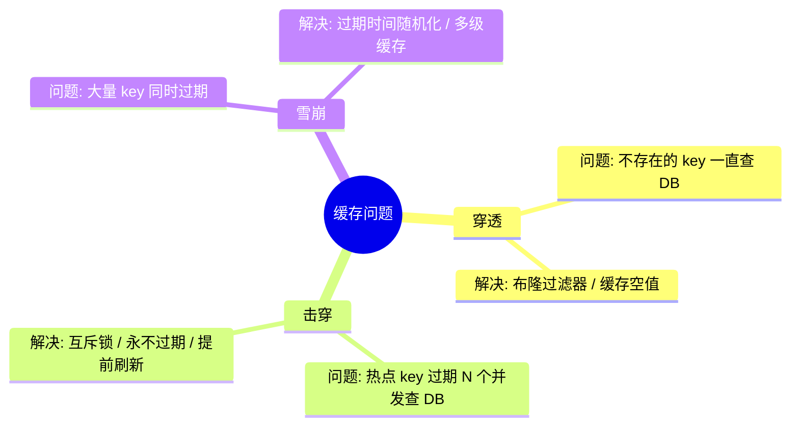

详见 [04-redis/05-cache-patterns.md](../04-redis/05-cache-patterns.md)。

### 2.5 多级缓存的取舍

```go
// 本地缓存 + 分布式缓存
func GetUser(id string) (User, error) {
    // L1: 本地缓存（μs 级）
    if u, ok := localCache.Get(id); ok {
        return u, nil
    }

    // L2: 分布式 Redis（ms 级）
    if u, err := redis.Get(id); err == nil {
        localCache.Set(id, u, 10*time.Second)
        return u, nil
    }

    // L3: DB
    u, err := db.Query(id)
    if err != nil { return User{}, err }
    redis.Set(id, u, 5*time.Minute)
    localCache.Set(id, u, 10*time.Second)
    return u, nil
}
```

**取舍**：
- 本地缓存快但**多实例不一致**（每实例一份）
- 分布式缓存慢但一致
- 容忍短暂不一致 → 用本地缓存（10s 过期）
- 强一致 → 只用分布式缓存

### 2.6 缓存命中率

```
命中率 = HIT / (HIT + MISS)

不同场景目标:
  CDN 静态: > 95%
  应用 Redis: > 85%
  本地缓存: > 70%

低命中率不如不用（多一次 RT）。
```

## 三、异步化

### 3.1 同步 vs 异步

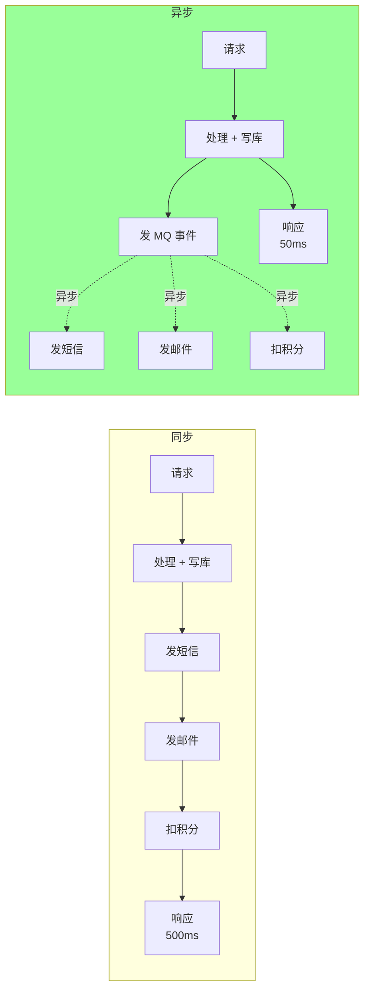

**收益**：响应快 10 倍，下游故障不影响主流程。

### 3.2 异步化模式

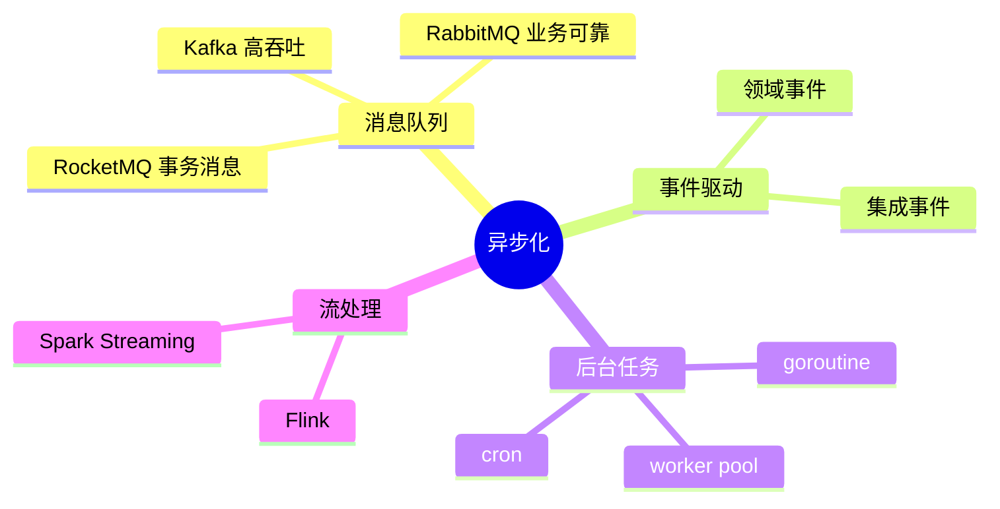

### 3.3 典型场景

**场景 1：下单流程异步化**
```
同步: 创建订单 → 扣库存 → 发短信 → 发邮件 → 加积分 → 返回 (500ms)
异步: 创建订单 → 发 OrderCreated 事件 → 返回 (50ms)
       订阅者各自处理: 库存/短信/邮件/积分
```

**场景 2：日志/统计异步**
```
不要在请求路径里写 DB 日志
→ 写 MQ → 后台消费写 ES
```

**场景 3：长任务**
```
视频转码、报表生成、数据导入
→ 提交任务返回 ID → 后台处理 → 完成回调/轮询
```

### 3.4 异步化的代价

```
优:
  + 响应快
  + 削峰填谷
  + 解耦

缺:
  - 一致性变弱（最终一致）
  - 调试困难（链路变长）
  - 出错处理复杂（重试/死信）
  - 用户感知（订单创建了但邮件没发出去？）
```

详见 [05-message-queue/](../05-message-queue/)。

### 3.5 何时不该异步

- 业务强一致（金融账本）
- 用户必须等结果（实时计算）
- 简单 CRUD（增加复杂度不值）

## 四、批量化

### 4.1 批量化原理

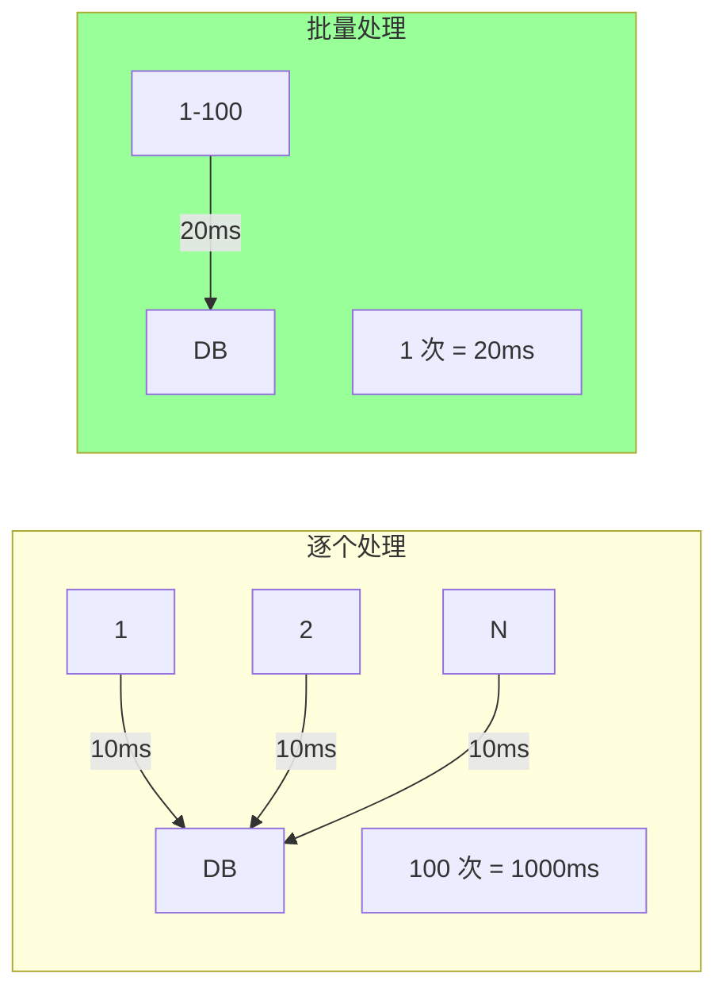

**收益**：减少**网络 + IO + 调度**开销，吞吐提升 10-100 倍。

### 4.2 典型批量场景

**DB 批量插入**：
```sql
-- 100 次单条 INSERT: 1000ms
INSERT INTO t VALUES (1);
INSERT INTO t VALUES (2);
...

-- 1 次批量 INSERT: 20ms
INSERT INTO t VALUES (1), (2), ..., (100);
```

**Redis Pipeline**：
```go
pipe := redis.Pipeline()
for _, k := range keys {
    pipe.Get(ctx, k)
}
results, _ := pipe.Exec(ctx)
// 100 次 GET 从 100ms → 5ms
```

**RPC 批量接口**：
```protobuf
// 不要给单条接口
rpc GetUser(UserID) returns (User)

// 给批量接口（让调用方决定是否批量）
rpc GetUsers(UserIDs) returns (Users)
```

**MQ 批量发送**：
```go
producer.SendBatch(messages)  // 比逐个 Send 快 10x
```

### 4.3 批量的攒批策略

```go
// 简单实现：定时 + 数量双触发
type Batcher struct {
    items chan Item
}

func (b *Batcher) run() {
    ticker := time.NewTicker(100 * time.Millisecond)
    var buf []Item
    for {
        select {
        case item := <-b.items:
            buf = append(buf, item)
            if len(buf) >= 100 {
                process(buf); buf = nil
            }
        case <-ticker.C:
            if len(buf) > 0 {
                process(buf); buf = nil
            }
        }
    }
}
```

**关键**：
- 攒满 N 条 → 立即处理
- 等待 T 毫秒 → 强制处理（保证延迟）

### 4.4 批量的代价

- 增加单请求延迟（攒批等待）
- 失败一条全失败 / 部分失败处理复杂
- 内存占用增加

**适合**：吞吐优先；**不适合**：低延迟交互。

## 五、池化

### 5.1 池化的目的

> **避免重复创建/销毁开销**

| 池 | 解决 |
| --- | --- |
| **连接池** | TCP / DB / Redis 连接 |
| **线程/Goroutine 池** | 线程创建销毁开销 |
| **对象池** | 大对象内存分配 |
| **缓冲区池** | 字节缓冲（bytes.Buffer） |

### 5.2 连接池

```go
db, _ := sql.Open("mysql", dsn)
db.SetMaxOpenConns(100)        // 最大连接
db.SetMaxIdleConns(10)         // 空闲保持
db.SetConnMaxLifetime(time.Hour)
db.SetConnMaxIdleTime(10 * time.Minute)
```

**关键参数**：
- MaxOpen：上限（避免打爆 DB）
- MaxIdle：常驻（减少冷启动）
- Lifetime：定期重连（防长连接老化）

### 5.3 sync.Pool

```go
var bufPool = sync.Pool{
    New: func() interface{} {
        return new(bytes.Buffer)
    },
}

func handle() {
    buf := bufPool.Get().(*bytes.Buffer)
    defer func() {
        buf.Reset()
        bufPool.Put(buf)
    }()
    // 使用 buf
}
```

**收益**：避免 GC 压力，分配减少 90%+。

**注意**：
- Pool 内对象 GC 时可能被清空（是缓存不是池）
- 不适合管理稀缺资源（连接）

### 5.4 Goroutine 池

```go
// ❌ 反模式：每请求一个 goroutine
go handle(req)  // 1 万 QPS = 1 万 goroutine

// ✅ 用 worker pool
const NWorkers = 100
jobs := make(chan Req, 1000)

for i := 0; i < NWorkers; i++ {
    go worker(jobs)
}

func worker(jobs <-chan Req) {
    for j := range jobs {
        handle(j)
    }
}
```

**Go 的特殊性**：goroutine 比线程轻 100 倍，**多数场景不需要 goroutine 池**。但极端高并发（百万级）+ 任务有限制时可用。

## 六、无锁与减锁

### 6.1 锁的代价

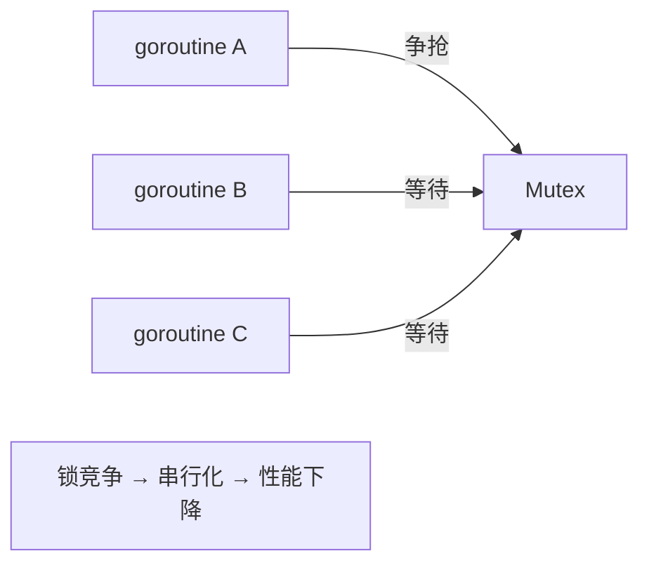

锁的开销：
- 上下文切换（μs 级）
- 缓存行失效
- CPU pipeline stall

### 6.2 减锁手段

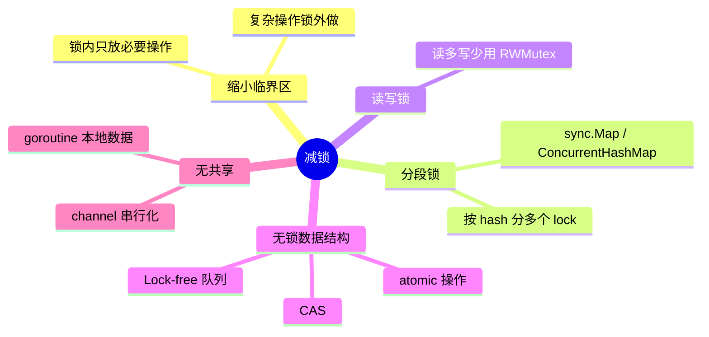

### 6.3 缩小临界区

```go
// ❌ 反例：锁内做 IO
mu.Lock()
data := fetchFromDB()  // 慢操作
process(data)
mu.Unlock()

// ✅ 锁外 IO
data := fetchFromDB()
mu.Lock()
process(data)
mu.Unlock()
```

### 6.4 分段锁

```go
// ❌ 单锁
type Cache struct {
    mu sync.Mutex
    m  map[string]Value
}

// ✅ 分段
type ShardedCache struct {
    shards [256]*Shard  // 256 段
}
type Shard struct {
    mu sync.Mutex
    m  map[string]Value
}
func (c *ShardedCache) Get(k string) Value {
    s := c.shards[hash(k)%256]
    s.mu.Lock()
    defer s.mu.Unlock()
    return s.m[k]
}
```

`sync.Map` 用类似思路，**读多写少时不加锁**。

### 6.5 atomic + CAS

```go
// 计数器无锁实现
var counter int64

// 替代 mu.Lock(); counter++; mu.Unlock()
atomic.AddInt64(&counter, 1)
```

详见 [01-go-language/02-concurrency/memory-model.md](../01-go-language/02-concurrency/memory-model.md)。

### 6.6 无共享（Share Nothing）

```go
// 每 goroutine 自己的统计
type Stats struct {
    counters [NumWorkers]int64
}

func worker(id int, s *Stats) {
    s.counters[id]++  // 各写各的，无竞争
}

// 汇总时再读取
func (s *Stats) Total() int64 {
    var total int64
    for _, c := range s.counters {
        total += atomic.LoadInt64(&c)
    }
    return total
}
```

## 七、数据局部性

### 7.1 CPU 缓存层级

```
L1: 32KB  / 1ns
L2: 256KB / 3ns
L3: 8MB   / 12ns
内存:     / 100ns
```

**100 倍差距**！数据访问模式直接决定性能。

### 7.2 顺序访问 vs 随机访问

```go
// ✅ 数组顺序访问（CPU 预取友好）
for i := 0; i < n; i++ {
    sum += arr[i]
}

// ❌ 链表跳跃访问（缓存 miss 多）
for node := head; node != nil; node = node.next {
    sum += node.val
}

// 实测顺序数组比链表快 5-10 倍
```

### 7.3 结构体字段顺序

```go
// ❌ 内存浪费 + cache 不友好
type T struct {
    a int8
    b int64
    c int8
}  // sizeof = 24 (有 padding)

// ✅ 紧凑
type T struct {
    b int64
    a int8
    c int8
}  // sizeof = 16
```

### 7.4 False Sharing（伪共享）

```go
// 两个 atomic 变量在同一 cache line（64 字节）
type Counter struct {
    a atomic.Int64  // 8 字节
    b atomic.Int64  // 8 字节
}
// goroutine A 改 a, goroutine B 改 b
// → 同一 cache line 在两 CPU 之间反复同步 → 性能慢 10x
```

**修复**：padding 到独立 cache line：
```go
type Counter struct {
    a atomic.Int64
    _ [56]byte  // padding
    b atomic.Int64
}
```

## 八、读写分离

### 8.1 DB 读写分离

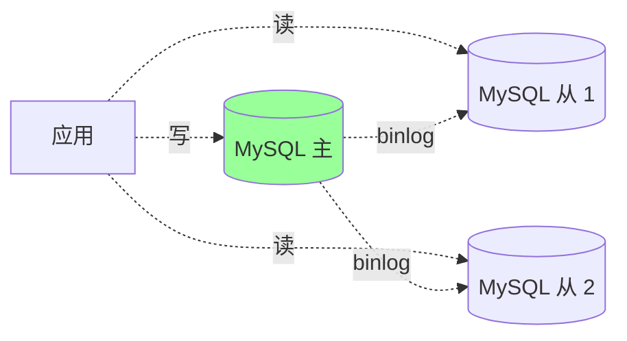

**适合**：读写比 > 5:1。

**坑**：主从延迟 → 写后立即读拿不到（详见 [03-mysql/05-replication-ha.md](../03-mysql/05-replication-ha.md)）。

### 8.2 应用级读写分离

```go
// 路由层：读 → 从库连接池，写 → 主库
type DB struct {
    master *sql.DB
    slaves []*sql.DB
}

func (d *DB) Query(...) { d.slaves[rand].Query(...) }
func (d *DB) Exec(...)  { d.master.Exec(...) }
```

### 8.3 CQRS（命令查询职责分离）

详见 [09-ddd/05-cqrs-eventsourcing.md](../09-ddd/05-cqrs-eventsourcing.md)。

读写分离的极致：**写库 + 读专用模型/视图/ES**。

## 九、压缩与序列化

### 9.1 压缩

| 算法 | 压缩比 | 速度 | 场景 |
| --- | --- | --- | --- |
| gzip | 中 | 中 | HTTP 响应 |
| Brotli | 高 | 慢 | 文本 |
| zstd | 中-高 | 极快 | 实时 |
| LZ4 | 低 | 极快 | 内存压缩 |
| Snappy | 低 | 快 | Kafka |

**取舍**：CPU 换带宽 + 存储。

### 9.2 序列化对比

| 格式 | 大小 | 速度 | 可读 |
| --- | --- | --- | --- |
| JSON | 大 | 慢 | 是 |
| Protobuf | 小 | 快 | 二进制 |
| MessagePack | 小 | 快 | 二进制 |
| Thrift | 小 | 快 | 二进制 |
| FlatBuffers | 中 | 极快（零拷贝） | 二进制 |

**经验**：
- 内部 RPC：Protobuf（gRPC）/ Thrift
- 对外 API：JSON（兼容好）
- 极致性能：FlatBuffers / Cap'n Proto

## 十、并发模型

### 10.1 几种并发模型

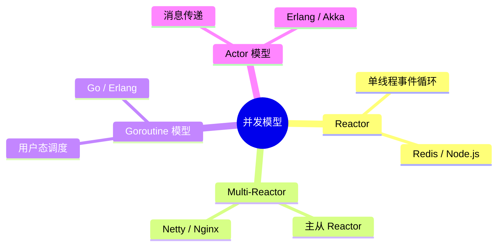

### 10.2 Go 的优势

```go
// Go: 并发简单
go handle(req)

// 同等 Java: 复杂线程池 / 异步框架
ExecutorService pool = ...;
pool.submit(() -> handle(req));
```

GMP 调度让百万 goroutine 成为常态（详见 [01-go-language/03-runtime/](../01-go-language/03-runtime/)）。

## 十一、全链路视角

### 11.1 性能瓶颈定位法

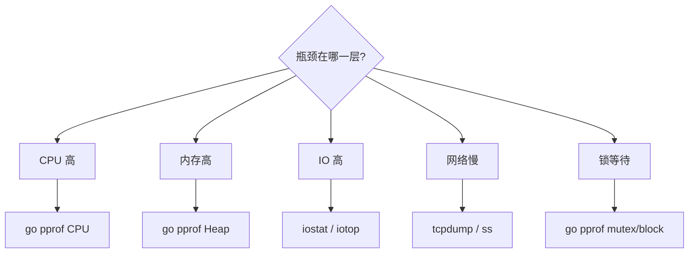

详见 [01-go-language/06-performance/](../01-go-language/06-performance/)。

### 11.2 性能优化优先级

```
1. 算法 / 数据结构（O(n²) → O(n log n)）
2. 减少远程调用（合并/批量/缓存）
3. 减少 IO（缓存/批量/异步）
4. 并发化（goroutine / 流水线）
5. 减锁（无锁 / 分段）
6. 内存优化（池化 / 减少分配）
7. 协议优化（压缩 / 序列化）
8. 硬件升级（最后手段）
```

**原则**：先测后改，**不要凭直觉优化**（profiler 是真相）。

### 11.3 大厂场景

**双 11 秒杀**：
```
- 静态数据 CDN
- 商品详情多级缓存（本地 + Redis）
- 库存预热到 Redis（lua 扣减）
- 下单异步队列削峰
- 数据库分库分表
- 全链路压测验证
```

**抖音推荐**：
```
- 推荐结果毫秒级响应
- 用户特征 Redis 缓存
- 视频元数据 + CDN
- 召回 + 排序分阶段（粗排 → 精排）
- 算法服务 GPU 加速
```

## 十二、典型反模式

### 反模式 1：过早优化

```
"先优化再说"，结果优化了不重要的部分，关键路径没动。
```

**修复**：先 profile 找瓶颈，再优化。

### 反模式 2：缓存当数据库

```
缓存是性能优化，不是数据存储。
缓存丢了 → 数据丢了
```

**修复**：缓存的数据 DB 必有。

### 反模式 3：异步过度

```
所有操作都丢 MQ → 调试地狱 + 用户感知差。
```

**修复**：核心路径同步，非核心异步。

### 反模式 4：批量过大

```
一次批量 10 万条 → 内存爆 / 一条失败全失败。
```

**修复**：批量大小 100-1000，按场景调。

### 反模式 5：锁住宇宙

```
mu.Lock()
... 复杂逻辑 + 调外部 API + DB ...
mu.Unlock()
```

**修复**：缩小临界区，外部 IO 锁外做。

### 反模式 6：连接池配置错误

```
MaxOpenConns 不限 → 连接打爆 DB
MaxIdleConns 太小 → 频繁建连
```

**修复**：基于压测结果配置。

### 反模式 7：忽略 P99

```
平均很好，但 P99 1 秒 → 真实用户体验差
```

**修复**：监控 P99 / P999 而非平均。

## 十三、面试高频题

**Q1：性能优化的方法论？**

1. profile 找瓶颈
2. 区分 CPU / IO / 锁等待
3. 优先级：算法 → 减少调用 → IO → 并发 → 减锁 → 内存
4. 测量验证（不靠直觉）

**Q2：缓存怎么提升性能？三大问题怎么防？**

提升：用空间换时间，多级缓存。

三大问题：
- **穿透**：布隆过滤器 / 缓存空值
- **击穿**：互斥锁 / 永不过期
- **雪崩**：过期时间随机化

**Q3：异步化的好处和代价？**

好：响应快、削峰、解耦。

代价：一致性弱、调试难、错误处理复杂。

**用在非核心路径**。

**Q4：批量化为什么快？**

减少**网络 + IO + 调度**开销。10 倍-100 倍提升。

但增加单请求延迟，要平衡。

**Q5：sync.Pool 适合什么？不适合什么？**

适合：临时对象池（buffer / 对象）。

不适合：稀缺资源（连接）。

特点：GC 时可能清空（是缓存而非池）。

**Q6：怎么减少锁竞争？**

- 缩小临界区
- 分段锁
- 读写锁
- atomic / CAS
- 无共享

**Q7：什么是 False Sharing？**

两个变量在同一 cache line（64 字节），多 CPU 修改 → 反复同步 → 性能慢 10x。

**修复**：padding 到独立 cache line。

**Q8：读写分离的痛点？**

主从延迟：写后立即读拿不到。

修复：
- 强制主库读
- 读写一致性的会话路由
- 等主从同步完再读

**Q9：JSON / Protobuf 怎么选？**

| | JSON | Protobuf |
| --- | --- | --- |
| 大小 | 大 | 小 5-10x |
| 速度 | 慢 | 快 5-10x |
| 可读 | 是 | 否 |
| 适合 | 对外 API | 内部 RPC |

**Q10：双 11 秒杀怎么扛住？**

- 静态化 + CDN
- 多级缓存
- 库存预热 Redis（Lua 原子扣减）
- 下单异步队列
- 限流 / 削峰
- 分库分表
- 全链路压测

## 十四、面试加分点

- **架构决定性能上限**，代码决定下限
- **P99 比平均值重要**，监控真实体验
- **缓存是性能优化第一武器**，但不是数据存储
- **多级缓存**：本地 → Redis → CDN，按延迟和一致性取舍
- **缓存三大问题（穿透/击穿/雪崩）** 是必考点
- **异步化**用在非核心路径，核心路径同步
- **批量大小 100-1000**，平衡延迟和吞吐
- **sync.Pool 是缓存而非池**，GC 时可能清空
- **缩小临界区**比一切锁优化都有效
- **数据局部性**：顺序数组 vs 链表能差 5-10 倍
- **False Sharing** 是隐藏杀手，padding 解决
- **profile 在前，优化在后**，不要凭直觉
- 大厂秒杀套路：**静态化 + 多级缓存 + 异步队列 + 分库分表 + 全链路压测**
