# 架构 · 可扩展性

> 无状态化 / 横向 vs 纵向 / 分库分表 / 一致性 Hash 应用 / 限制因素识别 / 弹性伸缩

> 不重复 mysql 分片细节，聚焦**可扩展性的方法论与决策**

## 一、可扩展性是什么

### 1.1 定义

> **Scalability = 加资源就能成比例提升能力**

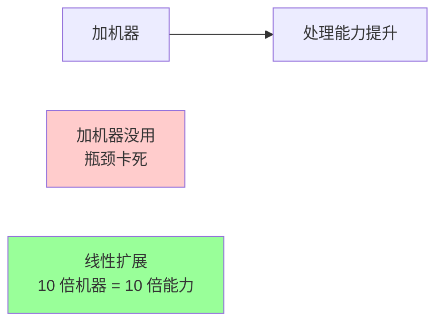

### 1.2 三个维度（Scale Cube）

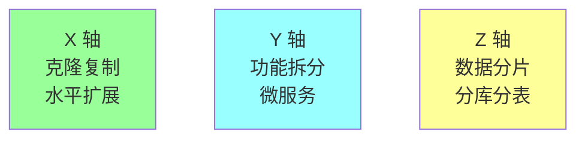

| 轴 | 手段 | 解决 |
| --- | --- | --- |
| **X 轴** | 多副本 / 集群 | 单机性能不够 |
| **Y 轴** | 按功能拆服务 | 团队 / 复杂度 |
| **Z 轴** | 按数据分片 | 数据量爆炸 |

通常**先 X 后 Y 后 Z**，但实战经常组合用。

## 二、横向 vs 纵向扩展

### 2.1 纵向扩展（Scale Up）

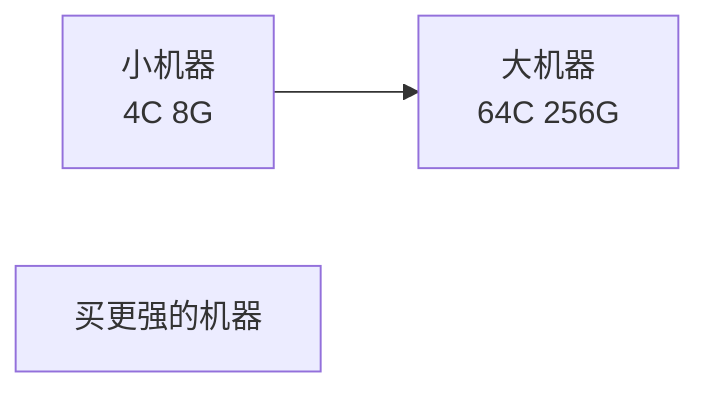

**优点**：简单（不改架构）。

**缺点**：
- 单机有上限（再大的服务器也有）
- 价格非线性（旗舰机比普通贵 10-100 倍）
- 单点故障
- 重启时间长

### 2.2 横向扩展（Scale Out）

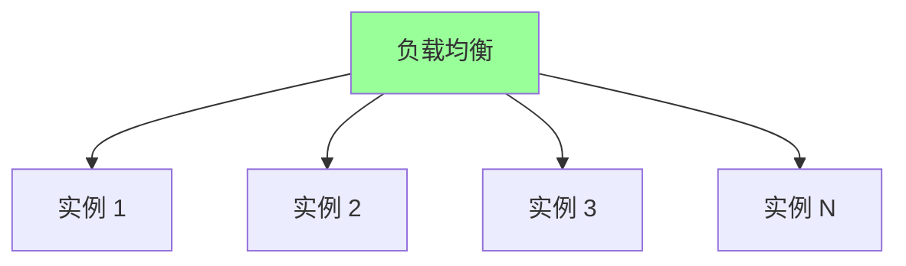

**优点**：
- 理论无上限（加机器就行）
- 容错好（单机挂不影响）
- 性价比高

**缺点**：
- 状态同步复杂
- 一致性问题
- 运维复杂度上升

### 2.3 选择

| 场景 | 推荐 |
| --- | --- |
| **数据库（写）** | 纵向 → 分库分表 |
| **应用层（无状态）** | 横向 |
| **缓存** | 横向（一致性 Hash） |
| **小流量内部系统** | 纵向（简单） |

**经验**：互联网业务**优先横向**，因为有自然增长。

## 三、无状态化（横向扩展的前提）

### 3.1 状态分类

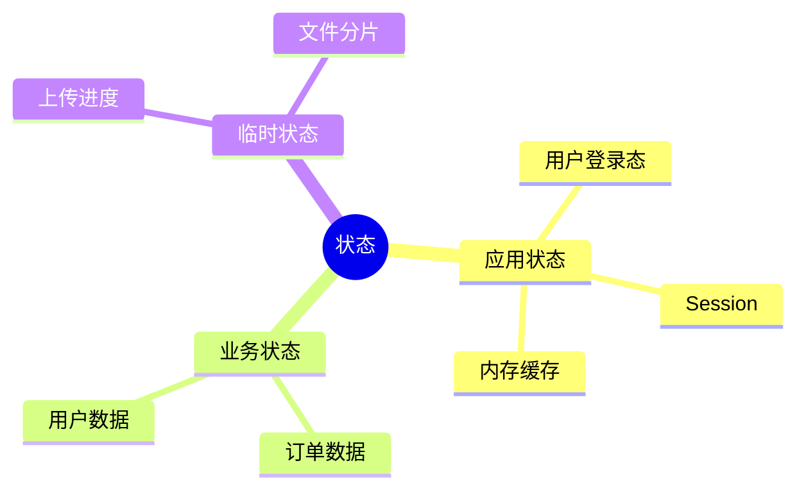

### 3.2 无状态化原则

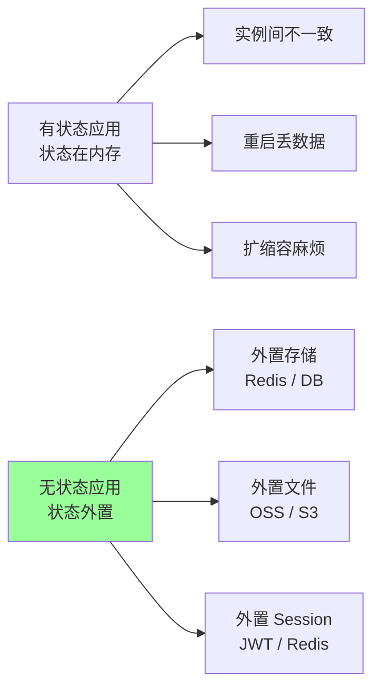

**原则**：**应用进程内不持有任何业务状态**，状态全部外置。

### 3.3 典型改造

**Session 外置**：
```go
// ❌ 反例：内存 session
var sessions = map[string]Session{}

func login(req) {
    sid := genID()
    sessions[sid] = Session{userID: ...}
    setCookie(sid)
}

// ✅ Redis session
func login(req) {
    sid := genID()
    redis.SetEX(sid, session, 30*time.Minute)
    setCookie(sid)
}

// ✅✅ JWT 无 session
func login(req) {
    token := jwt.Sign(claims)  // 状态在 token 里
    return token
}
```

**文件存储外置**：
```go
// ❌ 本地磁盘
saveFile("/data/uploads/" + id)

// ✅ 对象存储
ossClient.Put(bucket, id, content)
```

**配置外置**：
```go
// ❌ 配置文件
loadConfig("/etc/app.yaml")

// ✅ 配置中心
nacos.Get("app.config")
```

### 3.4 完全无状态的好处

- 任意实例处理任意请求
- 实例随时可加可减
- 滚动更新无感
- 故障转移即时

## 四、负载均衡

### 4.1 LB 层级

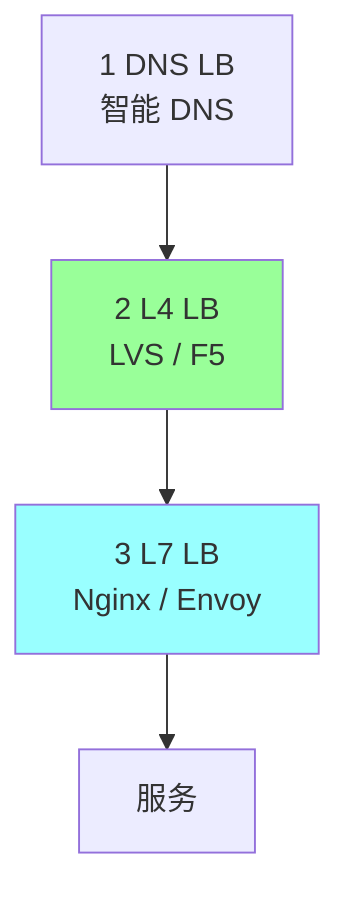

| 层 | 工作内容 | 性能 |
| --- | --- | --- |
| DNS | 域名解析返回不同 IP | 慢（TTL） |
| L4（TCP/UDP） | 转发包，不看内容 | 极快 |
| L7（HTTP） | 看 URL/Header | 慢但灵活 |

### 4.2 负载策略

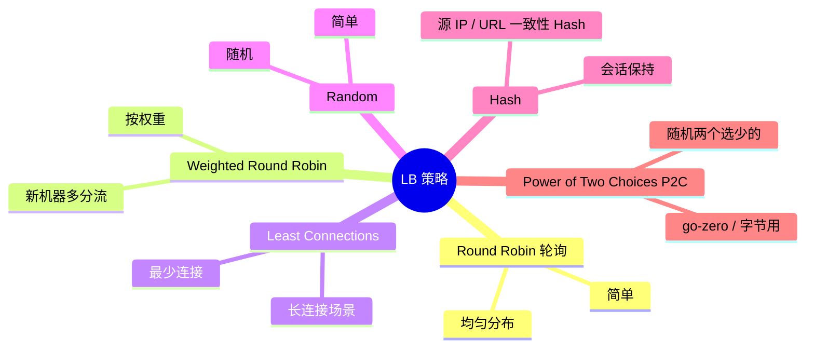

**P2C** 在大厂越来越流行，比单纯的 Least Connections 快且准。

### 4.3 客户端负载均衡 vs 服务端

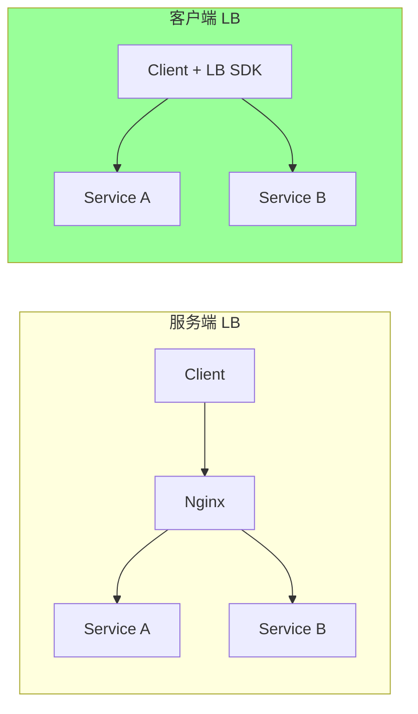

| | 服务端 | 客户端 |
| --- | --- | --- |
| 部署 | 需要 LB 中间件 | SDK 集成 |
| 单点风险 | 有 | 无 |
| 性能 | 多一跳 | 直连 |
| 协议 | HTTP / TCP | RPC（gRPC / Thrift） |
| 服务发现 | LB 维护 | SDK 拉取注册中心 |

微服务架构倾向**客户端 LB**（gRPC / go-zero / Kratos）。

## 五、数据分片（Sharding）

### 5.1 为什么要分片

```
单 MySQL 上限:
  数据量: 单表 5000 万-1 亿行
  IOPS: 几千-几万
  连接: 几千

超过 → 必须分片
```

### 5.2 分片维度

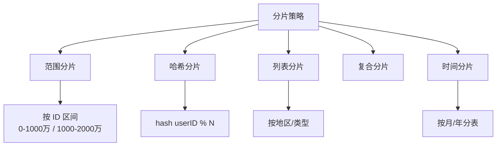

### 5.3 范围 vs 哈希

| | 范围分片 | 哈希分片 |
| --- | --- | --- |
| 数据分布 | 不均（热点新数据） | 均匀 |
| 范围查询 | 支持 | 不支持 |
| 扩容 | 简单（加分片） | 难（要 rehash） |
| 适合 | 时间型数据 / OLAP | 主键查询 / OLTP |

### 5.4 一致性 Hash

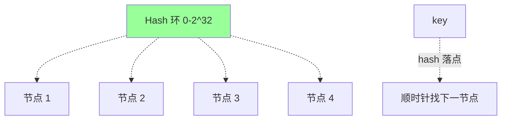

**核心**：节点和 key 都映射到 0-2³² 环上，key 顺时针找最近节点。

**优点**：加/减节点只影响相邻数据（vs 简单 hash 全部 rehash）。

**改进**：
- 虚拟节点（解决数据倾斜）
- 加权一致性 Hash

详见 [06-distributed/04-lock.md](../06-distributed/04-lock.md) + 06-distributed/05。

### 5.5 分库分表 vs NoSQL

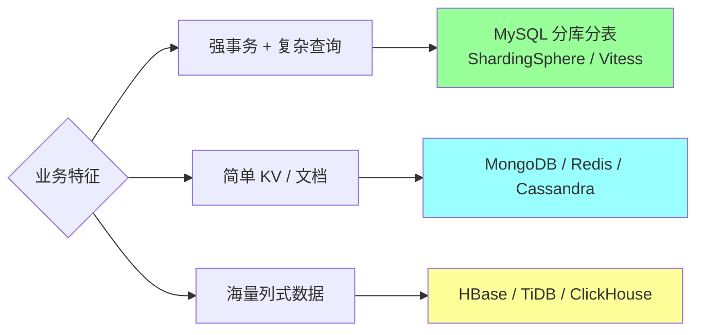

详见 [03-mysql/12-sharding.md](../03-mysql/12-sharding.md)。

### 5.6 NewSQL（分布式 SQL）

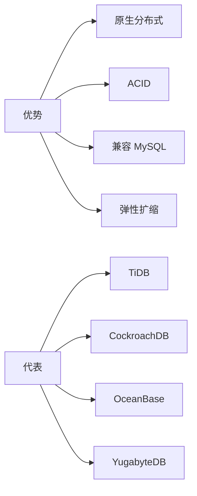

**何时选 NewSQL**：
- 数据量太大（10 亿+）+ 强一致需求
- 不想自己维护分库分表中间件
- 有预算（NewSQL 资源消耗高）

**何时不选**：
- 小数据量 → MySQL 主从够了
- 简单 KV → Redis / DynamoDB 更好
- OLAP → ClickHouse / Doris 更快

## 六、扩容流程

### 6.1 应用层扩容


**关键**：
- 自动伸缩（K8s HPA / 阿里云 ESS）
- 启动时间要短（< 30s 理想）
- 健康检查要准确

### 6.2 数据层扩容（最难）

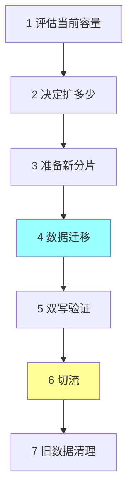

**双写迁移流程**：
```
T0: 旧库写
T1: 新增双写（旧 + 新）+ 全量迁移历史
T2: 双写 + 双读校验
T3: 流量切到新库
T4: 观察期
T5: 关闭旧库
```

代价大，**通常一次扩容前预留 1-2 倍空间**。

### 6.3 缓存扩容

**一致性 Hash 适合**：加节点只影响 1/N 数据。

**普通 Hash 不适合**：加节点全部失效，缓存击穿源站。

## 七、限制因素识别

### 7.1 阿姆达尔定律（Amdahl's Law）

```
加速比 = 1 / ((1 - p) + p/n)

p = 可并行部分比例
n = 处理器数
```

**含义**：如果有 10% 串行部分，**最大加速比只有 10 倍**（不管加多少机器）。

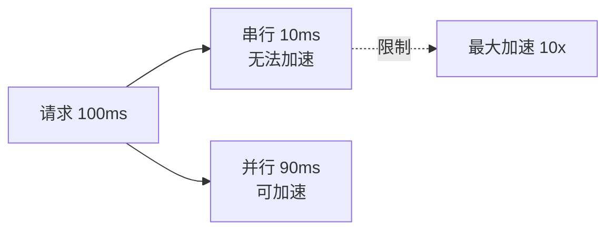

**启示**：找出**不可扩展的部分**（DB 主库写、全局锁、单点 ID 生成）。

### 7.2 通用扩展定律（USL）

```
吞吐 = N / (1 + α(N-1) + βN(N-1))

N: 节点数
α: 串行化系数
β: 节点间通信成本
```

**结论**：节点数到一定程度后，**通信成本超过收益，吞吐反而下降**。

**实战**：分布式系统**节点数有最优值**（通常几十-几百），不是越多越好。

### 7.3 常见瓶颈点

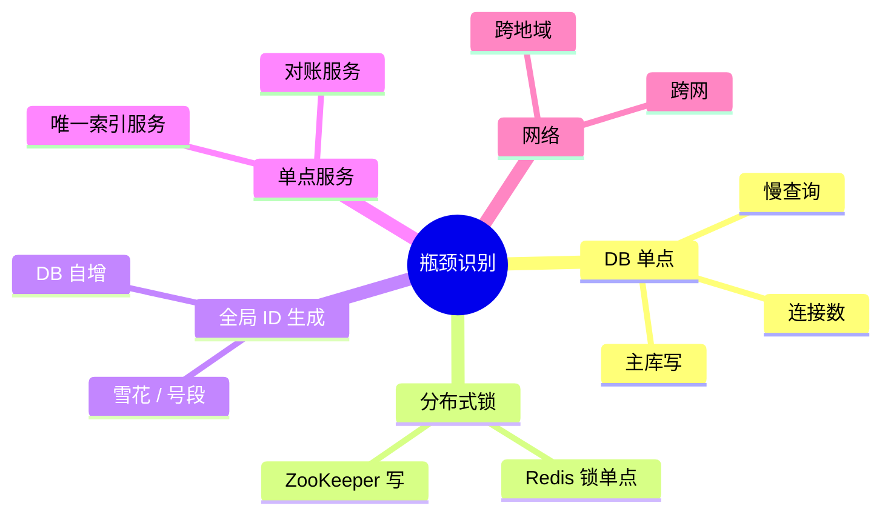

**优化思路**：找单点 → 评估必要性 → 拆分或缓存或降级。

## 八、弹性伸缩

### 8.1 自动伸缩触发条件

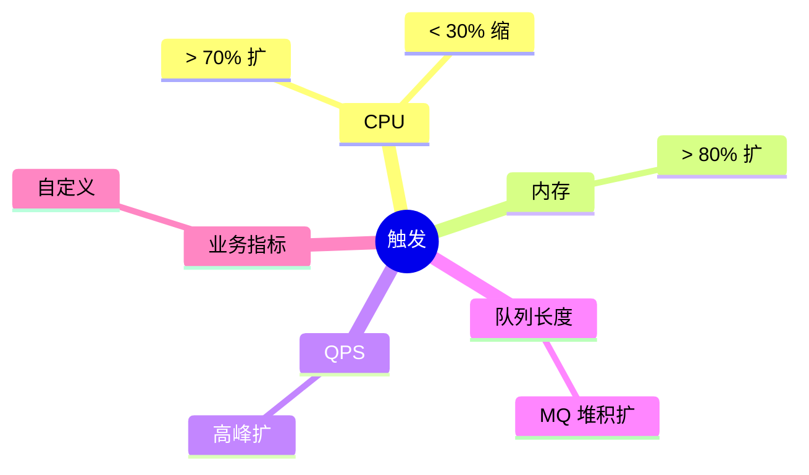

### 8.2 K8s HPA

```yaml
apiVersion: autoscaling/v2
kind: HorizontalPodAutoscaler
metadata:
  name: api-hpa
spec:
  scaleTargetRef: { name: api, kind: Deployment }
  minReplicas: 3
  maxReplicas: 100
  metrics:
  - type: Resource
    resource: { name: cpu, target: { type: Utilization, averageUtilization: 70 } }
```

### 8.3 大流量应对策略

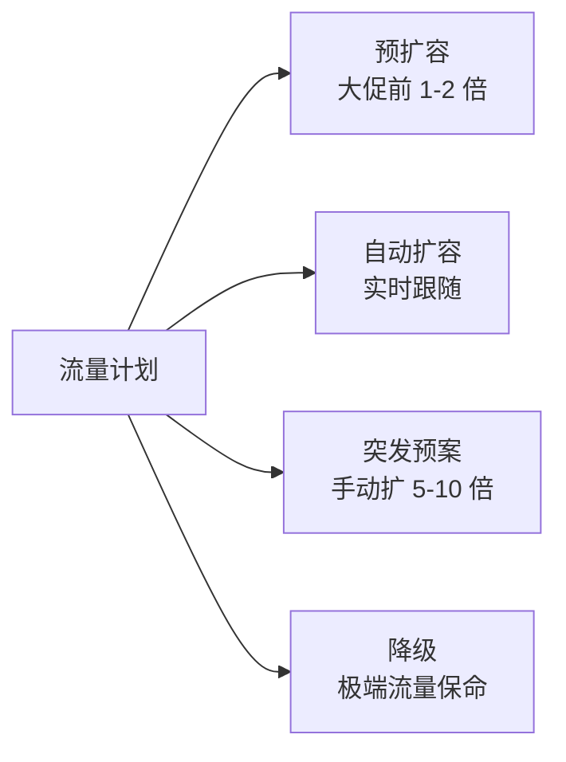

### 8.4 缩容的注意事项

- 不要太激进（流量波动会反复扩缩）
- 优雅退出（处理完在途请求）
- 保留最小 instance（防冷启动）
- 缓存预热（新实例先预热再接流量）

## 九、真实项目视角

`ddd_order_example` 扩展到生产级的可扩展清单：

```
应用层:
  □ 无状态（Session 外置 Redis）
  □ K8s 部署，HPA 自动扩缩
  □ 启动时间 < 10s
  □ 健康检查就绪检查

数据层:
  □ MySQL 分库分表（按 userID hash）
  □ 读写分离
  □ 跨库查询走 ES / 数仓

缓存层:
  □ Redis Cluster（一致性 Hash）
  □ 多级缓存（本地 + Redis）

消息层:
  □ Kafka 多分区（按 orderID hash）
  □ 消费者横向扩展

接入层:
  □ 多机房 LB（DNS + L4 + L7）
  □ 客户端 LB（gRPC）
```

## 十、大厂扩展案例

### 10.1 阿里淘宝：Z 轴单元化

```
按 userID hash 分片到不同单元
每单元有完整服务栈
跨单元只读不写
```

### 10.2 微信：水平扩展极致

```
亿级用户 → 万级实例
每实例无状态
状态全部 KV 化
按用户 ID 切分
```

### 10.3 Uber：微服务 + 数据分片

```
3000+ 微服务（Y 轴）
每服务多副本（X 轴）
数据按地理位置分片（Z 轴）
```

### 10.4 字节抖音：弹性扩展

```
活动高峰 10 倍流量 → 自动扩
推荐服务用 GPU 弹性
全球多活分单元
```

## 十一、典型反模式

### 反模式 1：有状态应用强行水平扩展

```
应用内存有用户 session → 部署多实例 → A 实例登录 B 实例查不到
```

**修复**：状态外置。

### 反模式 2：垂直扩展到极限才考虑水平

```
DB 一直加配置加到 256 核 1T 内存 → 还是顶不住 → 临时分库分表 → 业务停摆
```

**修复**：单机配置 50% 时就开始规划分片。

### 反模式 3：分库分表过度

```
日活 10 万就分了 32 库 32 表 → 跨库查询多 → 性能反而差
```

**修复**：按实际容量评估，分得不要太细（详见 [03-mysql/12-sharding.md](../03-mysql/12-sharding.md)）。

### 反模式 4：忽略限制因素

```
应用层扩了 100 倍，DB 还是单库 → DB 还是瓶颈
```

**修复**：找出真正的瓶颈，端到端优化。

### 反模式 5：自动伸缩配置错误

```
CPU 80% 扩 + 重启时短暂 100% → 反复扩缩 → 实例数飘忽
```

**修复**：扩缩容冷却时间 + 平滑指标。

### 反模式 6：缓存扩容用普通 Hash

```
节点变化 → 全部 key 重新分布 → 缓存集体失效 → 缓存雪崩
```

**修复**：一致性 Hash + 虚拟节点。

### 反模式 7：单点 ID 生成器

```
全局 ID 用 DB 自增 → DB 写瓶颈 → 整个系统瓶颈
```

**修复**：雪花算法 / 号段 / Redis incr 分布式 ID。

## 十二、面试高频题

**Q1：可扩展性的三个维度？**

X 轴（克隆）/ Y 轴（功能拆分）/ Z 轴（数据分片）。

通常先 X，再 Y，最后 Z。实战经常组合用。

**Q2：横向 vs 纵向扩展？**

| | 纵向 | 横向 |
| --- | --- | --- |
| 手段 | 加配置 | 加机器 |
| 上限 | 单机限制 | 理论无限 |
| 适合 | DB 主库 | 应用层 |

**Q3：无状态化的好处？怎么做？**

好处：任意实例处理任意请求、扩缩容简单、容错好。

做法：Session 外置 Redis/JWT、文件存对象存储、配置走配置中心。

**Q4：负载均衡策略？P2C 是什么？**

策略：轮询 / 加权 / 最少连接 / 随机 / Hash。

P2C（Power of Two Choices）：随机选 2 个节点，挑负载更低的。比单纯最少连接更快更准。

**Q5：分库分表的痛点？**

- 跨库 JOIN 难
- 跨库事务复杂（Saga）
- 分布式 ID 生成
- 扩容麻烦（双写 + 切流）
- 路由复杂度

**Q6：一致性 Hash 解决什么？**

普通 Hash 加/减节点 → 全部 rehash → 缓存雪崩。

一致性 Hash 加节点只影响 1/N 数据，加虚拟节点解决倾斜。

**Q7：阿姆达尔定律告诉我们什么？**

10% 串行部分 → 最大加速 10 倍。

启示：找出不可扩展的部分（单点写、全局锁、串行依赖）。

**Q8：怎么决定扩多少？**

- 业务峰值评估（QPS / 数据量）
- 单机能力压测（每台多少 QPS）
- 加 50%-100% 余量
- 自动伸缩做兜底

**Q9：缩容的注意事项？**

- 优雅退出（处理完在途请求）
- 缩容冷却（防止扩缩反复）
- 保留最小 instance
- 缓存预热

**Q10：大流量场景怎么扩？**

- 预扩（大促前 1-2 倍）
- 自动扩（HPA 实时跟随）
- 突发预案（手动扩 5-10 倍）
- 降级保命（极端流量）
- 全链路压测验证

## 十三、面试加分点

- **可扩展性 = 加资源能成比例提升能力**（线性最好）
- **三维度（X/Y/Z）** 通常组合用，不是单一选择
- **DB 优先纵向 → 分片，应用优先横向**
- **无状态化** 是水平扩展的前提，状态全部外置
- **客户端 LB（P2C）** 微服务主流
- **一致性 Hash** 是分布式缓存/分片标配
- **阿姆达尔定律**：找单点比加机器有用
- **NewSQL**（TiDB / OceanBase）适合数据量大 + 强一致
- **自动伸缩** 配冷却 + 平滑指标，避免飘忽
- **数据扩容最难**：双写 + 双读 + 切流 + 清理
- **缩容比扩容更危险**，要优雅退出
- 大厂三轴并用：**字节微服务 + 多实例 + 多活单元**
