# 架构 · 容量规划

> 容量评估模型 / 压测策略 / 性能基线 / 全链路压测 / 大促容量预案

> 容量规划是**资深架构师必考**：没有容量规划，再高的可用性和性能都是空谈

## 一、为什么需要容量规划

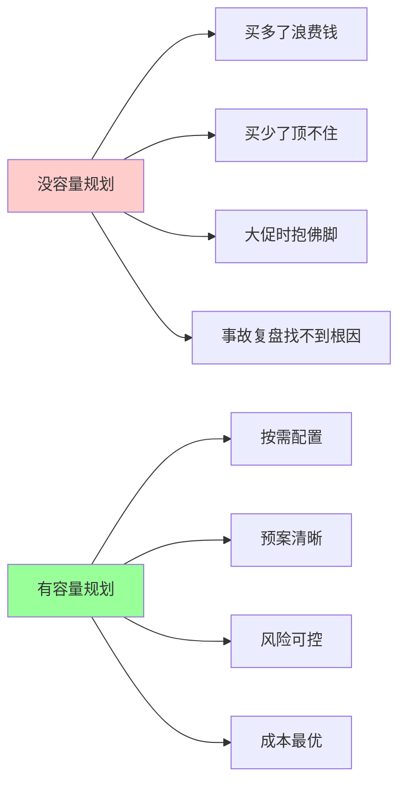

**核心问题**：
- 当前系统能扛多少 QPS？
- 双 11 需要扩容多少？
- 扩到哪个节点会瓶颈？
- 加机器能解决吗？

## 二、容量评估模型

### 2.1 基本公式

```
容量需求 = 业务峰值 × 安全系数 / 单机能力

业务峰值：业务预估
单机能力：压测得出
安全系数：1.5-2（冗余）
```

### 2.2 业务峰值评估

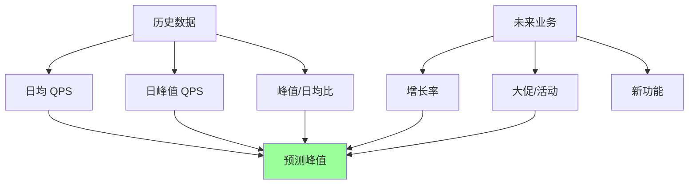

**实战公式**：

```
预测峰值 = 历史峰值 × (1 + 增长率) × 活动放大系数

例:
  今年双 11 峰值 = 去年峰值 × 1.3 (30% 增长) × 1.5 (活动更激进)
```

### 2.3 不同业务的峰值/日均比

| 业务 | 峰值/日均 |
| --- | --- |
| 电商 | 3-5x（平时）、10-50x（大促） |
| 直播 | 2-3x（日）、10-100x（顶流开播） |
| 游戏 | 3-5x（晚间高峰） |
| 支付 | 5-10x（工资日/纳税日） |
| SaaS | 2-3x（工作时段） |
| 新闻/资讯 | 2-3x（热点事件 10x+） |

### 2.4 单机能力评估

```
通过压测得出:
  - 单机最大 QPS
  - 单机最佳工作点（CPU 70% 时的 QPS）
  - 单机崩溃临界点

目标: 日常负载 ≤ 最佳工作点的 50%
```

**不要用理论值**，必须压测（现实和理论差 10 倍以上）。

### 2.5 实战：容量评估表

| 指标 | 日常 | 大促目标 | 需要准备 |
| --- | --- | --- | --- |
| QPS | 1 万 | 10 万 | 10 倍扩容 |
| 并发 | 1000 | 5 万 | 连接池扩 50x |
| 带宽 | 100 Mbps | 5 Gbps | CDN + 扩容 |
| 存储 | 500 GB | 2 TB | 分库分表 |
| 连接 | 1 万 | 10 万 | 长连接优化 |

## 三、资源维度

### 3.1 四大资源

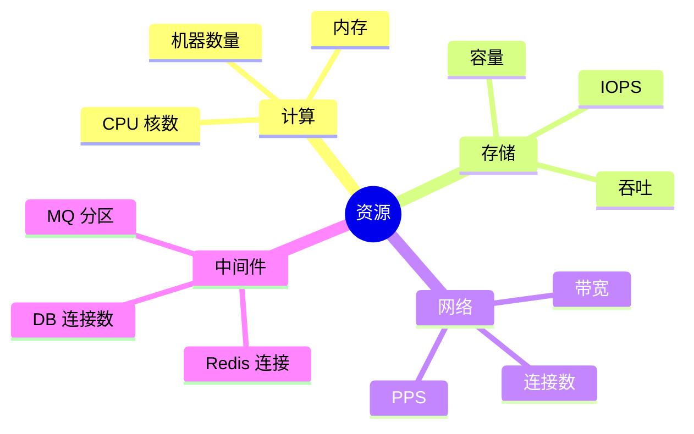

### 3.2 CPU / 内存

**评估要点**：
- 平均使用率 < 50%（留余量应对波动）
- P99 使用率 < 80%
- 不要看平均，看 1 分钟峰值

**实测**：
```bash
# Linux
top / htop / vmstat 1
# 长期记录
sar -u 1
```

### 3.3 存储

**容量**：
```
数据增长速率 × 计划周期 = 总容量
例: 每天 10GB × 3 年 = 11TB
再 × 副本数（3）= 33TB
```

**IOPS**：
- 普通 SSD：10K-50K IOPS
- NVMe：100K-1M IOPS
- MySQL OLTP：1K-10K IOPS/实例（通常是瓶颈）

**吞吐**：
- 顺序读写：MB/s 级别
- 随机读写：看 IOPS × 块大小

### 3.4 网络

**带宽**：
```
带宽 = QPS × 平均响应大小 × 安全系数
例: 10万 QPS × 10KB × 2 = 2 Gbps
```

**连接数**：
```
连接数 ≈ QPS × 平均响应时间
例: 10万 QPS × 100ms = 1万并发连接
```

**跨地域**：
- 国内：几十 ms
- 跨国：100-300 ms
- 跨洲：200-500 ms

### 3.5 中间件连接

**MySQL**：
- 默认 max_connections: 151
- 调优到 1000-5000
- 每连接约 10MB 内存 → 5000 连接需 50GB 内存

**Redis**：
- 默认 maxclients: 10000
- 可调至 100000+
- 连接成本低（几 KB）

**Kafka**：
- 分区数 = 消费者数上限
- 推荐单 Topic < 1000 分区

## 四、压测策略

### 4.1 压测目标

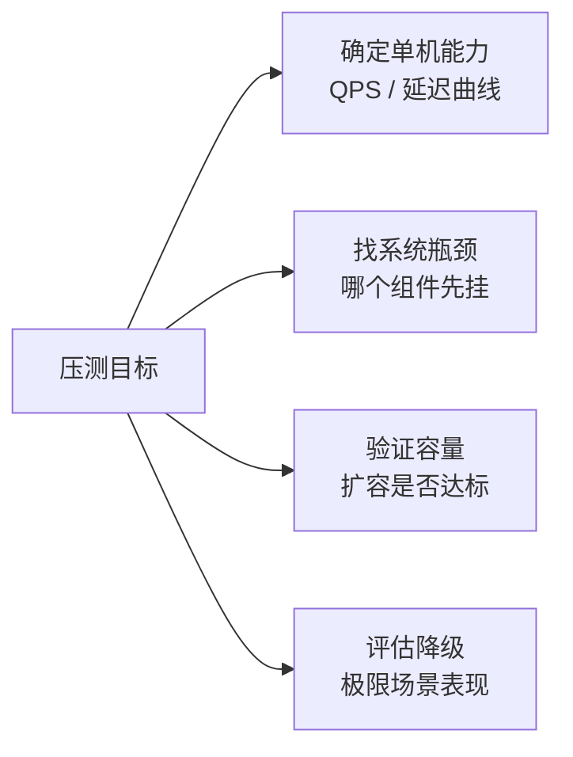

### 4.2 压测类型

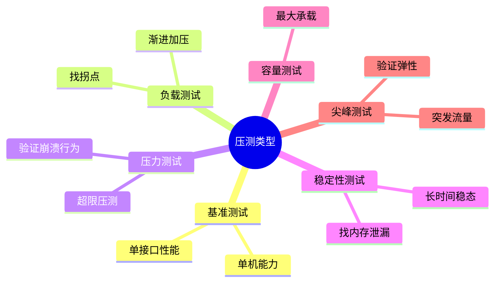

### 4.3 压测工具

| 工具 | 语言 | 特点 |
| --- | --- | --- |
| **wrk** | C | 简单 HTTP，吞吐高 |
| **wrk2** | C | 固定速率，看真实延迟 |
| **ab (ApacheBench)** | C | 简单粗暴 |
| **JMeter** | Java | 全能，复杂场景 |
| **Gatling** | Scala | 代码化，CI 集成 |
| **k6** | JS | 现代化，开发者友好 |
| **Locust** | Python | 分布式压测 |
| **hey** | Go | 简单好用 |

**经验**：
- 快速测 → wrk
- 真实延迟 → wrk2
- 复杂场景 → JMeter / Gatling
- CI 集成 → k6

### 4.4 压测方法论

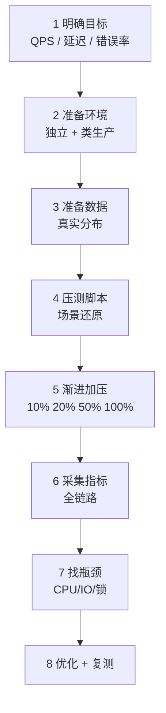

### 4.5 压测的坑

```
□ 用默认参数压（JVM / 连接池 / GOMAXPROCS）
□ 压测环境 vs 生产差太多（数据/配置/网络）
□ 压测客户端自己成了瓶颈
□ 不看 P99，只看平均
□ 不做长时压测，发现不了内存泄漏
□ 压测时其他系统没流量（干扰源不同）
□ 单接口压测，不压组合场景
□ 测试数据全命中缓存，不真实
```

## 五、性能基线

### 5.1 什么是基线

> **当前系统在标准负载下的性能表现，作为后续变更对比基准**

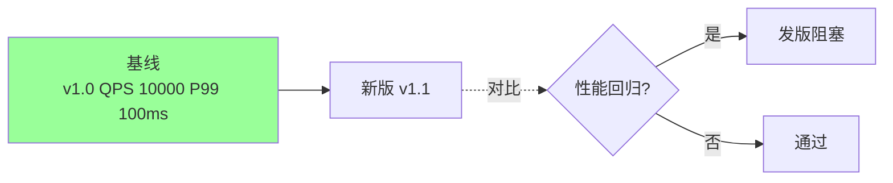

### 5.2 基线内容

```
□ QPS 上限
□ 延迟分布（P50/P95/P99/P999）
□ CPU / 内存曲线
□ IO / 网络曲线
□ 错误率
□ 慢接口 Top 10
```

### 5.3 基线管理

```
- 每次发版前后跑标准压测
- 记录在性能档案
- 对比历史数据
- 回归 > 10% 要求 Root Cause 分析
- CI/CD 集成性能门禁
```

### 5.4 性能门禁

```yaml
# CI 配置
performance_gate:
  qps_min: 8000        # 低于报错
  p99_max: 200ms       # 超过报错
  cpu_max: 70%
  error_rate_max: 0.1%

# 不达标 → 阻塞发版
```

## 六、全链路压测

### 6.1 为什么需要全链路

单接口压测无法发现：
- 跨服务瓶颈（A→B→C 链路上的单点）
- 资源竞争（多服务共用 DB）
- 中间件瓶颈（MQ / Redis 集群）
- 真实流量组合的效果

**只有端到端压测才能暴露真实容量**。

### 6.2 阿里全链路压测（业界标杆）

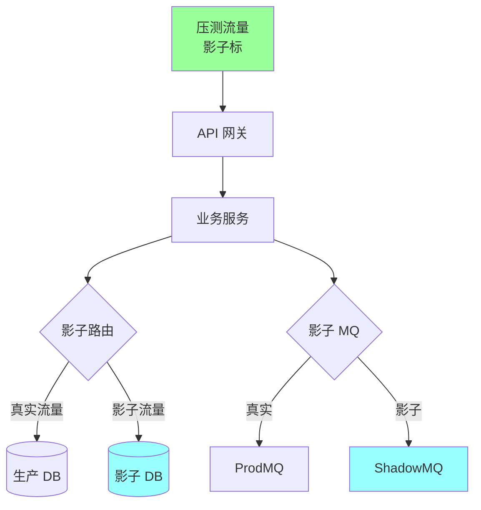

**核心设计**：
- **影子标识**：压测流量带特殊 header
- **影子路由**：DB / MQ / 缓存**分流**到影子表/主题
- **真实链路**：除数据隔离外，其他完全一致
- **数据清理**：压测后清影子数据

**关键点**：
- 生产环境压测（数据最真实）
- 数据严格隔离（不污染生产）
- 压测时段选低峰
- 熔断保护（异常立即停）

### 6.3 中小公司怎么做

**方案 1：预发环境全量压测**
- 完整复制生产数据
- 真实组件（DB / Redis / MQ）
- 压测不影响生产
- 代价：双份资源

**方案 2：生产镜像流量**
- 生产流量复制一份到测试环境
- goreplay / tcpcopy 工具
- 真实但只读

**方案 3：核心链路压测**
- 选几条关键链路（下单 / 支付）
- 影子表方案
- 成本较低

### 6.4 压测执行流程

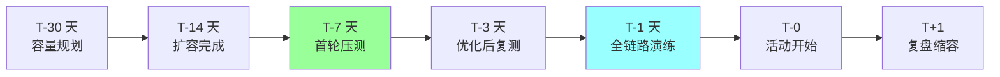

## 七、容量水位管理

### 7.1 水位线

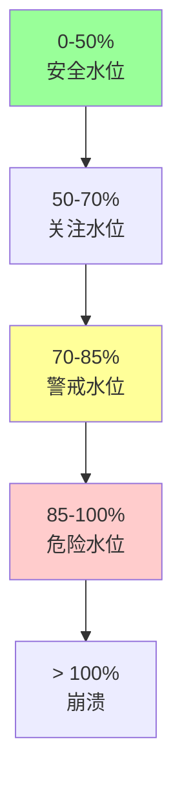

| 水位 | 操作 |
| --- | --- |
| < 50% | 正常 |
| 50-70% | 开始关注增长趋势 |
| 70-85% | 启动扩容流程 |
| 85-95% | 紧急扩容 + 限流 |
| > 95% | 降级 + 紧急调度 |

### 7.2 自动化运维

```
□ 水位实时监控 + 可视化
□ 自动告警（70%/85%/95% 三级）
□ 自动扩容（K8s HPA）
□ 预案触发（错误率高自动降级）
□ 容量报表周期性 review
```

## 八、大促容量预案

### 8.1 阿里双 11 三个月准备

```
T-90 天: 业务预估 + 容量评估
T-60 天: 架构改造 + 性能优化
T-30 天: 扩容完成 + 首轮压测
T-14 天: 第二轮压测 + 预案制定
T-7 天:  全链路压测 + 故障演练
T-3 天:  最终压测 + 预案 double-check
T-1 天:  预热 + 冻结发布
T-0:     活动开始 + 实时监控
T+1 ~ T+7: 缩容 + 成本优化
T+30 天: 复盘 + 沉淀经验
```

### 8.2 预案清单

```
□ 流量超预估 → 限流限速
□ 核心服务故障 → 降级兜底
□ DB 压力过高 → 读走缓存 / 分库
□ MQ 堆积 → 临时扩消费者
□ 某地区故障 → 流量切其他区
□ 全站告急 → 非核心功能关闭
□ 突发流量 → 手动扩容 5-10 倍
□ 数据异常 → 一键止血
```

### 8.3 指挥中心作战图

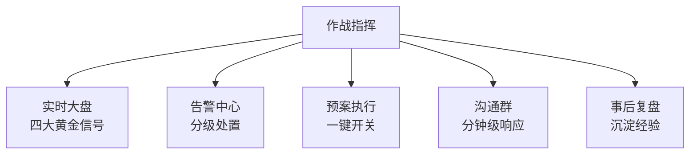

## 九、成本优化

### 9.1 容量 vs 成本矛盾

```
容量足够扛 10 倍流量 → 平时浪费 90%
容量刚好扛 1 倍流量 → 波动时挂
```

**平衡点**：
- 基础容量扛日常 1-2 倍峰值
- 弹性容量扛突发
- 预留容量做灰度

### 9.2 成本优化手段

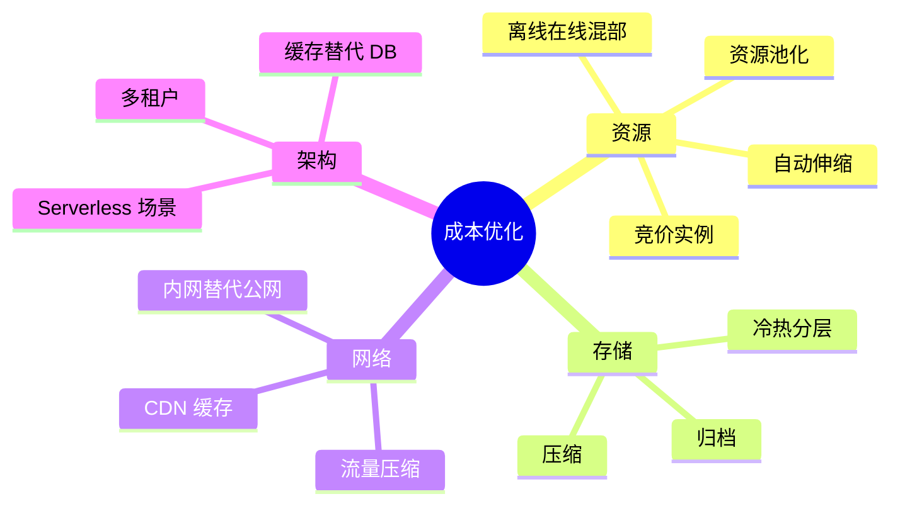

### 9.3 离在线混部（大厂标配）

```
在线服务（电商）: 白天忙
离线任务（报表 / 训练）: 夜晚忙
→ 同一集群白天跑在线，夜晚跑离线
→ 资源利用率从 30% → 70%+
```

阿里 / 字节 / Google 都有大规模混部。

## 十、真实项目视角

`ddd_order_example` 的容量规划：

```
业务目标:
  日均订单: 10 万
  日峰值: 30 万（3x）
  大促峰值: 300 万（30x）

应用层:
  单实例: 压测 500 QPS
  日常: 5 实例（共 2500 QPS）
  大促: 50 实例（25000 QPS）

DB:
  日常: 主库 1000 QPS、从库 5000 QPS
  大促: 分库分表 4 库 × 1000 QPS = 4000 QPS
  + 读走 Redis

Redis:
  日常: 单 Cluster 5 节点
  大促: 扩到 10 节点

Kafka:
  分区数: 32（订单 / 支付各）
  大促: 扩消费者 5x

监控告警:
  四大黄金信号
  分级告警 P0-P3
  容量水位 50/70/85 三档
```

## 十一、大厂案例

### 11.1 阿里双 11

```
2021 双 11 峰值:
  订单创建: 58.3 万笔/秒
  支付: 百万级/秒
准备:
  3 个月
  全链路压测 N 轮
  100+ 预案
  1000+ 技术专家坐镇
```

### 11.2 春运 12306

```
峰值: 2000 万查询/秒
手段:
  大量缓存
  排队机制
  验证码削峰
  分时段放票
```

### 11.3 抖音热点事件

```
顶流主播开播: 秒级百万观众涌入
准备:
  弹性扩容（分钟级）
  CDN 预热
  多活分流
  监控预案
```

## 十二、典型反模式

### 反模式 1：凭经验估容量

```
"去年够用今年也够"→ 业务增长 50% → 大促挂
```

**修复**：数据驱动，历史趋势 + 业务规划。

### 反模式 2：压测不真实

```
压测环境 DB 是个单表 1000 条 → 生产单表 1 亿条 → 压测数据无意义
```

**修复**：生产级数据规模 + 真实流量组合。

### 反模式 3：不做长时压测

```
10 分钟压测 OK → 上线跑 1 天 OOM
```

**修复**：至少 4 小时稳态压测 + 7 天观察。

### 反模式 4：容量规划只看平均

```
平均水位 30% 很安全 → 某分钟突发 200% → 挂
```

**修复**：看峰值 + P99 + 突发。

### 反模式 5：扩容靠临时买机器

```
活动前 3 天发现不够 → 临时采购 → 来不及
```

**修复**：容量评估提前 1-3 月。

### 反模式 6：没有压测就上新功能

```
新功能上线 → DB 慢查询拖垮全站
```

**修复**：性能门禁 + 变更前压测。

### 反模式 7：大促后不及时缩容

```
活动结束资源不缩 → 月度成本翻倍
```

**修复**：T+7 强制缩容，自动化。

## 十三、面试高频题

**Q1：怎么评估系统容量？**

```
容量需求 = 业务峰值 × 安全系数 / 单机能力
```

- 业务峰值：历史 + 增长 + 活动放大
- 单机能力：压测得出
- 安全系数：1.5-2

**Q2：压测应该测哪些？**

- 单接口基准
- 渐进加压找拐点
- 超限压测看崩溃
- 长时稳定性（内存泄漏）
- 组合场景全链路

**Q3：全链路压测的难点？**

- 数据隔离（影子表 / 影子 MQ）
- 流量标识（header 透传）
- 影响面控制（熔断保护）
- 清理机制

**Q4：容量水位怎么设？**

50% / 70% / 85% / 95% 四档。

50% 安全，70% 开始扩容，85% 紧急，95% 降级。

**Q5：大促容量怎么准备？**

- T-90 业务预估
- T-60 架构改造
- T-30 扩容完成
- T-14 第二轮压测
- T-7 全链路 + 预案
- T-1 冻结
- T+0 实时监控
- T+7 缩容

**Q6：平均利用率低，为什么还会挂？**

- 峰值流量
- P99 延迟尾部问题
- 突发流量
- 单机热点（某实例过载而平均没过）

**Q7：性能基线怎么管理？**

- 每次发版跑标准压测
- CI 集成性能门禁
- 回归超 10% 要分析
- 历史数据存档

**Q8：怎么做成本优化？**

- 自动伸缩
- 离在线混部
- 冷热分层
- CDN 缓存
- Serverless

**Q9：容量规划和可扩展性关系？**

容量规划：现在需要多少。

可扩展性：能加多少。

两者互补：可扩展性提供可能，容量规划决定用多少。

**Q10：压测数据怎么准备？**

- 拷贝生产脱敏
- 按真实分布
- 覆盖边界场景
- 流量组合（不只单接口）
- 足够规模（百万级）

## 十四、面试加分点

- **容量 = 业务预估 × 安全系数 / 单机能力**
- 单机能力**必须压测**，不要用理论值
- **大促峰值/日均比** 3-50 倍不等（业务差异大）
- **四大资源**：计算 / 存储 / 网络 / 中间件，都要评估
- 压测要**渐进 + 长时 + 组合场景**，不单接口
- **影子表 + 影子标** 是全链路压测标准方案
- **性能门禁**集成 CI/CD，回归阻塞发版
- **容量水位 50/70/85/95** 四档管理
- **T-90 → T+7** 大促准备流程完整
- **离在线混部**是大厂标配降本手段
- **压测环境越真实越好**（数据规模、流量分布、中间件）
- 容量规划是**资深工程师必备能力**，不光是 SRE 的事
