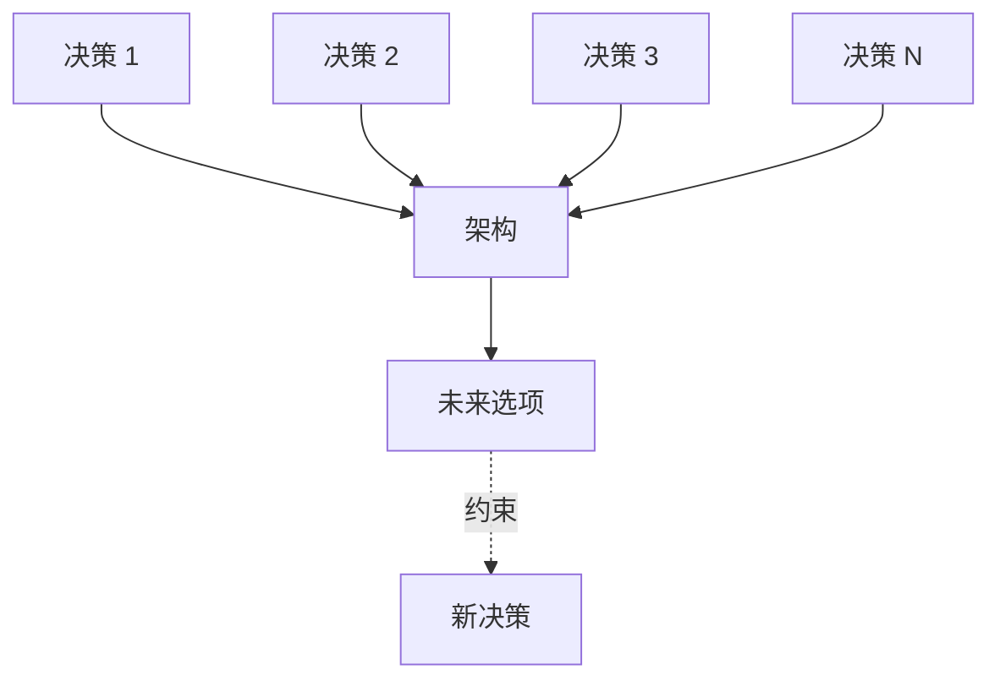
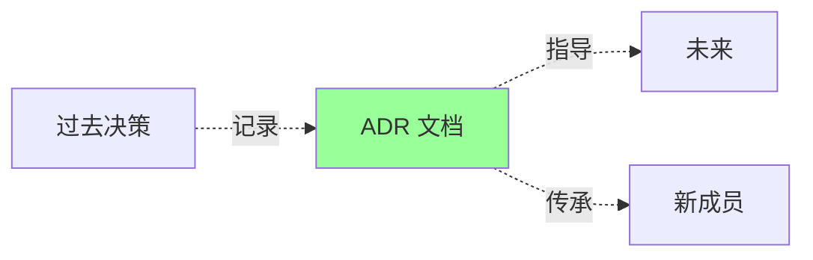
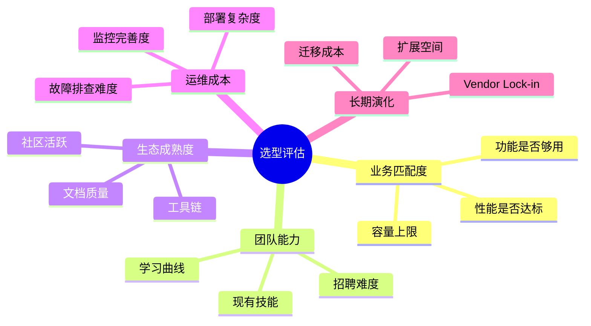
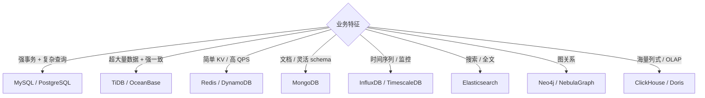
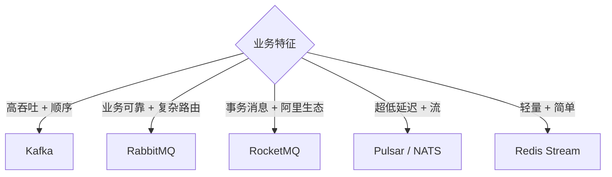
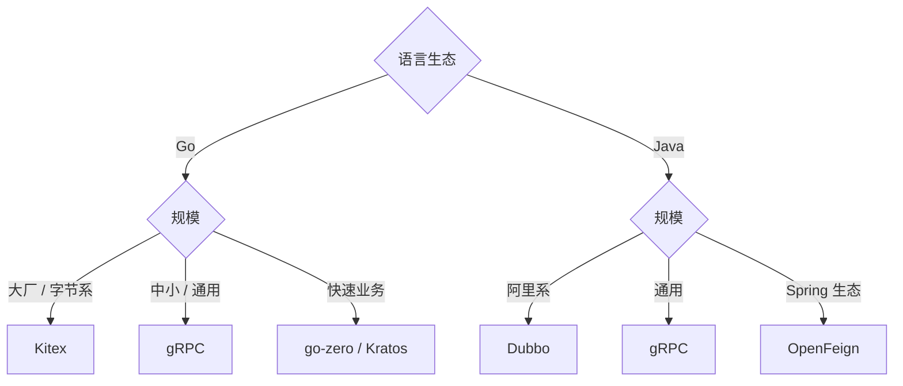
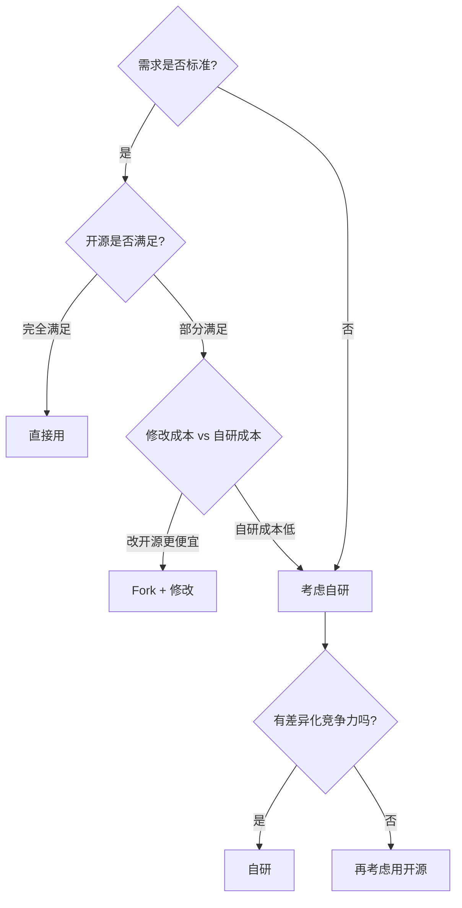
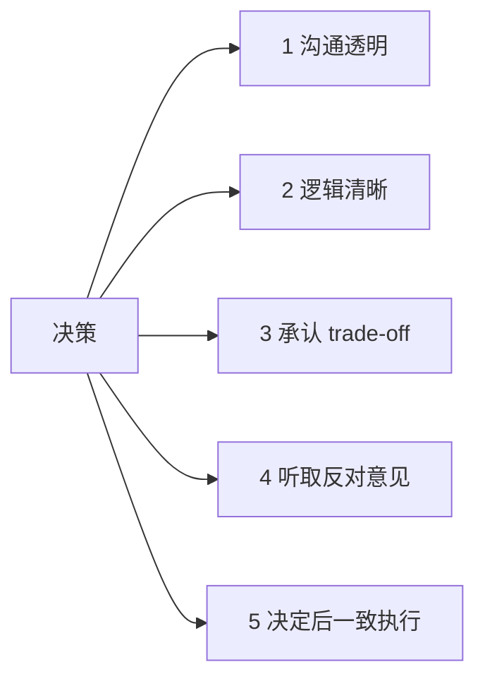
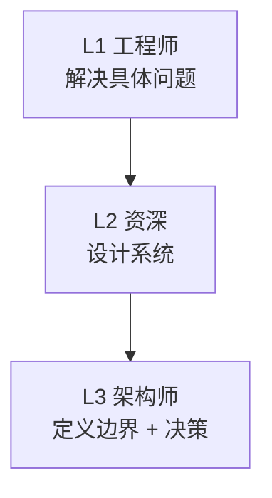
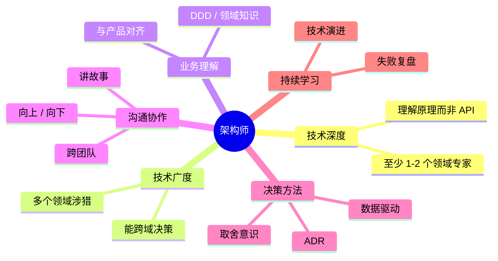

# 架构 · 决策与权衡

> ADR 决策记录 / 选型框架 / 反模式清单 / 演进路径 / 架构师的决策方法论

> 架构没有"最优解"，只有"在某约束下的最佳取舍"。本篇沉淀**怎么做决策**

## 一、为什么需要架构决策

### 1.1 架构 = 一系列决策

每个架构都是无数次决策叠加的结果：
- 用 MySQL 还是 PostgreSQL？
- 同步 RPC 还是异步消息？
- 单体还是微服务？
- 强一致还是最终一致？
- 自研还是用开源？
- ...



### 1.2 决策的特点

```
- 决策有 trade-off（取舍）
- 决策有时效（当时对，现在错）
- 决策会传染（A 决定影响 B 决定）
- 决策不可逆（数据库一旦选很难换）
- 决策有上下文（同样问题不同公司答案不同）
```

### 1.3 架构师的核心能力

不是知道答案，而是**会问问题 + 评估 trade-off + 决策记录**。

## 二、ADR：架构决策记录

### 2.1 什么是 ADR

> **Architecture Decision Record**：用文档记录每个重要架构决策的**背景、选项、取舍、决定**



**核心价值**：
- 知道"为什么这么设计"（避免反复推翻）
- 决策可追溯（出问题时找根源）
- 新成员快速理解
- 决策训练（写下来才能想清楚）

### 2.2 ADR 模板

```markdown
# ADR 001: 订单使用 MySQL 而非 MongoDB

## 状态
已决定 / 提议中 / 已废弃 / 已替代（被 ADR-XXX 替代）

## 背景
我们要为订单服务选择数据库。预期日订单量 100 万，需要支持复杂查询、事务、多人协作开发。

## 决策
选择 MySQL 8.0。

## 考虑过的选项

### 选项 1: MySQL ✓
- **优**：成熟、ACID、团队熟悉、生态完善
- **缺**：扩展性需要分库分表

### 选项 2: MongoDB
- **优**：扩展性好、Schema 灵活
- **缺**：事务支持弱、团队不熟、查询复杂时性能差

### 选项 3: PostgreSQL
- **优**：功能强、JSONB 类型
- **缺**：团队不熟、运维体系待建

## 后果
- ✅ 短期：开发快，业务快速上线
- ✅ 中期：MySQL 主从 + 读写分离能撑 1000 万订单
- ⚠️ 长期：到 1 亿订单需分库分表（届时考虑迁移 TiDB）

## 评审人
张三、李四、王五（架构组）

## 时间
2025-12-01
```

### 2.3 ADR 实战要点

```
□ 一个文件一个决策（不要混）
□ 编号顺序（ADR-001、002...）
□ 状态明确（已决定 / 已废弃）
□ 有"考虑过的其他选项"（这是关键）
□ 写明 trade-off
□ 评审人签字
□ 不修改已决定的（要变化用新 ADR 替代）
□ 存到代码仓库（docs/adr/）
```

### 2.4 ADR 的反模式

- 太长（5 页 PPT 没人看）
- 太晚写（决策完很久补 → 失真）
- 太多决策合一篇
- 没有"考虑过的选项"
- 不更新状态

## 三、技术选型框架

### 3.1 五个维度评估



### 3.2 决策矩阵

| 维度 | 权重 | 选项 A | 选项 B | 选项 C |
| --- | --- | --- | --- | --- |
| 业务匹配 | 30% | 9 | 7 | 8 |
| 团队能力 | 20% | 8 | 6 | 7 |
| 生态 | 15% | 9 | 9 | 7 |
| 运维 | 20% | 7 | 5 | 8 |
| 长期 | 15% | 7 | 8 | 7 |
| **总分** | | **8.05** | **6.85** | **7.45** |

**注意**：分数是辅助，**有些维度不可妥协**（如业务功能不够用直接淘汰）。

### 3.3 常见选型问题

#### 数据库选型



#### 消息队列选型



#### RPC 框架选型



### 3.4 自研 vs 用开源



**自研的真实成本**：
- 开发：3-6 个月
- 维护：长期 1-2 人投入
- 文档 / 培训
- Bug fix / 演化

**自研的合理理由**：
- 有差异化竞争力（CDN / 推荐 / 调度算法）
- 现有方案确实不够（性能 / 规模）
- 战略需要（不依赖外部）

**自研的不合理理由**：
- "感觉自己写更快"
- "学习一下"
- "NIH（Not Invented Here）综合症"

## 四、常见决策对比

### 4.1 同步 vs 异步

| 维度 | 同步 | 异步 |
| --- | --- | --- |
| 延迟 | 高（累加） | 低（核心路径快） |
| 一致性 | 强 | 最终 |
| 错误处理 | 简单（直接报错） | 复杂（重试 / 死信） |
| 调试 | 容易 | 难（链路长） |
| 适合 | 强一致业务 | 非核心解耦 |

### 4.2 强一致 vs 最终一致

| 维度 | 强一致 | 最终一致 |
| --- | --- | --- |
| 实现 | 分布式事务 / 2PC | 事件 + 补偿 |
| 性能 | 低 | 高 |
| 可用性 | 低（CAP 取 CP） | 高（取 AP） |
| 复杂度 | 高 | 中 |
| 适合 | 金融账本 | 大多数业务 |

### 4.3 单体 vs 微服务

| 维度 | 单体 | 微服务 |
| --- | --- | --- |
| 开发速度 | 快（前期） | 慢（前期） |
| 部署 | 简单 | 复杂 |
| 扩展 | 整体扩 | 独立扩 |
| 团队规模 | < 50 | > 100 |
| 故障 | 全挂 | 局部 |
| 适合 | 早期 / 小团队 | 复杂业务 / 大团队 |

### 4.4 关系型 vs NoSQL

| 维度 | 关系型 | NoSQL |
| --- | --- | --- |
| Schema | 固定 | 灵活 |
| 事务 | 强 | 弱 |
| 查询 | 复杂 | 简单 |
| 扩展 | 难（垂直为主） | 易（水平） |
| 一致性 | ACID | BASE |
| 适合 | 业务核心 | 海量 / KV / 日志 |

### 4.5 客户端 LB vs 服务端 LB

| 维度 | 客户端 | 服务端 |
| --- | --- | --- |
| 部署 | SDK | LB 中间件 |
| 性能 | 直连 | 多一跳 |
| 协议 | RPC | HTTP / TCP |
| 单点 | 无 | 有（LB） |
| 适合 | 微服务 RPC | HTTP API |

## 五、架构反模式清单

### 反模式 1：Big Ball of Mud（大泥球）

```
代码无章法、模块边界混乱、改一处影响全局
```

**修复**：分阶段重构，先建模块边界，再优化。

### 反模式 2：分布式单体

```
看似微服务，实质强耦合：必须按顺序部署、改一个连改多个
```

**修复**：DDD 战略 + 集成事件。详见 09-ddd/07。

### 反模式 3：金锤子（Golden Hammer）

```
"既然 Kafka 这么好，所有消息都用 Kafka"
"既然 Redis 这么快，所有数据都放 Redis"
```

**修复**：按场景选工具，不要一招吃遍天。

### 反模式 4：YAGNI 违反

```
"以后可能要支持 X，现在加上"→ 抽象 5 层框架，需求来了发现都不对
```

**修复**：YAGNI（You Aren't Gonna Need It），等需求出现再做。

### 反模式 5：过度工程

```
小公司直接上 K8s + Istio + Kafka + Elasticsearch + ML 平台
→ 5 人维护 100 个组件，全员运维
```

**修复**：阶段匹配，从简单开始。

### 反模式 6：CV 简历驱动开发

```
工程师为了简历好看 → 引入新潮但不必要的技术
```

**修复**：Code Review + 架构评审。

### 反模式 7：Vendor Lock-in 不自知

```
深度绑定某云厂商专有服务 → 后期想迁移代价巨大
```

**修复**：抽象一层接口，关键能力用开源替代品。

### 反模式 8：忽略运维成本

```
"上线了就完了"→ 不监控 / 不告警 / 不演练 → 出事束手无策
```

**修复**：上线前必须有可观测性 + 预案。

### 反模式 9：缓存即数据库

```
所有数据塞 Redis → Redis 挂 → 数据丢 → 业务全废
```

**修复**：缓存的数据 DB 必有，缓存只是性能优化。

### 反模式 10：手工运维 + 改配置

```
凌晨 3 点 SSH 上去手动改配置救火 → 改坏了 → 大事故
```

**修复**：所有变更走流水线 + Code Review + 灰度。

### 反模式 11：架构图过度

```
50 页架构 PPT，看的人晕，写的人也晕
```

**修复**：用 C4 模型分层（Context / Container / Component / Code），每层简洁。

### 反模式 12：忽视技术债

```
"先上线再说"→ 债越滚越大 → 大重构 → 业务停摆
```

**修复**：每 sprint 留 20% 还债。

## 六、架构演进路径模板

### 6.1 从 0 到 1（启动期）

```
团队规模: 1-5 人
DAU: 0-10万
架构: 单体 + 单 DB + Nginx
重点: 快速验证，能跑就行
工具: 云数据库 + 简单部署
```

### 6.2 从 1 到 10（增长期）

```
团队规模: 10-50 人
DAU: 10万-100万
架构: 单体 + 主从 + Redis 缓存 + CDN
重点: 提性能 + 稳定性 + 监控
工具: 云原生开始接入
```

### 6.3 从 10 到 100（扩张期）

```
团队规模: 50-200 人
DAU: 100万-1000万
架构: 垂直拆分 / SOA → 早期微服务
重点: 团队协作 + 业务边界 + 容量
工具: 注册中心 / 配置中心 / 网关 / 链路追踪
```

### 6.4 从 100 到 1000（成熟期）

```
团队规模: 200-2000 人
DAU: 1000万-1亿
架构: 微服务 + 同城双活 + 多级缓存
重点: 高可用 + 高性能 + DDD 治理
工具: K8s + Service Mesh + 全链路压测
```

### 6.5 从 1000 到 ∞（巨头期）

```
团队规模: 2000+ 人
DAU: 1亿+
架构: 异地多活 + 单元化 + 自研中间件
重点: 极致可用 / 极致性能 / 成本优化
工具: 自研云原生平台
```

## 七、决策的领导力维度

### 7.1 让团队相信决策



**反例**："因为我说的"——团队会消极抵制。

**正例**：写 ADR + 评审会 + 决策后所有人对外口径一致。

### 7.2 决策不可逆性

```
可逆决策（Two-way door）:
  - 改个配置
  - 试用新中间件
  → 快速决定 + 试错
  → 80% 决策属于这类

不可逆决策（One-way door）:
  - 选择主数据库
  - 微服务拆分边界
  - 公开 API 设计
  → 慢决定 + 充分评估
  → 20% 决策属于这类
```

**Bezos 原则**：可逆的快做，不可逆的慎做。

### 7.3 何时回头

```
如果继续走下去:
  □ 修复成本 > 重做成本？
  □ 沉没成本是否在影响你？
  □ 有更好的选项了吗？
  □ 现在认错的损失，比 6 个月后认错小吗？

→ 学会"撤回"也是架构师的能力
```

### 7.4 决策的常见偏误

| 偏误 | 描述 |
| --- | --- |
| **沉没成本** | "都投入这么多了，不能放弃" |
| **确认偏误** | 只找支持自己观点的证据 |
| **从众** | "大厂都这么做" |
| **新颖偏好** | 喜欢新潮技术 |
| **保守偏好** | 害怕变化坚持旧方案 |
| **过度自信** | "我经验丰富不会错" |

**修复**：写 ADR 时显式列考虑过的选项 + 反对意见，强制对抗偏误。

## 八、架构师的成长

### 8.1 三个等级



| 等级 | 关注 | 输出 |
| --- | --- | --- |
| L1 | 模块 | 代码 |
| L2 | 服务 | 设计文档 |
| L3 | 系统 / 业务 | ADR / RFC / 架构图 |

### 8.2 架构师的能力模型



### 8.3 学习路径

```
入门:
  □ 《架构整洁之道》Robert Martin
  □ 《微服务设计》Sam Newman
  □ 《数据密集型应用系统设计》Martin Kleppmann

进阶:
  □ 《领域驱动设计》Eric Evans
  □ 《SRE: Google 运维解密》
  □ 《设计模式》GoF

实战:
  □ 大厂技术博客（美团 / 阿里 / 字节 / 腾讯）
  □ 开源项目源码
  □ 自己做一个完整项目（如 ddd_order_example）

进阶视角:
  □ 经典论文（Dynamo / Bigtable / Paxos / Raft）
  □ 行业大会（QCon / ArchSummit）
  □ 写技术博客 / 参与开源
```

## 九、面试高频题

**Q1：怎么做技术选型？**

五个维度：业务匹配 / 团队能力 / 生态成熟度 / 运维成本 / 长期演化。

输出 ADR：背景 + 选项 + 取舍 + 决定。

**Q2：什么是 ADR？为什么要写？**

Architecture Decision Record，记录架构决策的背景、选项、取舍、决定。

价值：决策可追溯、新人快速理解、避免反复推翻。

**Q3：自研 vs 用开源怎么选？**

```
- 标准需求 + 开源满足 → 直接用
- 部分满足 → Fork + 修改
- 有差异化竞争力 + 现有不够 → 自研
```

**自研真实成本**：开发 3-6 月 + 长期维护 1-2 人 + 文档培训。

**Q4：分布式单体怎么发现？**

征兆：
- 必须按顺序部署
- 改一个连改 N 个
- 跨服务事务硬塞
- BC 边界模糊

修复：DDD 战略设计重新划界。

**Q5：你怎么应对"金锤子"思维？**

Code Review + 架构评审，要求每次引入新技术写 ADR 比较替代方案。

**Q6：可逆 vs 不可逆决策怎么处理？**

可逆（80%）：快做，错了改。

不可逆（20%）：慢做，充分评估。

如选 DB / 拆 BC 边界 / 对外 API 都是不可逆的。

**Q7：怎么判断架构是否过度设计？**

- 90% 需求绕开框架
- 文档比代码多 5 倍
- 改一字段要改 5 处
- 团队抱怨复杂

YAGNI 原则：等需求出现再抽象。

**Q8：架构演进的常见路径？**

```
0 → 1: 单体 + 单 DB
1 → 10: 主从 + 缓存 + CDN
10 → 100: 垂直拆 → 微服务
100 → 1000: 同城双活
1000+: 异地多活 + 单元化
```

各阶段团队规模和 DAU 不同，照搬终态会过度。

**Q9：怎么避免决策偏误？**

- 写 ADR（强制思考）
- 列考虑过的选项
- 听反对意见
- 数据驱动
- 找经验丰富的人 challenge

**Q10：架构师 vs 资深工程师的区别？**

- 工程师解决问题
- 资深设计系统
- 架构师**定义边界 + 决策 + 影响他人**

输出物：ADR / RFC / 架构图，而非代码。

## 十、面试加分点

- 架构 = **一系列决策叠加**，每个决策都有 trade-off
- **ADR 是架构决策的标准做法**（背景 / 选项 / 取舍 / 决定）
- **可逆 vs 不可逆决策**区别处理（Bezos 原则）
- **五维选型框架**：业务 / 团队 / 生态 / 运维 / 长期
- **自研要谨慎**：评估真实长期成本
- **金锤子 / YAGNI / 过度工程** 是常见反模式
- **分布式单体** 是微服务最大坑
- **架构演进有阶段**，照搬终态会过度
- **架构师不写所有代码**，输出 ADR / RFC / 架构图
- **决策偏误**用 ADR + 反对意见对抗
- 真正的架构师：**定边界 + 做决策 + 影响他人 + 持续学习**
