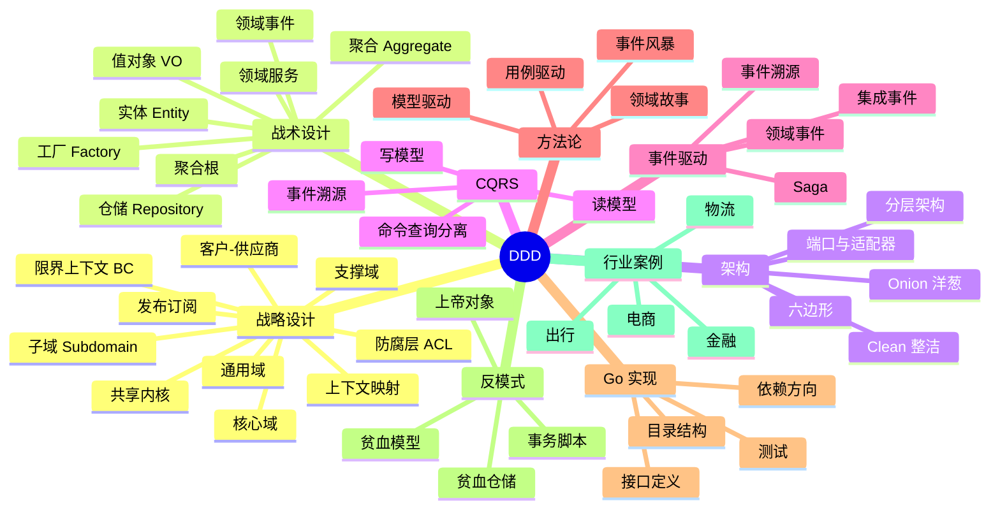
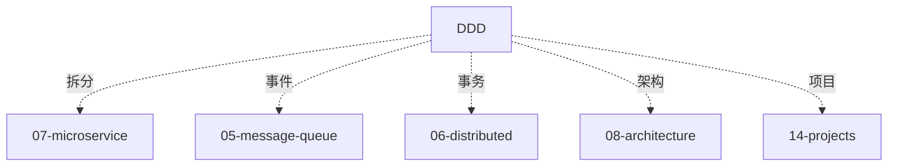

# DDD 知识地图

> DDD 是**业务建模的终极武器**。从战略设计（限界上下文）到战术设计（聚合 / 实体 / 值对象），把复杂业务拆成可演化的模型。
>
> 这份地图是 09-ddd 目录的总览：知识树 / 题型分类 / 学习路径 / 实战案例 / 答题方式

---

## 一、整体知识树



---

## 二、后端视角的 DDD

| DDD 能力 | 后端解决的问题 |
| --- | --- |
| 限界上下文 | 微服务拆分的理论依据 |
| 聚合根 | 业务一致性边界 / 事务边界 |
| 领域事件 | 解耦 + 异步 + 最终一致 |
| 防腐层 | 隔离外部系统脏模型 |
| CQRS | 读写分离 / 性能优化 |
| 事件溯源 | 审计追踪 / 状态重放 |
| 六边形架构 | 业务核心与外部解耦 |
| 事件风暴 | 快速建模方法 |
| 战略设计 | 组织架构与系统对齐 |

---

## 三、能力分层（资深 Go 后端）

```text
L1 概念
  DDD 是什么、为什么、和传统 MVC 区别

L2 战略设计
  限界上下文 / 子域 / 上下文映射 / ACL

L3 战术设计
  实体 / 值对象 / 聚合 / 仓储 / 领域服务

L4 架构
  分层 / 六边形 / Onion / Clean

L5 事件驱动
  领域事件 / CQRS / ES / Saga

L6 方法论
  事件风暴 / 领域故事 / 模型迭代

L7 Go 实现
  目录结构 / 依赖注入 / 接口设计 / 测试

L8 行业实战
  电商 / 金融 / 物流 案例
```


---

## 四、题型分类

### 4.1 基础题（P5）

```
□ 什么是 DDD？
□ 实体 vs 值对象
□ 聚合是什么
□ DDD 和 MVC 的区别
```

对应：[01](01-strategic-design.md) / [02](02-tactical-building-blocks.md)

### 4.2 中级题（P6）

```
□ 限界上下文怎么划
□ 聚合根的 3 个原则
□ 六边形架构
□ 领域事件 vs 集成事件
□ 仓储模式
□ 事件风暴流程
```

对应：[01](01-strategic-design.md) / [02](02-tactical-building-blocks.md) / [03](03-aggregate-design.md) / [04](04-architecture-patterns.md)

### 4.3 资深题（P7+）

```
□ CQRS + Event Sourcing 完整实现
□ Saga 编排 vs 协调
□ 防腐层 ACL 实战
□ 聚合设计 4 大原则
□ 分布式事务 + DDD
□ 多团队 + 多 BC 协作
□ 贫血 vs 充血模型 取舍
□ 事件溯源落地挑战
```

对应：[03](03-aggregate-design.md) / [05](05-cqrs-eventsourcing.md) / [07](07-anti-patterns-best-practices.md) / [08](08-industry-cases.md)

### 4.4 综合系统设计（P7-P8）

```
□ 设计订单系统（DDD 落地）
□ 设计支付系统
□ 电商系统 BC 划分
□ CQRS + ES 落地
```

对应：[06](06-go-implementation.md) / [08](08-industry-cases.md) + [../14-projects/05-ddd-order-example](../14-projects/README.md)

---

## 五、目录文件全览

| # | 文件 | 重点 |
| --- | --- | --- |
| 01 | [战略设计](01-strategic-design.md) | BC / 子域 / 上下文映射 / ACL |
| 02 | [战术构件](02-tactical-building-blocks.md) | 实体 / VO / 聚合 / 仓储 / 服务 |
| 03 | [聚合设计](03-aggregate-design.md) | 聚合 4 原则 / 一致性边界 |
| 04 | [架构模式](04-architecture-patterns.md) | 分层 / 六边形 / Onion / Clean |
| 05 | [CQRS + ES](05-cqrs-eventsourcing.md) | 读写分离 / 事件溯源 |
| 06 | [Go 实现](06-go-implementation.md) | 目录结构 / 接口 / 依赖 |
| 07 | [反模式与最佳实践](07-anti-patterns-best-practices.md) | 贫血 / 上帝对象 / 事务脚本 |
| 08 | [行业案例](08-industry-cases.md) | 电商 / 金融 / 物流 |

---

## 六、在系统设计中的角色

### 6.1 微服务拆分的理论基础

```
BC 边界 = 微服务边界（理想）
每个 BC 独立部署 / 独立 DB / 独立团队
```

### 6.2 聚合 = 事务边界

```
一个事务只改一个聚合
跨聚合用领域事件 + 最终一致
```

### 6.3 CQRS + Event Sourcing

```
写: Command → Aggregate → 领域事件
读: 事件 → 读模型（物化视图）
```

### 6.4 Saga 编排

```
订单创建:
  1. 扣库存 → 失败补偿
  2. 扣钱 → 失败补偿
  3. 发货 → 失败补偿
```

---

## 七、学习路径推荐

### 7.1 入门 → 资深（6 周）

```
Week 1: 概念 + 战略
  01 strategic

Week 2: 战术
  02 tactical + 03 aggregate

Week 3: 架构
  04 patterns

Week 4: 事件驱动
  05 CQRS + ES

Week 5: 实战
  06 Go 实现

Week 6: 反模式 + 案例
  07 anti + 08 cases
```

---

## 八、答题模板

### 8.1 概念题（"DDD 和 MVC 的区别"）

```
3 步:
1. MVC: 技术分层（Controller/Service/DAO）
2. DDD: 业务分层（领域 / 应用 / 基础设施）
3. 根本:
   - MVC 贫血模型（业务在 Service）
   - DDD 充血模型（业务在 Entity）
```

### 8.2 设计题（"订单系统 BC 怎么划"）

```
4 步:
1. 事件风暴 → 识别领域事件
2. 聚合根 → 订单 / 商品 / 库存 / 支付
3. BC:
   - 订单上下文
   - 商品上下文
   - 库存上下文
   - 支付上下文
4. 上下文映射:
   - 订单 ⇌ 库存 客户-供应商
   - 订单 ⇌ 支付 发布订阅
```

### 8.3 取舍题（"什么时候用 DDD"）

```
3 步:
1. 适合: 复杂业务 / 长周期 / 多团队
2. 不适合: 简单 CRUD / 一次性项目
3. 代价: 学习成本 + 建模时间
```

---

## 九、面试表达

```text
DDD 8 层：
- L1 概念（DDD vs MVC）
- L2 战略（BC / 子域 / ACL）
- L3 战术（实体 / 聚合 / 仓储）
- L4 架构（六边形 / Onion / Clean）
- L5 事件（领域事件 / CQRS / ES）
- L6 方法（事件风暴）
- L7 Go 实现
- L8 行业案例

不要为了 DDD 而 DDD。
简单业务不需要 DDD。
```

---

## 十、常见误区

### 误区 1：DDD 万能

错。**简单 CRUD 不适用**。DDD 是复杂业务的武器。

### 误区 2：DDD 一定用事件溯源

错。ES 是一种实现方式，**不是必须**。

### 误区 3：一个 BC = 一个微服务

部分错。通常对应，但**可以合并或拆分**。

### 误区 4：聚合越大越好

错。大聚合**性能差 + 冲突多**。应该小而精。

### 误区 5：领域服务是垃圾桶

错。**只有无法归属实体的业务逻辑**才放领域服务。

---

## 十一、与其他模块的关系



---

## 十二、面试加分点

- **限界上下文 = 微服务边界**
- **聚合 4 大原则**（小聚合 / 聚合根 / 按 ID 引用 / 事务一致）
- **CQRS + ES** 真实落地
- **Saga 编排 vs 协调** 对比
- **防腐层 ACL** 隔离脏模型
- **事件风暴** 方法论
- **六边形架构 + 端口适配器**
- **贫血 vs 充血** 取舍（看业务复杂度）
- **领域事件 vs 集成事件** 区别
- **Go 项目目录结构**（domain / application / infrastructure）
- **不教条**（简单业务不用 DDD）

---

## 十三、推荐阅读路径

```
入门:
  □ 《领域驱动设计精粹》
  □ 09-ddd/01-02

进阶:
  □ 《实现领域驱动设计》
  □ 《Clean Architecture》
  □ 09-ddd/03-06

资深:
  □ 《领域驱动设计》Eric Evans 蓝皮书
  □ Vaughn Vernon 博客
  □ 09-ddd/07-08

实战:
  □ 14-projects/05-ddd-order-example
  □ 自己落地一个 BC
```

---

## 十四、与 99-meta 的关联

```
跨主题索引: 99-meta/01-cross-topic-index.md
项目案例:   14-projects/05-ddd-order-example
```
