# DDD · 战略设计

> DDD 是什么 / 为什么 / 通用语言 / 限界上下文 / 子域分类 / 上下文映射 9 种模式

## 〇、多概念对比：DDD 5 大核心概念（D 模板）

### 一句话定位

| 概念 | 一句话定位 |
| --- | --- |
| **领域（Domain）** | **业务问题空间整体**（如"电商"），是 DDD 一切的起点 |
| **子域（Subdomain）** | 领域内的**业务划分**（核心 / 通用 / 支撑），帮助识别投入优先级 |
| **限界上下文（Bounded Context）** | **解决方案空间的边界**（如"订单上下文 / 库存上下文"），模型在边界内一致 |
| **聚合（Aggregate）** | **强一致单元**（订单 + 订单项），事务边界 + 一致性边界 + 仓储单位 |
| **通用语言（Ubiquitous Language）** | **业务和技术共用的术语**（"订单不是 record，是 Order"），贯穿代码 / 文档 / 沟通 |

### 多维度对比（17 维度，必背）

| 维度 | 领域 | 子域 | 限界上下文 | 聚合 | 通用语言 |
| --- | --- | --- | --- | --- | --- |
| **空间** | 业务问题空间 | 业务问题空间（划分）| **解决方案空间** | 代码 / 模型空间 | 语言空间 |
| **粒度** | 最大（整个业务）| 中（按业务方向）| 中（按子域 / 团队）| 小（几个类）| 横跨所有粒度 |
| **关系** | 包含子域 | 隶属领域 | **可能对应 1+ 子域** | **隶属 1 个上下文** | 贯穿所有 |
| **是否有边界** | 模糊（业务范围）| 模糊（业务方向）| **清晰**（代码 / 模块）| **清晰**（事务边界）| - |
| **典型例子** | 电商 / 物流 / 金融 | 订单子域 / 库存子域 | OrderContext / StockContext | Order + OrderItem | "订单" / "下单" / "履约" |
| **存在目的** | 描述业务整体 | 区分核心 / 通用 / 支撑 | **隔离模型**（同一术语不同含义）| **保证强一致** | **消除歧义** |
| **分类** | 无 | 核心 / 通用 / 支撑 | - | 实体 + 值对象组合 | - |
| **投入策略** | - | **核心子域重投**（差异化）| - | - | 团队共建 |
| **跨子域 / 上下文通信** | - | 必有 | **9 种映射模式**（共享内核 / 客户-供应商 / 顺从者 / 防腐层 / 开放主机 / 已发布语言 / 大泥球 / 各行其道 / 合作关系）| - | - |
| **代码体现** | 顶层包 / 服务集 | 包 / 模块 | **包 / 模块 / 微服务** | **类 + Repository** | 类名 / 方法名 / 文档 |
| **可见性** | 业务高层视角 | 业务策略视角 | **架构师视角** | 开发者视角 | 全员视角 |
| **粒度建议** | 全公司业务 | 按团队划分 | 按团队 / 业务能力 | **小**（5-7 个聚合根 / 上下文）| 持续演化 |
| **变化频率** | 长期稳定 | 长期稳定 | 半年-年 | 月-季度 | 持续 |
| **是否对应微服务** | 不 | 不直接 | **常对应 1 微服务** | 不（聚合在服务内）| - |
| **典型陷阱** | 范围过大 | 没区分核心 / 支撑 | **上下文过大（巨石）** | **聚合过大（事务慢）** | 没贯彻（术语乱）|
| **决策角色** | CEO / 产品 | 业务架构 | **架构师 / 技术** | **领域专家 + 开发** | 全员 |
| **学习曲线** | 低 | 中 | **高**（DDD 核心难点）| 高 | 中 |

### 协作关系图

```
领域（Domain）= 电商整体
  │
  ├─ 核心子域（Core Subdomain）= 订单 + 履约
  │   ├─ 限界上下文 1: OrderContext（订单管理）
  │   │   ├─ 聚合: Order（订单）
  │   │   │   ├─ 实体: OrderItem（订单项）
  │   │   │   └─ 值对象: Money / Address
  │   │   ├─ 通用语言: "下单" / "取消" / "支付"
  │   │   └─ 团队: 订单团队
  │   │
  │   └─ 限界上下文 2: FulfillmentContext（履约）
  │       ├─ 聚合: Shipment（发货单）
  │       └─ 通用语言: "发货" / "签收"
  │
  ├─ 通用子域（Generic Subdomain）= 用户 + 支付
  │   ├─ 限界上下文 3: UserContext
  │   ├─ 限界上下文 4: PaymentContext（接入第三方）
  │   └─ 策略: 买 / 外包（不投入）
  │
  └─ 支撑子域（Supporting Subdomain）= 风控 + 推荐
      ├─ 限界上下文 5: RiskContext
      └─ 限界上下文 6: RecommendContext
      策略: 简单实现 / 接入开源
```

### 协作时序对比（多个上下文协作完成"下单"）

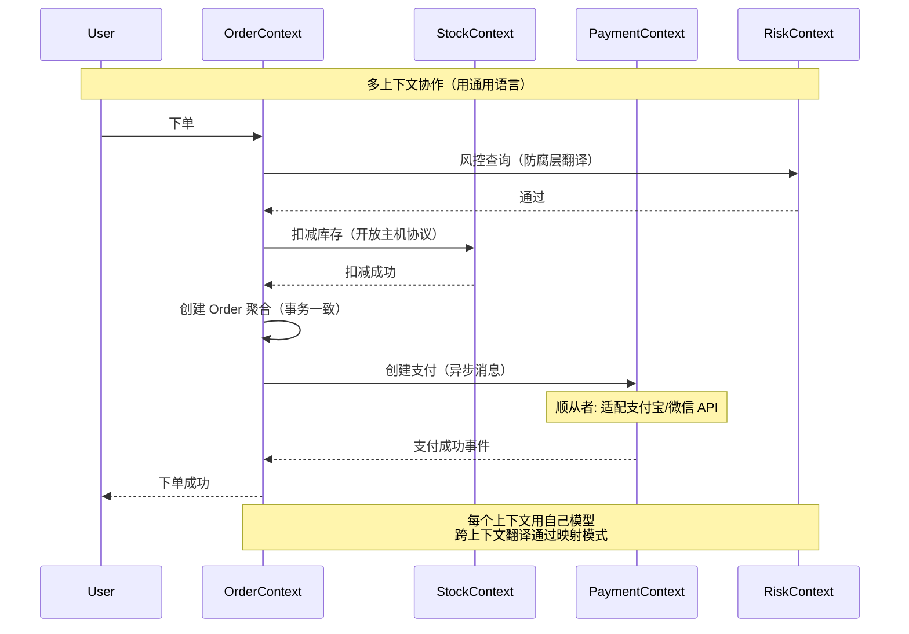

### 上下文映射 9 种模式（必背）

```
合作关系（Partnership）:
  两团队同生共死 + 频繁沟通
  适用: 强依赖核心业务

共享内核（Shared Kernel）:
  共享一小段代码（如基础类型）
  适用: 必要的共享，越小越好

客户-供应商（Customer-Supplier）:
  下游（客户）说话有分量，上游（供应商）配合
  适用: 上游愿意支持下游

顺从者（Conformist）:
  下游完全适配上游模型（无 say no 权）
  适用: 接入第三方（支付宝 / 微信）

防腐层（Anticorruption Layer, ACL）:
  下游在边界做翻译层，防止上游污染本地模型
  适用: 接入老系统 / 外部 API
  **DDD 最常用模式之一**

开放主机服务（Open Host Service, OHS）:
  上游提供标准 API 供多个下游使用
  适用: 平台 / 中台

已发布语言（Published Language, PL）:
  使用标准化协议（如 JSON Schema / Avro）
  适用: 跨组织接口

各行其道（Separate Ways）:
  两上下文完全无交互
  适用: 业务真的无关

大泥球（Big Ball of Mud）:
  没有边界的混乱代码
  适用: 不要这样！识别后慢慢拆出去
```

### DDD vs 传统三层架构（高频考点）

```
传统三层架构（数据驱动）:
  Controller → Service → DAO → DB
  
  问题:
    - Service 是过程式（一堆 if/else）
    - 业务逻辑散落各处
    - 模型贫血（Domain 只有 getter/setter）
    - 复杂业务难以维护

DDD 分层架构（领域驱动）:
  ┌────────────────────────┐
  │ Interface 层（API）     │ Controller / DTO
  ├────────────────────────┤
  │ Application 层（应用）  │ 编排，不含业务规则
  ├────────────────────────┤
  │ Domain 层（领域）★      │ ★ 核心 ★
  │ - 聚合 / 实体 / 值对象  │
  │ - 领域服务              │
  │ - 仓储接口              │
  │ - 领域事件              │
  ├────────────────────────┤
  │ Infrastructure 层（基建）│ DB / MQ / 第三方
  └────────────────────────┘

  优势:
    - 业务规则集中在 Domain
    - 富领域模型（行为 + 数据）
    - 可测试（Domain 不依赖框架）
    - 复杂业务可维护
```

### 缺一不可分析

| 假设 | 后果 |
| --- | --- |
| **没领域** | 没有"业务问题空间"概念 → DDD 失去起点 |
| **没子域** | 不区分核心 / 通用 / 支撑 → 投入策略错（在通用子域上浪费精力）|
| **没限界上下文** | 同一术语全公司多种含义（如"订单"在仓储 / 售后 / 财务都不同）→ 灾难 |
| **没聚合** | 失去事务边界 / 一致性边界 → 数据不一致 + 性能崩 |
| **没通用语言** | 业务和技术沟通成本爆炸 → 需求理解偏差 |

### 限界上下文 vs 微服务（高频考点）

```
关系:
  限界上下文是 DDD 概念（业务边界）
  微服务是部署单元（技术边界）

最佳实践: 1 限界上下文 = 1 微服务（边界对齐）

不对齐反模式:
  ❌ 1 微服务 = N 限界上下文 → 微服务过大 + 边界混乱
  ❌ N 微服务 = 1 限界上下文 → 跨服务事务地狱

但不绝对:
  - 小业务: 1 上下文可能不值得拆微服务
  - 大上下文: 可能拆多个微服务（如订单上下文 = 创建服务 + 查询服务）
  - 中心化共享数据: 用同一微服务但代码内分上下文
```

### 聚合设计核心原则

```
聚合（Aggregate）的 4 大原则:

1. 一致性边界:
   聚合内部数据强一致（一次事务）
   聚合之间最终一致（事件驱动）
   
   例: 订单聚合 = Order + OrderItem
       订单 + 库存 = 两个聚合（最终一致）

2. 聚合根（Aggregate Root）:
   每个聚合有唯一根入口
   外部只能通过根访问（封装）
   仓储只针对根（OrderRepository，不是 OrderItemRepository）

3. 小聚合:
   一个聚合 5-7 个对象上限
   过大 = 事务慢 + 锁竞争
   
   例: 用户聚合不要包含全部订单历史（订单是独立聚合）

4. 引用其他聚合用 ID:
   ❌ Order.user = User 对象
   ✅ Order.userId = "user_123"
   
   优势: 解耦 / 不被迫加载 / 跨上下文友好
```

### 怎么选（决策树 - 什么时候用 DDD）

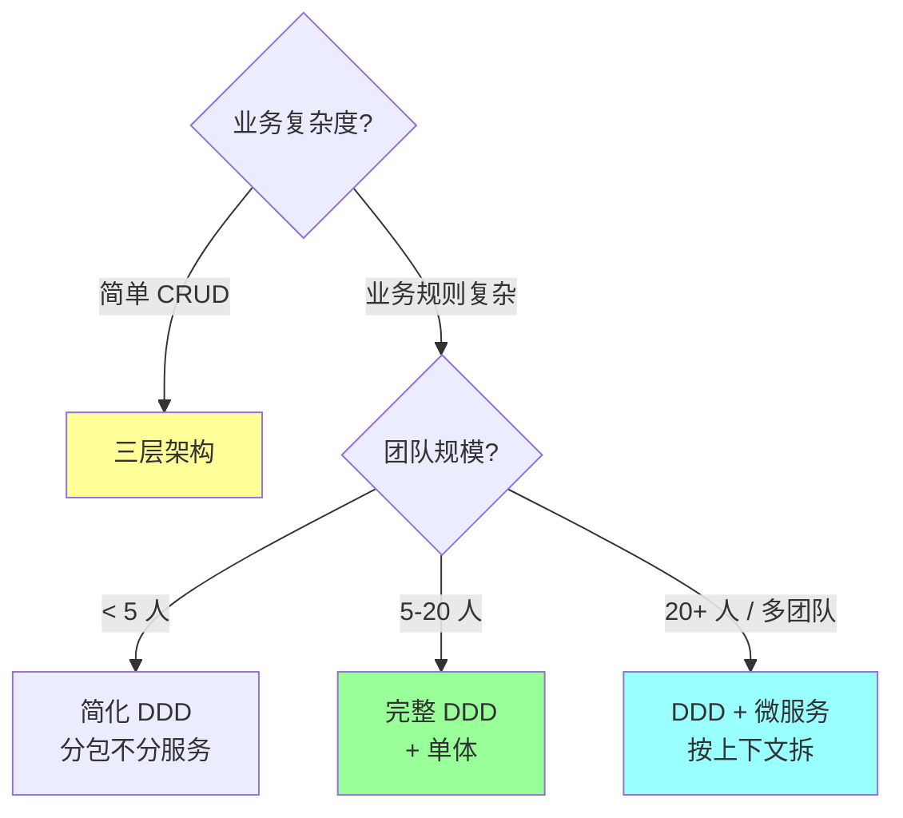

**实战推荐**：

| 业务类型 | 推荐 | 备注 |
| --- | --- | --- |
| 后台管理（CRUD）| **三层架构** | DDD 是过度设计 |
| 电商 / 金融 / 物流（复杂业务）| **DDD** | 核心域投入 |
| 中台 / 平台 | **DDD + 单元化** | 多团队协作 |
| 小工具 / Demo | **简单分层** | 不用 DDD |
| SaaS / 多租户 | **DDD + 上下文按租户隔离** | 业务复杂 |

### 反模式（生产不要踩）

```
❌ 全公司用一个上下文 → 巨石上下文（"订单"含义混乱）
❌ 每个表对应一个聚合 → 失去 DDD 价值（变成贫血模型）
❌ 聚合内放几十个对象 → 事务慢 + 锁竞争
❌ 直接暴露聚合根内部对象（如 order.items.add(...)）→ 失去封装
❌ 跨聚合用对象引用而不是 ID → 不可序列化 / 不能跨上下文
❌ 用 DDD 写简单 CRUD → 过度设计
❌ 通用子域投入太多 → 应该买 / 用开源
❌ 没有通用语言 → 业务说"订单"，代码叫 "Record" / "Data"
❌ 限界上下文没文档 / 没图 → 团队各做各的
❌ 上下文映射没明确 → 接入第三方没防腐层 → 模型被污染
```

### 一句话总结（D 模板专属）

> DDD 5 大核心概念的核心是 **"业务复杂度治理的分层抽象"**：
> **领域**（业务整体）→ **子域**（核心 / 通用 / 支撑分类，决定投入）→ **限界上下文**（解决方案边界，对应代码模块 / 微服务）→ **聚合**（事务 + 一致性边界，5-7 个对象）→ **通用语言**（业务和技术共同的术语）。
> **缺一不可**：没子域无法投入分级 / 没上下文模型边界混乱 / 没聚合事务无界 / 没通用语言沟通成本爆炸。
> **业内现状**：DDD 适合**复杂业务**（电商 / 金融 / 物流），简单 CRUD 用三层架构即可。
> **关键事实**：1 限界上下文 = 1 微服务是最佳实践；防腐层（ACL）是接入第三方的必备模式。

---

## 一、DDD 解决什么问题

### 1.1 软件复杂度的来源

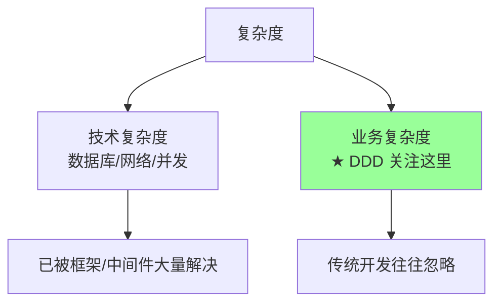

传统开发：
- 代码贴近"数据库表"
- 业务逻辑散落各处（Service / Util / Helper）
- 业务概念和代码概念脱节
- 业务变化时改动放射性大

DDD 主张：**让代码贴近业务**，让业务专家和开发者用同一种语言。

### 1.2 DDD 的两大支柱

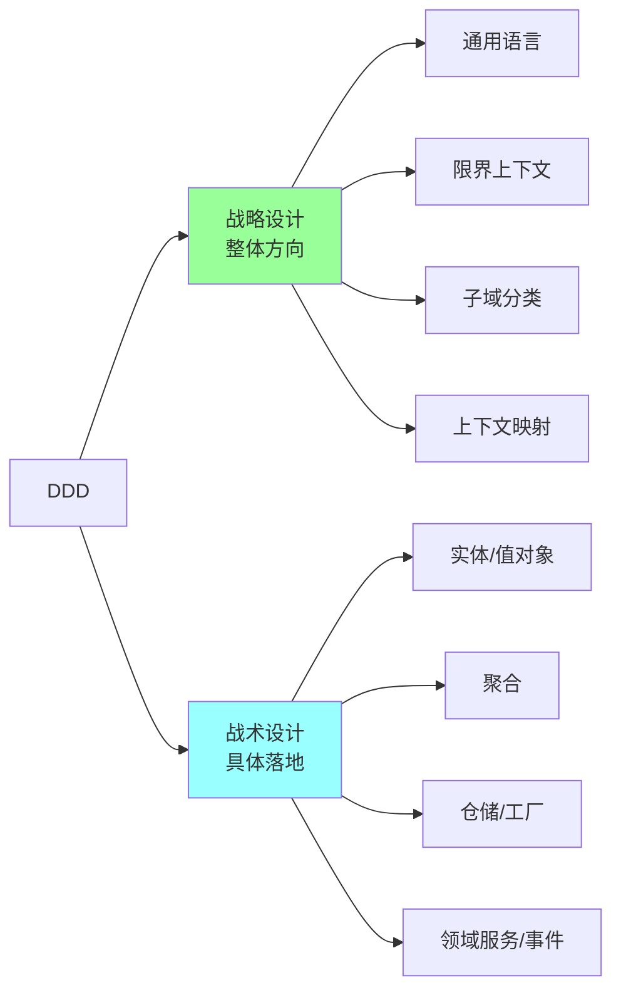

- **战略设计**：宏观，划分系统、定边界、定关系（本篇）
- **战术设计**：微观，每个上下文里怎么写代码（详见 [02-tactical-building-blocks.md](02-tactical-building-blocks.md)）

## 二、通用语言（Ubiquitous Language）

### 2.1 核心思想

> **业务专家、开发、产品、测试都用同一套术语**

不是技术术语翻译给业务，而是建立一套**领域内共识的语言**，代码、文档、对话都用它。

### 2.2 反例

业务说"客户下单"，代码里：

```go
// 业务概念 → 技术名词
type UserOrderRecord struct {  // 业务说"订单", 代码叫 record
    UID     int64    // 业务说"客户", 代码叫 UID
    GoodsID int64    // 业务说"商品", 代码叫 GoodsID
    Amount  int      // 业务说"金额", 代码叫 amount (单位还不清楚)
}

func (r *UserOrderRecord) UpdateStatus(s int) {  // 业务说"取消订单", 代码叫"更新状态"
    r.Status = s
}
```

业务说"取消订单"，开发说"把 status 改成 5"。**沟通成本爆炸**。

### 2.3 正例

```go
// 业务怎么说, 代码就怎么写
type Order struct {
    OrderID    OrderID
    Customer   CustomerID
    Items      []OrderItem
    Status     OrderStatus
}

func (o *Order) Cancel(reason CancelReason) error {
    if !o.Status.CanCancel() { return ErrCannotCancel }
    o.Status = StatusCancelled
    o.AddEvent(OrderCancelled{Reason: reason})
    return nil
}
```

业务说"取消订单"，代码就 `order.Cancel()`。**直观无歧义**。

### 2.4 实践

- 整理业务术语表（Glossary）
- 团队所有沟通用术语表里的词
- 代码命名严格对齐
- 文档、API、数据库字段也用相同术语

### 2.5 避免的坑

- **同词不同义**：不同上下文里"产品"含义不同（销售 vs 物流），要靠**限界上下文**隔离
- **代码缩写**：`ord` / `usr` 隐藏业务含义，**全拼优先**
- **技术术语污染**：`UserDTO` 这种命名暴露技术细节，业务侧应叫 `Customer` / `User`

## 三、限界上下文（Bounded Context）

### 3.1 概念

> **明确的边界，边界内通用语言一致；边界外可以不同**

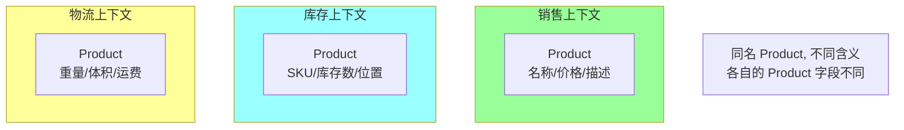

**核心**：
- 一个业务概念在不同上下文里**结构和职责可以完全不同**
- 上下文边界明确（包、模块、服务）
- 边界外通过**翻译**或**事件**通信

### 3.2 为什么需要边界

#### 反例：大一统模型

```go
// 一个 User 类含所有信息
type User struct {
    ID            int64
    Name          string
    Email         string
    Address       Address       // 物流要
    PaymentInfo   Payment       // 支付要
    Preferences   Preferences   // 推荐要
    LoginHistory  []Login       // 安全要
    OrderCount    int           // 营销要
    // ... 100+ 字段
}
```

问题：
- 上帝类，谁都能改
- 不同模块的需求挤在一起
- 一个字段变更影响所有模块

#### 正例：边界内独立

```go
// auth context
type User struct { ID, Email, Password }

// profile context
type Profile struct { UserID, Name, Avatar, Preferences }

// order context (Customer 是订单视角)
type Customer struct { ID, ShippingAddress }

// recommend context
type CustomerProfile struct { UserID, Tags, History }
```

各自演化，互不打扰。

### 3.3 上下文与微服务

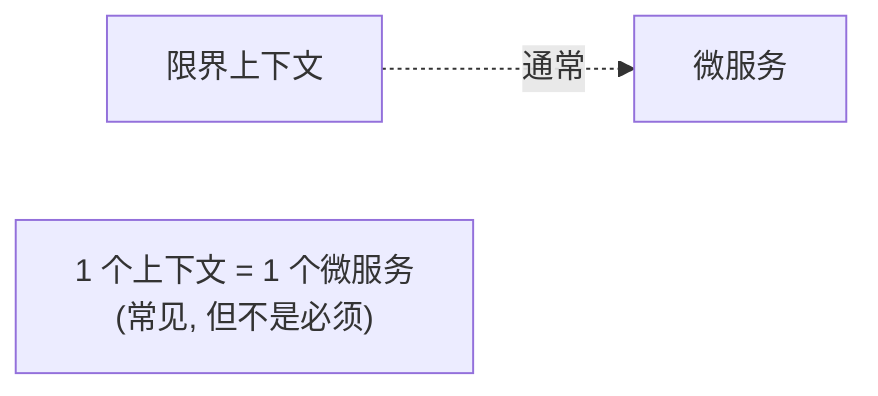

**关系**：
- **理想**：一个上下文 = 一个微服务（边界清晰）
- **实际**：一个微服务可包含多个紧密相关的上下文
- **反模式**：一个上下文拆成多个微服务（边界破碎）

DDD 不强制微服务，但微服务**很需要 DDD** 来划分边界。

### 3.4 边界划分依据

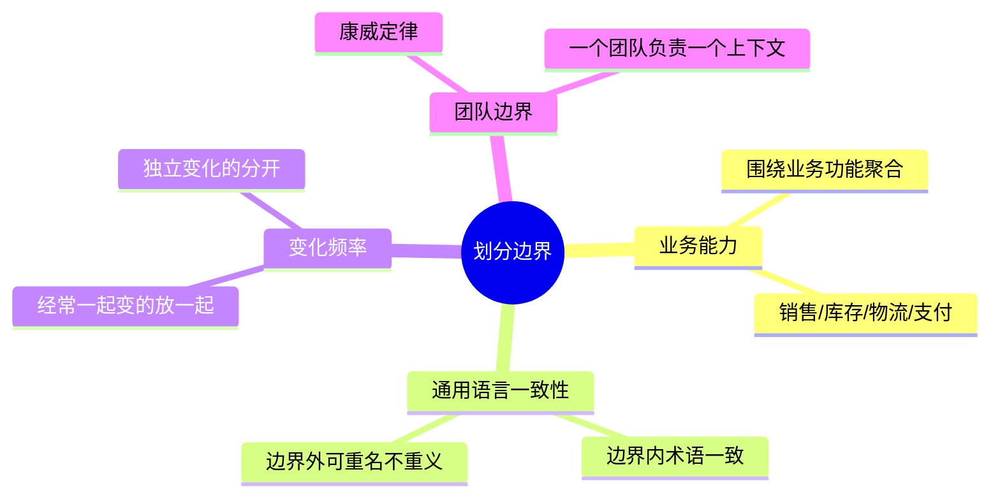

## 四、子域分类

### 4.1 三种子域

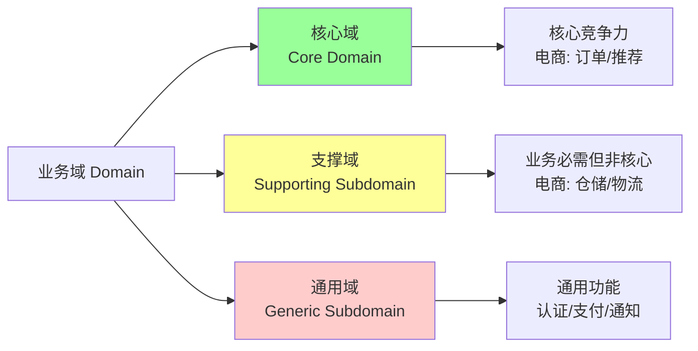

### 4.2 投资策略

| 子域 | 策略 | 资源投入 |
| --- | --- | --- |
| **核心域** | 自研 + DDD 充血模型 + 资深团队 | 最多 |
| **支撑域** | 自研但简化 + 偏 CRUD | 中 |
| **通用域** | 买现成（开源/SaaS） | 最少 |

### 4.3 例子：电商

| 子域 | 类型 | 说明 |
| --- | --- | --- |
| 商品管理 | 支撑域 | 业务需要但非竞争力 |
| 订单处理 | **核心域** | 业务核心，状态机复杂 |
| 推荐系统 | **核心域** | 算法是竞争力 |
| 库存管理 | 支撑域 | 业务必需但通用 |
| 支付 | 通用域 | 接第三方（支付宝/微信） |
| 短信通知 | 通用域 | 接 SaaS |
| 用户认证 | 通用域 | 接 OAuth/IAM |
| 物流配送 | 支撑域 / 部分核心 | 看业务 |

### 4.4 识别核心域

问题：**这个能力是公司赚钱的核心吗？竞品做得不好我们能因此胜出吗？**

是 → 核心域 → 用最好的人 + DDD 充血 + 持续投入。
否 → 不是核心 → 简化 / 外购 / 通用方案。

## 五、上下文映射（Context Mapping）

### 5.1 9 种关系模式

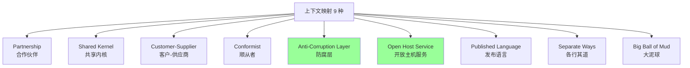

### 5.2 重点模式

#### Partnership（合作伙伴）

两个上下文**互相依赖**，必须协同发布。强耦合，慎用。

#### Shared Kernel（共享内核）

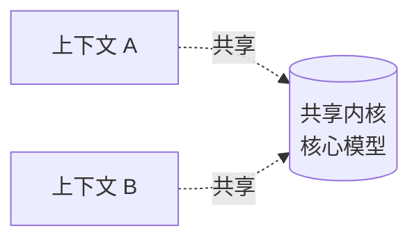

两个上下文共享一小部分领域模型（如基础类型 `Money` / `Address`）。

**优点**：避免重复
**缺点**：耦合，修改要协调

#### Customer-Supplier（客户-供应商）

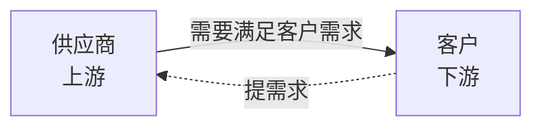

上游对下游负责，下游提需求上游配合实现。

#### Conformist（顺从者）

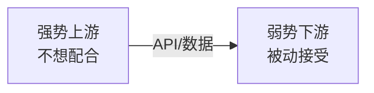

下游无法影响上游，被迫"顺从"上游模型（如对接第三方支付）。

#### **防腐层（Anti-Corruption Layer, ACL）★ 重要**

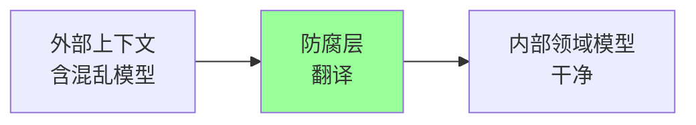

**核心**：在边界放一层翻译器，把外部模型转成内部模型，保护内部不被污染。

**典型场景**：
- 对接遗留系统
- 对接第三方（支付/物流）
- 微服务间集成

```go
// 外部 SDK 给的是 Alipay.OrderResp (字段乱七八糟)
type AlipayACL struct {
    sdk *alipay.Client
}

func (a *AlipayACL) QueryPayment(orderID string) (*PaymentStatus, error) {
    resp, err := a.sdk.QueryOrder(context.Background(), &alipay.QueryReq{
        OutTradeNo: orderID,
    })
    if err != nil { return nil, err }

    // 翻译成内部模型
    return &PaymentStatus{
        Status: a.translateStatus(resp.TradeStatus),
        Amount: Money{Cents: resp.AmountCents},
    }, nil
}
```

业务代码用 `PaymentStatus`，**不感知 Alipay SDK**。

#### Open Host Service（OHS）+ Published Language（PL）

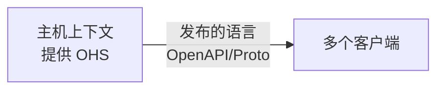

主机用**标准化协议**（REST + OpenAPI / gRPC + Proto）暴露服务，多个客户端按相同协议接入。

例：开放平台 API。

#### Separate Ways（各行其道）

两个上下文**完全独立**，没必要集成。

#### Big Ball of Mud（大泥球）

边界混乱、模型纠缠的反模式。隔离用 ACL。

### 5.3 上下文映射图

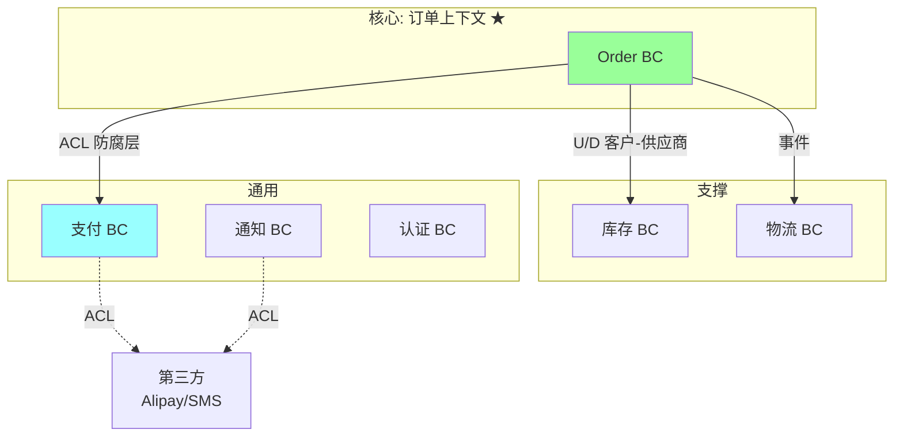

## 六、战略设计实战流程

### 6.1 事件风暴（Event Storming）

业内推荐方法：

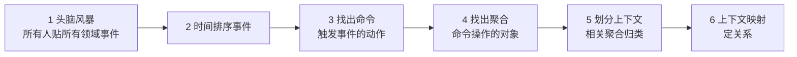

**核心理念**：业务专家 + 开发 + 产品**一起在墙上贴便签**。

### 6.2 简化流程（中小项目）

```
1. 列出业务用例 (用户故事)
2. 找出关键名词 (实体候选) + 动词 (命令)
3. 按业务能力分组 → 候选上下文
4. 标记: 哪些是核心, 哪些是支撑/通用
5. 画上下文映射图
6. 每个上下文做战术设计
```

### 6.3 实战例子：电商

```
事件:
- 商品上架 / 下架
- 用户注册 / 登录
- 加入购物车
- 创建订单
- 支付完成
- 库存扣减
- 物流发货
- 收货确认
- 退货退款

按业务能力归类:
- 商品域: 上架/下架
- 用户域: 注册/登录
- 订单域: 购物车 → 订单 → 支付 → 完成 (★ 核心)
- 库存域: 扣减
- 物流域: 发货/送达
- 售后域: 退货退款

上下文映射:
- 订单 → 库存: 扣减 (Customer-Supplier 或事件)
- 订单 → 支付: ACL 防腐 (对接第三方)
- 订单 → 物流: 事件触发
- 订单 → 通知: 事件
```

## 七、典型坑

### 坑 1：把模型当成 ER 图

```
[误区] 用户表 → 订单表 → 商品表 → 这就是模型
[正确] 模型是业务行为 + 数据 + 规则的整体, 不只是数据
```

### 坑 2：边界太大

整个系统一个上下文 → 退化成传统开发，DDD 没价值。

**修复**：按业务能力 + 团队拆分。一般 3~10 个上下文。

### 坑 3：边界太小

把每个实体当一个上下文 → 沟通成本爆炸。

**修复**：相关聚合归到同一上下文。

### 坑 4：上下文边界模糊

```
"订单"上下文里塞了用户、库存、支付的逻辑 → 边界没意义
```

**修复**：严格遵守边界，跨边界用 ACL 或事件。

### 坑 5：通用语言只是口号

文档里写一套，代码里另一套。

**修复**：代码命名 / API / 数据库字段都用术语表的词。

### 坑 6：忽略子域分类

所有子域投入相同资源 → 核心域被支撑域拖累。

**修复**：识别核心域，集中资源。通用域用现成方案。

### 坑 7：DDD 用错地方

简单 CRUD 系统用 DDD → 过度设计，开发慢。

**修复**：业务复杂的核心域才用 DDD，简单业务直接 CRUD。

## 八、高频面试题

**Q1：DDD 解决什么问题？**

让代码贴近业务，让业务专家和开发用**通用语言**沟通，应对**复杂业务领域**。

不解决技术复杂度（那是框架的事）。

**Q2：什么时候用 DDD？什么时候不用？**

**用**：
- 业务复杂（复杂规则、状态机、流程）
- 长期演化的核心域
- 多团队协作

**不用**：
- 简单 CRUD
- 数据迁移类工作
- 小工具
- 团队没人懂 DDD（学习成本高于收益）

**Q3：什么是限界上下文？怎么划分？**

**限界上下文**：明确边界，边界内通用语言一致；边界外可同名不同义。

**划分依据**：
- 业务能力（销售/库存/物流）
- 通用语言一致性
- 变化频率（经常一起变）
- 团队边界（康威定律）

**Q4：限界上下文 = 微服务吗？**

**不一定**。
- 理想：1 上下文 = 1 微服务
- 实际：1 微服务可包含多个紧密上下文
- 反模式：1 上下文拆多个微服务

DDD 不强制微服务，但微服务**很需要 DDD**。

**Q5：通用语言（Ubiquitous Language）是什么？**

业务专家、开发、产品、测试**用同一套术语**沟通。代码命名、API、文档、数据库字段都对齐。

避免业务和技术的翻译损耗。

**Q6：核心域 / 支撑域 / 通用域怎么区分？**

| | 核心域 | 支撑域 | 通用域 |
| --- | --- | --- | --- |
| 定义 | 业务竞争力 | 业务必需但非核心 | 通用功能 |
| 例子（电商）| 订单/推荐 | 库存/物流 | 支付/认证/通知 |
| 投入 | 最多 + DDD | 中 | 最少 + 外购 |

识别核心：**做得更好能让公司赢的能力**。

**Q7：上下文映射有哪些模式？**

9 种：Partnership / Shared Kernel / Customer-Supplier / Conformist / **ACL** / OHS / PL / Separate Ways / Big Ball of Mud。

**重点 ACL（防腐层）**：边界处放翻译器，把外部模型转内部模型，保护核心不被污染。

**Q8：防腐层（ACL）是什么？什么时候用？**

边界处的翻译层，外部模型 → 内部模型。

**场景**：
- 对接遗留系统
- 对接第三方（支付/物流）
- 微服务间集成时上游不可控

业务代码看到的永远是干净的内部模型。

**Q9：DDD 和 CQRS / 事件溯源什么关系？**

- DDD 是基础（建模 + 限界上下文 + 聚合）
- CQRS 是 DDD 实现可选项（读写分离）
- 事件溯源是 CQRS 实现可选项（事件作为唯一真源）

DDD 不要求用 CQRS / ES，但 CQRS / ES 几乎都基于 DDD。

详见 [05-cqrs-eventsourcing.md](05-cqrs-eventsourcing.md)。

**Q10：事件风暴（Event Storming）是什么？**

DDD 战略设计的实践方法：业务专家 + 开发 + 产品**一起在墙上贴便签**梳理领域事件，从事件推导命令、聚合、上下文。

是建立通用语言和找出限界上下文的高效方式。

## 九、面试加分点

- 强调 DDD 的核心是**让代码贴近业务**，不是某种技术
- 通用语言是 DDD 的灵魂（不只是术语表，是真的所有沟通都用）
- 限界上下文 ≠ 微服务（但相关）
- 核心域要 DDD，通用域不需要
- ACL 是 DDD 的"边界守门员"
- 事件风暴是高效的战略设计方法
- DDD 适合**业务复杂的核心域**，不适合简单 CRUD
- 康威定律：组织结构决定上下文边界
- DDD 学习曲线陡，团队要有共识才能用
- 战略 > 战术（战略错了战术再好也救不回来）
