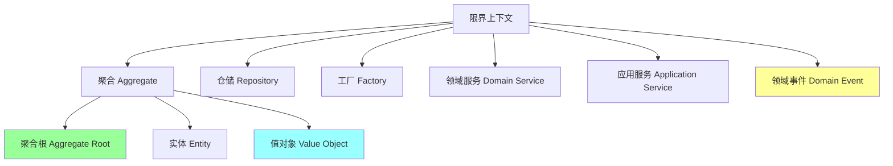
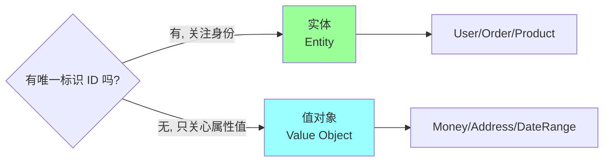
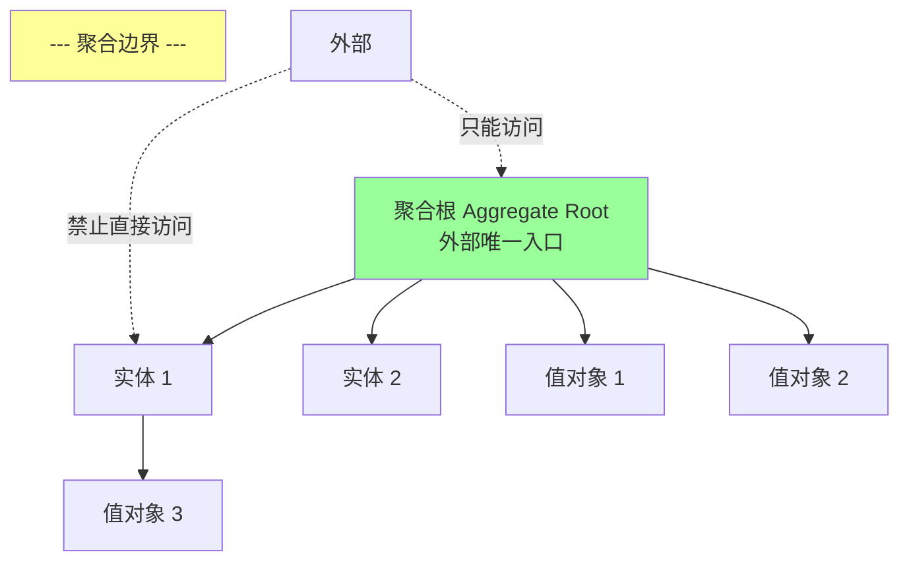
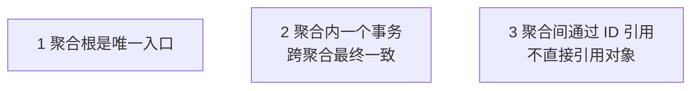
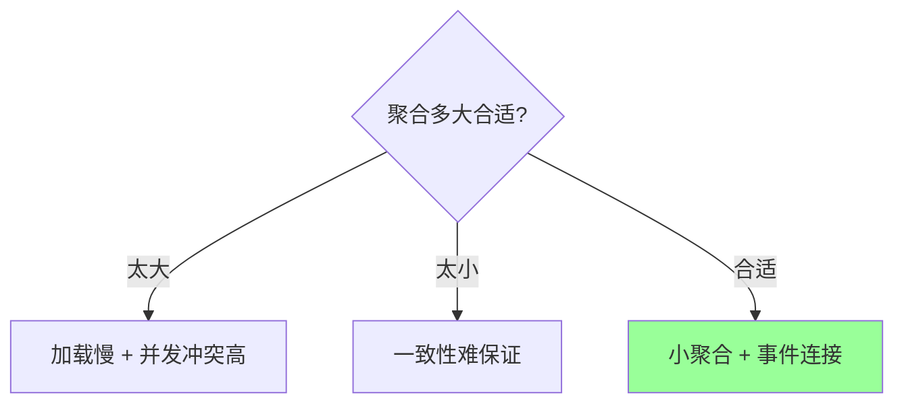
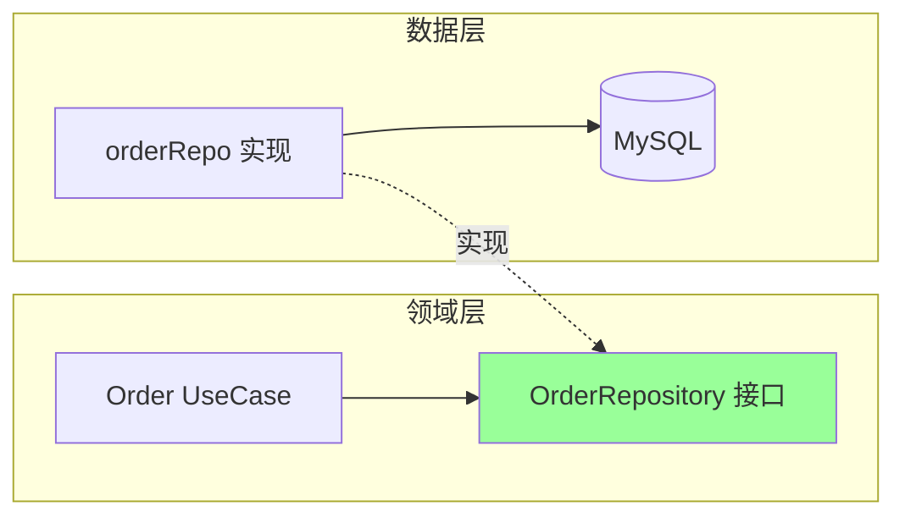
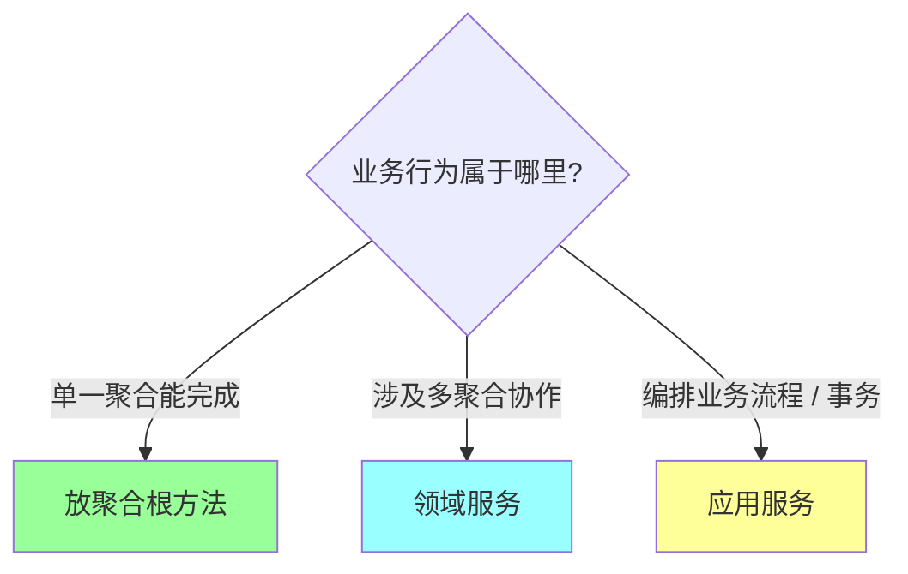
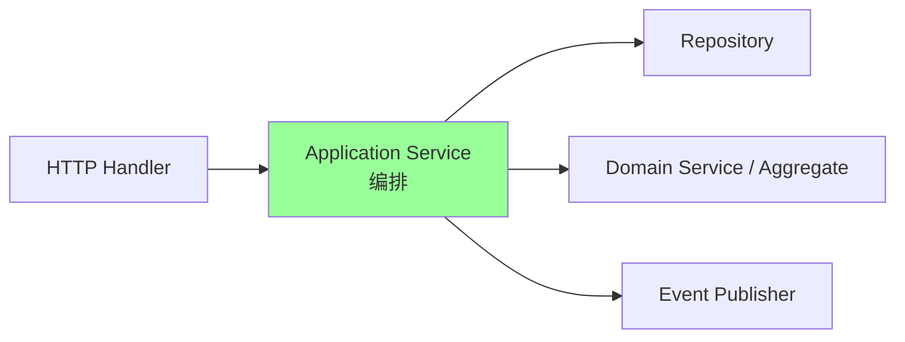
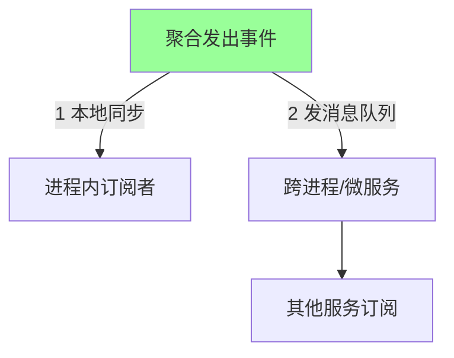
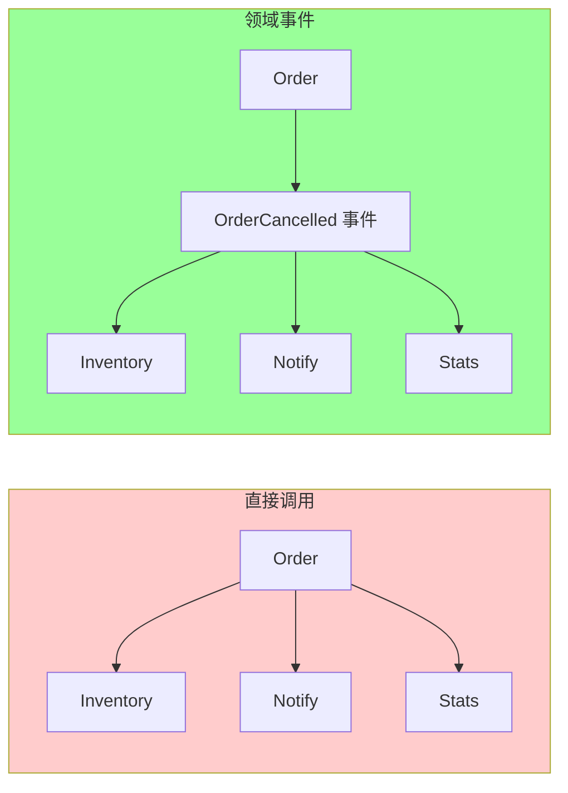

# DDD · 战术设计

> 战术构建块：实体 / 值对象 / 聚合 / 聚合根 / 仓储 / 工厂 / 领域服务 / 应用服务 / 领域事件 + Go 实战

## 一、战术构建块全景



## 二、实体（Entity）vs 值对象（Value Object）

### 2.1 区别



| 维度 | 实体 | 值对象 |
| --- | --- | --- |
| **身份** | 有唯一 ID | 无 ID，按值相等 |
| **可变** | 可变（状态演化） | **不可变**（改就新建） |
| **相等性** | ID 相等即相等 | 所有属性相等即相等 |
| **生命周期** | 有（创建→演化→销毁） | 无（值本身存在） |
| **例子** | User、Order、Product | Money、Address、DateRange |

### 2.2 实体示例

```go
type OrderID string

type Order struct {
    id       OrderID       // 唯一标识
    customer CustomerID
    items    []OrderItem
    status   OrderStatus
    total    Money
}

// 业务行为: 取消订单
func (o *Order) Cancel(reason string) error {
    if !o.status.CanCancel() {
        return ErrCannotCancel
    }
    o.status = StatusCancelled
    return nil
}

// 相等性: ID 相等
func (o *Order) Equals(other *Order) bool {
    return o != nil && other != nil && o.id == other.id
}
```

### 2.3 值对象示例

```go
// Money: 不可变值对象
type Money struct {
    Cents    int64
    Currency string
}

func NewMoney(cents int64, currency string) Money {
    return Money{Cents: cents, Currency: currency}
}

// 加法: 返回新 Money, 不改原值
func (m Money) Add(other Money) (Money, error) {
    if m.Currency != other.Currency {
        return Money{}, ErrCurrencyMismatch
    }
    return Money{Cents: m.Cents + other.Cents, Currency: m.Currency}, nil
}

// 相等性: 属性全等
func (m Money) Equals(other Money) bool {
    return m.Cents == other.Cents && m.Currency == other.Currency
}
```

### 2.4 值对象的好处

- **不可变**：天然线程安全，无副作用
- **自验证**：构造时验证，之后放心用
- **语义清晰**：`Money` 比 `int` 更有意义
- **行为封装**：加减乘除规则在 Money 里

```go
// 反模式
price := 100  // 多少? 元? 美分? 哪种货币?
discount := 20
total := price - discount  // 类型 int, 无单位检查

// DDD
price := NewMoney(10000, "CNY")
discount := NewMoney(2000, "CNY")
total, err := price.Subtract(discount)
```

### 2.5 典型值对象

- `Money(Cents, Currency)`
- `Address(Country, City, Street, Zipcode)`
- `DateRange(Start, End)`
- `Email(Value)` - 构造时校验格式
- `PhoneNumber(Country, Number)`
- `Coordinates(Lat, Lng)`

## 三、聚合（Aggregate）和聚合根（Aggregate Root）

### 3.1 概念



**核心规则**：
1. **聚合是一组相关对象的集合**，作为一致性单元
2. **聚合根是唯一入口**，外部只能通过聚合根访问聚合内部
3. **聚合内部强一致**，跨聚合最终一致
4. **事务边界 = 聚合边界**（一个事务只改一个聚合）

### 3.2 示例：订单聚合

```go
// 聚合根: Order
type Order struct {
    id       OrderID
    customer CustomerID
    items    []OrderItem        // 聚合内部实体
    address  ShippingAddress    // 值对象
    status   OrderStatus
}

// 聚合内实体 (小写, 不对外暴露)
type OrderItem struct {
    productID ProductID
    quantity  int
    unitPrice Money
}

// 外部只能通过聚合根操作
func (o *Order) AddItem(productID ProductID, quantity int, price Money) error {
    if o.status != StatusDraft {
        return ErrOrderLocked
    }
    // 聚合内一致性: 例如检查总量
    if o.totalQuantity()+quantity > MaxItems {
        return ErrTooManyItems
    }
    o.items = append(o.items, OrderItem{...})
    return nil
}

func (o *Order) RemoveItem(productID ProductID) error { ... }

// ❌ 禁止直接访问 items
// o.items[0].quantity = 10  // 错!
```

### 3.3 聚合的三条金科玉律



#### 规则 1：聚合根是唯一入口

```go
// ❌ 反模式: 直接改聚合内部
order.items[0].Quantity = 10

// ✓ 正确: 通过聚合根
order.UpdateItemQuantity(itemID, 10)
```

#### 规则 2：聚合内强一致，跨聚合最终一致

```go
// ❌ 反模式: 一个事务改两个聚合
db.Begin()
order.Confirm()
inventory.Reserve(orderItems)  // 另一个聚合
db.Commit()

// ✓ 正确: 一个事务一个聚合 + 事件
db.Begin()
order.Confirm()  // 只改 Order
order.AddEvent(OrderConfirmed{...})  // 发领域事件
db.Commit()

// 异步处理: 事件订阅者更新 Inventory
```

#### 规则 3：聚合间用 ID 引用

```go
// ❌ 反模式: 对象引用
type Order struct {
    Customer Customer  // 直接持有 Customer 对象
}

// ✓ 正确: ID 引用
type Order struct {
    CustomerID CustomerID
}

// 需要 Customer 详情时单独查
customer := customerRepo.Get(order.CustomerID)
```

**为什么**：
- 避免加载链膨胀（加载 Order 顺带把 Customer 整个加载）
- 明确聚合边界（哪些数据一起变）
- 减少事务冲突

### 3.4 聚合大小



**原则**：**尽量小**（Vernon 的建议）。

- 只把"必须强一致"的数据放一起
- 其他通过 ID 引用 / 领域事件

详见 03。

## 四、仓储（Repository）

### 4.1 概念

仓储**模拟一个内存集合**，隐藏持久化细节。

```go
type OrderRepository interface {
    Save(ctx context.Context, o *Order) error
    FindByID(ctx context.Context, id OrderID) (*Order, error)
    FindByCustomer(ctx context.Context, cid CustomerID) ([]*Order, error)
    Remove(ctx context.Context, id OrderID) error
}
```

**规则**：
- **按聚合根定义**（一个聚合根一个仓储）
- **业务语义方法**（不是 GetAll / FindByStatus1）
- **接口定义在领域层，实现在基础设施层**（依赖反转）

### 4.2 Repository vs DAO

| | Repository | DAO |
| --- | --- | --- |
| 抽象层级 | 领域层 | 数据层 |
| 对象 | 聚合 | 表 / 行 |
| 方法 | 业务语义 `FindActiveOrders` | 技术语义 `SelectByStatus` |
| 返回 | 聚合根 | DTO / Entity |
| 定义位置 | 领域层（接口） | 数据层 |

```go
// DAO (技术抽象)
type OrderDAO interface {
    SelectByID(id int64) (*OrderRow, error)
    SelectByStatusAndDate(status int, after time.Time) ([]*OrderRow, error)
    Update(row *OrderRow) error
}

// Repository (业务抽象)
type OrderRepository interface {
    FindByID(ctx context.Context, id OrderID) (*Order, error)
    FindActiveOrdersForCustomer(ctx context.Context, cid CustomerID) ([]*Order, error)
    Save(ctx context.Context, o *Order) error
}
```

Repository 可以**内部用 DAO 实现**，但对业务层暴露领域语义。

### 4.3 依赖反转



领域层**不依赖数据层**（接口定义在领域）。数据层实现接口。

```go
// internal/domain/order/repo.go (领域层)
package order

type OrderRepository interface {
    Save(ctx context.Context, o *Order) error
    FindByID(ctx context.Context, id OrderID) (*Order, error)
}

// internal/infrastructure/mysql/order_repo.go (基础设施层)
package mysql

type orderRepoImpl struct{ db *sql.DB }

func NewOrderRepository(db *sql.DB) order.OrderRepository {  // 实现领域接口
    return &orderRepoImpl{db: db}
}

func (r *orderRepoImpl) Save(ctx context.Context, o *order.Order) error {
    // 领域对象 → 表结构
    row := toRow(o)
    _, err := r.db.ExecContext(ctx, "INSERT ...", row...)
    return err
}
```

### 4.4 聚合持久化

```go
// Save 要持久化整个聚合 (聚合根 + 内部实体/VO)
func (r *orderRepoImpl) Save(ctx context.Context, o *Order) error {
    tx, _ := r.db.Begin()
    // 保存聚合根
    tx.Exec("INSERT orders ...", o.ID, o.Status, ...)
    // 保存聚合内实体
    for _, item := range o.Items() {
        tx.Exec("INSERT order_items ...", o.ID, item.ProductID, ...)
    }
    return tx.Commit()
}
```

## 五、工厂（Factory）

### 5.1 用途

封装复杂对象的创建逻辑：

```go
// 简单情况: 直接 new
order := NewOrder(id, customerID)

// 复杂情况: 工厂
order := orderFactory.CreateFromCart(customerID, cart, coupon)
```

工厂适合：
- **构造步骤多**（需要查多个数据源）
- **涉及聚合一致性**（创建时需要校验）
- **多态构造**（根据参数创建不同子类）

### 5.2 示例

```go
type OrderFactory struct {
    idGen        IDGenerator
    pricing      PricingService
    productRepo  ProductRepository
}

func (f *OrderFactory) CreateFromCart(
    ctx context.Context,
    customerID CustomerID,
    cart Cart,
    coupon *Coupon,
) (*Order, error) {
    // 生成 ID
    id := f.idGen.NextOrderID()

    // 查商品详情
    items := make([]OrderItem, 0, len(cart.Items))
    for _, ci := range cart.Items {
        product, err := f.productRepo.FindByID(ctx, ci.ProductID)
        if err != nil { return nil, err }
        items = append(items, OrderItem{
            ProductID: product.ID,
            Quantity:  ci.Quantity,
            UnitPrice: product.Price,
        })
    }

    // 算优惠
    total, discount := f.pricing.Calculate(items, coupon)

    return newOrder(id, customerID, items, total, discount), nil
}
```

### 5.3 工厂 vs 构造函数

- **构造函数**：简单、少字段、少逻辑
- **工厂**：复杂、需查数据、需校验、多态

不强制用工厂，简单场景**构造函数更直接**。

## 六、领域服务（Domain Service）

### 6.1 什么时候用

当某个业务逻辑**不属于任何单一聚合**时：



### 6.2 示例：转账

```
转账 A→B 涉及两个 Account 聚合
```

```go
// ❌ 放在 Account 里别扭
func (a *Account) TransferTo(other *Account, amount Money) error {
    // 一个聚合的方法改另一个聚合? 违反聚合边界
}

// ✓ 用领域服务
type TransferService struct{}

func (s *TransferService) Transfer(
    from *Account,
    to *Account,
    amount Money,
) error {
    if err := from.Withdraw(amount); err != nil { return err }
    if err := to.Deposit(amount); err != nil { return err }
    return nil
}
```

### 6.3 领域服务特点

- **无状态**（不保存数据）
- **接受领域对象参数**
- **返回领域对象 / 领域事件**
- **放在领域层**
- 名字是**动词或行为**（`TransferService` / `PricingCalculator`）

### 6.4 反模式：过度使用

```
[误区] 所有业务逻辑都塞领域服务 → 贫血模型 (领域对象只有数据)
[正确] 优先聚合根方法, 实在放不下才用领域服务
```

## 七、应用服务（Application Service）

### 7.1 作用

**编排领域对象完成用例**，不含业务逻辑：



### 7.2 示例

```go
type OrderAppService struct {
    orderRepo   OrderRepository
    productRepo ProductRepository
    eventPub    EventPublisher
}

func (s *OrderAppService) CreateOrder(
    ctx context.Context,
    cmd CreateOrderCommand,
) (OrderID, error) {
    // 1. 参数校验 (非业务规则)
    if err := cmd.Validate(); err != nil { return "", err }

    // 2. 加载聚合 / 外部数据
    products, err := s.productRepo.FindByIDs(ctx, cmd.ProductIDs())
    if err != nil { return "", err }

    // 3. 调用领域逻辑
    order, err := s.orderFactory.CreateFromCart(cmd.CustomerID, cmd.Items, products)
    if err != nil { return "", err }

    // 4. 持久化
    if err := s.orderRepo.Save(ctx, order); err != nil { return "", err }

    // 5. 发布领域事件
    for _, e := range order.ClearEvents() {
        s.eventPub.Publish(ctx, e)
    }

    return order.ID(), nil
}
```

### 7.3 应用服务 vs 领域服务

| | 应用服务 | 领域服务 |
| --- | --- | --- |
| 职责 | 编排 + 事务 | 跨聚合业务逻辑 |
| 内容 | 加载聚合、调用方法、保存、发事件 | 纯业务规则 |
| 跨层 | 调用领域层 + 基础设施 | 只在领域层 |
| 例 | `CreateOrder` | `TransferService.Transfer` |

**应用服务是薄的**（几行代码），**领域服务是业务逻辑**。

## 八、领域事件（Domain Event）

### 8.1 概念

**领域发生了某件值得关注的事**。不可变的事实。

```go
type OrderCreated struct {
    OrderID    OrderID
    CustomerID CustomerID
    Total      Money
    OccurredAt time.Time
}

type OrderCancelled struct {
    OrderID    OrderID
    Reason     string
    OccurredAt time.Time
}
```

命名：**过去式**（`OrderCreated` 不是 `CreateOrder`）。

### 8.2 发布事件

```go
type Order struct {
    // ...
    events []DomainEvent
}

func (o *Order) Cancel(reason string) error {
    if !o.status.CanCancel() { return ErrCannotCancel }
    o.status = StatusCancelled
    o.events = append(o.events, OrderCancelled{
        OrderID: o.id,
        Reason:  reason,
        OccurredAt: time.Now(),
    })
    return nil
}

func (o *Order) ClearEvents() []DomainEvent {
    events := o.events
    o.events = nil
    return events
}
```

### 8.3 订阅事件

```go
type OrderCancelledHandler struct {
    inventory InventoryService
    notify    NotificationService
}

func (h *OrderCancelledHandler) Handle(ctx context.Context, e OrderCancelled) error {
    // 恢复库存
    h.inventory.Restore(ctx, e.OrderID)
    // 通知用户
    h.notify.SendCancelEmail(ctx, e)
    return nil
}
```

### 8.4 领域事件的两种传递



#### 本地事件

```go
// 应用服务保存后立即发事件 (进程内, 同步或异步)
for _, e := range order.ClearEvents() {
    for _, handler := range localHandlers[e.Type()] {
        handler.Handle(ctx, e)
    }
}
```

#### 集成事件（跨服务）

```go
// 发 Kafka
for _, e := range order.ClearEvents() {
    kafka.Publish("order-events", e)
}
```

通常用**本地消息表 + Worker + MQ** 保证最终一致（详见 `06-distributed/03-transaction.md`）。

### 8.5 为什么用领域事件



- **解耦**：Order 不关心谁订阅
- **扩展性**：新增订阅者不改 Order 代码
- **异步友好**：订阅者可异步处理
- **审计**：事件流是审计日志

## 九、贫血模型 vs 充血模型

### 9.1 贫血模型（Anemic Model）

```go
// 只有数据, 没有行为
type Order struct {
    ID     int64
    Status int
    Total  int
}

// 行为在 Service 里
type OrderService struct{}

func (s *OrderService) CancelOrder(o *Order, reason string) error {
    if o.Status != StatusPending { return ErrCannotCancel }
    o.Status = StatusCancelled
    // ... 业务规则散落在 Service
}
```

**常见反模式**。Java Spring / Go 传统写法就是贫血。

### 9.2 充血模型（Rich Model）

```go
// 数据 + 行为 都在领域对象里
type Order struct {
    id     OrderID
    status OrderStatus
}

func (o *Order) Cancel(reason string) error {
    if !o.status.CanCancel() { return ErrCannotCancel }
    o.status = StatusCancelled
    return nil
}
```

**DDD 推崇充血模型**：业务规则在领域对象里，高内聚。

### 9.3 取舍

| | 贫血 | 充血 |
| --- | --- | --- |
| 业务复杂度 | 简单 | **复杂** |
| 代码位置 | Service 里 | 领域对象里 |
| 改动影响 | 多处 | 集中 |
| ORM 友好 | 高 | 中（要 mapping） |
| 学习曲线 | 低 | 高 |

**简单 CRUD 用贫血，复杂业务用充血**。

## 十、完整示例（订单聚合）

```go
// ========== 领域层 ==========

// internal/domain/order/types.go
type OrderID string
type CustomerID int64
type ProductID int64

// 值对象
type Money struct { Cents int64; Currency string }
func (m Money) Add(o Money) (Money, error) { /* ... */ }

// 值对象
type OrderStatus int
const (
    StatusDraft OrderStatus = iota
    StatusConfirmed
    StatusPaid
    StatusShipped
    StatusCancelled
)

func (s OrderStatus) CanCancel() bool {
    return s == StatusDraft || s == StatusConfirmed
}

// 聚合内实体
type OrderItem struct {
    productID ProductID
    quantity  int
    unitPrice Money
}

func (i OrderItem) Subtotal() Money {
    return Money{Cents: int64(i.quantity) * i.unitPrice.Cents, Currency: i.unitPrice.Currency}
}

// 聚合根
type Order struct {
    id         OrderID
    customerID CustomerID
    items      []OrderItem
    status     OrderStatus
    total      Money
    events     []DomainEvent
}

func NewOrder(id OrderID, customerID CustomerID) *Order {
    return &Order{
        id:         id,
        customerID: customerID,
        status:     StatusDraft,
    }
}

func (o *Order) AddItem(p ProductID, qty int, price Money) error {
    if o.status != StatusDraft { return ErrOrderLocked }
    o.items = append(o.items, OrderItem{productID: p, quantity: qty, unitPrice: price})
    o.recalculateTotal()
    return nil
}

func (o *Order) Confirm() error {
    if o.status != StatusDraft { return ErrInvalidStatus }
    if len(o.items) == 0 { return ErrEmptyOrder }
    o.status = StatusConfirmed
    o.events = append(o.events, OrderConfirmed{
        OrderID:    o.id,
        CustomerID: o.customerID,
        Total:      o.total,
        OccurredAt: time.Now(),
    })
    return nil
}

func (o *Order) Cancel(reason string) error {
    if !o.status.CanCancel() { return ErrCannotCancel }
    o.status = StatusCancelled
    o.events = append(o.events, OrderCancelled{
        OrderID:    o.id,
        Reason:     reason,
        OccurredAt: time.Now(),
    })
    return nil
}

func (o *Order) ID() OrderID { return o.id }
func (o *Order) Status() OrderStatus { return o.status }
func (o *Order) ClearEvents() []DomainEvent {
    e := o.events
    o.events = nil
    return e
}

func (o *Order) recalculateTotal() {
    total := Money{Currency: "CNY"}
    for _, item := range o.items {
        total, _ = total.Add(item.Subtotal())
    }
    o.total = total
}

// 仓储接口
type Repository interface {
    Save(ctx context.Context, o *Order) error
    FindByID(ctx context.Context, id OrderID) (*Order, error)
}

// 领域事件
type DomainEvent interface { EventName() string }

type OrderConfirmed struct {
    OrderID    OrderID
    CustomerID CustomerID
    Total      Money
    OccurredAt time.Time
}
func (OrderConfirmed) EventName() string { return "order.confirmed" }

type OrderCancelled struct {
    OrderID    OrderID
    Reason     string
    OccurredAt time.Time
}
func (OrderCancelled) EventName() string { return "order.cancelled" }

// ========== 应用层 ==========

// internal/application/order/service.go
type AppService struct {
    orderRepo order.Repository
    pub       EventPublisher
}

type CancelOrderCommand struct {
    OrderID OrderID
    Reason  string
}

func (s *AppService) CancelOrder(ctx context.Context, cmd CancelOrderCommand) error {
    // 加载
    o, err := s.orderRepo.FindByID(ctx, cmd.OrderID)
    if err != nil { return err }

    // 领域行为
    if err := o.Cancel(cmd.Reason); err != nil { return err }

    // 保存
    if err := s.orderRepo.Save(ctx, o); err != nil { return err }

    // 发事件 (理想: 本地消息表 + 异步)
    for _, e := range o.ClearEvents() {
        s.pub.Publish(ctx, e)
    }
    return nil
}

// ========== 基础设施层 ==========

// internal/infrastructure/mysql/order_repo.go
type OrderRepoImpl struct{ db *sql.DB }

func (r *OrderRepoImpl) FindByID(ctx context.Context, id order.OrderID) (*order.Order, error) {
    // 查 DB → 转成聚合根
    var row OrderRow
    // ...
    return toAggregate(row), nil
}
```

## 十一、典型坑

### 坑 1：贫血模型

行为在 Service，领域对象只有 getter/setter。

**修复**：业务规则放聚合内（充血）。

### 坑 2：聚合太大

一个聚合含几十个实体 → 加载慢 + 并发冲突 + 性能差。

**修复**：拆小聚合 + 事件协调。

### 坑 3：跨聚合强一致

```
一个事务改 Order 聚合 + Inventory 聚合
```

**修复**：一个事务一个聚合 + 领域事件 → 另一聚合异步处理（最终一致）。

### 坑 4：Repository 暴露技术细节

```go
// 错: 暴露 SQL / 分页技术细节
func FindOrders(status int, pageSize int, pageToken string, sortBy string)

// 对: 业务语义
func FindActiveOrdersForCustomer(customerID CustomerID)
```

### 坑 5：聚合间对象引用

```go
type Order struct {
    Customer *Customer   // 错, 加载链膨胀
}
```

**修复**：用 ID 引用。

### 坑 6：领域服务滥用

所有逻辑塞 Service → 贫血模型。

**修复**：优先聚合根方法，**实在放不下**才用领域服务。

### 坑 7：事件命名用动词

```
CreateOrder (命令)
OrderCreated (事件, 过去式)
```

事件是"已发生的事实"，**必过去式**。

### 坑 8：应用服务含业务逻辑

```go
func (s *AppService) CancelOrder(ctx, cmd) error {
    if order.Status != StatusPending { return err }   // 错: 业务规则跑应用层
    order.Status = StatusCancelled                     // 错: 应用层直接改
}
```

**修复**：业务规则放 `order.Cancel()`，应用层只编排。

## 十二、高频面试题

**Q1：实体和值对象怎么区分？**

- **实体**：有唯一 ID，按 ID 判相等，可变（Order / User）
- **值对象**：无 ID，按属性值判相等，不可变（Money / Address）

判定问：**这东西变了还是它自己吗？**
- "还是" → 实体（User 改名字还是那个 User）
- "不是" → 值对象（`Money(100)` 不等于 `Money(50)`）

**Q2：为什么值对象要不可变？**

- 天然线程安全
- 无副作用（函数式风格）
- 相等性清晰
- 共享安全（不用担心别人改）

例：`Money` 不可变，`m2 = m.Add(other)` 返回新值。

**Q3：什么是聚合和聚合根？**

**聚合**：一组相关对象组成的一致性单元。
**聚合根**：外部唯一入口。

规则：
1. 聚合根是唯一入口（外部不能绕过）
2. 一个事务一个聚合（跨聚合最终一致）
3. 聚合间用 ID 引用（不直接对象引用）

**Q4：聚合怎么划分？**

**尽量小**。问：**这些数据必须强一致吗？**
- 是 → 放一个聚合
- 否 → 拆聚合 + 事件连接

例：订单和订单项是一个聚合（订单项不能脱离订单），订单和客户是两个聚合（客户独立存在）。

**Q5：Repository 和 DAO 区别？**

| | Repository | DAO |
| --- | --- | --- |
| 层级 | 领域层 | 数据层 |
| 操作对象 | 聚合 | 表 |
| 方法语义 | 业务 | 技术 |
| 定义位置 | 领域层接口 | 数据层 |

Repository 定义在领域层（接口），实现在基础设施层（依赖反转）。

**Q6：领域服务和应用服务区别？**

- **领域服务**：跨聚合的业务逻辑（如转账 `TransferService`）
- **应用服务**：编排业务流程 + 事务 + 事件（如 `OrderAppService.CreateOrder`）

应用服务薄（几行代码），领域服务含业务规则。

**Q7：什么时候用领域事件？**

- **解耦**：Order 不想知道谁订阅
- **跨聚合**：用事件通知另一聚合更新（最终一致）
- **扩展性**：新增订阅方不改原代码
- **集成事件**：跨微服务通信

命名过去式（`OrderCreated` / `OrderCancelled`）。

**Q8：贫血模型 vs 充血模型？**

- **贫血**：领域对象只有数据（getter/setter），行为在 Service
- **充血**：数据 + 行为都在领域对象里

**DDD 推崇充血**：业务规则在领域对象内聚。

简单 CRUD 用贫血够了，复杂业务用充血。

**Q9：为什么聚合根是唯一入口？**

- **保护不变式**：聚合内规则在聚合根方法里统一保证
- **清晰边界**：外部只能通过聚合根修改
- **简化并发**：锁聚合根即锁整个聚合

```go
order.AddItem(...)    // ✓ 聚合根方法
order.items[0].X = Y  // ❌ 绕过聚合根
```

**Q10：聚合间怎么引用？**

**用 ID 引用，不用对象引用**：

```go
type Order struct {
    CustomerID CustomerID  // ✓
    // Customer *Customer   // ❌
}
```

需要 Customer 详情时：`customerRepo.Get(order.CustomerID)`。

**原因**：避免加载链膨胀，明确聚合边界。

**Q11：怎么判断需要领域事件？**

问：**发生了某件事后，别的地方要做什么？**

- 是 → 发事件
- 否 → 直接改

例：订单取消 → 恢复库存 / 通知用户 / 统计更新 → 发 `OrderCancelled` 事件，三个订阅者各自处理。

**Q12：跨聚合更新怎么做？**

**不要一个事务**。两种方案：

1. **领域事件**（异步）：改 A 聚合 → 发事件 → 订阅者改 B 聚合
2. **Saga**（分布式事务）：协调多个聚合，支持补偿

详见 03 / 05 / `06-distributed/03-transaction.md`。

## 十三、面试加分点

- **充血模型是 DDD 的核心**（不是贫血）
- 值对象**不可变**是关键特征
- 聚合根是**唯一入口**，保护聚合一致性
- **一个事务一个聚合**（跨聚合最终一致）
- 聚合间**用 ID 引用**，不直接对象引用
- **Repository 定义在领域层**（依赖反转），实现在基础设施
- Repository 方法是**业务语义**不是技术语义
- **应用服务薄，领域服务含业务规则**
- 领域事件命名**过去式**
- 简单 CRUD **不要硬上 DDD**（过度设计）
- DDD 适合**核心域**，支撑域可以简化
