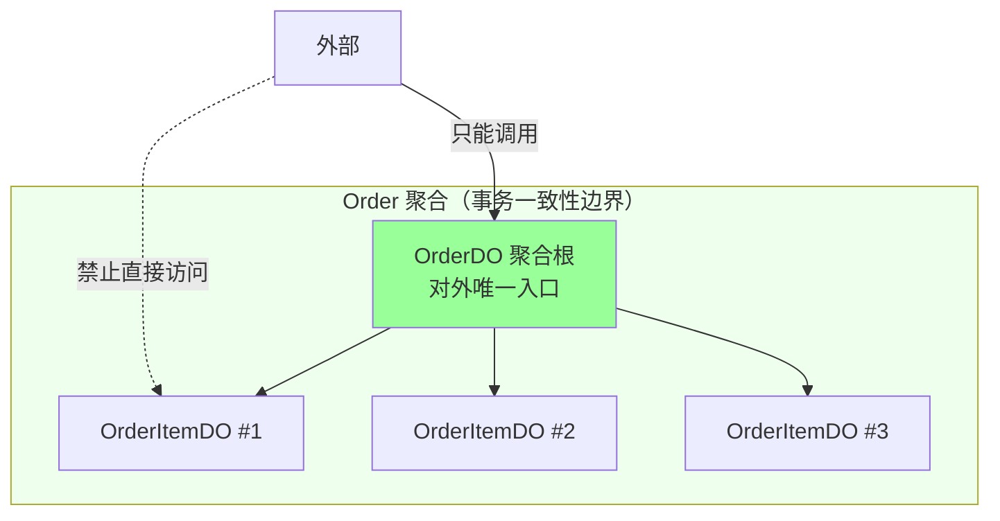
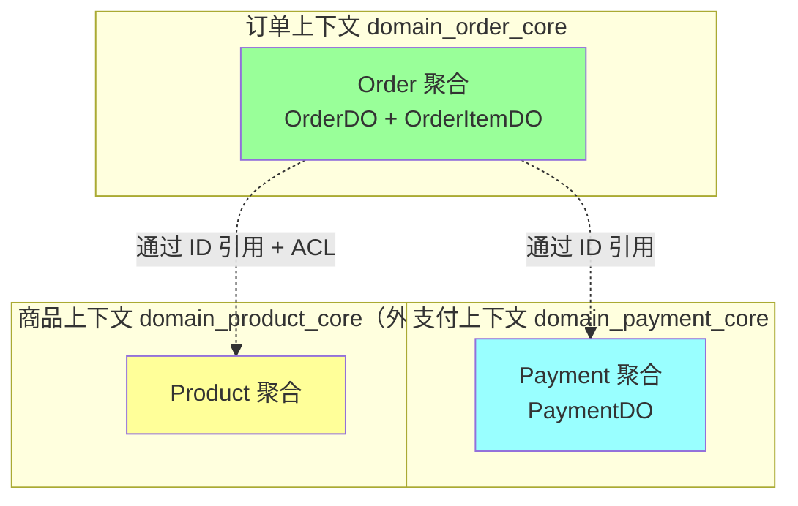
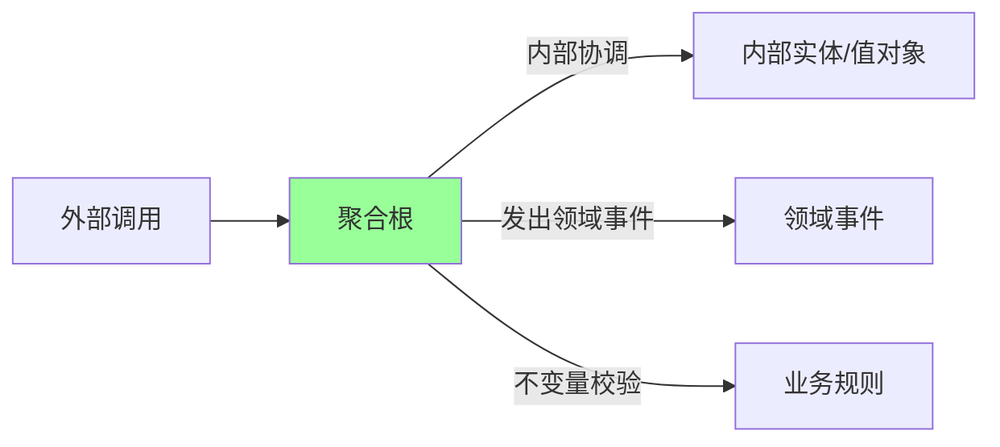
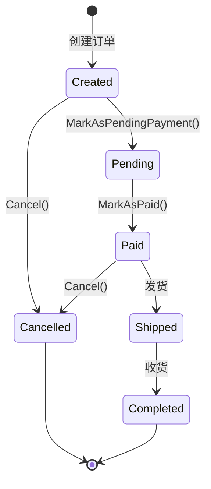
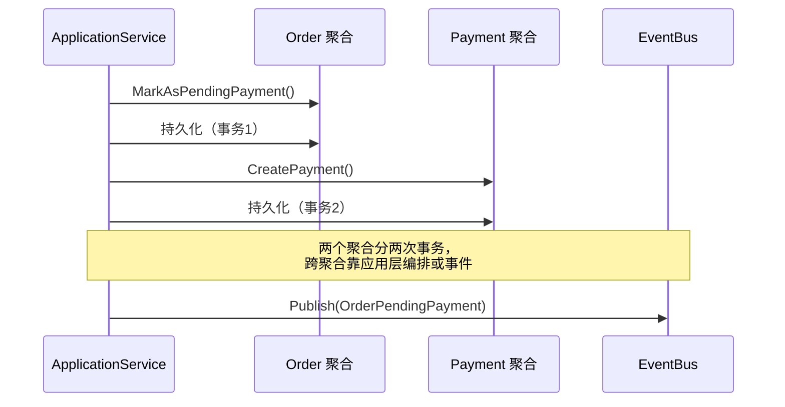
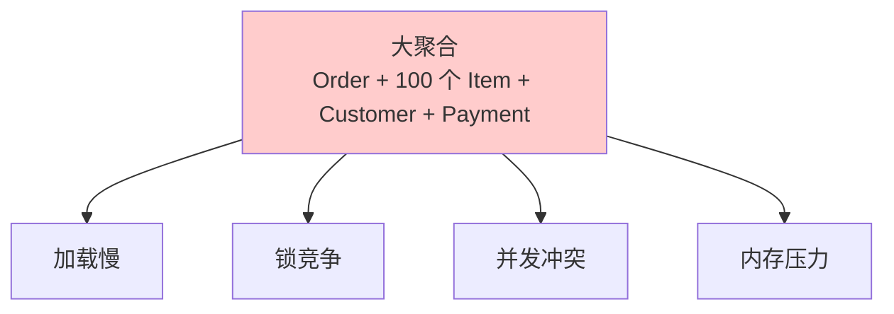
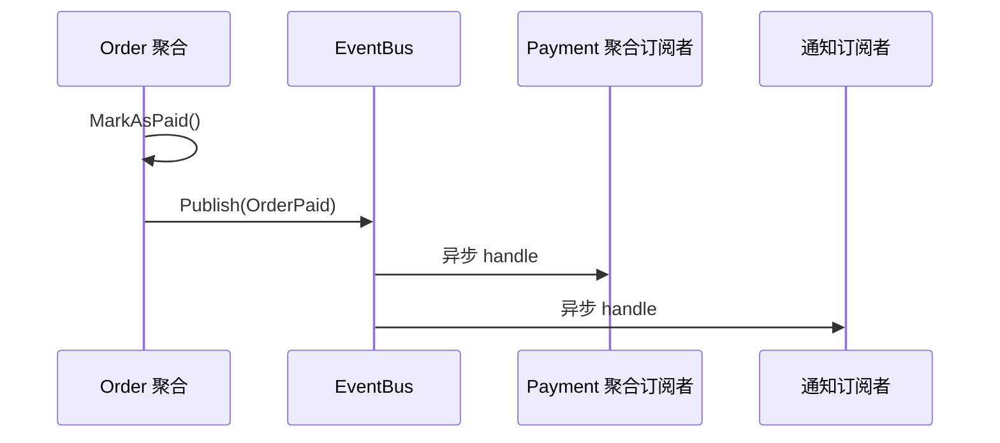

# DDD · 聚合设计

> 聚合边界 / 聚合根职责 / 一致性边界 / 引用方式 / 聚合大小 / 跨聚合更新 / 真实订单项目实战

> 本篇所有 Go 示例基于真实项目 `ddd_order_example`（洋葱架构 + GORM + 乐观锁 + 事件总线）

## 〇、核心提炼（5 段式）

### 核心机制（4 条必背）

1. **聚合 = 强一致边界** - 一组实体 + 值对象，**通过聚合根访问**，**整个聚合是一个事务边界**
2. **聚合根唯一入口** - 外部只能通过聚合根操作内部，**保证内部一致性**（业务不变量）
3. **跨聚合用 ID 引用** - 不直接持有对象引用，避免大对象图 + 解耦
4. **跨聚合用领域事件 + 最终一致** - 一个事务只改一个聚合，跨聚合通过事件异步更新

### 核心本质（必懂）

> 聚合的本质是 **"业务一致性的最小封闭单元"**：
>
> - **强一致边界**：聚合内的不变量（如订单总价 = SUM(订单项金额)）必须**实时**满足
> - **事务边界**：一个事务**只改一个聚合**，DB 锁的范围 = 聚合的范围
> - **物理边界**：聚合是 DB 拆分 / 微服务拆分的天然边界
>
> **关键约束**：
> - **小聚合优先**：一个聚合越大，事务越长，并发越差
> - **跨聚合不强一致**：要强一致就合并成一个聚合，否则用领域事件做最终一致
> - **聚合内一致 + 聚合间最终一致** = DDD 的核心一致性策略
>
> **CAP 视角**：
> - 聚合内 = CP（强一致）
> - 聚合间 = AP（最终一致 via 领域事件）

### 完整流程（面试必背）

```
聚合设计 4 步法:

1. 识别业务不变量:
   - 哪些规则必须"立即"满足？
   - 例: 订单总金额 = SUM(订单项金额) → 必须强一致
   - 例: 用户余额 ≥ 0 → 必须强一致
   - 例: 订单状态 = PAID 时支付金额 = 订单金额 → 必须强一致

2. 识别聚合边界:
   - 不变量涉及的实体 → 同一聚合
   - 不在不变量内的关联 → ID 引用即可
   - 例: 订单包含订单项 → 订单聚合（一致性必须）
   - 例: 订单关联用户 → 用户 ID 引用（不需要强一致）

3. 选聚合根:
   - 业务核心实体（外部最常引用的）
   - 例: Order 是聚合根，OrderItem 是内部实体
   - 外部不能直接 new OrderItem，必须 order.AddItem()

4. 设计写入 / 修改:
   - 一个事务 = 一个聚合的修改
   - 跨聚合 → 发领域事件 → 异步更新其他聚合
   - 例: 下单 → Order 聚合事务 → 发 OrderCreated 事件 → 库存聚合消费 → 扣库存

聚合内事务示例（Go）:

  func (o *Order) Pay(amount Money) error {
      // 不变量检查
      if amount != o.TotalAmount {
          return ErrAmountMismatch
      }
      if o.Status != Pending {
          return ErrInvalidStatus
      }

      // 聚合内修改
      o.Status = Paid
      o.PaidAt = time.Now()

      // 发领域事件（跨聚合通信）
      o.AddEvent(&OrderPaidEvent{OrderID: o.ID})
      return nil
  }

  // 仓储一次保存整个聚合 + 发布事件
  func (r *OrderRepo) Save(order *Order) error {
      tx := r.db.Begin()
      r.update(tx, order)         // 更新订单 + 订单项 一个事务
      r.publishEvents(order)      // 提交后异步发事件
      return tx.Commit()
  }
```

### 4 条核心机制 - 逐点讲透

#### 1. 聚合 = 强一致边界

```
什么是不变量:
  业务规则，必须"实时"满足
  例 1: 订单总价 = SUM(订单项金额)
  例 2: 库存数 ≥ 0
  例 3: 用户余额 = 流水累加

不变量决定边界:
  涉及多个实体的不变量 → 这些实体在同一聚合
  → 用同一事务保证
  → DB 锁同一行 / 同一范围

例: 订单聚合
  Order (聚合根)
  ├── OrderItem (实体)
  ├── ShippingAddress (值对象)
  └── PaymentInfo (值对象)

  不变量:
  - 总金额 = SUM(item.amount)
  - 状态机严格
  - 状态变更必须更新 PaymentInfo
```

#### 2. 聚合根唯一入口

```
原则:
  外部只能拿到聚合根（通过仓储）
  外部只能调用聚合根的方法
  内部实体 / 值对象不暴露给外部

错误（贫血模型）:
  service.UpdateOrderItem(orderID, itemID, ...)
  → 直接操作内部，绕过 Order 的不变量检查
  → 数据可能不一致

正确（充血模型）:
  order := repo.GetOrder(orderID)
  order.UpdateItem(itemID, ...)  // 聚合根方法
  repo.Save(order)
  → Order 内部检查不变量后才修改

收益:
  - 业务规则集中在聚合根
  - 不会被绕过
  - 测试简单（领域对象单元测试）
```

#### 3. 跨聚合用 ID 引用（不直接持有对象）

```
错误（聚合互相嵌套）:
  type Order struct {
      User *User       // 直接持有对象
      Items []*Item
  }
  → 加载 Order 时连 User 一起加载
  → 大对象图 / 性能差 / 修改 User 影响 Order

正确（ID 引用）:
  type Order struct {
      UserID UserID    // 只存 ID
      Items []*OrderItem
  }
  → 需要 User 信息时单独查
  → 聚合解耦 / 边界清晰

为什么:
  - 大对象图加载性能差
  - 微服务拆分时 ID 是天然边界
  - 强迫开发者思考"是否真的需要"
```

#### 4. 跨聚合用领域事件（最终一致）

```
场景: 下单 → 扣库存
  Order 聚合（订单创建）
  Stock 聚合（库存扣减）
  → 跨聚合，不能在同一事务

错误做法（一个事务两个聚合）:
  tx.Begin()
  orderRepo.Save(order)
  stockRepo.UpdateStock(item, -1)
  tx.Commit()
  → 违反 "一聚合一事务"
  → 跨服务时根本做不到

正确做法（领域事件）:
  // 1. Order 聚合事务
  tx1.Begin()
  orderRepo.Save(order)
  outbox.Save(OrderCreatedEvent{...})  // 同事务写 outbox
  tx1.Commit()

  // 2. 异步发事件
  worker 扫 outbox → 发 MQ → Stock 服务消费

  // 3. Stock 聚合事务
  tx2.Begin()
  stock.Reserve(itemID, qty)
  stockRepo.Save(stock)
  tx2.Commit()

  → 最终一致
  → 业务幂等兜底（订单号 + DB 唯一索引）
```

### 一句话总结

> 聚合设计的核心是：**强一致边界 + 聚合根唯一入口 + ID 引用 + 领域事件最终一致**，
> 本质是**业务不变量的最小封闭单元**：聚合内一个事务保证强一致（CP），聚合间用领域事件做最终一致（AP）。
> **设计原则**：小聚合优先（事务短并发好）+ 一聚合一事务 + 跨聚合 ID 引用 + 跨聚合事件驱动。
> 聚合是 **DB 拆分 / 微服务拆分**的天然边界。

---

## 一、聚合是什么

### 1.1 一句话定义

> **聚合（Aggregate）= 一组绑在一起、必须整体一致的领域对象，通过聚合根对外暴露**



**三大铁律**：
1. **外部只能引用聚合根**，不能直接持有内部对象引用
2. **聚合内强一致性**（同一事务），聚合间最终一致性（事件/补偿）
3. **一个事务只修改一个聚合**（铁律，违反就是设计有问题）

### 1.2 为什么需要聚合

没有聚合 → 满世界改对象 → 业务规则散落 → 数据不一致

```go
// 反例：外部直接改订单项
order := repo.FindByID(id)
order.Items[0].Quantity = 100   // 改了数量
// 但是没改 Subtotal、TotalAmount！数据不一致
```

```go
// 正例：通过聚合根暴露行为，根维护一致性
order := repo.FindByID(id)
order.UpdateItemQuantity(itemID, 100)  // 内部同时刷新 Subtotal/TotalAmount
```

## 二、识别聚合边界

### 2.1 三步法


**关键问题**：
- 这两个对象**必须同时变更**才能保证业务规则吗？是 → 同一聚合
- 一个变更另一个**可以稍后**（秒级/分钟级）？是 → 不同聚合，用事件
- 这个对象**有独立生命周期**吗？是 → 独立聚合

### 2.2 真实例子：订单系统的聚合划分

`ddd_order_example` 项目划分了 3 个聚合，分布在 3 个限界上下文：



**为什么 OrderItem 和 Order 是同一聚合？**
- 订单总金额 = 各项小计之和（强一致约束）
- 改任意 Item 必须同时改 TotalAmount
- Item 没有独立的生命周期（订单删了，项也没了）

**为什么 Payment 是独立聚合？**
- 一笔订单可以有**多次支付**（部分付/重新付）
- 支付状态机有 13 种状态，独立演化
- 订单已支付完成后，支付单仍要被对账系统查询（独立生命周期）

**为什么 Product 在另一个上下文？**
- 商品是独立业务能力（上架/下架/定价）
- 通过 **Anti-Corruption Layer 防腐层** 调用第三方商品 API（见 `infrastructure/external/product_api`）

## 三、聚合根的职责

### 3.1 聚合根 = 一致性守门员



聚合根负责四件事：
1. **状态变更入口**：所有修改必须经过它
2. **不变量校验**：变更前后保证业务规则成立
3. **生命周期管理**：内部对象的创建/删除
4. **发布领域事件**：状态变化通知外部

### 3.2 真实代码：OrderDO 作为聚合根

```go
// internal/domain/domain_order_core/entity.go
type OrderDO struct {
    ID          string
    CustomerID  string
    Items       []OrderItemDO        // 内部实体
    Status      OrderStatus
    TotalAmount int64
    CreatedAt   time.Time
    UpdatedAt   time.Time
    Version     optimisticlock.Version  // 乐观锁版本号
}

// 行为 1：不变量校验（聚合根负责保证整个聚合的一致性）
func (o *OrderDO) Validate() error {
    if o.CustomerID == "" {
        return errors.New("客户ID不能为空")
    }
    if len(o.Items) == 0 {
        return errors.New("订单商品不能为空")
    }

    var calculatedTotal int64
    for _, item := range o.Items {
        if item.Quantity <= 0 { return errors.New("商品数量必须大于0") }
        if item.UnitPrice < 0 { return errors.New("商品单价不能为负数") }
        calculatedTotal += item.Subtotal
    }
    // 关键：跨内部对象的不变量
    if o.TotalAmount != calculatedTotal {
        return errors.New("订单总金额与商品小计之和不匹配")
    }
    return nil
}

// 行为 2：状态机迁移（聚合根独占）
func (o *OrderDO) Cancel() error {
    if !o.CanBeCancelled() {
        return errors.New("当前订单状态不允许取消")
    }
    o.Status = OrderStatusCancelled
    o.UpdatedAt = time.Now()
    return nil
}

func (o *OrderDO) MarkAsPendingPayment() error {
    if o.Status != OrderStatusCreated {
        return errors.New("只有已创建的订单可以标记为待支付")
    }
    o.Status = OrderStatusPending
    o.UpdatedAt = time.Now()
    return nil
}

func (o *OrderDO) MarkAsPaid() error {
    if o.Status != OrderStatusPending {
        return errors.New("只有待支付的订单可以标记为已支付")
    }
    o.Status = OrderStatusPaid
    o.UpdatedAt = time.Now()
    return nil
}
```

### 3.3 状态机图



每一次状态迁移都是聚合根上的一个**行为方法**，把校验、状态变更、时间戳更新封装在一起，外部无法跳过。

## 四、一致性边界

### 4.1 聚合内：强一致（事务）

聚合内多个对象的变更必须在**同一个数据库事务**里完成。

`ddd_order_example` 的订单仓储实现典型示范：

```go
// internal/infrastructure/repository/order_repository.go
func (r *OrderRepositoryMySQL) Save(ctx context.Context, o *OrderDO) error {
    tx := r.db.Begin().WithContext(ctx)
    defer tx.Rollback()

    // 1. 保存订单主表（聚合根）
    if err := tx.Table("t_order").Save(o).Error; err != nil {
        return err
    }

    // 2. 删除原有订单项
    if err := tx.Table("t_order_items").
        Where("order_id = ?", o.ID).
        Delete(&OrderItemDO{}).Error; err != nil {
        return err
    }

    // 3. 批量插入新订单项
    items := make([]OrderItemDO, len(o.Items))
    for i, item := range o.Items {
        items[i] = OrderItemDO{
            OrderID:   o.ID,
            ProductID: item.ProductID,
            Quantity:  item.Quantity,
            UnitPrice: item.UnitPrice,
            Subtotal:  item.Subtotal,
        }
    }
    if err := tx.Table("t_order_items").Create(&items).Error; err != nil {
        return err
    }

    return tx.Commit().Error
}
```

**核心模式**：
- **整聚合保存**：聚合根 + 所有内部实体一次事务
- **先删后插**：订单项采用"清空再写入"策略，避免逐条 diff（业界常见做法）
- **Repository 是聚合粒度**：`OrderRepository.Save` 接收整个 `OrderDO`，不暴露 `SaveOrderItem` 这种破坏聚合边界的接口

### 4.2 聚合间：最终一致（事件 / 补偿）



`ddd_order_example` 的 `OrderService.PayOrder` 就是典型的**跨聚合编排**：

```go
// internal/application/service/order_service.go
func (s *OrderService) PayOrder(ctx context.Context, orderID string) error {
    // 1. 修改 Order 聚合
    orderDO, err := s.orderDomainService.GetOrderByID(ctx, orderID)
    if err != nil { return err }

    if orderDO.Status != OrderStatusCreated {
        return fmt.Errorf("订单状态异常: %s", GetOrderStatusDetail(orderDO.Status))
    }

    // 2. 查询/创建 Payment 聚合（独立事务）
    existingPayment, err := s.paymentService.GetPaymentByOrderID(ctx, orderDO.ID)
    if err != nil && !errors.Is(err, ErrPaymentNotFound) {
        return err
    }

    var paymentID string
    if existingPayment != nil {
        switch existingPayment.Status {
        case PaymentStatusPaid:
            return errors.New("订单已支付")
        case PaymentStatusPending, PaymentStatusCreated:
            paymentID = existingPayment.ID
        }
    } else {
        paymentID, err = s.paymentService.CreatePayment(ctx, orderDO.ID, orderDO.TotalAmount, "CNY", 1)
        if err != nil { return err }
    }

    // 3. 修改 Order 聚合状态（独立事务）
    if err := orderDO.MarkAsPendingPayment(); err != nil { return err }
    if err := s.orderDomainService.UpdateOrder(ctx, orderDO); err != nil { return err }

    return nil
}
```

**这里要注意的设计权衡**：
- 这段代码触及 2 个聚合 + 多次 DB 操作，**严格 DDD 要求事件驱动**
- 真实项目里常用**应用服务编排**简化（事务1：建支付单 → 事务2：改订单），失败靠业务补偿（人工/定时任务）
- 大流量下应改为：**Order 状态机变更后发出领域事件，Payment 上下文订阅创建支付单**（见 `internal/shared/event/bus.go`）

### 4.3 一个事务只改一个聚合（铁律）

违反这个原则的征兆：
- Repository 接口里出现跨聚合操作（`SaveOrderAndPayment`）
- 一个 Service 方法里多个聚合的 Save 调用同事务
- 事务跨越多个 BC

```go
// 反例
func (s *Service) PayOrder(ctx, id) error {
    tx := db.Begin()
    order.MarkAsPaid()
    tx.Save(order)
    payment := NewPayment(order.ID)
    tx.Save(payment)  // ❌ 同事务改两个聚合
    tx.Commit()
}
```

```go
// 正例
func (s *Service) PayOrder(ctx, id) error {
    // 事务1
    s.paymentService.CreatePayment(ctx, ...)
    // 事务2
    order.MarkAsPendingPayment()
    s.orderRepo.Save(ctx, order)
    // 事件最终一致
    s.bus.Publish(OrderPendingPayment{OrderID: id})
}
```

## 五、聚合间的引用：用 ID 不用对象

### 5.1 反模式：对象引用

```go
// ❌ 反例：聚合内持有另一个聚合的对象引用
type OrderDO struct {
    ID       string
    Customer *CustomerDO  // 直接持有 Customer 聚合
    Payment  *PaymentDO   // 直接持有 Payment 聚合
}
```

问题：
- 加载 Order 自动加载 Customer、Payment → 性能爆炸
- 一致性边界模糊，可能误改其他聚合
- ORM 映射变复杂（一对一/多对多）

### 5.2 正模式：ID 引用

```go
// ✅ 正例（ddd_order_example 实际写法）
type OrderDO struct {
    ID         string
    CustomerID string   // 仅持有 ID
    Items      []OrderItemDO  // 内部对象保留
}

type PaymentDO struct {
    ID      string
    OrderID string   // 仅持有 ID
    Amount  int64
}
```

需要 Customer 详情时：
```go
// 应用服务负责跨聚合协作
order := orderRepo.FindByID(ctx, orderID)
customer := customerRepo.FindByID(ctx, order.CustomerID)
```

### 5.3 跨上下文引用：通过防腐层

`ddd_order_example` 中订单创建时校验商品，并不直接依赖 `Product` 实体，而是通过 **ProductService 接口 + 防腐层适配**：

```go
// 应用服务层
req := &domain_product_core.ValidateProductRequest{
    ProductID: items[0].ProductID,
    Price:     items[0].UnitPrice,
    Quantity:  items[0].Quantity,
}
resp, err := s.productService.ValidateProduct(ctx, req)
// 内部模型 → 接口 DTO，跨上下文不直接共享实体
```

实现层用第三方 API：
```go
// internal/infrastructure/external/product_api
type ProductServiceAdapter struct {
    client *ThirdPartyProductAPI
}

func (a *ProductServiceAdapter) ValidateProduct(ctx, req) (*Resp, error) {
    // 调用外部 SDK，把外部模型翻译成内部 ValidateProductResponse
}
```

## 六、聚合大小：能小就小

### 6.1 大聚合的痛



### 6.2 设计原则：小聚合 + ID 引用

| 原则 | 说明 |
| --- | --- |
| **优先小聚合** | 默认从单实体开始，确认有强一致约束才扩大 |
| **不变量是边界依据** | 聚合内必须维持的规则才放进来 |
| **避免集合无界增长** | `Items []OrderItem` 控制在百级以内，否则拆 |
| **跨聚合用 ID + 事件** | 不用对象引用 |

### 6.3 实战衡量

`OrderDO` 包含 `[]OrderItemDO` 是合理的：
- 订单项数量通常 < 50
- 业务上"订单总金额 = 项小计之和"是强一致约束
- 项的生命周期完全依附订单

如果业务变成"购物车型订单"（千级商品），就要拆：把 `OrderItem` 独立成聚合，订单只持有 itemID 列表。

## 七、并发控制：乐观锁

### 7.1 为什么需要

聚合是事务边界，多用户并发修改同一聚合会冲突。

### 7.2 真实项目用乐观锁

```go
// internal/domain/domain_order_core/entity.go
import "gorm.io/plugin/optimisticlock"

type OrderDO struct {
    // ...
    Version optimisticlock.Version `gorm:"column:version;optimistic_lock"`
}
```

```go
// internal/application/service/order_service.go
func (s *OrderService) UpdateOrder(ctx context.Context, orderDO *OrderDO) error {
    if err := s.orderDomainService.UpdateOrder(ctx, orderDO); err != nil {
        // 乐观锁冲突
        if errors.Is(err, gorm.ErrDuplicatedKey) {
            return fmt.Errorf("订单已被其他操作更新，请刷新后重试: %w", err)
        }
        return fmt.Errorf("更新订单失败: %w", err)
    }
    return nil
}
```

GORM 在 `UPDATE` 时自动追加 `WHERE version = ?` 并 `version = version + 1`，更新行数为 0 时返回错误。

### 7.3 三种并发策略对比

| 方案 | 实现 | 适用 |
| --- | --- | --- |
| **乐观锁**（version） | 带版本号 UPDATE，冲突重试 | 读多写少，冲突少（订单/用户） |
| **悲观锁**（SELECT FOR UPDATE）| DB 行锁 | 高冲突（库存扣减） |
| **分布式锁**（Redis）| 跨实例独占 | 跨进程串行（防重复下单） |

`ddd_order_example` 在订单聚合用乐观锁、库存类操作（暂未实现）会用悲观锁/Redis 锁，对应不同特征。

## 八、领域事件：聚合间的桥梁

### 8.1 事件总线（项目实战）

`ddd_order_example` 的 `internal/shared/event/bus.go` 提供了内存事件总线，聚合根通过它解耦协作。



### 8.2 典型事件流

```
Order Created       → 通知营销
Order Pending       → Payment 创建支付单
Order Paid          → 库存扣减、物流准备
Order Cancelled     → Payment 退款、库存释放
```

### 8.3 事件 vs 直接调用

| | 直接调用 | 领域事件 |
| --- | --- | --- |
| 耦合 | 强 | 弱 |
| 时序 | 同步 | 异步 |
| 失败处理 | 整体失败 | 重试/补偿 |
| 适用 | 同上下文紧密协作 | 跨聚合/跨上下文 |

详见 [05-cqrs-eventsourcing.md](05-cqrs-eventsourcing.md) CQRS 与事件溯源 篇。

## 九、聚合设计 Checklist

```
□ 聚合根唯一对外入口（外部不持有内部对象引用）
□ 一个事务只修改一个聚合
□ 聚合内强一致，聚合间最终一致
□ 跨聚合用 ID 引用，不用对象引用
□ 聚合根承担不变量校验和状态机
□ 聚合大小可控（默认从小开始）
□ 用乐观锁/悲观锁保护并发
□ 跨聚合协作用事件 + 应用服务编排
□ Repository 操作粒度 = 聚合粒度
□ 跨上下文用防腐层翻译，不共享实体
```

## 十、典型坑

### 坑 1：贫血聚合根

```go
// ❌ 反例
type Order struct { ID, Status, ... }
type OrderService struct{}
func (s *OrderService) Cancel(o *Order) {
    if o.Status != "created" && o.Status != "paid" { return }
    o.Status = "cancelled"
}
```

业务逻辑跑到 Service 里，Order 只是数据袋。

**修复**：把 `Cancel()` 放到 OrderDO 上（项目实际写法）。

### 坑 2：跨聚合事务

一个 DB 事务里 Save 了 Order 又 Save 了 Payment。

**修复**：拆分事务 + 事件最终一致。

### 坑 3：聚合内持有大集合

`Order.Items []OrderItem` 增长到 10 万条 → 加载即崩。

**修复**：拆聚合，或改为分页查询 ItemRepository。

### 坑 4：聚合根字段直接对外暴露

```go
order.Items[0].Quantity = 100  // 外部直接改内部
```

**修复**：内部字段小写或提供 `UpdateItem(itemID, qty)` 行为方法。

### 坑 5：把 ER 图当聚合图

数据库表关系不等于聚合边界。订单表+订单项表+用户表 ≠ 把它们都塞一个聚合。

**修复**：聚合按"业务不变量"划分，不是按外键。

### 坑 6：Repository 泄漏聚合内部

```go
// ❌ 反例
type OrderRepository interface {
    SaveOrderItem(item *OrderItem) error  // 暴露内部实体
}
```

**修复**：Repository 只对聚合根读写：

```go
// ✅ 项目实际写法
type OrderRepository interface {
    Save(ctx context.Context, order *OrderDO) error
    FindByID(ctx context.Context, id string) (*OrderDO, error)
}
```

## 十一、面试高频题

**Q1：聚合是什么？为什么需要？**

聚合 = 一组绑在一起、必须整体一致的领域对象，通过聚合根对外暴露。

需要它的原因：
- 划清**事务边界**（一个事务一个聚合）
- 划清**一致性边界**（强 vs 最终）
- 封装业务规则，外部无法绕过

**Q2：怎么识别聚合边界？**

三个判断点：
- 必须**同时变更**才能保证业务规则 → 同聚合
- 可以**稍后一致** → 不同聚合
- **独立生命周期** → 独立聚合

划分依据是**不变量**，不是数据库外键。

**Q3：聚合根的职责？**

四件事：唯一入口、不变量校验、生命周期管理、发布领域事件。

**Q4：聚合内 vs 聚合间一致性？**

- **聚合内**：强一致（同一事务）
- **聚合间**：最终一致（事件 + 补偿）

**铁律：一个事务只修改一个聚合**。

**Q5：跨聚合怎么引用？**

**用 ID 不用对象**。需要详情时由应用服务分别加载。跨上下文用**防腐层 ACL** 隔离。

**Q6：聚合应该多大？**

**能小就小**，从单实体开始，确认强一致约束才扩大。避免内部集合无界增长。

**Q7：聚合的并发怎么控制？**

- 乐观锁（version 字段）：读多写少
- 悲观锁（SELECT FOR UPDATE）：高冲突
- 分布式锁（Redis）：跨实例

`ddd_order_example` 用 `gorm.io/plugin/optimisticlock` 实现订单聚合的乐观锁。

**Q8：Repository 应该是聚合粒度还是实体粒度？**

**聚合粒度**。一个聚合一个 Repository，操作的对象是聚合根，内部实体不暴露。

**Q9：聚合根方法和领域服务怎么分？**

- 行为只涉及**单聚合内部** → 聚合根方法（`Order.Cancel()`）
- 行为**跨多个聚合** → 领域服务（`PaymentDomainService.RefundOrder`）
- 行为涉及**业务流程编排** → 应用服务（`OrderService.PayOrder`）

**Q10：事务跨聚合怎么办？**

不行。改为：
- 应用服务拆分多次事务
- 失败靠重试 / Saga 补偿
- 用领域事件 + EventBus 解耦

## 十二、面试加分点

- 强调**聚合 = 一致性边界**，不是数据组织单位
- **一个事务一个聚合**是铁律，违反必有设计问题
- 聚合根职责四件事：入口、不变量、生命周期、事件
- 跨聚合**用 ID + 应用服务编排 + 事件**
- 聚合粒度：**能小就小**，从单实体起步
- 真实并发用乐观锁（GORM `optimisticlock.Version`）
- Repository 是**聚合粒度**，不是表粒度
- **状态机迁移封装到聚合根方法**（`MarkAsPaid` / `Cancel`）
- 跨上下文用**防腐层**（项目里 `ProductServiceAdapter`）
- 整聚合保存模式：**先删后插**订单项是常见做法
