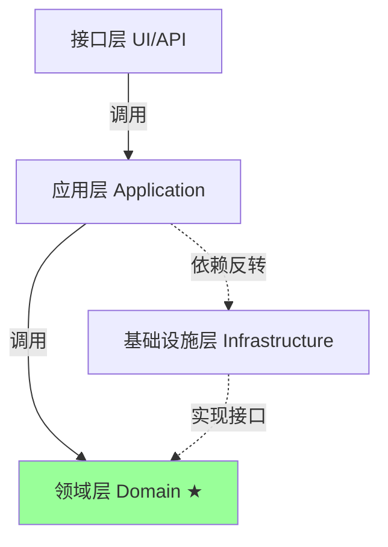
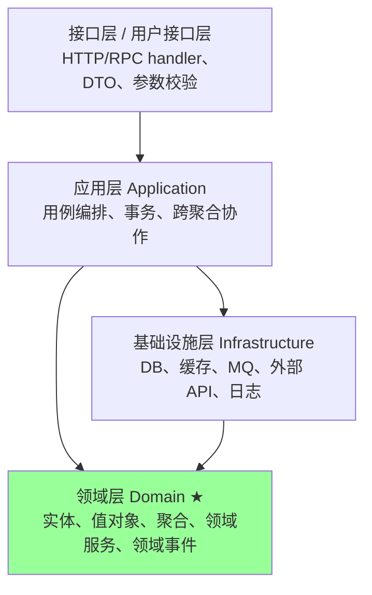
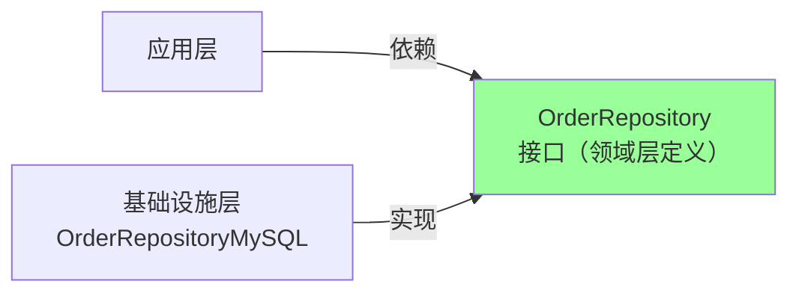
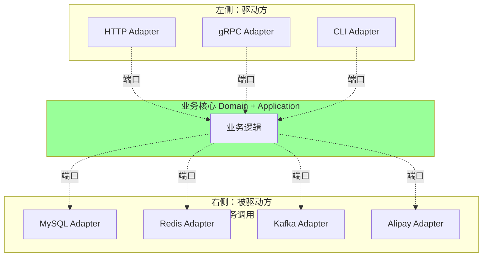
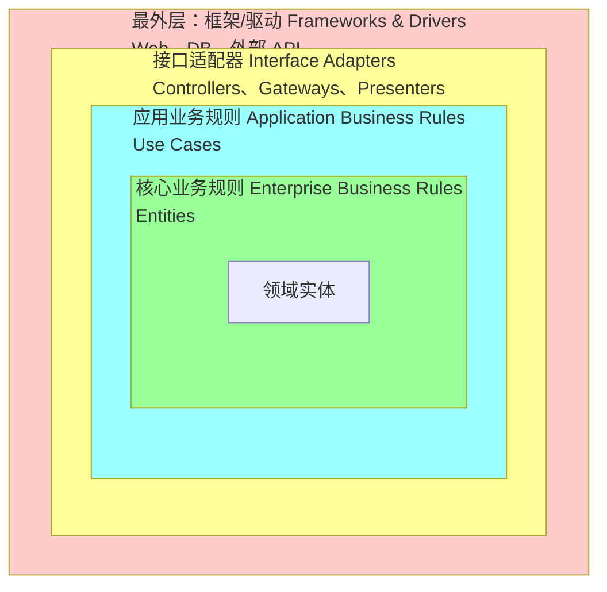
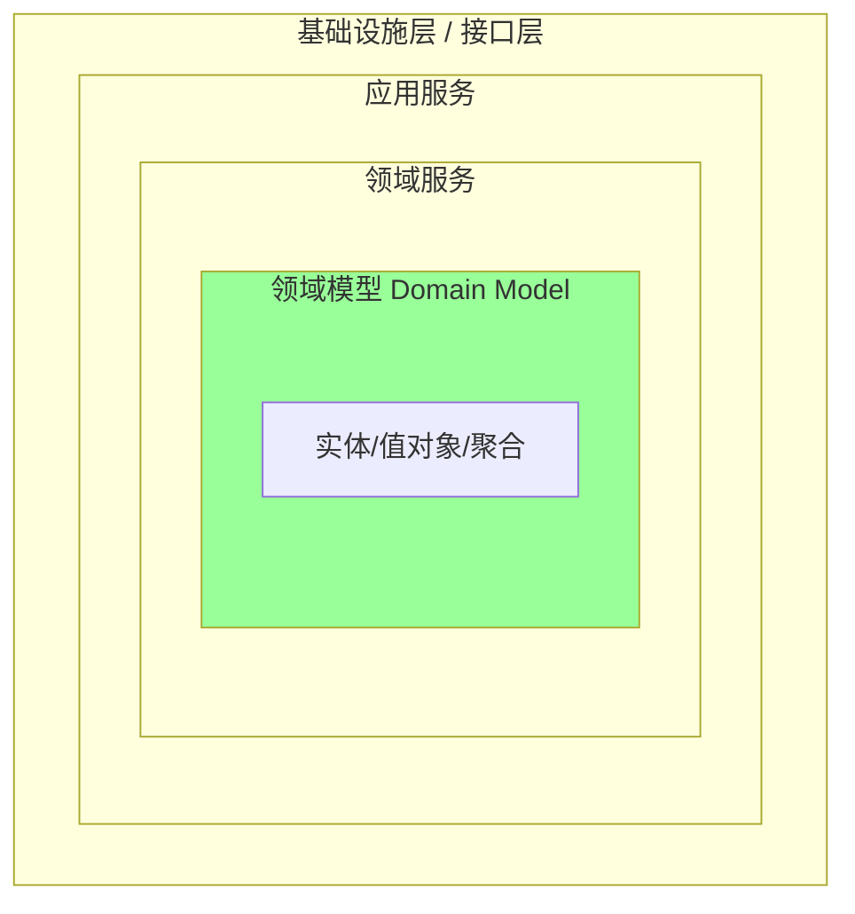
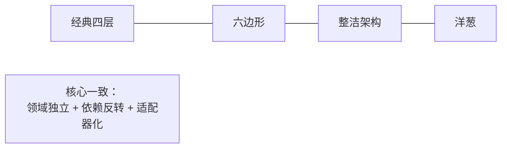

# DDD · 分层架构

> 经典四层 / 六边形（端口适配器）/ 整洁架构 / 洋葱架构 / 真实项目目录布局

> 本篇结合 `ddd_order_example` 的洋葱架构实战，对比四种架构模式

## 一、为什么需要分层

### 1.1 没有分层的痛

```go
// 反例：HTTP handler 里全是业务逻辑
func CreateOrderHandler(c *gin.Context) {
    var req CreateOrderReq
    c.BindJSON(&req)

    // 直接连数据库
    db.Exec("INSERT INTO orders ...")
    // 直接调外部 API
    http.Post("https://pay.api/create", ...)
    // 业务规则散在 if-else 里
    if req.Amount > 1000 { ... }

    c.JSON(200, "ok")
}
```

问题：
- HTTP / 业务 / DB / 外部调用全混一起
- 没法单测（要起 DB / mock 外部）
- 业务规则跑遍代码，复用难
- 改 DB 要改业务，改 API 要改业务

### 1.2 分层的目标



四个目标：
1. **领域层是核心**，不依赖外部
2. **依赖方向单向向内**（外层依赖内层）
3. **基础设施可替换**（换 MySQL → MongoDB 不影响业务）
4. **可测试**（领域层纯函数，无外部依赖）

## 二、经典四层架构

### 2.1 四层职责



| 层 | 职责 | 不该做 |
| --- | --- | --- |
| 接口层 | HTTP/gRPC 编解码、DTO、入参校验、调用应用服务 | 写业务规则 |
| 应用层 | 用例编排、事务、跨聚合协作、发布事件、调用基础设施 | 写领域规则、写技术细节 |
| 领域层 | **业务核心**：实体行为、不变量、聚合、领域服务 | 知道 DB/HTTP |
| 基础设施层 | DB 实现、外部 API 适配、消息发布订阅 | 写业务 |

### 2.2 依赖反转：领域定义接口，基础设施实现



`ddd_order_example` 的实际写法：

```go
// 领域层：定义接口（domain_order_core/repository.go）
package domain_order_core

type OrderRepository interface {
    Save(ctx context.Context, order *OrderDO) error
    FindByID(ctx context.Context, id string) (*OrderDO, error)
}
```

```go
// 基础设施层：实现接口（infrastructure/repository/order_repository.go）
package repository

type OrderRepositoryMySQL struct {
    db *gorm.DB
}

func NewOrderRepository(db *gorm.DB) domain_order_core.OrderRepository {
    return &OrderRepositoryMySQL{db: db}
}
```

**关键**：领域层不知道有 MySQL，只知道有 `OrderRepository` 接口。

### 2.3 应用服务编排

```go
// internal/application/service/order_service.go
type OrderService struct {
    productService     domain_product_core.ProductService
    orderDomainService domain_order_core.OrderDomainService
    paymentService     *PaymentService
}

func (s *OrderService) PayOrder(ctx context.Context, orderID string) error {
    // 1. 通过领域服务获取聚合
    orderDO, _ := s.orderDomainService.GetOrderByID(ctx, orderID)

    // 2. 业务规则检查（聚合根方法）
    if orderDO.Status != domain_order_core.OrderStatusCreated {
        return fmt.Errorf("订单状态异常: %s", ...)
    }

    // 3. 跨聚合协作（调用 PaymentService）
    paymentID, _ := s.paymentService.CreatePayment(ctx, orderDO.ID, orderDO.TotalAmount, "CNY", 1)

    // 4. 修改 Order 聚合
    orderDO.MarkAsPendingPayment()

    // 5. 持久化
    return s.orderDomainService.UpdateOrder(ctx, orderDO)
}
```

**应用服务做的事**：编排 + 事务 + 跨聚合，不做业务规则。

## 三、六边形架构（端口与适配器）

### 3.1 核心概念

> **业务核心在中间，外部世界通过"端口"和"适配器"接入**



### 3.2 端口与适配器

- **端口（Port）**：核心定义的接口（`OrderRepository`、`ProductService`、`PaymentProxy`）
- **适配器（Adapter）**：外部具体实现（`OrderRepositoryMySQL`、`ThirdPartyProductAPI`、`AlipayProxy`）

### 3.3 六边形 vs 四层

| | 四层 | 六边形 |
| --- | --- | --- |
| 视角 | 自顶向下 | 内核 + 外围 |
| 强调 | 层级 | 内外隔离 |
| 适配器 | 隐含在基础设施 | 显式分组 |
| 测试 | 各层 mock | 替换适配器即可 |

实质等价：六边形把"接口层"和"基础设施层"统一为"适配器"，业务核心独立。

### 3.4 真实项目落地：PaymentProxy 端口

```go
// internal/infrastructure/payment/proxy.go
type PaymentProxy interface {
    Pay(ctx context.Context, paymentID string, amount int64) error
    Query(ctx context.Context, paymentID string) (*PaymentResult, error)
}

// 真实适配器（生产）
type RealPaymentProxy struct { ... }

// Mock 适配器（测试）
type MockPaymentProxy struct { ... }
```

`ddd_order_example` 的 wire 注入：
```go
// di/wire.go
func NewMockPaymentProxy() payment.PaymentProxy {
    return payment.NewMockPaymentProxy()
}
```

测试时换 Mock，生产时换 Real，**业务核心不变**。

## 四、整洁架构（Clean Architecture）

### 4.1 同心圆



### 4.2 依赖法则

> **依赖只能从外向内**，内层不知道外层存在。

```
Frameworks → Adapters → Use Cases → Entities
            ↑          ↑           ↑
         不知道       不知道      不知道
         它们的       它们的      它们的
         存在        存在        存在
```

### 4.3 与 DDD 的对应

| 整洁架构 | DDD |
| --- | --- |
| Entities | 领域层（聚合根、实体、值对象） |
| Use Cases | 应用层（应用服务） |
| Interface Adapters | 接口层 + 部分基础设施 |
| Frameworks & Drivers | 基础设施层 |

## 五、洋葱架构（Onion Architecture）

### 5.1 同心圆视角



### 5.2 与整洁架构的区别

- **洋葱**：明确把"领域服务"独立成一层
- **整洁**：合并到 Use Cases / Entities

实战中两者经常混用，统称"内核外层"风格。

### 5.3 ddd_order_example 的洋葱实践

```
internal/
├── domain/                       # 最内层：领域核心
│   ├── domain_order_core/        # 订单聚合
│   │   ├── entity.go             # OrderDO + OrderItemDO + 状态机
│   │   ├── repository.go         # 接口（端口）
│   │   └── service.go            # 领域服务
│   ├── domain_payment_core/      # 支付聚合
│   └── domain_product_core/      # 商品（外部对接接口）
├── application/                  # 应用层：用例编排
│   └── service/
│       ├── order_service.go
│       ├── payment_service.go
│       └── order_service_test.go
├── infrastructure/               # 基础设施层：适配器
│   ├── repository/               # MySQL 实现
│   ├── external/product_api/     # 第三方商品 API（防腐层）
│   ├── payment/                  # 支付代理（真实+Mock）
│   ├── persistence/schema.sql    # DB Schema
│   ├── mocks/                    # 自动生成 mock
│   └── di/                       # Wire DI
├── interface/                    # 接口层
│   ├── handler/order_handler.go  # HTTP handler
│   └── dto/order_dto.go          # 接口 DTO
└── shared/                       # 共享内核
    └── event/bus.go              # 事件总线
```

**目录结构反映依赖方向**：domain ← application ← infrastructure / interface。

## 六、四种架构对比



| | 经典四层 | 六边形 | 整洁 | 洋葱 |
| --- | --- | --- | --- | --- |
| 强调 | 层级 | 端口/适配器 | 依赖法则 | 内核独立 |
| 视图 | 横向分层 | 内外两边 | 同心圆 | 同心圆 |
| 适合 | 简单业务 | 多输入输出 | 复杂业务 | 长生命周期 |
| 共同点 | **领域层独立 + 依赖反转 + 接口隔离** | | | |

**实战建议**：
- 业务简单 → 经典四层够了
- 多入口（HTTP + gRPC + CLI + MQ 消费） → 六边形最直观
- 强调测试 / 长期维护 → 整洁/洋葱
- 团队选一个，**核心思想都一样**

## 七、依赖注入：让架构落地

### 7.1 为什么需要 DI

依赖反转要求"接口在内，实现在外"，但接口要被实现注入才能跑起来。

```go
// 不用 DI：手写组装
db := gorm.Open(...)
orderRepo := repository.NewOrderRepository(db)
orderDomainSvc := domain_order_core.NewOrderDomainService(orderRepo)
productSvc := product_api.NewProductServiceAdapter(...)
paymentRepo := repository.NewPaymentRepository(db)
paymentDomainSvc := domain_payment_core.NewPaymentDomainService(paymentRepo)
paymentProxy := payment.NewMockPaymentProxy()
paymentSvc := service.NewPaymentService(paymentDomainSvc, paymentProxy)
orderSvc := service.NewOrderService(orderDomainSvc, paymentSvc, productSvc)
handler := handler.NewOrderHandler(orderSvc)
// 嵌套 9 层，难维护
```

### 7.2 Wire：编译期 DI

`ddd_order_example` 用 Google Wire：

```go
//go:build wireinject
// +build wireinject

func InitializeTestOrderHandler(db *gorm.DB) (*handler.OrderHandler, error) {
    wire.Build(
        NewOrderRepository,    // 订单仓储
        NewOrderDomainService, // 订单领域服务
        NewMockProductService, // 商品服务

        NewPaymentRepository,
        NewPaymentDomainService,
        NewMockPaymentProxy,
        NewPaymentService,
        NewOrderService,
        NewOrderHandler,
    )
    return nil, nil
}
```

`wire` 命令生成 `wire_gen.go`，自动按类型连接依赖图。

### 7.3 Wire vs 运行时 DI（如 fx、dig）

| | Wire | fx/dig |
| --- | --- | --- |
| 时机 | 编译期生成代码 | 运行时反射 |
| 错误 | 编译失败 | 运行时报错 |
| 性能 | 等同手写 | 反射开销 |
| 可读 | 看 wire_gen 即可 | 隐式 |

DDD 项目首选 **Wire**：错误前置、零开销。

## 八、目录结构推荐

### 8.1 单 BC 项目（小中型）

```
your-project/
├── cmd/
│   └── server/main.go
├── internal/
│   ├── domain/              # 领域层
│   │   ├── order/           # Order 聚合
│   │   │   ├── entity.go
│   │   │   ├── repository.go
│   │   │   └── service.go
│   │   └── payment/
│   ├── application/         # 应用层
│   │   └── service/
│   ├── infrastructure/      # 基础设施
│   │   ├── repository/
│   │   ├── external/
│   │   └── di/
│   ├── interface/           # 接口层
│   │   └── http/
│   └── shared/              # 共享内核
│       └── event/
└── pkg/
```

### 8.2 多 BC 项目（中大型）

```
your-project/
├── cmd/
├── order/                   # 订单 BC
│   ├── domain/
│   ├── application/
│   ├── infrastructure/
│   └── interface/
├── payment/                 # 支付 BC
│   └── ...
├── product/                 # 商品 BC
│   └── ...
└── shared/                  # 跨 BC 共享内核
```

每个 BC 自带四层结构，互相通过接口/事件通信。

### 8.3 Kratos 风格（业界主流）

```
internal/
├── biz/        # 领域层（实体 + 业务规则）
├── service/    # 应用层
├── data/       # 基础设施（DB / Cache）
├── server/     # 接口层（HTTP/gRPC）
└── conf/
```

`biz` ≈ domain + application，`data` ≈ infrastructure，命名不同但职责对应。

## 九、典型坑

### 坑 1：Service 写成事务脚本

```go
// 反例：Service 里全是 if + DB 操作
func (s *Service) PayOrder(id string) error {
    var o Order
    db.First(&o, "id = ?", id)
    if o.Status != "created" { return errors.New(...) }
    o.Status = "paid"
    db.Save(&o)
    db.Save(&Payment{...})
}
```

**修复**：聚合行为放聚合根，应用服务只编排。

### 坑 2：领域层依赖 Gin/GORM

```go
// 反例
package domain_order_core
import "gorm.io/gorm"

type OrderDO struct {
    gorm.Model  // ❌ 领域层污染
}
```

**修复**：领域对象自带 ID/时间戳字段，GORM 标签可以保留（项目实际是这么做的，权衡），但**绝不依赖 *gorm.DB**。

### 坑 3：Repository 写在领域层

```go
// 反例
package domain_order_core

func (r *OrderRepository) Save(o *Order) error {
    db.Save(o)  // ❌ 领域层连了 DB
}
```

**修复**：领域层只定义 `OrderRepository interface`，实现放 infrastructure。

### 坑 4：DTO 直通领域层

```go
// 反例
func CreateOrder(c *gin.Context) {
    var req CreateOrderReq
    c.BindJSON(&req)
    s.OrderService.Create(req)  // ❌ DTO 透传到 service
}
```

**修复**：interface 层把 DTO 转成应用层入参（领域对象/参数 struct）。

### 坑 5：基础设施倒灌进领域

把 `*gorm.DB` 注入到 `OrderDO.Save()`：

```go
// 反例
func (o *Order) Save(db *gorm.DB) error { ... }
```

**修复**：聚合根没有 Save，由 Repository 完成持久化。

### 坑 6：循环依赖

`domain_order_core` 引了 `domain_payment_core`，`domain_payment_core` 又引了 `domain_order_core`。

**修复**：BC 之间通过**事件 + 防腐层**通信，不直接依赖。

## 十、面试高频题

**Q1：DDD 的分层架构有哪些？怎么选？**

四种：经典四层、六边形、整洁架构、洋葱架构。

**核心一致**：领域层独立 + 依赖反转 + 接口隔离。

**选择**：
- 简单 → 经典四层
- 多入口/出口 → 六边形
- 长期维护/复杂业务 → 整洁/洋葱

**Q2：依赖反转（DIP）在 DDD 里怎么体现？**

领域层定义 `Repository` 接口，基础设施实现。这样领域层不知道有 MySQL/MongoDB，**业务核心独立**。

**Q3：应用服务和领域服务的区别？**

| | 应用服务 | 领域服务 |
| --- | --- | --- |
| 职责 | 用例编排、事务、跨聚合 | 跨实体的业务规则 |
| 依赖 | 调用领域服务、Repository、外部接口 | 只依赖领域对象 |
| 可测 | 集成测试 | 单元测试 |

**Q4：六边形架构是什么？**

业务核心独立，外部通过**端口（接口）+ 适配器（实现）**接入。

- 左侧（驱动方）：HTTP、gRPC、CLI（主动调业务）
- 右侧（被驱动方）：DB、Cache、MQ、外部 API（被业务调）

替换 Mock/真实只换适配器，业务核心不动。

**Q5：洋葱架构 vs 整洁架构？**

实质相同：依赖单向向内，业务独立。

差别：
- 洋葱：把"领域服务"独立成一层
- 整洁：合到 Use Cases / Entities

实战经常混用。

**Q6：DTO 应该在哪一层？**

- **接口层 DTO**（`interface/dto/order_dto.go`）：HTTP 请求/响应
- **应用层入参**：通常用领域参数 struct，避免 DTO 渗透
- **领域层无 DTO**

**Q7：为什么用 Wire 而不是运行时 DI？**

- 编译期检查依赖图，错误前置
- 零运行时开销（生成代码等同手写）
- 可读性好（看 `wire_gen.go` 一目了然）

**Q8：BC 之间怎么通信？**

- **同进程**：接口 + 防腐层适配（项目里 `ProductService` 接口 + `ProductServiceAdapter`）
- **跨进程**：事件总线 / 消息队列 / RPC + ACL
- **绝不直接**共享实体

**Q9：Repository 接口放在哪一层？**

**领域层定义接口**，基础设施层实现。这是 DIP 的核心体现。

**Q10：领域层可以用 GORM 标签吗？**

**有争议**。
- 严格派：不能，会污染
- 实用派：可以，避免 DAO 双层映射开销（项目实际选择）

实战选**实用派**，但**绝不依赖 *gorm.DB**。

## 十一、面试加分点

- 强调四种架构**核心思想一致**：领域独立 + 依赖反转 + 接口隔离
- 领域层定义接口，基础设施实现（`OrderRepository` 是端口，`OrderRepositoryMySQL` 是适配器）
- 应用服务**只编排**，领域服务**承载业务规则**，聚合根**承载行为**
- 用 **Wire 编译期 DI**，错误前置、零开销
- 接口层 DTO 不渗透到领域层（`interface/dto` ↔ `domain` 之间显式翻译）
- 跨 BC 用**接口 + 防腐层**或**事件**，不共享实体
- 多 BC 项目按 BC 切目录（`order/` `payment/` `product/`），每 BC 自带四层
- Kratos / go-zero 等框架用的是 DDD 简化版（`biz` = domain+app，`data` = infra）
- 推荐：项目结构反映依赖方向，看目录就知道架构
- 务实选择：领域层加 GORM 标签**可接受**，但绝不依赖 `*gorm.DB`
