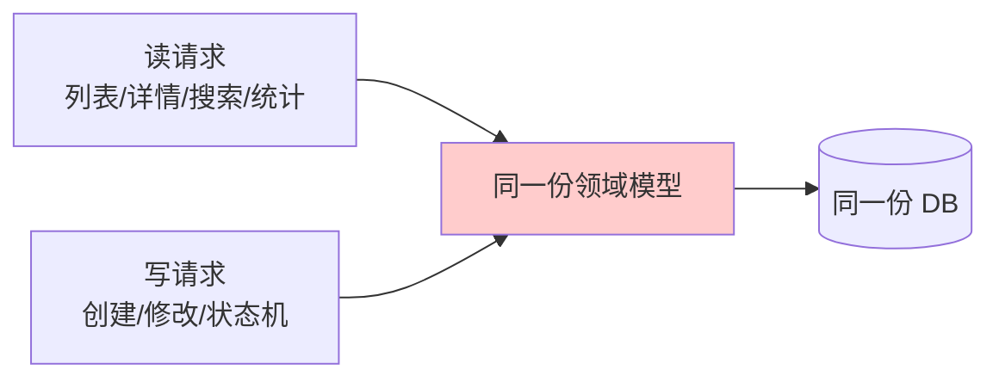
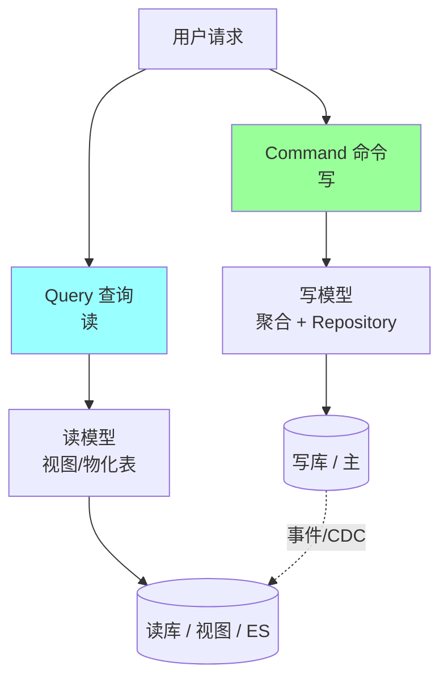
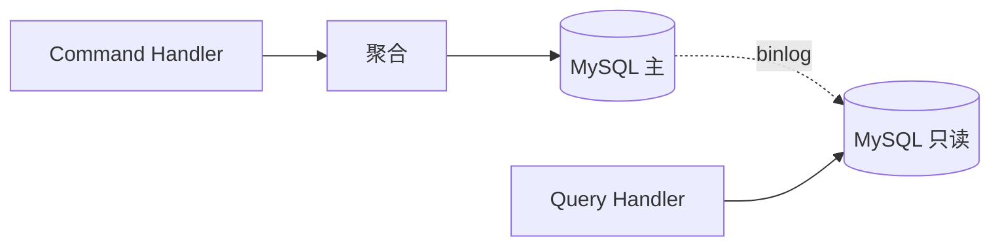
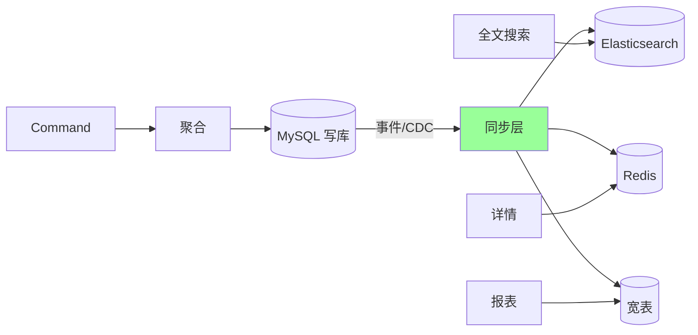
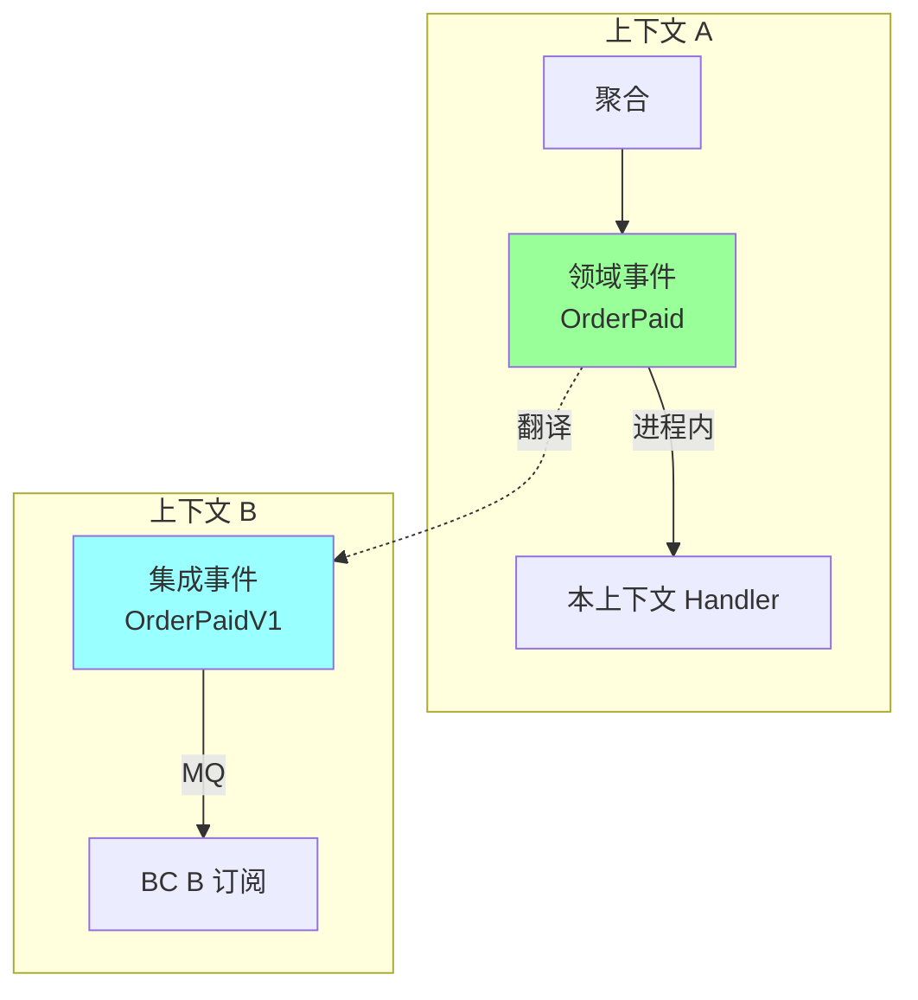
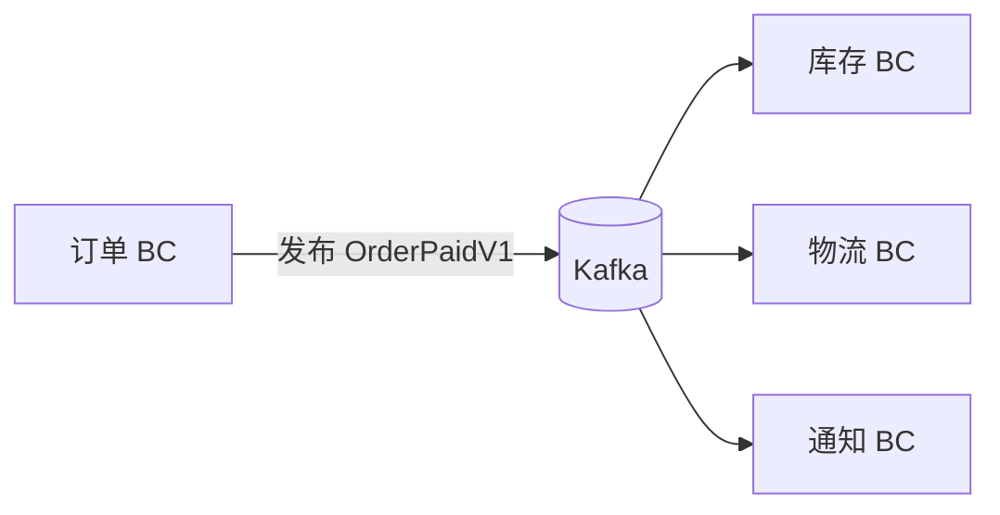
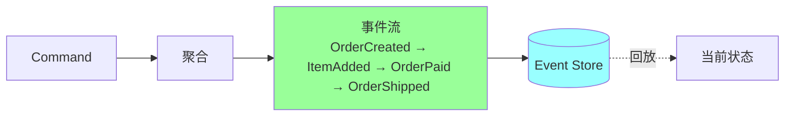
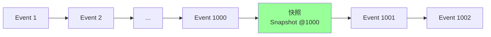
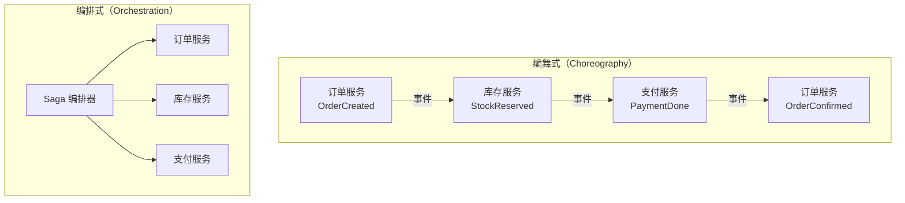
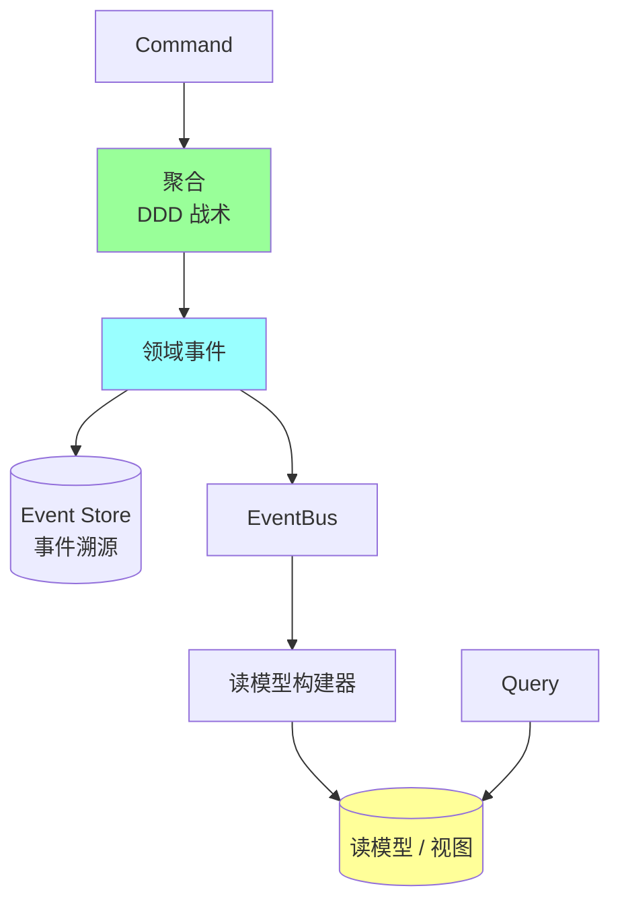

# DDD · CQRS 与事件溯源

> 命令查询职责分离 / 事件溯源 / Saga 长事务 / 集成事件 / 与 DDD 的关系

> 本篇结合真实项目 `ddd_order_example` 的事件总线（`internal/shared/event/bus.go`）讨论落地

## 一、为什么从 DDD 走向 CQRS / ES

### 1.1 DDD 单模型的局限



问题：
- **读写需求差异巨大**：写要事务一致 / 防错；读要灵活查询、聚合、统计
- **聚合不擅长查询**：聚合根加载全字段，但报表只要几个字段
- **复杂查询拖累领域模型**：DTO 加来加去把领域模型搞乱

### 1.2 CQRS 的解法



> CQRS = Command Query Responsibility Segregation 命令查询职责分离

**核心**：写模型和读模型**分开**，各自优化。

## 二、CQRS 详解

### 2.1 写模型 vs 读模型

| | 写模型 | 读模型 |
| --- | --- | --- |
| 形式 | 聚合 + Repository | 物化视图 / DTO |
| 优化目标 | 一致性、不变量 | 查询性能、灵活 |
| DB 选型 | 关系型（事务） | 视图、ES、Redis、宽表 |
| Schema | 规范化 | 反规范化（冗余） |
| 一致性 | 强 | 最终（毫秒-秒级） |

### 2.2 简单场景：用同一 DB



写主库读从库，是 CQRS 的轻量版。

### 2.3 复杂场景：异构存储



写一份，读多份，按场景挑读模型。

### 2.4 命令与查询的代码组织

```go
// 写侧：Command Handler
type CreateOrderCommand struct {
    CustomerID string
    Items      []OrderItem
}

func (h *OrderCommandHandler) HandleCreate(ctx context.Context, cmd CreateOrderCommand) (string, error) {
    order := domain.NewOrder(cmd.CustomerID, cmd.Items)
    if err := order.Validate(); err != nil {
        return "", err
    }
    return order.ID, h.repo.Save(ctx, order)
}

// 读侧：Query Handler
type GetOrderListQuery struct {
    CustomerID string
    Status     string
    Page, Size int
}

type OrderListItem struct {  // 专门为列表场景优化的 DTO
    OrderID    string
    CustomerID string
    Status     string
    TotalAmount int64
    ItemCount  int    // 冗余字段
    PaidAt     *time.Time  // 冗余字段（来自 payment）
}

func (h *OrderQueryHandler) HandleList(ctx context.Context, q GetOrderListQuery) ([]OrderListItem, error) {
    return h.readDB.Query(`SELECT ... FROM v_order_list WHERE ...`)  // 不经过聚合
}
```

**关键**：查询直接读视图/宽表，**不经过聚合**，避免无谓加载。

### 2.5 什么时候用 CQRS

**适合**：
- 读写比例悬殊（读 >> 写）
- 查询复杂多变（搜索、报表、统计）
- 领域模型复杂、不希望被查询拖累

**不适合**：
- 简单 CRUD
- 读写需求基本一致

`ddd_order_example` 项目目前是**单模型**（订单查询走 `FindByID`），属于轻量场景。如果业务扩展到"订单列表 + 多维度搜索 + 报表分析"，就该上 CQRS。

## 三、领域事件 vs 集成事件

### 3.1 两种事件的定位



| | 领域事件 | 集成事件 |
| --- | --- | --- |
| 范围 | 上下文内 | 上下文之间 |
| 形式 | Go 接口 / 内存 | JSON / Protobuf |
| 传输 | EventBus | Kafka / RabbitMQ |
| 命名 | OrderPaid | OrderPaidV1（带版本） |
| 演化 | 频繁 | 必须向后兼容 |

### 3.2 项目实战：内存事件总线

`ddd_order_example` 的 `internal/shared/event/bus.go` 实现了一个**进程内**事件总线：

```go
type Event interface {
    Name() string
}

type Handler interface {
    Handle(ctx context.Context, event Event) error
}

type EventBus struct {
    handlers map[string][]Handler
    mutex    sync.RWMutex
}

func (b *EventBus) RegisterHandler(eventName string, handler Handler) {
    b.mutex.Lock()
    defer b.mutex.Unlock()
    b.handlers[eventName] = append(b.handlers[eventName], handler)
}

func (b *EventBus) Publish(ctx context.Context, event Event) error {
    b.mutex.RLock()
    handlers, ok := b.handlers[event.Name()]
    b.mutex.RUnlock()
    if !ok { return nil }

    var wg sync.WaitGroup
    for _, handler := range handlers {
        wg.Add(1)
        go func(h Handler) {
            defer wg.Done()
            _ = h.Handle(ctx, event)
        }(handler)
    }
    wg.Wait()
    return nil
}
```

**特点**：
- 同步发布、异步并发处理
- 没有持久化（崩了就丢）
- 只在**单进程**内有效

适合：领域事件、跨聚合解耦。

### 3.3 进化到集成事件

跨上下文 / 跨服务时升级：

```go
type OrderPaidV1 struct {
    EventID    string    `json:"event_id"`     // 唯一 ID（幂等）
    OccurredAt time.Time `json:"occurred_at"`
    OrderID    string    `json:"order_id"`
    CustomerID string    `json:"customer_id"`
    Amount     int64     `json:"amount"`
    Currency   string    `json:"currency"`
    Version    string    `json:"version"`      // "v1"
}
```

走 Kafka / RabbitMQ：



## 四、事件溯源（Event Sourcing）

### 4.1 核心思想

> **不存当前状态，存所有变更事件，状态从事件回放得来**



### 4.2 传统 vs 事件溯源

| | 传统 | 事件溯源 |
| --- | --- | --- |
| 存什么 | 当前状态 | 所有变更事件 |
| 查询 | SELECT * | 加载事件流 + 回放 |
| 历史 | 丢失（除非有审计表） | 天然完整 |
| 修改 | UPDATE 覆盖 | 新增事件 |
| 时间旅行 | 不行 | 任意时刻状态可还原 |

### 4.3 例子：订单聚合

```go
// 事件
type OrderCreated struct{ OrderID, CustomerID string; Items []Item }
type ItemAdded struct{ OrderID string; Item Item }
type OrderPaid struct{ OrderID string; PaidAt time.Time }
type OrderCancelled struct{ OrderID string; Reason string }

// 聚合从事件回放
func (o *Order) Apply(event Event) {
    switch e := event.(type) {
    case OrderCreated:
        o.ID, o.CustomerID, o.Items, o.Status = e.OrderID, e.CustomerID, e.Items, "Created"
    case ItemAdded:
        o.Items = append(o.Items, e.Item)
    case OrderPaid:
        o.Status, o.PaidAt = "Paid", e.PaidAt
    case OrderCancelled:
        o.Status = "Cancelled"
    }
}

// Repository 从事件流加载
func (r *EventSourcedRepo) FindByID(ctx context.Context, id string) (*Order, error) {
    events := r.store.Load(id)
    o := &Order{}
    for _, e := range events {
        o.Apply(e)
    }
    return o, nil
}

// 命令产出事件
func (o *Order) Pay() ([]Event, error) {
    if o.Status != "Created" { return nil, errors.New(...) }
    return []Event{OrderPaid{OrderID: o.ID, PaidAt: time.Now()}}, nil
}
```

### 4.4 优缺点

| 优 | 缺 |
| --- | --- |
| 完整审计 / 历史 | 实现复杂 |
| 时间旅行 / 回溯 bug | 查询慢（要回放） |
| 与 CQRS 完美配合 | 事件 schema 演化难 |
| 业务事实即真相 | 学习曲线陡 |
| 易于派生多读模型 | 事件存储要求高 |

### 4.5 性能优化：快照



每 N 个事件存一次状态快照，加载时从最近快照 + 后续事件回放，避免每次回放上千条。

### 4.6 什么时候用 ES

**用**：
- 强审计需求（金融、医疗、合规）
- 需要时间旅行 / 回溯能力
- 业务以"事件"为核心建模（购物车、订单）

**不用**：
- 简单 CRUD
- 团队没经验
- 查询绝对主导

`ddd_order_example` 没用 ES，因为业务还不复杂。但订单状态机很适合 ES 改造，下一步如果加退货/退款/对账，ES 价值会显现。

## 五、Saga：跨服务长事务

### 5.1 为什么需要

跨聚合 / 跨服务的强一致性事务在分布式系统**不可行**（CAP 限制）。Saga 用**一系列本地事务 + 补偿**实现最终一致。

### 5.2 两种 Saga 编排



| | 编舞 | 编排 |
| --- | --- | --- |
| 协调者 | 无（事件驱动） | 有（Saga Orchestrator） |
| 耦合 | 低 | 中 |
| 流程可见 | 难（散在事件） | 强（编排器一目了然） |
| 适合 | 简单流程 | 复杂流程 |

### 5.3 例子：电商下单 Saga

正向：
```
1. 订单服务: 创建订单 (Created)
2. 库存服务: 扣减库存
3. 支付服务: 发起支付
4. 物流服务: 准备发货
5. 订单服务: 标记完成
```

任一步骤失败 → **逆向补偿**：
```
1. 订单服务: 取消订单 (Cancelled)
2. 库存服务: 释放库存
3. 支付服务: 退款
```

### 5.4 关键实现要点

- **每个步骤幂等**（可重试）
- **每个步骤都有补偿**（取消/退款/释放）
- **Saga 状态持久化**（崩了能恢复）
- **超时处理**（失败重试 N 次后触发补偿）

```go
type Saga struct {
    ID    string
    Steps []SagaStep
    State SagaState  // Running / Compensating / Done / Failed
}

type SagaStep struct {
    Name       string
    Execute    func(ctx) error
    Compensate func(ctx) error
    Status     StepStatus
}
```

### 5.5 与 TCC 的对比

| | Saga | TCC |
| --- | --- | --- |
| 阶段 | Execute + Compensate | Try + Confirm + Cancel |
| 资源预留 | 无 | Try 阶段预留 |
| 隔离性 | 中间状态可见 | 较好 |
| 适合 | 长事务、跨服务 | 强隔离要求 |

详见 [06-distributed/03-distributed-transaction.md](06-distributed/03-distributed-transaction.md)。

## 六、CQRS + ES + DDD 协同



**协同链路**：
1. **DDD** 提供聚合 + 领域事件
2. **CQRS** 把读写分离
3. **ES** 把事件作为唯一真源
4. 读模型由事件投影生成

三者**完全独立**也能用，但组合起来威力最大。

## 七、典型坑

### 坑 1：CQRS 用错地方

简单 CRUD 上 CQRS → 维护成本爆炸。

**修复**：先单模型，等查询场景复杂再拆。

### 坑 2：读模型同步延迟

写主库 → 读从库 → 用户立刻查询发现"自己刚下的单还没出现"。

**修复**：
- 关键场景查主库
- 前端乐观渲染（先显示成功，后台同步）
- 同步层加监控告警

### 坑 3：事件 schema 失控

集成事件改字段，下游全炸。

**修复**：
- 集成事件版本化（V1 / V2）
- 新字段只加不删
- 下游容忍未知字段
- 用 Schema Registry（Kafka 生态）

### 坑 4：ES 事件回放性能差

百万事件回放秒级 → 用户体验崩。

**修复**：快照 + 增量回放。

### 坑 5：Saga 补偿不幂等

补偿重试导致库存被释放两次。

**修复**：每个步骤带幂等 key，已处理直接返回成功。

### 坑 6：领域事件用同步 Publish 失败回滚

```go
func (s *Service) PayOrder(...) error {
    db.Save(&order)
    bus.Publish(OrderPaid)  // ❌ 已 Commit，事件失败也回滚不了
}
```

**修复**：用 **Outbox 模式**，事件和业务写到同一事务，独立投递任务读 Outbox 发 MQ。

### 坑 7：跨上下文用领域事件而非集成事件

直接把 `OrderPaid` 跨 BC 共享 → 上下文耦合。

**修复**：BC 内部用领域事件，跨 BC 一律用集成事件（带版本、稳定）。

## 八、面试高频题

**Q1：什么是 CQRS？什么时候用？**

**Command Query Responsibility Segregation**：把写模型和读模型分开。

**用**：读写比例悬殊、查询复杂、领域模型不希望被查询拖累。

**不用**：简单 CRUD、读写需求一致。

**Q2：CQRS 和 DDD 什么关系？**

CQRS 不是 DDD 的子集，但**强 DDD 项目天然适合 CQRS**：
- DDD 写侧已有聚合、领域事件
- 读侧需要灵活 → 自然分离

**Q3：领域事件 vs 集成事件？**

| | 领域事件 | 集成事件 |
| --- | --- | --- |
| 范围 | 上下文内 | 上下文间 |
| 形式 | Go 类型 / 内存 | JSON/Proto |
| 传输 | EventBus | Kafka/MQ |
| 演化 | 频繁 | 必须兼容 |

**Q4：事件溯源（ES）是什么？优缺点？**

不存状态存事件，状态从事件回放。

**优**：完整审计、时间旅行、与 CQRS 协同好。
**缺**：实现复杂、查询慢（用快照优化）、schema 演化难。

**Q5：CQRS 一定要用事件溯源吗？**

**不一定**。CQRS 只是读写分离，可以：
- 写主库读从库（最简单）
- 写关系库 + 读 ES（异构存储）
- 写事件流 + 读投影（这才用 ES）

**Q6：Saga 是什么？编舞 vs 编排？**

跨服务长事务方案：**一系列本地事务 + 补偿**实现最终一致。

- 编舞（Choreography）：事件驱动，无中心，简单流程
- 编排（Orchestration）：中心化 Orchestrator，复杂流程

**Q7：CQRS 读写一致性怎么保证？**

不保证强一致，**最终一致**（ms-s 级延迟）。

**关键场景**直接读主库 / 写后立即返回带快照值给前端。

**Q8：Outbox 模式解决什么？**

业务事务和事件发布**原子性**问题。把事件写到同一事务的 outbox 表，独立任务读 outbox 发 MQ，保证"业务成功 ↔ 事件最终发出"。

**Q9：CQRS 中读模型怎么构建？**

- 写侧产出领域/集成事件
- 投影服务订阅事件，更新读模型表
- 读模型可以是 MySQL 视图、ES、Redis、宽表
- 失败重试 + 幂等保证最终一致

**Q10：ES 怎么处理事件 Schema 演化？**

- **加字段**：新版本兼容老事件（新字段为可选）
- **改字段**：升级器（Upcaster）把旧事件转新格式
- **删字段**：保留 + 标记 deprecated
- 不允许破坏性变更

## 九、面试加分点

- 强调 **CQRS / ES / DDD 三者独立但协同**
- CQRS = **写模型 + 读模型**，不强制 ES
- 领域事件（进程内）vs 集成事件（跨 BC）**职责不同**
- 真实项目从**单模型起步**，复杂后再拆 CQRS
- 事件总线项目实战：`internal/shared/event/bus.go` 同步 Publish + 异步 Handler
- ES 优势是**审计 + 时间旅行**，但代价高，按需用
- Saga 必备：**步骤幂等 + 补偿幂等 + 状态持久化**
- 写后查询不一致用 **Outbox 模式 + 主库读** 缓解
- 集成事件**版本化 + 向后兼容**（V1/V2，避免破坏下游）
- CQRS 最常见的轻量落地：**主库写 + 从库读**（不用全量异构存储）
