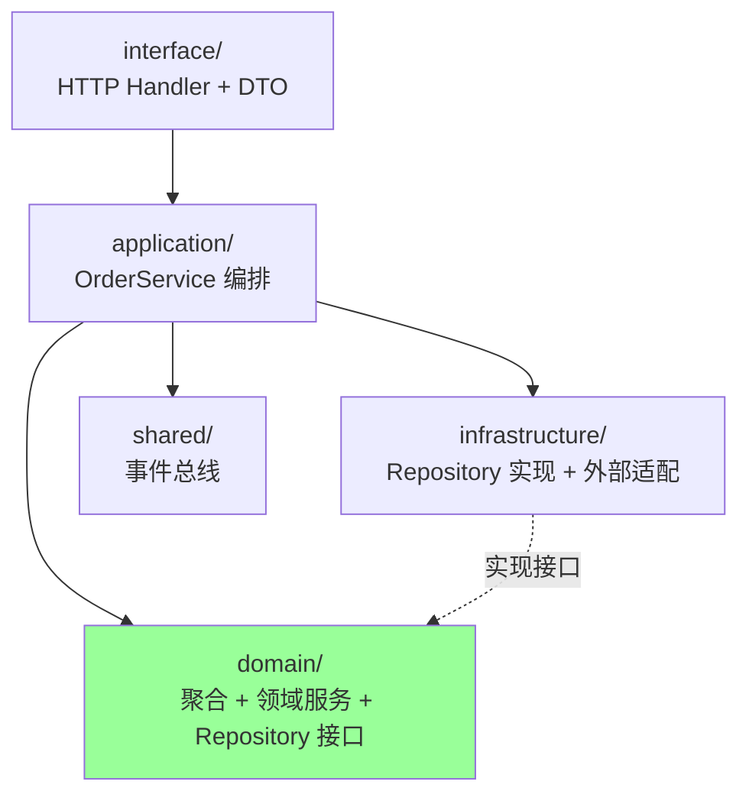

# DDD · Go 落地

> 真实项目剖析 / 目录结构 / Wire 依赖注入 / GORM 整聚合保存 / 防腐层 / Mock 测试

> 本篇全程基于真实项目 `/Users/nikki/go/src/ddd_order_example`（Go 1.23 + GORM + 乐观锁 + Wire + gomock + 事件总线）

## 一、项目全景

### 1.1 整体目录

```
ddd_order_example/
├── config/                          # 配置（viper）
├── docs/                            # 设计文档
├── pkg/                             # 通用工具
│   └── dmoney/                      # 金额转换（元↔分）
└── internal/
    ├── domain/                      # 【领域层】最内层
    │   ├── domain_order_core/       # 订单聚合
    │   ├── domain_payment_core/     # 支付聚合
    │   └── domain_product_core/     # 商品上下文（仅接口，外部对接）
    ├── application/                 # 【应用层】用例编排
    │   └── service/
    │       ├── order_service.go
    │       ├── order_service_test.go
    │       └── payment_service.go
    ├── infrastructure/              # 【基础设施层】适配器
    │   ├── repository/              # MySQL 实现
    │   ├── external/product_api/    # 第三方商品 API（防腐层）
    │   ├── payment/                 # 支付代理（真实+Mock）
    │   ├── persistence/schema.sql   # DB Schema
    │   ├── mocks/                   # gomock 自动生成
    │   └── di/                      # Wire DI
    ├── interface/                   # 【接口层】HTTP/gRPC
    │   ├── handler/order_handler.go
    │   └── dto/order_dto.go
    └── shared/                      # 【共享内核】跨上下文
        └── event/bus.go             # 事件总线
```

### 1.2 架构对应



**洋葱架构**：domain 不依赖任何外部，application 依赖 domain，infrastructure/interface 依赖 application 和 domain。

## 二、领域层：聚合 + 接口 + 服务

### 2.1 包命名约定：`domain_<bc>_core`

```
domain/
├── domain_order_core/
├── domain_payment_core/
└── domain_product_core/
```

每个 BC 一个 `domain_xxx_core` 包，**核心领域逻辑全在这里**。命名带 `_core` 后缀是为了避免和 infrastructure/repository 等同名包混淆。

### 2.2 聚合根：充血模型

```go
// domain/domain_order_core/entity.go
type OrderDO struct {
    ID          string
    CustomerID  string
    Items       []OrderItemDO          `gorm:"foreignKey:OrderID"`
    Status      OrderStatus
    TotalAmount int64
    CreatedAt   time.Time
    UpdatedAt   time.Time
    Version     optimisticlock.Version `gorm:"column:version;optimistic_lock"`  // 乐观锁
}

func (OrderDO) TableName() string { return "t_order" }

// 行为方法（充血）
func (o *OrderDO) Validate() error { ... }
func (o *OrderDO) Cancel() error { ... }
func (o *OrderDO) MarkAsPendingPayment() error { ... }
func (o *OrderDO) MarkAsPaid() error { ... }
func (o *OrderDO) CalculateTotalAmount() error { ... }
func (o *OrderDO) CanBeCancelled() bool { ... }
```

**关键设计**：
- 业务规则放聚合根方法（`Validate` `Cancel`），而非 Service
- GORM 标签直接打在领域对象上（务实派，避免 DAO 双层映射）
- 用 `gorm.io/plugin/optimisticlock` 做版本号，自动 `WHERE version = ?` + `version = version + 1`

### 2.3 仓储接口：定义在领域层

```go
// domain/domain_order_core/repository.go
type OrderRepository interface {
    Save(ctx context.Context, order *OrderDO) error
    FindByID(ctx context.Context, id string) (*OrderDO, error)
}
```

**铁律**：接口在 domain 层，**实现**在 infrastructure 层。这样 domain 不依赖任何 ORM。

### 2.4 领域服务：编排领域逻辑

```go
// domain/domain_order_core/service.go
type OrderDomainService struct {
    orderRepo OrderRepository  // 依赖接口，不依赖实现
}

func (s *OrderDomainService) CreateOrder(ctx context.Context, order *OrderDO) error {
    if err := order.Validate(); err != nil { return err }
    order.Status = OrderStatusCreated
    order.CreatedAt = time.Now()
    order.UpdatedAt = order.CreatedAt
    return s.orderRepo.Save(ctx, order)
}
```

**领域服务什么时候用？**
- 行为不天然属于某个聚合根
- 多聚合协作（同 BC 内）
- 流程性逻辑（含 Repository 调用）

**单聚合内的行为**应该放聚合根方法（如 `order.Cancel()`），不要建 `CancelService`。

## 三、应用层：用例编排

### 3.1 应用服务做什么

```go
// application/service/order_service.go
type OrderService struct {
    productService     domain_product_core.ProductService    // 跨 BC 接口
    orderDomainService domain_order_core.OrderDomainService  // 本 BC 领域服务
    paymentService     *PaymentService                       // 同层应用服务
}

func (s *OrderService) PayOrder(ctx context.Context, orderID string) error {
    // 1. 加载聚合
    orderDO, _ := s.orderDomainService.GetOrderByID(ctx, orderID)

    // 2. 业务规则（聚合根方法）
    if orderDO.Status != domain_order_core.OrderStatusCreated {
        return fmt.Errorf("订单状态异常: %s", ...)
    }

    // 3. 跨聚合协作
    existingPayment, err := s.paymentService.GetPaymentByOrderID(ctx, orderDO.ID)
    if err != nil && !errors.Is(err, domain_payment_core.ErrPaymentNotFound) {
        return err
    }
    var paymentID string
    if existingPayment != nil { ... } else {
        paymentID, _ = s.paymentService.CreatePayment(ctx, orderDO.ID, orderDO.TotalAmount, "CNY", 1)
    }

    // 4. 状态机迁移
    orderDO.MarkAsPendingPayment()

    // 5. 持久化
    return s.orderDomainService.UpdateOrder(ctx, orderDO)
}
```

**应用服务的职责**：
- 用例编排（步骤 1→2→3→4→5）
- 跨聚合 / 跨 BC 协作
- 事务边界
- 调用基础设施（DB、外部 API、事件总线）

**应用服务不该做的事**：
- 写业务规则（应该在聚合根 / 领域服务）
- 写数据映射（DTO 转换在 interface 层）
- 写技术细节（SQL 在 infrastructure）

### 3.2 错误处理实战

```go
// 乐观锁冲突的错误识别
func (s *OrderService) UpdateOrder(ctx context.Context, orderDO *OrderDO) error {
    if err := s.orderDomainService.UpdateOrder(ctx, orderDO); err != nil {
        if errors.Is(err, gorm.ErrDuplicatedKey) {
            return fmt.Errorf("订单已被其他操作更新，请刷新后重试: %w", err)
        }
        return fmt.Errorf("更新订单失败: %w", err)
    }
    return nil
}
```

**关键点**：
- 用 `errors.Is` 识别底层错误
- 用 `%w` 包裹原错误（保留 chain）
- 应用层把基础设施错误**翻译**成业务可理解的错误

## 四、基础设施层：仓储实现

### 4.1 整聚合保存模式

```go
// infrastructure/repository/order_repository.go
type OrderRepositoryMySQL struct { db *gorm.DB }

func NewOrderRepository(db *gorm.DB) domain_order_core.OrderRepository {
    return &OrderRepositoryMySQL{db: db}  // 返回接口
}

func (r *OrderRepositoryMySQL) Save(ctx context.Context, o *OrderDO) error {
    tx := r.db.Begin().WithContext(ctx)
    defer tx.Rollback()

    // 1. 主表（聚合根）
    if err := tx.Table("t_order").Save(o).Error; err != nil { return err }

    // 2. 删除原订单项
    if err := tx.Table("t_order_items").
        Where("order_id = ?", o.ID).
        Delete(&OrderItemDO{}).Error; err != nil { return err }

    // 3. 批量插入新订单项
    items := make([]OrderItemDO, len(o.Items))
    for i, item := range o.Items {
        items[i] = OrderItemDO{
            OrderID: o.ID, ProductID: item.ProductID,
            Quantity: item.Quantity, UnitPrice: item.UnitPrice, Subtotal: item.Subtotal,
        }
    }
    if err := tx.Table("t_order_items").Create(&items).Error; err != nil { return err }

    return tx.Commit().Error
}

func (r *OrderRepositoryMySQL) FindByID(ctx context.Context, id string) (*OrderDO, error) {
    var o OrderDO
    if err := r.db.WithContext(ctx).Table("t_order").First(&o, "id = ?", id).Error; err != nil {
        if errors.Is(err, gorm.ErrRecordNotFound) {
            return nil, errors.New("订单不存在")
        }
        return nil, err
    }
    var items []OrderItemDO
    r.db.WithContext(ctx).Table("t_order_items").
        Raw("SELECT product_id, quantity, unit_price, subtotal FROM t_order_items WHERE order_id = ?", id).
        Scan(&items)
    o.Items = items
    return &o, nil
}
```

**关键模式**：
- **整聚合保存**：聚合根 + 内部实体一次事务
- **先删后插**订单项：避免逐条 diff，简单可靠
- **WithContext**：透传 ctx 用于超时/链路
- **错误翻译**：`gorm.ErrRecordNotFound` → 业务错误 `订单不存在`

### 4.2 防腐层：第三方商品 API

```go
// infrastructure/external/product_api/adapter.go
type ProductServiceAdapter struct {
    client *ThirdPartyProductAPI  // 第三方 SDK
}

func NewProductServiceAdapter(client *ThirdPartyProductAPI) domain_product_core.ProductService {
    return &ProductServiceAdapter{client: client}
}

func (a *ProductServiceAdapter) ValidateProduct(ctx context.Context, req *domain_product_core.ValidateProductRequest) (*domain_product_core.ValidateProductResponse, error) {
    resp, err := a.client.GetProductStatus(ctx, req.ProductID)
    if err != nil { return nil, err }

    // 校验
    if resp.Name == "" { return nil, errors.New("product name is empty") }
    if resp.Status != 0 { return nil, errors.New("product status is invalid") }
    if resp.Price != req.Price { return nil, errors.New("product price is invalid") }

    // 翻译：第三方 → 内部领域模型
    domainProduct := &domain_product_core.Product{
        ID:    resp.ProductID,
        Name:  resp.Name,
        Price: resp.Price,
    }
    switch resp.Status {
    case 1:  domainProduct.Status = domain_product_core.StatusDeleted
    case 2:  domainProduct.Status = domain_product_core.StatusInvalid
    default: domainProduct.Status = domain_product_core.StatusValid
    }

    return &domain_product_core.ValidateProductResponse{
        Product: domainProduct, IsValid: domainProduct.Status == 0, Messages: "...",
    }, nil
}
```

**ACL 三件事**：
1. 调外部 SDK
2. 校验外部数据
3. 翻译外部模型 → 内部领域模型

业务代码看到的永远是干净的 `Product`，**不感知第三方 API**。

### 4.3 端口与适配器：PaymentProxy

```go
// infrastructure/payment/proxy.go
type PaymentProxy interface {
    Pay(ctx context.Context, paymentID string, amount int64) error
    Query(ctx context.Context, paymentID string) (*PaymentResult, error)
}

type RealPaymentProxy struct { ... }   // 生产
type MockPaymentProxy struct { ... }   // 测试

func NewMockPaymentProxy() PaymentProxy { return &MockPaymentProxy{} }
```

通过 Wire 在不同环境注入不同实现。业务核心不变。

## 五、接口层：HTTP + DTO

### 5.1 DTO 与领域模型分离

```go
// interface/dto/order_dto.go
type CreateOrderRequest struct {
    CustomerID string             `json:"customer_id"`
    Items      []OrderItemRequest `json:"items"`
}

type OrderItemRequest struct {
    ProductID string  `json:"product_id"`
    Quantity  int64   `json:"quantity"`
    UnitPrice float64 `json:"unit_price"`  // 元
    Subtotal  float64 `json:"subtotal"`    // 元
}

// DTO → 领域模型（含金额单位转换 元→分）
func (r *CreateOrderRequest) ToDomain() []*domain_order_core.OrderItemDO {
    var items []*domain_order_core.OrderItemDO
    for _, item := range r.Items {
        items = append(items, &domain_order_core.OrderItemDO{
            ProductID: item.ProductID,
            Quantity:  item.Quantity,
            UnitPrice: int64(dmoney.ConvertFloat64ToCent(item.UnitPrice)),
            Subtotal:  int64(dmoney.ConvertFloat64ToCent(item.Subtotal)),
        })
    }
    return items
}

// 领域模型 → 响应 DTO（分→元）
func NewOrderResponse(order *domain_order_core.OrderDO) *OrderResponse { ... }
```

**关键设计**：
- DTO 只在 interface 层
- **金额内部用 int64 分**，DTO 用 float64 元（金钱类型最佳实践）
- 转换函数 `ToDomain` / `NewOrderResponse` 显式书写

### 5.2 Handler

```go
// interface/handler/order_handler.go
func (h *OrderHandler) CreateOrder(w http.ResponseWriter, r *http.Request) {
    var req dto.CreateOrderRequest
    if err := json.NewDecoder(r.Body).Decode(&req); err != nil {
        http.Error(w, "无效的请求格式: "+err.Error(), http.StatusBadRequest)
        return
    }

    items := req.ToDomain()
    orderID, err := h.orderService.CreateOrder(r.Context(), req.CustomerID, items)
    if err != nil {
        http.Error(w, "创建订单失败: "+err.Error(), http.StatusUnprocessableEntity)
        return
    }

    w.WriteHeader(http.StatusCreated)
    json.NewEncoder(w).Encode(map[string]string{"order_id": orderID})
}
```

**Handler 职责**：解码 → DTO 转换 → 调用应用服务 → 编码响应。**不写业务**。

### 5.3 错误码翻译（HTTP 状态映射）

```go
if errors.Is(err, gorm.ErrRecordNotFound) {
    http.Error(w, "订单不存在", http.StatusNotFound)
} else if errors.Is(err, gorm.ErrDuplicatedKey) {
    http.Error(w, "订单已被其他操作更新", http.StatusConflict)
} else {
    http.Error(w, "更新订单失败", http.StatusInternalServerError)
}
```

应用层错误 → HTTP 状态码的翻译只在 interface 层做。

## 六、依赖注入：Wire 实战

### 6.1 wire.go（手写 provider）

```go
//go:build wireinject
// +build wireinject

package di

func InitializeTestOrderHandler(db *gorm.DB) (*handler.OrderHandler, error) {
    wire.Build(
        NewOrderRepository,        // 订单仓储
        NewOrderDomainService,     // 订单领域服务
        NewMockProductService,     // 商品服务（Mock）

        NewPaymentRepository,
        NewPaymentDomainService,
        NewMockPaymentProxy,
        NewPaymentService,
        NewOrderService,
        NewOrderHandler,
    )
    return nil, nil
}
```

### 6.2 Provider 函数

```go
// 接口在领域层，工厂返回接口（关键！）
func NewOrderRepository(db *gorm.DB) domain_order_core.OrderRepository {
    return repository.NewOrderRepository(db)
}

func NewOrderDomainService(repo domain_order_core.OrderRepository) domain_order_core.OrderDomainService {
    return domain_order_core.NewOrderDomainService(repo)
}

func NewOrderService(
    productService domain_product_core.ProductService,
    orderDomainService domain_order_core.OrderDomainService,
    paymentService *service.PaymentService,
) *service.OrderService {
    return service.NewOrderService(orderDomainService, paymentService, productService)
}
```

### 6.3 生成代码：wire_gen.go

```bash
$ cd internal/infrastructure/di && wire
```

Wire 自动生成 `wire_gen.go`：

```go
//go:build !wireinject

func InitializeTestOrderHandler(db *gorm.DB) (*handler.OrderHandler, error) {
    orderRepo := NewOrderRepository(db)
    orderDomainSvc := NewOrderDomainService(orderRepo)
    productSvc := NewMockProductService()

    paymentRepo := NewPaymentRepository(db)
    paymentDomainSvc := NewPaymentDomainService(paymentRepo)
    paymentProxy := NewMockPaymentProxy()
    paymentSvc := NewPaymentService(paymentDomainSvc, paymentProxy)

    orderSvc := NewOrderService(productSvc, orderDomainSvc, paymentSvc)
    orderHandler := NewOrderHandler(orderSvc)
    return orderHandler, nil
}
```

**优点**：编译期检查依赖图、零反射开销、可读性高。

### 6.4 生产 vs 测试切换

```go
// 测试
wire.Build(NewMockProductService, NewMockPaymentProxy, ...)

// 生产
wire.Build(NewProductService, NewRealPaymentProxy, ...)
```

只换 Provider，业务代码完全不动。

## 七、单元测试：gomock 实战

### 7.1 接口生成 Mock

```bash
mockgen -source=domain/domain_order_core/repository.go -destination=infrastructure/mocks/order_repository_mock.go
```

生成的 mock：
```go
type MockOrderRepository struct { ... }
func (m *MockOrderRepository) EXPECT() *MockOrderRepositoryMockRecorder { ... }
func (m *MockOrderRepository) Save(ctx, order) error { ... }
func (m *MockOrderRepository) FindByID(ctx, id) (*OrderDO, error) { ... }
```

### 7.2 测试用例：CreateOrder 成功路径

```go
// application/service/order_service_test.go
func TestOrderService_CreateOrder_Success(t *testing.T) {
    ctrl := gomock.NewController(t)
    defer ctrl.Finish()

    // 1. 准备 mock
    mockOrderRepo := mocks.NewMockOrderRepository(ctrl)
    mockProductService := mocks.NewMockProductService(ctrl)
    mockPaymentRepo := mocks.NewMockRepository(ctrl)
    mockPaymentProxy := mocks.NewMockPaymentProxy(ctrl)

    // 2. 组装真实业务对象
    paymentDomainService := domain_payment_core.NewPaymentDomainService(mockPaymentRepo)
    paymentService := NewPaymentService(paymentDomainService, mockPaymentProxy)
    orderDomainService := domain_order_core.NewOrderDomainService(mockOrderRepo)
    service := NewOrderService(orderDomainService, paymentService, mockProductService)

    // 3. 准备测试数据
    items := []*domain_order_core.OrderItemDO{{
        ProductID: "prod_123", Quantity: 2, UnitPrice: 100, Subtotal: 200,
    }}

    // 4. 设置 mock 预期
    mockProductService.EXPECT().ValidateProduct(gomock.Any(), gomock.Any()).
        Return(&domain_product_core.ValidateProductResponse{
            IsValid: true,
            Product: &domain_product_core.Product{ID: "prod_123", Status: domain_product_core.StatusValid},
        }, nil)
    mockOrderRepo.EXPECT().Save(gomock.Any(), gomock.Any()).Return(nil)

    // 5. 执行 + 断言
    orderID, err := service.CreateOrder(context.Background(), "cust_123", items)
    assert.NoError(t, err)
    assert.NotEmpty(t, orderID)
}
```

### 7.3 测试用例：乐观锁冲突

```go
func TestOrderService_UpdateOrder_OptimisticLockConflict(t *testing.T) {
    ctrl := gomock.NewController(t)
    defer ctrl.Finish()

    mockOrderRepo := mocks.NewMockOrderRepository(ctrl)
    orderDomainService := domain_order_core.NewOrderDomainService(mockOrderRepo)
    service := NewOrderService(orderDomainService, nil, nil)

    // 模拟 Repository 返回乐观锁冲突
    mockOrderRepo.EXPECT().Save(gomock.Any(), gomock.Any()).
        Return(gorm.ErrDuplicatedKey)

    err := service.UpdateOrder(context.Background(), &domain_order_core.OrderDO{...})
    assert.ErrorContains(t, err, "请刷新后重试")
}
```

**测试金字塔**：
- 大量单元测试（mock 仓储 / 外部接口）
- 中等集成测试（真实 DB / 外部）
- 少量端到端测试

## 八、Kratos / go-zero 风格对比

`ddd_order_example` 用 **DDD 全套包名**（`domain` `application` `infrastructure` `interface`），业界还有简化版：

| | ddd_order_example | Kratos | go-zero |
| --- | --- | --- | --- |
| 领域 | `domain/domain_xxx_core` | `internal/biz` | `model` |
| 应用 | `application/service` | `internal/service` | `logic` |
| 基础设施 | `infrastructure/repository` | `internal/data` | `model` |
| 接口 | `interface/handler` | `internal/server` | `handler` |
| DI | Wire | Wire | 手写 |
| 命名 | OrderDO（DO 后缀） | Order | Order |

实质都是 DDD 思想的不同包装。Kratos 风格更轻、目录少；DDD 全套表达更明确。**团队内统一一种即可**。

## 九、典型坑

### 坑 1：Repository 实现写在领域层

```go
// ❌ 反例
package domain_order_core
type OrderRepository struct { db *gorm.DB }
func (r *OrderRepository) Save(o *Order) error { return r.db.Save(o).Error }
```

**修复**：领域层只定义 interface，实现放 infrastructure。

### 坑 2：聚合根没有行为方法（贫血）

```go
// ❌ 反例
type Order struct { Status string }

// 业务规则在 Service
func (s *OrderService) Cancel(o *Order) {
    if o.Status != "Created" && o.Status != "Paid" { return }
    o.Status = "Cancelled"
    s.repo.Save(o)
}
```

**修复**：把 `Cancel()` 放在 `OrderDO` 上，Service 只调用。

### 坑 3：DTO 直通领域

```go
// ❌ 反例
func CreateOrder(c *gin.Context) {
    var req CreateOrderReq
    c.BindJSON(&req)
    s.OrderService.Create(req)  // DTO 直接传到 Service
}
```

**修复**：interface 层用 `req.ToDomain()` 转成领域模型再传。

### 坑 4：金额用 float64

```go
// ❌ 反例
TotalAmount float64  // 浮点数精度问题
```

**修复**：内部用 `int64` 分，DTO 边界用 `float64` 元，转换函数封装（`pkg/dmoney`）。

### 坑 5：跨聚合在同一事务

```go
// ❌ 反例
tx := db.Begin()
tx.Save(&order)
tx.Save(&payment)  // 跨聚合
tx.Commit()
```

**修复**：拆分事务 + 事件最终一致。

### 坑 6：Wire 注入返回具体类型而非接口

```go
// ❌ 反例
func NewOrderRepository(db *gorm.DB) *OrderRepositoryMySQL { ... }
```

**修复**：返回接口类型，让 Wire 按接口连接：
```go
func NewOrderRepository(db *gorm.DB) domain_order_core.OrderRepository { ... }
```

### 坑 7：Mock 颗粒过细

为每个方法都 mock，导致测试脆弱。

**修复**：mock 一层（`OrderRepository`），其上的 `OrderDomainService` 用真实对象组装。

## 十、面试高频题

**Q1：DDD 项目目录怎么组织？**

按四层 + BC：
```
internal/
├── domain/<bc>/         # 领域层
├── application/         # 应用层
├── infrastructure/      # 基础设施
├── interface/           # 接口层
└── shared/              # 共享内核
```

每个 BC 自带子目录。

**Q2：Repository 接口和实现分别放哪？**

- **接口** → `domain/<bc>/repository.go`（领域层定义）
- **实现** → `infrastructure/repository/`（基础设施实现）

这是 DIP 的关键。

**Q3：领域对象上能加 GORM 标签吗？**

**有争议**：
- 严格派：不能，会污染领域
- 实用派：可以，避免 DAO 双层映射（项目实际选择）

**底线**：标签可以，但**不能依赖 *gorm.DB**。

**Q4：Wire 和 fx/dig 怎么选？**

Wire 编译期生成，错误前置 + 零开销，**首选**。

fx/dig 运行时反射，灵活但慢，错误延后。

**Q5：DTO 应该转换在哪一层？**

**interface 层**。Handler 把 DTO 转成领域模型再调应用服务。领域和应用层不感知 DTO。

**Q6：金额怎么处理？**

内部 `int64` 分，DTO `float64` 元，转换函数封装在 `pkg/dmoney`。

绝不用 `float64` 存金额（精度问题）。

**Q7：聚合保存时事务边界怎么处理？**

整聚合一次事务（Order + 所有 OrderItem 一起 Save）。`OrderRepository.Save` 接收整个聚合根。

**先删后插**订单项是常见做法。

**Q8：Mock 测试怎么打？**

用 `gomock` 生成接口的 Mock，测试时只 mock **基础设施接口**（Repository、外部 API），上层组件用真实对象组装。

`mockgen -source=xxx.go -destination=mocks/xxx_mock.go`。

**Q9：错误怎么从基础设施传到 HTTP？**

层层翻译：
- 基础设施：`gorm.ErrRecordNotFound`
- 应用层：`fmt.Errorf("订单不存在: %w", err)`（保留 chain）
- 接口层：`http.StatusNotFound`

用 `errors.Is` 在边界识别。

**Q10：跨 BC 怎么协作？**

进程内：**接口 + 防腐层适配**（`ProductService` 接口 + `ProductServiceAdapter`）

跨进程：**集成事件 / RPC + ACL**

绝不直接共享实体。

## 十一、面试加分点

- 项目命名规范：包名 `domain_<bc>_core`、聚合根带 `DO` 后缀（区分 PO/VO/DTO）
- **整聚合保存**：`Save(ctx, *OrderDO)` 接收聚合根，内部一次事务搞定主表+子表
- **乐观锁**用 `gorm.io/plugin/optimisticlock`，自动 `WHERE version = ?` + `+1`
- **Wire 编译期 DI**，wire.go 写 Provider，wire_gen.go 自动生成
- **Mock 测试**：`gomock` + 测试金字塔，单测 mock 接口，集成用真实组件
- **金额内部分外部元**，转换在 DTO 边界（`pkg/dmoney`）
- **错误层层翻译 + `%w` 保留 chain**，`errors.Is` 在边界识别
- **DTO 不渗透领域层**，interface 层显式 `ToDomain` / `NewResponse`
- **防腐层 ACL**：第三方 API → 内部模型，业务无感知（项目里 `ProductServiceAdapter`）
- **事件总线**：进程内 sync 包装异步 handler（`shared/event/bus.go`）
- 工厂返回**接口类型**（`OrderRepository`），让 Wire 按接口连接
- Kratos / go-zero 是 **DDD 简化版**，团队选一种统一即可
