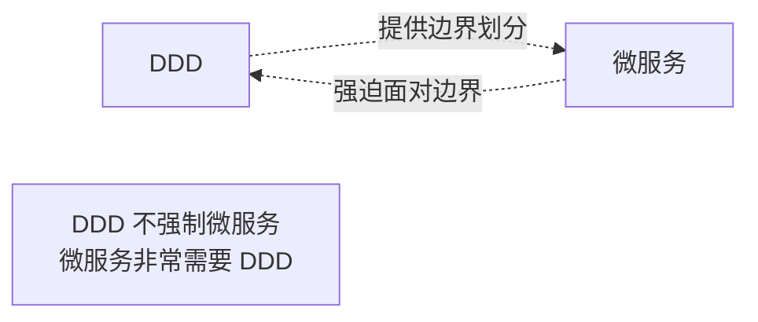
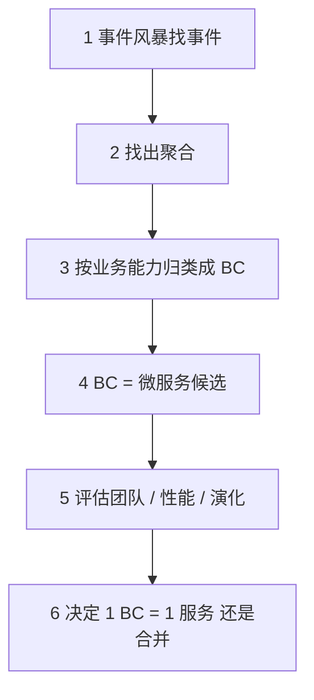
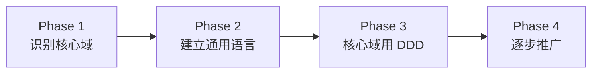

# DDD · 反模式与最佳实践

> 常见反模式 / 团队误区 / 与微服务的关系 / 落地路径 / 渐进式引入

> 本篇是 DDD 系列的收官，沉淀真实项目落地的踩坑经验

## 一、最常见的 DDD 反模式

### 1.1 贫血模型（Anemic Domain Model）

```go
// ❌ 反例
type Order struct {
    ID, CustomerID, Status string
    Items []Item
    TotalAmount int64
}

// 业务全在 Service
type OrderService struct{}
func (s *OrderService) Cancel(o *Order) {
    if o.Status != "Created" && o.Status != "Paid" { return }
    o.Status = "Cancelled"
}
```

**症状**：实体只有字段没有方法，业务规则散在 Service。

**问题**：
- 实体退化为数据袋
- 业务规则跑遍 Service，重复代码多
- 外部代码可绕过校验直接 `o.Status = "X"`

**修复（充血模型）**：
```go
func (o *Order) Cancel() error {
    if !o.CanBeCancelled() { return errors.New("不允许取消") }
    o.Status = "Cancelled"
    o.UpdatedAt = time.Now()
    return nil
}
```

**判断**：实体方法少于 3 个 → 八成是贫血。

### 1.2 上帝聚合（God Aggregate）

```go
// ❌ 反例
type Order struct {
    ID string
    Customer Customer    // 整个 Customer 聚合
    Payment Payment      // 整个 Payment 聚合
    Logistics Logistics  // 整个 Logistics 聚合
    Items []Item         // 100 个 Item
    History []HistoryRecord  // 1000 条历史
}
```

**症状**：一个聚合包含所有相关业务对象，加载即崩。

**修复**：
- 跨聚合用 **ID 引用**（`CustomerID` 不是 `Customer`）
- 子集合无界 → 拆独立聚合
- 历史记录走独立查询

### 1.3 仓储泄漏（Leaky Repository）

```go
// ❌ 反例
type OrderRepository interface {
    SaveOrder(o *Order) error
    SaveOrderItem(item *OrderItem) error  // 暴露聚合内部
    UpdateOrderStatus(id, status string) error  // 业务操作伪装成 CRUD
    QueryOrdersByCustomer(custID string) ([]Order, error)  // 查询泄漏
}
```

**症状**：Repository 接口变 DAO，包含业务方法和细粒度操作。

**修复**：
```go
// 只对聚合根读写
type OrderRepository interface {
    Save(ctx context.Context, order *OrderDO) error
    FindByID(ctx context.Context, id string) (*OrderDO, error)
}
```

业务规则在聚合根方法里，查询用专门的 QueryService（CQRS 读侧）。

### 1.4 事务跨聚合

```go
// ❌ 反例
func (s *Service) PayOrder(...) error {
    tx := db.Begin()
    order.MarkAsPaid()
    tx.Save(&order)
    tx.Save(&Payment{...})  // 跨聚合
    tx.Save(&Stock{...})    // 跨聚合
    tx.Commit()
}
```

**症状**：一个数据库事务里改多个聚合。

**修复**：拆分事务，跨聚合用事件 / Saga 最终一致。**铁律：一个事务一个聚合**。

### 1.5 通用语言只是文档

```
[术语表] 客户 Customer
[代码] type UserDTO struct{}
       type UserDO struct{}
       func GetUserByID()
       func CreateUserOrder()
[业务沟通] "订单是哪个客户下的？"
[开发回应] "你说哪个客户？UserDTO 还是 OrderUser？"
```

**症状**：术语表写一套，代码用另一套。

**修复**：
- 术语表的词必须出现在**包名 / 类型名 / 方法名 / 字段名 / 数据库列名**
- Code review 把"未对齐术语"列为必查项

### 1.6 拒绝建模直接画 ER 图

```
团队会议:
"先建数据库表，order 表 → order_item 表 → user 表"
"加上外键，OK，开干"
```

**症状**：把数据库设计当领域建模，业务规则缺失。

**修复**：
- 先做**事件风暴**找出领域事件、命令、聚合
- 再画聚合关系图
- 最后才落库（库 schema 服从聚合，不是反过来）

### 1.7 上下文边界形同虚设

```go
// internal/order/  ← 订单上下文
import "internal/payment/entity"  // ❌ 直接 import 别的 BC 实体
import "internal/stock/repository"  // ❌ 跨 BC 拿仓储
```

**症状**：包名上分了 BC，代码里互相 import 实体和仓储。

**修复**：
- BC 之间通过 **接口** 或 **事件** 通信
- 跨 BC 用 **防腐层** 翻译模型
- 严禁直接 import 别的 BC 的领域对象

### 1.8 把所有子域都用 DDD

```
[团队] 公司 5 个项目，全部用 DDD 架构
[结果] 简单的字典服务也搞了 4 层 + 聚合 + 仓储 + 应用服务
       开发慢 3 倍，团队骂街
```

**症状**：DDD 平摊到所有项目，包括简单 CRUD。

**修复**：
- **核心域**：DDD 充血 + 资深团队
- **支撑域**：简化 DDD 或直接 CRUD
- **通用域**：买现成 / 开源

详见 [01-strategic-design.md](01-strategic-design.md) 子域分类。

### 1.9 微服务粒度等于聚合粒度

```
[团队] 1 个聚合 = 1 个微服务
[结果] 几十个微服务，跨服务调用爆炸
       简单业务变分布式事务 nightmare
```

**症状**：把"聚合"等同于"服务"，导致服务过细。

**修复**：
- **限界上下文 ≈ 微服务**（不是聚合）
- 一个 BC 内可以有多个聚合
- 服务粒度 = BC 粒度

### 1.10 事件用同步 Publish + 业务回滚

```go
// ❌ 反例
func (s *Service) PayOrder(...) error {
    s.repo.Save(&order)            // DB 已 Commit
    s.bus.Publish(OrderPaid)       // 失败了也回不去
}
```

**症状**：业务事务和事件发布无原子性。

**修复**：用 **Outbox 模式**：
- 事件和业务写到同一事务（写到 outbox 表）
- 独立任务读 outbox 发 MQ
- 失败重试 + 幂等

## 二、团队层面的误区

### 2.1 误区：DDD 是技术问题

**真相**：DDD 首先是**业务问题**，再是技术问题。

- 没有业务专家参与 = 学不到通用语言
- 没有跨角色沟通 = 限界上下文划不清
- 只是开发自嗨 = 重新发明三层架构

### 2.2 误区：DDD 包治百病

**真相**：DDD 适合**业务复杂的核心域**，不是万能药。

| 场景 | 用 DDD 吗？ |
| --- | --- |
| 订单/支付/风控核心 | ✅ |
| 简单 CRUD（字典、配置） | ❌ |
| 数据迁移工具 | ❌ |
| 报表系统（CQRS 读侧足矣） | ⚠️ |
| 团队没人懂 DDD | ❌ 学习成本高于收益 |

### 2.3 误区：架构定了就不能改

**真相**：DDD 是**演进式架构**，边界和聚合会随业务发展调整。

- 初期：1 个 BC，3 个聚合
- 1 年后：拆成 3 个 BC，10 个聚合
- 演化是**正常**的，事件风暴定期重做

### 2.4 误区：所有团队成员都得是 DDD 专家

**真相**：核心 1-2 人理解透即可，其他人按规范执行。

- **架构师**：定边界、定通用语言
- **核心工程师**：维护聚合、领域服务
- **其他人**：按目录规范写应用服务、Handler、Mock 测试

### 2.5 误区：用了 DDD 不能写 SQL

**真相**：CQRS 读侧、报表查询、批处理都可以直接 SQL，不必经过聚合。

```go
// 读侧专用
type OrderQueryService struct { db *gorm.DB }
func (s *OrderQueryService) ListByCustomer(custID string) ([]OrderListDTO, error) {
    var list []OrderListDTO
    s.db.Raw(`SELECT ... FROM v_order_list WHERE customer_id = ?`, custID).Scan(&list)
    return list, nil
}
```

聚合是为**写侧**设计的，读侧另辟蹊径。

### 2.6 误区：必须用事件溯源

**真相**：CQRS / ES / DDD **三者独立**，按需用。

- DDD：建模 + 聚合
- CQRS：读写分离（不强制 ES）
- ES：事件作为唯一真源

最常见的轻量 DDD 项目是 **DDD + 主从读写分离**，不上 ES。

### 2.7 误区：领域层不能有 GORM 标签

**真相**：**有争议**，务实派可以保留。

- 严格派：领域层不能依赖任何 ORM 元素
- 实用派：标签可以打，避免 DAO 双层映射开销

底线：**绝不依赖 *gorm.DB 类型**。`ddd_order_example` 选实用派。

## 三、DDD 与微服务的关系

### 3.1 互相需要但不互相绑定



- DDD 单体应用完全可以
- 微服务**没有 DDD** 几乎一定会失败（边界乱）

### 3.2 划分服务 = 划分限界上下文



不是按表/功能/UI 模块拆，按**业务能力**拆。

### 3.3 服务粒度的判断

| 信号 | 含义 |
| --- | --- |
| 经常一起改 | 应该合并 |
| 强一致需求 | 应该合并（事务边界） |
| 不同团队 | 倾向拆开（康威定律） |
| 性能瓶颈差异大 | 倾向拆开（独立扩缩容） |
| 部署频率差异大 | 倾向拆开（独立发布） |

### 3.4 DDD 让微服务从"乱拆"变"敢拆"

没有 DDD 的微服务：
- 拆得过细（每个表一个服务）
- 拆得过粗（一个服务装下整个业务）
- 跨服务事务地狱
- 通用语言混乱

有 DDD 的微服务：
- 边界清晰（每个 BC 一个候选服务）
- 通用语言一致（API/事件 schema 对齐）
- 事务在聚合内，跨服务用 Saga / 事件

## 四、渐进式引入 DDD

### 4.1 不要一步到位



### 4.2 Phase 1：识别核心域（1 周）

- 列业务能力清单
- 标记核心 / 支撑 / 通用
- 选 **1 个核心域** 作为试点

### 4.3 Phase 2：建立通用语言（2-4 周）

- 业务专家 + 开发 + 产品坐下来
- 整理术语表（Glossary）
- 跑一次事件风暴
- 输出限界上下文图

### 4.4 Phase 3：核心域用 DDD（1-3 月）

- 选定核心 BC
- 建立四层架构 + 聚合 + 仓储
- 引入 DDD 包结构（如 `ddd_order_example` 的 `domain/<bc>` `application` `infrastructure` `interface`）
- 写第一批 mock 测试

### 4.5 Phase 4：逐步推广（持续）

- 其他核心 BC 复制成功经验
- 支撑域简化版 DDD
- 通用域不强求

### 4.6 团队学习路径

| 阶段 | 推荐 |
| --- | --- |
| 入门 | 《领域驱动设计精粹》Vaughn Vernon（薄、可读性好） |
| 进阶 | 《实现领域驱动设计》（红宝书）Vaughn Vernon |
| 经典 | 《领域驱动设计》（蓝宝书）Eric Evans |
| 实战 | github.com/go-kratos/kratos 源码 |
| 中文 | 阿里 COLA 架构 / 腾讯 DDD 实践 |

## 五、落地避雷指南

### 5.1 检查清单

```
□ 业务专家参与了通用语言定义吗？
□ 上下文边界用包/服务清晰隔离了吗？
□ 聚合根是否承担了业务行为（不只字段）？
□ 一个事务是否只修改一个聚合？
□ Repository 是否只暴露聚合根操作？
□ 跨聚合是否用事件 / 应用服务编排？
□ 跨 BC 是否用接口 + 防腐层？
□ DTO 是否在 interface 层翻译？
□ 错误是否在边界翻译并保留 chain？
□ 关键聚合是否有乐观锁？
□ 事件发布是否考虑了 Outbox？
□ 单元测试是否 mock 了基础设施接口？
□ 简单 CRUD 是否避开了 DDD？
□ 子域分类（核心/支撑/通用）是否清晰？
```

### 5.2 代码 Review 必查

- 实体方法 / 字段比 < 1 → 贫血嫌疑
- Repository 接口出现非聚合根方法 → 泄漏
- Service 里 `if status == X` 业务规则 → 应该挪到聚合根
- 同事务多个 `Save` → 跨聚合
- DTO 出现在 application/domain 层 → 渗透
- BC A 直接 import BC B 的实体 → 边界破坏

### 5.3 性能与一致性平衡

| 场景 | 一致性 | 实现 |
| --- | --- | --- |
| 同聚合内修改 | 强 | DB 事务 |
| 同 BC 跨聚合 | 最终（毫秒-秒） | 事件总线 / 应用服务编排 |
| 跨 BC 跨服务 | 最终（秒-分） | 集成事件 + Saga |
| 报表 / 搜索 | 最终（分钟） | CQRS 读侧异步同步 |

不要追求所有场景强一致，理解业务能容忍的延迟。

## 六、面试高频题

**Q1：DDD 最常见的反模式有哪些？**

| 反模式 | 症状 |
| --- | --- |
| 贫血模型 | 实体只有字段，业务在 Service |
| 上帝聚合 | 聚合无边界，加载即崩 |
| 仓储泄漏 | Repository 像 DAO，暴露聚合内部 |
| 事务跨聚合 | 一事务多聚合 Save |
| 通用语言只是文档 | 代码命名和术语表不对齐 |
| 直接画 ER | 用表设计代替领域建模 |
| BC 边界形同虚设 | 跨 BC 直接 import |

**Q2：什么时候不该用 DDD？**

- 简单 CRUD
- 数据迁移类
- 团队没人懂 DDD（学习成本高于收益）
- 通用域 / 工具域

**Q3：DDD 和微服务什么关系？**

- 互相需要但不绑定
- DDD 单体可以
- 微服务**非常需要** DDD（否则边界乱）
- **限界上下文 ≈ 微服务**（不是聚合）

**Q4：怎么渐进式引入 DDD？**

四阶段：
1. 识别核心域（1 周）
2. 建通用语言（2-4 周）
3. 核心域试点（1-3 月）
4. 逐步推广（持续）

不要一步到位。

**Q5：领域层加 GORM 标签可以吗？**

**有争议**：
- 严格派：不能
- 实用派：可以

底线：**绝不依赖 *gorm.DB 类型**。

**Q6：DDD 项目怎么测？**

测试金字塔：
- **单元测试**：mock 基础设施接口（Repository、外部 API），上层组件用真实对象
- **集成测试**：真实 DB / 外部依赖
- **端到端**：少量关键路径

`gomock` + 真实组合是常见做法。

**Q7：聚合根的边界怎么判断？**

三个判断点：
- 必须**同时变更**保业务规则 → 同聚合
- 可**稍后一致** → 不同聚合
- **独立生命周期** → 独立聚合

依据是**业务不变量**，不是数据库外键。

**Q8：DDD 中 SQL 还能用吗？**

**能**。
- 写侧：通过 Repository → 聚合
- 读侧 / 报表：直接 SQL（CQRS 读侧）
- 批处理：直接 SQL

聚合是为写侧设计的。

**Q9：跨 BC 怎么通信？**

- 同进程：**接口 + 防腐层适配器**
- 跨进程：**集成事件 / RPC + ACL**

**绝不直接共享实体**。

**Q10：DDD 学习曲线很陡，怎么团队推广？**

- 核心 1-2 人吃透
- 选试点项目，做出成功样板
- 写规范 + 代码模板（如 `ddd_order_example`）
- 每月 review，持续纠偏
- 不强推到所有项目

## 七、面试加分点

- DDD 是**业务问题**，不是单纯技术
- 反模式记忆：**贫血 / 上帝聚合 / 仓储泄漏 / 跨聚合事务 / 通用语言失守**
- **限界上下文 ≈ 微服务**，**不是聚合 = 服务**
- **不是所有项目都用 DDD**，按**子域分类**决定（核心/支撑/通用）
- 渐进式引入：**识别 → 通用语言 → 核心试点 → 推广**
- 团队 1-2 人懂 DDD 即可，**不要全员专家**
- DDD ≠ 必须 ES + CQRS，**轻量 DDD 是常态**
- **聚合是为写侧设计的**，读侧用 CQRS / 直接 SQL
- 演进式架构：边界和聚合**会随业务调整**
- 跨 BC 用**接口 + 防腐层** / **集成事件 + 版本化**
- 关键聚合带**乐观锁**（GORM `optimisticlock.Version`）
- 事件发布用 **Outbox 模式** 解决业务和事件原子性
- 真实项目证明：DDD 的真正价值是**让代码贴近业务**，团队跨角色用同一种语言
