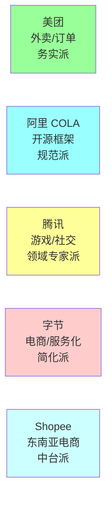
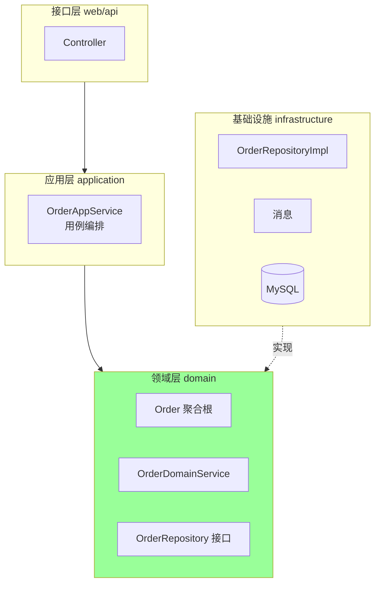
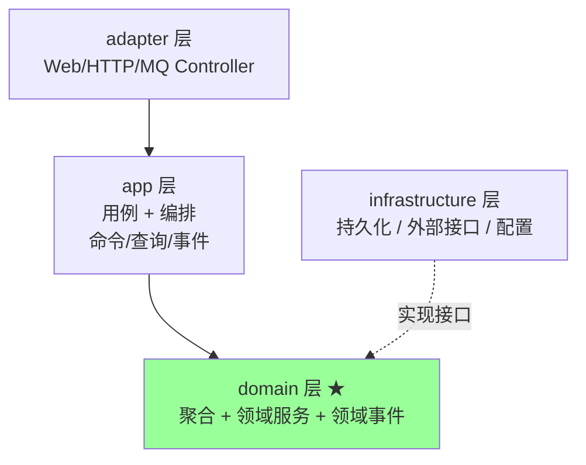
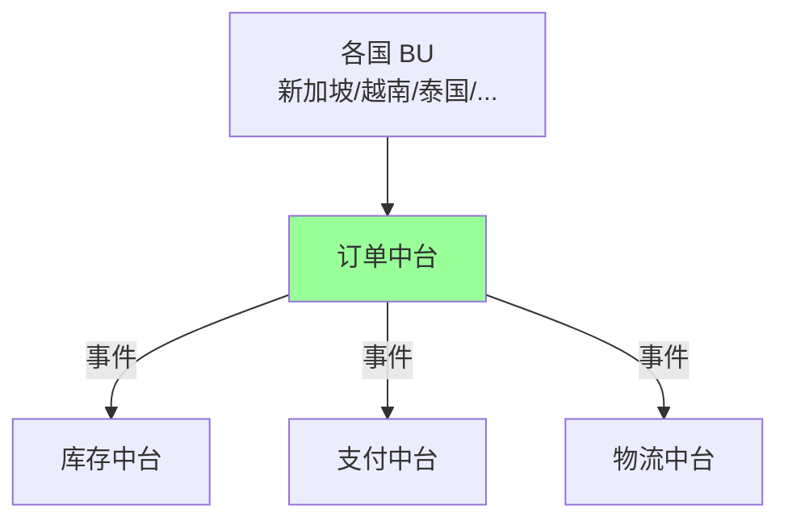
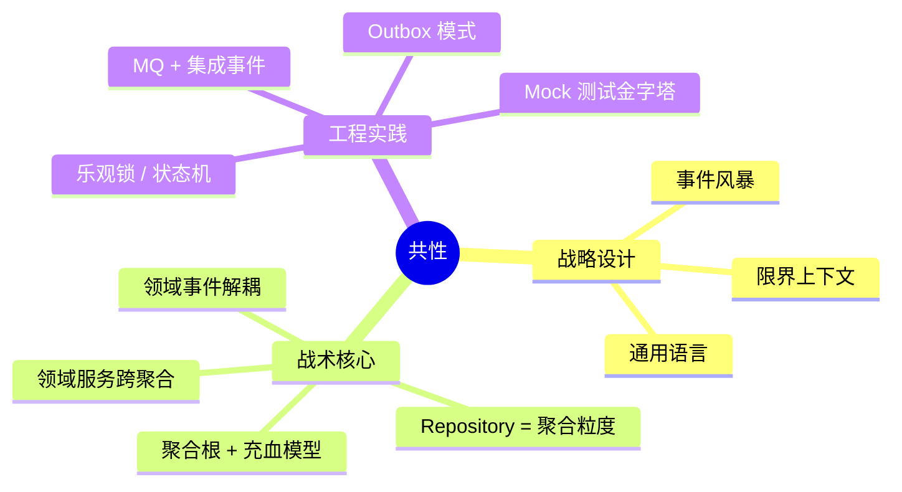
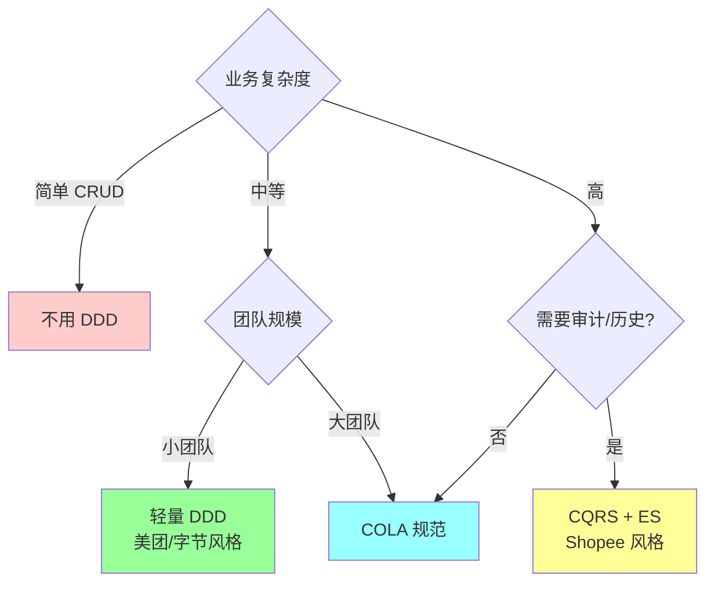

# DDD · 大厂案例对比

> 美团 / 阿里 COLA / 腾讯 / 字节 / Shopee 公开实践概要 + 可借鉴模式

> 本篇聚焦"各家怎么落地 DDD"，不涉及代码细节。每家给出**背景 / 架构特点 / 命名约定 / 借鉴点 / 原始资料**

## 一、整体对比一览



| 公司 | 业务背景 | 风格 | 是否开源 | 落地深度 |
| --- | --- | --- | --- | --- |
| **美团** | 外卖/到店/订单 | 务实四层 + 充血模型 | ❌ 仅博客 | ⭐⭐⭐⭐⭐ |
| **阿里 COLA** | 通用业务框架 | Clean Arch + DDD + CQRS | ✅ GitHub | ⭐⭐⭐⭐⭐ |
| **腾讯** | 游戏/社交/支付 | 战略 DDD + 微服务 | 部分开源（TARS） | ⭐⭐⭐⭐ |
| **字节** | 电商/服务化 | 简化版 + 工程效率 | ❌ 多为内部分享 | ⭐⭐⭐ |
| **Shopee** | 东南亚电商 | 中台 + DDD + Event Sourcing | ❌ 技术分享 | ⭐⭐⭐⭐ |

## 二、美团：务实派 DDD

### 2.1 业务背景

- 外卖、到店、酒旅、闪购等多业态
- 高并发交易（订单/支付/履约）
- 多团队协同，C 端 / B 端混合

### 2.2 公开实践要点

**核心方法论**：
- 把 **DDD 战略 + 战术** 都用上，不只是包名重组
- 强调**事件风暴**作为前期对齐工具
- 落地文章公开较多，业内引用率高

**典型架构（外卖订单）**：



**特点**：
- 聚合根承担**完整业务规则**（充血模型）
- 限界上下文按"订单 / 履约 / 营销 / 评价"切分
- 跨上下文用 **MQ + 领域事件**，订单核心写库 + 多消费者读取
- 复杂状态机（订单 30+ 状态）封装到聚合根

**踩过的坑**：
- 早期单体大泥球，订单/履约/营销代码纠缠
- 通用语言不统一，不同团队对"订单"理解不同
- 做事件风暴 + 限界上下文重构后才理顺

### 2.3 命名约定

```
order-service/
├── api/                    # 对外 API（Thrift/HTTP）
├── application/            # 应用服务
├── domain/                 # 领域模型
│   ├── order/              # Order 聚合
│   │   ├── Order.java
│   │   ├── OrderRepository.java
│   │   └── OrderDomainService.java
│   └── shared/
├── infrastructure/         # 基础设施
└── interfaces/             # 接口适配器
```

### 2.4 可借鉴点

- **事件风暴 + 通用语言** 作为团队启动必备
- **充血聚合 + 状态机** 处理复杂订单流转
- **MQ 解耦上下文**，写库一份多读
- 务实，**不强求 ES 不强求 CQRS**

### 2.5 原始资料

- 美团技术博客：[领域驱动设计在互联网业务开发中的实践](https://tech.meituan.com/2017/12/22/ddd-in-practice.html)
- 美团技术博客：[复杂业务系统的架构设计](https://tech.meituan.com)（搜 DDD 关键字）
- InfoQ / GIAC 演讲若干

## 三、阿里 COLA：开源规范派

### 3.1 项目背景

- **COLA** = Clean Object-oriented & Layered Architecture
- 张建飞主导，阿里巴巴开源
- 当前版本 v5（截至 2026 年初仍在维护）
- GitHub: https://github.com/alibaba/COLA

### 3.2 核心理念

**两件事**：
1. **COLA 架构**：组织代码的结构（Clean Arch + DDD + CQRS 融合）
2. **COLA Components**：可复用组件（DTO / 异常 / 状态机 / 测试）

### 3.3 四层架构（v4+）



| 层 | 职责 | 命名 |
| --- | --- | --- |
| adapter | 入口适配（HTTP/MQ） | `XxxController` |
| app | 用例编排（CQRS） | `XxxCmdExe` / `XxxQryExe` |
| domain | 领域模型 | `XxxEntity` / `XxxDomainService` |
| infrastructure | DB / RPC | `XxxRepositoryImpl` |

### 3.4 命名约定（特色）

- **CmdExe / QryExe**：把 CQRS 落到包结构，写命令、读查询分开
- **DomainService / Entity**：核心领域对象不带 `DTO` `DO` 这种基础设施味
- **StateMachine 组件**：标准状态机，订单/审批等场景开箱即用
- **BizException / SysException**：业务异常和系统异常分类

### 3.5 与 ddd_order_example 的对比

| | COLA | ddd_order_example |
| --- | --- | --- |
| 层数 | 4 层（adapter/app/domain/infra） | 4 层（interface/application/domain/infrastructure） |
| 命名 | `Entity` / `CmdExe` | `OrderDO` / `OrderService` |
| CQRS | 包结构强制分 | 未强制 |
| 状态机 | 自带组件 | 聚合根方法 |
| 异常 | BizException / SysException | 直接 errors.New |
| 语言 | Java | Go |

**思路一致**，COLA 更规范化和组件化，适合大团队统一标准。

### 3.6 可借鉴点

- **包结构 = 架构**：看目录就知道架构（adapter/app/domain/infrastructure）
- **CQRS 落到包**：cmd/query 显式分开
- **状态机组件化**：避免每个项目重复造轮子
- **异常分类**：业务 vs 系统异常，错误处理规范化

### 3.7 原始资料

- GitHub: [alibaba/COLA](https://github.com/alibaba/COLA)
- 张建飞《代码精进之路：从码农到工匠》
- 阿里技术公众号：COLA 系列文章
- 社区实现：[eden-demo-cola](https://github.com/shiyindaxiaojie/eden-demo-cola)

## 四、腾讯：领域专家派

### 4.1 业务背景

- 游戏（王者荣耀 / 和平精英 / 营地）
- 社交（微信 / QQ）
- 支付（财付通）
- 复杂规则 + 强一致 + 海量并发

### 4.2 公开实践要点

腾讯 DDD 公开案例较散，主要分布在：
- **游戏中台**：玩家档案 / 战绩 / 社交关系等领域建模
- **微信支付**：交易 / 清结算 / 风控
- **TARS 框架** + DDD 微服务化

**特点**：
- 重视**领域专家**参与建模（业务复杂度高）
- 战略设计为主，战术落地各项目自定
- 强调**性能** + **强一致**，常和分布式事务、分库分表配合

### 4.3 典型模式：游戏档案聚合

```
玩家上下文（Player BC）
├── PlayerProfile 聚合     // 基本资料
├── PlayerStats 聚合       // 战绩统计
├── PlayerSocial 聚合      // 好友/公会关系
└── PlayerInventory 聚合   // 道具/背包
```

**关键设计**：
- 大玩家概念**拆成多个聚合**，避免上帝聚合
- 战绩高频写 → 独立聚合 + 高性能 KV 存储
- 社交关系图 → 图数据库
- 通过**玩家 ID 引用**而非对象引用

### 4.4 可借鉴点

- **大业务概念拆多聚合**（玩家不是一个聚合）
- **不同聚合用不同存储**（KV / 图 / 关系型）
- **领域专家深度参与**（游戏策划 + 程序）
- TARS + DDD 的微服务粒度划分

### 4.5 原始资料

- 腾讯云开发者社区：搜"DDD"
- TARS GitHub: https://github.com/TarsCloud
- 腾讯游戏学院公开课
- KM（腾讯内网）外发的 DDD 分享 PPT

## 五、字节跳动：简化派

### 5.1 业务背景

- 抖音 / TikTok / 头条 / 飞书 / 电商
- 服务化彻底（万级微服务）
- 工程效率优先，业务迭代快

### 5.2 公开实践要点

字节 DDD 公开较少，从分享和招聘 JD 推断：
- **不强推 DDD 全套**，更偏 Clean Arch / 端口适配器
- 服务粒度细，BC ≈ 服务
- **代码生成 + 模板**降低 DDD 学习成本
- Kitex (RPC) + DDD 简化版

### 5.3 典型简化结构

```
service-name/
├── biz/                    # 业务（领域 + 应用合并）
│   ├── service/            # 应用服务
│   ├── domain/             # 领域逻辑
│   └── dal/                # 数据访问
├── conf/
└── main.go
```

**特点**：
- 不强制 4 层（biz 子目录可灵活）
- 重视**接口契约**（IDL/Thrift）作为 BC 边界
- DDD 思想用，但不用 DDD 八股名词

### 5.4 可借鉴点

- **简化包结构**，不要为分层而分层
- **接口契约即 BC 边界**（IDL/Proto 优先）
- **代码生成 + 模板**降低落地门槛
- 工程效率 > 教条主义

### 5.5 原始资料

- 字节技术团队 / 字节跳动技术博客
- Kitex GitHub: https://github.com/cloudwego/kitex
- HertZ / CloudWeGo 系列开源
- InfoQ / QCon 字节专场演讲

## 六、Shopee：中台派

### 6.1 业务背景

- 东南亚最大电商
- 多国多语言多币种（极复杂的国家差异）
- 中台架构（订单 / 商品 / 营销 / 履约 中台）

### 6.2 公开实践要点

Shopee 工程团队在 InfoQ 等场合分享：
- **DDD + 微服务中台**
- 订单中心采用 **CQRS + 事件溯源**（订单状态机复杂）
- 用 Kafka + Outbox 模式解决业务和事件原子性
- 多国差异通过**策略模式 + 上下文映射**隔离

### 6.3 典型架构：订单中台



**关键设计**：
- 订单聚合用 **ES + Snapshot**，支持任意时间点状态还原
- 跨中台用 **Kafka 集成事件**，事件版本化
- BU 差异用**策略 + 上下文映射**隔离，订单中台核心不变
- 大量 **Outbox 模式**保证事件可靠投递

### 6.4 可借鉴点

- **复杂状态机 + 历史溯源** 用 ES
- **多国/多业务差异** 用策略模式隔离
- **集成事件 + Outbox + 版本化** 是大流量系统标配
- 中台与业务方的边界用 BC + ACL 严格隔离

### 6.5 原始资料

- Shopee Engineering Blog
- InfoQ Shopee 专题
- ArchSummit / QCon 演讲

## 七、共性 vs 差异

### 7.1 共性（大厂共识）



**所有大厂都做**：
- 事件风暴对齐通用语言
- 聚合根承担业务规则（充血）
- 跨上下文用事件 + ACL
- 状态机封装在聚合根
- 集成事件版本化

### 7.2 差异

| 维度 | 务实派（美团/字节） | 规范派（阿里 COLA） | 极致派（Shopee） |
| --- | --- | --- | --- |
| 包结构 | 灵活 | 强约束 | 中 |
| CQRS | 按需 | 强制（cmd/qry） | 标配 |
| ES | 不用 | 不强制 | 关键聚合用 |
| 状态机 | 聚合根方法 | 组件化 | 组件化 |
| 团队成本 | 中 | 高（需培训） | 高（需懂 ES） |
| 适合 | 中小团队 | 大团队统一 | 复杂业务 |

### 7.3 选型建议



## 八、面试聊大厂案例的几个角度

### 8.1 切入角度

不要背案例细节，而是从**自己经验出发对比**：

> "我们团队用的是类似美团务实派的做法（DDD 战略 + 充血聚合 + MQ 解耦），但聚合粒度比他们细。和阿里 COLA 比，我们没强制 CQRS，因为业务读写比例不悬殊..."

### 8.2 高频追问

**Q：你们为什么不用 COLA？**

A：评估过，但 COLA 包结构对小团队偏重，且自带组件多为 Java 生态，我们 Go 用类似思路自己组织：domain / application / infrastructure / interface。

**Q：什么时候你会推荐用 ES？**

A：业务有强审计需求（金融/合规）、订单状态机极复杂（如 Shopee 跨国订单）、需要时间旅行回溯 bug。普通业务不上 ES。

**Q：大厂都用 DDD，你为什么不用？**

A：DDD 不是万能。简单 CRUD / 工具服务 / 数据迁移用 DDD 是过度设计。大厂的核心域才上 DDD，支撑/通用域他们也是 CRUD。

**Q：怎么看待 COLA 这种框架？**

A：好处是统一规范，新人上手快；代价是灵活性低、绑定 Java/Spring 生态。Go 项目有等价思路就够，不必照搬。

### 8.3 加分回答模板

> "我了解过美团、阿里 COLA、腾讯游戏的 DDD 实践。共性是**事件风暴 + 充血聚合 + 集成事件 + Outbox**；差异在**包结构强制度**和**是否上 CQRS/ES**。我自己倾向务实派——边界清晰、聚合充血、跨 BC 用事件，但不为分层而分层。比如我们项目..."

## 九、原始资料汇总

| 公司 | 资料链接 |
| --- | --- |
| 美团 | [tech.meituan.com](https://tech.meituan.com) DDD 系列 |
| 阿里 COLA | [github.com/alibaba/COLA](https://github.com/alibaba/COLA) |
| COLA 实战 | [github.com/shiyindaxiaojie/eden-demo-cola](https://github.com/shiyindaxiaojie/eden-demo-cola) |
| 腾讯 | [cloud.tencent.com/developer](https://cloud.tencent.com/developer) DDD 标签 |
| 腾讯 TARS | [github.com/TarsCloud](https://github.com/TarsCloud) |
| 字节 | [github.com/cloudwego](https://github.com/cloudwego) 系列 |
| Shopee | Shopee Engineering Blog / InfoQ 专题 |
| 经典书 | 《领域驱动设计》Eric Evans / 《实现领域驱动设计》Vaughn Vernon / 《代码精进之路》张建飞 |
| 国外大厂 | Microsoft eShopOnContainers / Netflix DDD 实践 / Uber Domain-Oriented Microservices |

## 十、面试加分点

- 不背案例**细节**，而是**对比共性和差异**
- 共性：**事件风暴 + 充血聚合 + 集成事件 + Outbox**
- 差异：**包结构强制度** + **CQRS/ES 是否上**
- COLA 是 **Java 生态规范派**，Go 项目可借思路不必照搬
- 美团是**务实派**代表，可作为中小团队样板
- Shopee 是 **CQRS + ES** 实战代表，复杂状态机可参考
- 腾讯做法启示：**大业务概念拆多聚合**（玩家不是一个聚合）
- 字节启示：**简化包结构 + 接口契约即 BC 边界**
- 永远先问：**业务复杂度配不配上 DDD**？不配就别用
- 推荐回答模板："共性是 X，差异是 Y，我倾向 Z 因为..."
