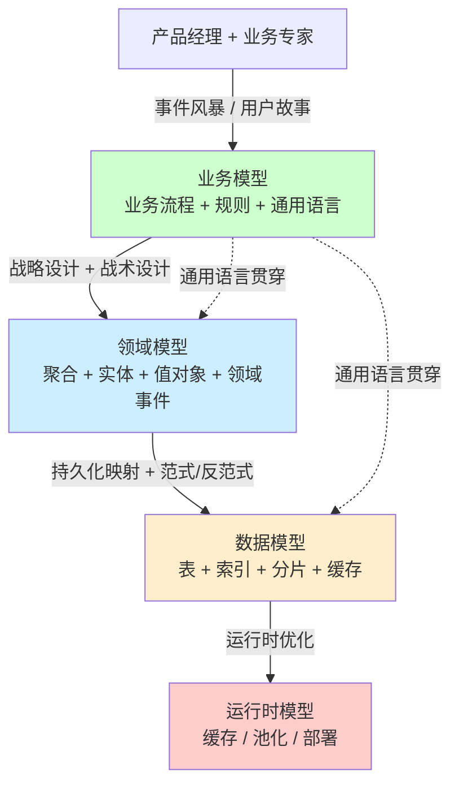

# 业务模型 vs 领域模型 vs 数据模型(三层映射)

> 资深面试和架构评审里,"业务模型 / 领域模型 / 数据模型"是高频混淆概念——大多数人把它们当一回事,或者只画了一个表 ER 图就以为做完了"建模"。
>
> **一句话先记住**:**业务模型回答"做什么"(What)、领域模型回答"怎么想"(How to think)、数据模型回答"怎么存"(How to store)**——三层一一映射但**绝不等价**,DDD 的核心价值之一就是让这三层不再混淆。

## 〇、核心提炼(5 段式)

### 核心机制(4 条必背)

1. **业务模型**(Business Model)— 业务专家视角,用**领域语言**描述业务流程、规则、角色、价值流转,**不含技术词汇**
2. **领域模型**(Domain Model)— 软件设计视角,把业务模型转化为**实体/值对象/聚合/领域事件/领域服务**等代码可表达的结构
3. **数据模型**(Data Model)— 存储工程师视角,把领域模型**持久化**到具体存储(MySQL 表/Redis KV/MongoDB 文档/ES 索引)
4. **三者映射不是 1:1** — 一个聚合可能拆成多张表(范式),一个业务概念可能跨多个聚合(限界上下文),一张表可能服务多个查询(读模型 CQRS)

### 核心本质(必懂)

> 三层模型的本质是**"关注点分离 + 阻抗匹配"**:
>
> - **业务专家**只关心"订单要不要支持部分退款",不关心你用 MySQL 还是 Mongo
> - **架构师**要把业务概念翻译成**对象模型**(订单聚合 / 退款值对象 / 退款发起事件)
> - **DBA / 存储工程师**要解决"订单一天 1000 万写入怎么分库分表"的具体物理问题
>
> **如果三层混在一起会怎样**:
> - **业务模型 = 数据模型**(贫血模型)→ 业务规则散落在 Service 层,代码不可读、不可演进(MVC 反模式)
> - **领域模型 = 数据模型**(用 ORM 实体直接当领域对象)→ 领域被 ORM 关系绑架,无法重构存储
> - **业务模型 = 领域模型**(没翻译过程)→ 业务专家说"VIP 用户",代码里到处是 `if user.level == 3`,通用语言名存实亡
>
> **DDD 的核心贡献**:用**限界上下文 + 通用语言 + 聚合**这套工具,让三层映射**可追溯、可演进**。

### 完整流程(面试必背)

```
业务建模 → 领域建模 → 数据建模 完整链路:

1. 业务建模(产品 + 业务专家主导)
   - 事件风暴(Event Storming)→ 识别业务事件、命令、聚合
   - 用户故事(User Story)→ 定义业务规则和验收标准
   - 业务流程图 → 角色 + 流程 + 价值流
   产物:**业务流程图 + 通用语言术语表 + 业务规则清单**

2. 领域建模(架构师主导)
   - 战略设计:核心域 / 支撑域 / 通用域 + 限界上下文
   - 战术设计:实体 / 值对象 / 聚合 / 领域事件 / 领域服务
   - 上下文映射:防腐层 / 共享内核 / 客户-供应商
   产物:**聚合图 + 限界上下文图 + 领域事件流**

3. 数据建模(架构师 + DBA)
   - 持久化选型:关系型(MySQL/PG)/ 文档型(Mongo)/ KV(Redis)/ 列存(ClickHouse)
   - Schema 设计:范式 vs 反范式 / 索引 / 分片键 / 冷热分离
   - 读写分离:CQRS 读模型(ES 宽表)/ 写模型(MySQL 聚合表)
   产物:**ER 图 + Schema DDL + 分片策略 + 缓存设计**

4. 运行时模型(可选,大厂资深加分)
   - 内存模型:对象生命周期 / 缓存策略 / 池化
   - 部署模型:服务边界 / 网络拓扑
```



### 4 条核心机制 - 逐点讲透

#### 1. 业务模型(Business Model)— 业务专家说的话

**是什么**:用**业务语言**描述业务流程、参与者、规则、价值流转的模型。

**关键产物**:
- **业务流程图**(BPMN / 泳道图):谁、什么时候、做什么、依赖什么
- **通用语言术语表**(Ubiquitous Language):每个业务术语的精确定义
- **业务规则清单**:"VIP 满 5 单可申请退款"这种业务规则
- **事件风暴产物**:领域事件 + 命令 + 聚合候选

**电商订单的业务模型示例**:

```
角色:买家 / 卖家 / 平台 / 支付方 / 物流方

业务流程:
  下单 → 锁库存 → 支付 → 发货 → 收货 → 售后

业务规则:
  - 用户下单后 30 分钟未支付,订单自动取消(库存返还)
  - 已发货 7 天内可申请退款(VIP 用户 15 天)
  - 一个订单的所有商品必须同一商家(跨店要拆单)
  - 售后必须有买家凭证

通用语言:
  - 订单(Order):一次下单产生的交易单据,不是购物车
  - 子订单(SubOrder):同一订单按商家拆分后的最小可发货单位
  - 库存锁定(Lock):下单成功但未支付时的暂时性占用
  - 履约(Fulfillment):从发货到收货的全过程
```

**特征**:
- ✅ **完全不含技术词汇**(没有"表"、"索引"、"接口")
- ✅ **业务专家能读懂**(他们就是这么说话的)
- ✅ **覆盖业务的所有规则和边界情况**

> **一句话总结**:业务模型 = **业务专家视角的业务描述**——只有流程/角色/规则/事件,**绝对不出现技术词汇**,产物是流程图+术语表+规则清单+事件风暴卡片。

#### 2. 领域模型(Domain Model)— 架构师怎么想

**是什么**:把业务模型转化为**面向对象 / 函数式可表达**的结构,用代码体现业务规则。

**关键产物**:
- **限界上下文**(Bounded Context):订单上下文、库存上下文、支付上下文……
- **聚合**(Aggregate):一致性边界(Order 聚合含 Order + OrderItem + 不含 Inventory)
- **实体**(Entity):有唯一标识(Order.id)
- **值对象**(Value Object):无标识、不可变(Money、Address)
- **领域事件**(Domain Event):OrderPlaced、PaymentReceived
- **领域服务**(Domain Service):跨聚合的业务逻辑

**电商订单的领域模型示例**:

```go
// 限界上下文:订单上下文(Order Context)

// 聚合根:Order(订单)
type Order struct {
    ID         OrderID          // 实体标识
    BuyerID    BuyerID
    Items      []OrderItem      // 子实体,只能通过 Order 访问
    Amount     Money            // 值对象
    Status     OrderStatus      // 值对象(枚举)
    CreatedAt  time.Time
    PaidAt     *time.Time
    events     []DomainEvent    // 领域事件
}

// 业务规则在聚合根方法内
func (o *Order) Pay(amount Money) error {
    if o.Status != OrderStatusPending {
        return ErrOrderNotPayable           // 业务规则:只有 Pending 状态可支付
    }
    if !amount.Equals(o.Amount) {
        return ErrAmountMismatch            // 业务规则:金额必须匹配
    }
    if time.Since(o.CreatedAt) > 30*time.Minute {
        return ErrOrderExpired              // 业务规则:30 分钟超时
    }
    o.Status = OrderStatusPaid
    now := time.Now()
    o.PaidAt = &now
    o.events = append(o.events, PaymentReceived{OrderID: o.ID, Amount: amount})
    return nil
}

// 子实体:OrderItem
type OrderItem struct {
    SKUID    SKUID
    Quantity int
    Price    Money
}

// 值对象:Money(不可变)
type Money struct {
    Amount   int64    // 分
    Currency string
}

// 领域事件
type PaymentReceived struct {
    OrderID OrderID
    Amount  Money
    At      time.Time
}
```

**特征**:
- ✅ **业务规则在领域对象内部**(充血模型,不是 Service 里的 if/else)
- ✅ **通用语言贯穿代码**(Order、SubOrder、Money 都是业务术语)
- ✅ **聚合保证一致性边界**(改 Order 必须通过 Order 方法,不能直接改 OrderItem)
- ✅ **领域事件解耦上下文**(发 PaymentReceived,库存上下文订阅扣库存)

> **一句话总结**:领域模型 = **架构师把业务模型翻译成代码可表达的对象结构**——核心是**聚合 + 通用语言 + 业务规则内化**,产物是聚合图+限界上下文图+领域事件流,**充血模型而非贫血 DTO**。

#### 3. 数据模型(Data Model)— DBA 怎么存

**是什么**:把领域模型**持久化**到具体存储,解决"放在哪、怎么查、怎么扩容"的物理问题。

**关键决策**:
- **存储选型**:关系型(强一致+事务)/ 文档(灵活 schema)/ KV(高并发)/ 列存(分析)
- **范式 vs 反范式**:3NF 减少冗余 vs 宽表降低 JOIN
- **分片键**:user_id / order_id / time(按业务查询模式定)
- **索引设计**:覆盖索引 / 联合索引 / 全文索引
- **冷热分离**:热数据 MySQL / 冷数据 ClickHouse
- **缓存策略**:Cache-Aside / Write-Through / 多级缓存

**电商订单的数据模型示例**:

```sql
-- 关系型存储(MySQL):事务保证 + 强一致
CREATE TABLE order_main (
    id              BIGINT PRIMARY KEY,         -- 雪花 ID,全局唯一+趋势递增
    buyer_id        BIGINT NOT NULL,
    amount_cents    BIGINT NOT NULL,            -- 整数分,不用 DECIMAL
    currency        CHAR(3) NOT NULL,
    status          TINYINT NOT NULL,           -- 1=pending 2=paid 3=shipped
    created_at      DATETIME NOT NULL,
    paid_at         DATETIME NULL,
    INDEX idx_buyer_created (buyer_id, created_at DESC),  -- 用户订单列表查询
    INDEX idx_status_created (status, created_at)         -- 超时订单扫描
) ENGINE=InnoDB
  PARTITION BY HASH(buyer_id) PARTITIONS 16;    -- 按买家分片

CREATE TABLE order_item (
    id              BIGINT PRIMARY KEY,
    order_id        BIGINT NOT NULL,
    sku_id          BIGINT NOT NULL,
    quantity        INT NOT NULL,
    price_cents     BIGINT NOT NULL,
    INDEX idx_order (order_id)
);

-- KV 缓存(Redis):高频热查询
-- order:detail:{order_id} → 订单详情 JSON(短 TTL)
-- order:list:{buyer_id}:{page} → 列表 ID 数组(中 TTL)
-- order:lock:{order_id} → 防超卖分布式锁

-- 读模型(Elasticsearch):宽表 + 多维搜索
-- 订单搜索 / BI 统计 / 卖家工作台 → 反范式宽表
```

**特征**:
- ✅ **物理优化主导**(分片键、索引、引擎选型)
- ✅ **一个聚合 ≠ 一张表**(Order 聚合 → order_main + order_item 两张表)
- ✅ **同一份数据可能多份**(MySQL 写、Redis 缓存、ES 搜索)
- ✅ **可演进**(领域模型不变,数据模型可以从单表 → 分库分表 → 引入 ES)

> **一句话总结**:数据模型 = **DBA/工程师视角的物理存储设计**——核心解决"放哪/怎么查/怎么扩",**一个聚合可能拆成多张表 + 多个存储(MySQL+Redis+ES)**,领域模型不变时可以独立演进。

#### 4. 三层映射:不是 1:1,而是"概念追溯 + 物理映射"

**典型映射模式**:

| 业务模型 | 领域模型 | 数据模型 |
| --- | --- | --- |
| "订单" | `Order` 聚合(含 `OrderItem` 子实体) | `order_main` + `order_item` 两张表 |
| "商品 SKU" | `SKU` 值对象(在订单上下文里) | order_item 表里的 sku_id + sku_snapshot_json(订单时刻快照)|
| "库存锁定" | `InventoryLock` 实体(在库存上下文里,通过领域事件触发) | inventory_lock 表 + Redis Lua 原子扣减 |
| "用户下单 30 分钟超时" | `Order.IsExpired()` 业务方法 + `OrderExpired` 领域事件 | 定时任务扫描 `order_main where status=1 and created_at < now-30min` |
| "VIP 满 5 单可退款" | `Buyer.CanRefund(orderCount)` 方法 + 防腐层 ACL 调用会员上下文 | 不在数据模型里!这是**业务规则,只在代码里** |

**关键洞察**:

```
❌ 错误做法:
  数据库表 = 领域模型(用 ORM 实体当 Domain Object)
  → 领域被存储绑架,改表 = 改业务
  → 业务规则散落在 Service 层(贫血模型)

❌ 错误做法:
  业务模型 = 数据模型(产品文档直接画 ER 图)
  → 跳过领域建模,业务规则没有代码归属
  → 后期演进时业务专家和工程师对不上话

✅ 正确做法:
  业务模型 → 领域模型(代码) → 数据模型(存储) 三层独立演进
  - 通用语言贯穿三层(订单就是 Order,不是 "tb_user_trans_record")
  - 业务规则只在领域模型(Order.Pay 方法内,不是 ER 图、不是 Service)
  - 数据模型可独立优化(加索引、分库、引入缓存)而不影响领域
```

> **一句话总结**:三层映射**绝不是 1:1**——一个聚合常拆成多张表,一个业务概念跨多个聚合,业务规则**只在领域模型代码里**(不在 ER 图、不在数据库约束);**通用语言贯穿三层**是连接的关键。

## 一、为什么这个区分如此重要(资深视角)

### 1.1 区分三层的现实价值

```
不区分的痛(贫血模型 + ORM 实体当领域对象):
  - 改表结构 = 改业务代码 = 改全链路 → 演进成本爆炸
  - 业务规则散落 Service / 数据库约束 / 触发器 → 找规则像考古
  - 业务专家看不懂代码 → 通用语言失效 → 需求传递失真
  - 引入新存储(如 ES)必须改全链路 → 因为 ORM 实体直接暴露给业务

区分三层的收益:
  - 业务变更 → 改领域模型(可能不动数据库)
  - 性能优化 → 改数据模型(领域不变)
  - 引入读模型(CQRS)→ 数据模型加 ES 宽表,领域模型零侵入
  - 跨团队对齐 → 业务/架构/DBA 各有清晰产物
```

### 1.2 资深面试场景:你会怎么回答?

**Q:你做过的项目,业务模型、领域模型、数据模型分别长什么样?**

```
弱回答(P5-):
  "我们用 MySQL 存订单表,Redis 缓存,有个 Order 类映射这张表"
  → 把三层混成一层,只描述了数据模型

中等回答(P6):
  "我们按 DDD 划分了订单上下文,Order 是聚合根,
   持久化用 MySQL,缓存用 Redis"
  → 提了领域模型但没讲业务规则归属

强回答(P7):
  "业务上订单要支持部分发货 + VIP 15 天退款,
   领域模型里 Order 聚合内置 IsRefundable() / SplitForShipment() 方法,
   通过领域事件 OrderShipped 通知库存上下文扣减;
   数据模型为了支持卖家工作台的多维搜索,
   把订单同步到 ES 做读模型(CQRS),
   写仍走 MySQL 保证事务,
   分片键用 buyer_id(用户中心场景占 80% 查询)"
  → 三层映射 + 业务规则归属 + 数据模型独立优化(CQRS) + 分片键决策依据
```

> **一句话总结**:三层区分**是 P6→P7 的分水岭**——P5 只懂数据模型(表设计),P6 懂领域模型(DDD 概念),**P7 必须能讲清三层映射 + 业务规则归属 + 数据模型可独立演进**。

## 二、典型混淆与反模式

### 2.1 反模式 1:贫血模型(业务模型 = 数据模型)

```go
// ❌ 贫血模型:Order 只是数据载体,所有业务规则在 Service
type Order struct {
    ID       int64
    BuyerID  int64
    Status   int
    Amount   int64
    // ... 一堆字段
}

type OrderService struct{}

func (s *OrderService) Pay(order *Order, amount int64) error {
    // 业务规则散落在 Service:
    if order.Status != 1 { return errors.New("...") }
    if amount != order.Amount { return errors.New("...") }
    if time.Since(/*...*/) > 30*time.Minute { return errors.New("...") }
    order.Status = 2
    // ...
}
```

**问题**:
- 业务规则在 Service,新人不知道找哪里
- 多个 Service 都改 Order → 状态机失控
- 单元测试要 mock Service,无法测纯业务逻辑

**正确做法**:充血模型,业务规则在 `Order.Pay()` 方法内(见前面示例)。

### 2.2 反模式 2:ORM 实体当领域对象(领域模型 = 数据模型)

```go
// ❌ 用 GORM 实体直接当领域对象
type Order struct {
    ID        uint           `gorm:"primarykey"`
    BuyerID   uint           `gorm:"index"`
    Items     []OrderItem    `gorm:"foreignKey:OrderID"`  // 外键关系污染领域
    CreatedAt time.Time
    UpdatedAt time.Time
    DeletedAt gorm.DeletedAt `gorm:"index"`               // 软删污染领域
}
```

**问题**:
- 业务专家看到 `DeletedAt` 一头雾水(业务里没有"软删"概念)
- 改 ORM 字段类型 = 改全链路
- 无法切换存储(从 MySQL 换成 Mongo 要重写)

**正确做法**:领域对象和 ORM 实体分离,Repository 做映射:

```go
// 领域层
package domain
type Order struct { /* 纯业务字段 */ }

// 基础设施层
package infra
type OrderPO struct {  // Persistent Object,只为存储
    ID        uint           `gorm:"primarykey"`
    DeletedAt gorm.DeletedAt
    // ...
}

func (r *OrderRepo) Save(o *domain.Order) error {
    po := r.toPO(o)  // 映射
    return r.db.Save(po).Error
}
```

### 2.3 反模式 3:业务概念跨上下文不做防腐(业务模型 vs 领域模型脱节)

```
业务上 "用户" 在不同上下文含义不同:
  - 订单上下文:Buyer(买家,关心收货地址、VIP 等级)
  - 评论上下文:Reviewer(评论者,关心信用分、被举报次数)
  - 风控上下文:RiskSubject(风控对象,关心设备指纹、行为序列)

❌ 错误:全公司一个 User 类,塞 100 个字段
✅ 正确:每个上下文有自己的 User 模型,通过防腐层 ACL 翻译
```

> **一句话总结**:三大反模式 = **贫血模型(规则散 Service)+ ORM 实体当领域对象(被存储绑架)+ 跨上下文不防腐(一个 User 塞 100 字段)**,这三个都是把三层混成一层的后果。

## 三、典型场景:电商订单的三层模型对比(完整示例)

### 3.1 业务模型(产品文档视角)

```
角色:买家、卖家、平台、支付方、物流方

主流程:
  1. 买家加购物车 → 提交订单(锁库存)
  2. 30 分钟内支付 → 库存确认扣减,生成发货单
  3. 卖家发货 → 物流流转 → 买家收货
  4. 7 天内可申请退款(VIP 15 天)
  5. 售后处理:退款 / 退货 / 换货

业务规则:
  R1. 同一商家的商品才能合并成一个订单
  R2. 跨店购物自动拆单
  R3. 库存锁定 30 分钟,超时自动释放
  R4. 部分发货:订单内多个商品可分批发货
  R5. VIP 用户(消费 >10000)退款期延长到 15 天
  R6. 售后必须有图片或视频凭证

事件(事件风暴):
  OrderPlaced(下单)
  PaymentReceived(收到支付)
  OrderShipped(发货)
  OrderDelivered(收货)
  RefundRequested(申请退款)
```

### 3.2 领域模型(架构师视角)

```
限界上下文划分:
  - 订单上下文(Order Context):订单生命周期
  - 商品上下文(Product Context):SKU/价格/类目
  - 库存上下文(Inventory Context):锁定/扣减/盘点
  - 支付上下文(Payment Context):收银台/对账
  - 物流上下文(Logistics Context):运单/路由
  - 售后上下文(After-sale Context):退款/退货
  - 会员上下文(Member Context):VIP 等级/权益

订单上下文的聚合:
  - Order(聚合根)
    ├─ OrderItem(子实体)
    ├─ Amount(值对象 Money)
    ├─ ShippingAddress(值对象)
    └─ Status(值对象 - 状态机)

  - RefundRequest(独立聚合)
    └─ RefundItem(子实体)

跨上下文协作:
  - 订单 → 库存:领域事件 OrderPlaced → 库存上下文订阅 → 锁库存
  - 订单 → 支付:命令 InitiatePayment → 支付上下文执行
  - 订单 → 会员:防腐层 ACL 调用 GetMemberLevel(buyerID)
```

```go
// 充血模型示例:Order 聚合根
type Order struct {
    id      OrderID
    items   []OrderItem
    amount  Money
    status  OrderStatus
    placedAt time.Time
    paidAt   *time.Time
    events  []DomainEvent
}

func (o *Order) RequestRefund(reason string, memberLevel int) (*RefundRequest, error) {
    // 业务规则 R5:VIP 退款期延长
    maxDays := 7
    if memberLevel >= VIPLevel {
        maxDays = 15
    }
    if time.Since(*o.paidAt) > time.Duration(maxDays)*24*time.Hour {
        return nil, ErrRefundExpired
    }
    if o.status != OrderStatusDelivered {
        return nil, ErrCannotRefundBeforeDelivery
    }
    // 创建退款请求(独立聚合)
    req := NewRefundRequest(o.id, reason)
    o.events = append(o.events, RefundRequested{OrderID: o.id, RequestID: req.ID})
    return req, nil
}
```

### 3.3 数据模型(DBA 视角)

```sql
-- 主库 MySQL(订单写入,事务保证)
CREATE TABLE t_order (
    id              BIGINT PRIMARY KEY,
    buyer_id        BIGINT NOT NULL,
    merchant_id     BIGINT NOT NULL,
    total_cents     BIGINT NOT NULL,
    status          TINYINT NOT NULL,
    placed_at       DATETIME NOT NULL,
    paid_at         DATETIME NULL,
    shipped_at      DATETIME NULL,
    delivered_at    DATETIME NULL,
    version         INT NOT NULL DEFAULT 0,         -- 乐观锁
    INDEX idx_buyer_placed (buyer_id, placed_at DESC),
    INDEX idx_merchant_status (merchant_id, status, placed_at),
    INDEX idx_status_placed (status, placed_at)     -- 超时扫描
) ENGINE=InnoDB
  PARTITION BY HASH(buyer_id) PARTITIONS 32;       -- 按用户分片(C 端查询主导)

CREATE TABLE t_order_item (
    id              BIGINT PRIMARY KEY,
    order_id        BIGINT NOT NULL,
    sku_id          BIGINT NOT NULL,
    sku_snapshot    JSON NOT NULL,                  -- 下单时刻快照,防 SKU 改名
    quantity        INT NOT NULL,
    price_cents     BIGINT NOT NULL,
    INDEX idx_order (order_id)
);

CREATE TABLE t_refund_request (
    id              BIGINT PRIMARY KEY,
    order_id        BIGINT NOT NULL,
    buyer_id        BIGINT NOT NULL,                -- 冗余以支持按用户查询
    reason          VARCHAR(500),
    status          TINYINT NOT NULL,
    requested_at    DATETIME NOT NULL,
    INDEX idx_order (order_id),
    INDEX idx_buyer_requested (buyer_id, requested_at DESC)
);

-- Redis(高频读)
-- order:detail:{order_id}              订单详情(TTL 5min)
-- order:list:{buyer_id}:{status}:{page}  用户订单列表(TTL 1min)
-- order:lock:{order_id}                 防并发修改锁

-- Elasticsearch(读模型,CQRS)
-- 卖家工作台多维搜索:按商家+状态+时间+商品类目+金额范围
-- BI 实时大盘:聚合查询
{
  "order_id": 12345,
  "buyer_name": "张三",
  "merchant_name": "小米官方",
  "items": [{"sku_name": "手机壳", "quantity": 2}],
  "total_cents": 9900,
  "status": 2,
  "placed_at": "2026-06-04T10:00:00Z"
}

-- ClickHouse(冷数据 + 分析)
-- 3 个月前订单从 MySQL 归档到 ClickHouse(列存,压缩比 10x)
```

### 3.4 三层一一映射对照

| 业务规则 | 领域模型归属 | 数据模型支撑 |
| --- | --- | --- |
| R1 同商家合单 | 应用服务 `OrderAssemblyService.Assemble()` 在创建 Order 时校验 | 无(业务规则不落地为约束)|
| R2 跨店拆单 | 应用服务拆成多个 Order 聚合 | 多条 t_order 记录 |
| R3 30 分钟超时 | `Order.IsExpired()` + 定时任务调 `Order.Cancel()` | `idx_status_placed` 索引支撑扫描 |
| R4 部分发货 | `Order.ShipItems(itemIDs)` 方法 + `OrderItem.status` | t_order_item 加 status 字段 |
| R5 VIP 退款 15 天 | `Order.RequestRefund(memberLevel)` 方法 | 无(规则在代码,DB 不知道) |
| R6 凭证必填 | `RefundRequest` 构造函数校验 | t_refund_request.evidence_urls 字段 |

> **一句话总结**:**业务规则的归属层级是关键**——R3 超时是"领域+数据"协作(代码判+索引扫),R5 VIP 退款**只在代码**(数据库不知道 VIP),R6 凭证则三层都体现;不要把业务规则写进 DB 约束或触发器(改业务=改 DB,极难演进)。

## 四、高频面试题

### Q1:业务模型、领域模型、数据模型有什么区别?

```
一句话:
  业务模型回答"做什么"(业务专家视角)
  领域模型回答"怎么想"(架构师视角)
  数据模型回答"怎么存"(DBA 视角)

分层:
  业务模型 = 流程图 + 规则清单 + 通用语言(不含技术)
  领域模型 = 聚合 + 实体 + 值对象 + 领域事件(代码可表达)
  数据模型 = 表 + 索引 + 分片 + 缓存(物理存储)

关键洞察:
  - 三层不是 1:1(一聚合可能多表,一概念跨多上下文)
  - 业务规则只在领域模型(不在 DB 约束)
  - 通用语言贯穿三层
  - 数据模型可独立演进(加缓存/分库/引入 ES)而不影响领域
```

### Q2:为什么不能用 ORM 实体直接当领域对象?

```
1. ORM 字段污染领域(DeletedAt / CreatedAt / Version 这些业务不关心)
2. 业务规则没地方放(只能塞 Service,变贫血模型)
3. 改表 = 改业务(领域被存储绑架)
4. 无法切换存储(从 MySQL 换 Mongo 要重写所有 ORM 注解)

正确做法:Repository 做 PO ↔ Domain 映射,领域纯净
```

### Q3:聚合和表是什么关系?

```
聚合 ≠ 表,典型映射:

一个聚合 → 多张表:
  Order 聚合 → t_order + t_order_item(子实体单独表)

多个聚合 → 一张表(不推荐但常见):
  Order 和 RefundRequest 共用 t_order_log(只读日志)

聚合在领域,表在物理:
  聚合保证一致性(原子性 + 不变量)
  表只是存储载体,改表不应该改聚合定义
```

### Q4:业务规则应该放哪里?DB 约束、Service、领域对象?

```
首选:领域对象方法内(充血模型)
  - Order.Pay() 包含所有支付前置规则
  - 易测试(纯函数)
  - 业务专家能从代码看到规则

次选:领域服务(跨聚合规则)
  - 例:GenerateRefund(order, member) 跨 Order + Member 上下文

不要:
  - DB 约束 / 触发器:改业务=改 DB,几乎不可演进
  - Service 层:贫血模型反模式
  - 前端:必然被绕过
```

### Q5:数据模型能独立演进吗?

```
能,前提是有 Repository 抽象:

例:订单数据模型演进路径
  v1: 单库单表 t_order
  v2: 加缓存 Redis order:detail:{id}
  v3: 分库分表 → 按 buyer_id 分 32 个分片
  v4: 引入 ES 读模型(CQRS)→ 卖家工作台搜索
  v5: 冷数据归档 ClickHouse(3 个月前)

领域模型 Order 聚合**完全不变**,只改 OrderRepository 实现。
```

## 五、常见坑

| 坑 | 后果 | 一句话总结 |
| --- | --- | --- |
| 跳过业务模型直接画 ER 图 | 业务规则没归属、需求传递失真 | **没有业务建模 → 后期改业务必踩坑** |
| 用 ORM 实体当领域对象 | 领域被存储绑架,无法换存储 | **PO 必须和 Domain 分离** |
| 业务规则写进 DB 约束/触发器 | 改业务=改 DB,无法 CI/CD | **业务规则只在代码里** |
| 全公司一个 User 类 | 字段膨胀到 100+,谁都不敢动 | **每个限界上下文有自己的 User** |
| 通用语言只在文档不在代码 | 代码里全是 `tb_xx_yyy`,业务和工程脱节 | **代码里就用业务术语命名** |
| 三层都用一套图(ER 图当一切) | 业务专家看不懂,DBA 看不到规则 | **三层各有产物,不要复用** |
| 数据模型变就改领域 | 演进成本爆炸 | **Repository 隔离,数据可独立演进** |

## 六、答题模板

### 问"你怎么做建模"

```text
我会分三层建模:

业务建模:和产品/业务方做事件风暴,产出业务流程图、通用语言术语表、
业务规则清单——这一层不含任何技术词汇。

领域建模:按 DDD 划分限界上下文和聚合,实体/值对象/领域事件用充血模型表达,
业务规则内化到聚合方法里(如 Order.Pay 内置所有支付前置规则)。

数据建模:Repository 做 PO ↔ Domain 映射,根据查询模式选存储——
写走 MySQL 保证事务,热读走 Redis,搜索/BI 走 ES,冷数据归档 ClickHouse。

三层一一映射但绝不等价——一个聚合可能拆多张表,一个业务概念跨多个上下文;
通用语言贯穿三层是连接的关键;
业务规则只在领域代码里,不在 DB 约束、不在 Service。
```

### 问"DDD 项目和传统三层架构区别"

```text
传统三层(MVC):Controller → Service → DAO,业务规则散在 Service,
ORM 实体当领域对象,改表=改业务=改全链路。

DDD 项目:领域层独立,聚合内置业务规则(充血模型);
基础设施层做 Repository 实现 PO ↔ Domain 映射;
数据模型可独立演进(加缓存、分库、引入 ES)而不影响领域。

最大区别是**业务规则的归属**和**演进的代价**——
DDD 让业务和工程对齐(通用语言)+ 让数据模型可独立优化。
```

> **一句话核心(全篇精炼)**:三层模型 = **业务模型(做什么,业务专家)→ 领域模型(怎么想,架构师,聚合+充血)→ 数据模型(怎么存,DBA,可独立演进)**,**三者非 1:1 映射,通用语言贯穿三层,业务规则只在领域代码**;P5 只懂数据模型,P6 懂领域模型,**P7 必须讲清三层映射 + 业务规则归属 + 数据可独立演进**——这是资深架构面试的分水岭。

## 七、关联阅读

```
本目录:
- 01-strategic-design.md          战略设计(限界上下文 / 通用语言)
- 02-tactical-building-blocks.md  战术设计(实体/值对象/聚合)
- 03-aggregate-design.md          聚合设计(边界/一致性)
- 04-architecture-patterns.md     分层架构(领域层独立)
- 05-cqrs-eventsourcing.md        CQRS(读写模型分离)
- 06-go-implementation.md         Go 落地(Repository 模式)
- 07-anti-patterns-best-practices.md  贫血模型反模式

跨模块:
- 10-system-design/01-design-framework.md  系统设计框架(数据模型在第 7 步)
- 10-system-design/24-order-system.md      订单系统的完整三层映射
- 10-system-design/14-coupon-system.md     优惠券系统(领域 + 数据)
- 16-software-craftsmanship/05-modeling-tools.md  建模工具(事件风暴/C4)
```
