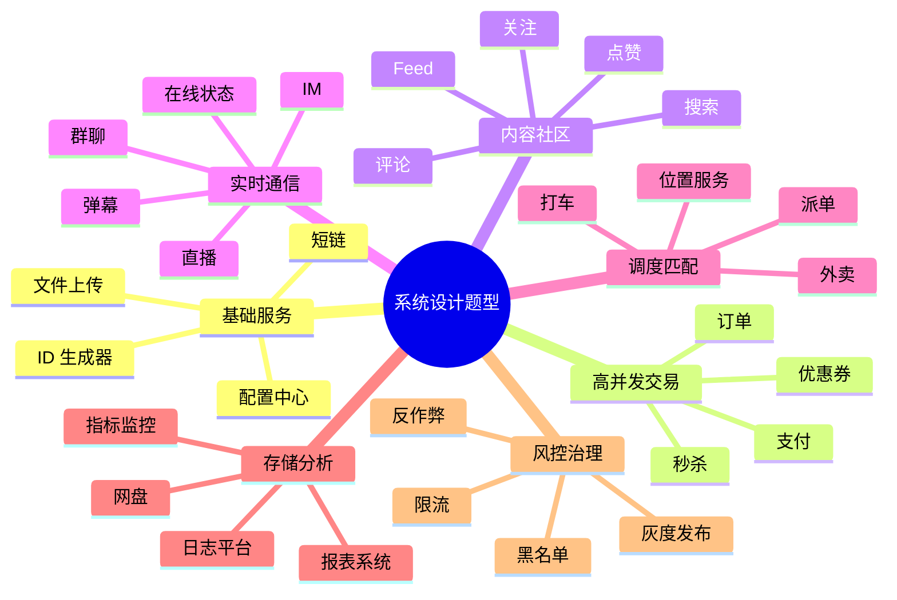

# 经典系统设计题库地图

> 系统设计题看起来很多，本质是在考几类能力：读写扩展、实时通信、交易一致性、搜索分析、调度匹配、存储治理和高可用。

## 一、题型总览



## 二、高频题清单

### 1. 基础服务类

| 题目 | 核心考点 |
| --- | --- |
| 短链系统 | 唯一 ID、缓存、跳转、统计、防滥用 |
| 分布式 ID 生成器 | 雪花算法、号段、时钟回拨、可用性 |
| 文件上传系统 | 分片上传、秒传、断点续传、对象存储 |
| 配置中心 | 长轮询、推送、版本、灰度、回滚 |
| API 网关 | 鉴权、限流、路由、灰度、熔断 |

### 2. 高并发交易类

| 题目 | 核心考点 |
| --- | --- |
| 秒杀系统 | 限流、削峰、Redis 扣库存、异步下单、防超卖 |
| 订单系统 | 分库分表、状态机、支付回调、冷热归档 |
| 支付系统 | 幂等、对账、资金安全、渠道回调、补偿 |
| 优惠券系统 | 领券并发、库存、过期、核销、风控 |
| 库存系统 | 预占、扣减、释放、库存分桶、最终一致 |

### 3. 内容社区类

| 题目 | 核心考点 |
| --- | --- |
| Feed 流 | 推拉模型、大 V、时间线、排序、删除过滤 |
| 评论系统 | 楼中楼、热评、分页、审核、反垃圾 |
| 点赞系统 | 计数、去重、缓存、异步落库、热点 |
| 关注系统 | 关系存储、共同关注、粉丝数、隐私 |
| 搜索系统 | 倒排索引、ES 同步、排序、召回、延迟 |

### 4. 实时通信类

| 题目 | 核心考点 |
| --- | --- |
| IM 系统 | 长连接、消息投递、离线消息、ACK、多端同步 |
| 群聊系统 | 群消息扩散、已读未读、群成员变更 |
| 弹幕系统 | 房间广播、限流、审核、热点房间 |
| 直播系统 | 推流、转码、CDN、低延迟、礼物 |
| 在线状态 | 心跳、状态聚合、过期、推送 |

### 5. 调度匹配类

| 题目 | 核心考点 |
| --- | --- |
| 打车系统 | 位置上报、附近司机、派单、抢单、ETA |
| 外卖派单 | 商家、骑手、路径、超时、改派 |
| 位置服务 | GeoHash、附近的人、轨迹、冷热数据 |
| 预约系统 | 时间槽、并发占用、取消释放 |

### 6. 存储分析类

| 题目 | 核心考点 |
| --- | --- |
| 网盘系统 | 分片上传、秒传、元数据、对象存储、权限 |
| 日志平台 | 采集、缓冲、Kafka、索引、检索、冷热 |
| 指标监控 | 时序库、聚合、降采样、告警 |
| 报表系统 | ETL、ClickHouse、Hive、实时/离线 |

## 三、每类题的底层知识点

### 读多写少

代表：

- 短链跳转。
- Feed 读取。
- 商品详情。
- 评论列表。

常用手段：

- 缓存。
- CDN。
- 读写分离。
- 预计算。
- 热点 key 拆分。

### 写多读少

代表：

- 日志采集。
- 埋点上报。
- 弹幕写入。
- 指标上报。

常用手段：

- MQ。
- 批量写。
- LSM 型存储。
- 时序库。
- 异步聚合。

### 强一致交易

代表：

- 支付。
- 订单。
- 库存。
- 账户余额。

常用手段：

- 本地事务。
- 唯一索引。
- 状态机。
- 幂等。
- 对账。
- 补偿。

### 实时扇出

代表：

- IM。
- 弹幕。
- 直播间通知。
- 在线状态。

常用手段：

- WebSocket。
- 连接网关。
- PubSub。
- 房间分片。
- 优先级和降级。

## 四、面试准备优先级

第一梯队：

- 短链。
- 秒杀。
- 订单。
- Feed。
- IM。

第二梯队：

- 评论 / 点赞。
- 直播 / 弹幕。
- 搜索。
- 网盘。
- 支付。

第三梯队：

- 打车 / 外卖派单。
- 日志平台。
- 监控系统。
- 配置中心。
- API 网关。

## 五、答题时如何迁移经验

很多题可以共用套路：

- 短链跳转、商品详情、Feed 读取：都考缓存和热点。
- 秒杀、领券、库存：都考限流、扣减、防超卖。
- IM、弹幕、直播互动：都考长连接和扇出。
- 订单、支付、库存：都考状态机、幂等、对账。
- 搜索、报表、后台查询：都考异构存储和数据同步。

面试表达：

```text
这类题我会先判断它更偏读扩展、写扩展、实时通信还是强一致交易。
不同类型的系统，核心瓶颈不一样，选型也不一样。
比如短链是读多写少，重点是跳转缓存；
秒杀是瞬时写峰值，重点是削峰和防超卖；
IM 和弹幕是长连接扇出，重点是连接网关和消息投递；
订单支付是强一致交易，重点是状态机、幂等和对账。
```
