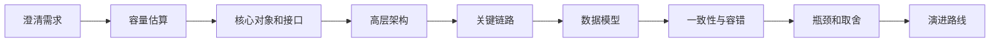
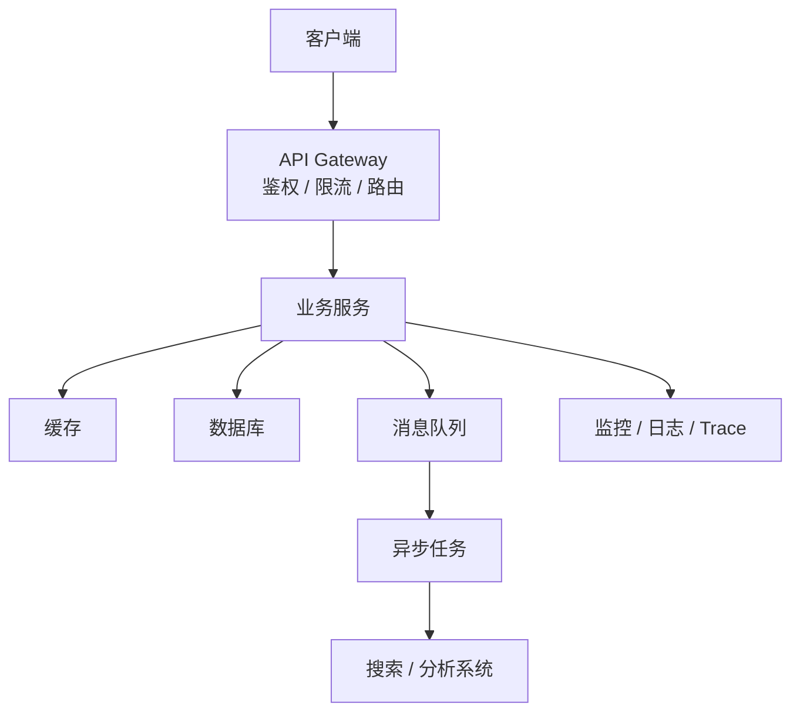

# 系统设计答题框架

> 系统设计题不是背架构图，而是把业务目标、容量约束、核心链路、数据模型、瓶颈和取舍讲清楚。

## 一、答题总流程



面试里可以按这个顺序：

1. **澄清需求**：用户是谁、核心功能是什么、哪些是非目标。
2. **容量估算**：DAU、QPS、峰值、存储、带宽。
3. **核心对象**：用户、内容、订单、房间、消息等。
4. **核心接口**：创建、查询、更新、投递、消费。
5. **高层架构**：入口、服务、缓存、数据库、队列、搜索、CDN。
6. **关键链路**：写链路、读链路、异步链路、补偿链路。
7. **数据模型**：表、索引、分片键、缓存 key。
8. **一致性**：强一致、最终一致、幂等、重试、对账。
9. **可用性**：限流、降级、熔断、容灾、监控。
10. **取舍**：为什么这样设计，有什么代价，如何演进。

## 二、澄清问题模板

常问：

- 读多还是写多？
- 峰值和平均值差距多大？
- 是否要求强一致？
- 是否允许最终一致？
- 是否需要多地域？
- 是否有搜索、统计、报表？
- 数据保留多久？
- 是否有热点用户、热点内容、热点商品？

不要问太散，要围绕会影响架构的点。

## 三、容量估算模板

```text
DAU = 1000 万
人均请求 = 20 次 / 天
日请求 = 2 亿
平均 QPS = 2 亿 / 86400 ≈ 2300
峰值 QPS = 平均 * 5~20
```

存储估算：

```text
单条记录大小 * 日增量 * 保留天数 * 副本数 * 索引放大
```

带宽估算：

```text
QPS * 单响应大小
```

面试表达：

> 我不会按平均值设计，核心链路要按峰值和热点设计。

## 四、高层架构模板



讲架构时不要只画组件，要说明每个组件解决什么问题：

- 网关：鉴权、限流、灰度、路由。
- 缓存：热点读、降低数据库压力。
- MQ：削峰、异步化、解耦、最终一致。
- 数据库：核心事实存储。
- 搜索 / OLAP：多维查询和报表。
- 监控：发现问题和验证容量。

## 五、取舍表达

| 选择 | 优点 | 代价 |
| --- | --- | --- |
| 缓存 | 低延迟、抗读高峰 | 一致性、穿透、击穿、雪崩 |
| MQ | 削峰、异步、解耦 | 延迟、重复消费、最终一致 |
| 分库分表 | 容量和写入扩展 | 跨分片查询、事务、扩容 |
| CDN | 降低源站带宽 | 缓存刷新、边缘一致性 |
| 推模式 | 读快 | 写放大、大 V 问题 |
| 拉模式 | 写轻 | 读聚合慢 |

## 六、面试收束模板

```text
这个系统我会先保证核心链路正确和可用。
第一阶段用简单架构满足业务闭环；
当读压力上来，引入缓存和读写分离；
当写压力和数据量上来，再做分库分表和异步化；
当多维查询和报表变多，拆到搜索和 OLAP；
最后通过限流、降级、监控、压测和容量预案保证稳定性。
```
