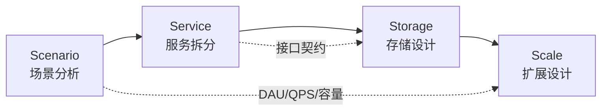
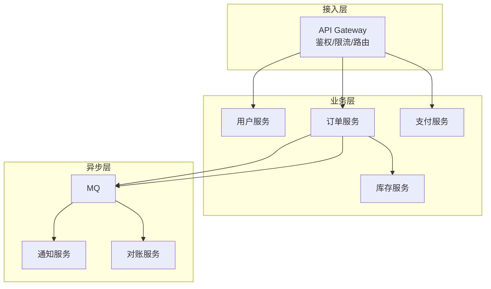
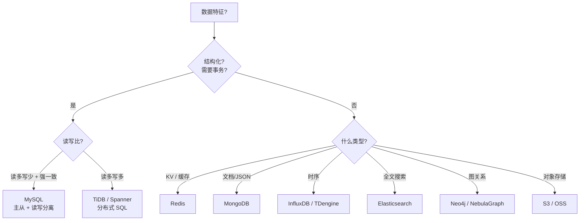
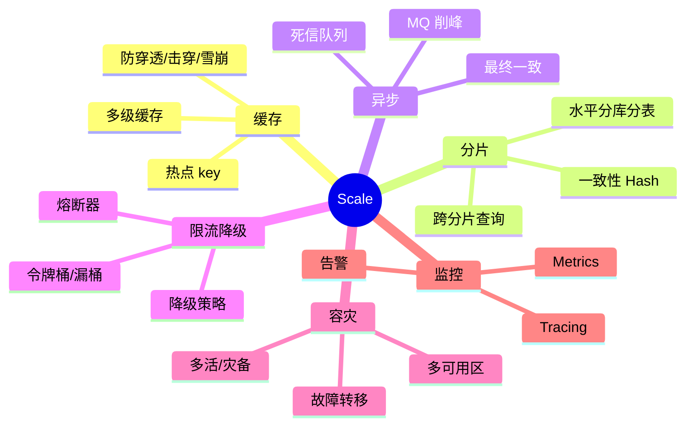
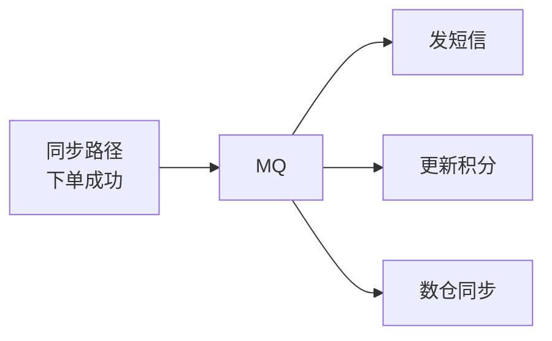

# 系统设计 4S 分析法

> **4S = Scenario / Service / Storage / Scale**——系统设计面试公认的"标准答题模板",从九章算法体系流出,**国内外大厂面试官几乎都默认这套节奏**。
>
> 比起 [01-design-framework.md](01-design-framework.md) 的 10 步通用流程,4S 更像**面试现场的发声模板**:四个 S 顺序固定、每个 S 有明确产出、面试官一听就知道你训练过、不会发散。

---

## 一、一句话总结

> **"先问需求(Scenario),再拆服务(Service),再设存储(Storage),最后谈扩展(Scale)"**——这是系统设计题在白板上**40 分钟讲完一个系统**的工业化流程。
>
> 缺一个 S 都会被扣分:
> - 缺 Scenario → 答非所问
> - 缺 Service → 没架构骨架
> - 缺 Storage → 数据怎么落不清楚
> - 缺 Scale → 扛不住高并发,资深扣分

---

## 二、4S 是什么

### 2.1 一图看懂



**核心顺序**:Scenario → Service → Storage → Scale,**严格不可乱**。

为什么不能乱:
- Scenario 输出的"读多写多 / QPS / 一致性要求"是后面三步的输入
- Service 输出的"接口 + 模块"决定 Storage 怎么建表
- Storage 输出的"瓶颈点"决定 Scale 重点优化哪里

### 2.2 四个 S 各自一句话

| 阶段 | 一句话 | 输出物 |
| --- | --- | --- |
| **Scenario** | 搞清楚**做什么、不做什么、多大规模** | 功能清单 + 容量数字 |
| **Service** | 把系统拆成几个**职责清晰**的子服务 | 模块图 + 核心 API |
| **Storage** | 给每个核心对象**选存储 + 设计 schema** | 表结构 + 选型理由 |
| **Scale** | 应对**高并发、高可用、海量数据** | 缓存/分片/限流/容灾 |

---

## 三、4S 详解

### 3.1 Scenario(场景分析)

**核心目标**:在 5 分钟内**问清楚需求 + 算清楚规模**,避免做错题。

#### 必做三件事

**a. 列功能(Features)**——主动问,**画分级**:

```text
Must Have (核心):
  - 用户注册 / 登录
  - 发推 / 看推
  - 关注关系

Nice to Have (可选):
  - 私信
  - 推荐
  - 通知

Out of Scope (不做):
  - 直播
  - 电商
```

**反模式**:面试官说"设计 Twitter",你直接画架构。**90% 会错题**——他可能只想要 timeline,你做了一个全功能 Twitter。

**b. 算容量(Capacity)**——**必须现场算**,不能拍脑袋。

```text
DAU = 1 亿
人均请求 = 50 次/天
日请求 = 50 亿
平均 QPS = 50 亿 / 86400 ≈ 5.8 万
峰值 QPS = 平均 × 5 ≈ 30 万

存储:
  单条推文 = 280 字节 ≈ 1 KB(含元数据)
  日新增 = 1 亿 × 2 推 = 2 亿 KB ≈ 200 GB/天
  保留 5 年 = 200 GB × 365 × 5 ≈ 365 TB
```

**资深动作**:**主动指出"读写比"**——
> "Twitter 是典型的读多写多,**读:写 ≈ 100:1**,所以重点优化读路径(timeline 缓存、推拉结合)。"

**c. 反问"非功能需求"**——这是**资深扣分点**:

| 维度 | 必问 | 影响 |
| --- | --- | --- |
| 一致性 | 强一致还是最终一致? | 决定是否能用缓存 + 异步 |
| 延迟 | 99 分位 < 200ms? | 决定缓存层级和 CDN |
| 可用性 | 99.9% 还是 99.99%? | 决定是否多机房 |
| 数据保留 | 多久? | 决定冷热分层 |
| 多地域 | 单 region 还是全球? | 决定是否做 GeoDB |

#### Scenario 答题模板(背诵版)

> "在动手前我想先确认几件事:
> 1. **核心功能**——我理解的 Must Have 是 X / Y / Z,Out of Scope 的是 A / B,对吗?
> 2. **规模**——假设 DAU N 万,峰值 QPS 大约 M,存储 K TB,这个量级合理吗?
> 3. **非功能**——是否要求强一致 / 多地域 / 99.99% 可用?
> 4. **读写比**——这是读多写多的系统,我会把重点放在读路径上。"

---

### 3.2 Service(服务拆分)

**核心目标**:把系统拆成**职责单一、边界清晰**的子服务,画出依赖图。

#### 拆分原则(SRP + DDD)

| 原则 | 体现 |
| --- | --- |
| **单一职责** | 一个服务只做一类事(订单 / 库存 / 支付 / 用户) |
| **业务边界** | 按 DDD 限界上下文切,不按技术切(❌"DB 服务"/"缓存服务") |
| **数据归属** | 每个服务**独占自己的数据库**(微服务铁律) |
| **同步异步分离** | 写路径同步保证一致;副作用(发邮件 / 推送)走 MQ |

#### 三层服务模型



#### 接口设计(API)

**核心接口要写出来**——面试官最怕你只画框图不画 API:

```text
POST /v1/orders
  Request:  { user_id, sku_id, quantity, idempotency_key }
  Response: { order_id, status }

GET /v1/orders/{order_id}
  Response: { order_id, status, items, ... }
```

**资深加分**:讲清楚**幂等键、超时、错误码、版本号**。

#### Service 答题模板

> "我会拆成 4 个服务:
> 1. **用户服务**——账号 / 认证 / Profile
> 2. **订单服务**——下单 / 查询 / 状态机
> 3. **库存服务**——扣减 / 回补 / 对账
> 4. **支付服务**——对接第三方 / 退款 / 流水
>
> 服务间**同步调用**用 gRPC,**异步通知**用 MQ。每个服务独占一个数据库,不允许跨库 join。"

---

### 3.3 Storage(存储设计)

**核心目标**:每个核心对象**选对存储**,**设计好 schema**,讲清楚为什么这么选。

#### 选型决策树



#### 三类存储对照表

| 类型 | 代表 | 适用 | 不适用 |
| --- | --- | --- | --- |
| **关系型** | MySQL / PostgreSQL | 强一致事务、复杂查询 | 单表 > 5000 万、跨地域 |
| **KV / 缓存** | Redis / Memcached | 热点读、计数、Session | 大对象、需要事务 |
| **文档** | MongoDB / Couchbase | Schema 灵活、嵌套结构 | 强 Join 查询 |
| **列存** | HBase / Cassandra | 海量写入、时序 | OLTP 事务 |
| **搜索** | Elasticsearch | 全文 / 多维过滤 | 主存(应做副本)|
| **OLAP** | ClickHouse / Doris | 报表 / 多维分析 | 单点查询 |

#### Schema 设计要写清楚

**主表 + 索引 + 分片键**——三者缺一不可:

```sql
CREATE TABLE `orders` (
  `id` BIGINT NOT NULL,                    -- 雪花 ID
  `user_id` BIGINT NOT NULL,
  `sku_id` BIGINT NOT NULL,
  `status` TINYINT NOT NULL,               -- 0=待支付,1=已支付,...
  `amount` DECIMAL(10,2) NOT NULL,
  `created_at` DATETIME NOT NULL,
  `idempotency_key` VARCHAR(64) NOT NULL,
  PRIMARY KEY (`id`),
  UNIQUE KEY `uk_idem` (`idempotency_key`),
  KEY `idx_user_created` (`user_id`, `created_at` DESC)
) ENGINE=InnoDB;
-- 分片键: user_id (按用户分库,保证个人查询不跨库)
```

**资深加分**:**讲清楚为什么选这个分片键**——
> "用 user_id 分片是因为 90% 查询都是'某用户的订单',分片键命中索引、不跨库。如果按 order_id 分片,虽然写入更均匀,但'我的订单列表'查询会扇出到所有分片,代价更高。"

#### Storage 答题模板

> "核心对象有 3 个:User / Order / Inventory:
> - **User** → MySQL,**强一致 + 读多写少**;Profile 存 Redis Cache
> - **Order** → MySQL **按 user_id 分片**,**保留 1 年**,1 年前归档到 OSS
> - **Inventory** → Redis(扣减) + MySQL(对账),**双层兜底**"

---

### 3.4 Scale(扩展设计)

**核心目标**:回答"**如果用户量 / QPS 翻 10 倍,系统怎么办**"——这一段决定资深还是初级。

#### Scale 六板斧



#### 六板斧逐条讲

**a. 缓存(Cache)**——读多场景**第一选择**

| 场景 | 模式 | 风险 |
| --- | --- | --- |
| 热点读 | Cache-Aside | 击穿 → 互斥锁 |
| 高一致读 | Write-Through | 写慢 |
| 写多 | Write-Back | 丢数据 |

**资深点**:讲**多级缓存**(本地 + Redis + DB)+ **预热**+ **降级**。

**b. 分片(Sharding)**——写多场景**唯一出路**

```text
分片键选择:
- 用户维度查询多 → user_id 分片
- 订单维度查询多 → order_id 分片
- 时间序列 → time bucket 分片
```

**坑**:扩容时数据迁移、跨分片事务(用 Saga / TCC)、热点分片(再分片)。

**c. 异步化(Async)**——**削峰 + 解耦**



**铁律**:**核心链路同步**(用户体验),**副作用异步**(MQ 兜底)。

**d. 限流降级**——**保命**

| 场景 | 手段 |
| --- | --- |
| 入口限流 | Nginx / Gateway 令牌桶 |
| 服务限流 | Sentinel / 熔断器 |
| 数据库保护 | 慢 SQL 杀手 / 连接池 |
| 降级 | 关闭非核心(推荐 / 评论)|

**e. 容灾(HA)**——**99.9% → 99.99%**

| 等级 | 方案 | 成本 |
| --- | --- | --- |
| 单机 | 主从 + 自动切换 | 低 |
| 同城 | 多可用区(2-AZ / 3-AZ)| 中 |
| 异地 | 同城多活 + 异地灾备 | 高 |
| 全球 | 多 region + GeoDNS | 极高 |

**f. 监控(Observability)**——**没监控 = 没运维**

```text
三件套:
- Metrics(Prometheus)→ 看趋势 + 报警
- Logging(ELK)→ 查问题
- Tracing(Jaeger / SkyWalking)→ 找瓶颈
```

#### Scale 答题模板

> "系统跑起来后,我会从 6 个维度做扩展:
> 1. **缓存**——Redis + 本地缓存,防三大问题
> 2. **分片**——用户量到 1 亿后按 user_id 分库分表
> 3. **异步**——非核心走 MQ
> 4. **限流降级**——网关令牌桶 + 服务熔断
> 5. **容灾**——同城三 AZ + 异地灾备
> 6. **监控**——Prometheus + Jaeger + 告警分级"

---

## 四、4S 答题节奏(白板版)

40 分钟系统设计的标准时间分配:

```mermaid
gantt
    title 4S 答题时间分配(40 分钟)
    dateFormat mm
    axisFormat %M

    section 阶段
    Scenario 场景澄清 :s1, 00, 5m
    Service 服务拆分 :s2, after s1, 10m
    Storage 存储设计 :s3, after s2, 10m
    Scale 扩展设计 :s4, after s3, 10m
    收尾 + 演进 :s5, after s4, 5m
```



**节奏铁律**:
- ❌ Scenario 超过 8 分钟 = 你被需求绕进去了
- ❌ Service 不画图 / 不写 API = 不及格
- ❌ Storage 不讲分片键 = 大厂秒挂
- ❌ 不主动讲 Scale = 当成初级处理

---

## 五、完整案例:用 4S 推导秒杀系统

> 完整 4S 推导 + 与旧版 [03-seckill-system.md](03-seckill-system.md) 的对比,见 **[03b-seckill-system-4s.md](03b-seckill-system-4s.md)**。
>
> 那篇是 4S 方法论在真实题目上的产出样板,白板复述时可以直接照搬节奏。

---

## 六、4S vs 10 步通用流程的对比

> 项目里有两套答题框架:本文(4S)和 [01-design-framework.md](01-design-framework.md)(10 步通用)。**怎么选**?

| 维度 | **4S(本文)** | **10 步通用**[01-design-framework.md](01-design-framework.md) |
| --- | --- | --- |
| 适用场景 | **面试白板答题** | **写设计文档 / 内部评审** |
| 节奏 | 4 段,每段 10 分钟 | 10 步,可深可浅 |
| 输出 | **现场可讲完整套话** | **完整设计文档** |
| 业界使用 | 九章 / Cracking the Coding Interview / 大厂面试官 | Google / AWS Solution Architect 文档 |
| **建议** | **面试用 4S** | **工作中用 10 步** |

**两者关系**:**4S 是 10 步的"压缩版"**——10 步的"澄清/估算"压成 Scenario,"核心对象/接口/架构"压成 Service+Storage,"一致性/可用性/取舍"压成 Scale。**讲 4S 就够,但脑子里要有 10 步的细节**。

---

## 七、4S 常见反模式

| 反模式 | 后果 | 修复 |
| --- | --- | --- |
| **跳过 Scenario 直接画架构** | 答非所问,做错题 | 强制 5 分钟问需求 + 算容量 |
| **Scenario 问太多** | 时间超支,后面来不及 | 控制 5-8 分钟,抓住影响架构的点 |
| **Service 不写 API** | 面试官看不到接口边界 | 必须写至少 2 个核心 API 的 Request/Response |
| **Storage 不讲分片键** | 大厂直接判初级 | 必讲分片键 + 为什么选它 |
| **Scale 只讲缓存** | 不全面,显单薄 | 至少覆盖 6 板斧中的 4 项 |
| **顺序乱(先 Storage 后 Service)** | 逻辑断裂 | 严格按 S→S→S→S |
| **每个 S 平均用力** | 答题失重 | 重点放在 Service 和 Scale,Scenario 快但完整 |

---

## 八、面试现场表达模板

> 准备一段**全套 4S 开场白**,任何系统设计题套上去就能用:

```text
"我用 4S 来组织这道题的答案——

第一步 Scenario,我先确认核心功能、估算容量、明确非功能要求。
  [现场列功能 + 算 QPS + 反问一致性/延迟/读写比]

第二步 Service,根据需求拆服务、画接入层/业务层/异步层、写出核心 API。
  [现场画图 + 写 2-3 个 API]

第三步 Storage,给每个核心对象选存储、设计 Schema、讲清分片键。
  [选型 + 表结构 + 分片决策]

第四步 Scale,从缓存、分片、异步、限流、容灾、监控六个维度讲扩展。
  [6 板斧 + 演进路线]

最后我会讲一下取舍和演进——这套设计哪些地方妥协了,业务发展后怎么演进。"
```

---

## 九、一句话总结

> **4S = Scenario(5 分钟问清需求)+ Service(10 分钟拆服务)+ Storage(10 分钟设存储)+ Scale(10 分钟讲扩展)**;
>
> - **顺序不可乱**——前一步是后一步的输入
> - **每一步都要有产出**——功能清单 / API / Schema / 6 板斧
> - **资深加分点**藏在 Service 的 API 设计、Storage 的分片键、Scale 的演进路线
> - **面试用 4S,工作用 [10 步](01-design-framework.md)**
>
> 4S 不是另一种知识,**是把系统设计变成可复制的工程化流程**——这就是它在大厂面试里地位最高的原因。
