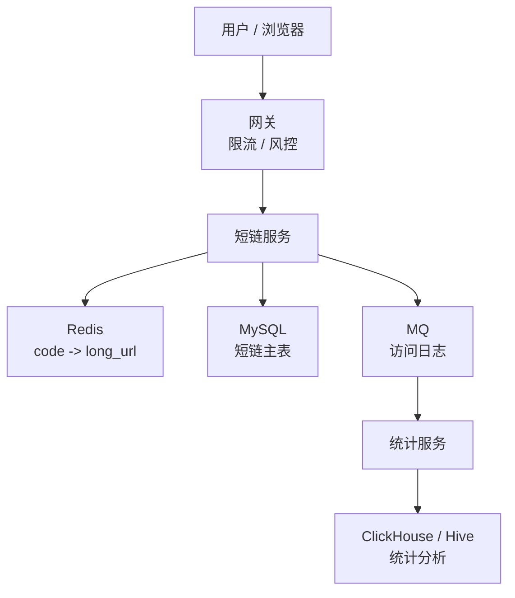
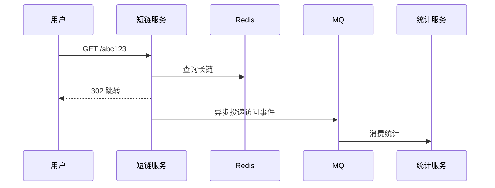

# 短码 / 短链平台

> 短链系统看似简单，核心考点是唯一 ID、跳转性能、缓存、统计、防滥用和过期治理。

## 一、需求澄清

核心功能：

- 用户提交长链接，生成短链接。
- 用户访问短链接，跳转到长链接。
- 支持过期时间。
- 支持访问统计。
- 支持防刷、防恶意链接。

非目标可以先简化：

- 不做复杂营销投放平台。
- 不做完整风控模型。
- 统计可以先异步，允许分钟级延迟。

## 二、容量估算

假设：

```text
日生成短链：100 万
日跳转请求：10 亿
平均跳转 QPS：10 亿 / 86400 ≈ 11574
峰值跳转 QPS：5 万 ~ 20 万
```

结论：

- 生成短链是低频写。
- 跳转是高频读。
- 架构重点是跳转链路低延迟和高可用。

## 三、核心架构



读链路：

```text
短码 -> Redis 查长链 -> 命中直接 302 -> 未命中查 MySQL -> 回填缓存 -> 302
```

写链路：

```text
长链接校验 -> 生成短码 -> 写 MySQL -> 写缓存 -> 返回短链接
```

## 四、短码生成方案

### 1. 自增 ID + Base62

流程：

```text
获取全局递增 ID
  -> Base62 编码
  -> 得到短码
```

Base62 字符：

```text
0-9 a-z A-Z
```

优点：

- 短码短。
- 无碰撞。
- 实现简单。

缺点：

- 依赖发号器。
- 容易被枚举。

防枚举：

- ID 做扰动。
- 加随机盐。
- 使用非连续号段。
- 对敏感场景加访问校验。

### 2. Hash 长链接

对长链接做 hash，截取一段作为短码。

优点：

- 相同长链可以生成相同短链。
- 不依赖中心发号。

缺点：

- 有碰撞概率。
- 碰撞后要加盐重试。
- 短码长度不好控制。

### 3. 号段模式

服务提前从发号器申请一段 ID：

```text
服务 A：100000 ~ 199999
服务 B：200000 ~ 299999
```

优点：

- 减少每次生成都访问发号器。
- 性能好。

缺点：

- 服务宕机会浪费一段 ID。
- 需要号段管理。

推荐回答：

> 高并发短链生成可以用号段发号 + Base62。跳转链路用 Redis 缓存，统计异步化。

## 五、数据模型

```sql
create table short_links (
    id bigint not null,
    code varchar(16) not null,
    long_url varchar(2048) not null,
    user_id bigint not null,
    expire_at datetime null,
    status tinyint not null,
    created_at datetime not null,
    updated_at datetime not null,
    primary key (id),
    unique key uk_code (code),
    key idx_user_created (user_id, created_at)
);
```

访问日志不要直接写 MySQL 主表，走 MQ：

```text
code, user_agent, ip, referer, created_at
```

统计落 ClickHouse / Hive 更合适。

## 六、跳转设计

### 301 vs 302

| 状态码 | 含义 | 适合 |
| --- | --- | --- |
| 301 | 永久重定向 | 长期不变、SEO 友好 |
| 302 | 临时重定向 | 需要统计、可能变更目标 |

短链平台通常使用 302：

- 每次访问都回到短链服务，便于统计。
- 目标链接可以修改或下线。

### 缓存设计

Redis key：

```text
short:{code} -> long_url
```

过期：

- 如果短链有过期时间，Redis TTL 和业务过期时间对齐。
- 永久短链可以长期缓存，但要支持主动失效。

防穿透：

- 对不存在 code 缓存空值。
- 布隆过滤器过滤明显不存在的 code。
- 网关限流异常访问。

## 七、统计设计

跳转链路不能同步写统计库。

正确方式：



统计指标：

- PV / UV。
- IP 分布。
- Referer。
- 设备类型。
- 地区。
- 小时级趋势。

## 八、防滥用

风险：

- 钓鱼链接。
- 色情、违法链接。
- 短码爆破。
- 恶意刷访问量。

措施：

- 创建短链时校验域名黑名单。
- 对用户创建频率限流。
- 跳转链路对异常 IP 限流。
- 管理后台支持封禁短码。
- 接入安全审核或异步扫描。

## 九、常见坑

- 生成短码用随机字符串，没有碰撞处理。
- 跳转链路同步写统计，导致延迟高。
- 不缓存不存在短码，导致缓存穿透。
- 用 301 导致浏览器缓存，统计不准确。
- 短码可枚举，敏感链接被遍历。
- 长链接没有安全校验，平台被滥用。

## 十、面试表达

```text
短链系统写少读多，核心是跳转链路低延迟。
短码生成我会用号段 ID + Base62，避免碰撞并减少发号器压力。
跳转时先查 Redis，未命中查 MySQL 并回填缓存，返回 302 便于统计和后续变更。
访问统计不阻塞跳转链路，而是异步写 MQ，再进入 ClickHouse 或 Hive 做分析。
同时要处理不存在短码缓存、防刷、黑名单、安全审核和短码过期。
```
