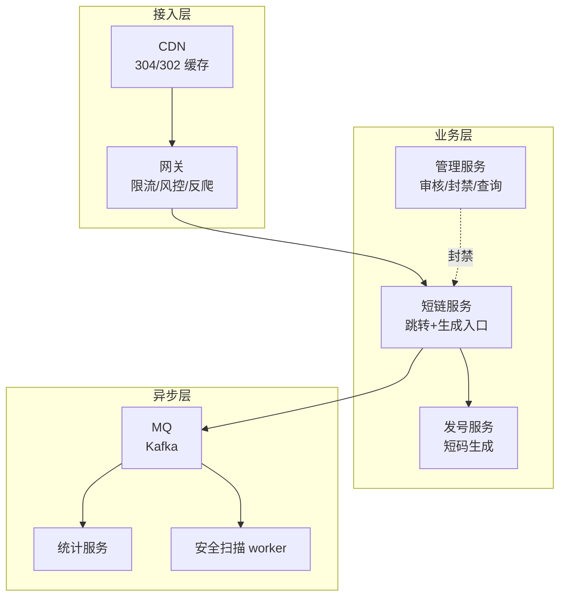
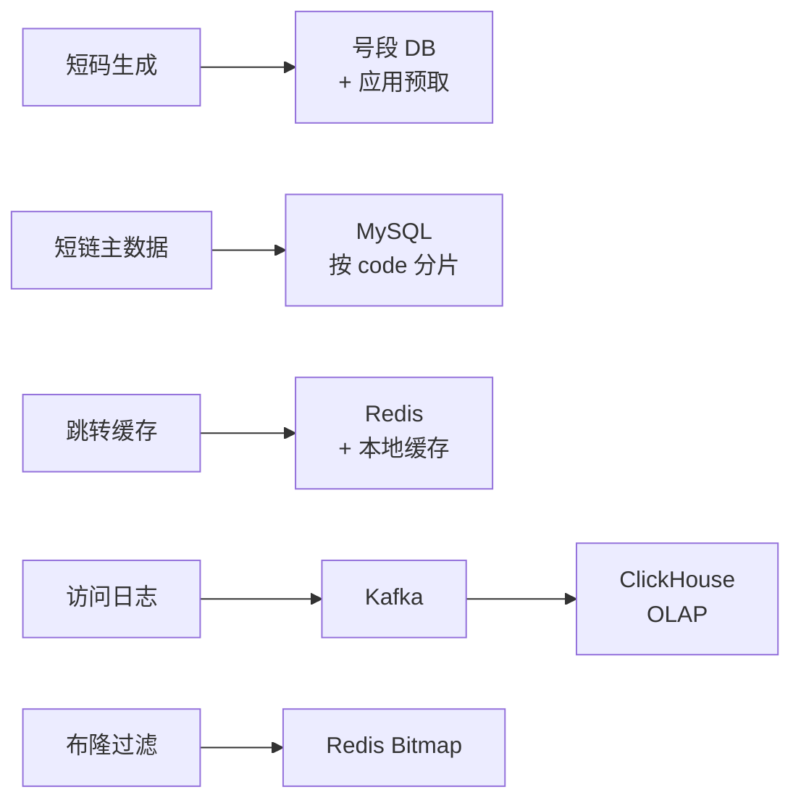

# 短链平台(4S 版)

> 用 [01b-4s-method.md](01b-4s-method.md) 的 **4S 分析法**(Scenario / Service / Storage / Scale)重新推一遍短链平台。
>
> **目标**:展示 4S 方法论在"读多写少 + 跳转链路低延迟"场景下的产出,与按主题平铺的 [02-short-code-platform.md](02-short-code-platform.md) 形成对比,**两份共存**——旧版理解业务,新版掌握答题节奏。

---

## 一、为什么单独写一份

| 文档 | 适用 | 风格 |
| --- | --- | --- |
| [02-short-code-platform.md](02-short-code-platform.md) | **理解短链业务** | 10 节主题平铺(需求/容量/架构/短码生成/数据模型/跳转/统计/防滥用/坑/收束) |
| **本文(4S 版)** | **面试白板复述** | 4 段递进,每段 10 分钟,严格按 4S 节奏 |

> **资深建议**:**两份都看**——业务理解看旧版,面试现场用 4S 节奏复述。
>
> 短链和秒杀是系统设计面试的**两个对照面**——秒杀是"写热点"代表,短链是"读热点"代表,**两者一起练能覆盖 80% 的系统设计题型**。

---

## 二、Scenario(场景分析,5 分钟)

**核心目标**:先问清楚做什么、规模多大、什么是非功能要求,**关键是定下"读极多 + 写极少"的基调**。

### 2.1 功能分级

| 等级 | 功能 |
| --- | --- |
| **Must** | 生成短链 / 短链跳转(302)/ 设置过期 / 防恶意域名 |
| **Nice** | 自定义短码 / 访问统计(PV/UV/地域)/ 短链管理后台 |
| **Out** | 营销投放 / A/B 分流 / 完整风控(归专门系统) |

**反模式**:面试官说"设计短链",你直接讲 Snowflake + Base62。**先问清楚是 100 万日生成量的企业内网还是 10 亿日跳转的公网平台**——量级差 1000 倍,架构完全不同。

### 2.2 容量估算

```text
日生成短链:100 万        (写)
日跳转请求:10 亿         (读)

写 QPS:100 万 / 86400 ≈ 12         (低频)
读 QPS(平均):10 亿 / 86400 ≈ 11574  (1.2 万)
读 QPS(峰值):5 万 ~ 20 万          (热点链接)

读写比 ≈ 100:1   ←  关键定调

存储估算:
  单条短链 ≈ 200 字节(code + long_url + 元数据)
  日增量 = 100 万 × 200 B = 200 MB
  保留 2 年 = 200 MB × 730 ≈ 150 GB(单表能扛)

访问日志(异步落库):
  10 亿/天 × 100 B = 100 GB/天 → ClickHouse / Hive
```

### 2.3 非功能要求(资深扣分点)

| 维度 | 要求 |
| --- | --- |
| **一致性** | 短码**唯一性**强一致(不能撞码);跳转可最终一致(缓存稍滞后无影响) |
| **延迟** | 跳转 99 分位 **< 50 ms**(用户对跳转敏感) |
| **可用性** | 99.99%(短链挂了 = 所有引用方都挂) |
| **数据保留** | 短链永久或按 TTL;访问日志 1 年(可压缩归档) |
| **安全** | 防钓鱼/色情链接、防短码枚举、防恶意刷量 |

### 2.4 读写比定调(关键)

> "短链的本质是**写极少 + 读极多 + 单点访问可能瞬时爆炸**(某个热点短链突然被刷屏)。我会把 99% 跳转拦截在 CDN/Redis,把生成做发号优化避免冲突,**让 MySQL 只负责事实存储,不参与高并发跳转链路**。"

**这句话定下了整个系统的设计原则**:

| 原则 | 推导 |
| --- | --- |
| **跳转链路要短** | 99 分位 < 50ms → CDN/Redis 命中即返回,绕开 DB |
| **缓存命中率必须 > 99%** | 读多 → 一旦穿透打到 DB 就崩 → 布隆 + 空值缓存 |
| **写不是瓶颈,但短码唯一性是** | 12 QPS 写但要绝对唯一 → 发号器选型很关键 |
| **统计绝对不能阻塞跳转** | 异步 MQ,跳转链路连日志都不写 |

**这与秒杀的"写极热点"完全相反**——所以 4S 推出来的架构也截然不同(秒杀重写路径优化,短链重读路径优化)。

---

## 三、Service(服务拆分,10 分钟)

**核心目标**:按 SRP 拆服务,画三层架构,**写出核心 API**。

### 3.1 三层架构



### 3.2 服务职责

| 服务 | 职责 | 不做 |
| --- | --- | --- |
| **发号服务** | 雪花/号段生成全局唯一 ID → Base62 短码 | 不存短链业务数据 |
| **短链服务** | 生成短链(写少) + 跳转(读多,缓存优先) + 投 MQ 异步日志 | 不做统计、不做安全审核 |
| **管理服务** | 创建审核、封禁、用户后台、批量管理 | 不参与跳转高并发链路 |
| **统计服务** | 消费 MQ → 聚合 → ClickHouse | 不阻塞跳转,不直接对外 |
| **安全扫描** | 消费 MQ → 异步扫描可疑 URL → 触发封禁 | 不同步阻塞创建 |

**关键决策**:

- **发号服务独立**——短码冲突是核心风险,集中治理,避免每个短链服务实例各自生成造成冲突
- **跳转链路"零写库"**——纯读,Redis 命中即 302,日志走 MQ
- **安全扫描异步**——创建时只做黑名单同步校验(毫秒),深度扫描走 worker,可疑链接事后封禁

### 3.3 核心 API

```text
POST /v1/short/create
  Request:  { long_url, expire_at?, custom_code?, user_id }
  Response: { code, short_url, expire_at }
  错误码:   400 域名黑名单 / 409 自定义码冲突 / 429 限流

GET /{code}
  逻辑:    Redis 查 long_url → 命中 302 → 未命中查 MySQL 回填 → 302
  Response: 302 Location: <long_url>
            或 404 (不存在/已过期/已封禁)

GET /v1/short/stat/{code}
  Response: { code, pv, uv, top_referer, top_region, ... }
```

**资深加分**:

- **跳转用 302 不用 301**——301 浏览器永久缓存,统计就废了;302 每次都回服务,可统计可下线
- **生成接口幂等**:同一 `(user_id, long_url)` 在短时间内返回同一 code(用 Redis 做 5 分钟去重缓存)
- **自定义码冲突**:返回 409 + 建议码,不静默替换

---

## 四、Storage(存储设计,10 分钟)

**核心目标**:三个核心对象**选对存储 + 设计 Schema + 讲清楚分片键和发号策略**。

### 4.1 短码生成(ID Generator)——发号器是核心

**三种方案对比**:

| 方案 | 原理 | 优点 | 缺点 | 选型 |
| --- | --- | --- | --- | --- |
| **自增 ID + Base62** | DB auto_increment → 编码 | 短码最短、无碰撞 | DB 单点瓶颈,可枚举 | ❌ 中小流量勉强用 |
| **Hash(long_url) 截取** | MD5/MurmurHash → 取前 6-7 位 | 同 URL 同 code、无中心 | 碰撞概率高、需加盐重试 | ❌ 不推荐 |
| **号段模式**(美团 Leaf-segment) | DB 提前批量发号(如 1000 个/次) | 性能高、可水平扩展、不依赖 DB 实时 | 服务宕机浪费一段号 | ✅ **推荐** |
| **Snowflake(雪花)** | 时间戳 + 机器位 + 序列号 | 趋势递增、无 DB 依赖 | ID 较长(64bit),Base62 后 11 位 | ✅ 备选(短码长不敏感时) |

**推荐:号段模式 + Base62**:

```text
DB:  id_segment(biz_tag='short', max_id, step=1000, version)
应用层:每个实例预取 1000 个 ID 缓存在内存,用完再申请
  → Base62 编码 → 7 位短码足够覆盖 62^7 ≈ 3.5 万亿

防枚举:
  - ID 做异或扰动(XOR 一个固定盐 → 不再连续递增)
  - 或用"号段内乱序"(预取后 shuffle)
```

**为什么不用纯 Hash**:碰撞处理太复杂(撞了要加盐重试,极端情况能撞 N 次),且不能保证短码长度统一。号段方案**无碰撞 + 性能高 + 短码紧凑**,工业首选。

### 4.2 短链表(short_links)——MySQL + 分片

```sql
CREATE TABLE short_links (
  id            BIGINT NOT NULL,             -- 号段 ID(同时是短码源)
  code          VARCHAR(16) NOT NULL,        -- Base62 编码后的短码
  long_url      VARCHAR(2048) NOT NULL,
  user_id       BIGINT NOT NULL,
  expire_at     DATETIME NULL,
  status        TINYINT NOT NULL,            -- 0=正常 1=封禁 2=过期
  created_at    DATETIME NOT NULL,
  PRIMARY KEY (id),
  UNIQUE KEY uk_code (code),                 -- 跳转查询主入口
  KEY idx_user_created (user_id, created_at DESC)
) ENGINE=InnoDB;
-- 分片键: code  (跳转 99% 的查询都按 code,按 code 分片不跨库)
-- 冷热分离: expire_at < now() - 90d 的记录归档到 OSS
```

**为什么按 code 分片(不是 user_id)**:

> "短链系统**99% 的查询是跳转(按 code)**,只有 1% 是'我的短链列表'(按 user_id)。所以分片键必须服务于热路径——**按 code 分片,跳转查询永远不跨库**。user_id 查询用二级索引或异步把'用户→code 列表'冗余到另一张表(或 ES),代价比让跳转扇出小得多。"

**这与秒杀刚好相反**——秒杀按 user_id 分片(写主导,90% 是个人查询),短链按 code 分片(读主导,99% 是跳转)。**分片键跟着热路径走,这是资深核心信号。**

### 4.3 跳转缓存(Redis)——读路径的命门

```text
short:{code} → long_url           TTL = min(短链 TTL, 7 天)
short:miss:{code} → ""             TTL 60s   (空值缓存,防穿透)

布隆过滤器:
  bf:codes  (定期重建,过滤明显不存在的 code)
```

**为什么 Redis 是核心**:

| 角度 | 说明 |
| --- | --- |
| 性能 | 跳转 QPS 峰值 20 万,Redis 单实例 10 万 QPS,集群轻松扛 |
| 命中率 | 短链访问呈**长尾分布**(少数热门链接占 80% 流量),命中率应 > 99% |
| 防穿透 | 不存在的 code 写空值 TTL 60s,布隆兜底 |
| 一致性 | 短链创建后**写 DB + 删/写缓存**(Cache-Aside);更新极少,过期靠 TTL |

**热点 key 防护**:某个短链突然爆火(明星发推、新闻热搜),单 key QPS 可能瞬时上百万 → **本地缓存(Caffeine)+ Redis** 两级,本地缓存 1-5 秒就能扛住绝大多数热点。

### 4.4 访问日志 + 统计——Kafka + ClickHouse

```text
跳转链路:Redis 命中 → 302  →  异步投 MQ(fire-and-forget)
                                    ↓
                              Kafka topic: shortlink_access
                                    ↓
                          ┌─────────┴─────────┐
                          ↓                   ↓
                  StatSvc 聚合         ScanSvc 安全扫描
                          ↓
                     ClickHouse(列存,适合 OLAP)
                          ↓
                  管理后台报表(分钟级延迟可接受)
```

**为什么不写 MySQL**:

- 跳转 QPS 1 万+,直接写 MySQL = 跳转链路被慢写阻塞
- 统计查询是 OLAP(聚合 PV/UV/地域分布),MySQL 表大了就慢
- **ClickHouse 单机几十亿行聚合查询秒级**,业界标配

### 4.5 存储选型一图



---

## 五、Scale(扩展设计,10 分钟)

按 4S 六板斧逐条:

| 板斧 | 短链场景具体动作 |
| --- | --- |
| **缓存** | CDN(静态 302 响应)+ 本地 Caffeine + Redis + 空值缓存 + 布隆;**目标命中率 > 99%** |
| **分片** | 短链表按 **code** 分库(跳转不跨库);号段表按 biz_tag 分片;ClickHouse 按日期分区 |
| **异步** | 跳转链路**零同步落库**;访问日志/统计/安全扫描全走 Kafka |
| **限流** | 网关按 IP + UA 限流(防爬);生成接口按 user_id 令牌桶(防滥用);热点 code 单独限流 |
| **容灾** | Redis 集群 + 哨兵;MySQL 主从切换;**降级**:Redis 全挂 → 直接查 MySQL(承担性能损失)→ 再不行返回稍后重试 |
| **监控** | 跳转 P99 延迟 / 命中率 / 错误率 / 短码冲突率 / MQ 堆积;告警分级(P0 = 命中率 < 95%) |

### 5.1 CDN 缓存 302——读路径的终极优化

**核心思路**:对于**永久短链 + 高频访问**,可以让 CDN 缓存 302 响应本身,**用户压根不打到源站**。

```text
CDN 节点:
  GET /abc123
  → 命中本地 → 直接返回 302 Location: <long_url>
  → 未命中 → 回源 → 缓存 5 分钟 → 返回 302

源站负载:
  原来 20 万 QPS → CDN 拦掉 90% → 源站 2 万 QPS
```

**代价 / 边界**:

| 角度 | 说明 |
| --- | --- |
| **统计精度** | CDN 拦掉的请求源站感知不到 → 需要 CDN 日志回流(每分钟批量) |
| **下线延迟** | 短链被封禁后,CDN 缓存内的请求仍会跳转 → 设短 TTL(1-5 分钟)+ 主动刷新 |
| **不适用场景** | 临时短链、需要精确统计的营销链接 → 跳过 CDN |

### 5.2 防短码枚举——安全维度

```text
威胁:
  攻击者从 a000001 开始爆破 → 拉取所有短链 → 泄露隐私

防护:
  1. 号段 ID 做 XOR 扰动 + 短期内乱序  → 不连续
  2. 网关对单 IP 跳转 QPS 限流(异常高 = 爬虫)
  3. 敏感场景加访问校验(密码 / 登录态)
  4. 行为分析:同 IP 访问大量未命中 code → 拉黑
```

### 5.3 防恶意刷量——业务维度

```text
威胁:
  广告主刷自己的短链 → 假数据;
  竞争对手刷竞品短链 → 制造异常成本(CDN 流量);

防护:
  - 跳转日志做 IP+UA+指纹去重,统计 UV 不算重复
  - 异常 QPS 触发挑战(captcha / JS challenge)
  - 大客户走专属域名 + 独立配额
```

### 5.4 演进路线

```text
阶段 1(中小流量,100 万日跳转):
  - 单 MySQL + 单 Redis + 号段发号
  - 单机房 + 主从
  - 访问日志直接写 ClickHouse(QPS 低,可同步)

阶段 2(大流量,10 亿日跳转):
  - 短链表按 code 分库分表(16-64 库)
  - Redis 集群 + 本地缓存防热点
  - 访问日志走 Kafka 异步
  - CDN 缓存 302 响应

阶段 3(超大流量 + 跨国):
  - 多 region 部署 + GeoDNS 就近接入
  - 短链数据按地域分区(中国/北美/欧洲)
  - 边缘计算(Cloudflare Workers)处理跳转
  - 风控前置:行为分析 + 实时封禁
```

---

## 六、新版(本文)vs 旧版 [02-short-code-platform.md](02-short-code-platform.md)

### 6.1 结构对比表

| 维度 | **旧版** [02-short-code-platform.md](02-short-code-platform.md) | **新版**(本文 4S 风格) |
| --- | --- | --- |
| **组织方式** | 按"主题"切——需求/容量/架构/短码生成/数据模型/跳转/统计/防滥用/坑/收束 **(10 节)** | 按"4S 顺序"切——Scenario / Service / Storage / Scale **(4 节)** |
| **顺序逻辑** | **平铺**——10 节内部相对独立,可乱读 | **递进**——读写比 100:1 → 决定缓存为王 → 决定按 code 分片 → 决定 CDN 优化 |
| **Scenario 处理** | "需求澄清" + "容量估算" 两节分开,**没明确读写比** | **合并到 Scenario**——功能/容量/非功能/**读写比 100:1 定调** |
| **Service 处理** | "核心架构" 一节,**只画图没拆服务,没写 API** | **明确拆 5 个服务**(发号/短链/管理/统计/安全扫描)+ 写出 API 契约 |
| **Storage 处理** | "短码生成"(第四)+ "数据模型"(第五)+ "跳转设计"(第六)+ "统计"(第七)**散落 4 节** | **集中讲 4 个对象**(发号器/短链表/缓存/日志)+ 选型 + Schema + **分片键决策** |
| **Scale 处理** | "防滥用"(第八)+ "坑"(第九)**碎片化**,缺统一框架 | **6 板斧统一框架** + **CDN 缓存 302** + **防枚举/防刷量** + 演进路线 |
| **关键考点** | 没明确讲"为什么按 code 不按 user_id 分片" | **必讲分片键决策**——和秒杀按 user_id 形成鲜明对比 |
| **资深信号** | 中:讲了号段/Base62/统计异步 | **更强**:**读写比定调** + **分片键反推** + **CDN 缓存 302** + **本地缓存防热点 key** |

### 6.2 关键差异详解

#### a. 顺序的差异——4S 强制递进

旧版可以**先讲数据模型**(第五节)再补**跳转设计**(第六节),逻辑断裂。

新版**强制递进**:
- **Scenario 算出"读写比 100:1"** → 定下"缓存为王"原则
- **Service 因此拆出"跳转链路零落库"** → 把统计/扫描全异步
- **Storage 因此选"按 code 分片"** → 服务跳转热路径,而非用户查询
- **Scale 因此把 CDN 缓存 302 作为终极优化** → 把 90% 流量挡在源站外

**前一步的产出是后一步的依据**,逻辑闭环。读写比这个数字看着小,但定下了整个架构走向。

#### b. Service 的差异——画图 vs 拆服务

旧版只画了**一张架构图**,把 Redis / MQ / MySQL / 统计服务全混在一起,**没区分"服务"和"基础设施"**,也没有 API。

新版明确**三层 5 个服务**:发号(独立)/ 短链(核心)/ 管理(后台)/ 统计(异步)/ 安全扫描(异步)。**每个服务有清晰的 API 和 SLA**——发号服务挂了不影响跳转(短链服务有 ID 缓存),统计挂了不影响跳转(日志可丢)。

#### c. Storage 的差异——分片键决策

旧版**没讲分片键**——只给了一张表结构,没说"按什么分库"。这是大厂面试**必扣分项**。

新版**专门论证"为什么按 code 分片"**:

```text
关键问答:
  Q: 为什么不按 user_id 分片?
  A: 99% 查询是跳转(按 code),user_id 查询只占 1%。
     按 code 分片 → 跳转永不跨库;
     按 user_id 分片 → 跳转扇出到所有库,代价巨大。
     **分片键跟着热路径走**。

资深信号:
  能讲出"和秒杀刚好相反"——秒杀写主导按 user_id,短链读主导按 code。
  这一句话证明你**真的理解分片键的本质**,不是死记硬背。
```

#### d. Scale 的差异——CDN 缓存 302 + 本地缓存

旧版讲到 Redis + MQ 就停了,**没讲 CDN 怎么用、没讲热点 key 怎么扛**。

新版**两个关键扩展**:

1. **CDN 缓存 302 响应本身**——把 90% 跳转拦在源站外,这是大厂短链平台(如新浪 t.cn、微博 wb.url)的标配
2. **本地 Caffeine 缓存防热点 key**——某个短链突然爆火(单 key 上百万 QPS),Redis 单 key 都扛不住,必须本地缓存兜底

### 6.3 哪个更适合什么场景

| 场景 | 推荐 |
| --- | --- |
| **第一次学习短链** | 旧版——按主题展开,易吸收(尤其短码生成的三种方案对比) |
| **面试前刷题** | **新版**——按 4S 节奏走,**和面试官的"答题模板"对齐** |
| **作为系统设计模板** | **新版**——4S 是通用方法论,可迁移到所有"读多写少"题(评论/Feed/CMS) |
| **写工程文档** | 旧版——主题式更接近真实文档结构(短码生成、跳转、统计各成专题) |

### 6.4 旧版可以怎么改进

如果要把旧版升级成 4S 风格,**最小改动**:

```text
原标题                              → 4S 改造
一、需求澄清 + 二、容量估算          → 一、Scenario(场景)+ 补"读写比 100:1"定调
三、核心架构                         → 二、Service(服务)+ 拆 5 服务 + 写 API
四、短码生成 + 五、数据模型 + 六、跳转 + 七、统计  → 三、Storage(存储)+ 补"按 code 分片"决策
八、防滥用 + 九、常见坑               → 四、Scale(扩展)+ 补 CDN 缓存 302 + 演进
十、面试表达                         → 五、答题模板(保留)
```

**核心动作**:把"主题平铺"重组成"4S 递进",**不删内容只搬位置**,同时补上**读写比定调、分片键决策、CDN 缓存 302** 三个资深扣分点。

---

## 七、面试现场表达模板

> 套用 [01b-4s-method.md](01b-4s-method.md) 的全套 4S 开场白,代入短链场景:

```text
"我用 4S 来组织这道短链系统的设计——

第一步 Scenario(5 分钟):
  确认核心是'生成 + 跳转',容量假设日生成 100 万、日跳转 10 亿,
  **读写比约 100:1,跳转是热路径**,
  非功能要求:跳转 P99 < 50ms,可用性 99.99%。
  这个读写比决定了整套设计原则——'缓存为王、跳转零落库'。

第二步 Service(10 分钟):
  按 SRP 拆三层 5 服务——
  接入层(CDN/网关),
  业务层(发号服务/短链服务/管理服务),
  异步层(统计/安全扫描)。
  发号独立避免冲突,跳转链路零写库,统计走 MQ 异步。
  核心 API:POST /short/create + GET /{code}(302 跳转)。

第三步 Storage(10 分钟):
  发号——号段模式 + Base62,无碰撞高性能;
  短链表——MySQL **按 code 分片**(99% 跳转按 code 查,**和秒杀按 user_id 刚好相反**);
  跳转缓存——Redis + 本地 Caffeine 双层,空值缓存 + 布隆防穿透;
  访问日志——Kafka → ClickHouse,跳转链路零阻塞。

第四步 Scale(10 分钟):
  缓存——**CDN 缓存 302 响应本身**(拦掉 90% 流量),本地+Redis 防热点 key;
  分片——code 分库,日志按日期分区;
  异步——跳转零写库,日志/统计/扫描全 MQ;
  限流——IP+UA 防爬,生成接口令牌桶防滥用;
  容灾——Redis 集群,MySQL 主从,降级直查 DB;
  监控——P99 延迟 + 命中率 + 短码冲突率告警。

最后讲演进:中小流量 → 分库 + CDN → 跨国多 region。"
```

---

## 八、一句话总结

> **短链平台按 4S 推**:**Scenario 先定调**(读写比 100:1)→ **Service 拆发号/短链/管理/统计/扫描**(跳转零落库)→ **Storage 用号段+MySQL(按 code 分片)+Redis 双层缓存**(缓存为王)→ **Scale 走 CDN 缓存 302 + 本地缓存 + 防枚举/防刷量**(6 板斧 + 边缘加速);
>
> - 旧版 [02-short-code-platform.md](02-short-code-platform.md) 按主题平铺,理解业务用
> - 新版(本文)按 4S 递进,**面试现场用**——和面试官答题模板对齐
> - **短链(读热点)和秒杀(写热点)是两个对照面**——一起练能覆盖 80% 系统设计题型
> - **核心资深信号**:**分片键跟着热路径走**(短链按 code、秒杀按 user_id)、**CDN 缓存 302** 把 90% 流量挡在源站外、**本地缓存防热点 key**
