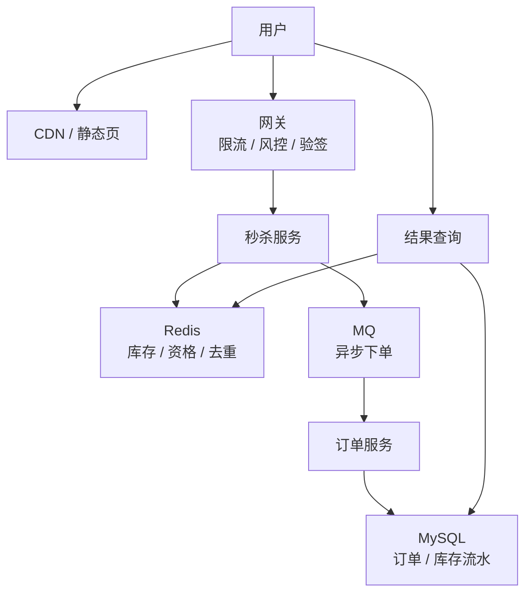
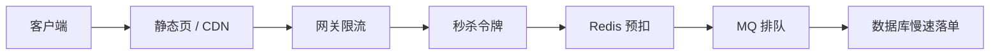

# 秒杀系统

> 秒杀题核心不是“Redis 扣库存”一句话，而是流量削峰、防超卖、异步下单、幂等、热点隔离和降级预案。

## 一、需求澄清

核心功能：

- 用户在活动时间抢购商品。
- 库存有限，不能超卖。
- 下单成功后生成订单。
- 用户可以查询秒杀结果。

关键约束：

- 高峰瞬时流量极高。
- 可接受排队和最终结果。
- 不能超卖。
- 不能让秒杀流量打垮主站。

## 二、容量估算

假设：

```text
活动商品库存：1 万
活动参与用户：1000 万
活动开始 10 秒内请求：500 万
峰值 QPS：50 万+
```

结论：

- 绝大多数请求会失败。
- 不能让所有请求打到 MySQL。
- 要在入口、缓存、队列多层削峰。

## 三、核心架构



链路：

```text
请求进入 -> 网关限流 -> 秒杀资格校验 -> Redis 原子扣库存 -> 写入 MQ -> 异步创建订单 -> 查询结果
```

## 四、库存扣减

### 1. MySQL 直接扣库存

```sql
update sku
set stock = stock - 1
where id = ?
  and stock > 0;
```

优点：

- 强一致。
- 简单可靠。

缺点：

- 高峰时单行热点严重。
- MySQL 扛不住几十万 QPS。

适合普通下单，不适合极端秒杀入口。

### 2. Redis 预扣库存

Redis 中提前加载库存：

```text
seckill:stock:{sku_id} = 10000
```

Lua 原子扣减：

```text
if stock > 0 and user not bought:
    stock--
    mark user bought
    return success
else:
    return fail
```

优点：

- 高性能。
- 原子操作。
- 把大量失败请求挡在 Redis。

风险：

- Redis 成功后 MQ 失败怎么办？
- Redis 和 MySQL 最终库存如何一致？
- Redis 宕机怎么办？

解决：

- Redis 成功后写 MQ。
- MQ 消费创建订单。
- 本地记录秒杀成功资格。
- 对账 Redis 成功记录和订单记录。
- 异常时补偿库存或关单。

## 五、防超卖和幂等

防超卖：

- Redis Lua 原子扣库存。
- MySQL 最终下单时仍可做唯一约束和状态校验。
- 订单唯一键：`user_id + activity_id + sku_id`。

幂等：

```sql
unique key uk_user_activity_sku(user_id, activity_id, sku_id)
```

重复请求：

- Redis 判断用户是否已抢。
- MySQL 唯一索引兜底。

## 六、削峰限流

多层削峰：



手段：

- 活动页静态化。
- CDN 承载静态资源。
- 网关按用户、IP、设备限流。
- 秒杀开始前发放令牌或预约资格。
- Redis 预扣库存。
- MQ 异步下单。
- 订单服务按数据库能力消费。

## 七、异步下单与结果查询

用户秒杀成功不代表订单已创建完成，可以返回：

```json
{
  "status": "QUEUED",
  "request_id": "req_20260503_0001"
}
```

结果状态：

- 排队中。
- 成功。
- 失败：库存不足。
- 失败：重复购买。
- 失败：风控拒绝。

结果存储：

```text
seckill:result:{activity_id}:{user_id}
```

## 八、热点治理

热点：

- 单商品库存 key。
- 单活动入口。
- 单订单创建队列。

治理：

- 库存分桶。
- 多队列分片。
- 热点商品独立服务或独立 Redis。
- 限制每用户请求频率。
- 失败请求快速返回。

库存分桶：

```text
stock:{sku}:bucket:0
stock:{sku}:bucket:1
...
stock:{sku}:bucket:N
```

降低单 key 热点，但会增加库存汇总和准确性复杂度。

## 九、常见坑

- 所有请求直接打 MySQL。
- Redis 扣库存成功但 MQ 丢失，没有补偿。
- 只靠前端按钮置灰防重复。
- 下单接口没有唯一索引兜底。
- 查询结果不断轮询打爆服务。
- 秒杀流量和主站流量没有隔离。
- 没有压测，不知道数据库真实消费能力。

## 十、面试表达

```text
秒杀系统核心是把绝大多数失败请求挡在数据库之前。
我会先做静态化和网关限流，再用 Redis Lua 做库存预扣和用户去重，
成功请求写入 MQ，订单服务按数据库能力异步消费创建订单。
防超卖靠 Redis 原子扣减加 MySQL 唯一约束兜底。
用户侧返回排队状态，通过结果查询获取最终结果。
同时要做热点隔离、库存对账、失败补偿、限流降级和压测。
```
