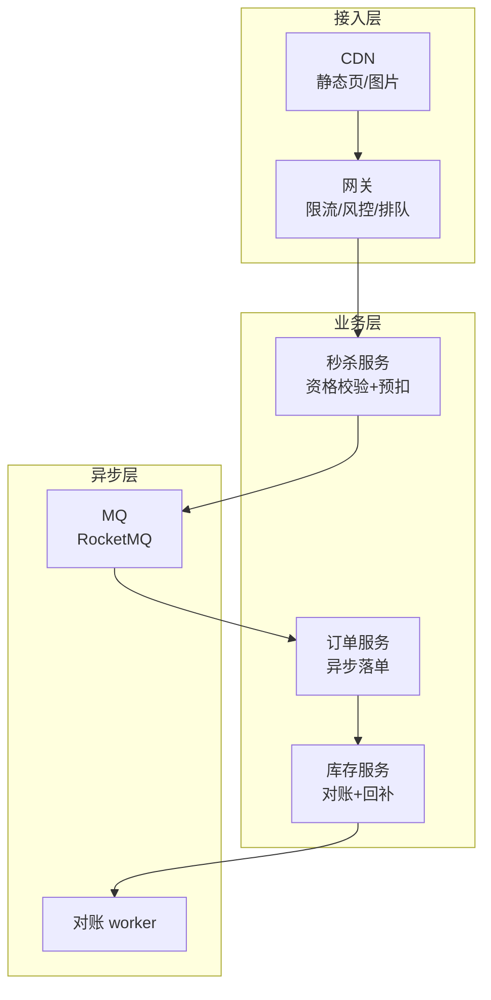
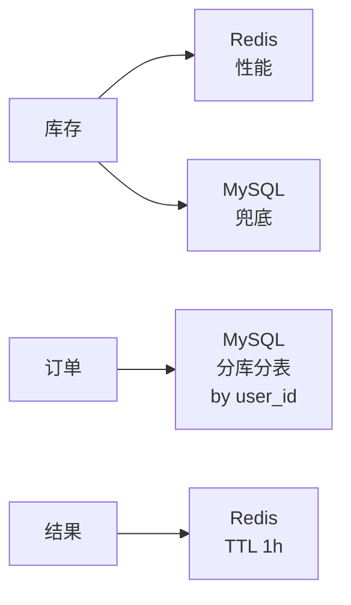

# 秒杀系统(4S 版)

> 用 [01b-4s-method.md](01b-4s-method.md) 的 **4S 分析法**(Scenario / Service / Storage / Scale)重新推一遍秒杀系统。
>
> **目标**:展示 4S 方法论在真实题目上的产出,与按主题平铺的 [03-seckill-system.md](03-seckill-system.md) 形成对比,**两份共存**——旧版理解业务,新版掌握答题节奏。

---

## 一、为什么单独写一份

| 文档 | 适用 | 风格 |
| --- | --- | --- |
| [03-seckill-system.md](03-seckill-system.md) | **理解秒杀业务** | 10 节主题平铺(需求/容量/架构/库存/防超卖/削峰/查询/热点/坑/收束) |
| **本文(4S 版)** | **面试白板复述** | 4 段递进,每段 10 分钟,严格按 4S 节奏 |

> **资深建议**:**两份都看**——业务理解看旧版,面试现场用 4S 节奏复述。

---

## 二、Scenario(场景分析,5 分钟)

**核心目标**:先问清楚做什么、规模多大、什么是非功能要求。**不能上来就画架构**。

### 2.1 功能分级

| 等级 | 功能 |
| --- | --- |
| **Must** | 浏览商品 / 抢购 / 查询结果 / 下单 |
| **Nice** | 排行榜 / 战绩分享 |
| **Out** | 商品详情编辑 / 售后退款(归普通电商) |

**反模式**:面试官说"设计秒杀",你直接画 Redis + MQ 架构。**先问清楚是 1 万库存的小活动还是百万库存的双 11**——量级不同,架构不同。

### 2.2 容量估算

```text
活动商品:1 万件
参与用户:1000 万
活动开始 10 秒内请求:500 万
峰值 QPS:50 万+
平均 QPS(分摊到 1 分钟):8 万

读 QPS(查商品 / 查结果):200 万+(含轮询)
写 QPS(下单):50 万峰值,但成功只 1 万

读写比 ≈ 4:1,但写是热点
```

### 2.3 非功能要求(资深扣分点)

| 维度 | 要求 |
| --- | --- |
| **一致性** | **不能超卖**(强一致);允许少卖(降级) |
| **延迟** | 99 分位 < 1s(用户能等)|
| **可用性** | 99.9%(活动期 0 故障) |
| **数据保留** | 订单永久,流水 1 年 |

### 2.4 读写比定调

> "秒杀的本质是**读极多 + 写极热点**。我会把 99% 读拦截在 CDN/缓存,把 1% 写做异步排队,**让数据库只看见'真正成功的请求'**。"

**这句话定下了整个系统的设计原则**——后面 Service / Storage / Scale 都围绕这个原则展开。

---

## 三、Service(服务拆分,10 分钟)

**核心目标**:按 SRP 拆服务,画三层架构,**写出核心 API**。

### 3.1 三层架构



### 3.2 服务职责

| 服务 | 职责 | 不做 |
| --- | --- | --- |
| **秒杀服务** | 资格校验 + Redis Lua 预扣 + 投 MQ + 返回 request_id | 不写 MySQL,不创建订单 |
| **订单服务** | 消费 MQ + 写 MySQL 订单 + 状态机管理 | 不抗高并发,慢速消费 |
| **库存服务** | 对账(Redis vs MySQL)+ 回补 + 释放 | 不直接对接用户 |

**关键决策**:
- 秒杀服务和订单服务**分离**——秒杀只做"资格 + 预扣",订单异步生成
- **同步返回 request_id**,不等订单创建
- 用户**轮询 result 接口**(或推送)拿最终结果

### 3.3 核心 API

```text
POST /v1/seckill/grab
  Request:  { user_id, activity_id, sku_id, captcha_token }
  Response: { request_id, status: "QUEUED"|"FAILED", reason }

GET /v1/seckill/result/{request_id}
  Response: { status: "SUCCESS"|"FAILED"|"PROCESSING", order_id }
```

**资深加分**:讲清楚**幂等键(captcha_token / request_id)、超时(2s)、错误码(5xx 走重试)**。

---

## 四、Storage(存储设计,10 分钟)

**核心目标**:三个核心对象**选对存储 + 设计 Schema + 讲清楚分片键**。

### 4.1 库存(Inventory)——双层

```text
Redis:  seckill:stock:{activity_id}:{sku_id} = 10000  (Lua 原子扣减)
        seckill:user:{activity_id}:{user_id} = 1      (去重,SETNX)

MySQL:  inventory(activity_id, sku_id, total, sold, version)
        ↑ 异步落库,version 乐观锁兜底
```

**为什么 Redis + MySQL 双层**:

| 角度 | 说明 |
| --- | --- |
| 性能 | Redis 抗 50 万 QPS 扣减,MySQL 抗不住 |
| 兜底 | MySQL 是**最终事实存储**,Redis 挂了能从 MySQL 恢复 |
| 风险 | Redis 扣成功 + MQ 丢 → 订单没创建但库存少了 |
| 修复 | **对账 worker** 定期比对 Redis 扣减记录 vs MySQL 订单,差额回补到 Redis |

### 4.2 订单(Order)——分片

```sql
CREATE TABLE orders (
  id BIGINT PRIMARY KEY,                       -- 雪花 ID
  user_id BIGINT NOT NULL,
  activity_id BIGINT NOT NULL,
  sku_id BIGINT NOT NULL,
  status TINYINT NOT NULL,
  request_id VARCHAR(64) NOT NULL,
  created_at DATETIME NOT NULL,
  UNIQUE KEY uk_request (request_id),          -- 幂等
  UNIQUE KEY uk_user_act (user_id, activity_id, sku_id),  -- 防超买
  KEY idx_user (user_id, created_at DESC)
) ENGINE=InnoDB;
-- 分片键: user_id  (个人订单查询不跨库)
-- 时间归档: 90 天后归档到 OSS
```

**两道唯一约束**——资深面试必讲:

| 约束 | 防的是 |
| --- | --- |
| `uk_request` | **MQ 重投**——同一 request_id 重投不会重复下单 |
| `uk_user_act` | **防超买**——一人多次抢只能成功一次 |

**为什么按 user_id 分片**:
> "90% 查询是'我的订单',user_id 分片**不跨库**。如果按 order_id 分片,虽然写入更均匀,但'我的订单列表'扇出到所有分片,代价更高。秒杀场景写不是瓶颈(异步消费),所以读优化优先。"

### 4.3 结果查询(Result)——KV 缓存

```text
seckill:result:{request_id} = { status, order_id }  TTL 1h
```

**为什么用 Redis 而不是 MySQL**:
- 查询 QPS 200 万+(用户轮询),MySQL 扛不住
- TTL 1 小时——之后用户已经能从订单中心查到,不需要这层缓存
- 写入时机:订单服务消费 MQ 成功/失败时写入

### 4.4 存储选型一图



---

## 五、Scale(扩展设计,10 分钟)

按 4S 第六板斧逐条:

| 板斧 | 秒杀场景具体动作 |
| --- | --- |
| **缓存** | 商品页 CDN + 静态化;库存 Redis;结果 Redis |
| **分片** | 订单按 user_id 分 64 库;**库存按 sku 分桶**(防热点 key) |
| **异步** | 秒杀服务只写 MQ,订单服务慢速消费;短信/推送二级 MQ |
| **限流** | 网关按 IP 限流 + 用户令牌桶;**预约制**(秒杀前发资格);秒杀按钮置灰 |
| **容灾** | Redis 集群多 AZ;MySQL 主从切换;**降级**:Redis 挂 → 直接拒绝(宁可少卖) |
| **监控** | 实时大盘:QPS / 错误率 / 库存余量 / MQ 堆积;告警分级(P0 = 库存对不上) |

### 5.1 库存分桶——核心扩展手段

单 sku 库存 1 万,在 Redis 单 key 上扣减 → **单 key 热点**(Redis 单 key 大约 10 万 QPS 上限)。

**分桶**:

```text
seckill:stock:{sku}:bucket:0 = 100
seckill:stock:{sku}:bucket:1 = 100
...
seckill:stock:{sku}:bucket:99 = 100
```

请求按 user_id hash 落到某个桶,**单桶 QPS 降到 1/100**,但需要:
- 桶之间不可跨借(否则又退化成单 key 协调)
- 末期某些桶空了 → 用户被分到空桶就失败 → **末期合并桶**或**接受少量假失败**

### 5.2 演进路线

```text
阶段 1(中小活动,1 万库存):
  - 网关限流 + Redis Lua 扣减 + MySQL 唯一索引
  - 单机房 + 主从

阶段 2(大型活动,10 万库存):
  - 库存分桶(防 Redis 单 key 热点)
  - 订单分库分表
  - 同城多活

阶段 3(超大型,百万库存,跨国):
  - 多 region 部署 + GeoDNS
  - 库存提前下推到边缘
  - 风控前置(行为分析)
```

---

## 六、新版(本文)vs 旧版 [03-seckill-system.md](03-seckill-system.md)

> 用户的核心诉求:**对比之前的秒杀文档,看出区别**。

### 6.1 结构对比表

| 维度 | **旧版** [03-seckill-system.md](03-seckill-system.md) | **新版**(本文 4S 风格) |
| --- | --- | --- |
| **组织方式** | 按"主题"切——需求/容量/架构/库存/防超卖/削峰/查询/热点/坑/收束 **(10 节)** | 按"4S 顺序"切——Scenario / Service / Storage / Scale **(4 节)** |
| **顺序逻辑** | **平铺**——10 节内部相对独立,可乱读 | **递进**——前一步是后一步的输入,**严格不可乱** |
| **Scenario 处理** | 第一节"需求澄清" + 第二节"容量估算"——**分开两节** | **合并到 Scenario**——功能/容量/非功能/读写比 一次讲清 |
| **Service 处理** | 第三节"核心架构"——**只画图,没拆服务,没写 API** | **明确拆 3 个服务**(秒杀/订单/库存)+ 写出 API 契约 |
| **Storage 处理** | **散落**在第四节(库存)、第五节(防超卖)、第七节(查询)——**没有统一存储视图** | **集中讲 3 个对象**(库存/订单/结果)+ 选型 + Schema + 分片键 |
| **Scale 处理** | 第六节(削峰)+ 第八节(热点)+ 第九节(坑)——**碎片化** | **6 板斧统一框架**(缓存/分片/异步/限流/容灾/监控)+ 演进路线 |
| **可复用性** | **题目专属**——只能用于秒杀 | **方法论 + 案例**——4S 是模板,秒杀只是 demo |
| **资深信号** | 强:讲了热点 / 削峰 / 对账 | **更强**:讲了"读写比定调"、"为什么选 user_id 分片"、"演进路线" |

### 6.2 关键差异详解

#### a. 顺序的差异——4S 强制递进

旧版可以**先讲库存**(第四节)再补**架构图**(第三节),逻辑断裂。

新版**强制递进**:**Scenario 的"读写比 4:1"** → **Service 决定拆秒杀+订单**(写路径分离)→ **Storage 决定 Redis+MySQL 双层**(扛写)→ **Scale 决定库存分桶**(防热点)。**前一步的产出是后一步的依据**,逻辑闭环。

#### b. Service 的差异——画图 vs 拆服务

旧版只画了**一个 mermaid 图**,所有组件混在一张图里(秒杀服务/订单服务/Redis/MQ/MySQL 全在),**没区分"服务"和"基础设施"**。

新版明确**三层**:接入层(CDN/网关)/ 业务层(秒杀/订单/库存 三个独立服务)/ 异步层(MQ/对账)。**每个服务有清晰的 API**,可以独立部署和扩容。

#### c. Storage 的差异——分散 vs 集中

旧版库存在第四节、订单在第七节、结果查询也在第七节,**读者要拼凑才能理解全貌**。

新版**集中一节**讲完三个核心对象的**存储 + Schema + 分片键 + 选型理由**,**一目了然**。特别是**为什么选 user_id 分片**这种资深考点,旧版没讲,新版必讲。

#### d. Scale 的差异——碎片 vs 框架

旧版讲削峰、热点、坑——**点到了但没框架**。

新版**6 板斧统一框架**(缓存/分片/异步/限流/容灾/监控)**+ 演进路线**——可以套用到任何系统设计题,不只是秒杀。**这是面试官想看到的"方法论"。**

### 6.3 哪个更适合什么场景

| 场景 | 推荐 |
| --- | --- |
| **第一次学习秒杀** | 旧版——按主题展开,易吸收 |
| **面试前刷题** | **新版**——按 4S 节奏走,**和面试官的"答题模板"对齐** |
| **作为系统设计模板** | **新版**——4S 是通用方法论,可迁移到所有题 |
| **写工程文档** | 旧版——主题式更接近真实文档结构 |

### 6.4 旧版可以怎么改进

如果要把旧版升级成 4S 风格,**最小改动**:

```text
原标题                              → 4S 改造
一、需求澄清 + 二、容量估算          → 一、Scenario(场景)
三、核心架构                         → 二、Service(服务)+ 拆出 API
四、库存扣减 + 五、防超卖 + 七、查询  → 三、Storage(存储)
六、削峰限流 + 八、热点 + 九、坑      → 四、Scale(扩展)+ 演进
十、面试表达                         → 五、答题模板(保留)
```

**核心动作**:把"主题平铺"重组成"4S 递进",**不删内容只搬位置**。

---

## 七、面试现场表达模板

> 套用 [01b-4s-method.md](01b-4s-method.md) 的全套 4S 开场白,代入秒杀场景:

```text
"我用 4S 来组织这道秒杀系统的设计——

第一步 Scenario(5 分钟):
  我先确认是中小活动(1 万库存)还是大型活动(10 万+),
  估算峰值 QPS 50 万,读写比 4:1 但写是热点。
  非功能要求:不能超卖(强一致),允许少卖(降级)。

第二步 Service(10 分钟):
  按 SRP 拆三层——接入层(CDN/网关)、业务层(秒杀/订单/库存 三服务)、异步层(MQ/对账)。
  秒杀服务只做'资格 + 预扣',订单异步生成,同步返回 request_id。
  核心 API: POST /seckill/grab + GET /seckill/result。

第三步 Storage(10 分钟):
  库存——Redis(扣减)+ MySQL(对账)双层兜底;
  订单——MySQL 按 user_id 分库分表,uk_request 防重投,uk_user_act 防超买;
  结果——Redis TTL 1h。

第四步 Scale(10 分钟):
  缓存——商品页 CDN,库存 Redis,结果 Redis;
  分片——订单按 user_id 分 64 库,库存按 sku 分桶防热点;
  异步——核心同步,副作用走 MQ;
  限流——网关令牌桶 + 预约制 + 按钮置灰;
  容灾——Redis 多 AZ,MySQL 主从,降级时宁可少卖;
  监控——实时大盘 + 库存对账告警。

最后讲演进:中小活动 → 库存分桶 → 跨地域多活。"
```

---

## 八、一句话总结

> **秒杀系统按 4S 推**:**Scenario 先定调**(读多写热点)→ **Service 拆秒杀/订单/库存**(同步快返+异步落单)→ **Storage 用 Redis+MySQL 双层**(性能+兜底)→ **Scale 走缓存/分片/异步/限流/容灾/监控**(6 板斧 + 库存分桶);
>
> - 旧版 [03-seckill-system.md](03-seckill-system.md) 按主题平铺,理解业务用
> - 新版(本文)按 4S 递进,**面试现场用**——和面试官答题模板对齐
> - 两份共存,相互补充
