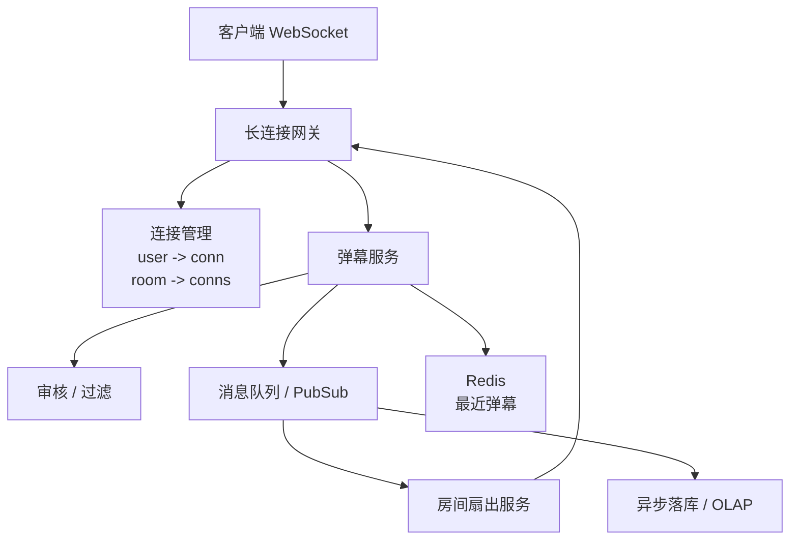
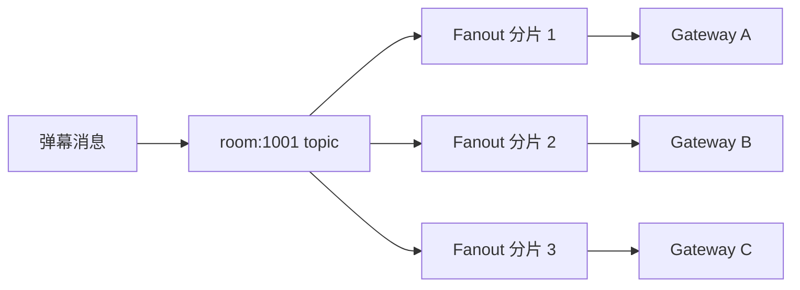

# 实时弹幕系统

> 弹幕系统的核心是长连接管理、房间内消息扇出、限流审核、热点房间隔离和消息最终可达。

## 一、需求澄清

核心功能：

- 用户进入直播间后建立长连接。
- 用户发送弹幕。
- 同房间观众实时收到弹幕。
- 支持敏感词审核、限流、反垃圾。
- 支持弹幕历史短暂回放。

非目标：

- 弹幕不是强事务消息。
- 允许少量丢失或降级。
- 热门直播间更关注整体实时性和可用性。

## 二、容量估算

假设：

```text
同时在线用户：1000 万
热门房间在线：50 万
人均弹幕：0.1 条 / 秒
全站弹幕写入：100 万 / 秒
热门房间弹幕：5 万 / 秒
```

结论：

- 长连接数量大。
- 热门房间扇出压力极高。
- 不能每条弹幕同步落数据库。

## 三、核心架构



核心链路：

```text
用户发送弹幕 -> 网关 -> 弹幕服务 -> 限流审核 -> MQ/PubSub -> 房间扇出 -> 网关推送
```

## 四、长连接管理

### 1. 连接路由

需要维护：

```text
user_id -> connection
connection -> gateway_node
room_id -> connection list
```

用户进入房间：

- 建立 WebSocket。
- 网关注册连接。
- 加入房间订阅关系。

用户退出：

- 断开连接。
- 清理订阅关系。

### 2. 网关无状态 vs 有状态

长连接网关天然有状态，因为连接在某台机器上。

设计思路：

- 网关负责连接和推送。
- 业务服务不直接保存连接。
- 连接元数据可上报到注册中心或 Redis。
- 房间消息通过 MQ / PubSub 分发到对应网关。

## 五、房间广播

### 1. 小房间

小房间可以直接按连接列表广播。

### 2. 热门房间

热门房间不能简单单点广播。

方案：

- 房间分片。
- 网关按房间订阅。
- 弹幕服务只投递到房间频道。
- 多个扇出节点并行处理。



## 六、限流与审核

用户维度：

- 每秒最多 N 条。
- 重复内容过滤。
- 新用户或风险用户更严格。

房间维度：

- 热门房间弹幕抽样展示。
- 超过阈值合并、丢弃低优先级弹幕。
- 高价值消息如礼物、系统通知优先。

内容审核：

- 敏感词本地快速匹配。
- 复杂审核异步处理。
- 风险弹幕先拦截或延迟展示。

## 七、消息可靠性取舍

弹幕通常不要求强可靠：

- 普通弹幕可以允许少量丢失。
- 礼物、付费弹幕、系统通知不能丢。

分级：

| 消息类型 | 可靠性 | 处理方式 |
| --- | --- | --- |
| 普通弹幕 | 尽力而为 | 内存队列 / PubSub |
| 高亮弹幕 | 较高 | MQ + 重试 |
| 礼物消息 | 高 | 持久化 + MQ + 幂等 |
| 系统通知 | 高 | 持久化 + ACK |

## 八、弹幕历史

不需要保存所有弹幕到 MySQL 主库。

常见做法：

- Redis List / Stream 保存最近 N 条。
- 异步写入日志或 OLAP。
- 回放时加载时间窗口内弹幕。

## 九、常见坑

- 每条弹幕都同步写 MySQL。
- 热门房间单节点广播，扇出瓶颈。
- 不区分普通弹幕和礼物消息可靠性。
- 没有限流，弹幕刷屏打爆网关。
- 长连接网关和业务逻辑强耦合。
- 用户断线不清理订阅关系，内存泄漏。

## 十、面试表达

```text
弹幕系统核心是长连接和房间内消息扇出。
客户端通过 WebSocket 连接到网关，网关维护连接和房间订阅关系。
用户发送弹幕后先做限流和审核，再投递到房间 topic，由扇出服务推给订阅该房间的网关。
普通弹幕可以尽力而为，礼物和系统消息要持久化、幂等和重试。
热门房间要做房间分片、消息降级和优先级，避免单点广播打满。
```
