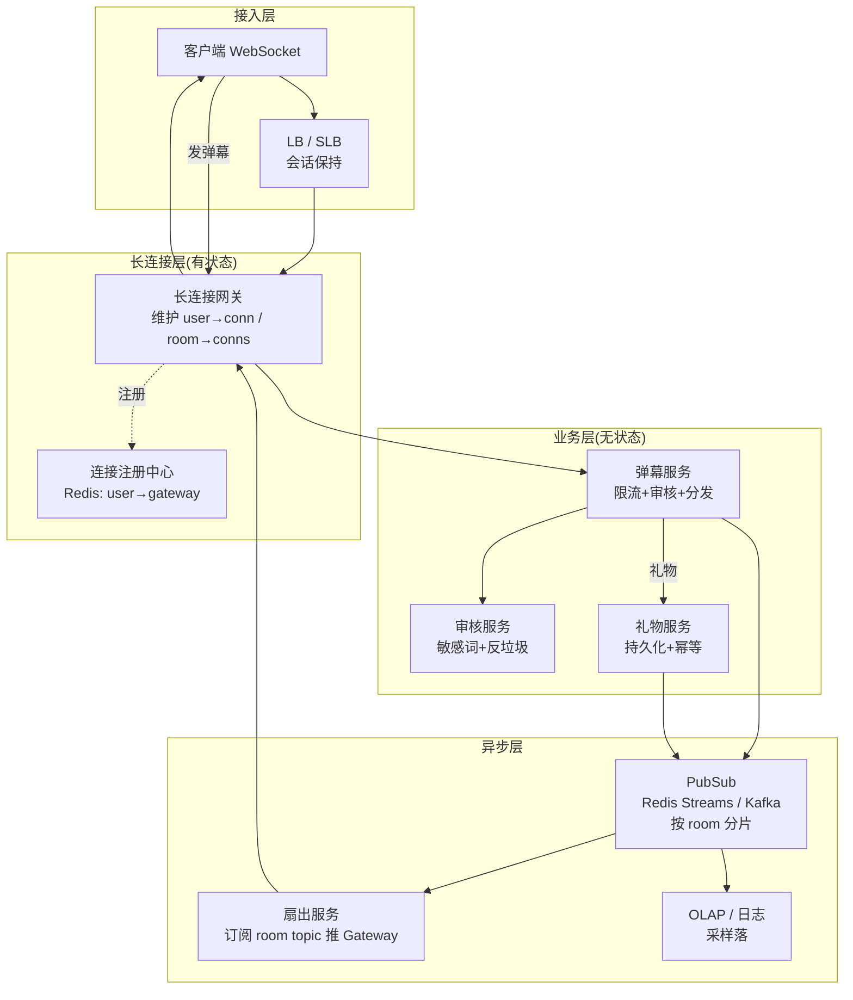
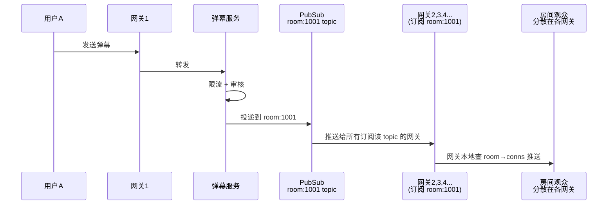
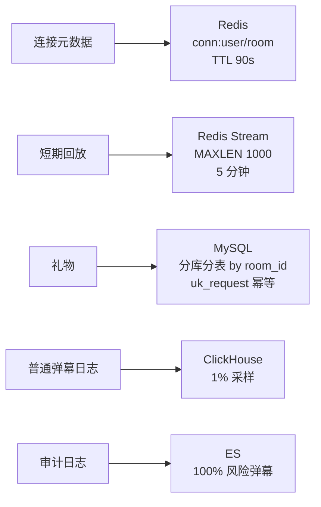
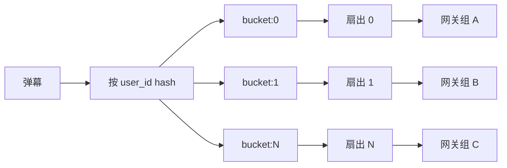

# 实时弹幕系统(4S 版)

> 用 [01b-4s-method.md](01b-4s-method.md) 的 **4S 分析法**(Scenario / Service / Storage / Scale)重新推一遍实时弹幕系统。
>
> **目标**:展示 4S 方法论在**长连接 + 实时扇出**类系统上的产出,与按主题平铺的 [04-realtime-barrage.md](04-realtime-barrage.md) 形成对比,**两份共存**——旧版懂业务,新版练答题节奏。
>
> **弹幕 vs 秒杀 / 支付 / Feed**(对照 [03b](03b-seckill-system-4s.md) / [13b](13b-payment-system-4s.md) / [06b](06b-feed-system-4s.md)):
> - 秒杀=写极热点 + 允许少卖
> - 支付=QPS 不高 + 一分钱不能错
> - Feed=写扩散 + 推拉混合
> - **弹幕=长连接极多 + 单房间扇出爆炸 + 允许丢失**——4S 节奏一样,但弹幕的核心矛盾是**"长连接管理 + 房间内极致扇出"**

---

## 一、为什么单独写一份

| 文档 | 适用 | 风格 |
| --- | --- | --- |
| [04-realtime-barrage.md](04-realtime-barrage.md) | **理解弹幕业务** | 10 节主题平铺(需求/容量/架构/长连接/房间广播/限流审核/可靠性/历史/坑/收束) |
| **本文(4S 版)** | **面试白板复述** | 4 段递进,每段 5-10 分钟,严格按 4S 节奏 + **房间内扇出主线**贯穿 |

> **资深建议**:**两份都看**——业务理解看旧版(长连接管理 / 房间分片 / 礼物可靠性最清楚),面试现场用 4S 节奏,**强调"长连接 + 房间扇出"主线**和秒杀、支付区分开。

---

## 二、Scenario(场景分析,5 分钟)

**核心目标**:先问清楚弹幕规模、热门房间峰值、**可靠性分级**——弹幕是典型的"**百万长连接 + 单房间百万扇出 + 大部分允许丢**"系统,设计哲学和秒杀、支付完全不同。

### 2.1 功能分级

| 等级 | 功能 |
| --- | --- |
| **Must** | 长连接接入 / 发弹幕 / 同房间观众实时收到 / 限流 / 敏感词审核 |
| **Nice** | 弹幕历史短暂回放 / 礼物特效弹幕 / 弹幕颜色样式 / 反垃圾 |
| **Out** | 直播推流(归直播系统)/ 强一致弹幕(允许丢)/ 永久存储所有弹幕 |

**反模式**:面试官说"设计弹幕",你直接画"WebSocket + Redis PubSub" → **错**,**先问规模**——是 1 万人小直播还是百万人热门直播,**单房间扇出量级完全不同**。

### 2.2 容量估算

```text
同时在线用户:    1000 万(长连接)
平均房间数:      10 万
热门房间在线:    50 万(头部主播)
人均弹幕:        0.1 条/秒
全站写入 QPS:    100 万
热门房间写入:    单房间 5 万 QPS

扇出放大(关键):
  普通房间(1 万人)发 1 条 → 1 万次推送
  热门房间(50 万人)发 1 条 → 50 万次推送 / 全房间 5 万 QPS × 50 万 = 250 亿/秒推送

存储:
  所有弹幕都落库 → 不可行
  Redis 保留最近 N 条用于回放 = 100 万 QPS × 30 秒 = 3000 万条 ≈ 6 GB
  异步落 OLAP/日志 = 100 万 × 86400 = 860 亿/天,只能采样
```

**关键认知**:弹幕的瓶颈不是写,是**长连接数 + 房间内扇出爆炸**——单条弹幕推送量 = 房间在线人数。

### 2.3 非功能要求(资深扣分点)

| 维度 | 要求 | 与其他系统对比 |
| --- | --- | --- |
| **可靠性** | **分级**——普通弹幕尽力而为,礼物/系统通知必达 | 比支付宽松,比秒杀宽松,**和 IM 不同**(IM 全部要可靠) |
| **延迟** | 端到端 P99 < 1s(用户感知"实时") | 比秒杀严(秒杀 1s 内),比支付严 |
| **可用性** | 99.9%——弹幕挂了直播还能看 | 比直播本身低 |
| **数据保留** | 历史 30 秒 - 5 分钟回放(Redis),长期采样落 OLAP | 极短,远低于支付(7 年) |
| **顺序** | 同一用户内有序,房间整体不强求严格序 | 比 IM 宽松(IM 一对一要严格序) |

### 2.4 可靠性定调(弹幕的灵魂)

> "弹幕的本质是**广播 + 实时**,不是消息可靠传输。我会让普通弹幕走**Best-Effort PubSub**(快但允许丢),让礼物和系统通知走**MQ 持久化 + ACK 重试**,让超热门房间走**降级采样**(展示部分弹幕,牺牲完整性保整体)。**宁可丢一条普通弹幕,也不能让网关推爆**。"

**这句话定下了整个系统的设计原则**——后面 Service / Storage / Scale 都围绕"**长连接管理 + 分级可靠性 + 热点房间隔离**"展开,**和秒杀、支付完全不同**。

### 2.5 与其他 4S 系统的根本差异

| 维度 | 秒杀 | 支付 | Feed | **弹幕** |
| --- | --- | --- | --- | --- |
| 连接模型 | HTTP 短连接 | HTTP 短连接 | HTTP 短连接 | **WebSocket 长连接** |
| QPS 瓶颈 | 单 sku 写热点 | 不在性能 | 写扩散 fanout | **房间内单条扇出 50 万** |
| 一致性 | 强一致防超卖 | 强一致防丢钱 | 最终一致 | **Best-Effort + 分级可靠** |
| 状态保持 | 无 | 状态机 | 时间线 | **连接状态 + 房间订阅** |
| 设计重心 | 防热点 + 削峰 | 资金安全 | 推拉混合 | **长连接管理 + 热点房间隔离** |

---

## 三、Service(服务拆分,10 分钟)

**核心目标**:按 SRP 拆服务,**画三层架构**,**写出核心协议 + 房间扇出策略**。弹幕服务的拆分核心是**"长连接网关与业务逻辑分离"**——网关有状态(连接),业务无状态。

### 3.1 三层架构



### 3.2 服务职责

| 服务 | 职责 | 不做 |
| --- | --- | --- |
| **长连接网关** | 维护 WebSocket 连接 / 房间订阅 / 推送 / 心跳 | 不做业务判断(纯转发) |
| **弹幕服务** | 限流 / 调审核 / 投递到 PubSub / 礼物分流 | 不维护连接 |
| **审核服务** | 敏感词本地匹配(快速)/ 复杂审核异步 | 不直接拒绝(返结果给弹幕服务) |
| **礼物服务** | 持久化礼物 / 幂等 / 高优先级标记 | 不做普通弹幕 |
| **扇出服务** | 订阅房间 topic / 查注册中心 / 按 gateway 分发 | 不维护连接(交给网关) |
| **连接注册中心** | 维护 user→gateway 映射,断线清理 | 不存消息 |

**关键决策**:
- **网关与业务分离**——网关有状态(连接驻留),不能频繁重启;业务无状态(可滚动发布)。
- **房间扇出走 PubSub**——弹幕服务投递到 `room:{room_id}` topic,**所有订阅该 topic 的网关都能收到**——避免业务知道谁的连接在哪个网关。
- **礼物独立持久化**——礼物涉及付费,必须可靠投递 + 幂等,**和普通弹幕完全分开**。

### 3.3 核心协议(WebSocket)

**客户端 → 网关**:

```json
// 进入房间
{ "op": "join", "room_id": 1001, "token": "xxx" }

// 发送弹幕
{ "op": "msg", "room_id": 1001, "content": "666", "type": "normal" }

// 心跳
{ "op": "ping" }

// 离开
{ "op": "leave", "room_id": 1001 }
```

**网关 → 客户端**:

```json
// 推送弹幕
{ "op": "msg", "room_id": 1001, "user": "u123", "content": "666", "ts": 1717000000 }

// 系统通知(高优)
{ "op": "sys", "level": "important", "content": "主播开始 PK" }

// 心跳响应
{ "op": "pong" }
```

**资深加分点**(必讲):

| 点 | 说明 |
| --- | --- |
| **心跳** | 30s 一次,网关侧 90s 无心跳即清理连接(防僵尸连接) |
| **会话保持** | LB 用 IP-hash 或 cookie 粘连,**断线重连尽量回到原网关**(否则订阅状态要重建) |
| **背压** | 网关侧每连接发送队列上限(如 500 条),**满了直接丢弃普通弹幕**(保系统稳定) |
| **优先级队列** | 网关侧每连接维护两个队列,礼物/系统消息优先发,**普通弹幕拥塞时降级丢弃** |

### 3.4 房间扇出(弹幕的核心骨架)



**为什么用 PubSub 不用直连**:
- 直连:弹幕服务要知道每个观众的网关 → **业务和连接强耦合**
- PubSub:弹幕服务只投递到 `room:1001` topic → **业务无状态**,网关订阅自己感兴趣的房间

---

## 四、Storage(存储设计,10 分钟)

**核心目标**:弹幕的**存储很轻**(大部分不持久化)——核心是**连接元数据 + 短期回放 + 分级落库**。

### 4.1 连接注册中心(Redis)

```text
Key:    conn:user:{user_id}
Value:  { gateway_id, conn_id, joined_rooms: [1001, 1002] }
TTL:    心跳续命,90s 无心跳过期

Key:    conn:room:{room_id}:gateway:{gateway_id}
Type:   Set
Value:  conn_ids
       (用于扇出服务知道哪些网关订阅了房间)
```

**为什么必须有注册中心**:
> "断线重连或跨网关消息(如私信)需要知道'目标用户的连接在哪个网关'。**注册中心是连接元数据的事实源**,网关本地缓存 + 注册中心兜底。"

### 4.2 短期弹幕回放(Redis Stream / List)

```text
Key:    barrage:room:{room_id}:recent
Type:   Stream(或 List)
Value:  { user, content, ts, type }
保留:    最近 5 分钟 / 最多 1000 条(XADD MAXLEN)
```

**用途**:
- 用户进入直播间能立刻看到最近几条弹幕(**避免静默感**)
- 短暂的网络断开重连后补齐少量历史

**为什么不用 MySQL**:
> "弹幕写入 100 万 QPS,MySQL 扛不住,而且**没必要永久存**。Redis Stream 自带 MAXLEN 截断,**写完即过期**,完全够用。"

### 4.3 礼物 / 系统通知(MySQL + MQ)

```sql
CREATE TABLE gifts (
  id              BIGINT       NOT NULL,
  room_id         BIGINT       NOT NULL,
  user_id         BIGINT       NOT NULL,
  gift_id         INT          NOT NULL,
  amount          INT          NOT NULL,
  request_id      VARCHAR(64)  NOT NULL,         -- 幂等键
  status          TINYINT      NOT NULL,         -- 1=pending 2=success 3=failed
  created_at      DATETIME     NOT NULL,

  PRIMARY KEY (id),
  UNIQUE KEY uk_request (request_id),            -- 幂等防重投
  KEY idx_room (room_id, created_at)
) ENGINE=InnoDB;
```

**礼物为什么走 MySQL**:
- 涉及**钱**(用户充值的虚拟币)→ **必须持久化 + 幂等**
- 走和支付同样的"唯一索引 + 状态机"模式

### 4.4 弹幕日志(异步采样)

```text
全站 100 万 QPS × 86400 = 860 亿/天,全量落库不可行。

采样策略:
  - 普通弹幕 → 1% 采样落 ClickHouse(看趋势 + 监管)
  - 礼物 → 100% 落 MySQL
  - 系统通知 → 100% 落 OLAP
  - 风险/被拦截弹幕 → 100% 落审计日志
```

### 4.5 存储选型一图



**为什么没有"主存"**:
> "弹幕和支付/Feed 完全不同——**没有主存,大部分弹幕用完即弃**。Redis 是核心(连接 + 回放),MySQL 只用于礼物(因为涉及钱),其他全部走采样和异步。这是'读多写多 + 不要求持久'的典型设计。"

---

## 五、Scale(扩展设计,10 分钟)

按 4S 第六板斧逐条:

| 板斧 | 弹幕场景具体动作 |
| --- | --- |
| **缓存** | 房间元数据缓存(房主/规则);连接注册中心 Redis;**弹幕本身不缓存**(实时性) |
| **分片** | 网关水平扩展,按 user_id hash 路由;PubSub 按 room_id 分片;礼物 MySQL 按 room_id 分库 |
| **异步** | 落库异步;审核复杂场景异步;**弹幕推送本身必须实时同步** |
| **限流降级** | 用户级:每秒 N 条;房间级:超阈值丢弃普通弹幕保礼物;**降级**:热门房间抽样推送 |
| **容灾** | 网关多机房;PubSub 多副本;**Redis 挂 → 弹幕完全不可用,但直播继续** |
| **监控** | 长连接数 / 房间分布 / 推送延迟 P99 / 网关 CPU / PubSub 堆积 |

### 5.1 房间分片 —— 弹幕场景特有的扩展

**单房间 50 万人 + 5 万 QPS 写入 → 单 PubSub topic 扛不住**。

**房间分片三步**:

```text
步骤 1:大房间分桶
  room:1001 → room:1001:bucket:0..N
  弹幕服务 hash(user_id) % N 选桶
  网关订阅所有桶

步骤 2:扇出节点并行
  每个桶独立的 PubSub topic
  每个 topic 独立的扇出服务实例
  N 个桶 = N 倍吞吐

步骤 3:网关层进一步分片
  超大房间观众分配到不同网关组
  每组只订阅部分桶(降低单网关订阅数)
```



### 5.2 热点房间降级 —— 让用户看见就行

**百万人同时直播间,推完整 5 万 QPS 不现实**(用户客户端也渲染不过来)。

**降级策略**:

| 层 | 手段 |
| --- | --- |
| **采样** | 网关层每秒最多向单连接推 N 条(50-100),超出**随机丢弃普通弹幕** |
| **合并** | "666 + 666 + 666" → 合并为"666 × 100" |
| **优先级** | 礼物 / 系统通知 / 主播私信 100% 推,普通弹幕降级 |
| **客户端限频** | 客户端协商每秒接受上限,网关按需限流 |

**资深动作**:讲清楚"**热门房间不是技术问题,是产品决策**——用户看不见 50 万条弹幕,看见 100 条就够了,**采样不是 bug 是 feature**"。

### 5.3 长连接的运维 —— 弹幕特有的工程难题

**长连接和无状态服务的运维不同**:

| 问题 | 应对 |
| --- | --- |
| **网关重启 = 连接全断** | 蓝绿发布 / 优雅下线(先停接入,等连接自然消亡或迁移) |
| **僵尸连接** | 心跳超时清理,通常 90s |
| **连接漂移** | 注册中心 TTL + 网关定期上报 |
| **连接洪峰** | 接入层限流 + 拒绝新连接保老连接 |
| **跨机房** | 同机房就近接入 + 房间消息跨机房同步(Kafka MirrorMaker) |

### 5.4 演进路线

```text
阶段 1(MVP,小直播 1 万人):
  - 单网关集群 + Redis PubSub
  - 弹幕全量推送
  - 单库礼物

阶段 2(成长期,头部直播 50 万人):
  - 网关水平扩展 + 注册中心
  - 房间分桶
  - PubSub 升级 Kafka(持久化 + 重放)
  - 热门房间降级采样

阶段 3(大型,全民直播 1000 万长连接):
  - 网关多机房
  - 房间多级分桶 + 网关组隔离
  - 智能采样(AI 选高质量弹幕)
  - 跨机房消息同步

阶段 4(超大型,跨境直播):
  - 多 region + GeoDNS 接入
  - 房间状态跨 region 同步(本地优先,跨境异步)
  - 边缘节点缓存历史弹幕
```

---

## 六、新版(本文)vs 旧版 [04-realtime-barrage.md](04-realtime-barrage.md)

> 用户的核心诉求:**对比之前的弹幕文档,看出区别**。

### 6.1 结构对比表(8 维度)

| 维度 | **旧版** [04-realtime-barrage.md](04-realtime-barrage.md) | **新版**(本文 4S 风格) |
| --- | --- | --- |
| **组织方式** | 按"主题"切——需求/容量/架构/长连接/房间广播/限流审核/可靠性/历史/坑/收束 **(10 节)** | 按"4S 顺序"切——Scenario / Service / Storage / Scale **(4 节)** |
| **顺序逻辑** | **平铺**——10 节相对独立 | **递进**——前一步是后一步的输入 |
| **Scenario 处理** | 第一节"需求澄清" + 第二节"容量估算"——**没区分长连接特性,没和其他系统对比** | **完整四件事**——功能/容量/非功能/**可靠性分级主线**(对比秒杀/支付/Feed) |
| **Service 处理** | 第三节"核心架构"——**一张图,没拆服务,没写 WebSocket 协议,没区分有状态/无状态** | **三层 + 6 个服务**(网关/弹幕/审核/礼物/扇出/注册中心)+ WebSocket 协议 + 房间扇出时序图 |
| **Storage 处理** | 第八节"弹幕历史"——**只讲了 Redis List,没讲连接元数据,没讲礼物 MySQL,没讲采样** | **集中四类**(连接/回放/礼物/日志)+ Schema + 选型理由 + **没有"主存"的设计哲学** |
| **Scale 处理** | 第五节"房间广播" + 第六节"限流审核" + 第九节"坑"——**碎片化,没演进** | **6 板斧 + 房间分片 + 热点房间降级 + 长连接运维 + 演进路线 4 阶段** |
| **可靠性主线** | 第七节单独讲分级,**没有作为设计哲学贯穿** | **从 Scenario 定调到 Scale 演进,贯穿全文** |
| **资深信号** | 中——讲了房间分片 / 限流 / 礼物分级 | **强**——讲了**长连接 vs 短连接的根本差异**、**网关有状态的运维难题**、**没有主存的设计哲学**、**采样不是 bug 是 feature** |

### 6.2 关键差异详解

#### a. Scenario 的差异——**长连接特性的"可靠性定调"**

旧版的"需求澄清"和秒杀、支付、Feed 几乎一样——都是列功能。**这是错的**——弹幕的 Scenario 必须**一开始就定调"长连接 + 分级可靠"**,后面所有设计都围绕这个走。

新版**强制四件事**:功能 + 容量 + 非功能 + **可靠性分级主线**,并且**和秒杀/支付/Feed 做对比**——让面试官看到你**理解 WebSocket 长连接和 HTTP 短连接的根本不同**,而不是套同一个模板。

#### b. Service 的差异——**网关有状态是弹幕特色**

旧版**一张架构图把网关和业务画在一起**,没讲清楚**"网关有状态(驻留连接),业务无状态"**这个核心架构决策。

新版明确**三层 + 6 服务**,核心是**长连接网关与业务逻辑分离 + 通过 PubSub 解耦**——讲清楚"业务投到 `room:1001` topic,网关订阅,**业务不需要知道谁的连接在哪**"。这是**弹幕系统区别于 HTTP 系统的关键**,旧版没有。

另外:**WebSocket 协议**(join/msg/ping/leave)、**心跳超时清理**、**优先级队列 + 背压**,这些都是资深考点,旧版没具体协议。

#### c. Storage 的差异——**没有"主存"的设计哲学**

旧版讲了 Redis List 历史回放,但**没讲清**:
- **连接注册中心**(为什么必须有,断线重连用)
- **礼物为什么走 MySQL 而普通弹幕不走**(钱必须可靠)
- **没有主存的本质**(用完即弃)
- **采样落库**(全量不可行)

新版**集中讲完**——这些是**弹幕岗位面试的核心考点**,旧版漏了基本就被判初级。

#### d. Scale 的差异——**热点房间和长连接运维**

旧版**Scale 散在多节**,没讲:
- **房间分桶**(单房间 50 万 → 多桶并行)
- **热点房间降级**(采样不是 bug 是 feature)
- **长连接运维**(蓝绿发布 / 优雅下线 / 僵尸连接)
- **演进路线 4 阶段**(MVP → 成长 → 大型 → 跨境)

新版**全部展开**——这才是弹幕岗位的"扩展性"含义,旧版完全缺失。

### 6.3 哪个更适合什么场景

| 场景 | 推荐 |
| --- | --- |
| **第一次学弹幕** | 旧版——长连接管理和房间广播图最直观 |
| **弹幕岗位面试** | **新版**——4S 节奏 + 长连接主线,**和面试官答题模板对齐** |
| **写弹幕系统设计文档** | **新版**——Schema 完整,Scale 完整 |
| **快速复习可靠性分级** | 旧版——第七节集中讲,记忆点清晰 |

---

## 七、面试现场表达模板

> 套用 [01b-4s-method.md](01b-4s-method.md) 的全套 4S 开场白,代入弹幕场景。**注意:开场白第一句就要点出长连接特性**——弹幕和秒杀、支付、Feed 都不同,是**长连接 + 房间扇出**系统。

```text
"我用 4S 来组织这道弹幕系统的设计——先说一句定调:
 弹幕和 HTTP 系统完全不同,核心是'WebSocket 长连接 + 单房间扇出极致 + 分级可靠',
 所以我所有设计都围绕'长连接管理 + 房间内极致扇出 + 礼物礼物礼物可靠普通弹幕降级'。

第一步 Scenario(5 分钟):
  全站 1000 万长连接,10 万房间,头部 50 万人。
  写入 100 万 QPS,扇出放大后单条弹幕在热门房间 = 50 万次推送。
  非功能:普通弹幕 Best-Effort,礼物必达,P99 < 1s。
  这和秒杀、支付、Feed 都不同——它是'长连接 + 房间扇出'系统。

第二步 Service(10 分钟):
  三层 6 服务——
    接入层:WebSocket Gateway(LB 会话保持);
    长连接层:网关(有状态,维护 user→conn / room→conns)+ 注册中心(Redis);
    业务层:弹幕服务(限流+审核+分发)+ 审核 + 礼物(独立持久化);
    异步层:PubSub(按 room 分片)+ 扇出服务 + OLAP/日志(采样)。
  关键决策:网关有状态业务无状态分离、PubSub 解耦扇出、礼物独立持久化。
  WebSocket 协议:join/msg/ping/leave,心跳 30s 超时 90s,网关侧优先级队列 + 背压。

第三步 Storage(10 分钟):
  连接元数据——Redis(TTL 90s 心跳续命);
  短期回放——Redis Stream(MAXLEN 1000,5 分钟过期);
  礼物——MySQL 分库分表 + uk_request 幂等;
  普通弹幕——1% 采样落 ClickHouse,审计风险弹幕 100% 落 ES。
  设计哲学:弹幕没有'主存',大部分用完即弃。

第四步 Scale(10 分钟):
  缓存——房间元数据 + 注册中心,弹幕本身不缓存;
  分片——网关 hash 路由,PubSub 按 room_id 分片,礼物按 room_id 分库;
  异步——落库异步,推送本身必须实时;
  限流降级——用户限流 + 房间超载丢普通保礼物;
  容灾——网关多机房,Redis 挂弹幕不可用但直播继续;
  监控——长连接数 / 推送延迟 P99 / PubSub 堆积。
  弹幕特色:房间分桶(大房间 → 多桶并行)、热点房间降级采样
            (用户看 100 条够了不用 50 万条)、长连接运维(蓝绿/僵尸/漂移)。

最后讲演进:小直播 → 头部直播分桶 → 全民直播多机房 → 跨境多 region。"
```

---

## 八、一句话总结

> **弹幕系统按 4S 推**:**Scenario 定调长连接 + 分级可靠**(普通 Best-Effort 礼物必达)→ **Service 拆网关/弹幕/礼物/扇出/注册中心**(网关有状态业务无状态)→ **Storage 用 Redis 主+ MySQL 礼物**(没有"主存",用完即弃)→ **Scale 走房间分桶/热点降级/长连接运维**(扇出 6 板斧);
>
> - 旧版 [04-realtime-barrage.md](04-realtime-barrage.md) 按主题平铺,长连接和房间广播讲得清楚,**但缺 Scale + 缺长连接特性主线**
> - 新版(本文)按 4S 递进,**长连接 + 分级可靠贯穿全文**——和弹幕岗位面试模板对齐
> - **弹幕 vs 秒杀/支付/Feed**(对比 [03b](03b-seckill-system-4s.md) / [13b](13b-payment-system-4s.md) / [06b](06b-feed-system-4s.md)):4S 框架一样,**但每一步取舍完全不同**——秒杀防热点,支付保一致,Feed 推拉混合,弹幕**长连接管理 + 房间内极致扇出**
> - 两份共存,相互补充
