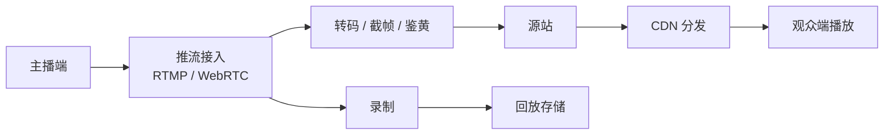
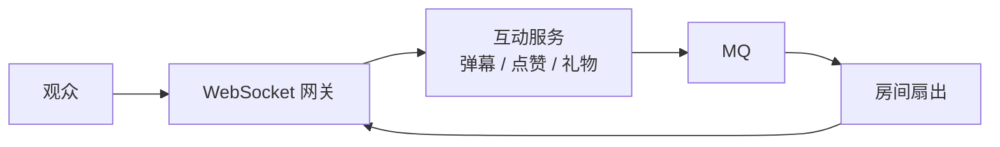
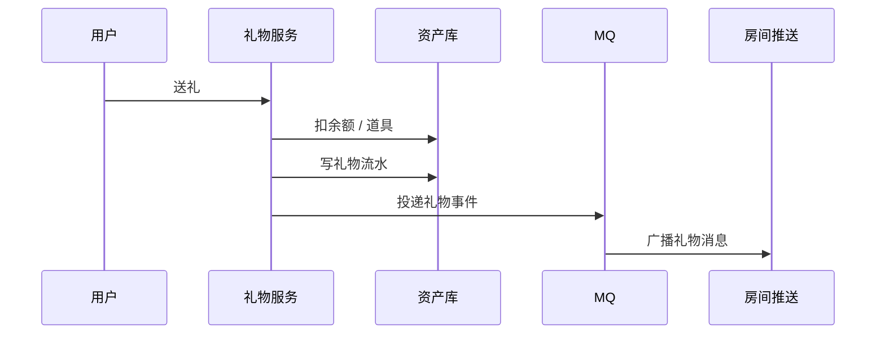

# 直播系统

> 直播系统是音视频链路、实时互动、CDN 分发、低延迟和高可用的综合题。核心是把媒体流和互动消息分开设计。

## 一、需求澄清

核心功能：

- 主播推流。
- 观众拉流观看。
- 支持弹幕、点赞、礼物。
- 支持直播录制和回放。
- 支持转码和多清晰度。

关键指标：

- 首屏时间。
- 卡顿率。
- 端到端延迟。
- 推流成功率。
- 播放成功率。
- CDN 带宽成本。

## 二、核心链路



互动链路：



媒体流和互动消息要分开：

- 媒体流走推流、转码、CDN。
- 弹幕礼物走长连接和消息系统。

## 三、协议选择

| 协议 | 延迟 | 适合场景 |
| --- | --- | --- |
| HLS | 高，几秒到十几秒 | 大规模分发、兼容性好 |
| FLV | 中，秒级 | 常见直播播放 |
| WebRTC | 低，毫秒到秒级 | 连麦、互动直播 |
| RTMP | 常用于推流 | 主播推流、源站接入 |

取舍：

- 大规模直播：CDN + FLV/HLS 成本和稳定性更好。
- 强互动低延迟：WebRTC 更合适，但成本和复杂度更高。

## 四、转码与多清晰度

转码目的：

- 适配不同网络和设备。
- 降低观众卡顿。
- 支持 1080p、720p、480p。

流程：

```text
主播原始流
  -> 转码
  -> 多路码率
  -> CDN 分发
  -> 播放器自适应切换
```

取舍：

- 转码增加成本和延迟。
- 不转码成本低，但适配性差。

## 五、直播间服务

直播间状态：

- 未开播。
- 直播中。
- 暂停 / 断流。
- 已结束。

关键数据：

- room_id。
- anchor_id。
- stream_id。
- push_url。
- play_url。
- status。
- started_at / ended_at。

状态变更要可靠：

- 主播开播创建 stream。
- 推流成功更新直播中。
- 断流进入短暂等待。
- 超时未恢复则结束或标记异常。

## 六、弹幕和礼物

弹幕：

- 走 WebSocket。
- 普通弹幕可降级。
- 热门房间限流和抽样。

礼物：

- 涉及资产扣减，必须强一致。
- 扣余额或扣道具成功后再广播礼物消息。
- 礼物消息要幂等、防重复消费。

礼物链路：



## 七、录制和回放

录制：

- 按直播流切片。
- 上传对象存储。
- 生成回放索引。
- 支持审核和剪辑。

回放：

- 走点播 CDN。
- 弹幕可以按时间轴回放。

## 八、容错和降级

主播断流：

- 短时间内保留直播间。
- 提示观众主播网络波动。
- 超过阈值结束直播。

CDN 故障：

- 多 CDN 调度。
- 按地区切换。
- 播放器自动重试备用地址。

互动压力过大：

- 普通弹幕降采样。
- 点赞合并计数。
- 礼物消息优先。

## 九、常见坑

- 媒体流和弹幕消息混在一个链路里设计。
- 只讲推流，不讲 CDN 和转码成本。
- 不区分普通弹幕和礼物资产消息。
- 热门直播间没有限流和降级。
- 直播回放没有切片和索引设计。
- 忽略带宽成本和多 CDN 容灾。

## 十、面试表达

```text
直播系统我会把媒体链路和互动链路分开。
主播推流进入接入层，经过转码、录制、源站和 CDN 分发给观众；
弹幕、点赞、礼物走 WebSocket 和消息系统。
大规模直播通常用 CDN 保证分发能力，低延迟互动场景可以考虑 WebRTC。
礼物涉及资产扣减，要用数据库事务和幂等流水保证一致性；
普通弹幕可以降级和抽样，热门房间要做限流、房间分片和优先级。
```
