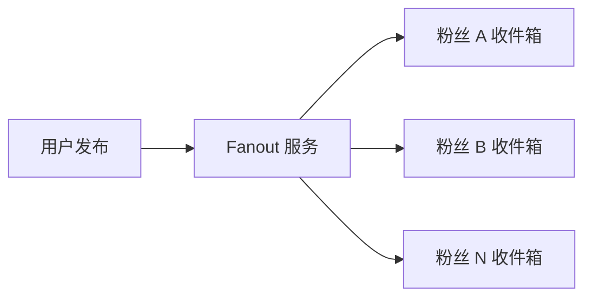
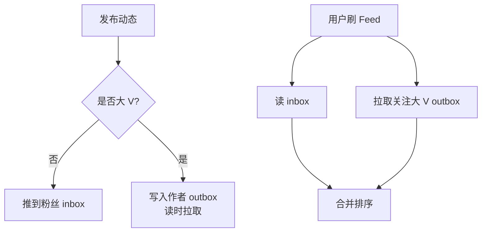
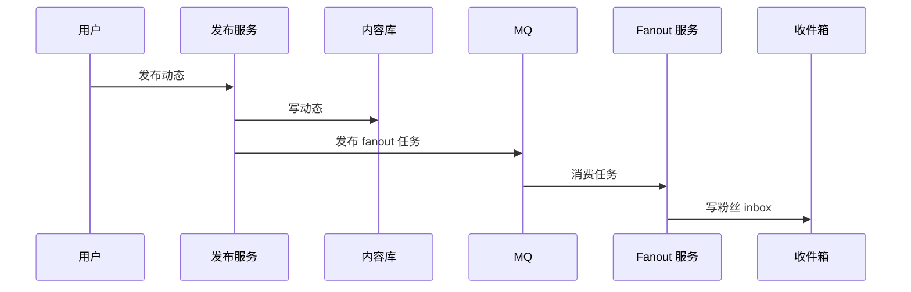

# Feed 信息流系统

> Feed 系统核心是时间线模型：写扩散还是读聚合，如何处理大 V、排序、删除、隐私和冷热数据。

## 一、需求澄清

场景：

- 用户发布动态。
- 粉丝查看关注流。
- 支持点赞、评论、转发。
- 支持删除、屏蔽、隐私权限。
- 可接入推荐排序。

先区分：

- 关注流：用户关注的人发布内容。
- 推荐流：算法推荐内容。

这两个系统架构不同。关注流重点是 fanout，推荐流重点是召回和排序。

## 二、容量估算

假设：

```text
DAU：1000 万
日发布动态：100 万
日刷 Feed 请求：2 亿
平均关注数：200
大 V 粉丝数：1000 万
```

结论：

- 读远多于写。
- 普通用户可以写扩散。
- 大 V 写扩散会爆炸，需要特殊处理。

## 三、推模式、拉模式、混合模式

### 1. 推模式

用户发布动态时，把动态 ID 推到粉丝收件箱。



优点：

- 读很快。
- 刷 Feed 直接读自己的 inbox。

缺点：

- 写放大。
- 大 V 发布会写爆。
- 粉丝关系变化需要处理。

### 2. 拉模式

用户刷 Feed 时，读取自己关注的人最近动态再合并排序。

优点：

- 写入轻。
- 大 V 发布不爆。

缺点：

- 读复杂。
- 关注多时合并成本高。
- 延迟较高。

### 3. 混合模式

推荐：

- 普通用户：推模式。
- 大 V：拉模式。
- 活跃用户：维护 inbox。
- 长期不活跃用户：延迟构建。



## 四、数据模型

### 1. 动态表

```sql
create table posts (
    id bigint not null,
    author_id bigint not null,
    content text not null,
    visibility tinyint not null,
    status tinyint not null,
    created_at datetime not null,
    primary key (id),
    key idx_author_created (author_id, created_at)
);
```

### 2. 关注关系

```sql
create table follows (
    user_id bigint not null,
    followee_id bigint not null,
    created_at datetime not null,
    primary key (user_id, followee_id),
    key idx_followee (followee_id)
);
```

### 3. 收件箱

```text
feed_inbox:{user_id} -> post_id list
```

可以放 Redis / KV / 专用 Feed 存储。

## 五、发布链路



发布接口不要同步推给所有粉丝，否则大 V 发布会超时。

## 六、刷 Feed 链路

流程：

1. 读取用户 inbox 的 post_id。
2. 拉取 post 内容。
3. 过滤已删除、屏蔽、不可见内容。
4. 合并大 V outbox。
5. 按时间或模型分排序。
6. 返回游标分页结果。

注意：

- 内容详情可以缓存。
- inbox 只存 ID，避免冗余大内容。
- 删除和隐私过滤可以读时处理。

## 七、大 V 问题

大 V 粉丝数千万，如果用推模式：

```text
1 条动态 -> 1000 万条 inbox 写入
```

不可接受。

解决：

- 大 V 走拉模式。
- 大 V 动态写 outbox。
- 用户刷 Feed 时合并关注大 V 最近内容。
- 热门大 V 内容可以缓存。

## 八、排序和推荐

关注流：

- 按时间排序。
- 可加入简单权重。

推荐流：

- 召回：关注、热门、兴趣、地理、协同过滤。
- 粗排。
- 精排。
- 重排和规则过滤。

系统设计面试里，如果题目是关注流，不要展开太深推荐算法；重点讲时间线和 fanout。

## 九、一致性和删除

删除动态：

- 标记动态状态为 deleted。
- 不一定立即清理所有 inbox。
- 读时过滤 deleted。
- 后台异步清理。

屏蔽和隐私：

- 读时检查关系和权限。
- 高风险内容下架要全局生效。

关注关系变化：

- 新关注：可以拉取对方最近 N 条动态补齐。
- 取消关注：读时过滤，或异步清理 inbox。

## 十、常见坑

- 所有用户都用推模式，大 V 写爆。
- 所有用户都用拉模式，普通用户读太慢。
- inbox 存完整内容，更新和删除成本高。
- 删除动态同步清理所有粉丝 inbox，成本过高。
- 不区分关注流和推荐流。
- 深分页不用游标，导致性能差。

## 十一、面试表达

```text
Feed 系统核心是时间线模型。
如果用推模式，用户发布后把动态 ID 推到粉丝 inbox，读很快但写放大；
如果用拉模式，发布轻，但读时要聚合关注人的动态，延迟高。
所以我会用混合模式：普通用户走推，大 V 走拉。
发布动态先写内容库，再异步 fanout；刷 Feed 时读 inbox，合并大 V outbox，过滤删除、屏蔽和隐私，再按游标分页返回。
删除和关注关系变化不做大规模同步清理，而是读时过滤加后台异步修正。
```
