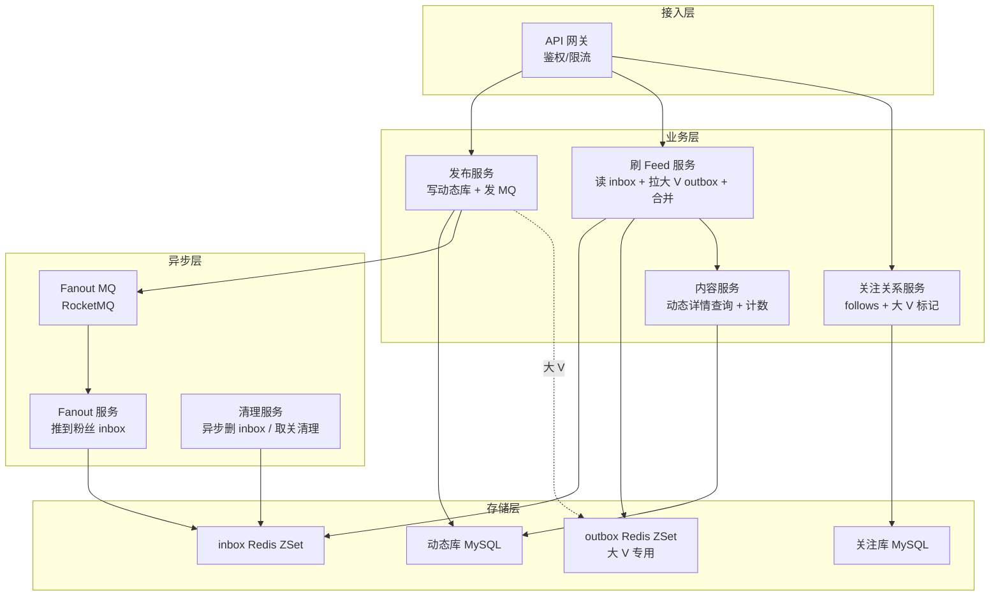
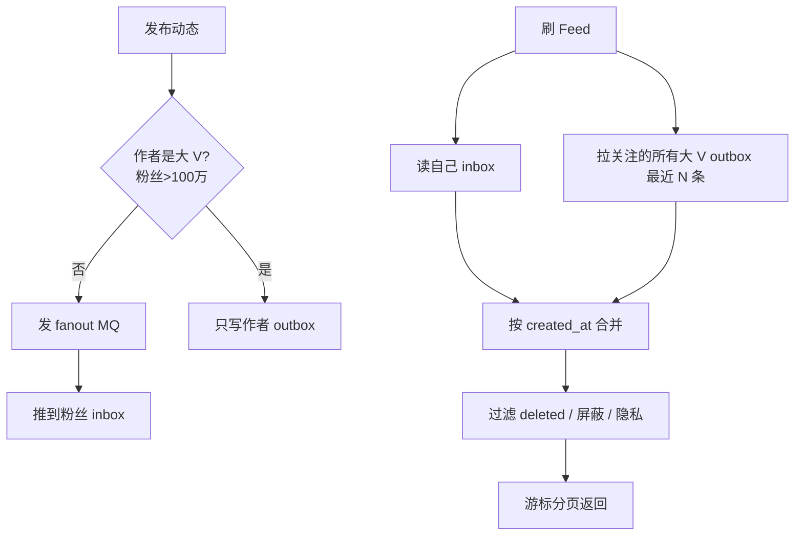
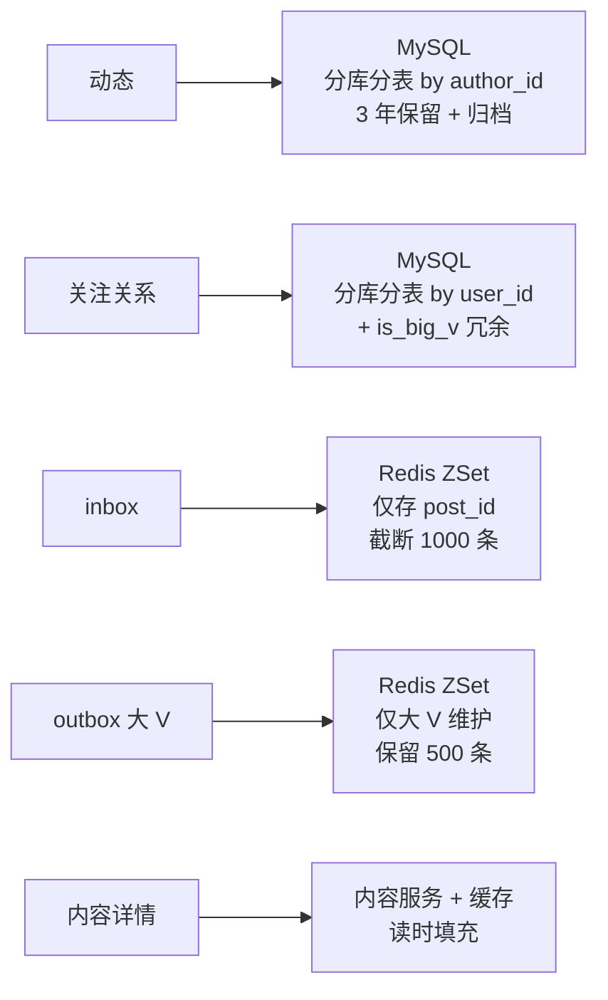

# Feed 信息流系统(4S 版)

> 用 [01b-4s-method.md](01b-4s-method.md) 的 **4S 分析法**(Scenario / Service / Storage / Scale)重新推一遍 Feed 信息流系统。
>
> **目标**:展示 4S 方法论在**写扩散 / 读聚合取舍**类系统上的产出,与按主题平铺的 [06-feed-system.md](06-feed-system.md) 形成对比,**两份共存**——旧版懂业务,新版练答题节奏。
>
> **Feed vs 秒杀 / 支付 / 短链**(对照 [03b](03b-seckill-system-4s.md) / [13b](13b-payment-system-4s.md) / [02b](02b-short-code-platform-4s.md)):
> - 秒杀=写极热点 + 允许少卖
> - 支付=QPS 不高 + 一分钱不能错
> - 短链=纯读型 + 跳转秒级
> - **Feed=读多写也多 + 推拉模型选型 + 大 V 写扩散爆炸**——4S 节奏一样,但 Feed 的核心矛盾是**"写扩散 vs 读聚合"的取舍**

---

## 一、为什么单独写一份

| 文档 | 适用 | 风格 |
| --- | --- | --- |
| [06-feed-system.md](06-feed-system.md) | **理解 Feed 业务** | 11 节主题平铺(需求/容量/推拉模式/数据/发布/刷 Feed/大 V/排序/一致性/坑/收束) |
| **本文(4S 版)** | **面试白板复述** | 4 段递进,每段 5-10 分钟,严格按 4S 节奏 + **写扩散主线**贯穿 |

> **资深建议**:**两份都看**——业务理解看旧版(推拉对比 / 大 V 处理 / 删除一致性最清楚),面试现场用 4S 节奏,**强调"推拉混合"主线**和秒杀、支付区分开。

---

## 二、Scenario(场景分析,5 分钟)

**核心目标**:先问清楚关注流还是推荐流、规模多大、**读写比和大 V 比例**——Feed 是典型的"**读多写也多 + 长尾用户分布极不均衡**"系统,设计哲学和秒杀、支付完全不同。

### 2.1 功能分级

| 等级 | 功能 |
| --- | --- |
| **Must** | 发动态 / 关注流(关注的人发的动态)/ 时间线分页 / 删除动态 / 取关 |
| **Nice** | 点赞评论计数 / 排序优化 / 隐私权限 / 屏蔽 / 推荐流冷启动 |
| **Out** | 推荐召回 + 精排(独立子系统,不在本题范围)/ 直播 / 短视频转码 |

**反模式**:面试官说"设计 Feed",你直接画"推扩散 + Redis inbox" → **错**,**先问关注流还是推荐流**——两个完全不同的系统,关注流重点是 fanout,推荐流重点是召回排序。

### 2.2 容量估算

```text
DAU:           1000 万
日发布动态:    100 万
日刷 Feed:     2 亿次(人均 20 次)
平均关注数:    200
大 V 粉丝数:   1000 万(占总用户 0.01% 但承担巨大写扩散)

QPS:
  发布:        100 万 / 86400 ≈ 12 QPS,峰值 × 10 ≈ 120
  刷 Feed:     2 亿 / 86400 ≈ 2300 QPS,峰值 × 5 ≈ 1.2 万
  关注关系变化: 100 万 / 天 ≈ 12 QPS

存储:
  动态:        500 字节 × 100 万 = 500 MB/天,保留 3 年 ≈ 550 GB
  关注关系:    20 字节 × 1000 万 × 200 = 40 GB(总)
  inbox:       100 万动态 × 200 粉丝 ≈ 2 亿 fanout 写/天
              热点动态(大 V 1000 万粉丝)单条扇出爆炸 → 必须特殊处理
```

**关键认知**:Feed 的写入 QPS 不高(发布只 120),但**fanout 放大后变成 2 亿/天**——**写扩散是核心瓶颈**,大 V 单条动态可能要写 1000 万 inbox。

### 2.3 非功能要求(资深扣分点)

| 维度 | 要求 | 与其他系统对比 |
| --- | --- | --- |
| **一致性** | **最终一致**——发布到 fanout 完成秒级延迟可接受 | 比支付宽松,比秒杀宽松(秒杀强一致防超卖) |
| **延迟** | 刷 Feed P99 < 200ms;发布响应 P99 < 500ms(异步 fanout) | 类似秒杀的"用户体验快返" |
| **可用性** | 99.9%(社交可降级,显示推荐流兜底) | 比支付低(支付 99.99%) |
| **数据保留** | 动态 3 年 / inbox 90 天(老的进归档) | 比短链短(短链 1 年),比支付短(支付 7 年) |
| **删除一致性** | **读时过滤**为主——不强求 inbox 同步清理 | Feed 特有,**软删 + 读时过滤**是标准做法 |

### 2.4 读写模型定调(Feed 的灵魂)

> "Feed 的本质是**关注关系的笛卡尔积**——M 个发布者 × N 个关注者 = 海量写扩散。我会让普通用户走**写扩散**(发布时推到粉丝 inbox,读快),让大 V 走**读聚合**(发布只写自己 outbox,粉丝读时拉),**混合模式**避免极端分化。删除走**读时过滤 + 后台异步清理**,不强求实时一致。"

**这句话定下了整个系统的设计原则**——后面 Service / Storage / Scale 都围绕"**推拉混合 + 软删**"展开,**和秒杀的"防超卖"、支付的"防丢钱"、短链的"读优化"完全不同**。

### 2.5 与其他 4S 系统的根本差异

| 维度 | 秒杀 | 支付 | 短链 | **Feed** |
| --- | --- | --- | --- | --- |
| QPS 瓶颈 | 写极热点(单 sku) | 不在性能 | 读极多 | **写扩散 fanout(单条动态 → 千万写)** |
| 一致性 | 允许少卖 | 强一致绝不丢钱 | 最终一致 | **最终一致 + 软删** |
| 核心矛盾 | 防热点 + 削峰 | 状态机 + 幂等 + 对账 | CDN + 缓存 + 主键 | **推 vs 拉 + 大 V 例外** |
| 用户分布 | 均匀(都来抢) | 均匀(都来付) | 均匀 | **极度长尾(大 V 0.01% 占 90% 流量)** |
| 设计重心 | 防超卖 | 资金安全 5 层 | 读路径优化 | **混合模式 + 异步 fanout** |

---

## 三、Service(服务拆分,10 分钟)

**核心目标**:按 SRP 拆服务,**画三层架构**,**写出核心 API + 推拉路由决策**。Feed 服务的拆分核心是**"发布、Fanout、刷 Feed 三链路独立"**——发布要快返,Fanout 异步可慢,刷 Feed 要低延迟。

### 3.1 三层架构



### 3.2 服务职责

| 服务 | 职责 | 不做 |
| --- | --- | --- |
| **发布服务** | 写动态到 MySQL / 发 fanout MQ / 大 V 直接写 outbox | 不直接 fanout 到粉丝(异步) |
| **Fanout 服务** | 消费 MQ / 拉粉丝列表 / 写到 inbox | 不做大 V 处理(发布服务直接走 outbox) |
| **关注关系服务** | follows 增删 / 维护大 V 标记(粉丝 > 100 万) | 不维护 inbox(交给 Fanout) |
| **刷 Feed 服务** | 读 inbox / 拉大 V outbox / 合并排序 / 内容填充 / 软删过滤 | 不写,只读 |
| **内容服务** | 动态详情查询 / 计数(点赞/评论数)聚合 | 不参与时间线 |
| **清理服务** | 删除动态时异步清 inbox / 取关时异步清旧动态 | 不做实时一致(只兜底) |

**关键决策**:
- **发布和 Fanout 异步**——发布响应只到"动态写入 MySQL",fanout 走 MQ 慢慢写。**大 V 单条动态 fanout 1000 万要 30 秒+**,绝不能同步。
- **大 V 走拉模式**——发布服务**判断作者粉丝数 > 100 万 即标为大 V**,不走 fanout,直接写自己 outbox。
- **删除走软删 + 读时过滤**——`status = deleted`,不立刻清 inbox,读 Feed 时过滤掉,**后台清理服务异步清**。

### 3.3 核心 API

```text
# 发布动态(同步快返)
POST /v1/posts
  Request:  { content, visibility, idempotency_key }
  Response: { post_id, status: "PUBLISHED" }
  ↑ 此时只写完 MySQL,fanout 还没开始

# 刷关注流(读链路核心)
GET /v1/feed/timeline?cursor=xxx&limit=20
  Response: {
    items: [{ post_id, author, content, created_at, ... }],
    next_cursor: "xxx"
  }

# 关注 / 取关
POST /v1/follows  / DELETE /v1/follows/{followee_id}

# 删除动态
DELETE /v1/posts/{post_id}
  ↑ 软删:UPDATE status = deleted,异步任务清 inbox
```

**资深加分点**(必讲):

| 点 | 说明 |
| --- | --- |
| **`idempotency_key`** | 防客户端重试重复发布,3 天内同 key 返回原 post_id |
| **游标分页** | **不用 OFFSET**(深分页性能崩),用 `cursor = last_post_id`(基于 ZSet score) |
| **大 V 判定阈值** | 粉丝数 > 100 万 = 大 V,异步刷新到 follows 表的标记字段 |
| **响应字段精简** | inbox 只存 `post_id`,不存内容(内容会变,变了要更新所有 inbox 不现实) |

### 3.4 推拉决策(Feed 的核心骨架)



**为什么是混合模式**:
- 纯推:大 V 1000 万粉丝 → 单条动态写 1000 万 inbox → MQ 堆积 + 内存爆
- 纯拉:用户关注 200 人 → 每次刷 Feed 都要查 200 人最近动态 + 合并排序 → 读延迟爆
- **混合**:99.99% 普通用户走推(读快),0.01% 大 V 走拉(写不爆),**两边都不爆**

---

## 四、Storage(存储设计,10 分钟)

**核心目标**:Feed 的**四个核心对象**——动态 / 关注关系 / inbox / outbox,**选型 + Schema + 分片键 + 一致性策略**。

### 4.1 动态(posts)——MySQL 分库分表

```sql
CREATE TABLE posts (
  id              BIGINT       NOT NULL,         -- 雪花 ID(含时间戳便于排序)
  author_id       BIGINT       NOT NULL,
  content         TEXT         NOT NULL,
  visibility      TINYINT      NOT NULL,         -- 1=public 2=friends 3=private
  status          TINYINT      NOT NULL,         -- 1=normal 2=deleted 3=blocked
  like_count      INT          NOT NULL DEFAULT 0,
  comment_count   INT          NOT NULL DEFAULT 0,
  created_at      DATETIME     NOT NULL,
  updated_at      DATETIME     NOT NULL,

  PRIMARY KEY (id),
  KEY idx_author_created (author_id, created_at DESC),
  KEY idx_status (status, created_at)
) ENGINE=InnoDB;

-- 分片键: author_id(查"我发过的动态"不跨库)
-- 时间归档: 1 年后归档到 OSS,3 年内可查
```

**为什么按 author_id 分片**:
> "70% 查询是'某用户的全部动态'(个人主页 / 大 V outbox 拉取),按 author_id 分片**不跨库**。如果按 post_id 分片,大 V 的 outbox 拉取会扇出到所有分片。**分片键跟随查询模式**——和秒杀按 user_id、支付按 merchant_id 是同一个原则。"

### 4.2 关注关系(follows)——MySQL 分库分表

```sql
CREATE TABLE follows (
  id              BIGINT       NOT NULL,
  user_id         BIGINT       NOT NULL,         -- 关注者
  followee_id     BIGINT       NOT NULL,         -- 被关注者
  is_big_v        TINYINT      NOT NULL DEFAULT 0,  -- 冗余字段:被关注者是否大 V
  created_at      DATETIME     NOT NULL,

  PRIMARY KEY (id),
  UNIQUE KEY uk_user_followee (user_id, followee_id),  -- 防重复关注
  KEY idx_followee (followee_id)                       -- 查"谁关注了我"
) ENGINE=InnoDB;

-- 分片键: user_id(查"我关注了谁"不跨库——刷 Feed 必须用)
-- 反向查询(谁关注了我)用 idx_followee + 跨库扇出,可以接受
```

**双向查询的取舍**:
> "follows 表有两类查询:'我关注谁'(刷 Feed)和'谁关注我'(粉丝列表)。按 user_id 分片优先满足前者(高频),后者通过反向索引或**写双份表**(`fans` 表,按 followee_id 分片)解决。这是分布式数据库的经典权衡。"

### 4.3 inbox(收件箱)——Redis ZSet

```text
Key:    feed:inbox:{user_id}
Type:   ZSet
Score:  post_id(雪花 ID 含时间戳,自然有序)
Value:  post_id
TTL:    无,但限制最多保留最近 1000 条(ZREMRANGEBYRANK 截断)
```

**为什么用 Redis ZSet 不用 MySQL**:

| 维度 | Redis ZSet | MySQL |
| --- | --- | --- |
| 插入 | O(logN),热点用户秒级 fanout | OK 但慢 |
| 范围查询(分页) | ZREVRANGEBYSCORE,毫秒级 | 索引查询 ms 级 |
| 容量 | 1000 万用户 × 1000 条 = 100 亿条目,内存吃紧 | 持久化无压力 |
| **取舍** | **选 Redis,容量满靠 LRU + 截断** | 性能不够 |

**为什么 inbox 只存 post_id 不存 content**:
> "如果 inbox 存 content,作者改动态/删动态时要更新所有粉丝 inbox(1000 万次写)。**只存 ID,内容动态拉**——读 Feed 时根据 ID 批量查内容服务,**详情可以缓存,改动态只改一处**。"

### 4.4 outbox(大 V 发件箱)——Redis ZSet

```text
Key:    feed:outbox:{author_id}    (仅大 V 维护)
Type:   ZSet
Score:  post_id
Value:  post_id
TTL:    保留最近 500 条(普通用户刷 Feed 拉大 V 最近 N 条已够)
```

**大 V 的拉取逻辑**:
```text
1. 用户刷 Feed → 查 follows 表 WHERE is_big_v=1 → 得到关注的大 V 列表(通常 < 50 人)
2. 并发查每个大 V 的 outbox 最近 50 条 → 合并
3. 与自己 inbox 的 1000 条合并 → 按时间排序 → 分页
```

### 4.5 存储选型一图



**为什么 inbox 不持久化**:
> "inbox 是**派生数据**,丢了可以从 posts + follows 重建。Redis 挂 → 后台扫表重建 inbox,**不影响数据正确性**(动态本体在 MySQL)。和支付的'核心数据 MySQL 强一致'完全相反——Feed 允许 inbox 临时丢失,**因为它是缓存性质的派生表**。"

---

## 五、Scale(扩展设计,10 分钟)

按 4S 第六板斧逐条:

| 板斧 | Feed 场景具体动作 |
| --- | --- |
| **缓存** | 内容详情缓存(Redis,1h);热门大 V outbox 多副本;**inbox 本身就是缓存** |
| **分片** | 动态按 author_id 分 64 库;关注按 user_id 分 64 库;inbox/outbox 按 user_id hash 到 Redis 集群 |
| **异步** | **fanout 异步**(发布快返,后台慢慢推);删除清理异步;计数聚合异步 |
| **限流降级** | 发布限流(每用户 N 条/分);**降级**:Redis 挂 → 全部走拉模式(慢但能用) |
| **容灾** | inbox/outbox 多副本 Redis 集群;MySQL 主从切换;Fanout MQ 持久化 |
| **监控** | fanout 延迟 P99(目标 < 30s);MQ 堆积告警;大 V 突发发布告警 |

### 5.1 推拉混合的演进 —— Feed 场景特有的扩展

**阈值不是固定的**,要随业务调整:

```text
阶段 1(MVP,DAU 100 万):
  纯推模式,大 V 阈值放高(粉丝 > 1000 万才走拉)
  ↑ 大 V 少,fanout 不爆

阶段 2(成长期,DAU 1000 万):
  混合模式,阈值降到 100 万粉丝
  ↑ 大 V 增多,推会爆

阶段 3(大型,DAU 1 亿):
  动态阈值——按发布频率 × 粉丝数算"扇出成本"
  + 活跃粉丝才推(休眠用户读时拉)
```

**资深动作**:讲清楚"**大 V 阈值是动态的,不是硬编码 100 万**——要看 fanout MQ 堆积情况,堆积超阈值就上调,平时下调"。

### 5.2 大 V 突发热点 —— 单条动态扇出风暴

**某明星突然官宣离婚**:
- 不是所有大 V 都会一起发布,但**单个大 V 单条动态**也可能引起读侧风暴
- 1000 万粉丝同时刷 Feed → 都来拉这一条 outbox → **outbox key 热点**

**应对**:

| 层 | 手段 |
| --- | --- |
| **outbox 多副本** | 把热门大 V 的 outbox 复制 N 份(`outbox:{author_id}:slot:0..N`),读时随机选一个 |
| **本地缓存** | 接入层缓存大 V 最新 50 条(1 秒级更新) |
| **CDN** | 公开内容(明星动态)走 CDN,有 TTL 和被动失效 |
| **降级** | 极端流量时,读侧返回稍旧数据(秒级延迟可接受) |

### 5.3 删除一致性 —— Feed 特有的软删模型

**不强求实时一致**:

```text
1. 用户删除动态 → UPDATE posts SET status=deleted
2. 立即返回成功(此时 inbox 里 post_id 还在)
3. 用户刷 Feed → 拉 inbox post_id 列表 → 查内容服务 → 过滤掉 deleted 的
4. 后台清理服务每天扫一遍 → 把 deleted 的 post_id 从所有粉丝 inbox 移除(可选,主要为节省 inbox 空间)
```

**为什么不实时清理 inbox**:
> "大 V 删一条动态要清 1000 万 inbox,实时清就是写扩散重演。**软删 + 读时过滤**是 Feed 的标准做法——多花一点查询成本,换写侧极大简化。"

### 5.4 演进路线

```text
阶段 1(MVP,DAU 100 万):
  - 单库 + 主从,纯推模式
  - inbox 单 Redis 实例
  - 同步 fanout(粉丝少,扛得住)

阶段 2(成长期,DAU 1000 万):
  - 分库分表(动态 / 关注 各 64 库)
  - 推拉混合(大 V 阈值 100 万)
  - Fanout MQ 异步
  - 软删 + 读时过滤

阶段 3(大型,DAU 1 亿):
  - inbox/outbox Redis 集群
  - 动态大 V 阈值
  - 热门 outbox 多副本
  - 接入推荐流(召回 + 排序独立子系统)

阶段 4(超大型,跨境社交):
  - 多 region 部署 + 数据本地化(GDPR)
  - 关注关系跨 region 的最终一致同步
  - AI 排序模型实时反馈
```

---

## 六、新版(本文)vs 旧版 [06-feed-system.md](06-feed-system.md)

> 用户的核心诉求:**对比之前的 Feed 文档,看出区别**。

### 6.1 结构对比表(8 维度)

| 维度 | **旧版** [06-feed-system.md](06-feed-system.md) | **新版**(本文 4S 风格) |
| --- | --- | --- |
| **组织方式** | 按"主题"切——需求/容量/推拉模式/数据/发布/刷 Feed/大 V/排序/一致性/坑/收束 **(11 节)** | 按"4S 顺序"切——Scenario / Service / Storage / Scale **(4 节)** |
| **顺序逻辑** | **平铺**——11 节相对独立,推拉模式和数据模型分两节讲 | **递进**——Scenario 定写扩散主线,Service 决策推拉路由,Storage 选 ZSet,Scale 演进 |
| **Scenario 处理** | 第一节"需求澄清" + 第二节"容量估算"——**只列功能,没定一致性 SLA,没和其他系统对比** | **完整四件事**——功能/容量/非功能/**写扩散主线**(对比秒杀/支付/短链) |
| **Service 处理** | 第三节"推拉模式"是**模式分析**,**没拆服务,没写 API** | **三层 + 6 个服务**(发布/Fanout/关注/刷 Feed/内容/清理)+ 完整 API + 推拉决策图 |
| **Storage 处理** | 第四节"数据模型"——**只有 SQL,没讲分片键,没讲为什么 inbox 用 Redis 不用 MySQL** | **集中四个对象**(动态/关注/inbox/outbox)+ 完整 SQL + **分片键决策** + **inbox 只存 ID 的理由** |
| **Scale 处理** | 第七节"大 V 问题" + 第十节"常见坑"——**碎片化,没演进** | **6 板斧 + 推拉演进 + 大 V 突发热点 + 软删模型 + 演进路线 4 阶段** |
| **写扩散主线** | 散落在"推拉模式"和"大 V 问题"两节,**没有作为设计哲学贯穿** | **从 Scenario 定调到 Scale 演进,贯穿全文** |
| **资深信号** | 中——讲了推拉对比 / 大 V 问题 / 软删 | **强**——讲了**为什么 inbox 只存 ID**、**分片键跟随查询模式**、**大 V 阈值动态化**、**热门 outbox 多副本**、**与秒杀/支付/短链横向对比** |

### 6.2 关键差异详解

#### a. Scenario 的差异——**Feed 场景特有的"写扩散定调"**

旧版的"需求澄清"和秒杀、支付的需求澄清几乎一样——都是列功能。**这是错的**——Feed 的 Scenario 必须**一开始就定调"写扩散是核心矛盾,推拉混合是答案"**,后面所有设计都围绕这个走。

新版**强制四件事**:功能 + 容量 + 非功能 + **写扩散主线**,并且**和秒杀、支付、短链做对比**——让面试官看到你**理解 Feed 的核心矛盾不是性能,是写扩散放大**,而不是套同一个模板。

#### b. Service 的差异——**推拉路由是 Feed 特色**

旧版"推拉模式"是**模式分析**(讲了有哪些模式,优缺点),**没具体到服务**——没讲哪个服务负责推、哪个负责拉、推拉的决策逻辑放在哪。

新版明确**三层 + 6 服务**,核心是**发布服务做推拉决策(根据作者是否大 V)**——讲清楚"发布服务在写 MySQL 之后,根据作者标记决定走 fanout MQ 还是直接写 outbox"。这是**Feed 系统区别于其他业务的关键**,旧版没有。

另外:**Fanout 服务独立**(异步消费 MQ)、**清理服务独立**(软删后台清理)——这些都是资深考点,旧版"发布服务 + 内容库 + Fanout"一张图全画在一起,没拆。

#### c. Storage 的差异——**inbox 用 Redis 的理由**

旧版讲了 SQL 和 inbox 概念,但**没讲清**:
- **inbox 为什么用 Redis ZSet 不用 MySQL**(性能 + ZSet 自然时间线)
- **inbox 为什么只存 post_id 不存 content**(改动态不需要更新粉丝 inbox)
- **分片键怎么选**(动态按 author_id,关注按 user_id,各自跟随查询模式)
- **outbox 为什么也用 Redis**(大 V 拉取频繁,要快)

新版**集中讲完**——这些是**Feed 岗位面试的死亡考点**,旧版漏了基本就被判初级。

#### d. Scale 的差异——**大 V 突发热点 + 软删模型**

旧版**Scale 几乎没讲**——只讲了"大 V 问题"和"删除"两个点,没讲:
- **推拉阈值是动态的**(随业务规模演进)
- **大 V 突发热点的 outbox 多副本**(单 key 热点)
- **软删 + 读时过滤**为什么是标准做法(写扩散重演的代价)
- **演进路线 4 阶段**(MVP → 成长期 → 大型 → 跨境)

新版**全部展开**——这才是 Feed 岗位的"扩展性"含义,旧版完全缺失。

### 6.3 哪个更适合什么场景

| 场景 | 推荐 |
| --- | --- |
| **第一次学 Feed** | 旧版——推拉模式对比和数据模型最直观 |
| **Feed 岗位面试** | **新版**——4S 节奏 + 写扩散主线,**和面试官答题模板对齐** |
| **写 Feed 系统设计文档** | **新版**——Schema 完整,Scale 完整 |
| **快速复习推拉对比** | 旧版——第三节集中讲,记忆点清晰 |

---

## 七、面试现场表达模板

> 套用 [01b-4s-method.md](01b-4s-method.md) 的全套 4S 开场白,代入 Feed 场景。**注意:开场白第一句就要和秒杀、支付拉开差异**——Feed 的核心矛盾是写扩散,不是热点防护或资金安全。

```text
"我用 4S 来组织这道 Feed 系统的设计——先说一句定调:
 Feed 的核心矛盾不是 QPS,是'写扩散放大'——大 V 一条动态要写千万 inbox,
 所以我所有设计都围绕'推拉混合 + 异步 fanout + 软删读时过滤'。

第一步 Scenario(5 分钟):
  DAU 1000 万,日发布 100 万,日刷 Feed 2 亿,平均关注 200,大 V 粉丝 1000 万。
  写入 QPS 不高(120),但 fanout 放大后 2 亿/天,大 V 单条扇出爆炸。
  非功能:最终一致 + 软删,刷 Feed P99 < 200ms,发布异步快返。
  这和秒杀'防超卖'、支付'防丢钱'、短链'读秒级'都不同——Feed 是'写扩散'。

第二步 Service(10 分钟):
  三层 6 服务——
    接入层:API 网关(鉴权 / 限流);
    业务层:发布服务(推拉决策)+ 关注服务(大 V 标记)+ 刷 Feed 服务(读 inbox + 拉 outbox)+ 内容服务;
    异步层:Fanout 服务(消费 MQ 推到粉丝 inbox)+ 清理服务(软删后台清)。
  关键决策:发布异步快返(不等 fanout)、大 V 走拉模式(粉丝>100万)、删除走软删 + 读时过滤。
  核心 API: POST /posts(idempotency_key)+ GET /feed/timeline(cursor 分页)+ DELETE /posts。

第三步 Storage(10 分钟):
  动态——MySQL 按 author_id 分 64 库,3 年保留;
  关注关系——MySQL 按 user_id 分库,冗余 is_big_v 字段;
  inbox——Redis ZSet,只存 post_id(改动态不更新 inbox),截断 1000 条;
  outbox——Redis ZSet,仅大 V 维护,保留 500 条。
  细节:分片键跟随查询模式(查我的动态用 author_id,刷 Feed 用 user_id)。

第四步 Scale(10 分钟):
  缓存——内容详情 + 大 V outbox 本地缓存;
  分片——按业务分库 + Redis 集群;
  异步——Fanout MQ,大 V 写不爆;
  限流降级——Redis 挂全降级到拉模式(慢但能用);
  容灾——inbox 派生数据,可从 posts+follows 重建;
  监控——fanout 延迟 P99 < 30s,MQ 堆积告警。
  Feed 特色:推拉阈值动态化、大 V 突发热点 outbox 多副本、软删 + 读时过滤。

最后讲演进:MVP 纯推 → 推拉混合 → 动态阈值 + 多副本 → 跨境多 region。"
```

---

## 八、一句话总结

> **Feed 系统按 4S 推**:**Scenario 定调写扩散**(大 V 单条扇出千万)→ **Service 拆发布/Fanout/关注/刷 Feed/内容/清理**(发布异步快返)→ **Storage 用 MySQL + Redis ZSet**(动态持久 + inbox/outbox 派生)→ **Scale 走推拉混合/软删/大 V outbox 多副本**(写扩散 6 板斧);
>
> - 旧版 [06-feed-system.md](06-feed-system.md) 按主题平铺,推拉对比和大 V 问题讲得清楚,**但缺 Scale + 缺写扩散主线**
> - 新版(本文)按 4S 递进,**写扩散贯穿全文**——和 Feed 岗位面试模板对齐
> - **Feed vs 秒杀/支付/短链**(对比 [03b](03b-seckill-system-4s.md) / [13b](13b-payment-system-4s.md) / [02b](02b-short-code-platform-4s.md)):4S 框架一样,**但每一步取舍完全不同**——秒杀防热点 + 削峰,支付保一致 + 防丢钱,短链优化读路径,Feed **平衡推拉 + 大 V 例外**
> - 两份共存,相互补充
