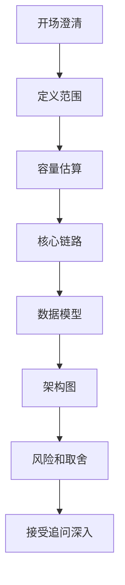
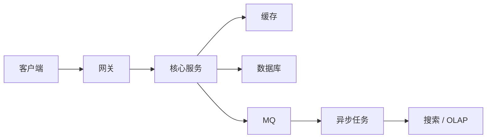

# 系统设计面试回答方法论

> 资深系统设计答案不是“画一个复杂架构”，而是持续展示判断力：先明确目标，再识别瓶颈，最后讲取舍和演进。

## 一、现场回答节奏

建议节奏：



时间分配：

| 阶段 | 时间 | 目标 |
| --- | --- | --- |
| 澄清需求 | 2~3 分钟 | 避免答偏 |
| 容量估算 | 3~5 分钟 | 判断量级 |
| 高层架构 | 5~8 分钟 | 建立主链路 |
| 深挖关键点 | 15~25 分钟 | 展示技术深度 |
| 总结取舍 | 2~3 分钟 | 收束答案 |

## 二、开场怎么说

模板：

```text
我先确认一下范围。
这个系统主要面向哪些用户？核心功能是哪些？
读写量级大概是多少？是否有强一致要求？
如果没有特别约束，我先按一个典型互联网规模来估算，再给出可演进方案。
```

不要：

```text
我先画一个架构图。
```

原因：

- 没有需求和量级，架构图没有依据。
- 面试官更想看你的判断过程。

## 三、如何做容量估算

公式：

```text
平均 QPS = 日请求量 / 86400
峰值 QPS = 平均 QPS * 5~20
存储 = 单条大小 * 日增量 * 保留天数 * 副本和索引放大
带宽 = QPS * 响应大小
```

表达重点：

- 不追求绝对精确。
- 要说明估算目的。
- 要从估算推导架构。

例子：

```text
如果短链日跳转 10 亿，平均 QPS 约 1.1 万，峰值可能 10 万级。
这说明跳转链路必须缓存化，不能每次查 MySQL。
```

## 四、如何画架构

架构图应该围绕核心链路：



讲每个组件时要回答：

- 为什么需要它？
- 它解决什么瓶颈？
- 它带来什么问题？
- 如果它挂了怎么办？

例子：

```text
这里引入 MQ 是为了削峰和异步化，但 MQ 会带来重复消费和延迟，所以消费方必须幂等，用户侧要能查询最终状态。
```

## 五、如何体现资深取舍

### 1. 不把所有东西强一致

强一致：

- 支付扣款。
- 库存扣减。
- 订单状态核心流转。

最终一致：

- 积分发放。
- 通知。
- 搜索索引同步。
- 报表统计。

表达：

```text
核心交易链路走强一致，非核心链路走 MQ 最终一致。
这样能保证正确性，也能降低主链路延迟。
```

### 2. 不把所有查询都压到主库

主库：

- 核心写。
- 强一致读。

从库 / 缓存：

- 普通读。

ES / ClickHouse / Hive：

- 搜索、报表、离线分析。

### 3. 不一开始就上复杂方案

演进表达：

```text
第一阶段单库单表加缓存即可；
当读压力上来做读写分离和缓存治理；
当写入和容量成为瓶颈再分库分表；
当多维查询变多，拆到 ES 或 OLAP。
```

## 六、常见追问怎么答

### 追问：缓存不一致怎么办？

答：

```text
先看业务是否要求强一致。
强一致读走主库或绕过缓存；
普通读可以接受短暂不一致，用更新数据库后删除缓存，配合过期时间。
热点 key 可以加互斥重建和逻辑过期。
```

### 追问：MQ 消息重复怎么办？

答：

```text
默认 MQ 至少一次投递，所以消费者必须幂等。
可以用业务唯一键、消费记录表、状态机前置条件来避免重复处理。
```

### 追问：数据库扛不住怎么办？

答：

```text
先判断是读瓶颈还是写瓶颈。
读瓶颈优先缓存、读写分离、预计算；
写瓶颈考虑削峰、批量、异步化、分库分表。
如果是复杂查询，应该拆到搜索或 OLAP。
```

### 追问：热点怎么办？

答：

```text
热点要先识别是热点 key、热点行、热点房间还是热点用户。
热点 key 可以本地缓存、多级缓存、拆 key；
热点行可以分桶、队列串行化；
热点房间要分片扇出；
大 V 要推拉结合。
```

### 追问：系统挂了怎么恢复？

答：

```text
核心是降级、重试、补偿和对账。
入口限流保护系统，非核心功能降级；
异步任务失败进入重试和死信；
关键业务有对账任务修复不一致；
同时监控、告警和演练要覆盖。
```

## 七、常见扣分点

- 不澄清需求，直接堆组件。
- 不做容量估算。
- 所有问题都回答“加 Redis”。
- 所有异步都不讲幂等。
- 所有一致性都说“分布式事务”。
- 没有失败场景。
- 不讲监控、限流、降级。
- 不讲演进，只给最终复杂架构。

## 八、资深表达模板

```text
我会先把核心链路和非核心链路分开。
核心链路保证正确性和低延迟，非核心链路通过 MQ 异步化。
读压力优先用缓存和读写分离，复杂查询拆到搜索或 OLAP。
写压力先削峰，再考虑分库分表。
一致性上，交易核心强一致，统计、通知、搜索走最终一致。
最后通过限流、降级、监控、压测、对账和补偿保证线上稳定。
```

## 九、不会答时怎么办

如果被问到不熟的细节，不要硬编。

可以这样说：

```text
这个实现细节我没有在线上深入做过，但我会从约束反推。
它的核心问题应该是峰值流量和一致性，所以我会优先保证核心链路正确性和过载保护；
如果要落地，我会重点验证 P99、错误率、库存超卖率，并准备限流、降级和补偿方案。
```

这比编一个错误细节更稳。
