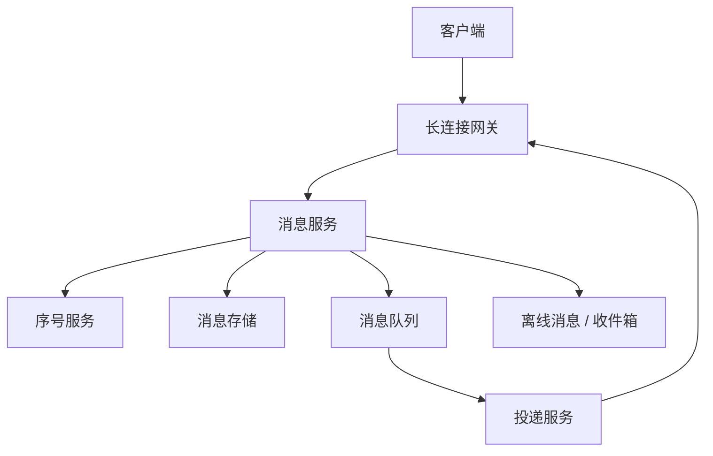
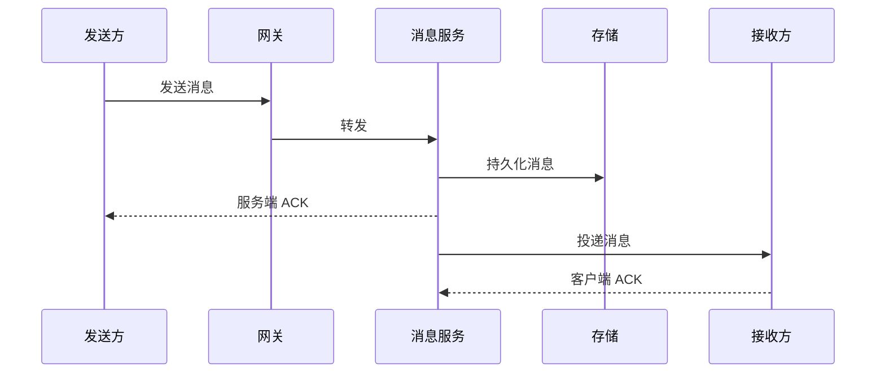

# IM 即时通讯系统

> IM 系统核心是长连接、消息可靠投递、离线消息、多端同步、群聊扩散和消息状态。

## 一、需求澄清

核心功能：

- 单聊消息。
- 群聊消息。
- 在线消息实时到达。
- 离线消息登录后拉取。
- 多端同步。
- 消息已读未读。

关键约束：

- 普通聊天消息要求高可靠。
- 系统通知、红包、交易消息可靠性更高。
- 允许最终一致，但不能随意丢消息。

## 二、容量估算

假设：

```text
DAU：1000 万
同时在线：200 万
人均消息：50 条 / 天
日消息：5 亿
平均写 QPS：约 5800
峰值写 QPS：5 万+
```

结论：

- 长连接数量大。
- 写入量高。
- 群聊有消息扩散问题。

## 三、核心架构



核心链路：

```text
发送消息 -> 网关 -> 消息服务 -> 分配会话序号 -> 持久化 -> 投递在线端 -> 写离线收件箱
```

## 四、消息模型

核心字段：

```text
msg_id
conversation_id
sender_id
receiver_id / group_id
seq
content
msg_type
send_time
status
```

`seq` 很关键：

- 保证会话内消息有序。
- 客户端可按 seq 拉取增量。
- 断线重连后从 last_seq 继续拉。

## 五、可靠投递



ACK 分两类：

- 服务端 ACK：消息已被服务端接收并持久化。
- 客户端 ACK：接收方已收到。

客户端未 ACK：

- 可重试投递。
- 下次登录拉离线消息。

## 六、在线和离线

在线用户：

- 通过长连接网关直接投递。
- 连接路由保存 `user_id -> gateway_node`。

离线用户：

- 写入离线收件箱。
- 用户上线后按 seq 拉取。

多端同步：

- 一个用户多个设备。
- 消息写入用户维度收件箱。
- 每个设备维护自己的 last_ack_seq。

## 七、群聊设计

小群：

- 写扩散到成员收件箱。

大群：

- 不适合给所有成员写一份。
- 可按群维度保存消息。
- 在线成员实时推送。
- 离线成员上线后按群 seq 拉取。

取舍：

| 模式 | 优点 | 缺点 |
| --- | --- | --- |
| 写扩散 | 读快 | 大群写放大 |
| 读扩散 | 写轻 | 读时聚合复杂 |

## 八、常见坑

- 消息未持久化就 ACK 客户端。
- 没有会话 seq，断线补偿困难。
- 群聊全部写扩散，大群写爆。
- 多端同步只按用户维度，忽略设备 ACK。
- 重试没有幂等，导致重复消息。

## 九、面试表达

```text
IM 系统核心是长连接和消息可靠投递。
客户端通过长连接网关接入，消息服务收到消息后先分配会话 seq 并持久化，再返回服务端 ACK。
在线用户通过网关实时投递，离线用户写入收件箱，上线后按 last_seq 拉取。
单聊可以写收件箱，群聊要区分小群和大群，小群写扩散，大群按群消息流读扩散。
可靠性上要有服务端 ACK、客户端 ACK、重试、幂等和多端同步。
```
