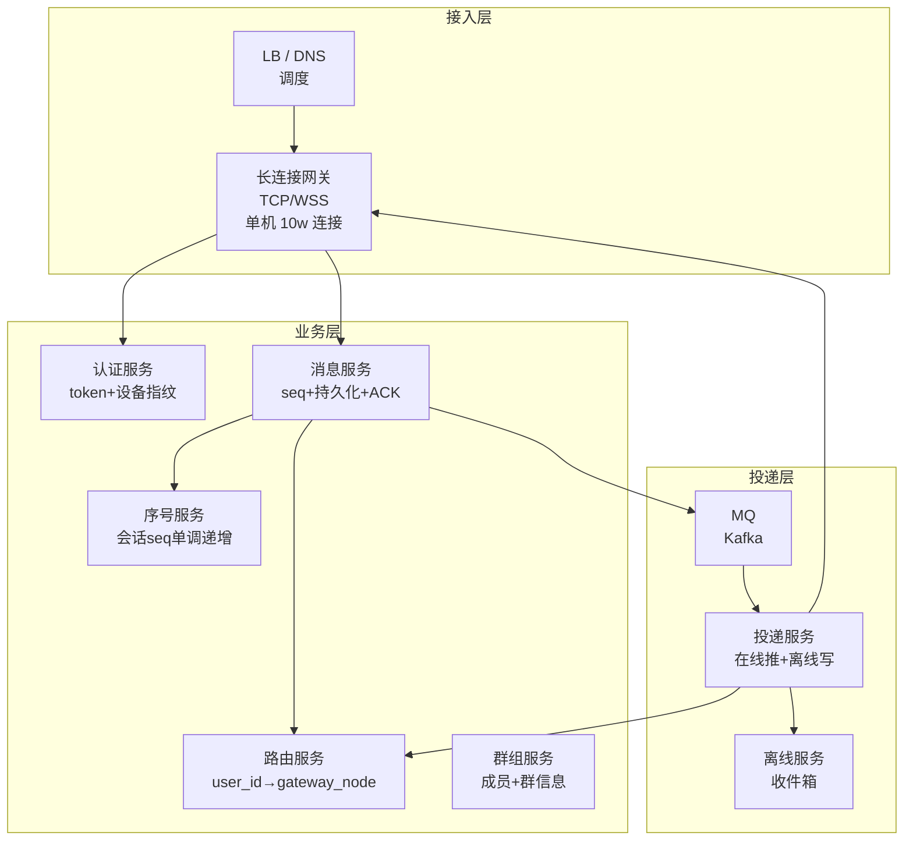
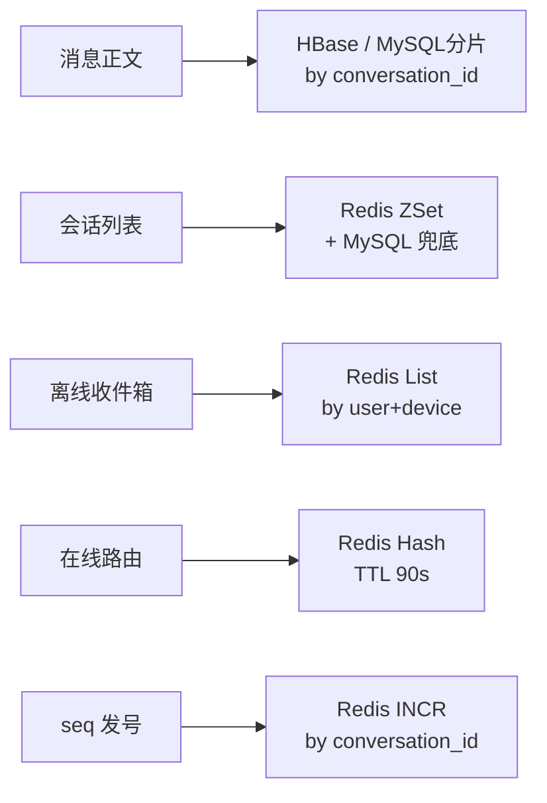
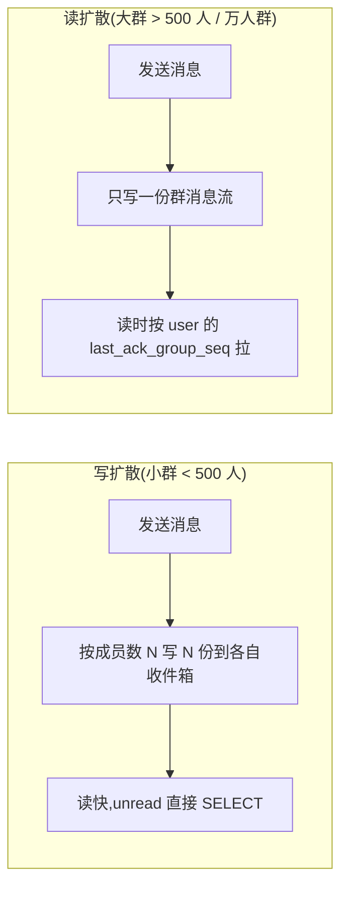

# IM 即时通讯系统(4S 版)

> 用 [01b-4s-method.md](01b-4s-method.md) 的 **4S 分析法**(Scenario / Service / Storage / Scale)重新推一遍 IM 即时通讯系统。
>
> **目标**:展示 4S 方法论在"可靠投递 + 多端同步"这类**长连接 + 强可靠**系统上的产出,与按主题平铺的 [08-im-system.md](08-im-system.md) 形成对比,**两份共存**——旧版理解业务,新版掌握答题节奏。

---

## 一、为什么单独写一份

| 文档 | 适用 | 风格 |
| --- | --- | --- |
| [08-im-system.md](08-im-system.md) | **理解 IM 业务** | 9 节主题平铺(需求/容量/架构/消息模型/可靠投递/在线离线/群聊/坑/表达) |
| **本文(4S 版)** | **面试白板复述** | 4 段递进,每段 10 分钟,严格按 4S 节奏 |

> **资深建议**:**两份都看**——业务理解看旧版,面试现场用 4S 节奏复述。
>
> 和 [07b-barrage-system-4s.md](07b-barrage-system-4s.md)(弹幕)的关键差异:**弹幕允许丢、写扩散无所谓**;IM 必须可靠投递 + seq 严格有序 + 离线补偿——本质是不同 SLA 的两套系统,**用同一套 4S 流程产出截然不同的设计**。

---

## 二、Scenario(场景分析,5 分钟)

**核心目标**:先问清楚做什么、规模多大、什么是非功能要求。IM 的关键是**"不能丢消息"** 这个隐性强约束。

### 2.1 功能分级

| 等级 | 功能 |
| --- | --- |
| **Must** | 单聊 / 群聊 / 在线实时投递 / 离线消息拉取 / 多端同步 / 消息有序 |
| **Nice** | 已读回执 / 撤回 / 表情包 / 消息漫游(换设备拉历史) |
| **Out** | 音视频通话 / 朋友圈 / 直播(独立系统) |

**反模式**:面试官说"设计 IM",你直接画长连接 + Redis。**先问是企业 IM(高可靠 + 漫游)还是社交 IM(轻量 + 隐私)**——量级和侧重点不同,架构差很多。

### 2.2 容量估算

```text
DAU:               1000 万
同时在线:          200 万(20% 在线率)
人均消息:          50 条 / 天
日消息:            5 亿
平均写 QPS:        5 亿 / 86400 ≈ 5800
峰值写 QPS:        平均 × 8 ≈ 5 万(早晚高峰)
推送扇出 QPS:      5 万 × 平均收件人 3 ≈ 15 万

长连接:            200 万持久连接
                   单机 10w 连接 → 至少 20 台接入机
存储:
  单条消息 ≈ 500 字节(含元数据)
  日新增 5 亿 × 500B = 250 GB/天
  保留 1 年 ≈ 90 TB(冷热分层)
```

### 2.3 非功能要求(资深扣分点)

| 维度 | 要求 | IM 特殊性 |
| --- | --- | --- |
| **可靠性** | **不丢消息**(P0)| 服务端持久化后才 ACK,客户端 ACK 后才删离线 |
| **顺序性** | **会话内严格有序** | **seq_id 单调递增**,不是 send_time(时钟漂移)|
| **延迟** | 在线消息端到端 < 500ms | 长连接直推,不走 HTTP |
| **可用性** | 99.95%(社交)/ 99.99%(企业)| 接入层多 AZ,降级走 HTTP 长轮询 |
| **多端同步** | 一人多设备(手机 + PC + Web)| 每设备维护 last_ack_seq |
| **数据保留** | 1 年(社交)/ 永久(企业)| 冷热分层,1 月前归档 |

### 2.4 读写比定调

> "IM 的本质是**写不极端 + 读高扇出 + 强可靠**。日均写 QPS 不到 1 万(对比秒杀 50 万、弹幕 100 万都不算高),但**每条消息要确保送达 N 个收件人 + N 个设备 + 离线后可补拉**,所以**真正的难点不是 QPS,是可靠性和有序性**——我会把重点放在 seq_id 设计、ACK 协议、离线补偿上。"

**这句话定下了整个系统的设计原则**——后面 Service / Storage / Scale 都围绕"可靠 + 有序 + 多端"展开,而不是"扛 QPS"。

---

## 三、Service(服务拆分,10 分钟)

**核心目标**:按 SRP 拆服务,画三层架构,**写出核心 API**。IM 的特殊性在于**长连接接入层**和**路由层**(在线状态)是其他系统没有的。

### 3.1 三层架构



### 3.2 服务职责

| 服务 | 职责 | 不做 |
| --- | --- | --- |
| **长连接网关** | TCP/WSS 维持长连接 + 心跳 + 上下行帧路由 | 不处理业务逻辑,无状态可水平扩 |
| **路由服务** | 维护 `user_id → gateway_node` 在线映射 | 不存消息,纯路由表(Redis) |
| **消息服务** | 申请 seq + 持久化 + 服务端 ACK + 投 MQ | 不直接推送(交给投递服务) |
| **序号服务** | 按 conversation_id 分配单调 seq | 不做幂等,只发号 |
| **投递服务** | 在线推(查路由表)+ 离线写收件箱 + 重试 | 不写主消息表 |
| **离线服务** | 用户收件箱 / 漫游消息拉取 | 不做实时推送 |

**关键决策**:
- **接入层和业务层分离**——网关只做帧转发,业务逻辑全在后面,接入层挂了不影响数据
- **同步链路最短**:发送方 → 网关 → 消息服务 → 持久化 + seq → 服务端 ACK 立即返回(< 200ms)
- **投递异步化**:消息服务投 MQ 后立即返回,投递服务**异步**推送 / 写离线;**MQ 是消息不丢的关键防线**
- **seq 服务独立**:防止"消息服务实例自己发号"导致并发下 seq 跳号,**全局 conversation_id 维度**单调

### 3.3 核心 API

```text
# 发送消息(上行)
POST /v1/msg/send
  Request:  { conversation_id, msg_type, content, client_msg_id, device_id }
  Response: { server_msg_id, seq, send_time, status: "OK"|"FAILED" }
  注: client_msg_id 是客户端幂等键,重发同一 ID 不会生成两条

# 拉取离线 / 漫游消息(下行)
GET /v1/msg/pull
  Request:  { conversation_id, last_seq, limit }
  Response: { messages: [...], next_seq, has_more }
  注: 客户端断线重连后用 last_ack_seq 增量拉

# 客户端 ACK(下行确认)
POST /v1/msg/ack
  Request:  { conversation_id, seq, device_id }
  Response: { status }
  注: 服务端根据 device_id 维护 last_ack_seq,清离线收件箱
```

**资深加分**:讲清楚**双 ACK 协议**(服务端 ACK = 已持久化;客户端 ACK = 已收到)、**client_msg_id 幂等**(防网络抖动重发)、**device_id 维度的 last_ack_seq**(多端独立同步)。

---

## 四、Storage(存储设计,10 分钟)

**核心目标**:核心对象**选对存储 + 设计 Schema + 讲清楚分片键**。IM 有 4 个核心对象:消息表 / 会话索引 / 离线收件箱 / 在线路由。

### 4.1 消息表(messages)——HBase 或 MySQL 分片

```sql
-- 方案 A: MySQL 分片(中小规模 < 100 亿条)
CREATE TABLE messages_${shard} (
  id BIGINT PRIMARY KEY,                       -- 雪花 ID
  conversation_id BIGINT NOT NULL,             -- 会话 ID(单聊 hash 双方,群聊 = group_id)
  seq BIGINT NOT NULL,                         -- 会话内单调 seq
  sender_id BIGINT NOT NULL,
  msg_type TINYINT NOT NULL,                   -- 1=文本 2=图片 3=语音 ...
  content TEXT NOT NULL,
  client_msg_id VARCHAR(64) NOT NULL,
  send_time DATETIME(3) NOT NULL,
  UNIQUE KEY uk_conv_seq (conversation_id, seq),     -- 会话内 seq 唯一
  UNIQUE KEY uk_client_msg (sender_id, client_msg_id), -- 幂等
  KEY idx_conv_time (conversation_id, send_time DESC)
) ENGINE=InnoDB;
-- 分片键: conversation_id
-- 归档: 30 天后冷数据归 OSS,在线只留热数据
```

**方案 B: HBase**(超大规模,千亿条以上):
- RowKey = `conversation_id + reverse(seq)`——同会话相邻、最新消息靠前
- 天然适合"按会话顺序拉取"的访问模式
- 无 Schema,扩展字段方便

**为什么按 conversation_id 分片**:
> "IM 99% 查询是'打开某个会话拉历史',按 conversation_id 分片**不跨库**。如果按 user_id 分片,群聊消息要在多个分片存多份(写扩散到分片层),代价更高。"

### 4.2 会话索引(conversation_index)——Redis ZSet

每个用户的"会话列表"(最近联系人),按最后消息时间排序:

```text
conv:user:{user_id} = ZSet { conversation_id → last_msg_time }
                       TOP 200 缓存,超出落 MySQL
conv:meta:{conversation_id} = Hash {
  last_msg_id, last_msg_preview, unread_count_{user_id}, ...
}
```

**为什么用 Redis**:
- 打开 App 第一屏就是会话列表,**P99 < 50ms**,MySQL 抗不住
- ZSet 天然支持"按时间排序 + 范围查询 + Top N"
- unread_count 是高频自增计数,Redis 原子操作

### 4.3 离线收件箱(offline_box)——Redis List + 持久化兜底

```text
offline:{user_id}:{device_id} = List [ {conv_id, seq, ts}, ... ]
                                 TTL 30 天 / 最多 1000 条
                                 客户端 ACK 后 LREM 删除

# 兜底: MySQL offline_messages 表(用户极少上线时,Redis 可能淘汰)
```

**为什么按 device_id 维度**:
> "用户 A 手机 + PC 同时在线时,消息要**两个设备都收到**。每个设备维护独立 last_ack_seq,手机 ACK 不影响 PC 收件箱。**这是多端同步的核心**——用户维度收件箱做不到独立 ACK。"

### 4.4 在线路由表(online_route)——Redis

```text
route:user:{user_id} = Hash {
  device_id_1: { gateway_node, conn_id, last_heartbeat },
  device_id_2: { gateway_node, conn_id, last_heartbeat },
}
TTL 90s(心跳续期,断连自动清)
```

**为什么用 Redis 而不是 ZK / etcd**:
- 写频率高(每次心跳续期),ZK / etcd 写性能扛不住
- 读 QPS = 推送扇出 QPS ≈ 15 万,Redis 单实例 10 万,集群分片
- 路由表**允许短暂不一致**——网关挂了路由表还在 90s 才过期,期间推送失败由 MQ 重试覆盖

### 4.5 seq 服务——Redis INCR + Lua

```text
seq:conv:{conversation_id} = INCR  → 单调递增,会话内严格有序
```

**为什么不用时间戳**:
> "时间戳有两个致命问题:**时钟漂移**(NTP 也有毫秒级偏差)和**同毫秒并发**(群聊 1ms 内多人发会冲突)。Redis INCR 单线程原子,**每个 conversation_id 一把锁**,seq 严格单调。这是 IM 资深面试的高频考点——不能答'用 send_time 排序'。"

### 4.6 存储选型一图



---

## 五、Scale(扩展设计,10 分钟)

按 4S 第六板斧逐条,**结合 IM 特殊问题**(长连接 / 群聊扩散 / seq 单调):

| 板斧 | IM 场景具体动作 |
| --- | --- |
| **缓存** | 会话列表 Redis;最近 N 条消息 Redis;在线路由 Redis |
| **分片** | 消息表按 conversation_id 分库;离线箱按 user_id;**接入层按 user_id 一致性 hash** |
| **异步** | 同步只到"持久化 + 服务端 ACK",**投递 / 推送 / 离线全异步走 MQ** |
| **限流** | 网关连接数限流(单机 10w);单用户发消息 QPS 限流(防刷);**大群按群限流** |
| **容灾** | 接入层多 AZ;消息 MQ 跨机房;**降级**:网关挂 → HTTP 长轮询;Redis 路由挂 → 全员走离线 |
| **监控** | 长连接数 / 心跳成功率 / 消息端到端延迟 / MQ 堆积 / 离线箱大小 |

### 5.1 长连接接入层——海量连接

单机 10w 连接技术要点:
- **epoll + 协程模型**(Go netpoll / Java Netty),不要一连接一线程
- **心跳间隔 30-60s**,平衡省电和断连检测
- **优雅停机**:网关重启时**先停止接受新连接**,通知存量连接迁移,**避免 200 万连接同时重连风暴**
- **TLS 终结在 LB**(SSL offload),业务层用明文,节省 CPU

### 5.2 群聊扩散——写扩散 vs 读扩散(核心考点)



| 维度 | 写扩散 | 读扩散 |
| --- | --- | --- |
| 写放大 | N 倍(N = 群成员数) | 1 |
| 读路径 | 直接读个人收件箱 | 按 last_seq 拉群消息 |
| 适用 | 小群 / 私聊 | 大群 / 万人群 / 频道 |
| 已读回执 | 简单 | 需额外 user→group_seq 映射 |

**资深表达**:
> "**私聊和小群用写扩散**——读快,扩散代价低;**万人群用读扩散**——写一份省存储,读时按 last_seq 拉,但要在群维度维护**用户最后已读 seq**。微信群上限 500 人就是这个边界;企业飞书万人群明确用读扩散。"

### 5.3 演进路线

```text
阶段 1(小团队 IM,DAU < 10 万):
  - 单机长连接 + MySQL 单库 + Redis 单实例
  - 写扩散统一方案

阶段 2(社交 IM,DAU 100 万 - 1000 万):
  - 长连接网关集群 + 路由表
  - 消息表按 conversation_id 分库
  - MQ 解耦投递
  - 大群切读扩散

阶段 3(超大规模,DAU 1 亿+,跨国):
  - 多 region 部署 + 就近接入
  - HBase 替代 MySQL
  - 跨 region 消息异步同步(最终一致)
  - 端侧加密(E2EE,服务端无解密能力)
```

---

## 六、新版(本文)vs 旧版 [08-im-system.md](08-im-system.md)

> 用户的核心诉求:**对比之前的 IM 文档,看出区别**。

### 6.1 结构对比表

| 维度 | **旧版** [08-im-system.md](08-im-system.md) | **新版**(本文 4S 风格) |
| --- | --- | --- |
| **组织方式** | 按"主题"切——需求/容量/架构/消息模型/可靠投递/在离线/群聊/坑/表达 **(9 节)** | 按"4S 顺序"切——Scenario / Service / Storage / Scale **(4 节)** |
| **顺序逻辑** | **平铺**——9 节内部相对独立,可乱读 | **递进**——前一步是后一步的输入,**严格不可乱** |
| **Scenario 处理** | 第一节"需求澄清" + 第二节"容量估算"——**分开两节,只列数字没定调** | **合并到 Scenario**——功能/容量/非功能/**写不极端但强可靠**一次讲清 |
| **Service 处理** | 第三节"核心架构"——**画了一张图就完了,没拆服务,没写 API** | **明确拆 6 个服务**(网关/路由/消息/seq/投递/离线)+ 写出 API 契约 |
| **Storage 处理** | 第四节只讲"消息模型字段",**没讲选型、没讲分片键、没区分多种存储** | **集中讲 5 个对象**(消息/会话索引/离线箱/在线路由/seq)+ 选型 + Schema + 分片键 |
| **Scale 处理** | 第五节(可靠投递)+ 第六节(在离线)+ 第七节(群聊)——**碎片化,没有统一框架** | **6 板斧统一框架** + **长连接接入** + **写扩散 vs 读扩散选型** + 演进路线 |
| **关键考点** | 提了 seq 但**没讲为什么不用时间戳**;提了写扩散读扩散但**没讲边界** | **明确**:seq 用 Redis INCR 防时钟漂移;500 人是写读扩散分界 |
| **资深信号** | 中:讲了 ACK + 写读扩散 | **更强**:讲了**为什么 conversation_id 分片**、**device_id 维度收件箱**、**优雅停机防重连风暴**、**演进路线** |

### 6.2 关键差异详解

#### a. Scenario 的差异——只列数字 vs 定调原则

旧版只说"DAU 1000 万,峰值写 5 万"就完了,**没说"这个量级到底难在哪"**。

新版**主动定调**:"IM 写不极端(5 万 QPS 比秒杀的 50 万小一个数量级),**真正的难点是可靠 + 有序 + 多端**——后面所有设计都围绕这个原则展开"。**这是资深和初级的分水岭——能不能从数字提炼出设计原则**。

#### b. Service 的差异——一张图 vs 六个服务 + API

旧版一张 mermaid 把所有组件混在一起,"消息服务" 框里实际混着 seq 分配 / 持久化 / 投递三件事,**SRP 完全没拆**。

新版明确**六个独立服务**——尤其把 **seq 服务独立** 和 **路由服务独立** 出来,这是 IM 系统的**架构骨架**;再配上 3 个核心 API(send / pull / ack)的**完整 Request/Response**,面试官一眼看到接口契约。

#### c. Storage 的差异——只画字段 vs 5 个对象选型

旧版只列了"msg_id / conversation_id / seq / ..." 这些字段名,**完全没讲存储选型**——消息存哪、收件箱存哪、路由存哪,读者全不知道。

新版**5 个对象逐一选型**:消息(HBase/MySQL 分片)/ 会话索引(Redis ZSet)/ 离线箱(Redis List + MySQL 兜底)/ 在线路由(Redis TTL)/ seq(Redis INCR),**每个都讲为什么选它**。**特别是 device_id 维度收件箱和 Redis INCR 防时钟漂移,这两个是 IM 资深考点,旧版完全没提**。

#### d. Scale 的差异——主题散讲 vs 6 板斧 + 长连接专题

旧版"可靠投递"、"在离线"、"群聊"分三节讲,**没有"扩展性"这个维度**——读者不知道"系统怎么演进"。

新版**6 板斧统一框架** + **长连接接入专题(单机 10w / 优雅停机防重连风暴)** + **写读扩散 500 人分界** + **三阶段演进路线**。**这才是面试官想看到的"系统在不同规模下怎么变形"**。

### 6.3 哪个更适合什么场景

| 场景 | 推荐 |
| --- | --- |
| **第一次学习 IM** | 旧版——按主题展开,易吸收消息模型和 ACK 流程 |
| **面试前刷题** | **新版**——按 4S 节奏走,**和面试官的答题模板对齐** |
| **作为系统设计模板** | **新版**——长连接系统的通用架构(IM / 直播弹幕 / 推送)都能套 |
| **写工程文档** | 旧版——主题式更接近真实文档结构 |

### 6.4 旧版可以怎么改进

如果要把旧版升级成 4S 风格,**最小改动**:

```text
原标题                              → 4S 改造
一、需求澄清 + 二、容量估算          → 一、Scenario(场景)+ 主动定调"写不极端但强可靠"
三、核心架构                         → 二、Service(服务)+ 拆出 6 个服务 + 写 API
四、消息模型                         → 三、Storage(存储)+ 补 5 个对象选型 + 分片键
五、可靠投递 + 六、在离线 + 七、群聊  → 四、Scale(扩展)+ 6 板斧 + 长连接专题 + 演进
八、坑 + 九、面试表达                → 五、答题模板(保留)
```

**核心动作**:把"主题平铺"重组成"4S 递进",**补足分片键、存储选型、演进路线这三个资深扣分点**。

---

## 七、面试现场表达模板

> 套用 [01b-4s-method.md](01b-4s-method.md) 的全套 4S 开场白,代入 IM 场景:

```text
"我用 4S 来组织这道 IM 系统的设计——

第一步 Scenario(5 分钟):
  我先确认是社交 IM(轻量)还是企业 IM(高可靠 + 漫游),
  估算 DAU 1000 万 / 同时在线 200 万 / 峰值写 5 万 QPS / 推送扇出 15 万。
  关键定调:写不极端,但**强可靠 + 严格有序 + 多端同步**是核心难点,
  不是 QPS 问题,是 SLA 问题。

第二步 Service(10 分钟):
  按 SRP 拆三层:
    接入层——长连接网关(单机 10w 连接,无状态)+ LB
    业务层——消息 / seq / 路由 / 群组 / 认证(5 个独立服务)
    投递层——MQ + 投递服务 + 离线服务
  核心 API:send(client_msg_id 幂等)/ pull(last_seq 增量)/ ack(device_id 维度)

第三步 Storage(10 分钟):
  消息正文——HBase 或 MySQL 按 conversation_id 分片,uk_conv_seq + uk_client_msg
  会话索引——Redis ZSet 按用户存最近 200 会话
  离线收件箱——Redis List **按 user_id + device_id 维度**,这是多端同步关键
  在线路由——Redis Hash,TTL 90s 心跳续期
  seq 发号——Redis INCR per conversation_id,**不用时间戳防时钟漂移**

第四步 Scale(10 分钟):
  缓存——会话列表 / 最近消息 / 路由 全 Redis
  分片——消息 by conv,接入层一致性 hash by user
  异步——同步只到"持久化 + 服务端 ACK",投递全异步走 MQ
  限流——连接数 / 用户发消息 QPS / 大群限流
  容灾——多 AZ + 优雅停机防 200 万连接重连风暴
  监控——长连接数 / 心跳成功率 / 端到端延迟 / MQ 堆积
  
  群聊扩散:**500 人是写读扩散分界**——
    小群写扩散(读快),万人群读扩散(省存储)

最后讲演进:小团队单机 → 社交 IM 分片 → 超大规模多 region。"
```

---

## 八、一句话总结

> **IM 系统按 4S 推**:**Scenario 先定调**(写不极端但强可靠 + 有序 + 多端)→ **Service 拆 6 个服务**(网关 / 路由 / 消息 / seq / 投递 / 离线,seq 独立是关键)→ **Storage 用 5 个对象**(消息 HBase / 会话 ZSet / 离线 List by device / 路由 Redis TTL / seq INCR 防时钟漂移)→ **Scale 走 6 板斧 + 长连接专题 + 写读扩散 500 人分界**;
>
> - 旧版 [08-im-system.md](08-im-system.md) 按主题平铺,理解消息模型和 ACK 用
> - 新版(本文)按 4S 递进,**面试现场用**——和面试官答题模板对齐
> - 与 [07b-barrage-system-4s.md](07b-barrage-system-4s.md) 对比:弹幕允许丢 + 写扩散无所谓,IM 必须可靠 + seq 严格——**同一套 4S 流程能产出截然不同的设计,这就是方法论的价值**
> - 两份共存,相互补充
