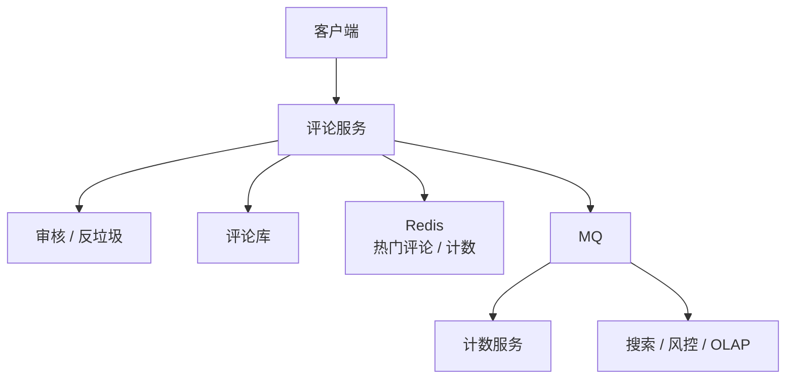
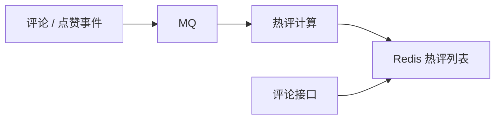

# 评论系统

> 评论系统核心是层级结构、分页、热评、审核、删除过滤、计数和反垃圾。

## 一、需求澄清

核心功能：

- 对内容发表评论。
- 回复评论。
- 查看评论列表。
- 热评排序。
- 点赞评论。
- 删除、审核、折叠。

常见形态：

- 一级评论 + 二级回复。
- 不建议无限层级，展示和查询都复杂。

## 二、容量估算

假设：

```text
DAU：1000 万
日评论：500 万
热门内容评论：100 万+
评论读取 QPS 远高于写入
```

结论：

- 读多写少。
- 热门内容评论列表是热点。
- 评论写入要审核和反垃圾。

## 三、核心架构



## 四、数据模型

```sql
create table comments (
    id bigint not null,
    target_id bigint not null,
    user_id bigint not null,
    parent_id bigint not null,
    root_id bigint not null,
    content varchar(2000) not null,
    status tinyint not null,
    like_count int not null,
    created_at datetime not null,
    primary key (id),
    key idx_target_created (target_id, created_at),
    key idx_root_created (root_id, created_at)
);
```

字段说明：

- `target_id`：文章、视频、商品等被评论对象。
- `parent_id`：直接回复的评论。
- `root_id`：一级评论 ID。
- `status`：正常、审核中、删除、折叠。

## 五、分页设计

不要用深分页：

```sql
limit 100000, 20
```

推荐游标分页：

```sql
where target_id = ?
  and created_at < ?
order by created_at desc
limit 20
```

热门评论可以单独缓存：

```text
comment:hot:{target_id}
```

## 六、热评设计

热评排序因素：

- 点赞数。
- 回复数。
- 时间衰减。
- 作者权重。
- 审核和风控。

热评可以异步计算：



不要每次请求都实时排序全量评论。

## 七、删除和审核

删除：

- 逻辑删除。
- 列表读时过滤。
- 子回复可显示“该评论已删除”。

审核：

- 敏感词快速判断。
- 风险内容进入审核中。
- 审核通过后展示。
- 命中高危规则直接拒绝。

## 八、计数一致性

评论数、回复数、点赞数可以最终一致：

- 写评论后发 MQ。
- 计数服务异步更新。
- 热点计数放 Redis。
- 定期和评论表对账。

核心展示可以允许短暂延迟。

## 九、常见坑

- 支持无限层级评论，查询和展示复杂。
- 评论列表深分页。
- 热评每次实时全量排序。
- 删除评论直接物理删除，影响审计和回复结构。
- 评论计数强一致更新主表，热点内容写冲突严重。
- 审核链路阻塞核心写入太久。

## 十、面试表达

```text
评论系统我会限制为一级评论加二级回复，通过 root_id 和 parent_id 表达层级。
评论列表按 target_id 和 created_at 做游标分页，热门评论单独异步计算并缓存。
评论写入先做基础审核和反垃圾，复杂审核异步处理。
删除采用逻辑删除，读时过滤，保留审计能力。
评论数、点赞数这类计数可以最终一致，通过 MQ 异步更新和定期对账。
```
