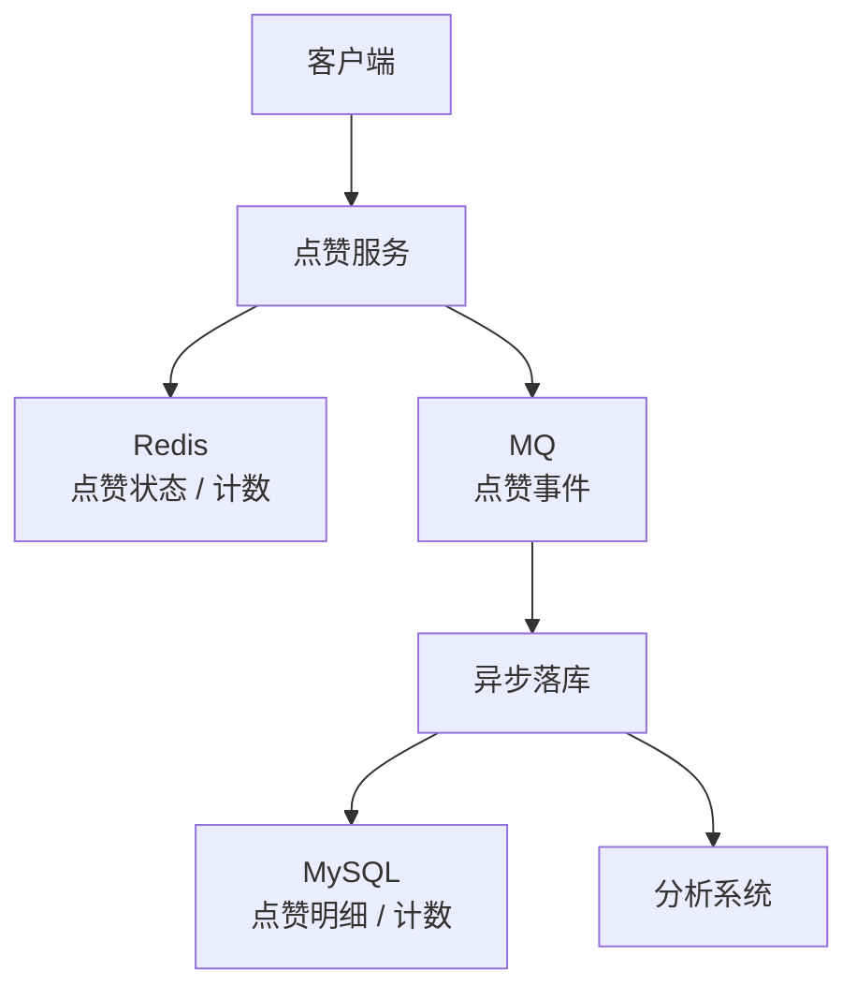
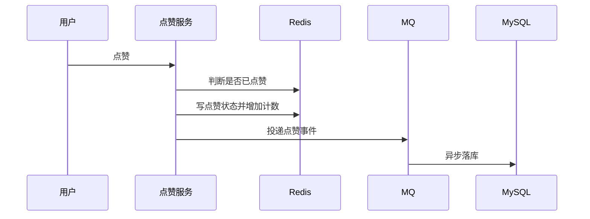

# 点赞与计数系统

> 点赞系统核心是高频写、去重、计数一致性、热点对象和异步落库。

## 一、需求澄清

核心功能：

- 用户点赞内容。
- 用户取消点赞。
- 查询是否已点赞。
- 展示点赞数。
- 支持热门内容高并发点赞。

关键约束：

- 同一用户对同一对象只能点赞一次。
- 点赞数允许短暂不一致。
- 用户点赞状态要尽量准确。

## 二、容量估算

假设：

```text
DAU：1000 万
人均点赞：20 次 / 天
日点赞事件：2 亿
热门内容峰值点赞 QPS：10 万+
```

结论：

- 高频写。
- 热点内容计数容易成为热点 key 或热点行。
- 去重比计数更关键。

## 三、核心架构



## 四、数据模型

点赞明细：

```sql
create table likes (
    id bigint not null,
    target_id bigint not null,
    user_id bigint not null,
    status tinyint not null,
    created_at datetime not null,
    updated_at datetime not null,
    primary key (id),
    unique key uk_target_user (target_id, user_id),
    key idx_user_created (user_id, created_at)
);
```

计数表：

```sql
create table like_counts (
    target_id bigint not null,
    like_count bigint not null,
    updated_at datetime not null,
    primary key (target_id)
);
```

## 五、点赞链路



Redis key：

```text
like:state:{target_id}:{user_id}
like:count:{target_id}
```

## 六、去重与幂等

幂等手段：

- Redis 先判断状态。
- MySQL 唯一索引 `target_id + user_id` 兜底。
- MQ 消费按事件 ID 或业务键去重。

取消点赞：

- 设置状态为取消。
- 计数减一。
- 重复取消不应继续减。

## 七、热点计数

热门内容点赞数可能形成热点 key。

优化：

- 本地聚合后批量写 Redis。
- Redis 计数分片。
- 异步合并计数。
- 展示允许短暂延迟。

分片计数：

```text
like:count:{target_id}:0
like:count:{target_id}:1
...
like:count:{target_id}:N
```

读取时求和或定期汇总。

## 八、常见坑

- 每次点赞直接更新 MySQL 计数行，热点行锁严重。
- 只加计数，不保存用户点赞明细，无法去重。
- 重复消费导致点赞数重复增加。
- 取消点赞没有状态判断，计数减成负数。
- 热点 key 没有保护。

## 九、面试表达

```text
点赞系统我会把用户点赞状态和点赞计数分开设计。
用户是否点赞需要准确，可以用 Redis 加 MySQL 唯一索引兜底；
点赞数可以最终一致，先在 Redis 计数，再通过 MQ 异步落库。
热门内容点赞数可能形成热点 key，可以做本地聚合、分片计数和异步汇总。
整个链路要保证点赞、取消点赞和 MQ 消费都是幂等的。
```
