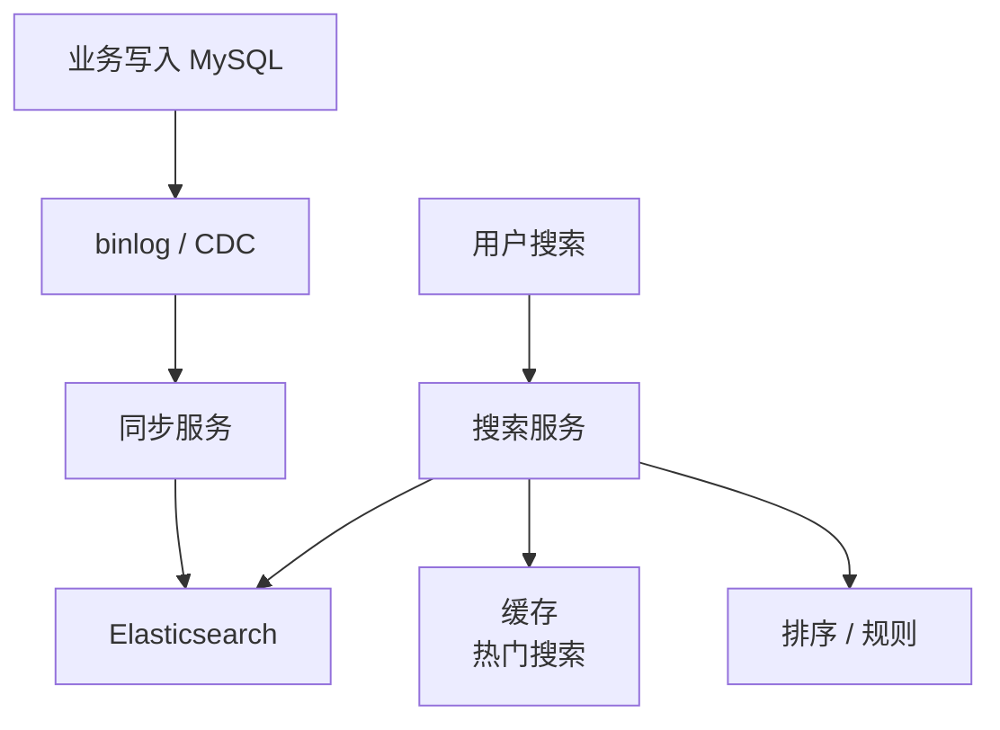
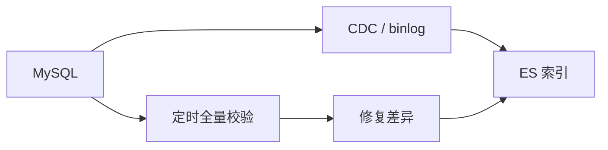

# 搜索系统

> 搜索系统核心是倒排索引、数据同步、召回排序、延迟一致和搜索链路降级。

## 一、需求澄清

常见场景：

- 商品搜索。
- 订单后台搜索。
- 内容搜索。
- 用户搜索。

核心能力：

- 关键词搜索。
- 多条件过滤。
- 排序。
- 分页。
- 高亮。
- 搜索建议。

## 二、为什么不用 MySQL 做搜索

MySQL 不适合：

- 全文检索。
- 多字段模糊查询。
- 复杂排序和过滤组合。
- 大规模运营后台搜索。

搜索通常使用 Elasticsearch / OpenSearch。

## 三、核心架构



核心链路：

```text
MySQL 保存交易事实
  -> binlog / MQ 同步到 ES
  -> 搜索服务查询 ES
  -> 返回搜索结果
```

## 四、索引设计

商品搜索文档：

```json
{
  "item_id": 1001,
  "title": "iPhone 15 Pro",
  "brand": "Apple",
  "category_id": 1,
  "price": 699900,
  "status": 1,
  "sales": 10000,
  "created_at": "2026-05-03"
}
```

字段类型要区分：

- 需要分词：标题、描述。
- 精确过滤：品牌、类目、状态。
- 排序：价格、销量、时间。

## 五、数据同步

同步方式：

- MQ 事件同步。
- binlog CDC。
- 定时全量校准。



一致性：

- 搜索通常允许秒级延迟。
- 详情页仍以 MySQL 为准。
- 下架商品要尽快从 ES 过滤。

## 六、排序和分页

排序因素：

- 文本相关性。
- 销量。
- 价格。
- 时间。
- 用户偏好。
- 业务规则。

深分页问题：

- ES 深分页也昂贵。
- 可用 `search_after` 或游标。
- 限制最大页数。

## 七、常见坑

- 把 ES 当主库，忽略 MySQL 事实源。
- 同步失败没有补偿和校验。
- 商品下架后搜索仍可见。
- 深分页开放过深。
- 排序规则全写死，业务无法调整。
- 搜索接口没有限流，复杂 query 打爆 ES。

## 八、面试表达

```text
搜索系统我会让 MySQL 做事实存储，ES 做检索索引。
业务写入 MySQL 后，通过 binlog CDC 或 MQ 同步到 ES，搜索服务查 ES。
ES 适合倒排索引、多条件过滤和排序，但不是交易主库。
搜索一致性通常允许秒级延迟，详情和交易状态仍以 MySQL 为准。
同步链路要有失败重试、全量校验和下架快速过滤。
```
