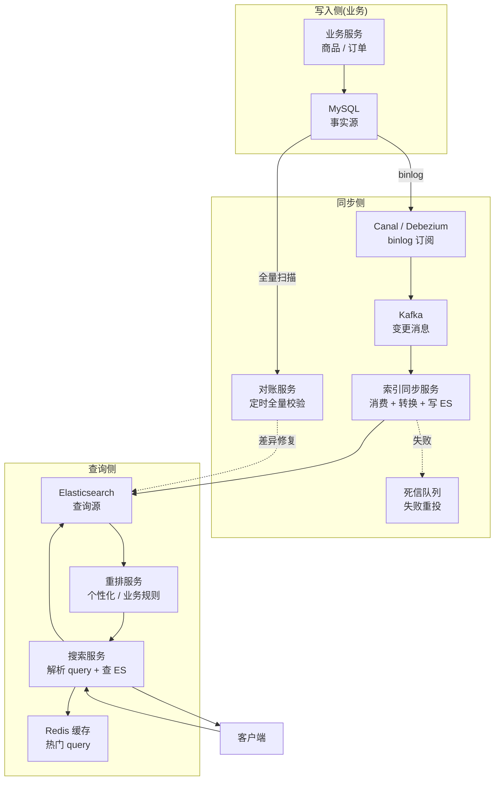
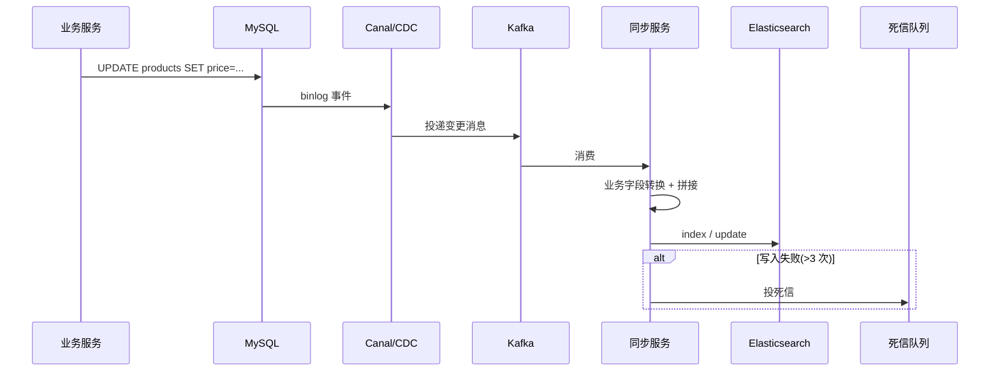
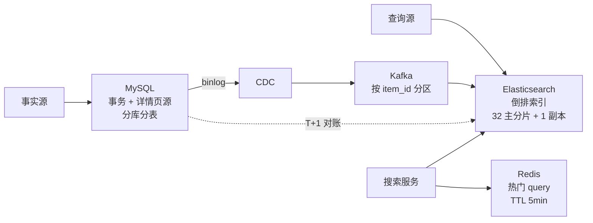
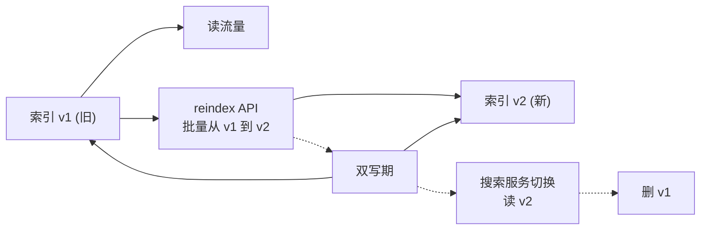

# 搜索系统(4S 版)

> 用 [01b-4s-method.md](01b-4s-method.md) 的 **4S 分析法**(Scenario / Service / Storage / Scale)重新推一遍搜索系统。
>
> **目标**:展示 4S 方法论在**异构存储 + 数据同步 + 延迟一致**类系统上的产出,与按主题平铺的 [11-search-system.md](11-search-system.md) 形成对比,**两份共存**——旧版懂业务,新版练答题节奏。
>
> **搜索 vs 秒杀 / 支付 / Feed / 弹幕**(对照 [03b](03b-seckill-system-4s.md) / [13b](13b-payment-system-4s.md) / [06b](06b-feed-system-4s.md) / [04b](04b-realtime-barrage-4s.md)):
> - 秒杀=写极热点 + 允许少卖
> - 支付=QPS 不高 + 一分钱不能错
> - Feed=写扩散 + 推拉混合
> - 弹幕=长连接 + 房间扇出
> - **搜索=异构存储双写 + 倒排索引 + 秒级延迟一致**——4S 节奏一样,但搜索的核心矛盾是**"MySQL 是事实源 vs ES 是查询源"**

---

## 一、为什么单独写一份

| 文档 | 适用 | 风格 |
| --- | --- | --- |
| [11-search-system.md](11-search-system.md) | **理解搜索业务** | 8 节主题平铺(需求/为什么不用 MySQL/架构/索引/同步/排序/坑/收束) |
| **本文(4S 版)** | **面试白板复述** | 4 段递进,每段 5-10 分钟,严格按 4S 节奏 + **双存储一致性主线**贯穿 |

> **资深建议**:**两份都看**——业务理解看旧版(为什么用 ES / 数据同步方式 / 排序细节),面试现场用 4S 节奏,**强调"MySQL 主 + ES 从"主线**和秒杀、支付区分开。

---

## 二、Scenario(场景分析,5 分钟)

**核心目标**:先问清楚搜什么、规模多大、**对延迟的容忍度**——搜索是典型的"**MySQL 扛不住全文检索 + ES 不能当主库**"系统,设计哲学是**双存储分工**。

### 2.1 功能分级

| 等级 | 功能 |
| --- | --- |
| **Must** | 关键词搜索 / 多条件过滤 / 排序 / 分页 / 实时同步 / 下架快速隐藏 |
| **Nice** | 高亮 / 搜索建议 / 拼写纠错 / 个性化排序 / 同义词 |
| **Out** | 搜索广告竞价(独立子系统)/ 推荐召回(归推荐)/ 全网爬取 |

**反模式**:面试官说"设计搜索",你直接画"ES 集群" → **错**,**先问搜什么**——商品搜索、订单后台搜索、内容搜索的设计完全不同(商品要快、订单要全、内容要排序)。

### 2.2 容量估算(以电商商品搜索为例)

```text
商品总量:        1 亿
日新增 / 修改:    100 万(上下架 + 改价 + 改库存)
搜索 QPS:        日 1 亿次,平均 1200,峰值 1 万
索引文档大小:    500 字节(标题/类目/品牌/属性/价格/销量等)
索引存储:        1 亿 × 500 字节 + 倒排索引 ≈ 100 GB(单副本)
                 加副本 + 分片 = 300 GB+

同步链路:
  binlog → MQ → ES
  端到端延迟目标 < 5 秒(用户能接受"刚改的商品搜索几秒后才生效")

排序计算:
  文本相关性 + 销量 + 价格 + 个性化权重 → ES 自带 + 二次重排
```

**关键认知**:搜索的瓶颈不在写入(100 万/天 ≈ 12 QPS),在**ES 索引维护成本 + 同步链路一致性 + 复杂查询的并发**。

### 2.3 非功能要求(资深扣分点)

| 维度 | 要求 | 与其他系统对比 |
| --- | --- | --- |
| **一致性** | **MySQL 强一致 + ES 秒级延迟一致** | 比支付宽松,**和 Feed 类似但更宽松**(Feed 也是最终一致) |
| **延迟** | 搜索 P99 < 200ms;同步端到端 < 5s | 比 Feed 严(Feed 200ms 是刷,搜索是查) |
| **可用性** | 搜索 99.9%(挂了走列表页降级)| 比支付低 |
| **数据保留** | 索引和事实源同周期(商品下架不删,改 status) | - |
| **下架及时性** | **关键 SLA**——下架商品 1 分钟内不能再被搜出来(合规) | 搜索特有 |

### 2.4 双存储定调(搜索的灵魂)

> "搜索的本质是**MySQL 不擅长全文检索**——MySQL 的 LIKE '%xxx%' 不走索引、多字段组合查询性能差、排序复杂场景难。但 ES 不能当事实源——异步复制有丢数据风险、不支持事务。所以**MySQL 是事实源,ES 是查询源**,用 binlog/CDC 同步,**搜索结果详情仍以 MySQL 为准**。下架走快速过滤(ES 主动改 status 而非等同步),保合规底线。"

**这句话定下了整个系统的设计原则**——后面 Service / Storage / Scale 都围绕"**双存储分工 + 同步可靠性 + 下架快速生效**"展开,**和秒杀、支付完全不同**(秒杀单存储 Redis+MySQL 双层,支付单 MySQL)。

### 2.5 与其他 4S 系统的根本差异

| 维度 | 秒杀 | 支付 | Feed | 弹幕 | **搜索** |
| --- | --- | --- | --- | --- | --- |
| 存储模型 | Redis + MySQL 双层 | 单 MySQL | MySQL + Redis 派生 | Redis 主 | **MySQL + ES 异构** |
| 一致性 | 强一致(Redis 主写)| 强一致 | 最终一致 | Best-Effort | **MySQL 强一致 + ES 秒级延迟** |
| 主存定位 | Redis 主,MySQL 兜底 | MySQL | MySQL | 无主存 | **MySQL 主,ES 索引派生** |
| 同步链路 | 异步落 MySQL | 无 | Fanout MQ | 无 | **CDC binlog + MQ 同步到 ES** |
| 设计重心 | 防热点 + 削峰 | 状态机 + 幂等 | 推拉混合 | 长连接管理 | **同步可靠 + 下架及时 + 排序灵活** |

---

## 三、Service(服务拆分,10 分钟)

**核心目标**:按 SRP 拆服务,**画三层架构**,**写出搜索 API + 同步链路**。搜索服务的拆分核心是**"业务写 vs 索引同步 vs 搜索查询三链路独立"**。

### 3.1 三层架构



### 3.2 服务职责

| 服务 | 职责 | 不做 |
| --- | --- | --- |
| **业务服务** | 写 MySQL(事实源)/ 商品上下架等业务操作 | 不直接写 ES |
| **CDC** | 订阅 MySQL binlog / 投递到 Kafka | 不做转换 |
| **索引同步服务** | 消费 Kafka / 字段转换 / 写 ES / 处理失败 | 不做业务判断 |
| **搜索服务** | 接收用户 query / 解析 / 查 ES / 调重排 / 返结果 | 不维护索引 |
| **重排服务** | 个性化排序 / 业务规则(置顶/降权)/ A/B 实验 | 不做基础召回 |
| **对账服务** | 定时全量扫 MySQL vs ES,输出差异修复 | 不做实时同步 |

**关键决策**:
- **同步异步**——业务写完 MySQL 立即返回,**不等 ES 写入**(否则业务路径强依赖 ES 可用性)。
- **CDC 而非业务双写**——业务写 MySQL 后投 MQ 写 ES 容易出现"MySQL 写成功 MQ 投失败"。**CDC 订阅 binlog**保证 100% 不丢,且业务无感。
- **对账兜底**——CDC 也可能丢消息(Kafka 回溯过期),**T+1 对账修复差异**。

### 3.3 核心 API

```text
# 搜索接口
GET /v1/search?q=iphone&category=phone&sort=sales&page=1
  Response: {
    items: [{ id, title, price, ... }],
    total: 1234,
    facets: { brand: [...], price_range: [...] }
  }

# 索引重建(运维接口)
POST /v1/admin/reindex
  Request: { from_id, to_id, batch_size }
  Response: { task_id }
```

**资深加分点**(必讲):

| 点 | 说明 |
| --- | --- |
| **游标分页** | 深分页用 `search_after`(基于上一页最后一条的 sort_value),**不用 from + size**(性能崩) |
| **限制最大页数** | 一般 100 页,深分页业务上没意义 + 性能极差 |
| **query 解析** | 先做意图识别(类目纠正 / 同义词扩展),不直接传 ES |
| **降级** | ES 挂 → 回退到 MySQL 简单 like 查询(慢但能用)+ 返回提示 |

### 3.4 索引设计(以商品为例)

```json
PUT /products
{
  "mappings": {
    "properties": {
      "item_id":     { "type": "keyword" },          // 主键
      "title":       { "type": "text", "analyzer": "ik_max_word" },  // 分词
      "title_pinyin":{ "type": "text" },             // 拼音搜索
      "brand":       { "type": "keyword" },          // 精确过滤
      "category_id": { "type": "keyword" },          // 精确过滤
      "price":       { "type": "long" },             // 单位:分,排序
      "sales":       { "type": "long" },             // 排序
      "status":      { "type": "byte" },             // 上下架,过滤
      "tags":        { "type": "keyword" },          // 多值
      "created_at":  { "type": "date" }
    }
  }
}
```

**字段类型决定能力**:

| 字段 | 类型 | 用途 |
| --- | --- | --- |
| `text` | 分词字段 | 全文检索(标题/描述) |
| `keyword` | 不分词 | 精确过滤 + 聚合(品牌/类目) |
| `long / double` | 数值 | 范围查询 + 排序(价格/销量) |
| `date` | 日期 | 时间范围 |

**资深点**:
> "ES 字段一旦定义就难改,**新增字段容易,改类型难**——必须 reindex。所以一开始就要想清楚每个字段的查询用法。"

---

## 四、Storage(存储设计,10 分钟)

**核心目标**:搜索的**双存储分工**——MySQL 是什么 / ES 是什么 / 同步链路 / 一致性策略。

### 4.1 MySQL(事实源)

```sql
CREATE TABLE products (
  id              BIGINT       NOT NULL,
  title           VARCHAR(255) NOT NULL,
  brand           VARCHAR(64)  NOT NULL,
  category_id     INT          NOT NULL,
  price           BIGINT       NOT NULL,           -- 单位:分
  sales           INT          NOT NULL DEFAULT 0,
  status          TINYINT      NOT NULL,            -- 1=上架 2=下架 3=审核中
  attrs           JSON         DEFAULT NULL,        -- 灵活属性
  created_at      DATETIME     NOT NULL,
  updated_at      DATETIME     NOT NULL,

  PRIMARY KEY (id),
  KEY idx_status_updated (status, updated_at)
) ENGINE=InnoDB;
```

**MySQL 的角色**:
- 商品详情页源(用户点进去查 MySQL)
- 后台管理 / 价格库存等事务操作
- ES 数据源(CDC 订阅)

### 4.2 Elasticsearch(查询源)

**分片策略**:

```text
索引:        products-2026
主分片:      32(按 item_id hash)
副本分片:    1(可读可备份)
单分片大小:  3-5 GB(ES 推荐 < 50 GB)
节点:        Master 3 + Data 8 + Coordinating 4

集群规模:    100 GB × 2 副本 / 3 GB 每分片 ≈ 64 分片
            分布到 8 数据节点 → 每节点 8 分片
```

**关键决策**:

| 决策 | 取舍 |
| --- | --- |
| **按 item_id hash 分片** | 写入均匀,但聚合(facets)要扇出所有分片;符合搜索场景 |
| **不按 category_id 分片** | 类目热度不均(手机 vs 文具)→ 数据倾斜 |
| **单索引 vs 时间索引** | 商品用单索引(无时间属性);订单 / 日志用按月索引 |

### 4.3 同步链路



**同步关键点**:

| 维度 | 设计 |
| --- | --- |
| **顺序保证** | Kafka 按 item_id 分区 → **同一商品的变更严格有序**(防回退) |
| **幂等** | ES 用 item_id 作为 doc_id,**重复同步只覆盖** |
| **失败处理** | 重试 3 次 → 死信队列 → 人工介入 / 自动补偿 |
| **延迟监控** | 同步链路 P99 延迟告警(超 5 秒报警) |

### 4.4 对账(兜底)

```text
为什么需要对账:
  - CDC 可能丢(Canal 重启 / Kafka 回溯过期)
  - 同步服务可能 bug(转换错误)
  - ES 可能丢数据(重启 / 故障恢复)

对账方式:
  T+1 全量扫:
    SELECT * FROM products WHERE updated_at > T-1
    与 ES 中数据比对,差异写入 recon_diff 表
    自动修复:re-index 单个文档

抽样校验:
  实时随机抽 100 个 item,比对 MySQL vs ES
  P99 不一致超阈值告警
```

### 4.5 缓存层(可选)

```text
Key:    search:cache:{md5(query)}
Value:  搜索结果(前 N 页)
TTL:    1-5 分钟

适用:
  - 热门 query("iphone","618 大促")反复搜
  - 缓存命中率 30-50%

不适用:
  - 个性化搜索(每人不同)
  - 实时性要求高的(刚改价格)
```

### 4.6 存储选型一图



**为什么不双写**:
> "业务双写(写 MySQL + 写 ES)看似简单,实际**MySQL 成功 ES 失败**的处理极其复杂——业务回滚?重试?都不优雅。**CDC + binlog 是工业标准答案**,业务无感、不丢数据、有顺序保证、可重放。"

---

## 五、Scale(扩展设计,10 分钟)

按 4S 第六板斧逐条:

| 板斧 | 搜索场景具体动作 |
| --- | --- |
| **缓存** | 热门 query Redis 缓存;ES 查询结果聚合缓存;facets 缓存 |
| **分片** | ES 32 主分片 + 副本;MySQL 分库分表;搜索服务无状态水平扩展 |
| **异步** | 索引同步全异步;复杂排序(个性化)异步重排 |
| **限流降级** | query 复杂度限制(防慢 query 打爆 ES);**降级**:ES 挂 → 走 MySQL 简单查询 |
| **容灾** | ES 多副本 + 跨 AZ;Kafka 持久化;CDC 自动续点 |
| **监控** | 索引同步延迟 P99;ES 慢查询;搜索成功率;DLQ 堆积 |

### 5.1 下架快速生效 —— 搜索场景特有的合规底线

**问题**:商品下架(违规 / 用户删除)→ MySQL 改 `status=2` → CDC 同步到 ES 通常 5 秒内完成,但**5 秒内还能搜出来 = 合规风险**。

**双层保护**:

```text
1. 业务直写 ES (旁路同步):
   下架业务在写完 MySQL 后,主动调 ES 改 status
   即使 CDC 延迟,也能立即生效
   后续 CDC 同步时是 idempotent(改成同样的值)

2. 搜索时过滤:
   每次搜索 query 强制带 status=1 过滤
   即使 ES 状态延迟,业务侧也兜底过滤
```

**资深动作**:讲清楚"**关键合规字段(下架/封禁)必须双写,不能依赖单一同步链路**——同步可能延迟 5 秒,但合规要求不能等"。

### 5.2 数据倾斜 —— ES 分片热点

**问题**:单分片过大或单分片 QPS 过高 → 查询慢。

| 倾斜来源 | 应对 |
| --- | --- |
| 数据倾斜(分片大小不均) | 用 `routing` 控制,或换分片字段 |
| 查询倾斜(类目搜索集中"手机") | 类目预聚合(按热门类目预算 facets)+ 缓存 |
| 时间倾斜(新数据热) | 冷热分层:近 30 天热索引(SSD)+ 历史冷索引(HDD) |

### 5.3 索引重建 —— 不可避免的运维场景

**什么时候要重建**:
- 字段类型变更(text → keyword)
- 分词器升级
- 分片数调整(分片数定了不能改)
- 数据格式重构

**零停机重建**:



**步骤**:
1. 创建 v2 新索引(新 mapping)
2. **业务双写 v1 + v2**(增量数据)
3. **reindex API** 把 v1 历史数据迁移到 v2(批量,几小时)
4. 全量校验 v1 vs v2 一致
5. 搜索服务切读 v2
6. 观察 24h 后删 v1

### 5.4 演进路线

```text
阶段 1(MVP,百万级):
  - 单 MySQL + 单 ES(3 节点)
  - 业务双写(简单,可接受小规模丢失)
  - 简单排序

阶段 2(成长期,千万级):
  - MySQL 分库分表
  - ES 集群(16 分片 + 副本)
  - CDC + Kafka 同步
  - 对账兜底
  - 重排服务

阶段 3(大型,亿级):
  - ES 32+ 分片,Master/Data/Coordinating 节点分离
  - 冷热分层
  - 个性化重排 + A/B 实验
  - 多机房同步

阶段 4(超大型,跨境):
  - 多 region ES 集群
  - 数据本地化(GDPR)
  - AI 召回模型(向量检索 + ES 倒排融合)
```

---

## 六、新版(本文)vs 旧版 [11-search-system.md](11-search-system.md)

> 用户的核心诉求:**对比之前的搜索文档,看出区别**。

### 6.1 结构对比表(8 维度)

| 维度 | **旧版** [11-search-system.md](11-search-system.md) | **新版**(本文 4S 风格) |
| --- | --- | --- |
| **组织方式** | 按"主题"切——需求/为什么不用 MySQL/架构/索引/同步/排序/坑/收束 **(8 节)** | 按"4S 顺序"切——Scenario / Service / Storage / Scale **(4 节)** |
| **顺序逻辑** | **平铺**——为什么不用 MySQL 单独一节,索引和同步分两节 | **递进**——Scenario 定双存储主线,Service 决定 CDC 同步,Storage 选型 ES,Scale 演进 |
| **Scenario 处理** | 第一节"需求澄清"——**只列功能,没算容量,没定一致性 SLA,没和其他系统对比** | **完整四件事**——功能/容量/非功能/**双存储一致性主线**(对比秒杀/支付/Feed/弹幕) |
| **Service 处理** | 第三节"核心架构"——**一张图,没拆服务,没写搜索 API,没区分查询/同步/对账三链路** | **三层 + 6 个服务**(业务/CDC/同步/搜索/重排/对账)+ 完整 API + 同步时序图 |
| **Storage 处理** | 第四节"索引设计" + 第五节"数据同步"——**分散,没讲分片决策,没讲对账,没讲 ES 字段类型选型** | **集中**(MySQL/ES/同步/对账/缓存)+ Schema + **分片决策** + **字段类型决定能力** |
| **Scale 处理** | 第七节"常见坑"——**碎片化,没演进,没下架及时性** | **6 板斧 + 下架快速生效 + 数据倾斜 + 索引重建 + 演进路线 4 阶段** |
| **双存储主线** | 第二节"为什么不用 MySQL",**没有作为设计哲学贯穿** | **从 Scenario 定调到 Scale 演进,贯穿全文** |
| **资深信号** | 中——讲了 ES 同步 / 排序 / 深分页 | **强**——讲了**CDC vs 业务双写**、**ES 字段类型决定能力**、**下架双写合规**、**索引零停机重建**、**与其他系统横向对比** |

### 6.2 关键差异详解

#### a. Scenario 的差异——**搜索场景特有的"双存储定调"**

旧版的"需求澄清"和秒杀、支付、Feed 几乎一样——都是列功能。**这是错的**——搜索的 Scenario 必须**一开始就定调"MySQL 是事实源 + ES 是查询源 + 双存储分工"**,后面所有设计都围绕这个走。

新版**强制四件事**:功能 + 容量 + 非功能 + **双存储一致性主线**,并且**和秒杀/支付/Feed/弹幕做对比**——让面试官看到你**理解搜索的核心矛盾不是性能,是双存储一致性**,而不是套同一个模板。

#### b. Service 的差异——**CDC 同步是搜索特色**

旧版**一张架构图把所有东西画在一起**,没讲清**业务双写 vs CDC 的取舍**——为什么大型系统都用 CDC 而不是业务直接写 ES。

新版明确**三层 + 6 服务**,核心是**CDC + Kafka + 同步服务三段式**——讲清楚"业务写 MySQL 立即返回,CDC 异步把变更推送到 Kafka,同步服务消费后写 ES,**任意一步失败都有死信队列兜底**"。这是**搜索系统区别于其他业务的关键**,旧版没有。

另外:**对账服务独立**(T+1 全量校验)、**重排服务独立**(个性化 / A/B),这些都是资深考点,旧版没拆。

#### c. Storage 的差异——**ES 字段类型决定能力**

旧版讲了 mapping,但**没讲清**:
- **`text` vs `keyword` 的根本差异**(分词 vs 不分词,决定能否全文检索)
- **分片数为什么 32**(单分片 < 50 GB)
- **为什么按 item_id hash 分片**(均匀,不按 category 倾斜)
- **对账兜底**(CDC 也可能丢)
- **缓存层何时该加**(热门 query 命中 30-50%)

新版**集中讲完**——这些是**搜索岗位面试的死亡考点**,旧版漏了基本就被判初级。

#### d. Scale 的差异——**下架及时性 + 索引重建**

旧版**Scale 几乎没讲**——只在"常见坑"里提了一句"下架要快",没讲:
- **下架双写**(为什么必须旁路)
- **数据倾斜**(类目热度不均的应对)
- **索引重建零停机**(双写 + reindex + 切读)
- **演进路线 4 阶段**(MVP → 成长 → 大型 → 跨境)

新版**全部展开**——这才是搜索岗位的"扩展性"含义,旧版完全缺失。

### 6.3 哪个更适合什么场景

| 场景 | 推荐 |
| --- | --- |
| **第一次学搜索** | 旧版——为什么不用 MySQL 和数据同步图最直观 |
| **搜索岗位面试** | **新版**——4S 节奏 + 双存储主线,**和面试官答题模板对齐** |
| **写搜索系统设计文档** | **新版**——Schema 完整,Scale 完整 |
| **快速复习 ES 同步** | 旧版——第五节集中讲,记忆点清晰 |

---

## 七、面试现场表达模板

> 套用 [01b-4s-method.md](01b-4s-method.md) 的全套 4S 开场白,代入搜索场景。**注意:开场白第一句就要点出双存储**——搜索和秒杀、支付、Feed、弹幕都不同,是**异构存储分工**系统。

```text
"我用 4S 来组织这道搜索系统的设计——先说一句定调:
 搜索的核心矛盾是 MySQL 不擅长全文检索 + ES 不能当事实源,
 所以我所有设计都围绕'MySQL 主 + ES 索引派生 + CDC 同步 + 对账兜底'。

第一步 Scenario(5 分钟):
  商品 1 亿,日变更 100 万,搜索 QPS 峰值 1 万,索引 100 GB+。
  非功能:MySQL 强一致,ES 秒级延迟一致,搜索 P99 < 200ms,下架 1 分钟生效。
  这和秒杀'写热点'、支付'防丢钱'、Feed'写扩散'、弹幕'长连接'都不同——
  搜索是'异构存储 + 同步可靠 + 排序灵活'。

第二步 Service(10 分钟):
  三层 6 服务——
    写入侧:业务服务 + MySQL(事实源);
    同步侧:CDC(Canal/Debezium)+ Kafka + 同步服务 + 死信队列 + 对账服务;
    查询侧:搜索服务(query 解析)+ ES + 重排服务 + Redis 缓存。
  关键决策:CDC 而非业务双写(防 MySQL 成功 ES 失败)、对账兜底(T+1)、重排独立。
  核心 API: GET /search(search_after 游标分页 + facets);
  下架走双写(MySQL + ES 旁路同步)保合规。

第三步 Storage(10 分钟):
  MySQL——事实源,详情页和事务用,分库分表;
  ES——索引 32 主分片 + 1 副本,按 item_id hash,字段类型决定能力(text 分词 / keyword 过滤);
  同步链路——Kafka 按 item_id 分区保顺序,死信兜底,T+1 对账;
  缓存——热门 query Redis TTL 5 分钟,命中率 30-50%。
  设计哲学:CDC 是工业标准,业务无感、不丢数据、可重放。

第四步 Scale(10 分钟):
  缓存——热门 query + facets;
  分片——ES 32 分片,搜索服务无状态扩展;
  异步——同步全异步,复杂个性化重排异步;
  限流降级——query 复杂度限制,ES 挂走 MySQL like 兜底;
  容灾——ES 多副本跨 AZ,CDC 自动续点;
  监控——同步延迟 P99,慢查询,DLQ 堆积。
  搜索特色:下架双写(关键合规字段不能等同步)、数据倾斜(冷热分层)、
            索引零停机重建(双写 + reindex + 切读)。

最后讲演进:MVP 业务双写 → 千万级 CDC + 对账 → 亿级冷热分层 + A/B → 跨境多 region。"
```

---

## 八、一句话总结

> **搜索系统按 4S 推**:**Scenario 定调双存储**(MySQL 事实 + ES 查询)→ **Service 拆业务/CDC/同步/搜索/重排/对账**(三链路独立)→ **Storage 用 MySQL 主 + ES 派生**(CDC 工业标准 + 对账兜底)→ **Scale 走下架双写/数据倾斜/索引重建**(异构存储 6 板斧);
>
> - 旧版 [11-search-system.md](11-search-system.md) 按主题平铺,为什么用 ES 和数据同步讲得清楚,**但缺 Scale + 缺双存储主线**
> - 新版(本文)按 4S 递进,**双存储分工贯穿全文**——和搜索岗位面试模板对齐
> - **搜索 vs 秒杀/支付/Feed/弹幕**(对比 [03b](03b-seckill-system-4s.md) / [13b](13b-payment-system-4s.md) / [06b](06b-feed-system-4s.md) / [04b](04b-realtime-barrage-4s.md)):4S 框架一样,**但每一步取舍完全不同**——秒杀防热点,支付保一致,Feed 推拉混合,弹幕长连接,搜索**异构存储双写一致**
> - 两份共存,相互补充
