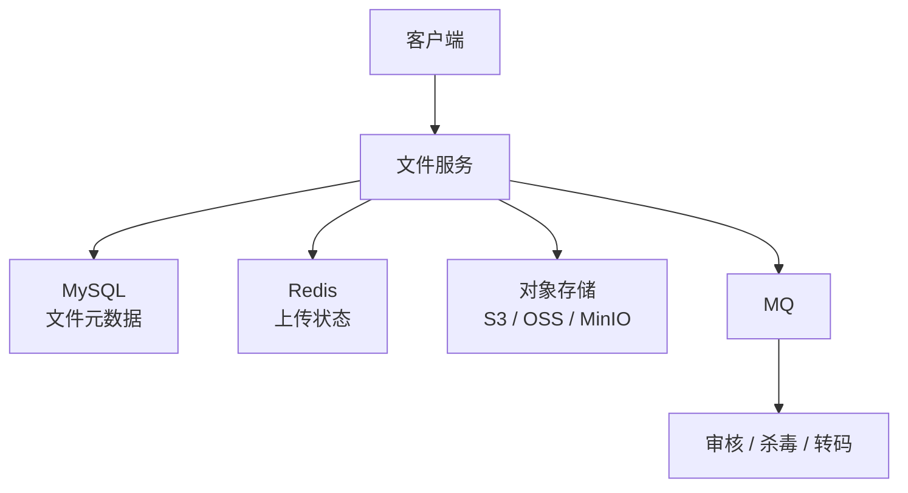
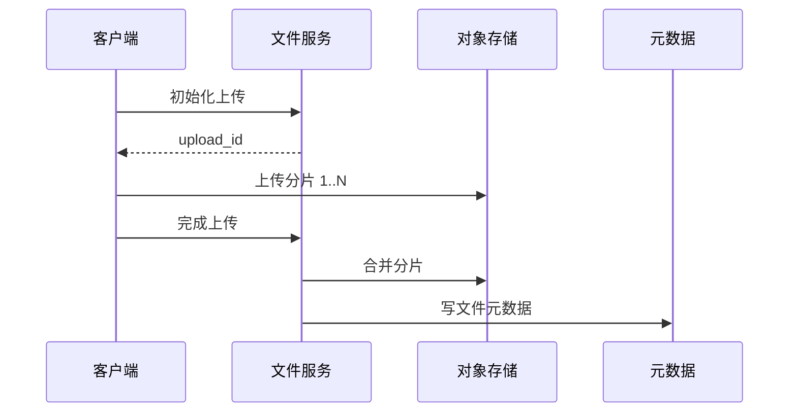

# 网盘 / 文件存储系统

> 文件存储系统核心是分片上传、秒传、断点续传、对象存储、元数据、权限和去重。

## 一、需求澄清

核心功能：

- 上传文件。
- 下载文件。
- 分片上传。
- 秒传。
- 断点续传。
- 文件夹和权限。
- 删除和回收站。

非目标：

- 不自己实现底层对象存储。
- 文件内容存对象存储，元数据存数据库。

## 二、容量估算

假设：

```text
DAU：1000 万
日上传文件：1000 万
平均文件：10 MB
日新增：100 TB
```

结论：

- 文件内容不能放 MySQL。
- 元数据和权限放 MySQL。
- 内容放对象存储。

## 三、核心架构



## 四、分片上传

流程：



分片信息：

```text
upload_id
file_hash
chunk_index
chunk_hash
chunk_size
status
```

## 五、秒传

客户端计算文件 hash：

```text
file_hash = sha256(file)
```

服务端查询是否已存在：

- 存在：直接创建用户文件引用。
- 不存在：正常上传。

注意：

- 秒传是内容去重。
- 用户文件和物理文件要分离。

## 六、数据模型

物理文件表：

```sql
physical_files(
    id,
    file_hash,
    size,
    storage_key,
    ref_count,
    created_at
)
```

用户文件表：

```sql
user_files(
    id,
    user_id,
    parent_id,
    file_name,
    physical_file_id,
    is_dir,
    status,
    created_at
)
```

## 七、权限和删除

权限：

- 私有。
- 分享链接。
- 团队协作。

删除：

- 逻辑删除进入回收站。
- 过期后减少物理文件引用计数。
- 引用计数为 0 后异步删除对象存储文件。

## 八、常见坑

- 文件内容直接存 MySQL。
- 没有分片上传，大文件失败只能重传。
- 秒传只看文件名，不看 hash。
- 删除用户文件时直接删除物理文件，影响其他引用。
- 上传完成后没有异步审核。
- 对象存储 key 可被猜测。

## 九、面试表达

```text
网盘系统我会把元数据和文件内容分开。
文件内容放对象存储，MySQL 只保存用户文件、物理文件、目录和权限元数据。
大文件用分片上传和断点续传，客户端计算 hash 支持秒传。
物理文件和用户文件引用分离，删除时先逻辑删除，引用计数为 0 后异步清理对象存储。
上传后还可以通过 MQ 做审核、杀毒和转码。
```
