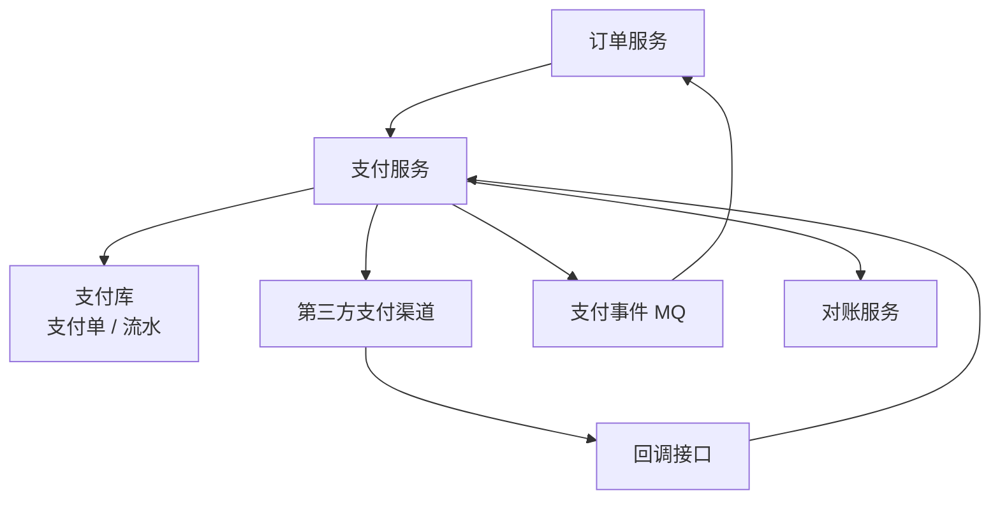
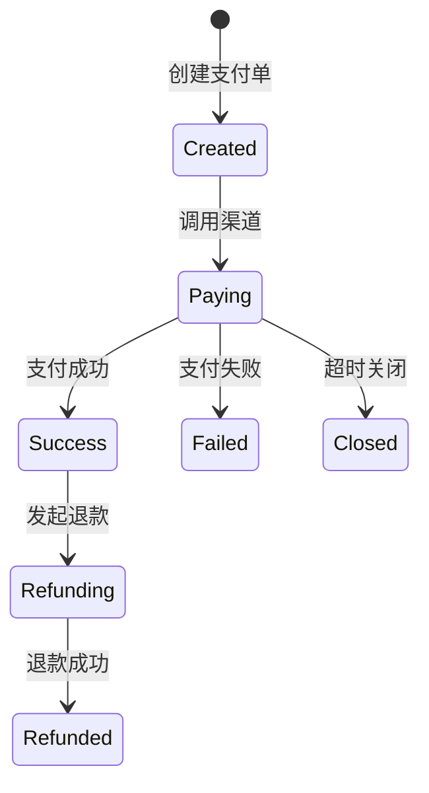
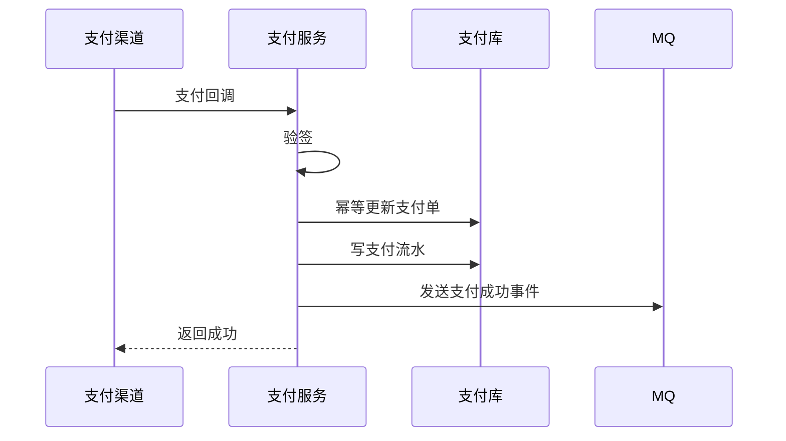

# 支付系统

> 支付系统核心是状态机、幂等、渠道回调、对账、补偿和资金安全。

## 一、需求澄清

核心功能：

- 创建支付单。
- 调用第三方渠道支付。
- 接收支付回调。
- 更新订单状态。
- 退款。
- 对账。

关键约束：

- 资金不能错。
- 回调可能重复、乱序、延迟。
- 支付状态必须可追溯。

## 二、核心架构



## 三、支付状态机



状态更新必须带前置状态：

```sql
update payment_order
set status = 'SUCCESS'
where pay_no = ?
  and status in ('CREATED', 'PAYING');
```

## 四、幂等设计

幂等键：

- 业务订单号。
- 支付单号。
- 第三方交易号。
- 回调通知 ID。

唯一索引：

```text
uk_pay_no
uk_third_trade_no
```

支付回调重复时：

- 第一次更新成功。
- 后续更新影响行数为 0，查询当前状态返回成功。

## 五、回调处理

回调流程：



注意：

- 先验签。
- 金额、订单号、商户号必须校验。
- 回调处理必须幂等。
- MQ 消费方也必须幂等。

## 六、对账和补偿

对账：

- 拉取渠道账单。
- 和本地支付流水比对。
- 找差异。
- 自动修复或人工处理。

差异：

- 渠道成功，本地未成功。
- 本地成功，渠道无记录。
- 金额不一致。
- 退款状态不一致。

## 七、常见坑

- 支付回调不验签。
- 回调不幂等，重复通知导致重复发货。
- 只更新订单，不保存支付流水。
- 没有对账，异常状态长期存在。
- 金额用浮点数。
- 支付成功事件丢失，没有补偿。

## 八、面试表达

```text
支付系统我会以支付单和支付流水为核心。
创建支付单后调用渠道，渠道回调时先验签，再校验金额和订单号，最后幂等更新支付状态。
支付状态用状态机控制，更新必须带前置状态。
支付成功后通过 MQ 通知订单服务，消费者也要幂等。
资金系统必须有对账，定期和渠道账单比对，发现差异后补偿或人工处理。
```
