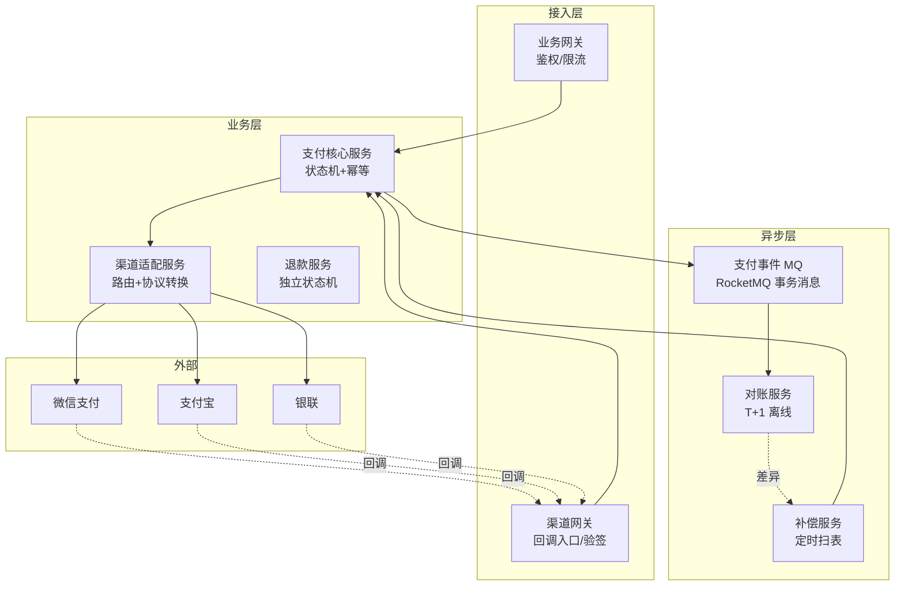
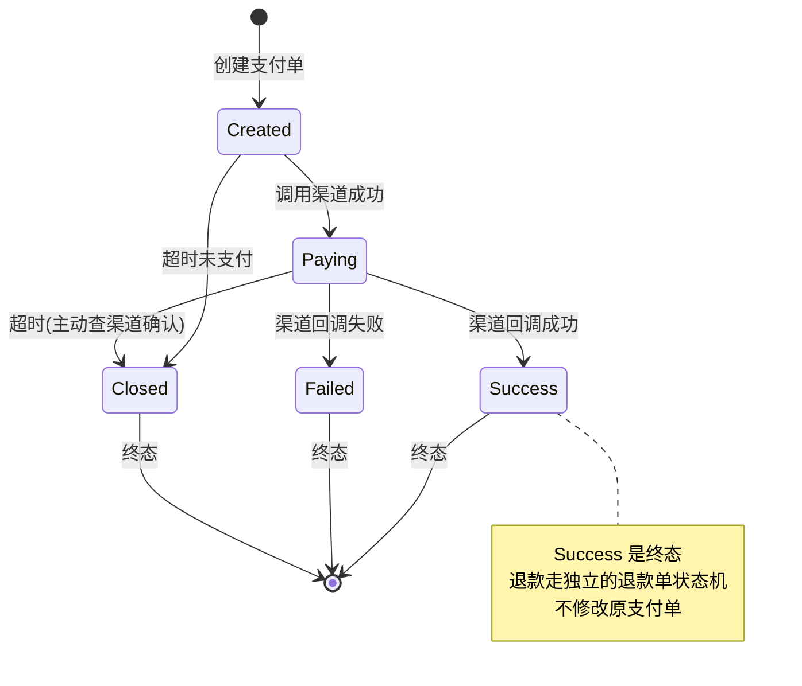
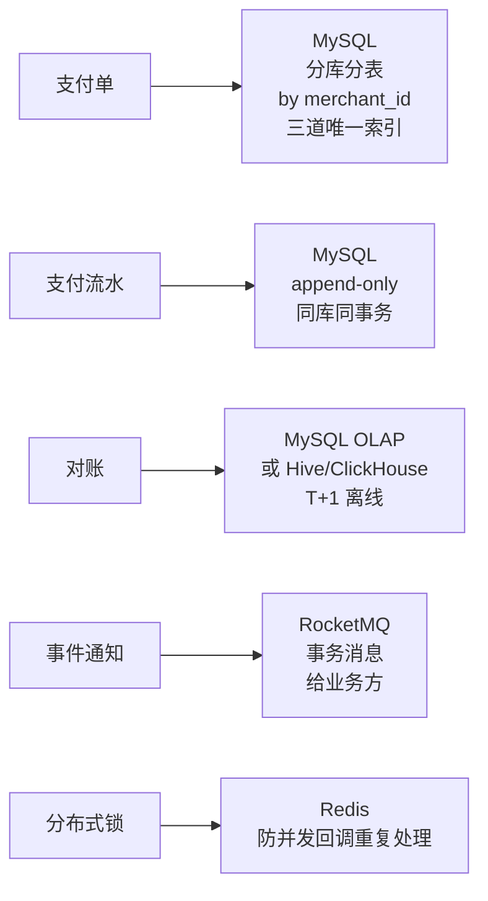
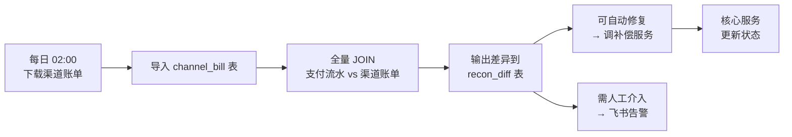

# 支付系统(4S 版)

> 用 [01b-4s-method.md](01b-4s-method.md) 的 **4S 分析法**(Scenario / Service / Storage / Scale)重新推一遍支付系统。
>
> **目标**:展示 4S 方法论在**强一致 + 资金安全**类系统上的产出,与按主题平铺的 [13-payment-system.md](13-payment-system.md) 形成对比,**两份共存**——旧版懂业务,新版练答题节奏。
>
> **支付 vs 秒杀**(对照 [03b-seckill-system-4s.md](03b-seckill-system-4s.md)):秒杀是"读多写热点 + 允许少卖",支付是"QPS 不高但**一分钱不能错**"——4S 节奏一样,但每一步的取舍完全相反。

---

## 一、为什么单独写一份

| 文档 | 适用 | 风格 |
| --- | --- | --- |
| [13-payment-system.md](13-payment-system.md) | **理解支付业务** | 8 节主题平铺(需求/架构/状态机/幂等/回调/对账/坑/收束) |
| **本文(4S 版)** | **面试白板复述** | 4 段递进,每段 5-10 分钟,严格按 4S 节奏 + **资金安全主线**贯穿 |

> **资深建议**:**两份都看**——业务理解看旧版(状态机 / 回调 / 对账细节最清楚),面试现场用 4S 节奏,**强调一致性主线**和秒杀区分开。

---

## 二、Scenario(场景分析,5 分钟)

**核心目标**:先问清楚做什么、规模多大、**一致性要求多狠**——支付是典型的"**QPS 不高但 SLA 极高**"系统,不能套秒杀的思路。

### 2.1 功能分级

| 等级 | 功能 |
| --- | --- |
| **Must** | 创建支付单 / 调用渠道 / 接收回调 / 状态机驱动 / 退款 / 对账 |
| **Nice** | 多渠道路由 / 分账 / 优惠券抵扣 / 风控前置 |
| **Out** | 钱包余额体系 / 信用支付 / 跨境结算(独立子系统) |

**反模式**:面试官说"设计支付系统",你直接画"网关 + Redis + MQ" → **错**,支付的核心不是抗 QPS,是**一致性 + 状态机 + 对账**。

### 2.2 容量估算

```text
日交易笔数:   1000 万(中型电商)
平均 QPS:    1000 万 / 86400 ≈ 120
峰值 QPS:    平均 × 10(大促) ≈ 1200,极端 1 万
回调 QPS:    与下单 1:1.2(渠道可能重投),峰值 ≈ 1.2 万

存储:
  支付单 = 500 字节 × 1000 万 = 5 GB/天
  支付流水 = 1 KB × 3000 万(下单+回调+状态变更)= 30 GB/天
  保留 7 年(财税合规)≈ 80 TB
```

**关键认知**:支付的 QPS **比秒杀低两个数量级**,瓶颈不在性能,在**一致性**。

### 2.3 非功能要求(资深扣分点 - 支付场景**最重**)

| 维度 | 要求 | 与秒杀对比 |
| --- | --- | --- |
| **一致性** | **强一致 + 不容忍丢钱**(对账误差 < 0.001%) | 秒杀允许少卖,支付**一分钱都不行** |
| **持久性** | 写入即不可丢失(WAL + 同步刷盘) | 秒杀允许 Redis 兜底 |
| **延迟** | P99 < 2s(用户能等),回调 P99 < 500ms | 秒杀要 < 1s |
| **可用性** | 99.99%(支付不可用 = 业务停摆) | 秒杀活动期 99.9% 即可 |
| **数据保留** | **7 年**(财税法规),不可删 | 秒杀 1 年 |
| **审计** | 全链路可追溯,每一笔变更可回放 | 秒杀不要求 |

### 2.4 一致性定调(支付的灵魂)

> "支付的本质是**钱的流转,一笔交易至多发生一次,且不可丢失**。我会让所有写入走**强一致**(MySQL + 同步刷盘),用**状态机 + 唯一索引**保证幂等,用**对账**做最终兜底。**宁可慢,不可错。**"

**这句话定下了整个系统的设计原则**——后面 Service / Storage / Scale 都围绕"**资金不丢 + 状态可追**"展开,**和秒杀的"快速拒绝 + 削峰"完全相反**。

### 2.5 读写比与秒杀的根本差异

| 维度 | 秒杀 | 支付 |
| --- | --- | --- |
| QPS 瓶颈 | **写极热点**(单 sku 50 万 QPS)| **不在性能**(峰值 1 万) |
| 一致性 | 允许少卖(降级) | **强一致,绝不丢钱** |
| 异步策略 | 用户体验快返,**同步预扣 + 异步落单** | 核心同步落库,**只有副作用异步**(MQ 通知/对账) |
| 失败处理 | 直接拒绝 | **必须补偿**(回调重试 / 对账修复 / TCC 回滚) |
| 设计重心 | 防热点 + 削峰 | **状态机 + 幂等 + 对账** |

---

## 三、Service(服务拆分,10 分钟)

**核心目标**:按 SRP 拆服务,**画三层架构**,**写出核心 API + 状态机**。支付服务的拆分核心是**"内部支付"和"渠道适配"分离**——业务逻辑稳定,渠道千变万化。

### 3.1 三层架构



### 3.2 服务职责

| 服务 | 职责 | 不做 |
| --- | --- | --- |
| **支付核心服务** | 状态机驱动 / 幂等控制 / 写支付单 + 流水 / 触发事件 | 不直接对接渠道 |
| **渠道适配服务** | 路由(选哪个渠道)/ 协议转换 / 签名 / 重试 / 熔断 | 不做业务状态机 |
| **回调网关(渠道网关)** | 验签 / 防重 / 转发到核心服务 | 不做业务判断 |
| **退款服务** | 独立状态机(退款单)/ 独立流水 / 资金回流确认 | **不复用支付单状态机** |
| **对账服务** | T+1 拉渠道账单 / 比对内部流水 / 输出差异报告 | 不直接修数据(交补偿) |
| **补偿服务** | 扫超时/异常单 / 主动查询渠道 / 调用核心服务修正状态 | 不绕过状态机 |

**关键决策**:
- **支付和渠道分离**——业务逻辑稳定(几年不变),渠道天天变(新增/下线/接口升级)。隔离能保证核心服务**不被渠道升级污染**。
- **退款独立状态机**——退款不是支付的反向流程,退款有自己的"申请→审核→退款中→已退款/失败"路径,**复用支付状态机会污染**。
- **对账 vs 补偿分离**——对账只发现问题(只读),补偿修复问题(写),**职责分开,可独立扩缩容**。

### 3.3 核心 API

```text
# 创建支付单(同步)
POST /v1/payments
  Request:  {
    out_trade_no,      # 业务方幂等键(强约束)
    merchant_id,
    user_id,
    amount,            # 单位:分,DECIMAL/BIGINT,绝不用 float
    channel_hint,      # 可选,渠道偏好
    notify_url,        # 业务方接收异步通知的地址
    expire_seconds     # 支付超时(默认 30min)
  }
  Response: {
    pay_no,            # 内部支付单号
    status: "CREATED",
    pay_url            # 跳转渠道的 URL / 二维码内容
  }

# 查询支付状态(供业务方主动查)
GET /v1/payments/{pay_no}
  Response: { pay_no, status, paid_at, channel_trade_no }

# 渠道回调(异步,从渠道网关进来)
POST /v1/callbacks/{channel}
  Request:  渠道原文 + 签名
  Response: 200 OK(必须明确告诉渠道收到了,否则会重投)

# 申请退款(独立状态机)
POST /v1/refunds
  Request:  { pay_no, refund_no, amount, reason }
  Response: { refund_no, status: "REFUNDING" }
```

**资深加分点**(必讲):

| 点 | 说明 |
| --- | --- |
| **`out_trade_no` 强约束** | 业务方传入,**全局唯一**,我方建唯一索引——业务重试拿到同一个 `pay_no`,不会重复扣款 |
| **金额单位** | **分(BIGINT)**,绝不用 float(浮点精度问题,1.1 + 2.2 ≠ 3.3) |
| **超时机制** | 支付单创建即设过期时间,过期自动 `Closed`,防止"用户半年后支付"的悬空单 |
| **回调返回值** | 必须按渠道协议返回(微信要 XML `<return_code>SUCCESS</return_code>`),返回错会被无限重投 |
| **状态机不可逆** | `SUCCESS` → 任何状态都不行,只能通过**退款单**反向流转 |

### 3.4 状态机(支付的核心骨架)



**状态更新铁律**(SQL 必带前置状态):

```sql
-- 错误写法(会被并发回调覆盖)
UPDATE payment_order SET status = 'SUCCESS' WHERE pay_no = ?;

-- 正确写法(乐观并发,只有从合法前置状态才能更新)
UPDATE payment_order
SET status = 'SUCCESS',
    paid_at = NOW(),
    channel_trade_no = ?
WHERE pay_no = ?
  AND status IN ('CREATED', 'PAYING');  -- 前置状态白名单

-- 影响行数 = 0:说明已经是终态了,不报错,直接返回当前状态(幂等)
```

---

## 四、Storage(存储设计,10 分钟)

**核心目标**:支付的**三个核心对象**——支付单 / 支付流水 / 对账表,**选型 + Schema + 分片键 + 资金安全保证**。

### 4.1 支付单(payment_order)——MySQL 分库分表

```sql
CREATE TABLE payment_order (
  id              BIGINT       NOT NULL,         -- 雪花 ID
  pay_no          VARCHAR(32)  NOT NULL,         -- 内部支付单号
  out_trade_no    VARCHAR(64)  NOT NULL,         -- 业务方幂等键
  merchant_id     BIGINT       NOT NULL,
  user_id         BIGINT       NOT NULL,
  amount          BIGINT       NOT NULL,         -- 单位:分,绝不用 float
  currency        VARCHAR(8)   NOT NULL DEFAULT 'CNY',
  channel         VARCHAR(16)  NOT NULL,         -- wxpay / alipay / unionpay
  channel_trade_no VARCHAR(64) DEFAULT NULL,     -- 渠道交易号(回调后填入)
  status          TINYINT      NOT NULL,         -- 1=Created 2=Paying 3=Success 4=Failed 5=Closed
  expire_at       DATETIME     NOT NULL,         -- 过期时间
  paid_at         DATETIME     DEFAULT NULL,
  notify_url      VARCHAR(255) NOT NULL,
  version         INT          NOT NULL DEFAULT 0,  -- 乐观锁兜底
  created_at      DATETIME     NOT NULL,
  updated_at      DATETIME     NOT NULL,

  PRIMARY KEY (id),
  UNIQUE KEY uk_pay_no (pay_no),                    -- 内部主键
  UNIQUE KEY uk_out_trade (merchant_id, out_trade_no), -- 业务方幂等(防重复创单)
  UNIQUE KEY uk_channel_trade (channel, channel_trade_no), -- 渠道幂等(防回调重复)
  KEY idx_user (user_id, created_at DESC),
  KEY idx_status_expire (status, expire_at)         -- 扫超时单
) ENGINE=InnoDB;

-- 分片键: merchant_id (To B 场景:商户维度查询多)
-- 或者: user_id (To C 场景:用户查"我的订单"多)
-- 时间归档: 90 天后归档到 OSS,7 年内可查
```

**三道唯一索引**——支付的资金安全靠这三道防线:

| 唯一索引 | 防的是 |
| --- | --- |
| `uk_pay_no` | 内部主键,代码 bug 也不会重复 |
| `uk_out_trade(merchant_id, out_trade_no)` | **业务方重试不会重复创单**——同一 `out_trade_no` 进来直接返回已有 `pay_no` |
| `uk_channel_trade(channel, channel_trade_no)` | **渠道回调重投不会重复处理**——同一渠道交易号只能写入一次 |

**为什么按 merchant_id 分片**:
> "支付场景 70% 查询是商户后台'我的交易'/'对账',按 merchant_id 分片**不跨库**。如果按 user_id,商户报表会扇出到所有分片。如果是 To C 钱包则相反。**分片键跟随查询模式**,这是支付选型的核心。"

**金额为什么用 BIGINT 不用 DECIMAL/float**:
> "DECIMAL 在 Go/MySQL 跨语言传输有精度风险(部分驱动转 float),float 直接精度不够。**统一用 BIGINT 存分**,加减乘除都是整数运算,**绝不丢精度**。展示时再除 100。"

### 4.2 支付流水(payment_journal)——append-only

```sql
CREATE TABLE payment_journal (
  id              BIGINT       NOT NULL,
  pay_no          VARCHAR(32)  NOT NULL,
  event_type      VARCHAR(32)  NOT NULL,  -- CREATE / PAY_REQ / PAY_CALLBACK / REFUND / ...
  before_status   TINYINT      DEFAULT NULL,
  after_status    TINYINT      DEFAULT NULL,
  amount          BIGINT       NOT NULL,
  channel_resp    TEXT         DEFAULT NULL,  -- 渠道原始报文(审计用)
  trace_id        VARCHAR(64)  NOT NULL,
  created_at      DATETIME     NOT NULL,

  PRIMARY KEY (id),
  KEY idx_pay_no (pay_no, created_at),
  KEY idx_trace (trace_id)
) ENGINE=InnoDB;

-- 分片键: pay_no(和支付单同库,本地事务一起写)
-- append-only:只插入,不更新不删除
-- 7 年保留(合规)
```

**流水的设计原则**:

| 原则 | 体现 |
| --- | --- |
| **append-only** | 只 INSERT,不 UPDATE/DELETE——任何状态变更都新增一条记录 |
| **同库同事务** | 与支付单同一个分库,**本地事务**一起写,保证"状态变了流水也写了" |
| **保留原始报文** | 渠道回调原文存 `channel_resp`——出问题可以**回放复盘** |
| **trace_id 串联** | 一次完整支付的所有流水都有同一个 trace_id,**方便审计追溯** |

**为什么不用消息中间件做流水**:
> "MQ 是异步的,有丢失风险。流水是审计核心,**和业务状态变更必须强一致**——只能用本地事务。MQ 只用来发**事件通知**(给业务方),通知丢了可以重发,但流水丢了就无法追溯。"

### 4.3 对账表(reconciliation)——离线 OLAP

```sql
-- 渠道账单导入表(每日 T+1 从渠道下载)
CREATE TABLE channel_bill (
  bill_date       DATE         NOT NULL,
  channel         VARCHAR(16)  NOT NULL,
  channel_trade_no VARCHAR(64) NOT NULL,
  amount          BIGINT       NOT NULL,
  status          VARCHAR(16)  NOT NULL,
  PRIMARY KEY (bill_date, channel, channel_trade_no)
) ENGINE=InnoDB;

-- 对账差异表(对账服务输出)
CREATE TABLE recon_diff (
  diff_id         BIGINT       NOT NULL AUTO_INCREMENT,
  bill_date       DATE         NOT NULL,
  pay_no          VARCHAR(32)  DEFAULT NULL,
  channel_trade_no VARCHAR(64) DEFAULT NULL,
  diff_type       VARCHAR(32)  NOT NULL,  -- CHANNEL_ONLY / LOCAL_ONLY / AMOUNT_MISMATCH
  internal_amount BIGINT       DEFAULT NULL,
  channel_amount  BIGINT       DEFAULT NULL,
  status          VARCHAR(16)  NOT NULL,  -- PENDING / FIXED / MANUAL
  created_at      DATETIME     NOT NULL,
  PRIMARY KEY (diff_id),
  KEY idx_status (status, bill_date)
) ENGINE=InnoDB;
```

**对账的四类差异**(资深必讲):

| 差异类型 | 含义 | 处理 |
| --- | --- | --- |
| **CHANNEL_ONLY**(渠道有,本地无)| 回调丢了 / 本地服务挂了 | **补建支付单 + 状态置 SUCCESS**(主动查渠道确认) |
| **LOCAL_ONLY**(本地有 SUCCESS,渠道无)| 极严重——可能误判成功 | **立刻冻结 + 人工介入** |
| **AMOUNT_MISMATCH** | 金额不一致 | **冻结 + 人工**——可能是渠道分润 / 优惠扣减 |
| **STATUS_MISMATCH** | 本地 SUCCESS,渠道退款了 | 触发**反向退款流程** |

### 4.4 存储选型一图



**为什么没有 Redis 做主存**(对比秒杀):
> "支付是**强一致**场景,Redis 异步复制有丢数据风险。Redis 在支付里只用来做**短时锁**(防并发回调)和**渠道路由缓存**,**不存核心数据**。这和秒杀完全不同——秒杀拿 Redis 当主写入,MySQL 兜底;支付反过来,MySQL 主写,Redis 只做辅助。"

---

## 五、Scale(扩展设计,10 分钟)

按 4S 第六板斧逐条:

| 板斧 | 支付场景具体动作 |
| --- | --- |
| **缓存** | 渠道路由规则缓存(Redis,5min);商户配置缓存;**核心数据不缓存**(强一致) |
| **分片** | 支付单按 merchant_id 分 32 库;流水同库同事务;对账离线表按 bill_date 分区 |
| **异步** | **核心同步落库**;支付成功**事件**走 MQ(事务消息);对账走 T+1 批处理 |
| **限流降级** | 渠道侧:每渠道独立限流 + 熔断;**降级**:某渠道挂了路由切到备用渠道 |
| **容灾** | MySQL 同城三 AZ + 异地灾备(金融级);渠道**多活**(微信挂了走支付宝) |
| **监控** | 实时大盘:成功率 / P99 / 各渠道状态;**告警分级**:对账差异 = P0,渠道异常 = P1 |

### 5.1 渠道隔离 —— 支付场景特有的扩展手段

支付**强依赖外部渠道**,渠道是**最不可控**的——挂了 / 限流 / 接口变更天天发生。

**渠道隔离三板斧**:

```text
1. 物理隔离:每渠道独立连接池 / 独立线程池
   - 微信挂了不影响支付宝(舱壁模式)

2. 熔断降级:每渠道独立熔断器(error rate > 50% 自动断)
   - 断后请求自动路由到备用渠道(若业务允许)
   - 若不允许(用户指定渠道),返回明确错误码,不无限重试拖垮系统

3. 限流隔离:每渠道独立令牌桶
   - 渠道一般有 QPS 上限(如微信 600 QPS)
   - 超了渠道直接拒,不如我方自己限流 + 排队
```

### 5.2 异步对账 —— 资金安全的最终防线

**对账是支付系统的"对账兜底",不是性能优化**:



**为什么必须对账**:
- **回调可能丢**——网络抖动 / 我方 502,渠道重投有限次数
- **状态可能错**——并发回调更新失败 / 数据库主从延迟
- **金额可能差**——渠道分润 / 优惠 / 手续费扣减
- **没有对账 = 自欺欺人**——你以为对的,可能错很久

### 5.3 防双花 —— 资金安全的关键约束

**双花**(同一笔钱被扣两次)是支付**最严重**的事故,防御手段:

| 层 | 手段 |
| --- | --- |
| **业务方** | `out_trade_no` 全局唯一(我方建唯一索引) |
| **支付单** | `uk_out_trade` 唯一索引,重复创单直接返回原单 |
| **回调处理** | `uk_channel_trade` 唯一索引,重复回调影响 0 行 |
| **状态机** | `WHERE status IN (前置状态)`,已是终态的更新自然失败 |
| **退款** | 退款独立状态机,**累计退款金额不能超原支付金额**(SQL 约束) |
| **对账** | T+1 兜底发现"双扣" → 自动反向 |

**资深动作**:讲清楚"**单点防御不够,需要 5 层兜底**——任何一层漏了,后面还有兜底"。

### 5.4 分布式事务选型(资深考点)

支付涉及**支付服务 + 订单服务**跨服务一致性,选型:

| 方案 | 适用 | 不适用 |
| --- | --- | --- |
| **本地事务 + MQ 事务消息** ⭐ | 支付主流方案——支付成功事件可靠投递,订单服务消费幂等更新 | 强同步要求场景 |
| **TCC** | 资金分账 / 多账户操作(Try 冻结额度 → Confirm 真扣 / Cancel 解冻) | 简单场景过重 |
| **Saga** | 长流程(下单 → 支付 → 物流)| 不适合资金核心 |
| **2PC / XA** | 几乎不用——性能差,锁时间长 | - |

**主流选 MQ 事务消息**:
```text
1. 支付服务 begin tx
2. 写支付单 + 流水
3. 发"半消息"到 MQ
4. commit tx
5. MQ 回调确认 → 投递给订单服务
6. 订单服务幂等更新(uk_pay_no 防重复)
```

### 5.5 演进路线

```text
阶段 1(MVP,日 10 万单):
  - 单库 + 主从
  - 单一渠道
  - 简单对账(每日跑脚本)

阶段 2(成长期,日 1000 万单):
  - 分库分表(merchant_id 分 32 库)
  - 多渠道路由 + 熔断降级
  - 自动化对账 + 补偿服务
  - 同城多 AZ

阶段 3(大型,日亿级 + 跨境):
  - 异地多活(金融级容灾)
  - 多币种 / 跨境结算
  - 实时风控(机器学习)
  - 渠道智能路由(成本/成功率最优)
```

---

## 六、新版(本文)vs 旧版 [13-payment-system.md](13-payment-system.md)

> 用户的核心诉求:**对比之前的支付文档,看出区别**。

### 6.1 结构对比表(8 维度)

| 维度 | **旧版** [13-payment-system.md](13-payment-system.md) | **新版**(本文 4S 风格) |
| --- | --- | --- |
| **组织方式** | 按"主题"切——需求/架构/状态机/幂等/回调/对账/坑/收束 **(8 节)** | 按"4S 顺序"切——Scenario / Service / Storage / Scale **(4 节)** |
| **顺序逻辑** | **平铺**——8 节相对独立,可乱读 | **递进**——前一步是后一步的输入 |
| **Scenario 处理** | 第一节"需求澄清"——**只列功能,没算容量,没定一致性 SLA** | **完整四件事**——功能/容量/非功能/**一致性主线**(对比秒杀) |
| **Service 处理** | 第二节"核心架构"——**一张图,没拆服务,没写 API,没区分内外渠道** | **三层 + 6 个服务**(核心/渠道/回调/退款/对账/补偿)+ 完整 API |
| **Storage 处理** | **散落**在第三节(状态机)、第四节(幂等)——**没有完整 Schema,没讲分片键,没讲金额类型** | **集中三个对象**(支付单/流水/对账)+ 完整 SQL + 分片键 + **三道唯一索引** + 金额用 BIGINT |
| **Scale 处理** | **几乎没讲**——只有第七节"常见坑" | **6 板斧 + 渠道隔离 + 异步对账 + 防双花 5 层 + 分布式事务选型 + 演进路线** |
| **资金安全主线** | 散落在各节,**没有突出资金不丢的设计哲学** | **从 Scenario 一致性定调到 Scale 防双花,贯穿全文** |
| **资深信号** | 中——讲了状态机 / 幂等 / 对账 | **强**——讲了 BIGINT vs float、三道唯一索引为什么、对账四类差异、防双花 5 层、MQ 事务消息选型 |

### 6.2 关键差异详解

#### a. Scenario 的差异——**支付场景特有的"一致性定调"**

旧版的"需求澄清"和秒杀文档的"需求澄清"几乎一样——都是列功能。**这是错的**——支付的 Scenario 必须**一开始就定调"强一致 + 不丢钱"**,后面所有设计都围绕这个走。

新版**强制四件事**:功能 + 容量 + 非功能 + **一致性主线**,并且**和秒杀做对比**——让面试官看到你**理解不同业务的设计哲学根本不同**,而不是套同一个模板。

#### b. Service 的差异——**渠道隔离是支付特色**

旧版**一张架构图把所有东西画在一起**,没讲清楚"业务逻辑"和"渠道适配"为什么要分。

新版明确**三层 + 6 服务**,核心是**支付核心 vs 渠道适配分离**——讲清楚"业务几年不变,渠道天天变,必须隔离"。这是**支付系统区别于其他业务的关键**,旧版没有。

另外:**退款独立状态机**(不是支付的反向)、**对账 vs 补偿分离**(只读 vs 写),这些都是资深考点,旧版完全没提。

#### c. Storage 的差异——**资金安全的细节**

旧版讲了状态机 SQL 和唯一索引,但**没有完整 Schema**,没讲:
- **金额为什么用 BIGINT 不用 float**(精度铁律)
- **三道唯一索引各自防什么**(`pay_no` / `out_trade_no` / `channel_trade_no`)
- **流水为什么 append-only + 同库同事务**(审计 + 强一致)
- **分片键怎么选**(merchant_id 还是 user_id,跟查询模式)

新版**集中讲完**——这些是**支付岗位面试的死亡考点**,旧版漏了基本就被判初级。

#### d. Scale 的差异——**资金安全 5 层防御**

旧版**几乎没讲 Scale**——这是最严重的缺陷。支付的扩展不是性能扩展(QPS 不高),是**资金安全扩展**:
- **渠道隔离**(舱壁 + 熔断 + 限流)——防一个渠道挂了拖垮全局
- **异步对账**(T+1 兜底)——防回调丢失
- **防双花 5 层**(业务方 / 支付单 / 回调 / 状态机 / 退款 / 对账)
- **分布式事务选型**(MQ 事务消息 vs TCC)——支付到订单的一致性

新版**全部展开**——这才是支付岗位的"扩展性"含义,旧版完全缺失。

### 6.3 哪个更适合什么场景

| 场景 | 推荐 |
| --- | --- |
| **第一次学支付** | 旧版——状态机和回调流程图最直观 |
| **支付岗位面试** | **新版**——4S 节奏 + 资金安全主线,**和面试官答题模板对齐** |
| **写支付系统设计文档** | **新版**——Schema 完整,Scale 完整 |
| **快速复习状态机和幂等** | 旧版——两节集中讲,记忆点清晰 |

### 6.4 旧版可以怎么改进

如果要把旧版升级成 4S 风格,**最小改动**:

```text
原标题                    → 4S 改造
一、需求澄清              → 一、Scenario(扩成功能 + 容量 + 非功能 + 一致性定调)
二、核心架构              → 二、Service(拆出 6 个服务 + 写 API)
三、状态机 + 四、幂等     → 三、Storage(完整 Schema + 三道唯一索引 + 金额 BIGINT)
五、回调 + 六、对账       → 三、Storage 的对账子节 + 四、Scale 的异步对账
七、常见坑                → 散到 Storage(防双花)和 Scale(渠道隔离)
八、面试表达              → 七、面试表达模板(套 4S)
```

**核心动作**:把"主题平铺"重组成"4S 递进"+ **补足 Scale**(旧版最大短板)+ **强化资金安全主线**。

---

## 七、面试现场表达模板

> 套用 [01b-4s-method.md](01b-4s-method.md) 的全套 4S 开场白,代入支付场景。**注意:开场白第一句就要和秒杀拉开差异**——支付不是性能题,是一致性题。

```text
"我用 4S 来组织这道支付系统的设计——先说一句定调:
 支付的核心不是抗 QPS,是'一分钱不能错',所以我所有设计都围绕'强一致 + 资金不丢'。

第一步 Scenario(5 分钟):
  日交易量 1000 万单,峰值 QPS 1 万——QPS 不是瓶颈。
  非功能要求最严:对账误差 < 0.001%,P99 < 2s,可用性 99.99%,数据保留 7 年。
  一致性定调:强一致 + 不丢钱,宁可慢不可错。
  这和秒杀'允许少卖'完全相反。

第二步 Service(10 分钟):
  三层 6 服务——
    接入层:业务网关 + 渠道回调网关(验签);
    业务层:支付核心服务(状态机 + 幂等)+ 渠道适配服务(路由 + 协议)+ 退款服务(独立状态机);
    异步层:对账服务(T+1)+ 补偿服务(扫超时单)。
  关键决策:支付和渠道分离(业务稳定,渠道天天变)、退款独立状态机(不是支付反向)。
  核心 API: POST /payments(out_trade_no 业务幂等)+ 渠道回调 + 退款。
  状态机:Created → Paying → Success/Failed/Closed,SUCCESS 是终态,只能通过退款单反向。

第三步 Storage(10 分钟):
  支付单——MySQL 按 merchant_id 分 32 库,三道唯一索引(pay_no / out_trade_no / channel_trade_no);
  支付流水——append-only,与支付单同库同事务,保留渠道原始报文,7 年;
  对账——T+1 离线,渠道账单 vs 本地流水全量 JOIN,输出 4 类差异。
  细节:金额用 BIGINT 存分(绝不 float),状态更新必带前置状态(乐观并发)。

第四步 Scale(10 分钟):
  缓存——渠道路由 + 商户配置(核心数据不缓存,强一致);
  分片——按 merchant_id 分 32 库;
  异步——MQ 事务消息发支付成功事件,对账 T+1 批处理;
  限流降级——每渠道独立熔断 + 限流 + 路由切换;
  容灾——同城三 AZ + 异地灾备 + 渠道多活;
  监控——成功率 / P99 / 各渠道状态,对账差异 P0 告警。
  支付特色:渠道隔离(舱壁)、异步对账(资金兜底)、防双花 5 层(业务方/支付单/回调/状态机/退款)、
            分布式事务用 MQ 事务消息(支付到订单)。

最后讲演进:MVP 单库 → 分库分表 + 多渠道 → 异地多活 + 跨境结算。"
```

---

## 八、一句话总结

> **支付系统按 4S 推**:**Scenario 定调强一致**(一分钱不错)→ **Service 拆支付核心/渠道适配/退款/对账/补偿**(业务和渠道分离)→ **Storage 用 MySQL 强一致**(三道唯一索引 + BIGINT 金额 + append-only 流水)→ **Scale 走渠道隔离/异步对账/防双花 5 层/MQ 事务消息**(资金安全 6 板斧);
>
> - 旧版 [13-payment-system.md](13-payment-system.md) 按主题平铺,状态机和回调讲得清楚,**但缺 Scale + 缺资金安全主线**
> - 新版(本文)按 4S 递进,**资金安全贯穿全文**——和支付岗位面试模板对齐
> - **支付 vs 秒杀**(对比 [03b-seckill-system-4s.md](03b-seckill-system-4s.md)):4S 框架一样,**但每一步取舍完全相反**——秒杀防热点 + 削峰,支付保一致 + 防丢钱
> - 两份共存,相互补充
