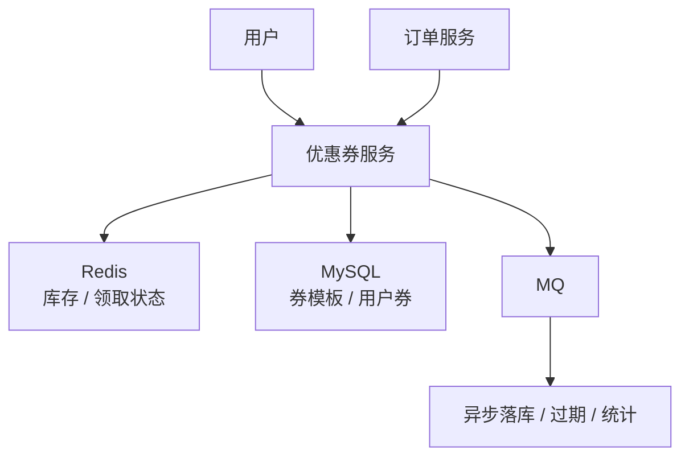
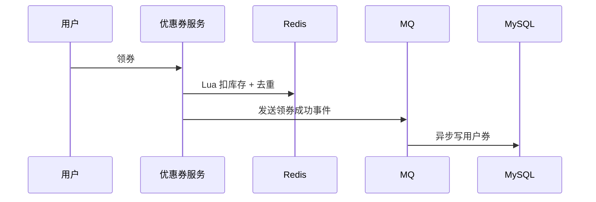

# 优惠券系统

> 优惠券系统核心是领券并发、库存、防超领、核销幂等、过期和适用规则。

## 一、需求澄清

核心功能：

- 发券。
- 领券。
- 查询用户券包。
- 下单核销。
- 退单返券。
- 过期处理。

关键约束：

- 不能超发。
- 同一用户不能重复领取受限券。
- 核销必须幂等。
- 规则计算不能拖慢下单链路。

## 二、核心架构



## 三、数据模型

券模板：

```text
coupon_template
id, name, total_stock, rule, valid_time, status
```

用户券：

```text
user_coupon
id, user_id, template_id, status, received_at, used_at, expired_at
```

唯一约束：

```text
uk_user_template(user_id, template_id)
```

用于限制一人一张。

## 四、领券设计

高并发领券：



Redis Lua 保证：

- 库存大于 0。
- 用户未领取。
- 扣减库存。
- 标记用户已领。

MySQL 唯一索引兜底防重复。

## 五、核销设计

下单核销：

```sql
update user_coupon
set status = 'USED',
    used_at = now()
where id = ?
  and user_id = ?
  and status = 'UNUSED';
```

影响行数：

- 1：核销成功。
- 0：已核销、已过期或不存在。

退单返券：

- 判断券是否可返。
- 幂等恢复状态。
- 记录返券流水。

## 六、规则计算

规则：

- 满减。
- 折扣。
- 品类限制。
- 商家限制。
- 新用户限制。
- 有效期。

复杂规则不要在数据库里临时拼复杂 SQL。

建议：

- 规则结构化存储。
- 下单前拉取用户可用券。
- 应用层计算最优券。
- 热门券规则缓存。

## 七、常见坑

- 领券直接 update MySQL 库存，热点行锁严重。
- Redis 扣成功但落库失败，没有补偿。
- 用户重复点击导致重复领券。
- 核销没有前置状态，重复扣券。
- 过期任务一次扫全表。
- 退单返券没有幂等。

## 八、面试表达

```text
优惠券系统的难点是高并发领券和下单核销。
领券时我会用 Redis Lua 原子扣库存和用户去重，成功事件进入 MQ 异步落库，MySQL 唯一索引兜底。
核销时用状态机更新，只有 UNUSED 才能变 USED，保证幂等。
复杂优惠规则结构化存储并缓存，应用层计算可用券和最优券。
过期、统计和补偿都走异步任务，避免影响下单主链路。
```
