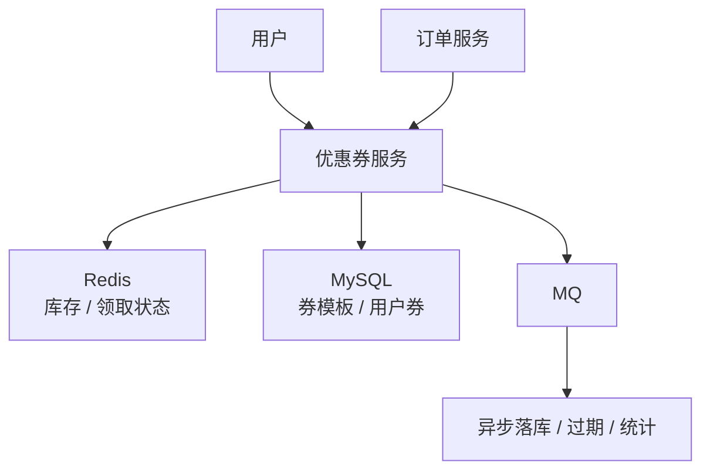
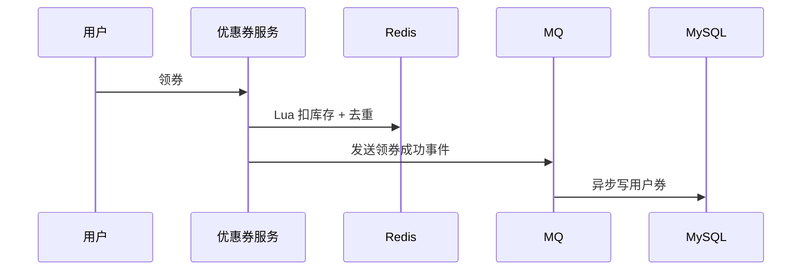

# 优惠券系统

> 优惠券系统核心是领券并发、库存、防超领、核销幂等、过期和适用规则。

## 一、需求澄清

核心功能：

- 发券。
- 领券。
- 查询用户券包。
- 下单核销。
- 退单返券。
- 过期处理。

关键约束：

- 不能超发。
- 同一用户不能重复领取受限券。
- 核销必须幂等。
- 规则计算不能拖慢下单链路。

## 二、核心架构


```mermaid
flowchart TB
    Client["用户"] --> Coupon["优惠券服务"]
    Coupon --> Redis["Redis<br/>库存 / 领取状态"]
    Coupon --> DB["MySQL<br/>券模板 / 用户券"]
    Coupon --> MQ["MQ"]
    MQ --> Async["异步落库 / 过期 / 统计"]
    Order["订单服务"] --> Coupon
```

## 三、数据模型

券模板：

```text
coupon_template
id, name, total_stock, rule, valid_time, status
```

用户券：

```text
user_coupon
id, user_id, template_id, status, received_at, used_at, expired_at
```

唯一约束：

```text
uk_user_template(user_id, template_id)
```

用于限制一人一张。

## 四、领券设计

高并发领券：


```mermaid
sequenceDiagram
    participant U as 用户
    participant C as 优惠券服务
    participant R as Redis
    participant MQ as MQ
    participant DB as MySQL

    U->>C: 领券
    C->>R: Lua 扣库存 + 去重
    C->>MQ: 发送领券成功事件
    MQ->>DB: 异步写用户券
```

Redis Lua 保证：

- 库存大于 0。
- 用户未领取。
- 扣减库存。
- 标记用户已领。

MySQL 唯一索引兜底防重复。

## 四之续、领券链路 5 大追问(资深必背)⭐

> 上一节是骨架,这一节是肉。面试问"领券系统"的时候,真正区分资深的是这 5 个追问能不能答到细节。

### 4.1 同步 vs 异步划分(取决于返回语义)

> **核心**:同步/异步不是技术决定,是**接口返回语义**决定的——返回"领取成功"和"领取中"是两套设计。

| 必须同步(主链路) | 可以异步(辅助链路) |
| --- | --- |
| 参数校验(活动 ID / 用户 ID) | 创建用户券记录(看返回语义) |
| 活动状态(是否在领取窗口) | 领取成功消息推送 |
| 用户资格(新人券 / VIP 券 / 黑名单) | 埋点 / BI 统计 |
| Redis 库存判断 + 扣减 | 推荐系统刷新 |
| 防重判断(是否已领) | 用户画像更新 |

**两种返回语义对应两套设计**:

**A. 返回"领取成功"(低中 QPS,< 1w QPS,用户立即可见)**:

```
同步:校验 → Redis Lua 扣库存 + 防重 → MySQL 创建 user_coupon → 返回成功
异步:消息推送 / 埋点 / 推荐刷新
```

→ 优点:用户体验好,券包立刻看到
→ 缺点:MySQL 是同步链路一部分,高峰扛不住

**B. 返回"领取中"(高 QPS,5w+ QPS,异步落库)**:

```
同步:校验 → Redis Lua 扣库存 + 防重 + 写领取请求流水 → 投 MQ → 返回"领取中"
异步:MQ 消费者创建 user_coupon → 推送"已到账"
```

→ 优点:MySQL 削峰,Redis 单点抗住
→ 缺点:用户要等几秒才能在券包看到,需要前端轮询或推送

> **一句话总结**:同步/异步**先看接口返回语义**——返回"成功"必须同步建 user_coupon(否则券包空),返回"领取中"才能 MQ 异步落库;**5w QPS 双 11 场景一定走 B 方案**,低峰活动走 A 方案。

### 4.2 防重复领取(三层防线,前端不算)

> **核心**:前端置灰只是体验优化,**不算防线**;真正防重在 Redis 和 MySQL 两层。

| 层 | 机制 | 作用 | 失效场景 |
| --- | --- | --- | --- |
| **前端置灰** | 点击后按钮 disabled | **只优化体验**,防误点 | F12 改 DOM、抓包重放 → 完全失效 |
| **Redis Set 防重**(快) | `SISMEMBER coupon:claimed:{batch_id} {user_id}` | 高并发下 ms 级判重 | Redis 挂 / 数据丢失 |
| **MySQL 唯一索引**(兜底) | `UNIQUE KEY uk_user_batch(user_id, batch_id)` | **最终一致兜底** | 几乎不会失效 |

**Redis Set 两种实现**:

```redis
# 方案 1:集中 Set(节省 key 数,适合批次内用户少)
SISMEMBER coupon:claimed:C1001 user_123      # 判重
SADD       coupon:claimed:C1001 user_123     # 标记

# 方案 2:独立 key(更易过期,适合用户量大)
SET coupon:claim:C1001:user_123 1 EX 7776000  # 90 天过期
```

**Lua 把判重 + 扣库存 + 标记打包成原子**:

```lua
-- KEYS[1]=stock_key, KEYS[2]=claimed_set, ARGV[1]=user_id
if redis.call('SISMEMBER', KEYS[2], ARGV[1]) == 1 then
    return -1  -- 已领过
end
local stock = tonumber(redis.call('GET', KEYS[1]))
if stock <= 0 then
    return -2  -- 库存不足
end
redis.call('DECR', KEYS[1])
redis.call('SADD', KEYS[2], ARGV[1])
return 1  -- 成功
```

**MySQL 唯一索引兜底**(防 Redis 数据丢失导致重复领):

```sql
CREATE TABLE user_coupon (
    id BIGINT PRIMARY KEY AUTO_INCREMENT,
    user_id BIGINT NOT NULL,
    coupon_batch_id BIGINT NOT NULL,
    status TINYINT,
    created_at DATETIME,
    UNIQUE KEY uk_user_batch (user_id, coupon_batch_id)
);
-- INSERT 时遇 Duplicate Key → 用户已领过,不重复发
```

> **一句话总结**:防重三层 **前端置灰(体验) → Redis Set 防重(性能) → MySQL 唯一索引(兜底)**,**前端不算防线**(F12 就废),Redis Set 必须和库存扣减一起放 Lua 里原子化,MySQL 唯一索引是最后一道墙。

### 4.3 防库存超发(Redis Lua 4 步 + MySQL CAS 兜底)

> **核心**:Redis Lua 防高并发超发,MySQL `stock > 0` CAS 防 Redis 异常时超发。

**Redis Lua 原子四步**(领券核心):

```lua
-- KEYS[1]=stock_key, KEYS[2]=claimed_set, ARGV[1]=user_id
-- 步骤 1:检查是否已领
if redis.call('SISMEMBER', KEYS[2], ARGV[1]) == 1 then return -1 end
-- 步骤 2:检查库存
local stock = tonumber(redis.call('GET', KEYS[1]) or '0')
if stock <= 0 then return -2 end
-- 步骤 3:扣库存
redis.call('DECR', KEYS[1])
-- 步骤 4:标记已领
redis.call('SADD', KEYS[2], ARGV[1])
return 1
```

**MySQL CAS 兜底**(异步落库时 + 防 Redis 异常超发):

```sql
UPDATE coupon_batch
SET stock = stock - 1
WHERE batch_id = ?
  AND stock > 0;
-- 影响行数 = 1 → 成功;= 0 → 库存已耗尽,需回滚 Redis 操作
```

**为什么两层都要**:

| 只用 Redis Lua | 只用 MySQL CAS | Redis Lua + MySQL CAS |
| --- | --- | --- |
| Redis 数据丢失 → 库存重置 → 超发 | 5w QPS 单行锁打挂 DB | Redis 扛并发,DB 防异常 |

> **一句话总结**:防超发**两层防线**——Redis Lua 把"判重+判库存+扣库存+标记"打包原子化扛并发,MySQL `stock > 0` CAS 防 Redis 故障导致库存重置;**热点批次单行 UPDATE 在 DB 层撑不住高 QPS,Redis 是主力**。

### 4.4 Redis vs MySQL 各存什么(字段级)

> **核心**:Redis 做"快速判断 + 预扣",MySQL 做"用户资产 + 最终事实 + 审计"。

**Redis 存什么**(5 类 key):

| Key 模式 | 类型 | 内容 | TTL |
| --- | --- | --- | --- |
| `coupon:batch:{batch_id}` | Hash | 批次配置(活动时间、规则、每人限领) | 活动结束 + 1 天 |
| `coupon:stock:{batch_id}` | String | 库存余量(整数,DECR 扣减) | 活动结束 + 1 天 |
| `coupon:claimed:{batch_id}` | Set | 已领取用户 ID 集合 | 活动结束 + 7 天 |
| `coupon:idem:{request_id}` | String | 幂等 key(防重复请求) | 5 分钟 |
| `coupon:active:list` | ZSet | 当前活跃批次列表(按开始时间排) | 永久 |

**MySQL 存什么**(5 张表):

| 表 | 核心字段 | 作用 |
| --- | --- | --- |
| `coupon_batch` | id, name, total_stock, **stock(剩余)**, rule_json, start_at, end_at | 券批次元数据 + 库存兜底 |
| `user_coupon` | id, **user_id**, **batch_id**, status(unused/used/expired), received_at, used_at, expired_at,UNIQUE(user_id,batch_id) | **用户券资产**(核心表)|
| `coupon_flow` | id, batch_id, user_id, action(claim/use/refund), delta, created_at | 库存/领取流水(对账)|
| `coupon_use_record` | id, user_coupon_id, order_id, discount_amount, used_at | 核销明细 |
| `idempotent_record` | request_id, biz_type, result, created_at | 幂等记录(超时复查)|

> **一句话总结**:Redis 存**5 类**(批次配置/库存/已领 Set/幂等 key/活跃列表)做"快判断 + 预扣",MySQL 存**5 张表**(批次/用户券/流水/核销/幂等)做"用户资产 + 最终事实 + 审计",**用户券资产 user_coupon 是核心**(唯一索引 + 状态机)。

### 4.5 Redis 扣成功 MySQL 失败的补偿(先查后回滚)⭐

> **核心**:**补偿前必须先查 MySQL**——可能 user_coupon 已创建,只是返回超时,**盲目回滚 = 重复创建 + 库存超发**。

**完整链路**:

```
Step 1: Redis Lua 预扣成功 + 写领取请求流水
Step 2: MQ 投递 / 同步创建 user_coupon
Step 3: MySQL 失败 → 进入补偿
```

**补偿三态判断**(最关键):

```
补偿任务执行时:
  SELECT * FROM user_coupon WHERE user_id=? AND batch_id=?

  ① 查到记录(status=unused) → MySQL 其实成功了,只是上次响应超时
    → 不要回滚 Redis!补 Redis claimed 状态(若丢失) → 标记补偿完成

  ② 查不到记录 + 失败可重试 → 重新 INSERT user_coupon
    → 成功:补偿完成
    → 仍失败:重试次数 +1,等下次

  ③ 查不到记录 + 失败次数 > 阈值(如 5 次) → 进入死信队列
    → Redis 回滚:stock+1,SREM claimed user_id
    → 删除领取请求流水
    → 告警人工介入
```

**为什么不能直接回滚**:

```
错误流程:
  Redis 扣成功 → MySQL 创建 → 网络抖动响应超时
  → 实际 MySQL 已创建成功
  → 业务层认为失败 → 直接 stock+1, SREM user_id
  → 用户其实有券但 Redis 显示没领 → 用户重新领 → 再创建一张
  → INSERT 命中唯一索引报错 / 或绕过唯一索引超发
```

**正确补偿伪代码**:

```go
func compensateCoupon(reqID, userID, batchID int64) error {
    // 1. 先查 MySQL
    uc, err := db.QueryUserCoupon(userID, batchID)
    if uc != nil {
        // ① 已创建,只是上次超时 → 补 Redis claimed
        redis.SAdd(claimedKey(batchID), userID)
        return markCompensated(reqID)
    }
    // 2. 重试创建
    if err := db.InsertUserCoupon(...); err == nil {
        return markCompensated(reqID)
    }
    // 3. 重试次数超限 → 回滚 Redis
    if retries(reqID) > 5 {
        redis.Incr(stockKey(batchID))           // 库存返还
        redis.SRem(claimedKey(batchID), userID) // 删除已领标记
        alert("coupon compensate failed", reqID)
        return moveToDeadLetter(reqID)
    }
    return retry(reqID)
}
```

> **一句话总结**:Redis 扣成功 MySQL 失败的补偿**核心铁律是"先查后回滚"**——查 user_coupon 已存在则是超时假失败(只补 Redis 状态),不存在才能回滚 Redis + 告警;**盲目回滚会导致重复创建或超发**,这是面试官最爱追问的资深细节。

### 4.6 全链路总结(面试一段话)

> 优惠券领取链路里,**参数校验、活动状态、用户资格、库存判断、防重判断**必须同步完成。
> 高峰场景(5w QPS)用 **Redis Lua 原子完成"是否已领 → 库存是否足 → 扣库存 → 记录已领取"四步**,然后通过 MQ 异步创建 user_coupon,接口返回"领取中";
> 低峰直接同步创建 user_coupon 返回"领取成功"。
> 防重三层:**前端置灰只算体验,Redis Set 做快速判重,MySQL `UNIQUE(user_id, batch_id)` 做最终兜底**。
> 库存防超发:**Redis Lua 扛并发,MySQL `stock > 0` CAS 防 Redis 异常**。
> Redis 存 5 类(批次/库存/已领 Set/幂等/活跃列表),MySQL 存 5 张(批次/用户券/流水/核销/幂等)。
> Redis 扣成功但 MySQL 失败时,**补偿前必须先查 user_coupon 是否已存在**——存在说明上次只是响应超时(补 Redis claimed 即可),不存在再重试或回滚 Redis + 告警,**盲目回滚会导致重复创建或超发**。

## 五、核销设计

下单核销：

```sql
update user_coupon
set status = 'USED',
    used_at = now()
where id = ?
  and user_id = ?
  and status = 'UNUSED';
```

影响行数：

- 1：核销成功。
- 0：已核销、已过期或不存在。

退单返券：

- 判断券是否可返。
- 幂等恢复状态。
- 记录返券流水。

## 六、规则计算

规则：

- 满减。
- 折扣。
- 品类限制。
- 商家限制。
- 新用户限制。
- 有效期。

复杂规则不要在数据库里临时拼复杂 SQL。

建议：

- 规则结构化存储。
- 下单前拉取用户可用券。
- 应用层计算最优券。
- 热门券规则缓存。

## 七、常见坑

- 领券直接 update MySQL 库存，热点行锁严重。
- Redis 扣成功但落库失败，没有补偿。
- 用户重复点击导致重复领券。
- 核销没有前置状态，重复扣券。
- 过期任务一次扫全表。
- 退单返券没有幂等。

## 八、面试表达

```text
优惠券系统的难点是高并发领券和下单核销。
领券时我会用 Redis Lua 原子扣库存和用户去重，成功事件进入 MQ 异步落库，MySQL 唯一索引兜底。
核销时用状态机更新，只有 UNUSED 才能变 USED，保证幂等。
复杂优惠规则结构化存储并缓存，应用层计算可用券和最优券。
过期、统计和补偿都走异步任务，避免影响下单主链路。
```
