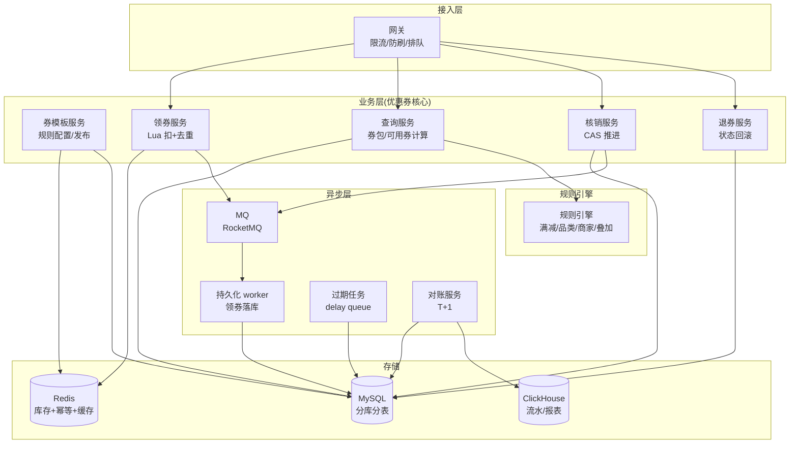
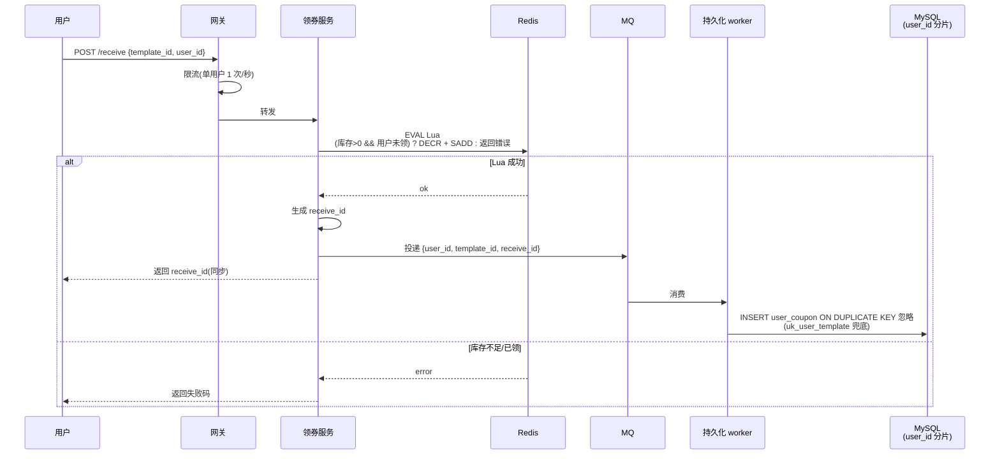
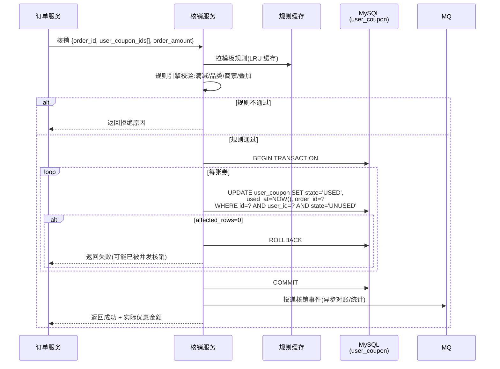
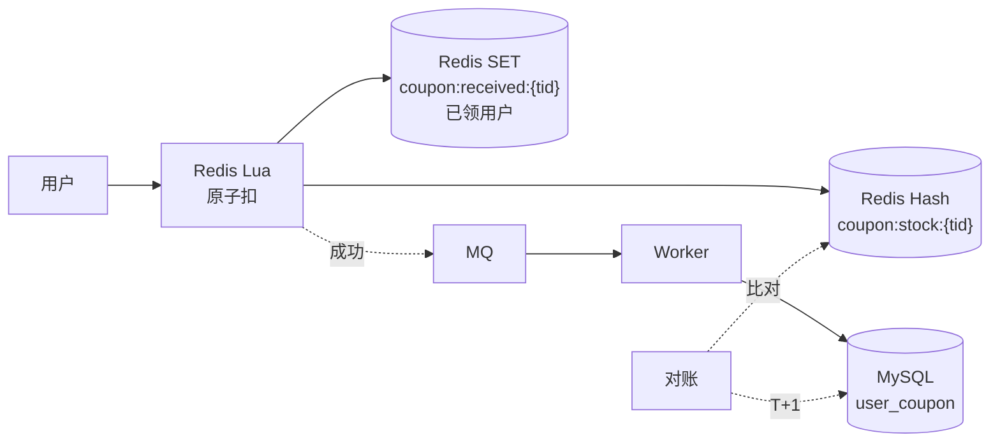
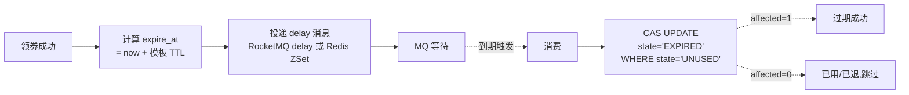
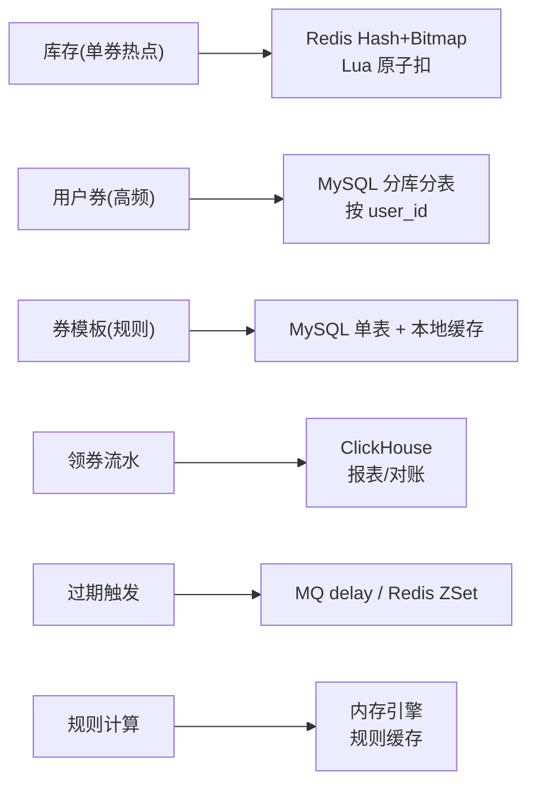
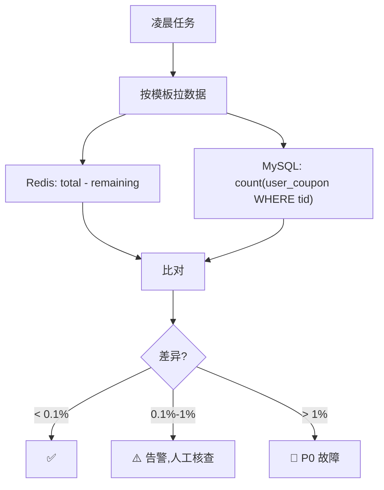

# 优惠券系统(4S 版)

> 用 [01b-4s-method.md](01b-4s-method.md) 的 **4S 分析法**(Scenario / Service / Storage / Scale)推一遍**电商优惠券系统**。
>
> **样板规模**:抖音/淘宝大促级,单券模板百万级库存,瞬时领券峰值 10 万 QPS。
>
> **三大核心考点**(本文重点):
> 1. **高并发领券防超发**——百万库存秒空,Redis Lua 原子扣 + 用户去重双重保障
> 2. **核销幂等 + 状态机**——支付/退款链路的状态不可逆,CAS 推进 + UNIQUE 兜底
> 3. **规则引擎与最优券计算**——满减/折扣/品类/商家/新人/叠加规则,O(N) 拉券 + 内存计算
>
> **关联文档**:
> - [14-coupon-system.md](14-coupon-system.md) — 优惠券原理深度版(本文姊妹篇)
> - [13b-payment-system-4s.md](13b-payment-system-4s.md) — 下游支付(核销时机)
> - [24-order-system.md](24-order-system.md) / [24b-order-system-4s.md](24b-order-system-4s.md) — 上游订单(核销主调用方)
> - [03b-seckill-system-4s.md](03b-seckill-system-4s.md) — 秒杀(领券是秒杀的"轻量版")

---

## 一、为什么把优惠券单独写一篇

优惠券是电商**最容易踩坑**的子系统——看着简单,实际涉及:

| 特点 | 影响 |
| --- | --- |
| **高并发热点** | 大促开抢瞬时百万人抢同一张券,**单券模板就是热点** |
| **强一致 + 强幂等** | 不能超发(亏钱)、不能重复领(亏钱)、不能重复核销(亏钱) |
| **状态机复杂** | 未领/已领/已使用/已退回/已过期,**核销 + 退单 + 过期**三种推进路径 |
| **规则多变** | 满减/折扣/品类/商家/新人/叠加,**规则引擎决定下单链路体验** |
| **核销链路敏感** | 嵌在下单链路里,慢一秒影响 GMV |
| **业务侧扩展频繁** | 红包/积分券/兑换券/会员券……复用底层但规则差异大 |

优惠券几乎是"**秒杀(领) + 订单(核销) + 风控(规则)**"的复合体——所以面试常考,而且很容易暴露候选人**只懂秒杀不懂状态机 / 只懂下单不懂规则**的短板。

---

## 二、Scenario(场景分析,5 分钟)

**核心目标**:先问清楚谁发券、谁领券、什么时候核销、规模多大,**关键是定下"领是热点写 + 核销是查询多 + 规则是计算复杂"的三段式定调**。

### 2.1 功能分级

| 等级 | 功能 |
| --- | --- |
| **Must** | 发券模板 / 领券(去重防超发)/ 查询券包 / 核销(下单时)/ 退券(退单时)/ 过期处理 |
| **Nice** | 定向发券(指定用户 ID 列表)/ 券叠加 / 最优券计算 / 券分享 / 券转赠 |
| **Out** | 红包提现(走资金账户)/ 第三方券对接(独立网关)/ 营销活动配置后台(运营平台) |

**反模式**:面试官说"设计优惠券",直接画"Redis 扣库存 + MySQL 落库" → **错**。**先问清楚定向发还是公开领、规则复杂度、是否参与下单链路**——满减券和兑换券设计差异巨大。

### 2.2 容量估算

```text
样板:中型电商大促

券模板数:       活跃模板 1 万个,总历史 100 万
日发券量:       2000 万张(包括运营批量定向发 + 用户领)
日核销量:       500 万张(下单时使用,核销率 25%)
日活跃用户:     500 万,人均券包 5-20 张

写 QPS(领券):
  平均:        2000 万 / 86400 ≈ 230 QPS
  大促开抢峰值: 10 万 QPS(单券模板瞬时秒空)
  日常领券:    5000 QPS(每日红包/签到)

读 QPS(查询):
  查我的券包:     日 5000 万 → 580 QPS,峰值 2 万
  下单拉取可用券: 日 1 亿    → 1200 QPS,峰值 5 万

写 QPS(核销):
  平均:        500 万 / 86400 ≈ 58 QPS
  大促峰值:    1 万 QPS(随下单 QPS 同步)

存储估算:
  券模板表:     1 万行 × 5 KB(规则 JSON)= 50 MB
  用户券表:     日新增 2000 万 × 500 B = 10 GB
  保留 2 年:    10 GB × 730 ≈ 7 TB
  → 单库扛不住,必须分库分表

发券流水/审计:  日 2000 万行 × 200 B = 4 GB/天 → 走 ClickHouse 归档
```

**关键认知**:领券是**写热点**(单券模板秒杀),查券是**读高频**(下单必查),核销是**事务关键**(嵌在下单链路)——**三类流量画像完全不同**,架构要分层处理。

### 2.3 非功能要求(资深扣分点)

| 维度 | 要求 |
| --- | --- |
| **不超发** | **强一致**(亏钱事件 P0),Redis + DB 双保险 |
| **不重领** | (user_id, template_id) 唯一,Lua + UNIQUE 兜底 |
| **核销幂等** | 状态机 CAS 推进,重复请求返回相同结果 |
| **下单延迟** | 拉券 + 计算 P99 < 100ms(嵌在下单链路) |
| **可对账** | 发券/核销/退券**全程流水**,T+1 与营销预算对账 |
| **过期时效** | 到期 30 秒内不可使用(扫描精度) |

### 2.4 设计定调(优惠券的灵魂)

> "优惠券的核心矛盾是**'高并发领 + 高频读 + 强事务核销'三段式画像不同**——所以我会让**领券走 Redis Lua + MQ 异步落库**(参考秒杀),**核销走状态机 CAS + UNIQUE 兜底**(参考支付),**规则计算走内存引擎 + 规则缓存**(参考风控),**对账和过期走异步链路**(参考订单)。"

**这句话定下了整个系统的设计原则**——后面 Service / Storage / Scale 都围绕"**领-核-算分层 + 三流量画像隔离**"展开。

### 2.5 与其他 4S 系统的根本差异

| 维度 | 秒杀 | 订单 | 支付 | **优惠券** |
| --- | --- | --- | --- | --- |
| 核心矛盾 | 防超卖 | 多视角分片 | 资金安全 | **领写热点 + 核销强事务 + 规则计算** |
| 写主体 | 库存(单 sku) | 订单 + 三方 ID | 流水 | **券模板库存 + 用户券 + 核销流水** |
| 一致性 | 强(单 sku) | 强(状态机) | 强(钱) | **强(库存)+ 强(核销)+ 弱(规则缓存)** |
| 分片维度 | sku_id / user_id | user_id + 异构 | 商户 | **user_id(用户券)+ template_id(模板)** |
| 设计重心 | 削峰防热点 | 基因法 + 对账 | 状态机+对账 | **三流量画像分层 + 规则引擎 + 双唯一兜底** |

优惠券是"**秒杀 + 订单 + 支付 + 风控**"的杂交体——**没有任何一个考点是它独有的**,但**组合在一起就是真实业务的全貌**,这也是为什么大厂面试爱出这道题。

---

## 三、Service(服务拆分,10 分钟)

**核心目标**:按 SRP 拆服务,讲清楚**发券 / 领券 / 查询 / 核销 / 退券 / 过期**六条主线,**写出核心 API**。

### 3.1 三层架构



### 3.2 服务职责

| 服务 | 职责 | 不做 |
| --- | --- | --- |
| **券模板服务** | 模板配置 / 发布 / 库存初始化(Redis + DB)/ 规则结构化存储 | 不直接发券给用户 |
| **领券服务** | 资格校验 + Lua 扣 + 投 MQ + 同步返回 receive_id | 不直接写 MySQL(异步) |
| **查询服务** | 查券包 / 拉下单可用券 / 计算最优券组合 | 不参与状态变更 |
| **核销服务** | 接收订单系统调用 → CAS 推进 USED + 写核销流水 | 不计算规则(订单已校验过) |
| **退券服务** | 退单时回滚 USED → UNUSED + 流水 | 不重生成券(走"补券"另一条链路) |
| **规则引擎** | 评估规则是否满足 + 计算优惠金额 + 排序最优组合 | 不持久化,纯内存计算 |
| **持久化 worker** | 消费 MQ → 写 user_coupon 表 | 不接前端流量 |
| **过期任务** | delay queue 触发券过期 → 状态改为 EXPIRED | 不扫表 |
| **对账服务** | T+1 校验"发券 - 核销 - 退券 - 过期 = 当前可用",差异告警 | 不实时干预 |

**关键决策**:
- **领券链路异步化**——Redis Lua 同步返回成功,真正落 MySQL 走 MQ 慢慢消(参考秒杀)
- **核销链路同步化**——下单时实时校验 + CAS 推进,**用户能感知**(参考支付)
- **规则引擎独立**——下单链路嵌入,但**不依赖 DB**,纯内存计算(规则缓存预热)
- **过期用 delay queue 不扫表**——单券到期时间精确到秒,扫表实现不了

### 3.3 领券链路时序图(主流程,大促开抢场景)



**资深点**:
- Lua 脚本是**核心** —— 一次原子执行"判断库存 + 判断去重 + 扣减 + 标记",任何竞态都不会超发
- **同步返回 receive_id** —— 用户立刻能看到"已领取",**不让用户等 MQ**
- **MQ 兜底 UNIQUE 索引** —— 极端情况 Lua 成功但 MQ 投递失败,定时对账补 + UNIQUE 防重
- **限流前置**——网关层按 user_id 限流 1 次/秒,防止用户狂点把 Lua 打爆

### 3.4 核销链路时序图(下单嵌入场景)



**资深点**:
- **核销前必跑规则引擎** —— 防止"领时合规、用时不合规"(用户改了订单凑单)
- **CAS 推进 + state='UNUSED'** —— 任何重复请求 affected_rows=0,**自动幂等**
- **多券同事务** —— 一个订单可能用 2-3 张券,**全成功或全失败**,事务保证
- **核销流水异步落 ClickHouse** —— 主链路只更新主表,审计走异步

### 3.5 核心 API

```text
# 模板管理(运营后台)
POST /v1/coupon/template
  Request:  { name, total_stock, rule:{...}, valid_from, valid_to, ... }
  Response: { template_id }

# 领券(用户)
POST /v1/coupon/receive
  Request:  { template_id, user_id }
  Response: { receive_id }
  错误码:   429 限流 / 410 库存不足 / 409 已领过 / 403 资格不符

# 查询券包(用户)
GET /v1/coupon/list?user_id=...&state=UNUSED
  Response: { coupons:[{id, template_id, state, expire_at, ...}], total }

# 拉取下单可用券(订单链路调用)
POST /v1/coupon/available
  Request:  { user_id, items:[{sku, merchant, amount, category}] }
  Response: { available:[{coupon_id, discount_amount, ...}], best_combo:[...] }

# 核销(订单服务调用)
POST /v1/coupon/use
  Request:  { order_id, user_coupon_ids:[], order_amount, items:[...] }
  Response: { actual_discount, used_ids:[] }

# 退券(退单服务调用)
POST /v1/coupon/refund
  Request:  { order_id, user_coupon_ids:[] }
  Response: { refunded_ids:[] }
```

**资深加分点**:
- **available 接口和 use 接口分离** —— 前者纯查询(只读),后者状态变更(写),前端可以多次调 available
- **available 返回 best_combo** —— 服务端帮算最优组合,前端不重复算
- **use 返回 actual_discount** —— 实际优惠金额,前端用于展示,不让前端推算

---

## 四、Storage(存储设计,15 分钟)

**核心目标**:这是优惠券系统的重头戏,**集中讲三大核心**——**库存双层(Redis+DB)、用户券分片、规则结构化存储**。

### 4.1 库存设计:Redis + MySQL 双层(核心考点 1)⭐

#### 4.1.1 为什么必须双层

```text
仅 MySQL:        SELECT FOR UPDATE 行锁,单券热点 QPS 不过 1000 → 大促秒空 ≠ 真秒空
仅 Redis:        Redis 挂了 = 库存丢失 → 超发风险
Redis + MySQL:   Redis 抗并发,MySQL 持久化,对账兜底
```

#### 4.1.2 双层架构



**Redis 数据结构**:
```
Hash:  coupon:stock:{tid}  → { total: 1000000, remaining: 23456 }
SET:   coupon:received:{tid} → { user_id_1, user_id_2, ... }   (Bitmap 优化超大模板)
```

**Lua 脚本(核心)**:
```lua
-- KEYS[1] = coupon:stock:{tid}
-- KEYS[2] = coupon:received:{tid}
-- ARGV[1] = user_id
-- ARGV[2] = max_per_user (默认 1)
local remaining = tonumber(redis.call('HGET', KEYS[1], 'remaining'))
if remaining <= 0 then return -1 end                  -- 库存不足
if redis.call('SISMEMBER', KEYS[2], ARGV[1]) == 1 then
    return -2                                           -- 已领过
end
redis.call('HINCRBY', KEYS[1], 'remaining', -1)
redis.call('SADD', KEYS[2], ARGV[1])
return 1                                                -- 成功
```

#### 4.1.3 超大模板的优化(Bitmap)

```text
问题: 单券模板 1000 万用户领,SET 占内存 ~ 1.6 GB(假设 user_id 16 字节)
方案: 用 Bitmap(BITSET coupon:received:{tid} user_id 1)
      内存 = 1000 万 / 8 = 1.25 MB(降 1000 倍)
代价: 只支持数字 user_id,字符串需 hash 后用低位
```

#### 4.1.4 库存预热与回填

```text
模板发布时:
  HSET coupon:stock:{tid} total 1000000 remaining 1000000
  
模板停发(库存未抢完):
  保留 Redis 数据 + DB 标记 state=STOPPED
  
对账兜底:
  T+1 比对 SUM(user_coupon WHERE template_id=tid) ≈ total - remaining
  差异 > 1% 告警
  
Redis 挂了重启:
  从 MySQL 反算 remaining = total - count(user_coupon WHERE tid)
  期间领券降级为"排队等恢复"
```

### 4.2 用户券表分片(核心考点 2)⭐

#### 4.2.1 分片维度选择

| 分片键 | 查券包(用户高频) | 模板维度查(运营) | 核销(订单调用) | 评价 |
| --- | --- | --- | --- | --- |
| **按 user_id** | ✅ 不跨库 | ❌ 全库扫 | ✅ 已知 user_id | ✅ **主选** |
| **按 template_id** | ❌ 全库扫 | ✅ 不跨库 | ✅ 已知 | ❌ 主流量受损 |
| **按 coupon_id** | ❌ 全库扫 | ❌ 全库扫 | ✅ | ❌ 牺牲 95% 场景 |

**结论:按 user_id 分片**——查券包和核销都是"已知 user_id"场景,**模板维度统计走异步同步到 ClickHouse**。

> 与订单系统按 user_id 分片同思路:**分片键跟主流量走**,详见 [24b §4.1](24b-order-system-4s.md)。

#### 4.2.2 表结构

```sql
CREATE TABLE user_coupon (
    id              BIGINT      NOT NULL AUTO_INCREMENT,
    user_id         BIGINT      NOT NULL,            -- 分片键
    template_id     BIGINT      NOT NULL,
    receive_id      VARCHAR(64) NOT NULL,            -- 领券幂等键(Lua 同步返回)
    state           VARCHAR(16) NOT NULL,            -- UNUSED/USED/REFUNDED/EXPIRED
    received_at     DATETIME    NOT NULL,
    used_at         DATETIME    DEFAULT NULL,
    order_id        BIGINT      DEFAULT NULL,        -- 核销订单
    expire_at       DATETIME    NOT NULL,            -- 用于过期任务
    refund_at       DATETIME    DEFAULT NULL,
    refund_reason   VARCHAR(255) DEFAULT NULL,
    created_at      DATETIME    NOT NULL,
    updated_at      DATETIME    NOT NULL,

    PRIMARY KEY (id),
    UNIQUE KEY uk_receive (receive_id),              -- 领券幂等
    UNIQUE KEY uk_user_template (user_id, template_id),  -- 一人一张(可选,根据规则)
    KEY idx_user_state (user_id, state, expire_at),
    KEY idx_template_state (template_id, state)
) ENGINE=InnoDB;
-- 32 库 × 32 表 = 1024 物理表
-- shard_db = user_id % 32
```

**双重 UNIQUE 兜底**:
- `uk_receive`:防 MQ 重复投递(同 receive_id 多次消费只插一次)
- `uk_user_template`:防业务并发(用户同模板限领 1 张时,Lua 失效兜底)

> 如果模板允许多张(如签到券每天一张),把 uk_user_template 去掉,改为 `uk_user_template_date(user_id, template_id, DATE(received_at))`。

#### 4.2.3 核销操作(状态机 CAS)

```sql
-- 原子 CAS,避免重复核销
UPDATE user_coupon
SET state = 'USED',
    used_at = NOW(),
    order_id = ?
WHERE id = ?
  AND user_id = ?          -- 强制走分片键
  AND state = 'UNUSED'
  AND expire_at > NOW();

-- affected_rows:
-- 1: 核销成功
-- 0: 已核销 / 已退回 / 已过期 / 不存在 → 业务返回"券不可用"
```

### 4.3 券模板与规则引擎(核心考点 3)⭐

#### 4.3.1 模板表(规则结构化)

```sql
CREATE TABLE coupon_template (
    template_id     BIGINT      NOT NULL,
    name            VARCHAR(128) NOT NULL,
    type            VARCHAR(16) NOT NULL,            -- FULL_REDUCE/DISCOUNT/EXCHANGE
    total_stock     INT         NOT NULL,
    per_user_limit  INT         DEFAULT 1,
    rule            JSON        NOT NULL,            -- 结构化规则
    valid_from      DATETIME    NOT NULL,
    valid_to        DATETIME    NOT NULL,
    state           VARCHAR(16) NOT NULL,            -- DRAFT/ACTIVE/STOPPED/EXPIRED
    created_at      DATETIME    NOT NULL,
    updated_at      DATETIME    NOT NULL,

    PRIMARY KEY (template_id),
    KEY idx_state_valid (state, valid_from, valid_to)
) ENGINE=InnoDB;
```

#### 4.3.2 规则 JSON 设计

```json
{
  "trigger": {
    "min_amount": 100.00,
    "applicable_categories": [1001, 1002],
    "applicable_merchants": [],
    "applicable_skus": [],
    "exclude_skus": [10086],
    "user_level": ["NEW", "VIP"]
  },
  "discount": {
    "type": "FULL_REDUCE",
    "amount": 20.00
  },
  "stack": {
    "stackable": true,
    "max_stack_count": 2,
    "conflict_groups": ["MEMBER_COUPON"]
  }
}
```

**为什么不放表字段**:
- **规则维度多变**,每次加规则要 ALTER TABLE → 不可接受
- JSON 配合**应用层规则引擎**,加规则只改代码
- DB 只存,不算

#### 4.3.3 规则引擎(纯内存,下单链路调用)

```go
type Rule struct {
    Trigger  TriggerRule
    Discount DiscountRule
    Stack    StackRule
}

func (r *Rule) Eval(order *Order) (passed bool, discount decimal.Decimal) {
    // 1. 触发条件:金额/品类/商家/SKU/用户等级
    if order.Amount.LessThan(r.Trigger.MinAmount) { return false, ZERO }
    if !matchCategory(order.Items, r.Trigger.ApplicableCategories) { ... }
    // ... 各种校验
    
    // 2. 折扣计算
    switch r.Discount.Type {
    case "FULL_REDUCE":  discount = r.Discount.Amount
    case "DISCOUNT":     discount = order.Amount.Mul(r.Discount.Rate)
    }
    return true, discount
}

// 最优券组合(N 张可用券中选最优)
func BestCombo(coupons []Coupon, order *Order) []Coupon {
    // 动态规划 / 贪心 / 全排列(N 小时用穷举,N 大走启发式)
    // 工业实战 N 通常 < 10,直接 2^N 穷举即可
    ...
}
```

#### 4.3.4 规则缓存(下单链路命门)

```text
为什么必须缓存模板规则:
  下单时拉用户可用券 → 假设 10 张,每张要查模板规则
  如果直查 DB:10 次查询 × 5ms = 50ms,P99 拖到 200ms+
  
方案:
  本地 LRU + Redis 二级
  本地:    每实例缓存 1 万活跃模板,命中率 99%
  Redis:   未命中走 Redis(10ms)
  DB:      Redis 也未命中走 DB,回填两级缓存

失效:
  模板配置修改 → 发布 MQ 事件 → 各实例失效本地缓存
  规则变更**不应**频繁发生(运营操作,日量百级)
```

### 4.4 过期处理(delay queue 不扫表)



**为什么不扫表**:
- 1024 张分片表 × 每分钟扫一次 = 资源浪费
- 过期精度差(分钟级,业务要秒级)
- delay queue 是 O(1) 投递,与订单超时取消同套路(详见 [24b §3.3](24b-order-system-4s.md))

**MQ 选型**:
- RocketMQ 原生 delay 级别(适合固定 TTL,如 24h/7d 通用券)
- Redis ZSet(适合任意 TTL,如运营定向发的"30 天后过期"券)

### 4.5 退券(状态机回滚)

```sql
-- 退单时调用
UPDATE user_coupon
SET state = 'UNUSED',           -- 回滚状态
    used_at = NULL,
    order_id = NULL,
    refund_at = NOW(),
    refund_reason = ?
WHERE id = ?
  AND user_id = ?
  AND state = 'USED'             -- 必须从 USED 回滚
  AND order_id = ?;              -- 关联订单匹配
```

**资深决策**:
- **退到 UNUSED**而不是删行 —— 保留审计 + 用户可重新使用
- **检查 order_id 匹配**——防止跨订单串改
- **过期后退券**特殊处理 —— 若 refund 时已过期,状态走 EXPIRED 而不是 UNUSED(看业务,可单独发"补偿券")

### 4.6 存储选型一图



---

## 五、Scale(扩展设计,10 分钟)

按 4S 第六板斧逐条:

| 板斧 | 优惠券场景具体动作 |
| --- | --- |
| **缓存** | 模板规则(本地 LRU + Redis 二级)/ 用户活跃券包(短 TTL)/ 库存(Redis 主) |
| **分片** | user_coupon 按 user_id;模板单库;规则缓存按 template_id |
| **异步** | 领券落库 / 核销审计 / 过期触发 / 对账 全 MQ |
| **削峰** | 大促开抢前网关令牌桶 + Lua 限速 + 排队页 |
| **限流降级** | 单用户 1 次/秒 / 单模板 QPS 上限 / 大促降级冷门券 |
| **容灾** | Redis 主从 + 哨兵;MySQL 同城三 AZ;过期任务多副本去重消费 |
| **监控** | 库存差异率 / 核销成功率 / 规则计算 P99 / 过期延迟 / 对账差异 |

### 5.1 大促削峰(单券模板秒杀)

```text
日常 5000 QPS → 大促开抢 10 万 QPS,20 倍跳变,但远小于秒杀(50 万),
   因为优惠券通常单券模板就 100 万-1000 万库存,**不像秒杀只有 1 万件**。

削峰组合拳:
  1. 前端排队页 + 验证码      过滤 50% 机器人
  2. 网关令牌桶               按 user_id + 全局
  3. Redis Lua 原子扣          单 Redis 实例 8 万 QPS,集群轻松扛
  4. MQ 异步落库              Redis 成功立即返回,MySQL 慢慢写
  5. 热点模板单独 Redis 实例   防止打爆共用集群

监控核心:
  - 单模板 Lua 失败率(库存不足 / 已领,正常)
  - Lua 异常率(超时 / 连接拒绝,异常告警)
  - MQ 堆积(持久化跟不上)
```

### 5.2 规则引擎扩展(避免业务侵入)

```text
随业务发展,新规则会越来越多:
  - 满减 → 阶梯满减(满 100 减 10、满 200 减 30)
  - 品类限制 → SKU 白名单 + 黑名单
  - 用户限制 → 等级 + 注册时长 + 历史消费
  - 时段限制 → 仅周末 / 仅 6 月 / 仅夜晚
  - 叠加规则 → 与其他券互斥 / 与会员价叠加

工程对策:
  - 规则 JSON 化,引擎插件化
  - 每个 trigger 字段单独写 Validator,通过反射或注册表加载
  - 新规则 = 加一个 Validator + 更新 JSON Schema,**无需改 DB**
  - 规则单元测试 100% 覆盖(规则错 = 钱算错)
```

### 5.3 对账(T+1 兜底)



**对账规则**:
- 模板维度:`Redis 已发数 ≈ MySQL user_coupon 记录数`
- 状态维度:`SUM(USED) + SUM(REFUNDED) + SUM(EXPIRED) + SUM(UNUSED) = TOTAL`
- 财务维度:T+1 与营销预算系统对账,**实际发券金额 vs 预算**

### 5.4 演进路线

```text
阶段 1(初创,日 1 万券):
  - 单 MySQL,SELECT FOR UPDATE 扣库存
  - 状态机简单(UNUSED/USED)
  - 规则硬编码

阶段 2(成长期,日 100 万券):
  - Redis Lua 扣库存
  - 引入 MQ 异步落库
  - 规则 JSON 化 + 缓存
  - delay queue 过期

阶段 3(中大型,日 1000 万券):
  - user_coupon 分库分表 32×32
  - 规则引擎插件化
  - 对账平台 + 监控大盘
  - 热点模板独立 Redis 集群

阶段 4(大型 + 大促):
  - 多机房同城多活
  - Bitmap 优化超大模板
  - 风控集成(刷券/羊毛党识别)
  - 实时统计走 Flink
```

---

## 六、面试现场表达模板

> 套用 4S 节奏,代入优惠券场景。**开场第一句突出"三类流量画像不同"**。

```text
"我用 4S 来组织这道优惠券系统的设计——先说一句定调:
 优惠券核心矛盾是'领是热点写 + 查是高频读 + 核销是强事务',
 三类流量画像不同,所以我所有设计都围绕'三段式分层 + 双唯一兜底'。

第一步 Scenario(5 分钟):
  样板规模日发 2000 万券,核销 500 万,大促单券峰值 10 万 QPS。
  非功能严:不超发 / 不重领 / 核销幂等 / 下单延迟 P99 < 100ms。
  与秒杀(写极热点)、订单(多视角分片)、支付(资金安全)对比:
  优惠券是这三者的杂交体,没有独有的难题,但组合是真实业务全貌。

第二步 Service(10 分钟):
  按 SRP 拆模板/领券/查询/核销/退券/过期/对账七服务 + 规则引擎独立。
  领券链路异步化(Lua 同步返回 + MQ 落库),
  核销链路同步化(CAS 推进 + 多券事务),
  规则引擎纯内存,下单链路嵌入但不依赖 DB。
  过期走 delay queue 不扫表。

第三步 Storage(15 分钟,本题重头戏):
  三大核心——
  
  ① 库存设计:Redis + MySQL 双层,Lua 脚本原子'判库存+判去重+扣减+标记',
              超大模板(>100万)用 Bitmap 优化内存,
              对账 T+1 比对 Redis 与 MySQL 差异 < 0.1%。
  
  ② user_coupon 分片:按 user_id 32×32,因为查券包/核销都是已知 user_id;
                      模板维度统计走异步同步 ClickHouse,
                      双 UNIQUE 兜底(uk_receive 防 MQ 重投 + uk_user_template 防业务重领)。
  
  ③ 规则引擎:规则 JSON 化,模板表存 JSON,应用层引擎纯内存计算,
              本地 LRU + Redis 二级缓存,命中率 99%,下单链路 P99 < 100ms;
              规则插件化,加规则只改代码不改 DB。

第四步 Scale(10 分钟):
  缓存——模板规则两级 + 库存 Redis;
  分片——user_coupon 32×32 按 user_id;
  异步——领券落库/审计/过期/对账全 MQ;
  削峰——大促网关令牌桶 + Lua 限速 + 热点模板独立 Redis;
  容灾——Redis 主从 + MySQL 同城三 AZ;
  对账——T+1 三维度比对(模板/状态/财务)。

最后讲演进:单库 → Redis 双层 → 分库分表 → 规则插件化 → 多机房多活。"
```

---

## 七、新版(本文)vs 旧版 [14-coupon-system.md](14-coupon-system.md)

### 7.1 结构对比表

| 维度 | **旧版** [14-coupon-system.md](14-coupon-system.md) | **本文**(4S 风格)|
| --- | --- | --- |
| **组织方式** | 主题平铺(需求/架构/数据/领券/核销/规则/坑/收束)8 节 | 4S 递进:Scenario → Service → Storage → Scale 4 节 |
| **顺序逻辑** | 平铺,各节相对独立 | 递进:三流量画像 → 服务分层 → 三大存储核心 → 大促削峰 |
| **Scenario 处理** | "需求澄清"一节,**没量级、没读写比** | 合并"功能/容量/非功能/三段式定调" |
| **Service 处理** | "核心架构"一张图,**没拆服务、没 API** | 拆 7 服务 + 写出 6 个 API + 两条时序图 |
| **Storage 处理** | "数据模型"两张表,**没分片、没库存双层、没规则引擎** | 三大核心:库存双层 + user_id 分片 + 规则 JSON 引擎 |
| **Scale 处理** | "常见坑"列表,**碎片化** | 6 板斧框架 + 大促削峰 + 对账 + 演进 |
| **关键考点** | 提了 Lua,**没讲为什么必须双层、没讲分片** | 必讲三段式画像 / 双 UNIQUE / 规则缓存 |
| **资深信号** | 低 | 高:三流量画像 + 与秒杀/订单/支付对比 + 演进路线 |

### 7.2 关键差异详解

**a. 顺序的差异——4S 强制递进**

旧版第三节"数据模型"和第四节"领券设计"逻辑断裂:先讲表再讲怎么用。

本文**强制递进**:
- Scenario 算出"领写热点 + 查高频 + 核销强事务"三类画像 → 定下"分层处理"原则
- Service 因此拆出"领券异步化 + 核销同步化 + 规则引擎独立" → 三服务对应三画像
- Storage 因此选"Redis 双层 + user_id 分片 + 规则 JSON" → 服务三类查询模式
- Scale 因此把"大促削峰 + 对账 + 规则插件化"作为终极优化

**b. Service 的差异——画图 vs 拆服务**

旧版只有一张架构图,把所有概念混在一起。

本文**七服务 + 两时序图**:模板/领券/查询/核销/退券/过期/对账,职责清晰,**领券和核销时序图是面试官最爱追问的点**。

**c. Storage 的差异——三大核心论证**

旧版**没讲库存双层、没讲分片、没讲规则引擎**。

本文**专门论证**:
1. 为什么 MySQL 单库扛不住(行锁) + Redis 单层不行(挂了丢)→ 必须双层
2. 为什么按 user_id 分片不按 template_id → 主流量决定
3. 为什么规则要 JSON 化 + 引擎插件化 → 业务变化频率

**d. Scale 的差异——大促削峰 + 对账闭环**

旧版讲完领核销就结束,**没讲大促怎么扛、没讲对账怎么做**。

本文**两个关键扩展**:
1. 大促削峰组合拳(令牌桶 + Lua 限速 + 热点模板独立)
2. T+1 对账三维度(模板/状态/财务)

### 7.3 哪个更适合什么场景

| 场景 | 推荐 |
| --- | --- |
| **第一次学优惠券** | 旧版——主题展开,易吸收 |
| **面试前刷题** | **本文**——4S 节奏 + 资深扣分点 |
| **架构评审 / 设计文档** | **本文**——三大核心论证 + 演进路线 |
| **了解最小可用版本** | 旧版——简单清晰 |

---

## 八、与相关文档的关系

| 文档 | 关系 |
| --- | --- |
| [14-coupon-system.md](14-coupon-system.md) | **教学版**——本文姊妹篇 |
| [03b-seckill-system-4s.md](03b-seckill-system-4s.md) | **借鉴**——领券链路本质是秒杀的轻量版 |
| [13b-payment-system-4s.md](13b-payment-system-4s.md) | **借鉴**——核销状态机思路 |
| [24-order-system.md](24-order-system.md) / [24b-order-system-4s.md](24b-order-system-4s.md) | **上游调用方**——订单核销时调本系统 |
| [15-inventory-system.md](15-inventory-system.md) | **类比**——库存预占思路与库存系统同源 |
| [23-id-generator-system-4s.md](23-id-generator-system-4s.md) | **依赖**——coupon_id / receive_id 走发号器 |

---

## 九、一句话总结

> **优惠券系统按 4S 推**:**Scenario 定三类流量画像不同**(领是热点写 / 查是高频读 / 核销是强事务)→ **Service 拆领券异步化 + 核销同步化 + 规则引擎独立**(七服务两时序)→ **Storage 三大核心**(**Redis+MySQL 库存双层 + user_id 分片 + 规则 JSON 引擎**)→ **Scale 走大促削峰 + 三维度对账 + 规则插件化**;
>
> - **核心资深信号**:
>   - **三类流量画像分层**——领写/查读/核销写,完全不同的优化策略
>   - **双 UNIQUE 兜底**——uk_receive(防 MQ 重投)+ uk_user_template(防业务重领),Lua 失效兜底
>   - **规则引擎纯内存 + 两级缓存**——下单链路 P99 < 100ms,加规则不改 DB
>   - **库存 Redis Bitmap 优化**——超大模板内存降 1000 倍
>   - **过期 delay queue 不扫表**——精度秒级,与订单超时取消同套路
>   - **三维度对账**——模板/状态/财务,差异率 < 0.1%
> - **与其他 4S 系统的关系**:优惠券是"**秒杀(领)+ 订单(核销)+ 支付(状态机)+ 风控(规则)**"的杂交体,**没有独有的难题,组合即真实业务全貌**
