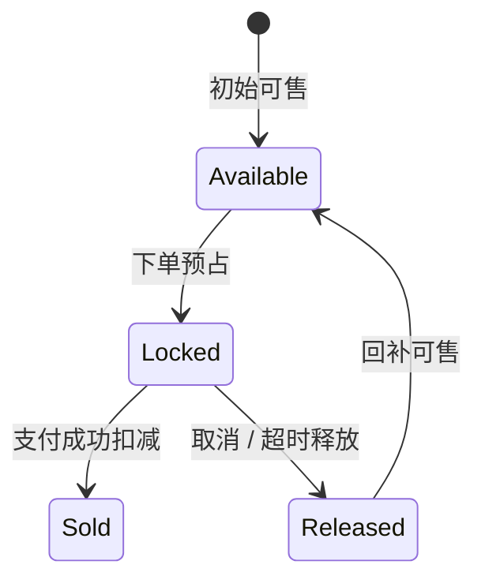
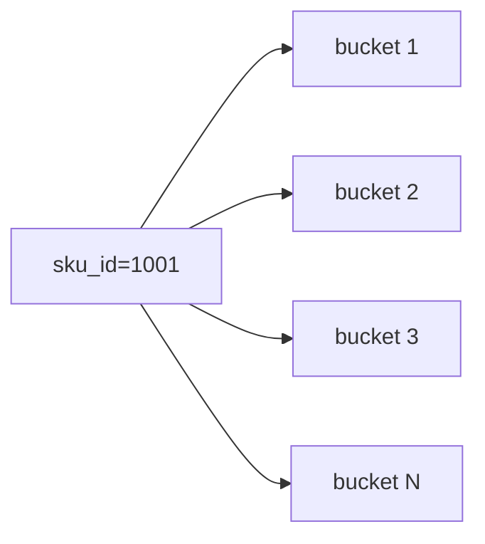

# 库存系统

> 库存系统核心是预占、扣减、释放、防超卖、库存分桶和订单状态联动。

## 一、需求澄清

核心功能：

- 查询库存。
- 下单预占库存。
- 支付成功扣减库存。
- 订单取消释放库存。
- 退款或售后补偿库存。

关键约束：

- 不能超卖。
- 高并发下不能让单行库存成为瓶颈。
- 库存状态要和订单状态最终一致。

## 二、库存模型

常见字段：

```text
sku_id
available_stock
locked_stock
sold_stock
updated_at
```

含义：

- 可售库存。
- 锁定库存。
- 已售库存。

## 三、核心链路



预占库存：

```sql
update sku_stock
set available_stock = available_stock - ?,
    locked_stock = locked_stock + ?
where sku_id = ?
  and available_stock >= ?;
```

支付成功：

```sql
update sku_stock
set locked_stock = locked_stock - ?,
    sold_stock = sold_stock + ?
where sku_id = ?
  and locked_stock >= ?;
```

## 四、防超卖

核心：

- 数据库条件更新。
- Redis 预扣。
- 唯一业务流水。
- 对账补偿。

普通订单：

- MySQL 条件更新可以满足。

秒杀场景：

- Redis 预扣库存挡流量。
- MQ 异步下单。
- MySQL 最终落库。

## 五、库存流水

每次库存变化写流水：

```text
stock_flow
id, sku_id, order_id, flow_type, quantity, biz_id, created_at
```

用途：

- 幂等。
- 对账。
- 排查问题。
- 回滚补偿。

唯一键：

```text
uk_biz_flow(biz_id, flow_type)
```

## 六、库存分桶

热点 SKU 单行更新会成为瓶颈。

分桶：

```text
sku_stock_bucket
sku_id, bucket_id, available_stock
```

扣减时选择一个 bucket。

优点：

- 降低单行锁竞争。

缺点：

- 汇总复杂。
- 库存碎片。
- 释放和对账更复杂。

适合极端热点商品，不是默认方案。



## 七、订单联动

订单超时未支付：

- 关单。
- 释放锁定库存。
- 幂等处理重复关单。

支付成功：

- 扣减锁定库存。
- 如果库存状态异常，进入补偿。

取消订单：

- 未支付取消：释放库存。
- 已支付取消：走退款和售后规则。

## 八、常见坑

- 先查库存再扣库存，非原子，导致超卖。
- 库存变化没有流水，无法对账。
- 释放库存不幂等，重复释放。
- 热点 SKU 单行更新打满数据库。
- Redis 预扣和 MySQL 库存没有对账。
- 订单取消和库存释放顺序不清晰。

## 九、面试表达

```text
库存系统我会区分可售库存、锁定库存和已售库存。
下单时预占库存，用条件 update 保证 available_stock 足够；
支付成功后把 locked 转成 sold；
订单取消或超时则释放 locked。
每次库存变化都写库存流水，用业务唯一键保证幂等，方便对账。
普通场景 MySQL 条件更新即可，秒杀热点场景可以用 Redis 预扣和库存分桶，但要补偿和对账。
```
