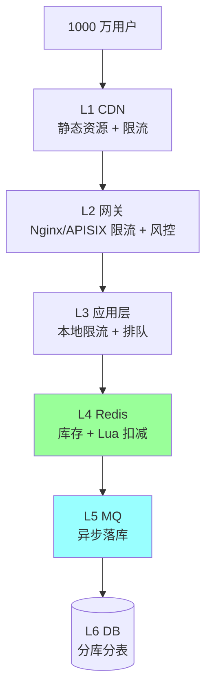
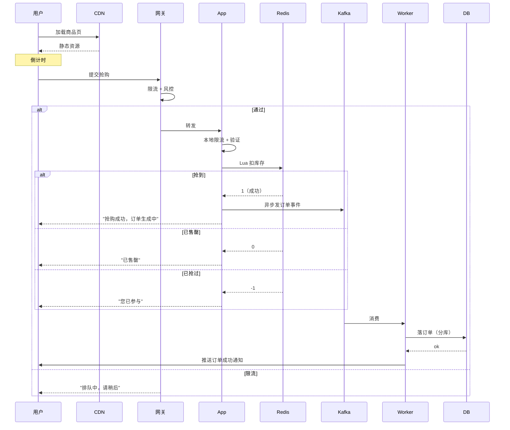
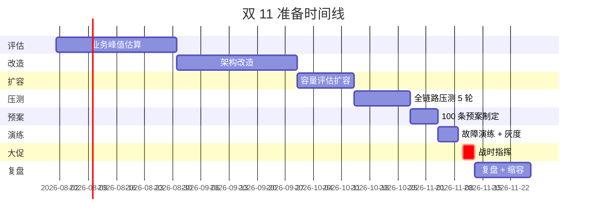
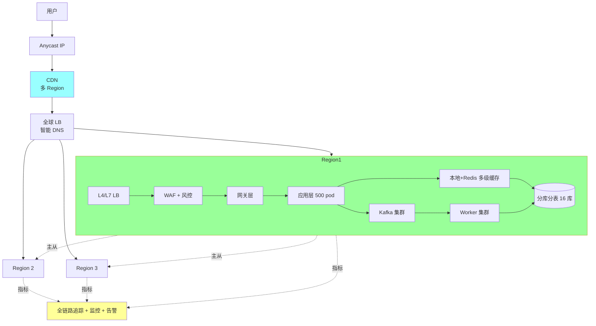
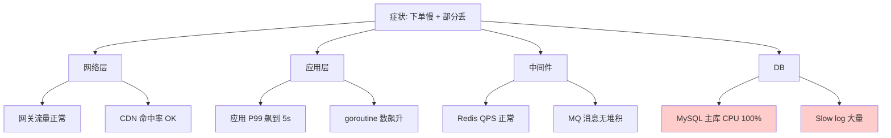
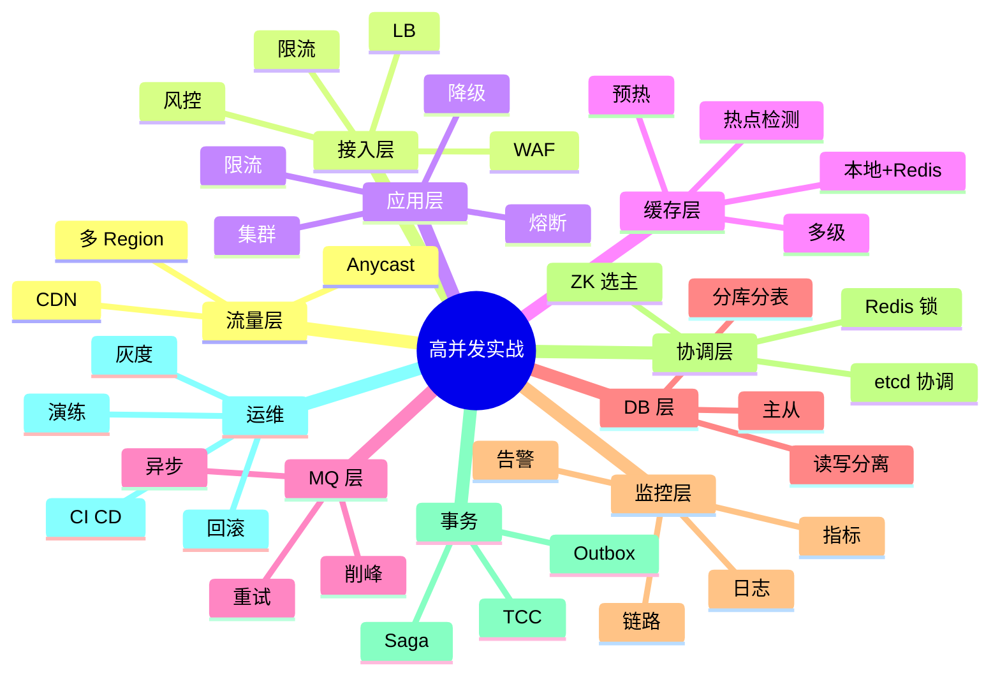

# 高并发综合实战场景

> 把 缓存 / 锁 / 事务 / 限流 / 降级 / 监控 全栈串联到 3 个真实场景：**秒杀 / 大促 / 故障复盘**
>
> 资深面试杀手锏：30 分钟讲清一个完整业务场景，串联所有专题

---

## 一、为什么综合场景能拉开档次

```
散点回答：
  "秒杀要用 Redis"
  "缓存有穿透击穿雪崩"
  "分布式锁可以用 Redis"
  → 像背书

综合场景：
  "我们做秒杀用了 5 层防御 + 3 套降级 + 全链路压测验证"
  → 体现工程化能力 + 取舍意识 + 实战经验
```

**8 年面试**：不是看你知道多少，而是看你**能不能把知识串成完整方案**。

---

# 场景 1：秒杀系统（10 万 QPS）

## 1.1 业务背景

```
场景: 双 11 0 点限时秒杀
  - 商品 100 件
  - 用户 1000 万人涌入
  - 持续 10 分钟
  - 高峰 10 万 QPS
  - 必须不超卖 + 防黄牛 + 用户体验好
```

## 1.2 关键挑战

```
1. 流量洪峰（瞬时 10 万 QPS）
2. 库存不超卖（强一致）
3. 防黄牛 / 刷单
4. DB / Redis 不能挂
5. 用户感知（不能"卡死"）
```

## 1.3 五层防御架构



### 第 1 层：CDN + 静态化

```
- 商品详情页静态化（HTML / 图片 / JS / CSS 进 CDN）
- 秒杀页面预生成
- CDN 边缘节点扛住 80% 流量
- 倒计时用客户端时钟
- 按钮在开始前置灰

效果: 90% 流量在 CDN 截止
```

### 第 2 层：网关层

```
APISIX / Nginx:
  - 整体限流（10w QPS）
  - 用户级限流（1 user/s）
  - IP 限流（10 IP/s）
  - 风控集成（识别黄牛设备）
  - 验证码（滑动 / 行为）
  - JS Challenge（爬虫拦截）

效果: 黄牛 / 爬虫挡掉 50%
```

### 第 3 层：应用层

```
- 多实例集群（k8s 100+ pod）
- 本地令牌桶（每实例限制 QPS）
- 漏桶排队（超过容量返回"排队中"）
- 异步处理（不阻塞）
- 接入熔断 + 降级开关

效果: 流量整形，到 Redis 已经是健康流量
```

### 第 4 层：Redis（核心防超卖）

```lua
-- Lua 脚本原子扣减
local stock = redis.call('GET', KEYS[1])
if not stock or tonumber(stock) <= 0 then
    return 0
end
-- 检查用户是否已抢（防重复）
if redis.call('SISMEMBER', KEYS[2], ARGV[1]) == 1 then
    return -1
end
redis.call('DECR', KEYS[1])
redis.call('SADD', KEYS[2], ARGV[1])
return 1
```

```go
// Go 调用
result, _ := redis.Eval(ctx, luaScript,
    []string{"stock:item123", "user:item123"},
    userID).Int()

if result == 1 {
    // 抢到，发 MQ 异步落库
    mq.Send(OrderEvent{ItemID: "123", UserID: userID})
} else if result == 0 {
    return "已售罄"
} else {
    return "已抢过"
}
```

**关键设计**：
- **Lua 原子**（防超卖）
- **预热库存**（活动前推到 Redis）
- **SET 去重**（防重复抢）
- **Hash Tag** 让 stock 和 user-set 在同 slot

### 第 5 层：MQ 异步落库

```
- Redis 抢到 → 发 Kafka
- 后端 Worker 消费 → 落 DB
- DB 按用户 ID 分库分表（写入分散）
- 失败重试 + 死信队列

效果: DB 平稳处理，每秒处理 100-1000 单足够
```

### 第 6 层：DB 分库分表

```sql
-- 订单表按 user_id hash 分 32 库
-- 商品表分 8 库（按 item_id）
-- 索引: order_no / user_id / created_at

-- 防超卖兜底（DB 也加乐观锁）
UPDATE stock SET count=count-1, version=version+1
WHERE item_id=? AND count>0 AND version=?
```

## 1.4 完整流程时序图



## 1.5 降级方案

```
L1 降级：关闭推荐 / 评论
L2 降级：商品详情走兜底缓存
L3 降级：只允许 VIP 抢
L4 紧急：完全关闭抢购功能（保护下游）

降级开关用配置中心实时推送
```

## 1.6 监控指标

```
业务指标:
  □ 抢购 QPS
  □ 成功率
  □ 超卖数（必须 0）
  □ 订单创建数
  □ 用户投诉数

技术指标:
  □ Redis QPS / 延迟
  □ MQ 堆积
  □ DB 慢查询
  □ 各层限流触发数
  □ 错误率分布
```

## 1.7 容量准备

```
T-90: 业务峰值估算（去年 + 增长 + 营销放大）
T-30: 扩容
  - Redis Cluster 32 节点
  - 应用集群 200 pod
  - DB 32 库
T-14: 全链路压测（5 轮）
T-7: 100+ 预案
T-1: Redis 预热（库存 + 商品信息）
T-0: 战时指挥
T+1: 缩容
```

## 1.8 真实事故案例

**事故**：某次秒杀 Redis 集群某节点挂

**应对**：
```
1. T+0 监控告警
2. 切换到备份 Redis
3. 部分库存数据 fallback 用 DB
4. 限流加大保护 DB
5. 用户感知"加载中"
6. 5 分钟恢复

复盘:
- 单节点 SPOF
- 改进: 主从切换自动化 + 业务降级开关
```

## 1.9 串联的知识点

```
✅ CDN（11-cdn/02 缓存策略）
✅ 限流（distributed/06）
✅ 风控（13-engineering/05）
✅ Redis Lua（redis/06 + redis/08）
✅ MQ 削峰（mq/01-04）
✅ 分库分表（mysql/12）
✅ 防超卖锁（distributed/04）
✅ 降级（architecture/02）
✅ 监控（07-microservice/07）
✅ 容量规划（architecture/05）
```

---

# 场景 2：双 11 大促（全栈准备）

## 2.1 业务背景

```
场景: 公司核心业务在双 11
  - 平时 1 万 QPS
  - 双 11 30 万 QPS（30x）
  - 持续 24 小时
  - 含秒杀 / 拼团 / 满减 / 多种活动
  - 必须 99.99% 可用
```

## 2.2 准备时间线



## 2.3 五大维度准备

### 1. 容量准备

```
基础容量:
  应用: 50 → 500 pod
  Redis: 8 → 32 节点
  MySQL: 8 → 16 库
  Kafka: 8 → 32 分区
  CDN: 平时 5Tbps → 50Tbps
  网络: 10Gbps → 100Gbps

存储:
  对象存储扩容
  日志存储扩容（10x）
  监控存储扩容
```

### 2. 性能优化

```
DB:
  - 慢查询治理
  - 索引优化
  - 大事务拆分

缓存:
  - 多级缓存全面接入
  - 热点 key 自动迁移
  - Redis 集群分片均衡

代码:
  - 对象池化
  - 连接池调优
  - 异步化非核心路径
```

### 3. 全链路压测

```
T-30 第 1 轮: 单服务压测
T-21 第 2 轮: 链路压测（核心链路）
T-14 第 3 轮: 全链路压测（生产环境影子表）
T-7 第 4 轮: 全链路 + 故障注入
T-3 第 5 轮: 最终验证
```

### 4. 预案 + 降级

```
分级预案（100+ 条）:

L1（核心） - 必保:
  - 下单
  - 支付
  - 库存

L2（重要） - 可降级:
  - 推荐 → 热门榜
  - 评论 → 缓存兜底
  - 个性化 → 默认模板

L3（边缘） - 可关闭:
  - 商品详情某些字段
  - 用户头像
  - 弹窗活动
```

### 5. 战时指挥

```
作战团队:
  - 总指挥（1 人，全权决策）
  - 各业务线 owner
  - 中间件值班
  - DBA 值班
  - 网络 / 安全 值班

工具:
  - 实时大盘（30+ 关键指标）
  - 一键降级开关
  - 流量切换控制台
  - 战时通信群（5 分钟响应）
```

## 2.4 大促架构图



## 2.5 故障演练

**T-7 真实演练项目**：

```
□ 单 Redis 节点挂
□ 单 MySQL 主库挂 + 切换
□ 整个 AZ 故障 → 切其他 Region
□ Kafka 整集群挂（消息丢 / 退化降级）
□ 第三方支付通道挂 → 切备用
□ DDoS 攻击模拟
□ DNS 劫持
□ 限流触发 → 验证降级生效
□ 数据库慢查询模拟
□ 网络分区
```

## 2.6 实战经验

### 经验 1：限流要分层

```
✅ CDN（百万 QPS）
   ↓
✅ 网关（10 万 QPS）
   ↓
✅ 应用层（每 pod 1 千 QPS）
   ↓
✅ Redis（10 万 QPS）
   ↓
✅ DB（1 千 QPS / 库）
```

每层都有自己的限流，**多层叠加防御**。

### 经验 2：降级开关必须实时生效

```
不能改代码
不能重启
不能等几分钟
→ 用配置中心 + 长轮询，秒级生效
```

### 经验 3：监控比业务重要

```
大促期间最忌讳：
  - 系统挂了不知道
  - 知道了不知道哪里挂
  - 知道哪里挂不知道影响多大
  - 知道影响多大不知道怎么修

→ 必须有：实时大盘 + 告警 + Runbook + 战时指挥
```

### 经验 4：演练 > 文档

```
预案写在文档没用
必须真实演练（混沌工程）
让团队肌肉记忆
真出事 5 分钟内响应
```

## 2.7 真实事故案例

**事故**：某年双 11 第 3 小时支付通道挂

**应对**：
```
T+0 0s: 监控告警
T+0 30s: 战时指挥确认
T+0 1m: 切换备用支付通道
T+0 5m: 旧订单异步重试
T+0 10m: 全部恢复

事后:
  - 备用通道平时演练（每月）
  - 切换自动化（不依赖人工）
  - 第三方故障告警提前
```

---

# 场景 3：故障复盘（线上事故全栈定位）

## 3.1 事故场景

```
事件: 某周二下午 3 点
  - 用户反馈下单慢 / 失败
  - 部分订单"成功"但 DB 没记录
  - 投诉激增
  - 客服爆满
```

## 3.2 排查流程

### 第 1 步：止血（不超过 15 分钟）

```
T+0 3:00 用户投诉
T+0 3:02 监控告警（错误率超阈值）
T+0 3:05 战时指挥成立
T+0 3:08 启动一级降级（关闭推荐 / 评论）
T+0 3:10 启动限流（保护 DB）
T+0 3:15 部分用户恢复正常下单
```

**止血优先于定位**。

### 第 2 步：分层定位



**定位到 DB 主库**。

### 第 3 步：DB 排查

```sql
-- 看正在跑的查询
SHOW PROCESSLIST;

-- 大量类似:
SELECT * FROM orders
WHERE user_id IN (...大量 ID...)
ORDER BY created_at DESC;

-- EXPLAIN
EXPLAIN SELECT * FROM orders WHERE user_id IN (...);
-- type: ALL（全表扫）
-- 行数: 1000 万
```

**根因**：某营销服务大批量查询用户订单，没用索引。

### 第 4 步：临时修复

```
1. 杀掉慢查询（KILL）
2. 限流营销服务
3. DB 恢复
4. 5 分钟内全部业务恢复
```

### 第 5 步：根因分析（5 Whys）

```
Why 1: 为什么 DB 挂？
  → 慢查询打满 CPU

Why 2: 为什么慢查询？
  → 全表扫 1000 万行

Why 3: 为什么没用索引？
  → 营销新服务上线，SQL 没 review

Why 4: 为什么 SQL 没 review？
  → 流程缺失，新人不知道要做

Why 5: 为什么流程缺失？
  → 团队没写规范，靠口口相传
```

### 第 6 步：长期改进

```
□ DB SQL Review 流程化（CI 集成 SQL 检查）
□ 慢查询自动告警
□ 限流自动触发（DB 负载高自动降级）
□ 新服务上线检查清单（含 SQL Review）
□ 团队 onboarding 加 DB 规范培训
□ 故障响应自动化
```

### 第 7 步：复盘文档（STAR）

```markdown
# 故障复盘：2026-XX-XX 下单异常

## 事件描述（Situation）
2026-XX-XX 15:00-15:15，用户下单成功率从 99.9% 降到 70%。

## 影响（Impact）
- 用户：约 5 万次下单失败
- 业务：损失约 100 万 GMV
- 客诉：500+

## 时间线（Timeline）
15:00 用户开始反馈
15:02 监控告警
15:05 战时指挥成立
15:08 一级降级
15:10 限流
15:15 服务恢复
15:30 根因定位
16:00 完整恢复

## 根因（Root Cause）
营销服务新上线一个查询，未走索引，全表扫主库导致 CPU 100%。

## 临时修复（Action）
1. KILL 慢查询
2. 限流营销服务
3. 重启降级开关

## 长期改进（Result）
- [ ] DB SQL Review 流程化（owner: 张三 / 2 周）
- [ ] 慢查询自动告警（owner: 李四 / 1 周）
- [ ] 限流自动触发（owner: 王五 / 1 月）
- [ ] 新服务上线 checklist（owner: 架构组 / 2 周）
```

## 3.3 排查工具速查

```
症状: 慢
工具: pprof / arthas / wireshark / mtr

症状: 错误率高
工具: 链路追踪 / 日志聚合 / Prometheus

症状: DB 慢
工具: SHOW PROCESSLIST / EXPLAIN / 慢查询日志 / pt-query-digest

症状: Redis 慢
工具: SLOWLOG / --bigkeys / --hotkeys / MONITOR

症状: 内存涨
工具: pprof heap / jmap / top / dmesg

症状: 网络问题
工具: tcpdump / netstat / ss / mtr / curl

症状: 不知道哪里出问题
工具: 4 大黄金信号 dashboard
```

详见 [02-os/15-cpu-memory-troubleshooting](../02-os/15-cpu-memory-troubleshooting.md) 等。

## 3.4 故障应急 Runbook

```markdown
# 线上故障应急 Runbook

## 1. 接到告警 / 用户反馈
- [ ] 看监控大盘
- [ ] 通知战时指挥
- [ ] 评估影响

## 2. 止血（< 15 分钟）
- [ ] 限流
- [ ] 降级
- [ ] 切换备用
- [ ] 必要时回滚

## 3. 定位
- [ ] 看 4 大黄金信号
- [ ] 链路追踪定位服务
- [ ] 查日志看错误栈
- [ ] DB / Redis / MQ 排查

## 4. 修复
- [ ] 临时修复（patch / 重启）
- [ ] 验证恢复
- [ ] 全部业务恢复

## 5. 复盘
- [ ] 写复盘文档（STAR + 5 Whys）
- [ ] 定改进项 + Owner + DDL
- [ ] 全公司共享教训
- [ ] 跟进改进项落地
```

---

# 综合：知识图谱

## 4.1 全栈技术串联



## 4.2 一题串多模块

```
"设计一个秒杀系统" 涉及:
  - CDN（11-cdn）
  - 限流（distributed/06）
  - Redis Lua（redis/06,08）
  - MQ（mq/03）
  - 分库分表（mysql/12）
  - 防超卖锁（distributed/04）
  - 降级（architecture/02）
  - 监控（microservice/07）
  - 容量规划（architecture/05）

→ 把每个模块的知识点串到这个场景
```

## 4.3 高并发场景对照表

| 场景 | 关键技术 | 难点 | 主篇 |
| --- | --- | --- | --- |
| 秒杀 | Redis Lua + MQ + 分库 | 防超卖 + 限流 | 本篇 + system-design/03 |
| 大促 | 多级缓存 + 限流 + 多活 | 容量评估 + 演练 | 本篇 + architecture/05 |
| 直播 | CDN + WebRTC + 边缘 | 1 推百万拉 | cdn/07 + system-design/05 |
| Feed | 推拉结合 + 缓存 | 大 V 性能 | system-design/06 |
| IM | WebSocket + 长连接 + Pub-Sub | 推送可靠 | system-design/08 |
| 支付 | 强一致 + 对账 | 不能错钱 | system-design/13 + mysql/17 |

---

# 五、面试综合题套路

## 5.1 综合题答题框架（25-30 分钟）

```
1. 需求确认（3 分钟）
   - 业务规模（QPS / 数据量）
   - 核心功能
   - 非功能（一致性 / 延迟 / 可用性）
   - 边界（不做什么）

2. 容量估算（3 分钟）
   - 业务峰值
   - 数据量
   - 带宽

3. 整体架构（10 分钟）
   - 架构图
   - 数据模型
   - 关键链路时序图

4. 关键技术取舍（5 分钟）
   - 缓存策略 + 一致性
   - 锁选型
   - 事务方案
   - 限流降级

5. 难点 + 风险（5 分钟）
   - 主要难点
   - 应对方案
   - 演进路径
```

## 5.2 高频综合题

### Q1: 设计秒杀系统（细节问到 30 分钟）

按本篇 场景 1 完整答。

### Q2: 设计支付系统（强一致 + 对账）

```
关键:
  - 强一致 → TCC / Seata
  - 唯一支付单（业务订单 + 唯一索引）
  - 状态机
  - 对账（T+1 + 实时）
  - 多渠道路由
```

### Q3: 设计订单系统（按 ddd_order_example 答）

详见 [14-projects/05-ddd-order-example.md](../14-projects/05-ddd-order-example.md)。

### Q4: 双 11 大促怎么准备？

按本篇 场景 2 完整答。

### Q5: 你处理过最严重的线上故障？

按本篇 场景 3 STAR 答。

### Q6: 一致性怎么保？（开放）

按 99-meta/01-cross-topic-index#四 数据一致性专题答。

### Q7: 缓存怎么设计？（开放）

```
1. 用什么缓存（Redis / 本地 / CDN）
2. 几级缓存
3. 一致性方案
4. 三大问题应对
5. 监控
```

### Q8: 高可用怎么做？（开放）

按 99-meta/01-cross-topic-index#六 高可用专题答。

### Q9: 限流熔断怎么做？

```
1. 多层限流（CDN / 网关 / 应用 / 中间件）
2. 算法（令牌桶 / 滑窗）
3. 分布式（Redis Lua）
4. 熔断（Hystrix / Sentinel / gobreaker）
5. 降级（预案 + 一键开关）
```

### Q10: 监控告警怎么做？

```
1. 四大黄金信号（Latency / Traffic / Errors / Saturation）
2. RED / USE 方法
3. 工具栈（Prometheus + Grafana + Loki + Jaeger）
4. 告警分级（P0/P1/P2/P3）
5. Runbook + 自动化处置
```

---

# 六、进阶：把多个场景串起来

资深面试常见追问：

```
> "你做的秒杀系统是这样，那如果突然 Redis 集群挂了怎么办？"
→ 串到故障复盘 + 多级缓存 + 降级

> "如果用户量翻 10 倍呢？"
→ 串到容量规划 + 架构演进

> "如果跨地域怎么改？"
→ 串到多活 + 单元化

> "如果业务要做秒杀 + 拼团 + 满减组合怎么扩展？"
→ 串到 DDD + 微服务拆分

→ 资深 = 能不断深挖 + 横向串联
```

---

# 七、避坑

## 坑 1：方案太完美

```
❌ 一上来就讲多活 + 单元化 + Mesh + 微服务
   → 面试官知道你纸上谈兵

✅ 按规模演进
   → 现在 1 万 QPS 就用 X
   → 涨到 10 万用 Y
   → 涨到 100 万用 Z
```

## 坑 2：只讲技术不讲业务

```
❌ "我们用 Kafka 做异步"
✅ "为了让用户感知快，下单接口 50ms 返回，
    后续的扣库存 / 发券 / 通知 用 Kafka 异步"
```

## 坑 3：不讲监控 + 演练

```
❌ "上线就好了"
✅ "上线 + 监控 + 演练 + Runbook + 复盘 完整闭环"
```

## 坑 4：避谈失败

```
❌ "我们方案完美"
✅ "刚开始踩了 X 坑，后来改成 Y 解决"
   → 体现成长
```

## 坑 5：忽视成本

```
❌ "用 100 台机器扛"
✅ "评估成本：100 台 × 10w = 1000w/年
    优化后 30 台够用"
```

---

# 八、学习路径

```
1. 看本篇场景理解综合应用
2. 各专题深度学习（缓存 / 锁 / 事务 / ...）
3. 看 system-design/* 各种系统设计题
4. 看 14-projects/* 真实项目复盘
5. 自己练 1-2 个完整场景（写设计文档）
6. 找朋友模拟面试
```

---

# 九、面试加分点

- 综合题用 **5 步框架**（需求 / 容量 / 架构 / 取舍 / 风险）
- **流量分层防御**（CDN → 网关 → 应用 → 缓存 → DB）
- **限流分多层叠加**（每层都有限流）
- **降级预案 + 一键开关**（实时生效）
- **演练 > 文档**（混沌工程）
- **战时指挥** + Runbook + 复盘
- **故障 STAR + 5 Whys** 标准答辩
- **容量准备 T-90 → T+7**
- **5 层防御**（前端 → 接入 → 应用 → 缓存 → MQ）
- **不讲完美方案**，讲演进路径
- **量化数据**（QPS / 延迟 / 命中率 / 成本）
- 串联 **缓存 + 锁 + 事务 + 限流 + 降级 + 监控** 全栈
- 主动暴露**踩过的坑**和**改进经验**
